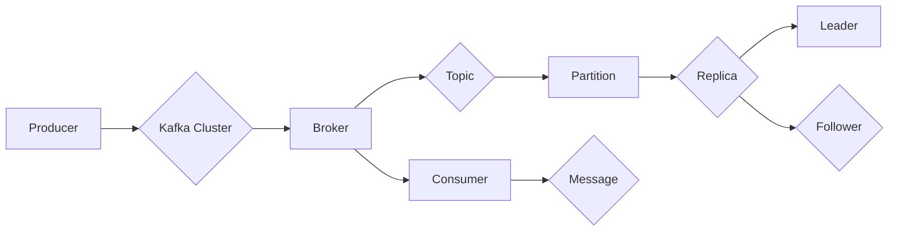

# Kafka原理与代码实例讲解

作者：禅与计算机程序设计艺术 / Zen and the Art of Computer Programming

## 1. 背景介绍
### 1.1 问题的由来

随着互联网技术的飞速发展，数据量呈指数级增长，传统的数据处理方式已经无法满足日益增长的数据处理需求。如何高效地处理海量数据，成为了大数据领域亟待解决的问题。Apache Kafka应运而生，作为一种高吞吐量、可扩展的分布式发布/订阅消息系统，Kafka成为了大数据生态中不可或缺的一部分。

### 1.2 研究现状

Kafka自2008年由LinkedIn开源以来，得到了业界的广泛认可。随着Kafka生态的不断丰富，越来越多的企业将其应用于数据采集、实时计算、日志收集等场景。目前，Kafka已经成为大数据领域的标准消息队列组件，与Spark、Flink、HBase等大数据技术紧密集成，形成了强大的数据处理能力。

### 1.3 研究意义

研究Kafka的原理和应用，对于大数据开发者和架构师来说具有重要意义：

1. **提高数据处理效率**：Kafka能够实现高吞吐量、低延迟的数据处理，满足海量数据实时处理的业务需求。
2. **保证数据一致性**：Kafka的分布式架构和副本机制，确保数据不会丢失，保障数据的一致性。
3. **简化系统架构**：Kafka可以将数据采集、实时计算、日志收集等功能模块解耦，简化系统架构，提高系统扩展性和可维护性。
4. **降低开发成本**：Kafka的成熟生态和丰富的工具，可以降低大数据项目的开发成本。

### 1.4 本文结构

本文将从Kafka的原理、核心架构、代码实例等方面进行详细讲解，旨在帮助读者全面了解Kafka技术，并能够将其应用于实际项目中。

## 2. 核心概念与联系
Kafka的核心概念主要包括：

- **Producer**：生产者，负责将消息发送到Kafka集群。
- **Consumer**：消费者，负责从Kafka集群中获取消息并进行处理。
- **Broker**：代理节点，Kafka集群中的服务器节点，负责存储消息并处理客户端的请求。
- **Topic**：主题，Kafka中的消息分类，类似于数据库中的表。
- **Partition**：分区，一个主题可以包含多个分区，每个分区存储一组有序的消息。
- **Replica**：副本，为了保证数据的可靠性，每个分区在Kafka集群中都会有多个副本。
- **Leader**：主副本，每个分区只有一个主副本，负责处理该分区的读写请求。
- **Follower**：从副本，用于备份主副本，在主副本发生故障时可以快速切换。

Kafka中的核心概念之间的联系如下：



## 3. 核心算法原理 & 具体操作步骤
### 3.1 算法原理概述

Kafka的核心算法主要包括：

- **Producer端**：采用消息序列化和批处理等技术，提高消息发送效率。
- **Broker端**：采用分区、副本、主从副本机制，保证数据的高可用性和可靠性。
- **Consumer端**：采用拉取式消费和偏移量机制，实现消息的顺序消费和可靠性保障。

### 3.2 算法步骤详解

#### 3.2.1 Producer端

1. **序列化消息**：生产者将消息序列化为二进制格式，以便于网络传输。
2. **批量发送**：生产者将消息批量发送到Kafka集群，减少网络开销。
3. **选择Partition**：生产者根据消息键或分区策略选择目标分区。
4. **发送请求**：生产者向Kafka集群发送消息发送请求，并等待响应。

#### 3.2.2 Broker端

1. **存储消息**：Kafka将消息存储在磁盘上，每个Partition存储一个有序的消息列表。
2. **分区副本**：Kafka为每个Partition创建多个副本，并分散存储在集群的不同节点上。
3. **选举Leader**：Kafka通过Zookeeper选主机制，每个Partition只有一个Leader，负责处理该分区的读写请求。
4. **处理请求**：Broker接收生产者发送的消息发送请求，并将消息写入对应的Partition。
5. **副本同步**：Follower从Leader拉取消息，并同步副本数据。

#### 3.2.3 Consumer端

1. **拉取消息**：消费者从Kafka集群拉取消息，并处理消息。
2. **偏移量机制**：消费者通过偏移量机制记录消费进度，保证消息的顺序消费和可靠性。

### 3.3 算法优缺点

#### 3.3.1 优点

- **高吞吐量**：Kafka采用批量发送、异步处理等技术，实现高吞吐量数据处理。
- **高可用性**：Kafka的副本机制和选主机制，保证数据的高可用性。
- **可扩展性**：Kafka集群可以水平扩展，适应不断增长的数据量。
- **顺序保证**：Kafka保证消息在Partition内的顺序消费。

#### 3.3.2 缺点

- **单节点性能瓶颈**：Kafka的单节点性能瓶颈在磁盘I/O和网络带宽上。
- **分区锁竞争**：在高并发情况下，分区锁竞争可能导致性能瓶颈。
- **跨分区事务**：Kafka不支持跨分区的分布式事务。

### 3.4 算法应用领域

Kafka在以下领域得到广泛应用：

- **日志收集**：Kafka可以用于收集各种日志数据，如系统日志、业务日志等。
- **实时计算**：Kafka可以与Spark、Flink等实时计算框架集成，实现实时数据处理和分析。
- **数据同步**：Kafka可以用于数据同步，将数据从源头同步到目标系统。
- **事件流处理**：Kafka可以用于构建事件驱动型应用，实现事件流的实时处理。

## 4. 数学模型和公式 & 详细讲解 & 举例说明
### 4.1 数学模型构建

Kafka的数学模型主要包括：

- **消息发送速率**：$R$ 表示单位时间内发送的消息数量。
- **消息大小**：$S$ 表示单个消息的平均大小。
- **网络带宽**：$B$ 表示网络带宽。
- **磁盘I/O**：$I$ 表示磁盘I/O性能。

### 4.2 公式推导过程

假设消息发送速率为 $R$，消息大小为 $S$，网络带宽为 $B$，磁盘I/O为 $I$，则有：

$$
\text{吞吐量} = \frac{R \times S}{B}
$$

### 4.3 案例分析与讲解

假设某企业使用Kafka收集系统日志，每天产生1亿条日志，每条日志平均大小为1KB，网络带宽为1Gbps，磁盘I/O性能为1MB/s。则该企业Kafka的吞吐量为：

$$
\text{吞吐量} = \frac{10^8 \times 1 \times 10^3}{10^9} = 100 \text{MB/s}
$$

可见，该企业的Kafka系统每天可以处理100MB的数据。

### 4.4 常见问题解答

**Q1：Kafka如何保证消息的顺序性？**

A：Kafka保证消息在Partition内的顺序性。生产者发送消息时，会指定目标Partition，Kafka会按照消息的发送顺序将消息写入该Partition。消费者从Partition中读取消息时，也会按照顺序消费。

**Q2：Kafka如何保证消息的可靠性？**

A：Kafka采用副本机制和选主机制保证消息的可靠性。每个Partition都会在Kafka集群中创建多个副本，并分散存储在集群的不同节点上。在主副本发生故障时，Kafka会从副本中选择一个新的主副本，确保消息的可靠性。

**Q3：Kafka如何处理数据积压？**

A：Kafka通过增加 Partition数量、提高网络带宽、优化磁盘I/O性能等方式，缓解数据积压问题。此外，还可以通过调整生产者和消费者的配置，如增加生产者数量、提高消费者并发度等，提高系统吞吐量。

## 5. 项目实践：代码实例和详细解释说明
### 5.1 开发环境搭建

为了演示Kafka的使用，我们需要搭建以下开发环境：

- Java开发环境
- Maven或Gradle构建工具
- Kafka客户端库（如Kafka Java Client）

### 5.2 源代码详细实现

以下是一个简单的Kafka生产者和消费者的Java代码示例：

**Kafka生产者示例**：

```java
import org.apache.kafka.clients.producer.KafkaProducer;
import org.apache.kafka.clients.producer.ProducerRecord;
import org.apache.kafka.common.serialization.StringSerializer;

import java.util.Properties;

public class KafkaProducerExample {
    public static void main(String[] args) {
        Properties props = new Properties();
        props.put("bootstrap.servers", "localhost:9092");
        props.put("key.serializer", StringSerializer.class.getName());
        props.put("value.serializer", StringSerializer.class.getName());

        KafkaProducer<String, String> producer = new KafkaProducer<>(props);

        for (int i = 0; i < 10; i++) {
            String topic = "test-topic";
            String key = "key-" + i;
            String value = "value-" + i;
            ProducerRecord<String, String> record = new ProducerRecord<>(topic, key, value);
            producer.send(record);
            System.out.println("Sent: (" + key + ", " + value + ")");
        }

        producer.close();
    }
}
```

**Kafka消费者示例**：

```java
import org.apache.kafka.clients.consumer.ConsumerConfig;
import org.apache.kafka.clients.consumer.ConsumerRecord;
import org.apache.kafka.clients.consumer.KafkaConsumer;
import org.apache.kafka.common.serialization.StringDeserializer;

import java.util.Collections;
import java.util.Properties;

public class KafkaConsumerExample {
    public static void main(String[] args) {
        Properties props = new Properties();
        props.put(ConsumerConfig.BOOTSTRAP_SERVERS_CONFIG, "localhost:9092");
        props.put(ConsumerConfig.GROUP_ID_CONFIG, "test-group");
        props.put(ConsumerConfig.KEY_DESERIALIZER_CLASS_CONFIG, StringDeserializer.class.getName());
        props.put(ConsumerConfig.VALUE_DESERIALIZER_CLASS_CONFIG, StringDeserializer.class.getName());

        KafkaConsumer<String, String> consumer = new KafkaConsumer<>(props);
        consumer.subscribe(Collections.singletonList("test-topic"));

        while (true) {
            ConsumerRecord<String, String> record = consumer.poll(100);
            if (record != null) {
                System.out.printf("offset = %d, key = %s, value = %s%n", record.offset(), record.key(), record.value());
            } else {
                break;
            }
        }

        consumer.close();
    }
}
```

### 5.3 代码解读与分析

**Kafka生产者示例**：

- 首先，创建Kafka生产者的配置对象，配置Kafka集群地址、序列化器等。
- 然后，创建Kafka生产者实例，并发送10条消息到"test-topic"主题。
- 最后，关闭Kafka生产者实例。

**Kafka消费者示例**：

- 首先，创建Kafka消费者的配置对象，配置Kafka集群地址、消费者组ID、反序列化器等。
- 然后，订阅"test-topic"主题。
- 最后，循环读取并打印消息。

### 5.4 运行结果展示

运行以上示例代码，将在控制台输出类似以下信息：

```
offset = 0, key = key-0, value = value-0
offset = 1, key = key-1, value = value-1
offset = 2, key = key-2, value = value-2
...
offset = 9, key = key-9, value = value-9
```

这表明Kafka生产者和消费者已经成功运行，并能够相互通信。

## 6. 实际应用场景
### 6.1 日志收集

Kafka可以用于收集各种日志数据，如系统日志、业务日志等。通过将日志数据发送到Kafka，可以方便地进行日志分析、监控和故障排查。

### 6.2 实时计算

Kafka可以与Spark、Flink等实时计算框架集成，实现实时数据处理和分析。例如，可以将订单数据发送到Kafka，再由Spark Streaming进行实时分析，从而实现实时订单监控。

### 6.3 数据同步

Kafka可以用于数据同步，将数据从源头同步到目标系统。例如，可以将数据库数据同步到Kafka，再由其他系统消费Kafka中的数据，实现数据同步。

### 6.4 事件流处理

Kafka可以用于构建事件驱动型应用，实现事件流的实时处理。例如，可以将用户行为数据发送到Kafka，再由流处理框架进行分析和挖掘，实现用户画像、个性化推荐等功能。

## 7. 工具和资源推荐
### 7.1 学习资源推荐

- Kafka官方文档：https://kafka.apache.org/documentation.html
- 《Kafka权威指南》：https://www.manning.com/books/kafka-the-definitive-guide
- 《深入理解Kafka》：https://github.com/wuchong/kafka-analysis

### 7.2 开发工具推荐

- Kafka Server Manager：https://github.com/Oneite/kafka-server-manager
- Kafka Mirror Maker：https://github.com/LinkedIn/mirror-maker
- Kafka Manager：https://github.com/yahoo/kafka-manager

### 7.3 相关论文推荐

- Apache Kafka: A Distributed Streaming Platform

### 7.4 其他资源推荐

- Apache Kafka GitHub仓库：https://github.com/apache/kafka
- Apache Kafka社区论坛：https://discuss.apache.org/c/kafka

## 8. 总结：未来发展趋势与挑战
### 8.1 研究成果总结

本文从Kafka的原理、核心架构、代码实例等方面进行了详细讲解，帮助读者全面了解Kafka技术。通过本文的学习，读者可以掌握Kafka的安装、配置、使用方法，并将其应用于实际项目中。

### 8.2 未来发展趋势

1. **Kafka生态持续丰富**：随着Kafka生态的不断发展，将涌现更多与Kafka相关的工具、框架和平台。
2. **Kafka与其他大数据技术的深度融合**：Kafka将与Spark、Flink、HBase等大数据技术进行更深入的融合，实现更高效的数据处理。
3. **Kafka性能和可扩展性进一步提升**：通过优化算法、改进数据结构、提升硬件性能等方式，Kafka的性能和可扩展性将得到进一步提升。

### 8.3 面临的挑战

1. **性能瓶颈**：随着数据量的不断增长，Kafka的单节点性能瓶颈可能成为制约其发展的瓶颈。
2. **跨分区事务**：Kafka目前不支持跨分区的分布式事务，需要进一步改进。
3. **数据安全性**：随着数据安全意识的提高，如何保证Kafka中数据的机密性和完整性将成为重要课题。

### 8.4 研究展望

为了应对上述挑战，未来的研究可以从以下几个方面展开：

1. **提升单节点性能**：通过优化算法、改进数据结构、提升硬件性能等方式，提升Kafka的单节点性能。
2. **支持跨分区事务**：通过改进数据结构、优化算法等方式，实现Kafka的跨分区事务支持。
3. **加强数据安全**：通过加密、访问控制、审计等手段，加强Kafka中数据的机密性和完整性。

相信通过不断的努力，Kafka将继续在分布式消息队列领域发挥重要作用，为大数据技术的发展和应用提供有力支持。

## 9. 附录：常见问题与解答

**Q1：Kafka与RabbitMQ、ActiveMQ等消息队列的区别是什么？**

A：Kafka与RabbitMQ、ActiveMQ等消息队列的区别主要体现在以下几个方面：

- **数据模型**：Kafka使用分区（Partition）和副本（Replica）机制，而RabbitMQ、ActiveMQ使用队列（Queue）机制。
- **消息顺序性**：Kafka保证Partition内消息的顺序性，而RabbitMQ、ActiveMQ保证队列内消息的顺序性。
- **性能**：Kafka采用批量发送、异步处理等技术，实现高吞吐量数据处理，而RabbitMQ、ActiveMQ的性能相对较低。

**Q2：Kafka如何保证数据一致性？**

A：Kafka采用副本机制和选主机制保证数据一致性。每个Partition都会在Kafka集群中创建多个副本，并分散存储在集群的不同节点上。在主副本发生故障时，Kafka会从副本中选择一个新的主副本，确保数据的一致性。

**Q3：Kafka如何处理消息积压？**

A：Kafka通过增加Partition数量、提高网络带宽、优化磁盘I/O性能等方式，缓解数据积压问题。此外，还可以通过调整生产者和消费者的配置，如增加生产者数量、提高消费者并发度等，提高系统吞吐量。

**Q4：Kafka如何保证消息的可靠性？**

A：Kafka采用副本机制和选主机制保证消息的可靠性。每个Partition都会在Kafka集群中创建多个副本，并分散存储在集群的不同节点上。在主副本发生故障时，Kafka会从副本中选择一个新的主副本，确保消息的可靠性。

**Q5：Kafka如何处理消息丢失？**

A：Kafka通过副本机制和选主机制保证消息的可靠性。在主副本发生故障时，Kafka会从副本中选择一个新的主副本，确保消息不会丢失。

**Q6：Kafka如何处理消息重复？**

A：Kafka通过序列号保证消息的唯一性。每个Partition内的消息都有一个唯一的序列号，可以用于判断消息是否重复。

**Q7：Kafka如何处理消息乱序？**

A：Kafka保证Partition内消息的顺序性，但无法保证跨Partition的消息顺序。如果需要保证跨Partition的消息顺序，可以采用特定的消息序列化方式。

**Q8：Kafka如何处理消息延时？**

A：Kafka可以配置消息的副本数量、复制因子等参数，以控制消息的延时。此外，还可以通过调整生产者和消费者的配置，如提高消费者并发度等，减少消息的延时。

**Q9：Kafka如何处理消息积压？**

A：Kafka通过增加Partition数量、提高网络带宽、优化磁盘I/O性能等方式，缓解数据积压问题。此外，还可以通过调整生产者和消费者的配置，如增加生产者数量、提高消费者并发度等，提高系统吞吐量。

**Q10：Kafka如何处理消息过期？**

A：Kafka可以配置消息的过期时间，当消息超过过期时间后，会被自动删除。此外，还可以通过调整生产者和消费者的配置，如设置消息的自动确认时间等，避免消息过期。