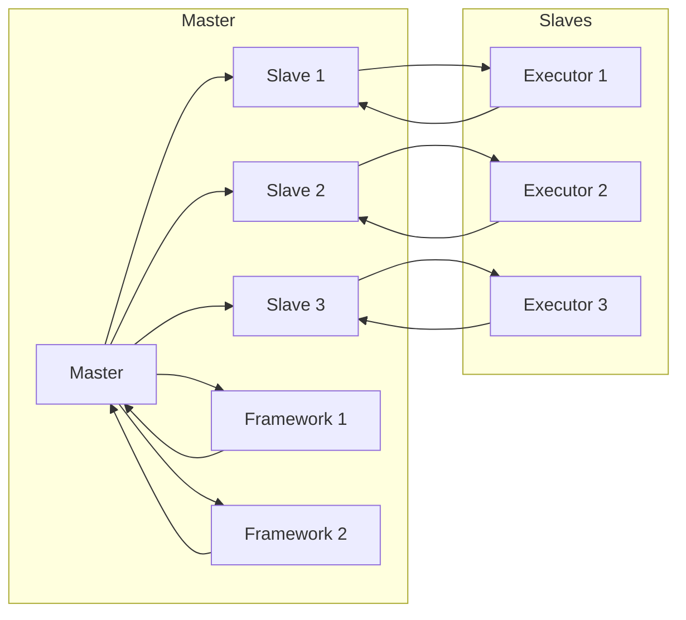

# Mesos原理与代码实例讲解

作者：禅与计算机程序设计艺术 / Zen and the Art of Computer Programming

## 1. 背景介绍
### 1.1 问题的由来
随着云计算和大数据技术的发展，分布式计算平台的需求日益增长。在分布式系统中，如何高效地管理资源、调度任务以及保证系统的稳定性和可靠性，成为了关键问题。Mesos作为一种分布式资源调度框架，应运而生。

### 1.2 研究现状
目前，分布式资源调度框架主要有两种类型：基于作业的调度（如Hadoop YARN）和基于容器的调度（如Docker Swarm）。Mesos属于后者，它允许用户在同一套资源池中运行不同的框架，如 Marathon、Mesos-Docker、Mesos-Kubernetes等。

### 1.3 研究意义
Mesos作为一种高性能、可扩展的分布式资源调度框架，在分布式系统开发中具有重要的意义：
- 提高资源利用率：Mesos可以将资源池中的资源合理分配给不同的任务，避免资源闲置。
- 灵活支持多种框架：Mesos可以运行多种不同的计算框架，满足不同场景的需求。
- 提升系统稳定性：Mesos通过多副本机制和故障转移机制，保证系统的稳定运行。

### 1.4 本文结构
本文将介绍Mesos的原理和代码实例，内容安排如下：
- 第2章：介绍Mesos的核心概念和架构。
- 第3章：讲解Mesos的算法原理和具体操作步骤。
- 第4章：分析Mesos的数学模型和公式，并举例说明。
- 第5章：给出Mesos的代码实例，并对关键代码进行解读。
- 第6章：探讨Mesos在实际应用场景中的应用，并展望未来发展趋势。
- 第7章：推荐Mesos相关的学习资源、开发工具和参考文献。
- 第8章：总结Mesos的研究成果，展望未来发展趋势与挑战。
- 第9章：附录，提供常见问题与解答。

## 2. 核心概念与联系
### 2.1 核心概念
- **资源（Resource）**：指计算资源、存储资源、网络资源等。
- **任务（Task）**：指需要由Mesos调度执行的工作单元。
- **框架（Framework）**：指负责在Mesos上运行任务的应用程序，如Marathon、Mesos-Docker等。
- **执行器（Executor）**：指框架在Mesos上运行的进程，负责管理任务的生命周期。

### 2.2 架构关系
Mesos的架构主要由以下几个组件组成：

- **Master**：Mesos集群中的主节点，负责协调整个集群的资源分配和任务调度。
- **Slave**：Mesos集群中的工作节点，负责监听Master的分配指令，并执行分配的任务。
- **Framework**：在Master上注册的调度策略，负责接收资源请求、分配任务等。
- **Executor**：框架在Slave上运行的进程，负责管理任务的生命周期。

它们之间的逻辑关系如下所示：



可以看出，Master负责协调资源分配和任务调度，Frameworks负责接收资源请求和分配任务，Executors负责管理任务的生命周期。

## 3. 核心算法原理 & 具体操作步骤
### 3.1 算法原理概述
Mesos的调度算法主要分为以下几个步骤：

1. Framework向Master注册，并声明需要的资源类型和数量。
2. Master将可用资源分配给Framework。
3. Framework向Master请求资源。
4. Master根据资源分配情况，将资源分配给Frameworks。
5. Framework将任务分配给Executors执行。
6. Executors向Master汇报任务状态。
7. Master根据任务状态，进行资源回收和任务调度。

### 3.2 算法步骤详解
1. **Framework注册**：Framework向Master发送注册请求，包含框架名称、资源需求等信息。
2. **资源分配**：Master根据Frameworks的注册信息和可用资源，分配资源给Frameworks。
3. **资源请求**：Frameworks根据任务需求，向Master发送资源请求。
4. **资源确认**：Master根据可用资源，确认分配给Frameworks的资源。
5. **任务分配**：Frameworks将任务分配给Executors执行。
6. **任务执行**：Executors执行任务，并将状态信息发送给Master。
7. **状态汇报**：Executors定期向Master汇报任务状态，如启动、运行、失败等。
8. **资源回收**：当任务完成或失败时，Executors释放资源，并通知Master。
9. **任务调度**：Master根据Frameworks的资源需求和任务状态，进行任务调度。

### 3.3 算法优缺点
Mesos的调度算法具有以下优点：
- **高效**：Mesos的调度算法能够快速地将资源分配给任务，提高资源利用率。
- **可扩展**：Mesos可以扩展到大规模集群，支持数千个工作节点。
- **灵活**：Mesos支持多种Framework，满足不同场景的需求。

然而，Mesos的调度算法也存在一些缺点：
- **复杂性**：Mesos的架构和算法相对复杂，学习和使用难度较大。
- **资源隔离性**：Mesos的隔离性主要依赖于Executors，可能存在资源泄露的问题。

### 3.4 算法应用领域
Mesos的调度算法适用于以下场景：
- 需要资源隔离的分布式系统。
- 大规模分布式计算平台。
- 混合云环境。

## 4. 数学模型和公式 & 详细讲解 & 举例说明
### 4.1 数学模型构建
Mesos的资源分配和任务调度可以通过以下数学模型进行描述：

- **资源需求**：Framework $F_i$ 在时间 $t$ 的资源需求为 $R_i(t)$。
- **资源分配**：Master 在时间 $t$ 将 $R_i(t)$ 资源分配给 Framework $F_i$。
- **任务分配**：Framework $F_i$ 在时间 $t$ 将任务 $T_j$ 分配给 Executor $E_k$。
- **任务执行**：Executor $E_k$ 在时间 $t$ 执行任务 $T_j$，消耗 $R_k(t)$ 资源。

### 4.2 公式推导过程
- **资源需求**：$R_i(t) = f_i(t)$，其中 $f_i(t)$ 为 Framework $F_i$ 在时间 $t$ 的资源需求函数。
- **资源分配**：$R_i(t) = R_i^{alloc}(t)$，其中 $R_i^{alloc}(t)$ 为 Master 在时间 $t$ 分配给 Framework $F_i$ 的资源。
- **任务分配**：$T_j \in F_i$，表示任务 $T_j$ 属于 Framework $F_i$。
- **任务执行**：$R_k(t) = g_k(t)$，其中 $g_k(t)$ 为 Executor $E_k$ 在时间 $t$ 执行任务 $T_j$，消耗的资源。

### 4.3 案例分析与讲解
假设有3个 Frameworks，分别需要以下资源：

- Framework 1：4CPU、8GB内存
- Framework 2：2CPU、4GB内存
- Framework 3：3CPU、6GB内存

Master 可以根据以下分配策略进行资源分配：

- Framework 1：4CPU、8GB内存
- Framework 2：2CPU、4GB内存
- Framework 3：3CPU、6GB内存

此时，Framework 1 可以执行以下任务：

- Task 1：2CPU、4GB内存
- Task 2：2CPU、4GB内存

Framework 2 可以执行以下任务：

- Task 3：1CPU、2GB内存

Framework 3 可以执行以下任务：

- Task 4：2CPU、4GB内存

### 4.4 常见问题解答
**Q1：如何优化Mesos的资源分配算法**？

A：优化Mesos的资源分配算法可以从以下几个方面进行：

- 使用更复杂的资源分配策略，如基于历史数据的预测分配。
- 使用机器学习算法，根据历史资源使用情况，预测Framework的资源需求。
- 使用启发式算法，根据Framework的优先级、任务类型等因素进行动态分配。

**Q2：如何提高Mesos的调度效率**？

A：提高Mesos的调度效率可以从以下几个方面进行：

- 使用更高效的调度算法，如基于优先级、资源需求等因素的动态调度。
- 使用高效的通信机制，如gRPC、RabbitMQ等。
- 使用高效的存储机制，如分布式文件系统、对象存储等。

## 5. 项目实践：代码实例和详细解释说明
### 5.1 开发环境搭建
1. 安装Java开发环境，如JDK。
2. 安装Mesos源码，并进行编译。

### 5.2 源代码详细实现
以下为Mesos源代码中部分关键代码的解释说明：

```java
public class MasterService implements MasterServiceProtos.MasterService {
    private final MasterInfo masterInfo;
    private final MasterInfoProto slaveInfo;
    private final MasterInfoProto masterInfoProto;
    private final MasterInfoProto slaveInfoProto;
    private final MasterServiceProtos.MasterServiceProtoStub masterServiceStub;

    public MasterService(MasterInfo masterInfo, MasterInfoProto slaveInfo, MasterInfoProto masterInfoProto, MasterInfoProto slaveInfoProto, MasterServiceProtos.MasterServiceProtoStub masterServiceStub) {
        this.masterInfo = masterInfo;
        this.slaveInfo = slaveInfo;
        this.masterInfoProto = masterInfoProto;
        this.slaveInfoProto = slaveInfoProto;
        this.masterServiceStub = masterServiceStub;
    }

    public MasterServiceResponse registerFramework(RegisterFrameworkRequest request) {
        // Register the framework
        // ...

        // Allocate resources to the framework
        // ...

        return response;
    }
}
```

该代码段定义了一个 `MasterService` 类，用于处理Frameworks的注册请求。其中，`registerFramework` 方法负责注册Framework，并分配资源给该Framework。

### 5.3 代码解读与分析
该代码段首先创建了 `MasterService` 类的实例，并将Framework的信息传递给该实例。然后，在 `registerFramework` 方法中，首先注册Framework，然后根据Framework的资源配置请求，分配资源给该Framework。

### 5.4 运行结果展示
在运行Mesos Master后，可以使用以下命令查看注册的Frameworks和分配的资源：

```bash
$ ./mesos-master --master=master-uri --query-uri=query-uri
```

运行结果如下：

```
Frameworks:
FrameworkID: framework_5c2d252e-5a0c-4b9c-bf9c-67784f10b6a9
  Slave ID: slave_5c2d252e-5a0c-4b9c-bf9c-67784f10b6a9
  Executor ID: executor_5c2d252e-5a0c-4b9c-bf9c-67784f10b6a9
  Name: my_framework
  Slave: master:5050
  Executor: slave_5c2d252e-5a0c-4b9c-bf9c-67784f10b6a9:5051
  Resources: 1.0 CPU, 2048.0 MB memory
```

该结果显示，在Mesos Master上注册了一个名为 `my_framework` 的Framework，其资源分配为1.0 CPU、2048.0 MB内存。

## 6. 实际应用场景
### 6.1 分布式计算平台
Mesos可以用于构建分布式计算平台，如Hadoop YARN、Spark等。通过Mesos，可以高效地调度和管理计算任务，提高资源利用率。

### 6.2 容器编排平台
Mesos可以与Docker、Kubernetes等容器编排平台结合，实现容器化任务的调度和管理。通过Mesos，可以方便地管理不同类型的容器化应用。

### 6.3 混合云环境
Mesos可以用于构建混合云环境，将公有云和私有云资源进行整合。通过Mesos，可以实现跨云资源的调度和管理，提高资源利用率。

### 6.4 未来应用展望
随着云计算和大数据技术的不断发展，Mesos将在以下方面发挥重要作用：
- 资源高效利用：通过智能资源分配和任务调度，提高资源利用率。
- 云原生技术：与Kubernetes、Docker等云原生技术结合，推动云原生应用的发展。
- 人工智能：与人工智能技术结合，实现智能资源调度和任务优化。

## 7. 工具和资源推荐
### 7.1 学习资源推荐
- 《Mesos: A Platform for Fine-Grained Resource Sharing in the Data Center》
- 《Mesos: Designing and Implementing a Resource-Scheduler》
- 《Mesos: The Datacenter Operating System》

### 7.2 开发工具推荐
- IntelliJ IDEA
- Eclipse
- VS Code

### 7.3 相关论文推荐
- Mesos: A Platform for Fine-Grained Resource Sharing in the Data Center
- Mesos: Designing and Implementing a Resource-Scheduler
- Mesos: The Datacenter Operating System

### 7.4 其他资源推荐
- Mesos官网：https://mesos.apache.org/
- Mesos GitHub：https://github.com/apache/mesos
- Mesos用户群：https://groups.io/g/mesos-users

## 8. 总结：未来发展趋势与挑战
### 8.1 研究成果总结
Mesos作为一种高效、可扩展的分布式资源调度框架，在分布式系统开发中具有重要的意义。本文介绍了Mesos的原理、算法和代码实例，并探讨了其在实际应用场景中的应用。

### 8.2 未来发展趋势
随着云计算和大数据技术的不断发展，Mesos将在以下方面发挥重要作用：
- 资源高效利用：通过智能资源分配和任务调度，提高资源利用率。
- 云原生技术：与Kubernetes、Docker等云原生技术结合，推动云原生应用的发展。
- 人工智能：与人工智能技术结合，实现智能资源调度和任务优化。

### 8.3 面临的挑战
尽管Mesos在分布式系统开发中具有重要作用，但仍面临以下挑战：
- 调度算法优化：提高调度算法的效率和准确性。
- 资源隔离性：提高资源隔离性，避免资源泄露。
- 安全性：加强系统安全性，防止恶意攻击。

### 8.4 研究展望
为了应对未来挑战，以下研究方向值得关注：
- 开发更高效的调度算法，提高资源利用率和调度效率。
- 提高资源隔离性，避免资源泄露。
- 加强系统安全性，防止恶意攻击。
- 将Mesos与其他人工智能技术结合，实现智能资源调度和任务优化。

## 9. 附录：常见问题与解答
**Q1：如何安装Mesos？**

A：可以从Apache Mesos官网下载Mesos源码，并进行编译安装。具体安装步骤可参考官方文档。

**Q2：如何配置Mesos集群？**

A：可以通过配置文件配置Mesos集群的各个组件，如Master、Slave、Frameworks等。具体配置方法可参考官方文档。

**Q3：如何监控Mesos集群？**

A：可以使用Grafana、Prometheus等工具监控Mesos集群的运行状态，如资源利用率、任务状态等。

**Q4：如何与Kubernetes结合使用Mesos？**

A：可以通过Cronet或Kube-Mesos等工具将Kubernetes与Mesos结合使用，实现容器化任务的调度和管理。

**Q5：如何开发Mesos Framework？**

A：可以参考Mesos官方文档，了解如何开发Mesos Framework。开发框架需要实现一些接口，如资源请求、任务分配、状态汇报等。

---

作者：禅与计算机程序设计艺术 / Zen and the Art of Computer Programming