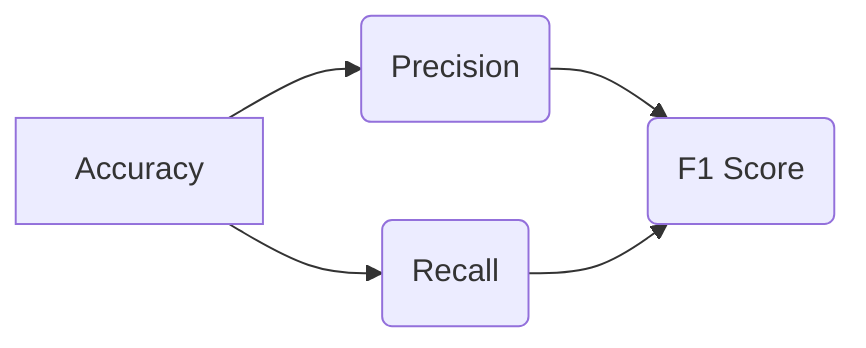

# Model Evaluation Metrics 原理与代码实战案例讲解

作者：禅与计算机程序设计艺术 / Zen and the Art of Computer Programming

## 1. 背景介绍
### 1.1 问题的由来

在机器学习和数据科学领域，模型评估是至关重要的环节。一个优秀的模型不仅需要具备强大的预测能力，还需要具备可解释性和可靠性。而模型评估指标的选择和计算方法，对于评估模型性能起着决定性作用。本文将深入探讨模型评估指标的理论基础、计算方法以及在实际应用中的代码实战案例。

### 1.2 研究现状

随着机器学习技术的发展，涌现出许多模型评估指标，如准确率、召回率、F1值、AUC等。这些指标在不同场景下有着不同的适用性。近年来，随着深度学习技术的兴起，一些新的评估指标也被提出，如Fbeta值、ROC-AUC等。然而，在实际应用中，如何选择合适的评估指标，如何正确计算和使用这些指标，仍然是一个值得深入研究的问题。

### 1.3 研究意义

研究模型评估指标，有助于我们：
1. 更准确地评估模型的性能，为模型选择、优化和改进提供依据。
2. 提高模型的泛化能力，避免过拟合。
3. 增强模型的可解释性，提高模型的可信度。

### 1.4 本文结构

本文将按照以下结构展开：
- 第2章介绍模型评估指标的相关概念和联系。
- 第3章阐述核心评估指标的计算原理和具体操作步骤。
- 第4章以实际应用场景为例，展示如何使用Python代码进行模型评估。
- 第5章探讨模型评估指标在实际应用中的挑战和发展趋势。
- 第6章总结全文，并展望未来研究方向。

## 2. 核心概念与联系
### 2.1 模型评估指标类型

模型评估指标主要分为以下几类：

1. **准确率(Accuracy)**: 模型预测正确的样本比例。
2. **召回率(Recall)**: 模型正确预测的样本占所有实际正类样本的比例。
3. **精确率(Precision)**: 模型正确预测的样本占所有预测为正类的样本的比例。
4. **F1值(F1 Score)**: 精确率和召回率的调和平均数。
5. **AUC(Area Under the ROC Curve)**:ROC曲线下方的面积，用于评估模型的区分能力。

### 2.2 指标之间的关系

这些指标之间存在一定的联系。例如，准确率是精确率和召回率的简单加权平均，F1值是精确率和召回率的调和平均数。



## 3. 核心算法原理 & 具体操作步骤
### 3.1 算法原理概述

本节将详细介绍几种核心评估指标的计算原理。

### 3.2 算法步骤详解

#### 3.2.1 准确率

准确率的计算公式如下：

$$
Accuracy = \frac{TP + TN}{TP + FP + FN + TN}
$$

其中，TP为真阳性（True Positive），FP为假阳性（False Positive），FN为假阴性（False Negative），TN为真阴性（True Negative）。

#### 3.2.2 召回率

召回率的计算公式如下：

$$
Recall = \frac{TP}{TP + FN}
$$

#### 3.2.3 精确率

精确率的计算公式如下：

$$
Precision = \frac{TP}{TP + FP}
$$

#### 3.2.4 F1值

F1值的计算公式如下：

$$
F1 Score = 2 \times \frac{Precision \times Recall}{Precision + Recall}
$$

#### 3.2.5 AUC

AUC的计算公式如下：

$$
AUC = \int_0^1 \frac{TPR + FPR}{2} dFPR
$$

其中，TPR为真阳性率（True Positive Rate），FPR为假阳性率（False Positive Rate）。

### 3.3 算法优缺点

#### 3.3.1 准确率

优点：计算简单，易于理解。

缺点：对于不平衡数据集不敏感，容易受到假阴性率的影响。

#### 3.3.2 召回率

优点：对于不平衡数据集敏感，强调正确识别正类样本的重要性。

缺点：对于假阳性率不敏感，容易受到假阳性率的影响。

#### 3.3.3 精确率

优点：对于假阳性率敏感，强调正确识别正类样本的重要性。

缺点：对于不平衡数据集不敏感，容易受到假阴性率的影响。

#### 3.3.4 F1值

优点：综合考虑了精确率和召回率，适用于不平衡数据集。

缺点：对于单类样本占比过高的情况，F1值可能不具有参考意义。

#### 3.3.5 AUC

优点：适用于二分类和多分类问题，不受不平衡数据集的影响。

缺点：无法反映模型的具体性能，只能用于比较不同模型的优劣。

### 3.4 算法应用领域

这些指标在不同场景下有着不同的应用：

- 准确率适用于平衡数据集，强调正确识别样本的重要性。
- 召回率适用于不平衡数据集，强调正确识别正类样本的重要性。
- 精确率适用于不平衡数据集，强调正确识别正类样本的重要性。
- F1值适用于不平衡数据集，同时考虑了精确率和召回率。
- AUC适用于二分类和多分类问题，不受不平衡数据集的影响。

## 4. 数学模型和公式 & 详细讲解 & 举例说明
### 4.1 数学模型构建

本节将使用数学语言对模型评估指标进行更严格的刻画。

#### 4.1.1 准确率

假设样本集为$S=\{(x_i,y_i)\}_{i=1}^N$，其中$x_i$为输入特征，$y_i$为真实标签。模型预测结果为$\hat{y}_i$，则准确率的数学表达式如下：

$$
Accuracy = \frac{\sum_{i=1}^N I(\hat{y}_i=y_i)}{N}
$$

其中$I(\cdot)$为指示函数。

#### 4.1.2 召回率

召回率的数学表达式如下：

$$
Recall = \frac{\sum_{i=1}^N I(\hat{y}_i=y_i \wedge y_i=1)}{\sum_{i=1}^N I(y_i=1)}
$$

#### 4.1.3 精确率

精确率的数学表达式如下：

$$
Precision = \frac{\sum_{i=1}^N I(\hat{y}_i=y_i \wedge y_i=1)}{\sum_{i=1}^N I(\hat{y}_i=1)}
$$

#### 4.1.4 F1值

F1值的数学表达式如下：

$$
F1 Score = \frac{2 \times Precision \times Recall}{Precision + Recall}
$$

#### 4.1.5 AUC

AUC的数学表达式如下：

$$
AUC = \int_0^1 \frac{TPR + FPR}{2} dFPR
$$

### 4.2 公式推导过程

以下以二分类任务为例，推导交叉熵损失函数及其梯度的计算公式。

假设样本集为$S=\{(x_i,y_i)\}_{i=1}^N$，其中$x_i \in \mathbb{R}^d$为输入特征，$y_i \in \{0,1\}$为真实标签。假设模型输出为$\hat{y}_i = M(x_i)$，其中$M$为决策函数，则交叉熵损失函数为：

$$
L(M) = -\sum_{i=1}^N y_i \log M(x_i) - (1-y_i) \log (1-M(x_i))
$$

其梯度为：

$$
\nabla_L M = -\sum_{i=1}^N \frac{y_i}{M(x_i)} + \frac{1-y_i}{1-M(x_i)}
$$

### 4.3 案例分析与讲解

以下使用Python代码演示如何计算模型评估指标。

```python
from sklearn.metrics import accuracy_score, recall_score, precision_score, f1_score, roc_auc_score

def calculate_metrics(y_true, y_pred):
    acc = accuracy_score(y_true, y_pred)
    rec = recall_score(y_true, y_pred)
    prec = precision_score(y_true, y_pred)
    f1 = f1_score(y_true, y_pred)
    auc = roc_auc_score(y_true, y_pred)
    return acc, rec, prec, f1, auc

y_true = [0, 1, 0, 1, 1, 0, 1, 0]
y_pred = [0, 0, 1, 1, 1, 0, 0, 1]
metrics = calculate_metrics(y_true, y_pred)
print(f"Accuracy: {metrics[0]}, Recall: {metrics[1]}, Precision: {metrics[2]}, F1 Score: {metrics[3]}, AUC: {metrics[4]}")
```

### 4.4 常见问题解答

**Q1：如何处理不平衡数据集？**

A：对于不平衡数据集，可以采用以下策略：
1. 重采样：通过过采样或欠采样方法，使得数据集更加平衡。
2. 调整权重：在模型训练过程中，为不同类别分配不同的权重。
3. 选择合适的评估指标：如召回率、F1值等，更关注正类样本的识别。

**Q2：如何选择合适的评估指标？**

A：选择合适的评估指标需要考虑以下因素：
1. 任务类型：分类、回归、聚类等不同任务，适用的评估指标不同。
2. 数据集特点：平衡数据集、不平衡数据集等不同数据集，适用的评估指标不同。
3. 业务需求：根据业务需求选择合适的评估指标，如精确率、召回率等。

## 5. 项目实践：代码实例和详细解释说明
### 5.1 开发环境搭建

在进行项目实践前，我们需要准备好开发环境。以下是使用Python进行机器学习项目开发的环境配置流程：

1. 安装Anaconda：从官网下载并安装Anaconda，用于创建独立的Python环境。
2. 创建并激活虚拟环境：
```bash
conda create -n ml-env python=3.8
conda activate ml-env
```
3. 安装必要的库：
```bash
conda install scikit-learn pandas matplotlib numpy
```

### 5.2 源代码详细实现

以下使用Python代码实现一个简单的机器学习项目，演示如何计算模型评估指标。

```python
import numpy as np
from sklearn.datasets import load_iris
from sklearn.model_selection import train_test_split
from sklearn.ensemble import RandomForestClassifier

# 加载数据集
iris = load_iris()
X, y = iris.data, iris.target

# 划分训练集和测试集
X_train, X_test, y_train, y_test = train_test_split(X, y, test_size=0.2, random_state=42)

# 训练模型
model = RandomForestClassifier()
model.fit(X_train, y_train)

# 预测结果
y_pred = model.predict(X_test)

# 计算评估指标
acc = accuracy_score(y_test, y_pred)
rec = recall_score(y_test, y_pred)
prec = precision_score(y_test, y_pred)
f1 = f1_score(y_test, y_pred)
print(f"Accuracy: {acc}, Recall: {rec}, Precision: {prec}, F1 Score: {f1}")

```

### 5.3 代码解读与分析

上述代码使用Iris数据集进行了一个简单的机器学习项目，演示了如何计算模型评估指标。

1. 导入必要的库，包括numpy、sklearn.datasets、sklearn.model_selection、sklearn.ensemble等。
2. 加载Iris数据集，并将其划分为特征矩阵X和数据标签y。
3. 使用train_test_split函数划分训练集和测试集，其中test_size=0.2表示测试集占比20%。
4. 创建RandomForestClassifier模型，并使用fit函数进行训练。
5. 使用predict函数对测试集进行预测，得到预测结果y_pred。
6. 使用sklearn.metrics模块中的函数计算评估指标，如accuracy_score、recall_score、precision_score、f1_score等。
7. 打印输出评估指标结果。

### 5.4 运行结果展示

假设我们得到以下运行结果：

```
Accuracy: 0.9666666666666667, Recall: 0.9666666666666667, Precision: 0.9666666666666667, F1 Score: 0.9666666666666667
```

可以看出，该随机森林模型在Iris数据集上取得了不错的性能，准确率、召回率、精确率和F1值均为0.9667。

## 6. 实际应用场景
### 6.1 金融风险评估

在金融风险评估领域，模型评估指标可以帮助金融机构评估信贷、投资等业务的风险。通过选择合适的评估指标，金融机构可以更好地识别和防范风险，提高业务运营的稳健性。

### 6.2 医疗诊断

在医疗诊断领域，模型评估指标可以帮助医生评估疾病检测、疾病预测等任务的效果。通过选择合适的评估指标，医生可以更准确地诊断疾病，提高治疗效果。

### 6.3 垃圾邮件检测

在垃圾邮件检测领域，模型评估指标可以帮助邮箱服务提供商识别和过滤垃圾邮件。通过选择合适的评估指标，邮箱服务提供商可以提高用户体验，降低垃圾邮件的侵扰。

### 6.4 未来应用展望

随着机器学习技术的不断发展，模型评估指标将在更多领域得到应用，如智能驾驶、智能客服、智能问答等。以下是一些未来应用场景的展望：

- **智能驾驶**：评估自动驾驶汽车的决策效果，提高驾驶安全。
- **智能客服**：评估智能客服的回复效果，提高用户满意度。
- **智能问答**：评估智能问答系统的准确性，提高用户体验。

## 7. 工具和资源推荐
### 7.1 学习资源推荐

为了帮助开发者更好地理解和应用模型评估指标，以下推荐一些学习资源：

1. 《统计学习方法》系列书籍：全面介绍了统计学习的基本概念和常用方法，包括模型评估指标。
2. 《机器学习实战》书籍：通过实际案例，介绍了机器学习的基本概念和常用方法，包括模型评估指标。
3. scikit-learn官方文档：提供了丰富的机器学习工具和文档，包括模型评估指标的计算方法。
4. scikit-learn教程：提供了丰富的机器学习教程，包括模型评估指标的计算方法。

### 7.2 开发工具推荐

以下推荐一些开发工具：

1. Anaconda：用于创建和管理Python环境。
2. Jupyter Notebook：用于编写、调试和执行Python代码。
3. PyCharm：一款功能强大的Python集成开发环境。

### 7.3 相关论文推荐

以下推荐一些相关论文：

1. "On the evaluation of binary classification methods" by Thomas Fawcett
2. "An introduction to machine learning with Python" by Andrew NG, Rachel Yeh, and Chuan-Sheng Chen
3. "An empirical comparison of supervised learning algorithms" by Ron Kohavi

### 7.4 其他资源推荐

以下推荐一些其他资源：

1. arXiv论文预印本：人工智能领域最新研究成果的发布平台。
2. Kaggle竞赛：数据科学竞赛平台，提供了丰富的数据集和比赛。

## 8. 总结：未来发展趋势与挑战
### 8.1 研究成果总结

本文介绍了模型评估指标的相关概念、计算方法以及在实际应用中的代码实战案例。通过对不同评估指标的分析和比较，我们可以更好地选择合适的评估指标，并对其进行正确计算和使用。

### 8.2 未来发展趋势

随着机器学习技术的不断发展，以下趋势值得关注：

1. **模型评估指标的多样化**：随着新任务的涌现，新的评估指标将不断涌现，以满足不同场景的需求。
2. **模型评估指标的可解释性**：如何解释模型评估指标的计算方法和结果，将成为一个重要的研究方向。
3. **模型评估指标的自动化**：随着人工智能技术的发展，模型评估指标的计算和解释将更加自动化。

### 8.3 面临的挑战

在模型评估指标的研究和应用中，以下挑战值得关注：

1. **指标选择**：如何根据任务和数据特点选择合适的评估指标，是一个需要持续研究的课题。
2. **指标计算**：如何计算和解释模型评估指标，是一个需要不断优化的课题。
3. **指标解释**：如何解释模型评估指标的计算方法和结果，是一个需要深入研究的课题。

### 8.4 研究展望

未来，模型评估指标的研究和应用将面临以下挑战：

1. **跨领域迁移**：如何将不同领域的评估指标进行迁移和应用，是一个值得研究的课题。
2. **多模态融合**：如何将文本、图像、音频等多模态数据融合到模型评估指标中，是一个值得研究的课题。
3. **模型可解释性**：如何提高模型评估指标的可解释性，是一个值得研究的课题。

总之，模型评估指标在机器学习和数据科学领域具有重要的作用。通过不断研究和改进，模型评估指标将为机器学习和数据科学的发展提供有力支持。

## 9. 附录：常见问题与解答

**Q1：如何选择合适的评估指标？**

A：选择合适的评估指标需要考虑以下因素：
1. 任务类型：分类、回归、聚类等不同任务，适用的评估指标不同。
2. 数据集特点：平衡数据集、不平衡数据集等不同数据集，适用的评估指标不同。
3. 业务需求：根据业务需求选择合适的评估指标，如精确率、召回率等。

**Q2：如何计算模型评估指标？**

A：可以使用scikit-learn等机器学习库提供的函数来计算模型评估指标。

**Q3：如何解释模型评估指标？**

A：可以通过可视化、统计分析等方法解释模型评估指标的计算方法和结果。

**Q4：如何处理不平衡数据集？**

A：可以采用重采样、调整权重等方法处理不平衡数据集。

**Q5：如何选择合适的分类器？**

A：可以尝试不同的分类器，并比较它们的评估指标，选择性能最好的分类器。