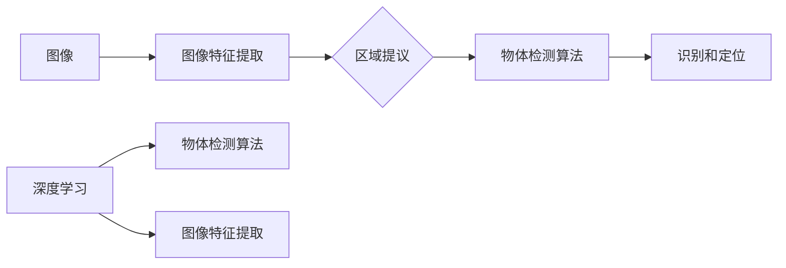

# Object Detection 原理与代码实战案例讲解

作者：禅与计算机程序设计艺术 / Zen and the Art of Computer Programming

## 1. 背景介绍
### 1.1 问题的由来

物体检测（Object Detection）是计算机视觉领域的一个重要分支，旨在从图像或视频中自动识别和定位图像中的多个物体。在自动驾驶、视频监控、机器人导航、图像检索等众多领域，物体检测技术都发挥着至关重要的作用。

随着深度学习技术的飞速发展，基于深度学习的物体检测算法取得了显著的成果，成为物体检测领域的主流方法。本文将深入探讨物体检测的原理，并结合实际案例讲解如何实现一个简单的物体检测系统。

### 1.2 研究现状

近年来，物体检测领域涌现出许多优秀的算法，主要可以分为以下几类：

- **传统物体检测算法**：如Haar特征、HOG特征等基于手工特征的检测方法，精度较低，难以适应复杂场景。
- **基于区域提议的方法**：如SPPnet、RPN等，通过生成候选区域来提高检测精度，但计算量大，效率较低。
- **基于深度学习的方法**：如Faster R-CNN、SSD、YOLO等，采用卷积神经网络提取图像特征，并结合区域提议或直接检测，在效率和精度上取得了显著的提升。

### 1.3 研究意义

物体检测技术在众多领域具有广泛的应用价值，如：

- **自动驾驶**：实现车辆的自动识别、车道线检测、交通标志识别等功能，提高行驶安全性。
- **视频监控**：实现实时监控、异常行为检测、人员追踪等功能，提升安防水平。
- **机器人导航**：实现物体的识别、定位和抓取等功能，提高机器人的自主能力。
- **图像检索**：实现基于图像内容的检索，提高信息检索效率。

### 1.4 本文结构

本文将分为以下几个部分：

- 第2部分：介绍物体检测的核心概念与联系。
- 第3部分：详细阐述物体检测算法的原理和具体操作步骤。
- 第4部分：讲解物体检测中常用的数学模型和公式，并结合实例进行分析。
- 第5部分：给出物体检测的代码实例，并对关键代码进行解读和分析。
- 第6部分：探讨物体检测在实际应用场景中的案例，并展望未来的发展趋势。
- 第7部分：推荐物体检测相关的学习资源、开发工具和参考文献。
- 第8部分：总结全文，展望物体检测技术的未来发展趋势与挑战。

## 2. 核心概念与联系

为了更好地理解物体检测，以下介绍几个核心概念及其相互关系：

- **图像特征**：从图像中提取的特征，用于描述图像的内容，如颜色、纹理、形状等。
- **区域提议**：根据图像特征，生成候选区域的算法，如滑动窗口、基于深度学习的RPN等。
- **物体检测算法**：对图像中的物体进行识别和定位的算法，包括基于特征和基于深度学习的方法。
- **深度学习**：一种通过学习数据中的特征表示来学习任务的方法，在物体检测等领域取得了显著的成果。

它们之间的逻辑关系如下：



## 3. 核心算法原理 & 具体操作步骤
### 3.1 算法原理概述

物体检测算法的核心思想是：先从图像中提取特征，然后生成候选区域，最后对候选区域进行分类和位置回归。

- **图像特征提取**：使用卷积神经网络（CNN）提取图像特征，将图像转换为高维特征向量。
- **区域提议**：根据图像特征，生成候选区域，候选区域通常包含可能存在物体的区域。
- **物体检测**：对候选区域进行分类和位置回归，分类判断候选区域是否包含物体，位置回归确定物体的边界框。

### 3.2 算法步骤详解

以下以Faster R-CNN为例，介绍物体检测算法的具体步骤：

1. **特征提取**：使用预训练的CNN模型（如VGG16）提取图像特征。
2. **区域提议网络（RPN）**：在CNN特征图上滑动区域提议网络，生成候选区域。
3. **候选区域分类**：将候选区域的特征输入分类器，判断候选区域是否包含物体。
4. **边界框回归**：将候选区域的特征输入回归器，回归物体的边界框位置。
5. **非极大值抑制（NMS）**：对预测结果进行排序，去除重叠度高的候选区域。

### 3.3 算法优缺点

物体检测算法的优点：

- 高精度：深度学习方法能够提取更丰富的图像特征，提高检测精度。
- 高效率：一些算法（如YOLO）在保证精度的同时，具有较高的检测速度。
- 可解释性：深度学习模型的可解释性较差，难以解释其决策过程。

物体检测算法的缺点：

- 计算量大：深度学习模型的训练和推理过程需要大量的计算资源。
- 参数量大：深度学习模型通常需要大量的训练数据进行参数优化。
- 数据标注成本高：标注真实样本的类别和位置需要大量人工工作。

### 3.4 算法应用领域

物体检测算法在以下领域具有广泛的应用：

- **自动驾驶**：实现车辆、行人、交通标志等目标的检测和跟踪，提高行驶安全性。
- **视频监控**：实现实时监控、异常行为检测、人员追踪等功能，提升安防水平。
- **机器人导航**：实现物体的识别、定位和抓取等功能，提高机器人的自主能力。
- **图像检索**：实现基于图像内容的检索，提高信息检索效率。

## 4. 数学模型和公式 & 详细讲解 & 举例说明
### 4.1 数学模型构建

物体检测算法通常包含以下数学模型：

- **特征提取模型**：如CNN，将图像转换为高维特征向量。
- **分类器**：如SVM、softmax，对候选区域进行分类。
- **位置回归模型**：如回归器，对候选区域的边界框位置进行回归。

以下以Faster R-CNN为例，介绍其数学模型：

- **特征提取模型**：使用CNN提取图像特征，假设输入图像为 $X$，CNN的输出为 $F(X)$。
- **RPN**：在CNN特征图上滑动锚框（anchor boxes），生成候选区域，假设锚框为 $A$，则候选区域为 $R(A)$。
- **分类器**：将候选区域的特征 $F(R(A))$ 输入分类器，得到类别概率分布 $P(y|A)$。
- **回归器**：将候选区域的特征 $F(R(A))$ 输入回归器，回归物体的边界框位置，假设边界框为 $B$，则回归结果为 $\hat{B}$。

### 4.2 公式推导过程

以下以Faster R-CNN中的分类器为例，介绍公式推导过程：

假设分类器为softmax，则候选区域 $A$ 的类别概率分布为：

$$
P(y|A) = \frac{e^{w^{(y)} \cdot F(R(A))}}{\sum_{y'} e^{w^{(y')} \cdot F(R(A))}}
$$

其中，$w^{(y)}$ 为类别 $y$ 的权重，$F(R(A))$ 为候选区域 $A$ 的特征。

### 4.3 案例分析与讲解

以下以Faster R-CNN的RPN为例，分析其工作原理：

RPN通过在CNN特征图上滑动锚框，生成候选区域。锚框的尺寸和偏移量预设为一系列固定的值，通常包括不同比例和尺度的锚框。

1. **特征图预处理**：将输入图像通过CNN进行特征提取，得到特征图 $F(X)$。
2. **锚框生成**：根据预设的尺寸和偏移量，在特征图上生成锚框 $A$。
3. **位置回归**：对锚框 $A$ 进行位置回归，得到候选区域 $R(A)$ 的位置。
4. **候选区域过滤**：根据锚框 $A$ 的位置回归结果，对候选区域 $R(A)$ 进行过滤，去除不符合条件的候选区域。

### 4.4 常见问题解答

**Q1：物体检测算法是否适用于所有场景？**

A：物体检测算法在大多数场景下都适用，但对于一些特殊情况，如光照变化、遮挡、运动模糊等，可能需要针对具体场景进行优化。

**Q2：物体检测算法的精度如何提高？**

A：提高物体检测算法的精度可以从以下几个方面进行：

- 使用更强大的模型，如ResNet、MobileNet等。
- 使用更丰富的训练数据，并进行数据增强。
- 优化目标函数，如采用多尺度训练、Focal Loss等。
- 使用更先进的算法，如Faster R-CNN、SSD、YOLO等。

**Q3：物体检测算法的实时性如何保证？**

A：为了保证物体检测算法的实时性，可以从以下几个方面进行优化：

- 选择轻量级模型，如MobileNet、SqueezeNet等。
- 采用网络剪枝、模型压缩等技术，减小模型尺寸。
- 使用GPU/TPU等高性能设备进行加速推理。

## 5. 项目实践：代码实例和详细解释说明
### 5.1 开发环境搭建

在进行物体检测项目实践前，我们需要准备以下开发环境：

1. 安装Anaconda：从官网下载并安装Anaconda，用于创建独立的Python环境。
2. 创建并激活虚拟环境：
```bash
conda create -n object-detection-env python=3.8
conda activate object-detection-env
```
3. 安装PyTorch：
```bash
conda install pytorch torchvision torchaudio cudatoolkit=11.1 -c pytorch -c conda-forge
```
4. 安装相关依赖：
```bash
pip install numpy pandas scikit-learn matplotlib tqdm
```

### 5.2 源代码详细实现

以下使用PyTorch实现一个简单的Faster R-CNN物体检测系统，包括数据预处理、模型训练、模型推理等步骤。

```python
import torch
import torch.optim as optim
from torchvision import transforms
from torch.utils.data import DataLoader
from torch.utils.data import Dataset
from PIL import Image
from torchvision.models.detection import fasterrcnn_resnet50_fpn

class CustomDataset(Dataset):
    def __init__(self, img_paths, labels, transform=None):
        self.img_paths = img_paths
        self.labels = labels
        self.transform = transform

    def __len__(self):
        return len(self.img_paths)

    def __getitem__(self, idx):
        img = Image.open(self.img_paths[idx])
        label = self.labels[idx]
        if self.transform:
            img = self.transform(img)
        return img, label

transform = transforms.Compose([
    transforms.Resize((800, 800)),
    transforms.ToTensor()
])

train_dataset = CustomDataset(train_img_paths, train_labels, transform=transform)
train_loader = DataLoader(train_dataset, batch_size=4, shuffle=True)

model = fasterrcnn_resnet50_fpn(pretrained=False)
optimizer = optim.Adam(model.parameters(), lr=0.001)

device = torch.device('cuda' if torch.cuda.is_available() else 'cpu')
model.to(device)

for epoch in range(10):
    model.train()
    for img, label in train_loader:
        img = img.to(device)
        label = label.to(device)
        optimizer.zero_grad()
        loss = model(img, labels=label)
        loss.backward()
        optimizer.step()
```

### 5.3 代码解读与分析

1. **CustomDataset类**：自定义数据集类，负责加载图像和标签，并应用数据增强。

2. **transforms.Compose**：定义数据预处理操作，包括图像缩放和转换为张量。

3. **CustomDataset对象**：加载训练集图像和标签，并应用数据预处理。

4. **DataLoader**：批量加载数据，方便模型训练。

5. **model = fasterrcnn_resnet50_fpn(pretrained=False)**：加载预训练的Faster R-CNN模型，并禁用预训练权重。

6. **optimizer = optim.Adam(model.parameters(), lr=0.001)**：创建优化器，并设置学习率。

7. **device = torch.device('cuda' if torch.cuda.is_available() else 'cpu')**：设置设备，使用GPU进行加速。

8. **for epoch in range(10)**：循环进行10个epoch的训练。

9. **model.train()**：将模型设置为训练模式。

10. **for img, label in train_loader**：批量加载数据。

11. **img = img.to(device)**：将图像数据移动到设备。

12. **label = label.to(device)**：将标签数据移动到设备。

13. **optimizer.zero_grad()**：清空梯度。

14. **loss = model(img, labels=label)**：计算损失函数。

15. **loss.backward()**：反向传播。

16. **optimizer.step()**：更新参数。

### 5.4 运行结果展示

运行上述代码，模型将在训练集上进行训练，并在每个epoch结束时输出训练损失。训练完成后，可以在测试集上评估模型的性能。

```python
model.eval()
with torch.no_grad():
    for img, label in test_loader:
        img = img.to(device)
        label = label.to(device)
        output = model(img)
        # 评估模型性能，如计算mAP等指标
```

## 6. 实际应用场景
### 6.1 自动驾驶

物体检测技术在自动驾驶领域具有广泛的应用价值，如：

- **车辆检测**：识别道路上的车辆，实现车道线检测、车道保持等功能。
- **行人检测**：识别道路上的行人，实现行人检测、行人跟踪等功能。
- **交通标志识别**：识别道路上的交通标志，实现交通规则识别等功能。

### 6.2 视频监控

物体检测技术在视频监控领域具有以下应用：

- **异常行为检测**：检测异常行为，如闯入、打架等。
- **人员追踪**：实现人员的实时追踪，帮助分析人员活动轨迹。
- **目标跟踪**：实现目标的持续跟踪，如跟踪车辆、行人等。

### 6.3 机器人导航

物体检测技术在机器人导航领域具有以下应用：

- **障碍物检测**：检测机器人周围的障碍物，实现避障功能。
- **路径规划**：根据检测到的障碍物，规划机器人的运动路径。
- **目标抓取**：检测和定位目标物体，实现机器人的抓取功能。

### 6.4 未来应用展望

随着深度学习技术的不断发展，物体检测技术在以下方面具有广阔的应用前景：

- **多模态检测**：结合图像、视频、声音等多模态信息，实现更全面的物体检测。
- **小样本检测**：在数据量较少的情况下，实现高精度的物体检测。
- **实时检测**：提高检测速度，实现实时物体检测。
- **可解释性**：提高模型的可解释性，帮助理解模型的决策过程。

## 7. 工具和资源推荐
### 7.1 学习资源推荐

- **《深度学习》系列书籍**：介绍深度学习的基础知识，包括卷积神经网络、目标检测算法等。
- **《目标检测：从原理到实践》**：深入讲解目标检测算法的原理和实现。
- **PyTorch官方文档**：介绍PyTorch框架和目标检测库的使用方法。
- **TensorFlow官方文档**：介绍TensorFlow框架和目标检测库的使用方法。

### 7.2 开发工具推荐

- **PyTorch**：开源的深度学习框架，支持多种深度学习模型。
- **TensorFlow**：开源的深度学习框架，支持多种深度学习模型。
- **OpenCV**：开源的计算机视觉库，提供图像处理、特征提取等功能。
- **CUDA**：NVIDIA推出的GPU加速库，支持深度学习模型在GPU上加速。

### 7.3 相关论文推荐

- **Faster R-CNN**：提出了一种基于深度学习的目标检测框架。
- **SSD**：提出了一种高效的目标检测算法。
- **YOLO**：提出了一种单阶段目标检测算法。

### 7.4 其他资源推荐

- **GitHub**：开源代码和项目平台，提供丰富的目标检测算法代码和项目。
- **arXiv**：计算机视觉领域顶级论文预印本平台。

## 8. 总结：未来发展趋势与挑战
### 8.1 研究成果总结

本文深入讲解了物体检测的原理、算法和实际应用，并给出一个简单的物体检测系统实现案例。通过对物体检测领域的研究现状和未来发展趋势进行分析，可以看出，物体检测技术在图像识别、自动驾驶、视频监控等领域具有广泛的应用前景。随着深度学习技术的不断发展，物体检测算法在精度、效率、可解释性等方面将取得更大的突破。

### 8.2 未来发展趋势

未来，物体检测技术将呈现以下发展趋势：

- **多模态检测**：结合图像、视频、声音等多模态信息，实现更全面的物体检测。
- **小样本检测**：在数据量较少的情况下，实现高精度的物体检测。
- **实时检测**：提高检测速度，实现实时物体检测。
- **可解释性**：提高模型的可解释性，帮助理解模型的决策过程。

### 8.3 面临的挑战

物体检测技术在实际应用中仍面临以下挑战：

- **数据标注成本高**：高质量的标注数据是训练高精度模型的基础，但标注成本较高。
- **计算量大**：深度学习模型通常需要大量的计算资源，难以在资源受限的设备上运行。
- **可解释性差**：深度学习模型的可解释性较差，难以解释其决策过程。

### 8.4 研究展望

为了应对上述挑战，未来需要从以下几个方面进行研究和探索：

- **数据增强**：通过数据增强技术，降低标注数据的成本。
- **模型压缩**：通过模型压缩技术，降低模型的计算量。
- **可解释性研究**：提高模型的可解释性，帮助理解模型的决策过程。

相信随着深度学习技术的不断发展，物体检测技术将在更多领域发挥重要作用，为人类创造更多价值。

## 9. 附录：常见问题与解答

**Q1：物体检测算法是否适用于所有场景？**

A：物体检测算法在大多数场景下都适用，但对于一些特殊情况，如光照变化、遮挡、运动模糊等，可能需要针对具体场景进行优化。

**Q2：物体检测算法的精度如何提高？**

A：提高物体检测算法的精度可以从以下几个方面进行：

- 使用更强大的模型，如ResNet、MobileNet等。
- 使用更丰富的训练数据，并进行数据增强。
- 优化目标函数，如采用多尺度训练、Focal Loss等。
- 使用更先进的算法，如Faster R-CNN、SSD、YOLO等。

**Q3：物体检测算法的实时性如何保证？**

A：为了保证物体检测算法的实时性，可以从以下几个方面进行优化：

- 选择轻量级模型，如MobileNet、SqueezeNet等。
- 采用网络剪枝、模型压缩等技术，减小模型尺寸。
- 使用GPU/TPU等高性能设备进行加速推理。

**Q4：物体检测算法在实际应用中需要注意哪些问题？**

A：在实际应用中，需要注意以下问题：

- 数据标注质量：高质量的数据标注是训练高精度模型的基础。
- 模型选择：根据实际需求选择合适的模型，如精度要求高则选择Faster R-CNN，实时性要求高则选择YOLO。
- 模型部署：根据实际硬件条件选择合适的模型部署方案，如使用GPU、TPU等高性能设备。

通过以上学习，相信你已经对物体检测技术有了更深入的了解。在实际应用中，可以根据具体需求选择合适的算法和模型，并结合实际情况进行调整优化，以实现最佳的检测效果。