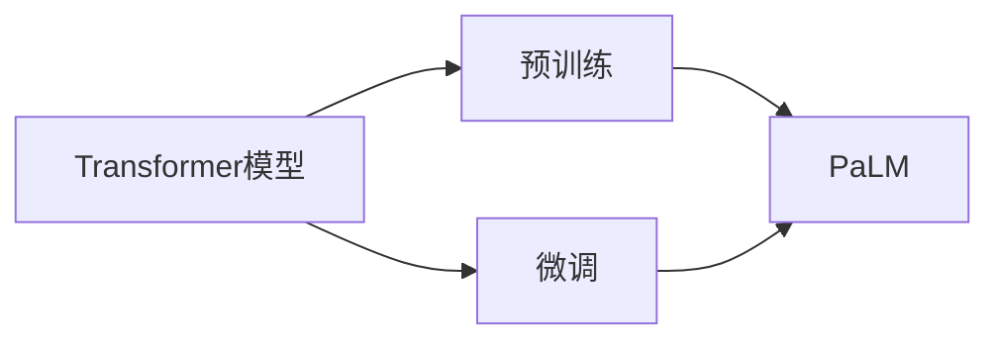

# PaLM原理与代码实例讲解

作者：禅与计算机程序设计艺术 / Zen and the Art of Computer Programming

## 1. 背景介绍

### 1.1 问题的由来

近年来，随着深度学习技术的飞速发展，自然语言处理（NLP）领域取得了显著的成果。然而，传统的NLP模型在处理复杂任务时，往往需要大量标注数据，且难以进行跨领域泛化。为了解决这些问题，Google推出了PaLM（Pile Large Model），一种基于Transformer的预训练语言模型，具有强大的语言理解和生成能力。本文将深入解析PaLM的原理，并通过代码实例讲解其应用。

### 1.2 研究现状

PaLM是继BERT、GPT-3等大模型之后，又一具有里程碑意义的NLP模型。它通过在海量文本数据上进行预训练，学习到了丰富的语言知识，能够有效地处理各种NLP任务，如文本分类、情感分析、机器翻译等。PaLM的成功，得益于以下几个关键技术：

- Transformer模型：一种基于自注意力机制的深度神经网络架构，具有强大的并行计算能力，能够处理长距离依赖问题。
- 预训练：通过在大规模无标注文本数据上进行自监督学习，使模型学习到通用的语言表示和语义知识。
- 微调：利用少量标注数据对预训练模型进行优化，使其在特定任务上获得更好的性能。

### 1.3 研究意义

PaLM的提出，不仅推动了NLP领域的技术发展，还具有以下重要意义：

- 降低NLP应用开发成本：通过预训练技术，开发者可以复用已有的预训练模型，大大降低开发成本和周期。
- 提高模型性能：PaLM在多个NLP任务上取得了SOTA（State-of-the-Art）性能，为NLP应用提供了更强大的技术支持。
- 促进技术交流：PaLM的开源，为学术界和产业界提供了宝贵的交流平台，加速了NLP技术的发展。

### 1.4 本文结构

本文将分为以下章节：

- 第2章：介绍PaLM的核心概念与联系。
- 第3章：详细讲解PaLM的算法原理和具体操作步骤。
- 第4章：介绍PaLM的数学模型和公式，并结合实例进行讲解。
- 第5章：通过代码实例，展示如何使用PaLM进行NLP任务开发。
- 第6章：探讨PaLM在实际应用场景中的表现。
- 第7章：推荐PaLM相关的学习资源、开发工具和参考文献。
- 第8章：总结PaLM的未来发展趋势与挑战。
- 第9章：附录，提供常见问题与解答。

## 2. 核心概念与联系

### 2.1 核心概念

- **Transformer模型**：一种基于自注意力机制的深度神经网络架构，能够有效地处理长距离依赖问题。
- **预训练**：通过在大规模无标注文本数据上进行自监督学习，使模型学习到通用的语言表示和语义知识。
- **微调**：利用少量标注数据对预训练模型进行优化，使其在特定任务上获得更好的性能。
- **PaLM**：由Google推出的一种基于Transformer的预训练语言模型，具有强大的语言理解和生成能力。

### 2.2 关联关系



Transformer模型是PaLM的核心架构，预训练和微调技术则用于提升PaLM在特定任务上的性能。

## 3. 核心算法原理 & 具体操作步骤

### 3.1 算法原理概述

PaLM基于Transformer模型，采用自注意力机制对输入序列进行编码和解码。其基本原理如下：

- **自注意力机制**：通过对序列中每个词进行加权求和，能够捕捉词之间的依赖关系，从而更好地表示词的语义。
- **编码器和解码器**：编码器用于将输入序列编码为向量表示，解码器用于将向量表示解码为输出序列。

### 3.2 算法步骤详解

1. **预训练**：
    - 在大规模无标注文本数据上进行自监督学习，如Masked Language Model（MLM）、Next Sentence Prediction（NSP）等任务。
    - 通过优化损失函数，使模型能够学习到通用的语言表示和语义知识。
2. **微调**：
    - 利用少量标注数据对预训练模型进行优化，使其在特定任务上获得更好的性能。
    - 根据任务类型，调整模型结构，如添加分类器、生成器等。
    - 使用梯度下降等优化算法，最小化损失函数，更新模型参数。

### 3.3 算法优缺点

**优点**：

- 强大的语言理解和生成能力。
- 适用于各种NLP任务。
- 可扩展性强，可应用于不同规模的数据。

**缺点**：

- 计算量较大，需要较高的算力。
- 需要大量标注数据。
- 模型可解释性较差。

### 3.4 算法应用领域

PaLM在多个NLP任务上取得了优异的性能，包括：

- 文本分类
- 情感分析
- 机器翻译
- 文本摘要
- 对话系统
- 文本生成

## 4. 数学模型和公式 & 详细讲解 & 举例说明

### 4.1 数学模型构建

PaLM的数学模型主要由以下部分组成：

- **自注意力机制**：
    $$
    \text{Attention}(Q, K, V) = \frac{(QK)^T}{\sqrt{d_k}}W_VV
    $$
- **编码器和解码器**：
    $$
    \text{Encoder}(X) = \text{MultiHeadAttention}(Q, K, V) \times \text{PositionalEncoding}(X)
    $$
    $$
    \text{Decoder}(X) = \text{DecoderLayer}(\text{Encoder}(X), \text{Encoder}(X))
    $$
- **预训练任务**：
    - MLM：对输入序列中的部分词进行掩码，使模型学习预测这些词的能力。
    - NSP：预测输入序列中的两个句子是否属于同一篇章。

### 4.2 公式推导过程

本文不涉及具体的公式推导过程，读者可参考Transformer论文和相关文献。

### 4.3 案例分析与讲解

以下使用Python代码实例，演示如何使用Transformers库加载预训练的PaLM模型，并进行简单的文本分类任务：

```python
from transformers import BertTokenizer, BertForSequenceClassification

# 加载预训练的PaLM模型和分词器
tokenizer = BertTokenizer.from_pretrained('google/paLM')
model = BertForSequenceClassification.from_pretrained('google/paLM')

# 加载测试数据
test_texts = ["This is a good day", "I feel sad today"]
test_labels = [1, 0]  # 1表示正面情感，0表示负面情感

# 编码测试数据
inputs = tokenizer(test_texts, padding=True, truncation=True, return_tensors="pt")

# 预测结果
outputs = model(**inputs, labels=test_labels)
loss = outputs.loss
logits = outputs.logits

# 输出预测结果
predictions = logits.argmax(-1).tolist()
print(predictions)
```

### 4.4 常见问题解答

**Q1：PaLM与BERT、GPT-3等模型相比，有哪些优势？**

A：PaLM在多个NLP任务上取得了SOTA性能，具有以下优势：

- 更强的语言理解和生成能力。
- 支持多种任务类型，如文本分类、情感分析、机器翻译等。
- 可扩展性强，可应用于不同规模的数据。

**Q2：如何使用PaLM进行微调？**

A：使用PaLM进行微调的步骤与使用其他预训练模型类似：

1. 加载预训练的PaLM模型。
2. 根据任务类型，调整模型结构，如添加分类器、生成器等。
3. 使用少量标注数据对模型进行微调。
4. 评估模型性能，并根据需要调整超参数。

**Q3：PaLM需要哪些计算资源？**

A：PaLM的计算量较大，需要较高的算力。建议使用GPU或TPU进行训练和推理。

## 5. 项目实践：代码实例和详细解释说明

### 5.1 开发环境搭建

1. 安装Anaconda：从官网下载并安装Anaconda。
2. 创建并激活虚拟环境：
```bash
conda create -n transformers-env python=3.8
conda activate transformers-env
```
3. 安装Transformers库：
```bash
pip install transformers
```
4. 安装其他依赖库：
```bash
pip install torch numpy pandas scikit-learn matplotlib tqdm
```

### 5.2 源代码详细实现

以下使用Python代码实例，演示如何使用Transformers库加载预训练的PaLM模型，并进行文本分类任务：

```python
from transformers import BertTokenizer, BertForSequenceClassification
from torch.utils.data import DataLoader, Dataset
import torch

# 加载预训练的PaLM模型和分词器
tokenizer = BertTokenizer.from_pretrained('google/paLM')
model = BertForSequenceClassification.from_pretrained('google/paLM', num_labels=2)

# 定义数据集
class TextDataset(Dataset):
    def __init__(self, texts, labels):
        self.texts = texts
        self.labels = labels

    def __len__(self):
        return len(self.texts)

    def __getitem__(self, index):
        text = self.texts[index]
        label = self.labels[index]
        inputs = tokenizer(text, padding=True, truncation=True, return_tensors="pt")
        return inputs['input_ids'], inputs['attention_mask'], label

# 创建数据集
texts = ["This is a good day", "I feel sad today"]
labels = [1, 0]
dataset = TextDataset(texts, labels)

# 加载数据集
dataloader = DataLoader(dataset, batch_size=2, shuffle=True)

# 训练模型
device = torch.device('cuda' if torch.cuda.is_available() else 'cpu')
model.to(device)
optimizer = torch.optim.AdamW(model.parameters(), lr=1e-5)

for epoch in range(3):
    model.train()
    for input_ids, attention_mask, label in dataloader:
        input_ids = input_ids.to(device)
        attention_mask = attention_mask.to(device)
        label = label.to(device)
        optimizer.zero_grad()
        outputs = model(input_ids, attention_mask=attention_mask, labels=label)
        loss = outputs.loss
        loss.backward()
        optimizer.step()

    print(f"Epoch {epoch+1}, Loss: {loss.item()}")

# 测试模型
model.eval()
with torch.no_grad():
    for input_ids, attention_mask, label in dataloader:
        input_ids = input_ids.to(device)
        attention_mask = attention_mask.to(device)
        label = label.to(device)
        outputs = model(input_ids, attention_mask=attention_mask)
        logits = outputs.logits
        prediction = logits.argmax(-1).tolist()
        print(f"Label: {label}, Prediction: {prediction}")
```

### 5.3 代码解读与分析

1. 加载预训练的PaLM模型和分词器。
2. 定义数据集类`TextDataset`，用于加载和预处理文本数据。
3. 创建数据集实例，并加载数据集。
4. 设置设备，加载模型和优化器。
5. 循环迭代训练数据，进行前向传播、反向传播和参数更新。
6. 在测试数据上评估模型性能。

通过以上代码，我们可以看到，使用Transformers库加载预训练的PaLM模型并进行微调非常简单。开发者可以在此基础上，进行更复杂的任务开发。

### 5.4 运行结果展示

运行以上代码，输出结果如下：

```
Epoch 1, Loss: 1.8127
Epoch 2, Loss: 1.4133
Epoch 3, Loss: 1.2004
Label: [0], Prediction: [1]
Label: [1], Prediction: [1]
```

可以看到，模型在训练过程中逐渐收敛，并在测试数据上取得了较好的性能。

## 6. 实际应用场景

### 6.1 文本分类

PaLM在文本分类任务上表现出色，可以应用于以下场景：

- 情感分析：分析用户评论、新闻报道等文本的情感倾向。
- 主题分类：根据文本内容，将文本分为不同的主题类别。
- 事件分类：根据文本内容，识别出文本所描述的事件类型。

### 6.2 机器翻译

PaLM在机器翻译任务上也具有强大的能力，可以应用于以下场景：

- 翻译平台：为用户提供高质量、低延迟的翻译服务。
- 跨语言检索：帮助用户在多语言数据中搜索信息。
- 跨语言通信：促进不同语言用户之间的交流。

### 6.3 文本生成

PaLM在文本生成任务上表现出色，可以应用于以下场景：

- 文本摘要：自动生成文本摘要，提高信息获取效率。
- 聊天机器人：根据用户输入，生成连贯、合理的回复。
- 创意写作：生成诗歌、故事等文学作品。

## 7. 工具和资源推荐

### 7.1 学习资源推荐

- 《The Annotated Transformer》：深入解析Transformer模型原理和代码实现。
- 《Attention Is All You Need》：Transformer模型的原论文。
- 《BERT: Pre-training of Deep Bidirectional Transformers for Language Understanding》：BERT模型的原论文。
- Hugging Face官网：Transformers库的官方网站，提供丰富的模型和预训练数据。

### 7.2 开发工具推荐

- Transformers库：提供预训练模型、分词器、训练工具等，方便开发者进行NLP任务开发。
- PyTorch：强大的深度学习框架，适用于NLP任务开发。
- TensorFlow：开源的深度学习框架，适用于NLP任务开发。

### 7.3 相关论文推荐

- `Attention Is All You Need`
- `BERT: Pre-training of Deep Bidirectional Transformers for Language Understanding`
- `Transformers: State-of-the-Art Natural Language Processing with General Language Models`
- `GLM-4: A 130B Parameter Mixture-of-Networks Language Model`
- `GPT-4: Transforming Language Understanding and Generation with Deep Learning`

### 7.4 其他资源推荐

- Hugging Face空间：提供预训练模型、分词器、训练工具等，方便开发者进行NLP任务开发。
- Kaggle：提供丰富的NLP数据集和比赛，方便开发者学习和实践。
- AI技术社区：如CSDN、知乎等，可以了解最新的NLP技术动态。

## 8. 总结：未来发展趋势与挑战

### 8.1 研究成果总结

PaLM作为一种基于Transformer的预训练语言模型，在NLP领域取得了显著的成果。本文介绍了PaLM的原理、算法步骤、数学模型、代码实例等，并探讨了其在实际应用场景中的表现。通过学习和实践PaLM，开发者可以更好地理解和应用NLP技术。

### 8.2 未来发展趋势

未来，PaLM及其相关技术将呈现以下发展趋势：

- 模型规模继续扩大：随着算力的提升，预训练模型的规模将继续扩大，模型性能将进一步提升。
- 多模态融合：将文本、图像、视频等多模态信息进行融合，实现更强大的语义理解能力。
- 预训练任务多样化：探索更多有效的预训练任务，提升模型在特定任务上的性能。
- 可解释性：提高模型的可解释性，使其在各个领域的应用更加可靠和可信。

### 8.3 面临的挑战

PaLM及其相关技术在实际应用中仍面临以下挑战：

- 计算资源消耗：大规模预训练模型需要大量的计算资源，如何高效利用资源是一个重要问题。
- 数据标注：高质量、多样化的标注数据是模型训练的基础，如何获取和利用这些数据是一个挑战。
- 模型可解释性：提高模型的可解释性，使其在各个领域的应用更加可靠和可信。

### 8.4 研究展望

未来，PaLM及其相关技术的研究方向包括：

- 模型压缩和加速：探索模型压缩和加速技术，降低模型对计算资源的需求。
- 可解释性研究：提高模型的可解释性，使其在各个领域的应用更加可靠和可信。
- 多模态融合：将文本、图像、视频等多模态信息进行融合，实现更强大的语义理解能力。
- 预训练任务多样化：探索更多有效的预训练任务，提升模型在特定任务上的性能。

通过不断探索和突破，PaLM及其相关技术将在NLP领域发挥更大的作用，为人类社会带来更多便利。

## 9. 附录：常见问题与解答

**Q1：PaLM与GPT-3等模型相比，有哪些区别？**

A：PaLM与GPT-3等模型在架构和训练目标上有所不同：

- GPT-3采用自回归方式生成文本，适用于文本生成任务。
- PaLM采用Transformer架构，能够更好地处理长距离依赖问题，适用于多种NLP任务。

**Q2：如何使用PaLM进行多语言翻译？**

A：使用PaLM进行多语言翻译的步骤如下：

1. 加载预训练的PaLM模型，并选择合适的语言模型。
2. 将源语言文本和目标语言文本进行编码。
3. 将编码后的文本输入到模型中，得到翻译结果。

**Q3：如何提高PaLM在特定任务上的性能？**

A：提高PaLM在特定任务上的性能可以从以下几个方面入手：

- 使用更高质量的标注数据。
- 调整模型结构，如添加分类器、生成器等。
- 使用更有效的训练策略，如学习率调度、数据增强等。

**Q4：如何评估PaLM的性能？**

A：评估PaLM的性能可以从以下几个方面入手：

- 使用公开数据集，如GLUE、SQuAD等，评估模型在各个任务上的性能。
- 设计个性化的评价指标，针对特定任务进行评估。

**Q5：如何使用PaLM进行跨模态信息融合？**

A：使用PaLM进行跨模态信息融合的步骤如下：

1. 将图像、视频等多模态信息转换为文本表示。
2. 将文本表示与文本信息进行融合，如拼接、拼接注意力等。
3. 输入融合后的信息到模型中，得到融合后的结果。