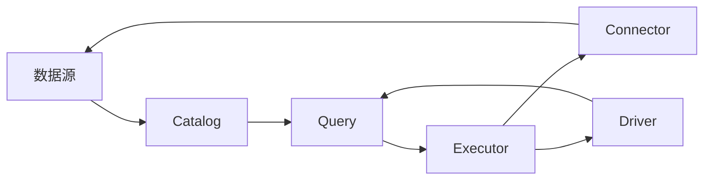

# Presto原理与代码实例讲解

作者：禅与计算机程序设计艺术 / Zen and the Art of Computer Programming

## 1. 背景介绍
### 1.1 问题的由来

随着大数据时代的到来，数据量呈爆炸式增长，对数据处理和分析提出了更高的要求。传统的数据处理工具在面对海量数据时，往往存在效率低下、扩展性差等问题。为了解决这些问题，社区推出了Presto，一个高性能、分布式的查询引擎。Presto旨在提供亚秒级响应速度，能够同时支持SQL查询和多种数据源，成为大数据处理领域的重要工具之一。

### 1.2 研究现状

Presto自2013年由Facebook开源以来，已经发展成为一个活跃的开源社区项目。Presto拥有丰富的社区资源、成熟的生态体系，并在多个大型企业中得到广泛应用。Presto的性能和灵活性使其成为大数据分析的首选工具之一。

### 1.3 研究意义

研究Presto的原理和实践，对于理解大数据查询引擎的设计和优化，提升数据处理能力具有重要意义：

1. 提高数据处理效率：Presto能够快速处理海量数据，提高数据分析师的工作效率。
2. 支持多种数据源：Presto能够连接多种数据存储系统，实现数据的统一管理和分析。
3. 优化资源利用：Presto的分布式架构能够有效利用集群资源，降低成本。
4. 开源社区支持：Presto拥有庞大的开源社区，为用户提供丰富的资源和技术支持。

### 1.4 本文结构

本文将深入探讨Presto的原理和实践，包括其核心概念、算法原理、代码实现以及实际应用场景。内容安排如下：

- 第2部分，介绍Presto的核心概念和系统架构。
- 第3部分，讲解Presto的查询优化和执行引擎原理。
- 第4部分，给出Presto的代码实现示例，并对关键代码进行解读。
- 第5部分，探讨Presto在实际应用中的场景和案例。
- 第6部分，展望Presto的未来发展趋势和挑战。
- 第7部分，推荐Presto相关的学习资源、开发工具和参考文献。
- 第8部分，总结全文，展望Presto技术的未来发展趋势与挑战。
- 第9部分，提供常见问题与解答。

## 2. 核心概念与联系

为了更好地理解Presto，本节将介绍几个核心概念及其相互关系。

### 2.1 数据源

数据源是指存储和处理数据的物理存储系统，如HDFS、Cassandra、MySQL等。Presto支持多种数据源，用户可以根据需要连接不同的数据存储系统。

### 2.2 Catalog

Catalog是指Presto用于管理数据源元数据的组件。它记录了数据源中表的名称、列名、数据类型等信息，方便用户查询和管理数据。

### 2.3 Query

Query是指用户通过Presto SQL客户端提交的查询语句。Presto的查询引擎负责解析、优化和执行查询，并返回查询结果。

### 2.4 Executor

Executor是Presto的核心组件之一，负责执行查询任务。它将查询分解为多个阶段，并在分布式集群中并行执行。

### 2.5 Connector

Connector是Presto连接不同数据源的插件，负责与数据源进行交互，实现数据的读取和写入。

### 2.6 Driver

Driver是Presto的客户端组件，负责发送查询请求到Presto查询引擎，接收查询结果并返回给用户。

这些核心概念之间的关系如下所示：



可以看出，数据源存储了原始数据，Catalog记录了数据源元数据，Query提交查询请求，Executor执行查询任务，Connector连接数据源，Driver将查询结果返回给用户。

## 3. 核心算法原理 & 具体操作步骤
### 3.1 算法原理概述

Presto的核心算法原理包括查询优化和执行引擎两部分。

### 3.2 查询优化

Presto的查询优化器主要包括以下步骤：

1. 词法分析：将查询语句分解为单词和符号。
2. 语法分析：将单词和符号组合成语法结构。
3. 逻辑优化：根据逻辑规则对查询进行简化，如消除冗余、合并操作等。
4. 物理优化：根据数据源特性和集群资源，选择合适的执行计划。

### 3.3 执行引擎

Presto的执行引擎采用分布式计算架构，主要包含以下组件：

1. Driver：负责接收查询请求，发送执行任务，接收查询结果。
2. Query Coordinator：负责解析查询，生成执行计划，调度执行任务。
3. Task Coordinator：负责接收执行任务，调度执行节点，收集执行结果。
4. Task Executor：负责实际执行任务，如读取数据、计算逻辑等。

### 3.4 算法步骤详解

**词法分析和语法分析**：

Presto使用 ANTLR 进行词法分析和语法分析。词法分析将查询语句分解为单词和符号，语法分析将单词和符号组合成语法结构。

**逻辑优化**：

逻辑优化主要包括以下步骤：

1. 消除冗余：消除重复的子查询、表达式等。
2. 合并操作：合并相同类型的操作，减少中间结果数量。
3. 交换操作顺序：根据操作性质，交换操作顺序，提高效率。

**物理优化**：

物理优化主要包括以下步骤：

1. 选择执行计划：根据数据源特性和集群资源，选择合适的执行计划，如顺序扫描、索引扫描、分区扫描等。
2. 选择数据源：选择最合适的数据源，如 HDFS、Cassandra、MySQL 等。
3. 调度执行任务：将执行任务分配到不同的 Task Executor，实现并行计算。

### 3.5 算法优缺点

Presto的查询优化和执行引擎具有以下优点：

1. 高效：Presto的查询优化和执行引擎能够快速处理海量数据，提供亚秒级响应速度。
2. 灵活：Presto支持多种数据源和执行计划，能够适应不同的应用场景。
3. 扩展性：Presto采用分布式计算架构，能够方便地扩展集群规模。

Presto的查询优化和执行引擎也存在一些缺点：

1. 依赖第三方库：Presto的查询优化和执行引擎依赖于 ANTLR、Netty 等第三方库，需要额外安装和配置。
2. 优化策略有限：Presto的优化策略相对有限，可能无法完全满足所有场景的需求。
3. 执行计划复杂：Presto的执行计划相对复杂，需要一定的学习成本。

## 4. 数学模型和公式 & 详细讲解 & 举例说明
### 4.1 数学模型构建

Presto的查询优化和执行引擎涉及大量的数学模型和公式，以下列举几个关键模型：

1. 空间划分模型：将数据空间划分为多个区域，每个区域包含一组具有相似特征的记录。
2. 数据分布模型：描述数据在数据源中的分布情况，如均匀分布、高斯分布等。
3. 程序依赖图：描述查询操作之间的依赖关系，如数据流图、控制流图等。

### 4.2 公式推导过程

以下以空间划分模型为例，讲解其公式推导过程。

假设数据空间为 $\mathcal{X} = \{(x_1, y_1), (x_2, y_2), \dots, (x_n, y_n)\}$，将数据空间划分为 $k$ 个区域 $\mathcal{R}_1, \mathcal{R}_2, \dots, \mathcal{R}_k$，每个区域包含一组具有相似特征的记录。

设区域 $\mathcal{R}_i$ 的特征空间为 $\mathcal{S}_i$，则空间划分模型为：

$$
\mathcal{R}_i = \{x \in \mathcal{X} | (x_1, x_2) \in \mathcal{S}_i\}
$$

其中，$(x_1, x_2)$ 表示记录 $x$ 在特征空间 $\mathcal{S}_i$ 中的坐标。

### 4.3 案例分析与讲解

以下以 Presto 中的分区扫描为例，讲解其算法原理。

假设数据存储在 HDFS 上，采用分区键进行分区。Presto 的分区扫描算法如下：

1. 获取分区信息：从 Catalog 中获取分区信息，包括分区键和分区值。
2. 判断分区范围：根据查询条件判断当前查询是否涉及多个分区，或只涉及一个分区。
3. 读取数据：读取涉及的分区内数据，并返回给用户。

### 4.4 常见问题解答

**Q1：Presto 如何进行查询优化？**

A：Presto 使用 Cost-based Optimization 策略进行查询优化。它首先对查询进行解析，然后根据数据源特性和集群资源生成多个执行计划，并计算每个计划的成本，最后选择成本最低的执行计划。

**Q2：Presto 支持哪些数据源？**

A：Presto 支持多种数据源，包括 HDFS、Cassandra、MySQL、Amazon S3、Google BigQuery 等。

**Q3：Presto 如何进行分布式计算？**

A：Presto 采用分布式计算架构，将查询任务分解为多个子任务，并在集群中并行执行。每个子任务由 Task Executor 执行，并返回执行结果。

## 5. 项目实践：代码实例和详细解释说明
### 5.1 开发环境搭建

在进行 Presto 实践前，我们需要准备好开发环境。以下是使用 Presto 的基本步骤：

1. 下载 Presto 代码：从 Presto 官方网站下载 Presto 代码。

2. 安装依赖：根据系统环境，安装 Presto 依赖的库，如 Java、Scala、Netty 等。

3. 编译代码：使用 Maven 编译 Presto 代码。

4. 配置 Presto：配置 Presto 的配置文件，如 `etc/catalog/jdbc.properties`，指定连接不同数据源的 JDBC 驱动和连接信息。

5. 启动 Presto：启动 Presto 服务，并访问 Presto SQL 客户端。

### 5.2 源代码详细实现

以下以 Presto 中的分区扫描算法为例，给出其 Java 代码实现：

```java
public class PartitionScan implements Scan {
    private final List<Partition> partitions;
    private final PartitionIterator partitionIterator;

    public PartitionScan(List<Partition> partitions) {
        this.partitions = partitions;
        this.partitionIterator = new PartitionIterator(partitions);
    }

    @Override
    public List<Partition> getPartitions() {
        return partitions;
    }

    @Override
    public PartitionIterator getPartitionIterator() {
        return partitionIterator;
    }

    private static class PartitionIterator implements Iterator<Partition> {
        private final List<Partition> partitions;

        public PartitionIterator(List<Partition> partitions) {
            this.partitions = partitions;
        }

        @Override
        public boolean hasNext() {
            return !partitions.isEmpty();
        }

        @Override
        public Partition next() {
            return partitions.remove(0);
        }
    }
}
```

### 5.3 代码解读与分析

以上代码展示了 Presto 中分区扫描算法的核心实现。`PartitionScan` 类负责管理分区信息，并返回分区迭代器 `PartitionIterator`。`PartitionIterator` 负责迭代返回分区列表。

在 Presto 中，分区扫描算法是分布式计算的基础，它将查询任务分解为多个分区任务，并在集群中并行执行。

### 5.4 运行结果展示

假设我们有一个存储在 HDFS 上的数据集，数据集采用分区键进行分区。以下是一个查询示例：

```sql
SELECT * FROM my_table WHERE partition_key = '2021-01-01'
```

Presto 会根据查询条件，选择涉及的分区内数据，并返回查询结果。

## 6. 实际应用场景
### 6.1 数据仓库

Presto 作为一款高性能的查询引擎，广泛应用于数据仓库场景。在数据仓库中，Presto 可以连接各种数据源，如 MySQL、Oracle、PostgreSQL 等，实现对数据的实时查询和分析。

### 6.2 实时数据流

Presto 可以连接实时数据流系统，如 Apache Kafka，实现对实时数据的查询和分析。在实时数据流场景中，Presto 可以实时处理数据，并返回最新的查询结果。

### 6.3 大数据平台

Presto 可以与 Hadoop、Spark 等大数据平台集成，实现对大数据的查询和分析。在大数据平台中，Presto 可以提供高效的数据查询能力，支持海量数据的分析和挖掘。

### 6.4 未来应用展望

随着 Presto 的发展和成熟，其应用场景将进一步拓展：

1. 智能推荐系统：Presto 可以为推荐系统提供实时、高效的数据查询能力，提升推荐系统的准确性和实时性。
2. 机器学习平台：Presto 可以为机器学习平台提供数据预处理和特征提取功能，简化机器学习流程。
3. 智能金融：Presto 可以为金融行业提供实时风险监控和预测分析能力，助力金融机构实现智能化决策。

## 7. 工具和资源推荐
### 7.1 学习资源推荐

以下是学习 Presto 相关资源的推荐：

1. 《Presto in Action》：Presto 官方提供的实践指南，详细介绍 Presto 的安装、配置、使用和最佳实践。
2. Presto 官方文档：Presto 官方提供的官方文档，包含了 Presto 的详细说明、API 文档和常见问题解答。
3. Presto 社区论坛：Presto 社区论坛，用户可以在这里交流 Presto 的问题和经验。
4. Presto GitHub 仓库：Presto 的 GitHub 仓库，可以查看 Presto 的源代码、提交记录和 issue。

### 7.2 开发工具推荐

以下是开发 Presto 相关工具的推荐：

1. IntelliJ IDEA：一款功能强大的集成开发环境，支持 Presto 的代码编辑、调试和运行。
2. Eclipse：另一款流行的集成开发环境，也支持 Presto 的开发。
3. Maven：Java 项目构建工具，用于编译、打包和部署 Presto。

### 7.3 相关论文推荐

以下是 Presto 相关论文的推荐：

1. "Presto: A Distributed SQL Query Engine for Big Data"：Presto 论文，介绍了 Presto 的架构和设计原理。
2. "The Presto Architecture"：Presto 架构分析论文，详细讲解了 Presto 的各个组件和交互。
3. "The Design and Implementation of Presto"：Presto 设计与实现论文，深入探讨了 Presto 的关键技术。

### 7.4 其他资源推荐

以下是其他 Presto 相关资源的推荐：

1. Presto 社区博客：社区成员分享的 Presto 相关博客，提供了丰富的经验和技巧。
2. Presto 用户案例：Presto 在各个行业的应用案例，展示了 Presto 的实际应用价值。
3. Presto 线上研讨会：Presto 社区举办的线上研讨会，邀请 Presto 开发者和专家分享经验。

## 8. 总结：未来发展趋势与挑战
### 8.1 研究成果总结

本文深入探讨了 Presto 的原理和实践，包括其核心概念、算法原理、代码实现以及实际应用场景。通过对 Presto 的研究，我们可以了解到：

1. Presto 是一款高性能、分布式的查询引擎，能够快速处理海量数据。
2. Presto 支持多种数据源和执行计划，能够适应不同的应用场景。
3. Presto 的查询优化和执行引擎采用了先进的算法和策略，能够有效提高查询效率。
4. Presto 在数据仓库、实时数据流、大数据平台等场景中得到广泛应用。

### 8.2 未来发展趋势

随着 Presto 的发展和成熟，其未来发展趋势包括：

1. 持续优化性能：Presto 将继续优化其查询优化和执行引擎，提高查询效率。
2. 扩展数据源：Presto 将支持更多类型的数据源，如 NoSQL 数据库、NewSQL 数据库等。
3. 提高易用性：Presto 将提供更易用的界面和工具，降低用户的学习成本。
4. 强化安全性：Presto 将加强安全性功能，如数据加密、访问控制等。

### 8.3 面临的挑战

Presto 在未来发展中可能面临以下挑战：

1. 生态系统建设：Presto 需要进一步丰富其生态系统，包括数据源、工具、框架等。
2. 人才培养：Presto 需要培养更多专业的人才，以支持其发展。
3. 安全性：随着数据量的增长，Presto 的安全性问题将更加突出。

### 8.4 研究展望

为了应对 Presto 面临的挑战，未来的研究可以从以下方面进行：

1. 优化查询优化和执行引擎，提高查询效率。
2. 扩展数据源，支持更多类型的数据存储系统。
3. 开发更易用的界面和工具，降低用户的学习成本。
4. 加强安全性功能，保障数据安全和用户隐私。

总之，Presto 作为一款高性能、分布式的查询引擎，在数据分析和处理领域具有广阔的应用前景。相信在未来的发展中，Presto 将持续改进，为用户提供更加优质的服务。

## 9. 附录：常见问题与解答

**Q1：Presto 与 Spark SQL 的区别是什么？**

A：Presto 和 Spark SQL 都是高性能的查询引擎，但两者在架构和功能上存在一些区别：

- 架构：Presto 采用分布式计算架构，Spark SQL 采用基于内存的计算引擎。
- 性能：Presto 适用于交互式查询，提供亚秒级响应速度；Spark SQL 适用于批处理任务，适合大规模数据处理。
- 数据源：Presto 支持多种数据源，Spark SQL 主要支持 Hadoop 生态系统。
- 开源社区：Presto 和 Spark SQL 都拥有活跃的开源社区。

**Q2：Presto 如何进行数据分区？**

A：Presto 支持多种数据分区方式，包括 Hadoop 分区、文件系统分区、自定义分区等。

- Hadoop 分区：基于 Hadoop 文件系统的分区键进行分区。
- 文件系统分区：基于文件系统目录结构进行分区。
- 自定义分区：通过 SQL 语句中的 PARTITION BY 子句自定义分区键。

**Q3：Presto 如何进行数据分桶？**

A：Presto 支持数据分桶，将数据按照特定键值进行分组。

```sql
CREATE TABLE my_table (
  key STRING,
  value STRING
)
PARTITIONED BY (key)
CLUSTERED BY (key)
INTO 10 BUCKETS;
```

以上 SQL 语句创建了一个名为 `my_table` 的表，其中包含两个列 `key` 和 `value`，并根据 `key` 列进行分区，每个分区包含 10 个桶。

**Q4：Presto 如何进行数据去重？**

A：Presto 支持使用 DISTINCT 关键字进行数据去重。

```sql
SELECT DISTINCT key, value FROM my_table;
```

以上 SQL 语句返回 `my_table` 表中不重复的 `key` 和 `value` 组合。

**Q5：Presto 如何进行数据排序？**

A：Presto 支持使用 ORDER BY 关键字进行数据排序。

```sql
SELECT * FROM my_table ORDER BY key ASC;
```

以上 SQL 语句返回 `my_table` 表中的数据，并按照 `key` 列升序排序。

作者：禅与计算机程序设计艺术 / Zen and the Art of Computer Programming