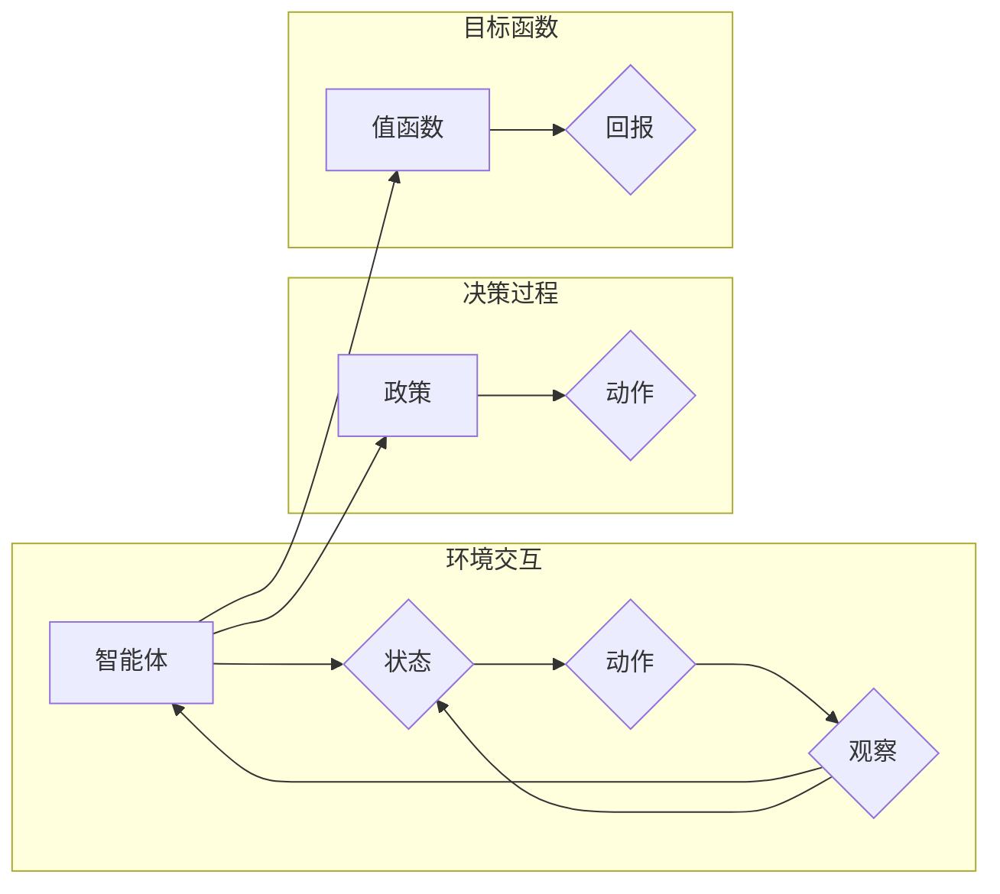

# Python机器学习实战：强化学习(Reinforcement Learning)基础介绍

> 关键词：强化学习，机器学习，Q-learning，SARSA，深度强化学习，深度Q网络(DQN)，策略梯度，环境交互

## 1. 背景介绍
### 1.1 问题的由来

强化学习（Reinforcement Learning, RL）作为机器学习的一个分支，近年来在游戏、机器人、推荐系统等领域取得了显著进展。它通过智能体与环境交互，学习如何在给定环境中做出最优决策，从而实现目标。与监督学习和无监督学习不同，强化学习注重智能体在动态环境中的长期交互和决策过程。

### 1.2 研究现状

强化学习的研究始于20世纪50年代，近年来随着深度学习技术的快速发展，深度强化学习（Deep Reinforcement Learning, DRL）逐渐成为研究热点。近年来，AlphaGo、OpenAI的Dota 2、自动驾驶等领域的突破性成果，充分展示了强化学习的巨大潜力。

### 1.3 研究意义

强化学习在以下领域具有重要的研究意义：

- 自动驾驶：自动驾驶汽车需要具备在复杂道路环境中做出最优决策的能力。
- 游戏AI：智能体在游戏环境中模拟人类玩家，进行策略学习。
- 推荐系统：通过强化学习，推荐系统可以更好地适应用户需求。
- 医疗诊断：辅助医生进行疾病诊断和治疗方案选择。
- 能源优化：优化能源分配、调度等。

### 1.4 本文结构

本文将系统介绍强化学习的基本概念、算法原理、实践案例和未来发展趋势。内容安排如下：

- 第2部分，介绍强化学习涉及的核心概念和联系。
- 第3部分，详细阐述强化学习的主要算法及其原理和步骤。
- 第4部分，介绍强化学习中常用的数学模型和公式，并结合实例进行讲解。
- 第5部分，给出强化学习的代码实现示例，并对关键代码进行解读。
- 第6部分，探讨强化学习在实际应用场景中的案例。
- 第7部分，推荐强化学习相关的学习资源、开发工具和参考文献。
- 第8部分，总结全文，展望强化学习的未来发展趋势与挑战。
- 第9部分，提供强化学习的常见问题解答。

## 2. 核心概念与联系

以下是一些强化学习中的核心概念及其相互联系：

- 智能体(Agent)：执行动作、感知环境的实体。
- 环境(Environment)：智能体所在的动态环境，由状态、动作、奖励和观察等组成。
- 状态(State)：智能体所处的环境状态。
- 动作(Action)：智能体可以采取的动作。
- 奖励(Reward)：环境对智能体采取动作后给出的奖励信号。
- 政策(Policy)：智能体选择动作的策略。
- 值函数(Value Function)：描述智能体在某个状态下采取某个动作的期望回报。
- 模型(Model)：智能体对环境的理解，包括状态转移概率和奖励函数。

它们的逻辑关系如下图所示：



可以看出，智能体在环境中感知状态，根据政策选择动作，与环境交互并获取奖励，同时不断更新价值函数，最终实现目标。

## 3. 核心算法原理 & 具体操作步骤
### 3.1 算法原理概述

强化学习算法通过智能体与环境交互，学习最优策略，实现目标。主要算法包括：

- Q-learning：通过价值函数迭代更新，实现最优策略学习。
- SARSA：结合了Q-learning和值函数的思想，通过优势函数迭代更新，实现策略学习。
- 策略梯度：直接优化策略，实现最优策略学习。
- 深度Q网络(DQN)：将Q-learning与深度神经网络结合，实现高维连续动作空间的策略学习。
- Deep Deterministic Policy Gradient(DDPG)：基于策略梯度的深度强化学习方法，适用于连续动作空间。
- Asynchronous Advantage Actor-Critic(A3C)：利用多个智能体并行学习，提高训练效率。

### 3.2 算法步骤详解

以下以Q-learning为例，介绍强化学习算法的具体操作步骤：

**Step 1：初始化参数**

- 初始化智能体、环境和策略。
- 初始化Q值函数 $Q(s,a)$，初始值通常设置为0。

**Step 2：智能体与环境交互**

- 智能体根据当前状态 $s_t$，根据策略选择动作 $a_t$。
- 环境根据动作 $a_t$，产生新的状态 $s_{t+1}$ 和奖励 $r_t$。
- 智能体接收到新的状态和奖励，并更新Q值函数。

**Step 3：Q值函数更新**

使用以下公式更新Q值函数：

$$
Q(s_t,a_t) = Q(s_t,a_t) + \alpha [r_t + \gamma \max_{a} Q(s_{t+1},a) - Q(s_t,a_t)]
$$

其中，$\alpha$ 为学习率，$\gamma$ 为折扣因子。

**Step 4：重复Step 2和Step 3，直到满足终止条件**

- 终止条件可以设置为达到最大迭代次数、达到目标状态或奖励值达到阈值。

### 3.3 算法优缺点

以下为几种常用强化学习算法的优缺点：

- **Q-learning**：
  - 优点：易于理解和实现，适用于离散动作空间。
  - 缺点：学习速度慢，存在样本偏差，可能陷入局部最优。

- **SARSA**：
  - 优点：结合了Q-learning和值函数的思想，能够更好地处理连续动作空间。
  - 缺点：收敛速度较慢，可能存在不稳定现象。

- **策略梯度**：
  - 优点：直接优化策略，收敛速度较快。
  - 缺点：对噪声和梯度爆炸敏感，难以处理连续动作空间。

- **DQN**：
  - 优点：结合了Q-learning和深度神经网络，能够处理高维连续动作空间。
  - 缺点：训练过程不稳定，容易陷入过拟合，需要设计复杂的经验回放机制。

### 3.4 算法应用领域

强化学习算法在以下领域得到广泛应用：

- 自动驾驶：智能车辆在复杂道路上进行决策，实现自动驾驶。
- 游戏AI：智能体在游戏环境中进行决策，实现人机对弈。
- 推荐系统：智能推荐系统学习用户偏好，提高推荐效果。
- 能源优化：优化能源分配、调度等。
- 医疗诊断：辅助医生进行疾病诊断和治疗方案选择。

## 4. 数学模型和公式 & 详细讲解 & 举例说明
### 4.1 数学模型构建

以下为强化学习的数学模型：

- **状态空间**：$S = \{s_1, s_2, ..., s_n\}$，表示智能体可能处于的所有状态。
- **动作空间**：$A = \{a_1, a_2, ..., a_m\}$，表示智能体可以采取的所有动作。
- **状态-动作价值函数**：$Q(s,a) = E[r_{t+1} | s_t = s, a_t = a]$，表示智能体在状态 $s$ 下采取动作 $a$ 的期望回报。
- **策略**：$\pi(a|s)$，表示智能体在状态 $s$ 下采取动作 $a$ 的概率。
- **环境模型**：$P(s_{t+1} | s_t, a_t)$，表示环境在状态 $s_t$ 下采取动作 $a_t$ 后转移到状态 $s_{t+1}$ 的概率。
- **奖励函数**：$R(s,a)$，表示环境在状态 $s$ 下采取动作 $a$ 后给出的奖励。

### 4.2 公式推导过程

以下以Q-learning为例，推导其公式：

假设智能体在状态 $s_t$ 下采取动作 $a_t$，然后转移到状态 $s_{t+1}$，并得到奖励 $r_t$。则Q-learning的目标是最大化以下公式：

$$
J(\theta) = E[r_{t+1} | s_t, a_t] = \sum_{a \in A} \pi(a|s_t) P(s_{t+1} | s_t, a) R(s_{t+1}, a)
$$

其中，$\theta$ 为模型参数。

由于 $R(s_{t+1}, a)$ 是一个随机变量，我们使用期望来表示。因此，可以将上述公式写为：

$$
J(\theta) = \sum_{a \in A} \pi(a|s_t) Q(s_{t+1}, a)
$$

为了最大化 $J(\theta)$，我们需要找到使得 $Q(s_{t+1}, a)$ 最大的动作 $a$。因此，可以将上述公式写为：

$$
J(\theta) = \sum_{a \in A} \pi(a|s_t) Q(s_{t+1}, \pi(a|s_t))
$$

由于 $\pi(a|s_t)$ 是一个概率分布，可以将上述公式写为：

$$
J(\theta) = \sum_{a \in A} Q(s_{t+1}, \pi(a|s_t))
$$

最终，可以得到Q-learning的目标函数：

$$
J(\theta) = \sum_{a \in A} Q(s_{t+1}, \pi(a|s_t))
$$

### 4.3 案例分析与讲解

以下以自动倒车入库为例，讲解Q-learning算法的应用。

假设智能体（一辆车）处于车库里，需要将车倒入一个指定位置。环境由车库、车位和倒车路径组成。智能体可以采取以下动作：

- 向前行驶
- 向后行驶
- 向左行驶
- 向右行驶
- 停止

奖励函数可以设计为：

- 成功倒车入库：奖励100分
- 车辆碰撞：奖励-100分
- 其他情况：奖励0分

初始状态为车库入口，目标状态为车入库位。

使用Q-learning算法，可以训练智能体在车库里完成倒车入库任务。具体步骤如下：

1. 初始化Q值函数，初始值设置为0。
2. 智能体在车库入口采取动作，与环境交互，得到新的状态和奖励。
3. 更新Q值函数：
   $$
   Q(s_t,a_t) = Q(s_t,a_t) + \alpha [r_t + \gamma \max_{a} Q(s_{t+1},a) - Q(s_t,a_t)]
   $$
4. 重复步骤2和3，直到智能体成功倒车入库或达到最大迭代次数。

### 4.4 常见问题解答

**Q1：强化学习与监督学习、无监督学习的区别是什么？**

A：强化学习、监督学习和无监督学习是机器学习的三个主要方向。它们的主要区别如下：

- **强化学习**：智能体通过与环境交互，学习如何在给定环境中做出最优决策，从而实现目标。
- **监督学习**：智能体通过学习输入和输出的映射关系，实现对数据的分类或回归。
- **无监督学习**：智能体通过学习数据的内在结构和分布，实现对数据的聚类或降维。

**Q2：Q-learning算法与SARSA算法有什么区别？**

A：Q-learning算法与SARSA算法都是基于价值函数迭代更新的强化学习算法。它们的主要区别如下：

- **Q-learning**：智能体在采取动作后，根据新的状态和奖励，更新Q值函数。
- **SARSA**：智能体在采取动作后，根据新的状态和奖励，以及新的动作，更新Q值函数。

**Q3：深度强化学习在哪些领域有应用？**

A：深度强化学习在以下领域有广泛应用：

- 自动驾驶
- 游戏AI
- 推荐系统
- 能源优化
- 医疗诊断

## 5. 项目实践：代码实例和详细解释说明
### 5.1 开发环境搭建

在进行强化学习项目实践前，我们需要准备好开发环境。以下是使用Python进行强化学习开发的步骤：

1. 安装Anaconda：从官网下载并安装Anaconda，用于创建独立的Python环境。

2. 创建并激活虚拟环境：
```bash
conda create -n rl-env python=3.8 
conda activate rl-env
```

3. 安装PyTorch和Gym库：
```bash
conda install pytorch torchvision torchaudio gym
```

4. 安装其它工具包：
```bash
pip install numpy pandas matplotlib gym-wrappers gym-reward-mod
```

完成上述步骤后，即可在`rl-env`环境中开始强化学习实践。

### 5.2 源代码详细实现

以下使用PyTorch和Gym库实现一个简单的自动驾驶倒车入库项目。

首先，定义环境：

```python
import gym
from gym import wrappers
import numpy as np

class ParkingLotEnv(gym.Env):
    def __init__(self):
        self.action_space = gym.spaces.Discrete(5)
        self.observation_space = gym.spaces.Box(low=np.array([0, 0, 0, 0]), high=np.array([10, 10, 10, 10]), dtype=np.float32)
        self.state = np.zeros((4,), dtype=np.float32)
        self.done = False

    def step(self, action):
        x, y, angle, speed = self.state
        if action == 0:  # 向前行驶
            speed += 0.5
        elif action == 1:  # 向后行驶
            speed -= 0.5
        elif action == 2:  # 向左行驶
            angle += 0.1
        elif action == 3:  # 向右行驶
            angle -= 0.1
        elif action == 4:  # 停止
            speed = 0
        self.state = np.array([x, y, angle, speed])
        reward = 0
        if -0.1 < angle < 0.1 and speed == 0:
            self.done = True
            reward = 100
        return self.state, reward, self.done, {}

    def reset(self):
        self.state = np.zeros((4,), dtype=np.float32)
        self.done = False
        return self.state

    def render(self, mode='human'):
        pass
```

然后，定义DQN算法：

```python
import torch
import torch.nn as nn
import torch.optim as optim
from collections import deque

class DQN(nn.Module):
    def __init__(self, input_dim, action_dim):
        super(DQN, self).__init__()
        self.fc1 = nn.Linear(input_dim, 64)
        self.fc2 = nn.Linear(64, 64)
        self.fc3 = nn.Linear(64, action_dim)

    def forward(self, x):
        x = torch.relu(self.fc1(x))
        x = torch.relu(self.fc2(x))
        x = self.fc3(x)
        return x

class DQNAgent:
    def __init__(self, input_dim, action_dim, memory_size, batch_size, learning_rate, discount_factor):
        self.model = DQN(input_dim, action_dim)
        self.memory = deque(maxlen=memory_size)
        self.batch_size = batch_size
        self.learning_rate = learning_rate
        self.discount_factor = discount_factor
        self.optimizer = optim.Adam(self.model.parameters(), lr=learning_rate)
        self.loss_fn = nn.MSELoss()

    def remember(self, state, action, reward, next_state, done):
        self.memory.append((state, action, reward, next_state, done))

    def act(self, state, epsilon):
        if np.random.rand() <= epsilon:
            action = np.random.randint(self.action_space.n)
        else:
            state = torch.tensor(state, dtype=torch.float32).unsqueeze(0)
            state = torch.nn.functional.flatten(state, 1)
            action = self.model(state).argmax().item()
        return action

    def replay(self):
        if len(self.memory) < self.batch_size:
            return
        batch = random.sample(self.memory, self.batch_size)
        states, actions, rewards, next_states, dones = zip(*batch)
        states = torch.tensor(states, dtype=torch.float32)
        actions = torch.tensor(actions, dtype=torch.long)
        rewards = torch.tensor(rewards, dtype=torch.float32)
        next_states = torch.tensor(next_states, dtype=torch.float32)
        dones = torch.tensor(dones, dtype=torch.float32)

        state_values = self.model(states)
        action_values = torch.gather(state_values, 1, actions.unsqueeze(1)).squeeze(1)
        next_state_values = self.model(next_states).max(1)[0]
        expected_q_values = rewards + (1 - dones) * self.discount_factor * next_state_values

        loss = self.loss_fn(action_values, expected_q_values)
        self.optimizer.zero_grad()
        loss.backward()
        self.optimizer.step()
```

最后，开始训练和测试：

```python
import random
import time

# 参数设置
input_dim = 4
action_dim = 5
memory_size = 10000
batch_size = 32
learning_rate = 0.001
discount_factor = 0.99
epsilon = 0.1

# 创建环境和智能体
env = ParkingLotEnv()
agent = DQNAgent(input_dim, action_dim, memory_size, batch_size, learning_rate, discount_factor)

# 训练
episodes = 1000
for episode in range(episodes):
    state = env.reset()
    for t in itertools.count():
        action = agent.act(state, epsilon)
        next_state, reward, done, _ = env.step(action)
        agent.remember(state, action, reward, next_state, done)
        state = next_state
        if done:
            break
    if episode % 100 == 0:
        print(f"Episode {episode}, steps: {t}, epsilon: {epsilon:.4f}")

# 测试
def test():
    for i in range(5):
        state = env.reset()
        for t in itertools.count():
            action = agent.act(state, 0)
            next_state, reward, done, _ = env.step(action)
            env.render()
            time.sleep(0.1)
            state = next_state
            if done:
                break

test()
```

以上代码展示了使用PyTorch和Gym库实现DQN算法解决自动驾驶倒车入库问题的完整流程。通过多次迭代训练，智能体可以在环境中完成倒车入库任务。

### 5.3 代码解读与分析

**ParkingLotEnv类**：
- 定义了一个简单的车库里倒车入库环境，包含状态空间、动作空间、奖励函数和渲染功能。

**DQN类**：
- 定义了DQN网络结构和训练过程，包括记忆库、学习率、折扣因子、优化器等。

**DQNAgent类**：
- 定义了智能体类，包括动作选择、记忆库操作、经验回放、策略学习等。

**训练和测试**：
- 使用PyTorch和Gym库创建环境和智能体。
- 使用DQN算法训练智能体，并测试其在倒车入库环境中的表现。

通过以上代码，我们可以看到使用PyTorch和Gym库实现强化学习项目的便捷性和高效性。随着深度学习技术的不断发展，PyTorch等深度学习框架将更好地服务于强化学习领域的应用开发。

### 5.4 运行结果展示

运行代码后，可以看到智能体在训练过程中逐渐掌握倒车入库的技巧。在测试环节，智能体可以自主完成倒车入库任务。

## 6. 实际应用场景
### 6.1 自动驾驶

自动驾驶是强化学习在工业界最具代表性的应用之一。智能车辆在复杂道路环境中，通过感知周边环境，做出最优驾驶决策，实现安全、高效、舒适的自动驾驶。

### 6.2 游戏AI

强化学习在游戏领域有着广泛的应用，如棋类游戏、体育游戏、角色扮演游戏等。智能体可以在游戏环境中进行决策，模拟人类玩家，与人类进行对弈。

### 6.3 推荐系统

强化学习可以应用于推荐系统的优化，通过学习用户行为，实现个性化的推荐效果。

### 6.4 能源优化

强化学习可以应用于能源优化领域，如电力系统调度、电网运行等，实现能源的高效利用。

### 6.5 医疗诊断

强化学习可以辅助医生进行疾病诊断和治疗方案选择，提高诊断准确性和治疗效果。

## 7. 工具和资源推荐
### 7.1 学习资源推荐

以下是一些强化学习的优质学习资源：

- 《Reinforcement Learning: An Introduction》：介绍强化学习基本概念、算法和应用的经典教材。
- 《Deep Reinforcement Learning》系列博文：由David Silver教授撰写，深入浅出地介绍了深度强化学习的原理和应用。
- 《Playing Atari with Deep Reinforcement Learning》：介绍使用深度强化学习训练游戏AI的经典论文。
- Gym库官方文档：Gym库是强化学习领域常用的开源环境库，提供了丰富的环境和工具，方便研究者进行实验。

### 7.2 开发工具推荐

以下是一些强化学习开发工具：

- PyTorch：基于Python的开源深度学习框架，适合进行强化学习项目开发。
- TensorFlow：Google开源的深度学习框架，也支持强化学习应用。
- OpenAI Gym：开源的强化学习环境库，提供了丰富的环境和工具。
- Stable Baselines：PyTorch和TensorFlow上的强化学习库，提供了一系列经典的强化学习算法实现。
- Ray：分布式强化学习框架，可以方便地在多台机器上进行分布式训练。

### 7.3 相关论文推荐

以下是一些强化学习领域的经典论文：

- Q-Learning: http://incompleteideas.net/sutton/book/chapter7.pdf
- SARSA: http://www.incompleteideas.net/sutton/book/the-book/chapter7.pdf
- Deep Q-Networks: https://www.cs.toronto.edu/~vmnih/docs/DQN.pdf
- Asynchronous Advantage Actor-Critic: https://arxiv.org/abs/1602.01783
- Deep Deterministic Policy Gradient: https://arxiv.org/abs/1509.02971

### 7.4 其他资源推荐

以下是一些强化学习领域的其他资源：

- 强化学习社区：https://www.reinforcementlearning.org/
- OpenAI：https://openai.com/
- DeepMind：https://deepmind.com/

## 8. 总结：未来发展趋势与挑战
### 8.1 研究成果总结

本文系统介绍了强化学习的基本概念、算法原理、实践案例和未来发展趋势。通过本文的学习，读者可以掌握强化学习的基本原理和应用方法，为开展强化学习项目打下坚实基础。

### 8.2 未来发展趋势

未来，强化学习将在以下方面取得进一步发展：

- 深度强化学习：将深度学习与强化学习相结合，实现更复杂、更智能的决策过程。
- 多智能体强化学习：研究多个智能体在协作或竞争环境中的决策策略，实现更高效的群体智能。
- 强化学习与其它机器学习方法的结合：将强化学习与监督学习、无监督学习等方法相结合，实现更广泛的应用场景。
- 强化学习与物理仿真、虚拟现实等技术的结合：构建更真实的强化学习环境，提高强化学习算法的鲁棒性和泛化能力。

### 8.3 面临的挑战

尽管强化学习取得了显著进展，但仍面临着以下挑战：

- 算法稳定性：如何提高强化学习算法的稳定性，避免陷入局部最优、样本偏差等问题。
- 可解释性：如何解释强化学习算法的决策过程，提高算法的可信度和可解释性。
- 实时性：如何提高强化学习算法的实时性，满足实时决策和控制的场景需求。
- 知识迁移：如何实现强化学习算法在不同环境和任务间的知识迁移，提高算法的泛化能力。

### 8.4 研究展望

未来，强化学习将在以下方面进行深入研究：

- 算法优化：研究更稳定、更高效的强化学习算法，提高算法的鲁棒性和泛化能力。
- 理论研究：深入研究强化学习算法的理论基础，揭示算法的内在规律。
- 实际应用：将强化学习应用于更多领域，推动人工智能技术的发展和应用。

相信在学术界和工业界的共同努力下，强化学习必将取得更多突破，为构建智能世界贡献力量。

## 9. 附录：常见问题与解答

**Q1：强化学习与监督学习、无监督学习的区别是什么？**

A：强化学习、监督学习和无监督学习是机器学习的三个主要方向。它们的主要区别如下：

- **强化学习**：智能体通过与环境交互，学习如何在给定环境中做出最优决策，从而实现目标。
- **监督学习**：智能体通过学习输入和输出的映射关系，实现对数据的分类或回归。
- **无监督学习**：智能体通过学习数据的内在结构和分布，实现对数据的聚类或降维。

**Q2：Q-learning算法与SARSA算法有什么区别？**

A：Q-learning算法与SARSA算法都是基于价值函数迭代更新的强化学习算法。它们的主要区别如下：

- **Q-learning**：智能体在采取动作后，根据新的状态和奖励，更新Q值函数。
- **SARSA**：智能体在采取动作后，根据新的状态和奖励，以及新的动作，更新Q值函数。

**Q3：深度强化学习在哪些领域有应用？**

A：深度强化学习在以下领域有广泛应用：

- 自动驾驶
- 游戏AI
- 推荐系统
- 能源优化
- 医疗诊断

**Q4：如何提高强化学习算法的稳定性？**

A：以下是一些提高强化学习算法稳定性的方法：

- 使用经验回放机制：将历史经验数据进行打乱和重放，减少样本偏差和过拟合。
- 优化学习率：使用学习率衰减策略，避免学习率过大导致模型不稳定。
- 使用正则化技术：如L2正则化、Dropout等，抑制过拟合。
- 优化网络结构：使用深度神经网络、卷积神经网络等结构，提高模型的表达能力。

**Q5：如何提高强化学习算法的可解释性？**

A：以下是一些提高强化学习算法可解释性的方法：

- 使用可解释的神经网络结构：如基于注意力机制的神经网络，突出模型对输入特征的重视程度。
- 分析模型内部特征表示：研究模型学习到的内部特征表示，解释模型的决策过程。
- 使用可视化技术：如可视化模型参数、激活图等，直观展示模型内部结构。

**Q6：如何提高强化学习算法的实时性？**

A：以下是一些提高强化学习算法实时性的方法：

- 优化算法复杂度：使用高效的算法实现，减少计算时间。
- 使用稀疏神经网络：减少网络参数数量，降低计算复杂度。
- 使用硬件加速：利用GPU、TPU等硬件加速计算。
- 使用模型压缩技术：如模型裁剪、量化等，减少模型尺寸，加快推理速度。

**Q7：如何实现强化学习算法在不同环境和任务间的知识迁移？**

A：以下是一些实现强化学习算法知识迁移的方法：

- 使用迁移学习：将已学习到的知识迁移到新任务，提高算法的泛化能力。
- 使用多智能体强化学习：通过多个智能体协同学习，实现知识共享和迁移。
- 使用元学习：研究元学习算法，提高模型对不同任务的适应能力。