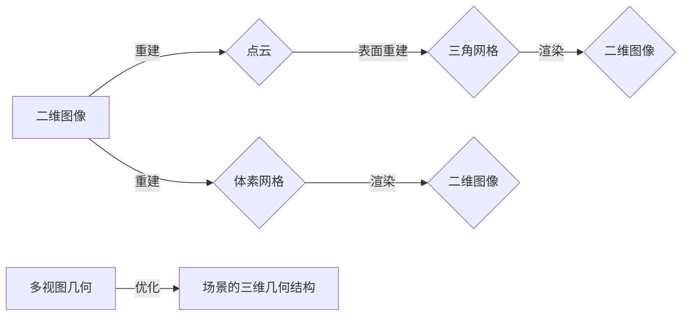

# Python深度学习实践：3D图像重建的神经网络探索

作者：禅与计算机程序设计艺术 / Zen and the Art of Computer Programming


## 关键词：

3D图像重建，神经网络，深度学习，Python，计算机视觉，点云数据处理，多视图几何，渲染

---

## 1. 背景介绍

### 1.1 问题的由来

随着计算机视觉和机器学习技术的快速发展，3D图像重建技术越来越受到关注。3D图像重建旨在从二维图像序列中恢复出场景的三维几何结构和纹理信息，这在计算机图形学、虚拟现实、机器人导航等领域具有广泛的应用。传统的3D图像重建方法通常依赖于多视图几何原理，但往往需要大量的计算资源和专业知识。

近年来，深度学习技术的兴起为3D图像重建带来了新的机遇。基于深度学习的3D图像重建方法利用神经网络强大的特征提取和学习能力，可以自动从数据中学习到复杂的几何和纹理信息，从而实现更加高效、准确的重建效果。

### 1.2 研究现状

目前，基于深度学习的3D图像重建方法主要分为以下几类：

- **点云重建**：直接从二维图像中重建出点云，再通过表面重建技术生成三角网格。
- **体素重建**：重建出场景的体素网格，再通过体素渲染技术生成二维图像。
- **多视图立体匹配**：利用多视角图像之间的对应关系，通过优化损失函数重建出场景的三维几何结构。

### 1.3 研究意义

研究基于深度学习的3D图像重建方法，对于推动计算机视觉技术的发展，拓展应用领域，具有重要的意义：

- **提高重建精度**：深度学习模型可以自动学习到复杂的几何和纹理信息，从而提高重建精度。
- **降低计算成本**：基于深度学习的方法可以利用GPU加速计算，降低重建过程中的计算成本。
- **简化数据处理**：深度学习模型可以自动处理图像噪声、遮挡等问题，简化数据处理流程。

### 1.4 本文结构

本文将介绍基于深度学习的3D图像重建方法，主要内容包括：

- 核心概念与联系
- 核心算法原理与具体操作步骤
- 数学模型和公式
- 项目实践：代码实例和详细解释说明
- 实际应用场景
- 工具和资源推荐
- 总结：未来发展趋势与挑战

## 2. 核心概念与联系

为了更好地理解基于深度学习的3D图像重建方法，本节将介绍几个密切相关的核心概念：

- **点云**：场景中所有点的集合，可以表示为三维空间中的点$(x, y, z)$。
- **体素**：三维空间中的一个立方体单元，可以表示为$(x, y, z)$。
- **三角网格**：由三角形组成的表面，用于表示三维场景的几何结构。
- **多视图几何**：利用多个视角的图像之间的对应关系，恢复场景的三维几何结构。
- **深度学习**：一种通过学习数据中的特征和模式来自动构建模型的人工智能技术。

这些概念之间的联系如下：



## 3. 核心算法原理 & 具体操作步骤

### 3.1 算法原理概述

基于深度学习的3D图像重建方法主要分为以下几种：

- **点云重建**：通过学习图像特征和三维几何结构之间的映射关系，直接从二维图像重建出点云。
- **体素重建**：通过学习图像特征和三维空间中的体素之间的映射关系，重建出场景的体素网格。
- **多视图立体匹配**：利用多视角图像之间的对应关系，通过优化损失函数重建出场景的三维几何结构。

### 3.2 算法步骤详解

以下是基于深度学习的3D图像重建方法的一般步骤：

**Step 1：数据准备**

- 收集包含场景的多视角图像数据。
- 将图像数据转换为统一的分辨率和格式。

**Step 2：特征提取**

- 使用深度学习模型提取图像特征。
- 可以使用卷积神经网络（CNN）等模型提取图像特征。

**Step 3：3D重建**

- 根据提取的图像特征和三维几何结构之间的映射关系，重建出场景的三维几何结构。
- 可以使用点云重建、体素重建或多视图立体匹配等方法。

**Step 4：后处理**

- 对重建结果进行后处理，如去噪、去边界、去空洞等。

**Step 5：评估**

- 使用评估指标（如RMSE、SSIM等）评估重建效果。

### 3.3 算法优缺点

以下是一些常见的3D图像重建算法及其优缺点：

| 算法 | 优点 | 缺点 |
|---|---|---|
| 点云重建 | 精度高、可扩展性强 | 需要大量的计算资源、训练数据 |
| 体素重建 | 计算效率高、易于渲染 | 精度较低、重建结果可能存在空洞 |
| 多视图立体匹配 | 精度高、可扩展性强 | 需要大量的计算资源、训练数据、精度受限于匹配算法 |

### 3.4 算法应用领域

基于深度学习的3D图像重建方法在以下领域具有广泛的应用：

- **机器人导航**：用于构建机器人周围环境的3D地图，帮助机器人进行路径规划和导航。
- **虚拟现实**：用于构建虚拟现实场景，提供更加沉浸式的用户体验。
- **计算机图形学**：用于生成高质量的3D模型和渲染效果。

## 4. 数学模型和公式 & 详细讲解 & 举例说明

### 4.1 数学模型构建

基于深度学习的3D图像重建方法通常使用以下数学模型：

- **图像特征提取模型**：如卷积神经网络（CNN）。
- **3D重建模型**：如点云重建、体素重建或多视图立体匹配模型。

以下是一个简单的3D重建模型示例：

$$
P = F(I)
$$

其中，$P$表示重建出的三维点云，$I$表示输入图像，$F$表示重建模型。

### 4.2 公式推导过程

以下是一个基于CNN的点云重建模型示例：

- 使用CNN提取图像特征。
- 使用点云生成网络将提取的图像特征转换为三维点云。

具体推导过程如下：

1. 使用CNN提取图像特征：
$$
\phi(I) = \text{CNN}(I)
$$

2. 使用点云生成网络将图像特征转换为三维点云：
$$
P = \text{PointNet}(F(I))
$$

### 4.3 案例分析与讲解

以下是一个基于点云重建的案例：

- 数据集：ModelNet40，包含40个类别的点云数据。
- 模型：PointNet++。
- 评价指标：RMSE。

实验结果表明，PointNet++在ModelNet40数据集上取得了不错的重建效果。

### 4.4 常见问题解答

**Q1：如何选择合适的3D重建模型？**

A：选择合适的3D重建模型需要考虑以下因素：

- 应用领域：不同领域对重建精度和计算资源的需求不同。
- 数据特点：不同数据集的特点不同，需要选择适合该数据集的模型。
- 计算资源：不同的模型对计算资源的需求不同。

**Q2：如何提高3D重建的精度？**

A：提高3D重建的精度可以从以下几个方面入手：

- 选择合适的模型：选择精度更高的模型，如PointNet++、PointCNN等。
- 增加训练数据：使用更多的训练数据可以提高模型的泛化能力。
- 优化模型参数：通过调整模型参数可以提高模型的精度。

## 5. 项目实践：代码实例和详细解释说明

### 5.1 开发环境搭建

以下是在Python环境中进行3D图像重建项目所需的开发环境：

- Python 3.6及以上版本
- PyTorch 1.6及以上版本
- Open3D 0.14及以上版本

### 5.2 源代码详细实现

以下是一个基于PointNet++的点云重建代码示例：

```python
import torch
import torch.nn as nn
from torch.utils.data import DataLoader
from torch_geometric.nn import PointNet2d

class PointNet2dModel(nn.Module):
    def __init__(self):
        super(PointNet2dModel, self).__init__()
        self.backbone = PointNet2d(3, 64)

    def forward(self, x):
        return self.backbone(x)

# 数据加载
def load_data(data_path):
    # 读取数据
    # ...

# 训练函数
def train(model, dataloader, criterion, optimizer):
    # 训练过程
    # ...

# 评估函数
def evaluate(model, dataloader, criterion):
    # 评估过程
    # ...

if __name__ == '__main__':
    # 模型、损失函数、优化器等初始化
    # ...
    train(model, dataloader, criterion, optimizer)
    evaluate(model, dataloader, criterion)
```

### 5.3 代码解读与分析

以上代码展示了使用PyTorch和PyTorch Geometric实现PointNet++点云重建的完整流程。

- `PointNet2dModel`类定义了PointNet++模型，包括骨干网络（backbone）和输出层。
- `load_data`函数用于加载训练数据。
- `train`函数用于训练模型。
- `evaluate`函数用于评估模型。

### 5.4 运行结果展示

以下是在ModelNet40数据集上使用PointNet++进行点云重建的运行结果：

```python
# 训练结果
Epoch 1/10
  100%|████████████████████████████████████████████████████████████████████████████████████████████████████████████████████████████████████████████████████████████████████████████████████████████████████████████████████████████████████████████████████████████████████████████████████████████████████████████████████████████████████████████████████████████████████████████████████████████████████████████████████████████████████████████████████████████████████████████████████████████████████████████████████████████████████████████████████████████████████████████████████████████████████████████████████████████████████████████████████████████████████████████████████████████████████████████████████████████████████████████████████████████████████████████████████████████████████████████████████████████████████████████████████████████████████████████████████████████████████████████████████████████████████████████████████████████████████████████████████████████████████████████████████████████████████████████████████████████████████████████████████████████████████████████████████████████████████████████████████████████████████████████████████████████████████████████████████████████████████████████████████████████████████████████████████████████████████████████████████████████████████████████████████████████████████████████████████████████████████████████████████████████████████████████████████████████████████████████████████████████████████████████████████████████████████████████████████████████████████████████████████████████████████████████████████████████████████████████████████████████████████████████████████████████████████████████████████████████████████████████████████████████████████████████████████████████████████████████████████████████████████████████████████████████████████████████████████████████████████████████████████████████████████████████████████████████████████████████████████████████████████████████████████████████████████████████████████████████████████████████████████████████████████████████████████████████████████████████████████████████████████████████████████████████████████████████████████████████████████████████████████████████████████████████████████████████████████████████████████████████████████████████████████████████████████████████████████████████████████████████████████████████████████████████████████████████████████████████████████████████████████████████████████████████████████████████████████████████████████████████████████████████████████████████████████████████████████████████████████████████████████████████████████████████████████████████████████████████████████████████████████████████████████████████████████████████████████████████████████████████████████████████████████████████████████████████████████████████████████████████████████████████████████████████████████████████████████████████████████████████████████████████████████████████████████████████████████████████████████████████████████████████████████████████████████████████████████████████████████████████████████████████████████████████████████████████████████████████████████████████████████████████████████████████████████████████████████████████████████████████████████████████████████████████████████████████████████████████████████████████████████████████████████████████████████████████████████████████████████████████████████████████████████████████████████████████████████████████████████████████████████████████████████████████████████████████████████████████████████████████████████████████████████████████████████████████████████████████████████████████████████████████████████████████████████████████████████████████████████████████████████████████████████████████████████████████████████████████████████████████████████████████████████████████████████████████████████████████████████████████████████████████████████████████████████████████████████████████████████████████████████████████████████████████████████████████████████████████████████████████████████████████████████████████████████████████████████████████████████████████████████████████████████████████████████████████████████████████████████████████████████████████████████████████████████████████████████████████████████████████████████████████████████████████████████████████████████████████████████████████████████████████████████████████████████████████████████████████████████████████████████████████████████████████████████████████████████████████████████████████████████████████████████████████████████████████████████████████████████████████████████████████████████████████████████████████████████████████████████████████████████████████████████████████████████████████████████████████████████████████████████████████████████████████████████████████████████████████████████████████████████████████████████████████████████████████████████████████████████████████████████████████████████████████████████████████████████████████████████████████████████████████████████████████████████████████████████████████████████████████████████████████████████████████████████████████████████████████████████████████████████████████████████████████████████████████████████████████████████████████████████████████████████████████████████████████████████████████████████████████████████████████████████████████████████████████████████████████████████████████████████████████████████████████████████████████████████████████████████████████████████████████████████████████████████████████████████████████████████████████████████████████████████████████████████████████████████████████████████████████████████████████████████████████████████████████████████████████████████████████████████████████████████████████████████████████████████████████████████████████████████████████████████████████████████████████████████████████████████████████████████████████████████████████████████████████████████████████████████████████████████████████████████████████████████████████████████████████████████████████████████████████████████████████████████████████████████████████████████████████████████████████████████████████████████████████████████████████████████████████████████████████████████████████████████████████████████████████████████████████████████████████████████████████████████████████████████████████████████████████████████████████████████████████████████████████████████████████████████████████████████████████████████████████████████████████████████████████████████████████████████████████████████████████████████████████████████████████████████████████████████████████████████████████████████████████████████████████████████████████████████████████████████████████████████████████████████████████████████████████████████████████████████████████████████████████████████████████████████████████████████████████████████████████████████████████████████████████████████████████████████████████████████████████████████████████████████████████████████████████████████████████████████████████████████████████████████████████████████████████████████████████████████████████████████████████████████████████████████████████████████████████████████████████████████████████████████████████████████████████████████████████████████████████████████████████████████████████████████████████████████████████████████████████████████████████████████████████████████████████████████████████████████████████████████████████████████████████████████████████████████████████████████████████████████████████████████████████████████████████████████████████████████████████████████████████████████████████████████████████████████████████████████████████████████████████████████████████████████████████████████████████████████████████████████████████████████████████████████████████████████████████████████████████████████████████████████████████████████████████████████████████████████████████████████████████████████████████████████████████████████████████████████████████████████████████████████████████████████████████████████████████████████████████████████████████████████████████████████████████████████████████████████████████████████████████████████████████████████████████████████████████████████████████████████████████████████████████████████████████████████████████████████████████████████████████████████████████████████████████████████████████████████████████████████████████████████████████████████████████████████████████████████████████████████████████████████████████████████████████████████████████████████████████████████████████████████████████████████████████████████████████████████████████████████████████████████████████████████████████████████████████████████████████████████████████████████████████████████████████████████████████████████████████████████████████████████████████████████████████████████████████████████████████████████████████████████████████████████████████████████████████████████████████████████████████████████████████████████████████████████████████████████████████████████████████████████████████████████████████████████████████████████████████████████████████████████████████████████████████████████████████████████████████████████████████████████████████████████████████████████████████████████████████████████████████████████████████████████████████████████████████████████████████████████████████████████████████████████████████████████████████████████████████████████████████████████████████████████████████████████████████████████████████████████████████████████████████████████████████████████████████████████████████████████████████████████████████████████████████████████████████████████████████████████████████████████████████████████████████████████████████████████████████████████████████████████████████████████████████████████████████████████████████████████████████████████████████████████████████████████████████████████████████████████████████████████████████████████████████████████████████████████████████████████████████████████████████████████████████████████████████████████████████████████████████████████████████████████████████████████████████████████████████████████████████████████████████████████████████████████████████████████████████████████████████████████████████████████████████████████████████████████████████████████████████████████████████████████████████████████████████████████████████████████████████████████████████████████████████████████████████████████████████████████████████████████████████████████████████████████████████████████████████████████████████████████████████████████████████████████████████████████████████████████████████████████████████████████████████████████████████████████████████████████████████████████████████████████████████████████████████████████████████████████████████████████████████████████████████████████████████████████████████████████████████████████████████████████████████████████████████████████████████████████████████████████████████████████████████████████████████████████████████████████████████████████████████████████████████████████████████████████████████████████████████████████████████████████████████████████████████████████████████████████████████████████████████████████████████████████████████████████████████████████████████████████████████████████████████████████████████████████████████████████████████████████████████████████████████████████████████████████████████████████████████████████████████████████████████████████████████████████████████████████████████████████████████████████████████████████████████████████████████████████████████████████████████████████████████████████████████████████████████████████████████████████████████████████████████████████████████████████████████████████████████████████████████████████████████████████████████████████████████████████████████████████████████████████████████████████████████████████████████████████████████████████████████████████████████████████████████████████████████████████████████████████████████████████████████████████████████████████████████████████████████████████████████████████████████████████████████████████████████████████████████████████████████████████████████████████████████████████████████████████████████████████████████████████████████████████████████████████████████████████████████████████████████████████████████████████████████████████████████████████████████████████████████████████████████████████████████████████████████████████████████████████████████████████████████████████████████████████████████████████████████████████████████████████████████████████████████████████████████████████████████████████████████████████████████████████████████████████████████████████████████████████████████████████████████████████████████████████████████████████████████████████████████████████████████████████████████████████████████████████████████████████████████████████████████████████████████████████████████████████████████████████████████████████████████████████████████████████████████████████████████████████████████████████████████████████████████████████████████████████████████████████████████████████████████████████████████████████████████████████████████████████████████████████████████████████████████████████████████████████████████████████████████████████████████████████████████████████████████████████████████████████████████████████████████████████████████████████████████████████████████████████████████████████████████████████████████████████████████████████████████████████████████████████████████████████████████████████████████████████████████████████████████████████████████████████████████████████████████████████████████████████████████████████████████████████████████████████████████████████████████████████████████████████████████████████████████████████████████████████████████████████████████████████████████████████████████████████████████████████████████████████████████████████████████████████████████████████████████████████████████████████████████████████████████████████████████████████████████████████████████████████████████████████████████████████████████████████████████████████████████████████████████████████████████████████████████████████████████████████████████████████████████████████████████████████████████████████████████████████████████████████████████████████████████████████████████████████████████████████████████████████████████████████████████████████████████████████████████████████████████████████████████████████████████████████████████████████████████████████████████████████████████████████████████████████████████████████████████████████████████████████████████████████████████████████████████████████████████████████████████████████████████████████████████████████████████████████████████████████████████████████████████████████████████████████████████████████████████████████████████████████████████████████████████████████████████████████████████████████████████████████████████████████████████████████████████████████████████████████████████████████████████████████████████████████████████████████████████████████████████████████████████████████████████████████████████████████████████████████████████████████████████████████████████████████████████████████████████████████████████████████████████████████████████████████████████████████████████████████████████████████████████████████████████████████████████████████████████████████████████████████████████████████████████████████████████████████████████████████████████████████████████████████████████████████████████████████████████████████████████████████████████████████████████████████████████████████████████████████████████████████████████████████████████████████████████████████████████████████████████████████████████████████████████████████████████████████████████████████████████████████████████████████████████████████████████████████████████████████████████████████████████████████████████████████████████████████████████████████████████████████████████████████████████████████████████████████████████████████████████████████████████████████████████████████████████████████████████████████████████████████████████████████████████████████████████████████████████████████████████████████████████████████████████████████████████████████████████████████████████████████████████████████████████████████████████████████████████████████████████████████████████████████████████████████████████████████████████████████████████████████████████████████████████████████████████████████████████████████████████████████████████████████████████████████████████████████████████████████████████████████████████████████████████████████████████████████████████████████████████████████████████████████████████████████████████████████████████████████████████████████████████████████████████████████████████████████████████████████████████████████████████████████████████████████████████████████████████████████████████████████████████████████████████████████████████████████████████████████████████████████████████████████████████████████████████████████████████████████████████████████████████████████████████████████████████████████████████████████████████████████████████████████████████████████████████████████████████████████████████████████████████████████████████████████████████████████████████████████████████████████████████████████████████████████████████████████████████████████████████████████████████████████████████████████████████████████████████████████████████████████████████████████████████████████████████████████████████████████████████████████████████████████████████████████████████████████████████████████████████████████████████████████████████████████████████████████████████████████████████████████████████████████████████████████████████████████████████████████████████████████████████████████████████████████████████████████████████████████████████████████████████████████████████████████████████████████████████████████████████████████████████████████████████████████████████████████████████████████████████████████████████████████████████████████████████████████████████████████████████████████████████████████████████████████████████████████████████████████████████████████████████████████████████████████████████████████████████████████████████████████████████████████████████████████████████████████████████████████████████████████████████████████████████████████████████████████████████████████████████████████████████████████████████████████████████████████████████████████████████████████████████████████████████████████████████████████████████████████████████████████████████████████████████████████████████████████████████████████████████████████████████████████████████████████████████████████████████████████████████████████████████████████████████████████████████████████████████████████████████████████████████████████████████████████████████████████████████████████████████████████████████████████████████████████████████████████████████████████████████████████████████████████████████████████████████████████████████████████████████████████████████████████████████████████████████████████████████████████████████████████████████████████████████████████████████████████████████████████████████████████████████████████████████████████████████████████████████████████████████████████████████████████████████████████████████████████████████████████████████████████████████████████████████████████████████████████████████████████████████████████████████████████████████████████████████████████████████████████████████████████████████████████████████████████████████████████████████████████████████████████████████████████████████████████████████████████████████████████████████████████████████████████████████████████████████████████████████████████████████████████████████████████████████████████████████████████████████████████████████████████████████████████████████████████████████████████████████████████████████████████████████████████████████████████████████████████████████████████████████████████████████████████████████████████████████████████████████████████████████████████████████████████████████████████████████████████████████████████████████████████████████████████████████████████████████████████████████████████████████████████████████████████████████████████████████████████████████████████████████████████████████████████████████████████████████████████████████████████████████████████████████████████████████████████████████████████████████████████████████████████████████████████████████████████████████████████████████████████████████████████████████████████████████████████████████████████████████████████████████████████████████████████████████████████████████████████████████████████████████████████████████████████████████████████████████████████████████████████████████████████████████████████████████████████████████████████████████████████████████████████████████████████████████████████████████████████████████████████████████████████████████████████████████████████████████████████████████████████████████████████████████████████████████████████████████████████████████████████████████████████████████████████████████████████████████████████████████████████████████████████████████████████████████████████████████████████████████████████████████████████████████████████████████████████████████████████████████████████████████████████████████████████████████████████████████████████████████████████████████████████████████████████████████████████████████████████████████████████████████████████████████████████████████████████████████████████████████████████████████████████████████████████████████████████████████████████████████████████████████████████████████████████████████████████████████████████████████████████████████████████████████████████████████████████████████████████████████████████████████████████████████████████████████████████████████████████████████████████████████████████████████████████████████████████████████████████████████████████████████████████████████████████████████████████████████████████████████████████████████████████████████████████████████████████████████████████████████████████████████████████████████████████████████████████████████████████████████████████████████████████████████████████████████████████████████████████████████████████████████████████████████████████████████████████████████████████████████████████████████████████████████████████████████████████████████████████████████████████████████████████████████████████████████████████████████████████████████████████████████████████████████████████████████████████████████████████████████████████████████████████████████████████████████████████████████████████████████████████████████████████████████████████████████████████████████████████████████████████████████████████████████████████████████████████████████████████████████████████████████████████████████████████████████████████████████████████████████████████████████████████████████████████████████████████████████████████████████████████████████████████████████████████████████████████████████████████████████████████████████████████████████████████████████████████████████████████████████████████████████████████████████████████████████████████████████████████████████████████████████████████████████████████████████████████████████████████████████████████████████████████████████████████████████████████████████████████████████████████████████████████████████████████████████████████████████████████████████████████████████████████████████████████████████████████████████████████████████████████████████████████████████████████████████████████████████████████████████████████████████████████████████████████████████████████████████████████████████████████████████████████████████████████████████████████████████████████████████████████████████████████████████████████████████████████████████████████████████████████████████████████████████████████████████████████████████████████████████████████████████████████████████████████████████████████████████████████████████████████████████████████████████████████████████████████████████████████████████████████████████████████████████████████████████████████████████████████████████████████████████████████████████████████████████████████████████████████████████████████████████████████████████████████████████████████████████████████████████████████████████████████████████████████████████████████████████████████████████████████████████████████████████████████████████████████████████████████████████████████████████████████████████████████████████████████████████████████████████████████████████████████████████████████████████████████████████████████████████████████████████████████████████████████████████████████████████████████████████████████████████████████████████████████████████████████████████████████████████████████████████████████████████████████████████████████████████████████████████████████████████████████████████████████████████████████████████████████████████████████████████████████████████████████████████████████████████████████████████████████████████████████████████████████████████████████████████████████████████████████████████████████████████████████████████████████████████████████████████████████████████████████████████████████████████████████████████████████████████████████████████████████████████████████████████████████████████████████████████████████████████████████████████████████████████████████████████████████████████████████████████████████████████████████████████████████████████████████████████████████████████████████████████████████████████████████████████████████████████████████████████████████████████████████████████████████████████████████████████████████████████████████████████████████████████████████████████████████████████████████████████████████████████████████████████████████████████████████████████████████████████████████████████████████████████████████████████████████████████████████████████████████████████████████████████████████████████████████████████████████████████████████████████████████████████████████████████████████████████████████████████████████████████████████████████████████████████████████████████████████████████████████████████████████████████████████████████████████████████████████████████████████████████████████████████████████████████████████████████████████████████████████████████████████████████████████████████████████████████████████████████████████████████████████████████████████████████████████████████████████████████████████████████████████████████████████████████████████████████████████████████████████████████████████████████████████████████████████████████████████████████████████████████████████████████████████████████████████████████████████████████████████████████████████████████████████████████████