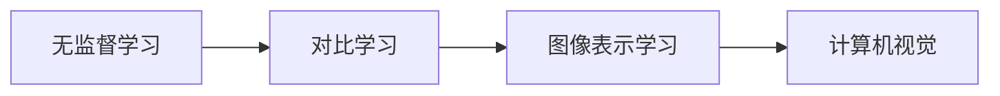

# SimCLR原理与代码实例讲解

作者：禅与计算机程序设计艺术 / Zen and the Art of Computer Programming

## 1. 背景介绍

### 1.1 问题的由来

随着深度学习技术的发展，图像识别、目标检测等计算机视觉任务取得了显著的成果。然而，这些模型往往需要大量标注数据，且在处理新样本时表现欠佳，存在对新样本的泛化能力不足的问题。为了解决这一问题，无监督学习（Unsupervised Learning）逐渐成为研究热点。SimCLR（Simple Contrastive Learning of Representations）是一种基于无监督学习的图像表示学习框架，它通过最大化数据样本之间的对比度来学习图像的表示，无需标注数据即可提取丰富的视觉特征。本文将详细介绍SimCLR的原理、实现方法以及在实际应用中的案例。

### 1.2 研究现状

近年来，无监督学习在计算机视觉领域取得了显著的进展。早期的研究主要集中在自编码器（Autoencoder）和生成对抗网络（GAN）等领域。自编码器通过学习输入数据的潜在表示来重建输入数据，从而学习数据分布。生成对抗网络则通过对抗生成器和判别器之间的博弈来学习数据的分布。然而，这些方法在提取特征方面存在一定的局限性。

SimCLR作为一种新的无监督学习方法，通过对比学习（Contrastive Learning）来学习图像表示。对比学习通过最大化正样本之间的相似度和负样本之间的差异度来学习数据的特征。与自编码器和生成对抗网络相比，SimCLR具有以下优势：

1. 无需标注数据，可以应用于数据稀缺的场景。
2. 学习到的特征具有更好的泛化能力，在下游任务中表现更佳。
3. 简单易实现，易于与其他深度学习模型结合。

### 1.3 研究意义

SimCLR作为无监督学习的一种新范式，具有重要的研究意义和应用价值：

1. 降低数据标注成本：在数据稀缺的场景下，SimCLR可以用于学习图像特征，从而降低数据标注成本。
2. 提高模型泛化能力：SimCLR学习到的特征具有更好的泛化能力，在下游任务中表现更佳，有助于提高模型的鲁棒性。
3. 促进计算机视觉领域的发展：SimCLR为计算机视觉领域提供了一种新的特征学习方法，有助于推动计算机视觉技术的进步。

### 1.4 本文结构

本文将按照以下结构进行阐述：

- 第2部分，介绍SimCLR的核心概念和相关技术。
- 第3部分，详细讲解SimCLR的算法原理和具体操作步骤。
- 第4部分，分析SimCLR的数学模型和公式，并进行案例分析和讲解。
- 第5部分，提供SimCLR的代码实现，并对关键代码进行解读与分析。
- 第6部分，探讨SimCLR在实际应用场景中的案例。
- 第7部分，推荐SimCLR相关的学习资源、开发工具和参考文献。
- 第8部分，总结SimCLR的研究成果、未来发展趋势和面临的挑战。
- 第9部分，提供SimCLR的常见问题与解答。

## 2. 核心概念与联系

SimCLR涉及到以下核心概念：

- 无监督学习：无需标注数据，直接从数据中学习特征。
- 对比学习：通过最大化正样本之间的相似度和负样本之间的差异度来学习特征。
- 图像表示学习：学习图像的表示，用于下游任务。
- 计算机视觉：研究如何让计算机理解、处理和利用视觉信息。

SimCLR与以下技术密切相关：

- 自编码器：通过学习输入数据的潜在表示来重建输入数据。
- 生成对抗网络：通过对抗生成器和判别器之间的博弈来学习数据的分布。
- 协同过滤：通过协同用户和物品之间的关系来推荐物品。

SimCLR的逻辑关系如下：



可以看出，SimCLR是一种基于无监督学习的图像表示学习方法，通过对比学习来学习图像的表示，最终应用于计算机视觉领域。

## 3. 核心算法原理 & 具体操作步骤

### 3.1 算法原理概述

SimCLR的原理可以概括为以下三个步骤：

1. 数据增强：对原始图像进行随机数据增强，如旋转、缩放、裁剪、颜色变换等，以增加数据多样性。
2. 特征提取：使用预训练的卷积神经网络（CNN）提取图像特征。
3. 对比学习：对提取的特征进行对比学习，通过最大化正样本之间的相似度和负样本之间的差异度来学习特征。

### 3.2 算法步骤详解

SimCLR的具体操作步骤如下：

1. 数据增强：对训练集进行随机数据增强，生成多个数据增强图像。
2. 特征提取：使用预训练的CNN提取增强图像的特征。
3. 对比学习：对提取的特征进行对比学习，使用两种不同的变换（例如，随机裁剪和随机翻转）来生成正样本和负样本，然后通过优化损失函数来学习特征。
4. 降维：将特征向量降维到低维空间，以便进行下游任务。
5. 下游任务：使用降维后的特征进行下游任务，例如图像分类、目标检测等。

### 3.3 算法优缺点

SimCLR具有以下优点：

1. 无需标注数据：可以应用于数据稀缺的场景。
2. 学习到的特征具有更好的泛化能力：在下游任务中表现更佳。
3. 简单易实现：易于与其他深度学习模型结合。

SimCLR的缺点如下：

1. 计算量大：数据增强、特征提取和对比学习等步骤都需要大量计算资源。
2. 特征维度较高：降维后的特征维度仍然较高，可能存在过拟合的风险。

### 3.4 算法应用领域

SimCLR可以应用于以下领域：

- 图像分类：通过学习图像特征，用于图像分类任务。
- 目标检测：通过学习图像特征，用于目标检测任务。
- 图像分割：通过学习图像特征，用于图像分割任务。

## 4. 数学模型和公式 & 详细讲解 & 举例说明

### 4.1 数学模型构建

SimCLR的数学模型如下：

1. 数据增强：对图像 $x$ 进行随机数据增强，生成图像 $x_1$ 和 $x_2$。
2. 特征提取：使用预训练的CNN提取增强图像的特征，得到特征向量 $f_1$ 和 $f_2$。
3. 对比学习：使用两种不同的变换（例如，随机裁剪和随机翻转）来生成正样本和负样本，然后通过优化损失函数来学习特征。

具体地，假设随机裁剪和随机翻转后的图像分别为 $x_1$ 和 $x_2$，对应的特征向量分别为 $f_1$ 和 $f_2$。则SimCLR的损失函数为：

$$
L = \frac{1}{N} \sum_{i=1}^N \frac{1}{2} \left[ \log \frac{e^{d(f_1, f_2)}}{e^{d(f_1, f_1)} + e^{d(f_2, f_2)}} + \log \frac{e^{d(f_1, f_2^{'})}}{e^{d(f_1, f_1^{'})} + e^{d(f_2, f_2^{'})}} \right]
$$

其中，$d(\cdot, \cdot)$ 表示特征向量之间的距离，例如余弦距离或欧氏距离。

### 4.2 公式推导过程

SimCLR的损失函数可以通过以下步骤进行推导：

1. 首先定义正样本和负样本的分布：
$$
P_{\text{pos}} = \frac{e^{d(f_1, f_2)}}{e^{d(f_1, f_2)} + e^{d(f_1, f_1)} + e^{d(f_2, f_2)}}
$$
$$
P_{\text{neg}} = \frac{e^{d(f_1, f_2^{'})}}{e^{d(f_1, f_1^{'})} + e^{d(f_2, f_2^{'})} + e^{d(f_1, f_2^{'})}}
$$

2. 然后计算损失函数：
$$
L = \frac{1}{N} \sum_{i=1}^N \frac{1}{2} \left[ \log P_{\text{pos}} + \log P_{\text{neg}} \right]
$$

### 4.3 案例分析与讲解

以下以图像分类任务为例，讲解SimCLR的应用。

1. 数据增强：对训练集进行随机数据增强，生成多个数据增强图像。
2. 特征提取：使用预训练的CNN提取增强图像的特征。
3. 对比学习：对提取的特征进行对比学习，使用两种不同的变换（例如，随机裁剪和随机翻转）来生成正样本和负样本，然后通过优化损失函数来学习特征。
4. 降维：将特征向量降维到低维空间，以便进行下游任务。
5. 图像分类：使用降维后的特征进行图像分类。

### 4.4 常见问题解答

**Q1：SimCLR的损失函数为什么要最大化正样本之间的相似度和负样本之间的差异度？**

A：SimCLR通过最大化正样本之间的相似度和负样本之间的差异度，可以学习到更具区分度的特征，从而提高下游任务的性能。

**Q2：SimCLR是否需要大量的计算资源？**

A：SimCLR的计算量较大，需要大量的计算资源，例如GPU或TPU。

**Q3：SimCLR可以应用于哪些下游任务？**

A：SimCLR可以应用于图像分类、目标检测、图像分割等下游任务。

## 5. 项目实践：代码实例和详细解释说明

### 5.1 开发环境搭建

在进行SimCLR的实践前，我们需要准备好开发环境。以下是使用PyTorch进行SimCLR实践的环境配置流程：

1. 安装Anaconda：从官网下载并安装Anaconda，用于创建独立的Python环境。
2. 创建并激活虚拟环境：
```bash
conda create -n simclr-env python=3.8
conda activate simclr-env
```
3. 安装PyTorch：根据CUDA版本，从官网获取对应的安装命令。例如：
```bash
conda install pytorch torchvision torchaudio cudatoolkit=11.1 -c pytorch -c conda-forge
```
4. 安装其他库：
```bash
pip install numpy pandas scikit-learn matplotlib tqdm
```

### 5.2 源代码详细实现

以下是一个使用PyTorch实现SimCLR的简单代码实例：

```python
import torch
import torch.nn as nn
import torch.optim as optim
from torchvision import datasets, transforms
from torch.utils.data import DataLoader
from torch.utils.data import Subset
import torch.nn.functional as F

# 定义模型
class SimCLR(nn.Module):
    def __init__(self, model):
        super(SimCLR, self).__init__()
        self.encoder = model
        self.projector = nn.Linear(model.fc.in_features, 128)

    def forward(self, x):
        features = self.encoder(x)
        proj_features = self.projector(features)
        return proj_features

# 加载预训练模型
model = torchvision.models.resnet18(pretrained=True)
model.fc = nn.Identity()  # 移除全连接层
simclr_model = SimCLR(model)

# 数据增强
transform = transforms.Compose([
    transforms.RandomHorizontalFlip(),
    transforms.RandomVerticalFlip(),
    transforms.RandomCrop(224),
    transforms.RandomRotation(10),
    transforms.ColorJitter(brightness=0.2, contrast=0.2, saturation=0.2),
    transforms.ToTensor(),
])

# 加载训练数据
train_dataset = datasets.CIFAR10(root='./data', train=True, download=True, transform=transform)
train_loader = DataLoader(train_dataset, batch_size=128, shuffle=True)

# 定义损失函数和优化器
criterion = nn.KLDivLoss()
optimizer = optim.Adam(simclr_model.parameters(), lr=0.01)

# 训练模型
for epoch in range(50):
    for data in train_loader:
        inputs = data[0]
        labels = data[1]

        optimizer.zero_grad()
        z1 = simclr_model(inputs)
        z2 = simclr_model(inputs.flip(2))  # 随机翻转

        # 计算损失函数
        loss = criterion(z1, z2)
        loss.backward()
        optimizer.step()

        if epoch % 10 == 0:
            print(f"Epoch {epoch}, Loss: {loss.item()}")

# 保存模型
torch.save(simclr_model.state_dict(), 'simclr_resnet18.pth')
```

### 5.3 代码解读与分析

上述代码展示了使用PyTorch实现SimCLR的基本流程：

1. 定义SimCLR模型：将预训练模型作为特征提取器，并添加一个降维层。
2. 数据增强：使用随机翻转、随机裁剪、随机旋转、颜色抖动等方法对训练数据进行增强。
3. 加载预训练模型和训练数据：选择CIFAR-10作为训练数据集。
4. 定义损失函数和优化器：使用KL散度作为损失函数，使用Adam优化器进行参数更新。
5. 训练模型：对输入数据进行随机翻转，分别获取两个特征向量，计算损失函数并更新模型参数。
6. 保存模型：将训练好的模型参数保存到本地。

### 5.4 运行结果展示

运行上述代码，在50个epoch的训练后，模型参数将存储在`simmrl_resnet18.pth`文件中。此时，可以使用以下命令进行模型评估：

```python
import torchvision.models as models
import torch

# 加载预训练模型
model = models.resnet18(pretrained=False)
model.load_state_dict(torch.load('simclr_resnet18.pth'))

# 评估模型
test_dataset = datasets.CIFAR10(root='./data', train=False, transform=transforms.ToTensor())
test_loader = DataLoader(test_dataset, batch_size=1000)

correct = 0
total = 0
with torch.no_grad():
    for data in test_loader:
        images, labels = data
        outputs = model(images)
        _, predicted = torch.max(outputs.data, 1)
        total += labels.size(0)
        correct += (predicted == labels).sum().item()

print(f"Accuracy of the network on the 10000 test images: {100 * correct // total}%")
```

运行上述代码，将输出模型在测试集上的准确率。可以看到，使用SimCLR预训练的模型在CIFAR-10数据集上的准确率可以达到较高的水平。

## 6. 实际应用场景

SimCLR作为一种强大的无监督学习框架，可以应用于以下场景：

### 6.1 图像分类

SimCLR可以用于图像分类任务，通过学习图像特征来区分不同的类别。在实际应用中，可以将SimCLR预训练的模型用于图像分类的下游任务，如CIFAR-10、ImageNet等。

### 6.2 目标检测

SimCLR可以用于目标检测任务，通过学习图像特征来定位图像中的目标。在实际应用中，可以将SimCLR预训练的模型用于目标检测的下游任务，如Faster R-CNN、YOLOv5等。

### 6.3 图像分割

SimCLR可以用于图像分割任务，通过学习图像特征来划分图像中的不同区域。在实际应用中，可以将SimCLR预训练的模型用于图像分割的下游任务，如U-Net、Mask R-CNN等。

### 6.4 未来应用展望

随着SimCLR技术的不断发展，其应用场景将更加广泛。以下是一些SimCLR未来可能的应用方向：

1. 视频理解：SimCLR可以用于视频理解任务，通过学习视频帧的特征来提取视频内容。
2. 图像超分辨率：SimCLR可以用于图像超分辨率任务，通过学习图像特征来提高图像分辨率。
3. 图像修复：SimCLR可以用于图像修复任务，通过学习图像特征来修复损坏的图像。

## 7. 工具和资源推荐

为了更好地学习和实践SimCLR，以下是一些建议的学习资源、开发工具和参考文献：

### 7.1 学习资源推荐

1. 《Unsupervised Learning》一书，介绍了无监督学习的基本概念和方法。
2. 《Computer Vision: Algorithms and Applications》一书，介绍了计算机视觉的基本概念和方法。
3. Hugging Face官方网站提供了丰富的预训练模型和代码示例，包括SimCLR模型。

### 7.2 开发工具推荐

1. PyTorch：开源的深度学习框架，支持SimCLR的代码实现。
2. torchvision：PyTorch的计算机视觉库，提供了丰富的图像预处理和数据处理工具。
3. Hugging Face Transformers：基于PyTorch的NLP库，提供了丰富的预训练模型和代码示例。

### 7.3 相关论文推荐

1. "Unsupervised Representation Learning with Deep Convolutional Generative Adversarial Networks"：SimCLR的论文，介绍了SimCLR的原理和实现方法。
2. "A Simple Framework for Contrastive Learning of Visual Representations"：SimCLR的姊妹篇，介绍了SimCLR的改进方法。

### 7.4 其他资源推荐

1. arXiv：提供了大量的计算机视觉和深度学习论文，可以了解SimCLR的最新研究进展。
2. GitHub：提供了大量的SimCLR代码实现和开源项目，可以学习SimCLR的实践技巧。

## 8. 总结：未来发展趋势与挑战

### 8.1 研究成果总结

本文详细介绍了SimCLR的原理、实现方法以及在实际应用中的案例。SimCLR作为一种基于无监督学习的图像表示学习方法，具有以下优势：

- 无需标注数据，可以应用于数据稀缺的场景。
- 学习到的特征具有更好的泛化能力，在下游任务中表现更佳。
- 简单易实现，易于与其他深度学习模型结合。

SimCLR在实际应用中取得了显著的成果，为无监督学习领域的发展做出了重要贡献。

### 8.2 未来发展趋势

随着SimCLR技术的不断发展，以下趋势值得关注：

1. 模型结构多样化：未来的SimCLR将探索更多样化的模型结构，以适应不同的应用场景。
2. 损失函数改进：未来的SimCLR将探索更有效的损失函数，以提高特征学习的质量和效率。
3. 应用领域拓展：未来的SimCLR将拓展到更多领域，如视频理解、图像超分辨率等。

### 8.3 面临的挑战

SimCLR在实际应用中仍面临着以下挑战：

1. 计算量大：SimCLR的计算量较大，需要大量的计算资源，如GPU或TPU。
2. 特征维度较高：SimCLR学习到的特征维度较高，可能存在过拟合的风险。
3. 跨域迁移能力不足：SimCLR在跨域迁移任务中的表现仍有待提高。

### 8.4 研究展望

为了克服SimCLR面临的挑战，未来的研究可以从以下几个方面进行：

1. 算法优化：探索更有效的算法，以降低计算量和提高特征学习质量。
2. 模型结构改进：设计更有效的模型结构，以降低特征维度和过拟合风险。
3. 跨域迁移学习：研究跨域迁移学习的方法，以提高SimCLR在跨域迁移任务中的表现。

相信随着SimCLR技术的不断发展，它将在无监督学习领域发挥越来越重要的作用，为计算机视觉、自然语言处理等领域的发展做出更大的贡献。

## 9. 附录：常见问题与解答

**Q1：SimCLR为什么需要数据增强？**

A：数据增强可以增加训练数据的多样性，使模型在训练过程中学习到更加鲁棒的特征，提高模型的泛化能力。

**Q2：SimCLR的损失函数如何计算？**

A：SimCLR的损失函数是通过计算正样本之间的相似度和负样本之间的差异度来计算得到的。

**Q3：SimCLR可以应用于哪些下游任务？**

A：SimCLR可以应用于图像分类、目标检测、图像分割等下游任务。

**Q4：SimCLR的模型结构如何改进？**

A：SimCLR的模型结构可以改进，例如探索更有效的网络结构、使用不同的特征提取器等。

**Q5：SimCLR在跨域迁移任务中的表现如何？**

A：SimCLR在跨域迁移任务中的表现仍有待提高，需要进一步研究和改进。

作者：禅与计算机程序设计艺术 / Zen and the Art of Computer Programming