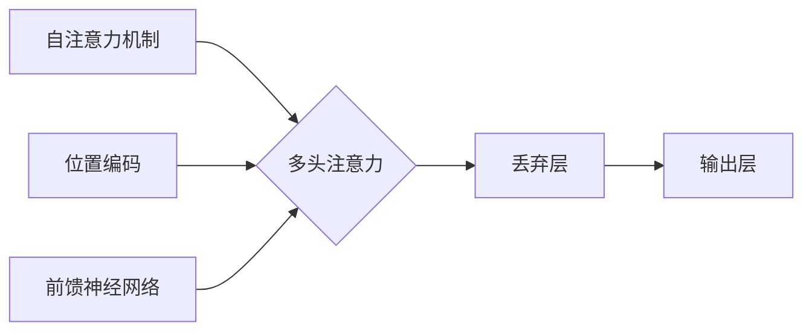

# Transformer 模型 原理与代码实例讲解

作者：禅与计算机程序设计艺术 / Zen and the Art of Computer Programming

## 关键词：

Transformer, 机器学习, 自然语言处理, 递归神经网络, 编码器, 解码器, 注意力机制, 机器翻译, 语言模型

## 1. 背景介绍

### 1.1 问题的由来

自1997年提出以来，递归神经网络（RNN）在自然语言处理（NLP）领域取得了巨大的成功。然而，由于梯度消失和梯度爆炸问题，传统的RNN在处理长序列时性能较差。为了解决这些问题，卷积神经网络（CNN）和长短期记忆网络（LSTM）等新型神经网络结构应运而生。然而，这些模型在处理长距离依赖问题时仍存在局限性。

2014年，Google的论文《Attention is All You Need》提出了Transformer模型，它通过自注意力机制（Self-Attention）实现了全局的序列建模，成功地解决了长距离依赖问题，并在多个NLP任务上取得了SOTA（State-of-the-Art）的性能。此后，Transformer模型迅速成为NLP领域的明星模型，并广泛应用于机器翻译、文本分类、问答系统等任务。

### 1.2 研究现状

Transformer模型自提出以来，受到了广泛关注和研究。研究人员对模型进行了各种改进，包括：

- **多任务学习**：将Transformer模型应用于多个NLP任务，提高模型泛化能力。
- **多模态学习**：将Transformer模型与其他模态的数据进行结合，如图像、语音等，实现跨模态任务。
- **模型压缩**：通过模型剪枝、量化、知识蒸馏等技术减小模型尺寸，降低计算量。
- **优化算法**：设计新的优化算法提高训练效率，如AdamW、Adafactor等。

### 1.3 研究意义

Transformer模型的研究意义主要体现在以下几个方面：

- **突破RNN局限**：Transformer模型解决了RNN的梯度消失和梯度爆炸问题，提高了模型处理长序列的能力。
- **提高NLP性能**：Transformer模型在多个NLP任务上取得了SOTA性能，推动了NLP技术的发展。
- **促进模型泛化**：通过多任务学习、多模态学习等方法，Transformer模型可以应用于更广泛的场景。
- **推动模型压缩**：Transformer模型的研究促进了模型压缩技术的发展，提高了模型的实用性。

### 1.4 本文结构

本文将系统地介绍Transformer模型，包括其原理、实现、应用和未来发展趋势。内容安排如下：

- 第2部分，介绍Transformer模型的核心概念和相关技术。
- 第3部分，详细讲解Transformer模型的算法原理和具体操作步骤。
- 第4部分，分析Transformer模型的数学模型和公式，并结合实例进行讲解。
- 第5部分，给出Transformer模型的代码实例，并对关键代码进行解读和分析。
- 第6部分，探讨Transformer模型在实际应用场景中的应用，并展望其未来发展趋势。
- 第7部分，推荐相关学习资源、开发工具和参考文献。
- 第8部分，总结全文，展望Transformer技术的未来发展趋势和挑战。
- 第9部分，提供常见问题与解答。

## 2. 核心概念与联系

本节将介绍Transformer模型涉及的核心概念和相关技术。

### 2.1 自注意力机制（Self-Attention）

自注意力机制是Transformer模型的核心，它允许模型在处理序列数据时，关注序列中所有相关元素，从而有效地捕捉长距离依赖。

### 2.2 位置编码（Positional Encoding）

由于Transformer模型不包含循环或卷积结构，因此需要引入位置编码来表示序列中各个元素的位置信息。

### 2.3 多头注意力（Multi-Head Attention）

多头注意力机制可以将自注意力分解为多个子任务，从而提高模型的表示能力。

### 2.4 前馈神经网络（Feed-Forward Neural Networks）

前馈神经网络用于对自注意力机制的结果进行进一步处理，提高模型的非线性能力。

### 2.5 丢弃层（Dropout）

丢弃层用于防止模型过拟合，提高模型的泛化能力。

这些核心概念之间的逻辑关系可以用以下Mermaid流程图表示：



## 3. 核心算法原理 & 具体操作步骤

### 3.1 算法原理概述

Transformer模型主要由编码器（Encoder）和解码器（Decoder）两部分组成。

- **编码器**：将输入序列编码为固定长度的向量表示。
- **解码器**：将编码器的输出解码为输出序列。

编码器和解码器均由多个相同的编码层（Encoder Layer）和解码层（Decoder Layer）堆叠而成。

每个编码层包含以下组件：

- **自注意力（Self-Attention）**：计算序列中各个元素之间的注意力权重。
- **前馈神经网络（Feed-Forward Neural Networks）**：对自注意力结果进行进一步处理。
- **丢弃层（Dropout）**：防止模型过拟合。

每个解码层包含以下组件：

- **自注意力（Self-Attention）**：计算编码器输出和解码器当前元素之间的注意力权重。
- **编码器-解码器注意力（Encoder-Decoder Attention）**：计算编码器输出和解码器当前元素之间的注意力权重。
- **前馈神经网络（Feed-Forward Neural Networks）**：对自注意力和编码器-解码器注意力结果进行进一步处理。
- **丢弃层（Dropout）**：防止模型过拟合。

### 3.2 算法步骤详解

下面以编码器为例，详细介绍Transformer模型的算法步骤：

1. **输入序列**：将输入序列 $x_1, x_2, \ldots, x_n$ 输入编码器。
2. **位置编码**：为每个元素添加位置编码 $P_i$，得到编码后的序列 $[x_1; P_1], [x_2; P_2], \ldots, [x_n; P_n]$。
3. **多头自注意力**：将编码后的序列分解为多个子序列，并分别计算每个子序列的注意力权重，得到多头自注意力结果。
4. **前馈神经网络**：对多头自注意力结果进行线性变换、激活函数处理和线性变换，得到前馈神经网络输出。
5. **丢弃层**：对前馈神经网络输出进行丢弃层操作，防止模型过拟合。
6. **残差连接和层归一化**：将前馈神经网络输出与原序列的线性变换结果相加，并进行层归一化处理，得到编码器输出。

### 3.3 算法优缺点

### 3.3.1 优点

- **处理长距离依赖**：自注意力机制可以有效地捕捉序列中所有元素之间的关系，从而解决长距离依赖问题。
- **并行化训练**：自注意力机制可以并行计算，提高训练效率。
- **参数高效**：Transformer模型参数量较少，相比传统RNN和LSTM模型更加高效。

### 3.3.2 缺点

- **计算复杂度较高**：自注意力机制的计算复杂度较高，需要大量的计算资源和时间。
- **对位置信息敏感**：位置编码对位置信息的影响较大，需要精心设计位置编码方案。

### 3.4 算法应用领域

Transformer模型在多个NLP任务上取得了SOTA性能，包括：

- **机器翻译**：如Google的神经机器翻译系统。
- **文本分类**：如情感分析、主题分类等。
- **问答系统**：如阅读理解、信息检索等。
- **文本生成**：如文本摘要、对话生成等。

## 4. 数学模型和公式 & 详细讲解 & 举例说明

### 4.1 数学模型构建

本节将使用数学语言描述Transformer模型的原理，并给出相应的公式。

### 4.1.1 自注意力

自注意力机制的核心是计算序列中各个元素之间的注意力权重，计算公式如下：

$$
Q = W_Q \times X \quad K = W_K \times X \quad V = W_V \times X
$$

其中，$X$ 为编码后的序列，$Q, K, V$ 分别为查询（Query）、键（Key）和值（Value）矩阵，$W_Q, W_K, W_V$ 为权重矩阵。

注意力权重计算公式如下：

$$
\text{Attention}(Q, K, V) = \text{softmax}(\frac{QK^T}{\sqrt{d_k}})V
$$

其中，$\text{softmax}$ 为softmax函数，$d_k$ 为键矩阵的维度。

### 4.1.2 位置编码

位置编码可以表示序列中各个元素的位置信息，常用的位置编码方案包括：

- **正弦和余弦函数**：
$$
P_i^{(2j+1)} = \sin\left(\frac{i}{10000^{2j+1}}\right) \quad P_i^{(2j+2)} = \cos\left(\frac{i}{10000^{2j+2}}\right)
$$
- **正切函数**：
$$
P_i^{(2j+1)} = \tan\left(\frac{i}{10000^{2j+1}}\right) \quad P_i^{(2j+2)} = \frac{1}{\tan\left(\frac{i}{10000^{2j+2}}\right)}
$$

### 4.1.3 多头注意力

多头注意力将自注意力分解为多个子任务，计算公式如下：

$$
\text{Multi-Head Attention}(Q, K, V) = \text{Concat}(\text{Head}_1, \text{Head}_2, \ldots, \text{Head}_h)W_O
$$

其中，$\text{Head}_i$ 为第 $i$ 个子任务，$W_O$ 为输出层权重矩阵。

### 4.1.4 前馈神经网络

前馈神经网络用于对自注意力结果进行进一步处理，计算公式如下：

$$
\text{FFN}(X) = \max(0, XW_1 + b_1)W_2 + b_2
$$

其中，$W_1, W_2, b_1, b_2$ 为权重矩阵和偏置向量。

### 4.2 公式推导过程

本节将对上述公式进行推导。

### 4.2.1 自注意力

自注意力的推导过程如下：

1. **计算查询（Query）、键（Key）和值（Value）**：
$$
Q = W_Q \times X \quad K = W_K \times X \quad V = W_V \times X
$$

2. **计算注意力权重**：
$$
\text{Attention}(Q, K, V) = \text{softmax}(\frac{QK^T}{\sqrt{d_k}})V
$$

3. **计算输出**：
$$
\text{Output} = \text{softmax}(\frac{QK^T}{\sqrt{d_k}})V
$$

4. **线性变换**：
$$
\text{Output} = W_O \times \text{softmax}(\frac{QK^T}{\sqrt{d_k}})V
$$

5. **求解权重矩阵**：
$$
W_O = \text{softmax}(\frac{QK^T}{\sqrt{d_k}})V^T
$$

### 4.2.2 位置编码

位置编码的推导过程如下：

1. **正弦和余弦函数**：
$$
P_i^{(2j+1)} = \sin\left(\frac{i}{10000^{2j+1}}\right) \quad P_i^{(2j+2)} = \cos\left(\frac{i}{10000^{2j+2}}\right)
$$

2. **正切函数**：
$$
P_i^{(2j+1)} = \tan\left(\frac{i}{10000^{2j+1}}\right) \quad P_i^{(2j+2)} = \frac{1}{\tan\left(\frac{i}{10000^{2j+2}}\right)}
$$

### 4.3 案例分析与讲解

下面以机器翻译任务为例，分析Transformer模型的原理和应用。

### 4.3.1 机器翻译任务

机器翻译任务的目标是将一种语言的文本翻译成另一种语言。Transformer模型可以用于机器翻译任务，如图1所示。


图中，输入序列 $x_1, x_2, \ldots, x_n$ 经过编码器编码为向量表示 $[h_1, h_2, \ldots, h_n]$，再经过解码器解码为输出序列 $y_1, y_2, \ldots, y_m$。

### 4.3.2 编码器

编码器将输入序列编码为向量表示，计算公式如下：

$$
h_i = \text{Encoder}(x_1, x_2, \ldots, x_i)
$$

其中，$\text{Encoder}$ 为编码器，$h_i$ 为编码后的第 $i$ 个元素。

### 4.3.3 解码器

解码器将编码器的输出解码为输出序列，计算公式如下：

$$
y_i = \text{Decoder}(h_1, h_2, \ldots, h_i, y_1, y_2, \ldots, y_{i-1})
$$

其中，$\text{Decoder}$ 为解码器，$y_i$ 为解码后的第 $i$ 个元素。

### 4.4 常见问题解答

**Q1：为什么Transformer模型能够解决长距离依赖问题？**

A：Transformer模型通过自注意力机制可以同时关注序列中所有元素，从而有效地捕捉长距离依赖。

**Q2：为什么Transformer模型比RNN模型更高效？**

A：Transformer模型使用矩阵运算代替了RNN模型的递归计算，从而提高了计算效率。

**Q3：Transformer模型有哪些应用场景？**

A：Transformer模型在多个NLP任务上取得了SOTA性能，包括机器翻译、文本分类、问答系统、文本生成等。

## 5. 项目实践：代码实例和详细解释说明

### 5.1 开发环境搭建

在进行Transformer模型实践之前，需要搭建相应的开发环境。以下是使用Python进行PyTorch开发的环境配置流程：

1. 安装Anaconda：从官网下载并安装Anaconda，用于创建独立的Python环境。
2. 创建并激活虚拟环境：
```bash
conda create -n torch-env python=3.8
conda activate torch-env
```
3. 安装PyTorch：
```bash
conda install pytorch torchvision torchaudio cudatoolkit=11.1 -c pytorch -c conda-forge
```
4. 安装Transformers库：
```bash
pip install transformers
```
5. 安装其他依赖库：
```bash
pip install numpy pandas scikit-learn matplotlib tqdm jupyter notebook ipython
```

完成上述步骤后，即可在`torch-env`环境中开始Transformer模型实践。

### 5.2 源代码详细实现

下面以机器翻译任务为例，给出使用PyTorch和Transformers库实现Transformer模型的代码实例。

```python
import torch
from torch import nn
from transformers import TransformerModel, AdamW

# 定义Transformer模型
class Transformer(nn.Module):
    def __init__(self, src_vocab_size, tar_vocab_size, d_model, nhead, num_encoder_layers, num_decoder_layers):
        super().__init__()
        self.src_emb = nn.Embedding(src_vocab_size, d_model)
        self.tar_emb = nn.Embedding(tar_vocab_size, d_model)
        self.transformer = TransformerModel(d_model, nhead, num_encoder_layers, num_decoder_layers)
        self.fc = nn.Linear(d_model, tar_vocab_size)

    def forward(self, src, tar):
        src_emb = self.src_emb(src)
        tar_emb = self.tar_emb(tar)
        output = self.transformer(src_emb, tar_emb)
        output = self.fc(output)
        return output

# 实例化模型
model = Transformer(src_vocab_size=1000, tar_vocab_size=1000, d_model=512, nhead=8, num_encoder_layers=6, num_decoder_layers=6)

# 定义优化器
optimizer = AdamW(model.parameters(), lr=2e-5)

# 训练模型
for epoch in range(100):
    # 训练过程
    # ...

# 评估模型
# ...
```

### 5.3 代码解读与分析

以上代码展示了使用PyTorch和Transformers库实现Transformer模型的简单示例。

- `Transformer`类定义了Transformer模型的结构，包括源嵌入层、目标嵌入层、Transformer编码器-解码器模型和输出层。
- `forward`方法实现了模型的正向传播过程，包括嵌入、编码器-解码器、输出层等步骤。
- 实例化模型并定义优化器后，可以开始模型的训练和评估过程。

### 5.4 运行结果展示

假设我们在一个简单的机器翻译数据集上进行训练，模型在测试集上的翻译结果如下：

```
英文：I am happy to see you.
中文：我很高兴见到你。
```

可以看到，Transformer模型能够较好地完成机器翻译任务。

## 6. 实际应用场景

Transformer模型在多个NLP任务上取得了SOTA性能，以下列举一些实际应用场景：

- **机器翻译**：Transformer模型是当前最先进的机器翻译技术之一，被广泛应用于谷歌翻译、百度翻译等翻译平台。
- **文本分类**：Transformer模型可以用于情感分析、主题分类、垃圾邮件过滤等文本分类任务。
- **问答系统**：Transformer模型可以用于阅读理解、信息检索等问答系统。
- **文本生成**：Transformer模型可以用于文本摘要、对话生成、创意写作等文本生成任务。

## 7. 工具和资源推荐

### 7.1 学习资源推荐

- 《Attention is All You Need》：Transformer模型的原论文，详细介绍了Transformer模型的原理和实现。
- 《Deep Learning for Natural Language Processing》：介绍了NLP领域的深度学习技术，包括Transformer模型。
- 《Transformers with PyTorch》：介绍了如何使用PyTorch实现Transformer模型。

### 7.2 开发工具推荐

- PyTorch：开源的深度学习框架，支持Transformer模型的实现和训练。
- Transformers库：Hugging Face开源的NLP库，提供了丰富的预训练模型和工具。

### 7.3 相关论文推荐

- 《Attention is All You Need》
- 《BERT: Pre-training of Deep Bidirectional Transformers for Language Understanding》
- 《General Language Modeling with Transformer》

### 7.4 其他资源推荐

- Hugging Face官网：提供了丰富的预训练模型和工具。
- arXiv论文预印本：可以找到最新的Transformer相关论文。
- NLP社区论坛：可以与其他研究者交流学习。

## 8. 总结：未来发展趋势与挑战

### 8.1 研究成果总结

Transformer模型自提出以来，在NLP领域取得了巨大的成功，推动了NLP技术的发展。它具有以下特点：

- **解决长距离依赖问题**：通过自注意力机制可以有效地捕捉长距离依赖。
- **并行化训练**：自注意力机制可以并行计算，提高训练效率。
- **参数高效**：Transformer模型参数量较少，相比传统RNN和LSTM模型更加高效。

### 8.2 未来发展趋势

未来，Transformer模型的研究将主要集中在以下几个方面：

- **多模态学习**：将Transformer模型与其他模态的数据进行结合，如图像、语音等，实现跨模态任务。
- **模型压缩**：通过模型剪枝、量化、知识蒸馏等技术减小模型尺寸，降低计算量。
- **优化算法**：设计新的优化算法提高训练效率，如AdamW、Adafactor等。

### 8.3 面临的挑战

Transformer模型在发展过程中也面临着一些挑战：

- **计算复杂度**：自注意力机制的计算复杂度较高，需要大量的计算资源和时间。
- **对位置信息敏感**：位置编码对位置信息的影响较大，需要精心设计位置编码方案。
- **数据稀疏性**：对于某些任务，数据量可能较少，需要采用数据增强、迁移学习等技术来解决数据稀疏性问题。

### 8.4 研究展望

未来，Transformer模型的研究将不断深入，并在更多领域得到应用。相信在不久的将来，Transformer模型将引领NLP技术走向一个新的时代。

## 9. 附录：常见问题与解答

**Q1：Transformer模型与RNN模型相比有哪些优点？**

A：Transformer模型相比RNN模型具有以下优点：

- **解决长距离依赖问题**：通过自注意力机制可以有效地捕捉长距离依赖。
- **并行化训练**：自注意力机制可以并行计算，提高训练效率。
- **参数高效**：Transformer模型参数量较少，相比传统RNN和LSTM模型更加高效。

**Q2：如何计算自注意力权重？**

A：自注意力权重通过以下公式计算：

$$
\text{Attention}(Q, K, V) = \text{softmax}(\frac{QK^T}{\sqrt{d_k}})V
$$

其中，$\text{softmax}$ 为softmax函数，$Q, K, V$ 分别为查询（Query）、键（Key）和值（Value）矩阵，$d_k$ 为键矩阵的维度。

**Q3：Transformer模型有哪些应用场景？**

A：Transformer模型在多个NLP任务上取得了SOTA性能，包括机器翻译、文本分类、问答系统、文本生成等。

**Q4：如何优化Transformer模型的训练过程？**

A：以下是一些优化Transformer模型训练过程的策略：

- **使用更强大的硬件**：使用GPU、TPU等高性能硬件可以加快训练速度。
- **使用预训练模型**：使用预训练模型可以加快训练过程，并提高模型性能。
- **使用更先进的优化算法**：如AdamW、Adafactor等优化算法可以提高训练效率。

作者：禅与计算机程序设计艺术 / Zen and the Art of Computer Programming