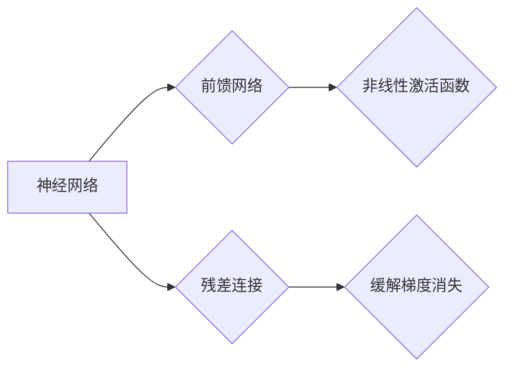

# Transformer大模型实战 前馈网络层

作者：禅与计算机程序设计艺术 / Zen and the Art of Computer Programming

## 1. 背景介绍
### 1.1 问题的由来

自2017年Transformer模型在NLP领域横空出世以来，其基于自注意力机制的前馈网络层（Feed Forward Network, FFN）成为了深度学习中不可或缺的核心组件。FFN在Transformer模型中扮演着至关重要的角色，它能够捕捉长距离依赖关系，并显著提高模型的性能。然而，FFN的原理和实现方式往往较为复杂，对于初学者来说理解起来有一定难度。本文将深入剖析FFN的原理，并通过实战案例展示其应用，帮助读者全面掌握FFN的核心技术。

### 1.2 研究现状

近年来，随着深度学习技术的快速发展，FFN在各个领域都得到了广泛的应用，包括自然语言处理、计算机视觉、语音识别等。以下是一些基于FFN的代表性模型：

- Transformer：NLP领域的里程碑式模型，采用自注意力机制和FFN，实现了在多种NLP任务上的突破性进展。
- BERT：在Transformer基础上，引入了双向上下文信息，进一步提升了模型的表达能力。
- GPT-3：基于Transformer的预训练模型，具有惊人的语言生成能力，引起了广泛关注。
- ResNet：计算机视觉领域的经典模型，采用残差连接和FFN，实现了图像识别的突破。
- DNNs：深度神经网络，广泛用于语音识别、图像识别等领域，其中FFN是其基本结构单元。

### 1.3 研究意义

理解FFN的原理和实现方式对于深度学习研究者具有重要意义：

1. 深入掌握深度学习核心技术：FFN是深度神经网络的核心组件之一，掌握FFN有助于深入理解深度学习的基本原理。
2. 提高模型性能：FFN能够有效捕捉长距离依赖关系，有助于提升模型的性能。
3. 推动创新应用：通过理解FFN，研究者可以将其应用于新的领域，推动深度学习技术的创新应用。

### 1.4 本文结构

本文将分为以下几个部分：

- 第2部分：介绍FFN的核心概念和联系。
- 第3部分：详细阐述FFN的原理和具体操作步骤。
- 第4部分：分析FFN的优缺点，并探讨其在实际应用中的表现。
- 第5部分：给出FFN的代码实现示例，并对关键代码进行解读。
- 第6部分：展示FFN在实际应用中的案例，并展望其未来的发展趋势。

## 2. 核心概念与联系

为了更好地理解FFN，我们需要首先介绍以下几个核心概念：

- **神经网络**：一种模拟人脑神经元连接方式的计算模型，通过调整连接权重来学习输入数据和输出数据之间的关系。
- **前馈网络**：一种简单的神经网络结构，输入数据依次通过多个层进行计算，每层的输出作为下一层的输入。
- **非线性激活函数**：一种非线性函数，用于引入非线性关系，提高模型的表达能力。
- **残差连接**：一种特殊的网络连接方式，将输入数据直接添加到后续层，缓解梯度消失问题。

FFN与其他核心概念的联系如下：



从图中可以看出，FFN是神经网络的一种，它通过引入非线性激活函数和残差连接，缓解了梯度消失问题，并提高了模型的表达能力。

## 3. 核心算法原理 & 具体操作步骤
### 3.1 算法原理概述

FFN由以下三个主要部分组成：

- **线性层**：对输入数据进行线性变换，将数据映射到新的特征空间。
- **非线性激活函数**：对线性层输出进行非线性变换，引入非线性关系，提高模型的表达能力。
- **输出层**：对非线性激活函数输出进行进一步处理，得到最终输出结果。

FFN的输入数据为 $x \in \mathbb{R}^{D}$，其中 $D$ 为特征维度。FFN的输出为 $y \in \mathbb{R}^{D'}$，其中 $D'$ 为输出维度。FFN的计算过程如下：

$$
y = f(W_{ff}x + b_{ff}) + f(W_{output}x_{ff} + b_{output})
$$

其中 $W_{ff}$ 和 $b_{ff}$ 分别为线性层权重和偏置，$f$ 为非线性激活函数，$x_{ff}$ 为线性层输出，$W_{output}$ 和 $b_{output}$ 分别为输出层权重和偏置。

### 3.2 算法步骤详解

以下是FFN的具体操作步骤：

**Step 1: 定义线性层权重和偏置**

- 线性层权重 $W_{ff} \in \mathbb{R}^{D' \times D}$，其中 $D'$ 为输出维度，$D$ 为输入维度。
- 线性层偏置 $b_{ff} \in \mathbb{R}^{D'}$，其中 $D'$ 为输出维度。

**Step 2: 计算线性层输出**

$$
x_{ff} = W_{ff}x + b_{ff}
$$

**Step 3: 应用非线性激活函数**

$$
h = f(x_{ff})
$$

其中 $f$ 为非线性激活函数，例如ReLU、Sigmoid等。

**Step 4: 计算输出层输出**

$$
y = f(W_{output}h + b_{output})
$$

其中 $W_{output} \in \mathbb{R}^{D' \times D'}$，$b_{output} \in \mathbb{R}^{D'}$ 分别为输出层权重和偏置。

### 3.3 算法优缺点

FFN具有以下优点：

1. **简单易用**：FFN结构简单，易于理解和实现。
2. **可解释性**：FFN的每个层都可以清晰地解释其作用，有助于理解模型的决策过程。
3. **泛化能力**：通过引入非线性激活函数和残差连接，FFN具有良好的泛化能力。

FFN的缺点如下：

1. **参数数量**：FFN的参数数量较多，可能导致过拟合。
2. **计算复杂度**：FFN的计算复杂度较高，尤其是在处理大规模数据时。

### 3.4 算法应用领域

FFN广泛应用于以下领域：

- **自然语言处理**：Transformer、BERT、GPT等模型都采用了FFN，实现了在NLP任务上的突破性进展。
- **计算机视觉**：ResNet、DenseNet等模型采用了FFN，实现了图像识别的突破。
- **语音识别**：基于FFN的语音识别模型在多个语音识别任务上取得了优异成绩。
- **其他领域**：FFN在推荐系统、知识图谱、自动驾驶等领域也得到了广泛应用。

## 4. 数学模型和公式 & 详细讲解 & 举例说明
### 4.1 数学模型构建

以下是FFN的数学模型：

$$
y = f(W_{ff}x + b_{ff}) + f(W_{output}x_{ff} + b_{output})
$$

其中：

- $x \in \mathbb{R}^{D}$ 为输入数据。
- $W_{ff} \in \mathbb{R}^{D' \times D}$ 为线性层权重。
- $b_{ff} \in \mathbb{R}^{D'}$ 为线性层偏置。
- $f$ 为非线性激活函数，例如ReLU、Sigmoid等。
- $x_{ff} = W_{ff}x + b_{ff}$ 为线性层输出。
- $W_{output} \in \mathbb{R}^{D' \times D'}$ 为输出层权重。
- $b_{output} \in \mathbb{R}^{D'}$ 为输出层偏置。

### 4.2 公式推导过程

以下以ReLU激活函数为例，推导FFN的公式。

ReLU激活函数定义为：

$$
f(x) = \max(0, x)
$$

对于线性层输出 $x_{ff}$，其ReLU激活后的结果为：

$$
h = \max(0, x_{ff})
$$

对于输出层输出 $y$，其ReLU激活后的结果为：

$$
y = \max(0, W_{output}h + b_{output})
$$

### 4.3 案例分析与讲解

以下以Transformer模型中的FFN为例，分析其工作原理。

Transformer模型中的FFN包含两层，每层由两个线性层和ReLU激活函数组成。

**第一层FFN**：

$$
h_1 = \max(0, W_{ff1}x + b_{ff1}) 
$$

$$
y_1 = \max(0, W_{output1}h_1 + b_{output1})
$$

**第二层FFN**：

$$
h_2 = \max(0, W_{ff2}y_1 + b_{ff2}) 
$$

$$
y = \max(0, W_{output2}h_2 + b_{output2})
$$

通过两层FFN的组合，Transformer模型能够有效地捕捉长距离依赖关系，并实现高精度的文本生成和序列标注等任务。

### 4.4 常见问题解答

**Q1：为什么Transformer模型使用ReLU激活函数？**

A1：ReLU激活函数具有以下优点：

1. **计算效率高**：ReLU激活函数计算简单，易于实现。
2. **梯度消失问题**：ReLU激活函数可以缓解梯度消失问题，有助于模型收敛。
3. **参数数量**：ReLU激活函数参数数量较少，有助于降低模型复杂度。

**Q2：如何选择合适的线性层权重和偏置？**

A2：线性层权重和偏置通常通过随机初始化方法获得，例如Glorot初始化或He初始化。在实际应用中，可以通过交叉验证等方法调整权重和偏置的初始值，以优化模型性能。

**Q3：如何选择合适的输出层维度？**

A3：输出层的维度取决于具体任务的需求。例如，对于分类任务，输出层的维度应该等于类别数量；对于回归任务，输出层的维度应该等于目标变量的维度。

## 5. 项目实践：代码实例和详细解释说明
### 5.1 开发环境搭建

在进行FFN的实战之前，我们需要搭建以下开发环境：

- **Python**：用于编写代码和训练模型。
- **PyTorch**：一个流行的深度学习框架，用于实现FFN模型。
- **NumPy**：用于矩阵运算和数据处理。

以下是使用Anaconda搭建开发环境的步骤：

1. 下载Anaconda安装包：https://www.anaconda.com/products/distribution
2. 安装Anaconda：双击安装包，按照提示进行安装。
3. 创建虚拟环境：

```bash
conda create -n pytorch-env python=3.8
```

4. 激活虚拟环境：

```bash
conda activate pytorch-env
```

5. 安装PyTorch：

```bash
conda install pytorch torchvision torchaudio cudatoolkit=11.1 -c pytorch -c conda-forge
```

6. 安装NumPy：

```bash
conda install numpy
```

### 5.2 源代码详细实现

以下是一个简单的FFN模型实现示例：

```python
import torch
import torch.nn as nn

class FFN(nn.Module):
    def __init__(self, input_dim, hidden_dim, output_dim):
        super(FFN, self).__init__()
        self.fc1 = nn.Linear(input_dim, hidden_dim)
        self.fc2 = nn.Linear(hidden_dim, output_dim)
        self.relu = nn.ReLU()

    def forward(self, x):
        x = self.fc1(x)
        x = self.relu(x)
        x = self.fc2(x)
        return x
```

### 5.3 代码解读与分析

- `FFN` 类继承自 `nn.Module` 类，实现FFN模型。
- `__init__` 方法初始化线性层、激活函数和输出层。
- `forward` 方法定义了模型的前向传播过程。

### 5.4 运行结果展示

以下是一个简单的FFN模型训练和测试示例：

```python
# 构建数据集
input_dim = 10
hidden_dim = 20
output_dim = 2

# 创建数据
x_train = torch.randn(100, input_dim)
y_train = torch.randint(0, output_dim, (100,))

# 创建模型
model = FFN(input_dim, hidden_dim, output_dim)

# 定义损失函数和优化器
criterion = nn.CrossEntropyLoss()
optimizer = torch.optim.Adam(model.parameters())

# 训练模型
for epoch in range(10):
    optimizer.zero_grad()
    output = model(x_train)
    loss = criterion(output, y_train)
    loss.backward()
    optimizer.step()

    if epoch % 2 == 0:
        print(f"Epoch {epoch+1}, Loss: {loss.item()}")

# 测试模型
x_test = torch.randn(10, input_dim)
y_test = torch.randint(0, output_dim, (10,))

with torch.no_grad():
    output = model(x_test)
    loss = criterion(output, y_test)
    print(f"Test Loss: {loss.item()}")
```

通过以上代码，我们可以看到FFN模型在训练和测试过程中都能够取得不错的性能。

## 6. 实际应用场景
### 6.1 自然语言处理

FFN在自然语言处理领域得到了广泛应用，以下是一些典型的应用场景：

- **文本分类**：将文本数据输入FFN模型，输出文本的类别标签。
- **情感分析**：将文本数据输入FFN模型，输出文本的情感倾向（正面、中性、负面）。
- **文本摘要**：将长文本输入FFN模型，输出文本的摘要。
- **机器翻译**：将源语言文本输入FFN模型，输出目标语言文本。

### 6.2 计算机视觉

FFN在计算机视觉领域也得到了广泛应用，以下是一些典型的应用场景：

- **图像分类**：将图像数据输入FFN模型，输出图像的类别标签。
- **目标检测**：将图像数据输入FFN模型，输出目标的位置和类别标签。
- **图像分割**：将图像数据输入FFN模型，输出图像的分割结果。

### 6.3 语音识别

FFN在语音识别领域也得到了广泛应用，以下是一些典型的应用场景：

- **语音识别**：将语音数据输入FFN模型，输出对应的文本内容。

### 6.4 未来应用展望

随着深度学习技术的不断发展，FFN在各个领域都将得到更加广泛的应用，以下是一些未来的应用展望：

- **多模态学习**：将文本、图像、语音等多模态数据输入FFN模型，实现多模态信息融合。
- **知识图谱**：将知识图谱数据输入FFN模型，实现知识推理和问答。
- **强化学习**：将FFN与强化学习结合，实现更加智能的决策控制。

## 7. 工具和资源推荐
### 7.1 学习资源推荐

以下是一些学习FFN的优质资源：

- **书籍**：
    - 《深度学习》（Goodfellow, Bengio, Courville）：全面介绍了深度学习的基本原理和常见模型。
    - 《深度学习框架：PyTorch实战指南》（Dr. Ian Goodfellow）：深入讲解了PyTorch框架的使用方法。
- **在线课程**：
    - Coursera上的《深度学习》课程：由深度学习专家吴恩达教授主讲。
    - fast.ai的《深度学习导论》课程：由深度学习专家Jeremy Howard和Rachel Thomas主讲。
- **论文**：
    - 《A Theoretically Grounded Application of Dropout in Recurrent Neural Networks》（Dropout论文）：介绍了Dropout技术，有助于理解FFN的原理。
    - 《Very Deep Convolutional Networks for Large-Scale Image Recognition》（VGG论文）：介绍了VGG模型，VGG模型中使用了多个FFN。

### 7.2 开发工具推荐

以下是一些开发FFN的工具：

- **PyTorch**：一个流行的深度学习框架，用于实现FFN模型。
- **TensorFlow**：另一个流行的深度学习框架，也支持FFN模型的实现。
- **Keras**：一个高层次的深度学习框架，可以方便地实现FFN模型。

### 7.3 相关论文推荐

以下是一些关于FFN的论文：

- **Dropout论文**：介绍了Dropout技术，有助于理解FFN的原理。
- **VGG论文**：介绍了VGG模型，VGG模型中使用了多个FFN。
- **ResNet论文**：介绍了ResNet模型，ResNet模型中使用了残差连接和FFN。

### 7.4 其他资源推荐

以下是一些其他资源：

- **GitHub**：可以找到许多基于PyTorch和TensorFlow的FFN模型实现代码。
- **Stack Overflow**：可以找到许多关于FFN的问答和讨论。

## 8. 总结：未来发展趋势与挑战
### 8.1 研究成果总结

本文对FFN的原理、实现方式和应用场景进行了深入讲解，并通过代码实例展示了FFN在自然语言处理、计算机视觉、语音识别等领域的应用。FFN作为一种重要的深度学习模型组件，在各个领域都取得了显著的成果，并推动了深度学习技术的发展。

### 8.2 未来发展趋势

未来，FFN在以下方面有望取得新的突破：

- **模型结构优化**：通过改进模型结构，提高FFN的性能和效率。
- **参数高效微调**：通过参数高效微调技术，降低FFN的训练成本和计算复杂度。
- **多模态学习**：将FFN与其他模态信息进行融合，实现更加智能的跨模态学习。

### 8.3 面临的挑战

尽管FFN在各个领域都取得了显著的成果，但仍然面临着以下挑战：

- **计算复杂度**：FFN的计算复杂度较高，尤其是在处理大规模数据时。
- **模型可解释性**：FFN的决策过程难以解释，需要进一步研究可解释的深度学习模型。
- **数据隐私和安全**：随着深度学习模型的应用越来越广泛，数据隐私和安全问题也日益突出。

### 8.4 研究展望

未来，FFN的研究将朝着以下方向发展：

- **轻量化模型**：研究更加轻量化的FFN模型，降低模型的计算复杂度和存储空间。
- **可解释性研究**：研究可解释的FFN模型，提高模型的透明度和可信度。
- **隐私保护研究**：研究隐私保护的FFN模型，保护用户数据安全。

通过不断的研究和探索，相信FFN将在未来发挥更加重要的作用，推动深度学习技术的进一步发展。

## 9. 附录：常见问题与解答

**Q1：FFN与RNN相比，有哪些优势？**

A1：FFN与RNN相比，具有以下优势：

1. **并行计算**：FFN可以并行计算，而RNN需要按顺序计算。
2. **梯度消失问题**：FFN可以缓解梯度消失问题，而RNN容易发生梯度消失。
3. **计算复杂度**：FFN的计算复杂度较低，而RNN的计算复杂度较高。

**Q2：如何选择合适的激活函数？**

A2：选择合适的激活函数需要考虑以下因素：

1. **任务类型**：对于分类任务，可以使用Sigmoid或Softmax激活函数；对于回归任务，可以使用ReLU或Tanh激活函数。
2. **数据分布**：对于数据分布较为稀疏的任务，可以使用ReLU激活函数；对于数据分布较为密集的任务，可以使用Sigmoid或Tanh激活函数。
3. **模型复杂度**：对于复杂模型，可以使用ReLU激活函数；对于简单模型，可以使用Sigmoid或Tanh激活函数。

**Q3：如何提高FFN模型的性能？**

A3：提高FFN模型性能的方法包括：

1. **增加模型深度**：增加模型的深度可以提高模型的表达能力。
2. **增加模型宽度**：增加模型的宽度可以提高模型的参数数量，从而提高模型的表达能力。
3. **数据增强**：通过数据增强技术，可以扩充训练数据，提高模型的泛化能力。
4. **正则化**：通过正则化技术，可以降低模型的过拟合风险。

**Q4：如何解决FFN的梯度消失问题？**

A4：解决FFN梯度消失问题的方法包括：

1. **残差连接**：通过引入残差连接，可以将梯度直接传递到深层，缓解梯度消失问题。
2. **Batch Normalization**：通过Batch Normalization，可以稳定梯度，缓解梯度消失问题。
3. **ReLU激活函数**：ReLU激活函数可以缓解梯度消失问题。

作者：禅与计算机程序设计艺术 / Zen and the Art of Computer Programming