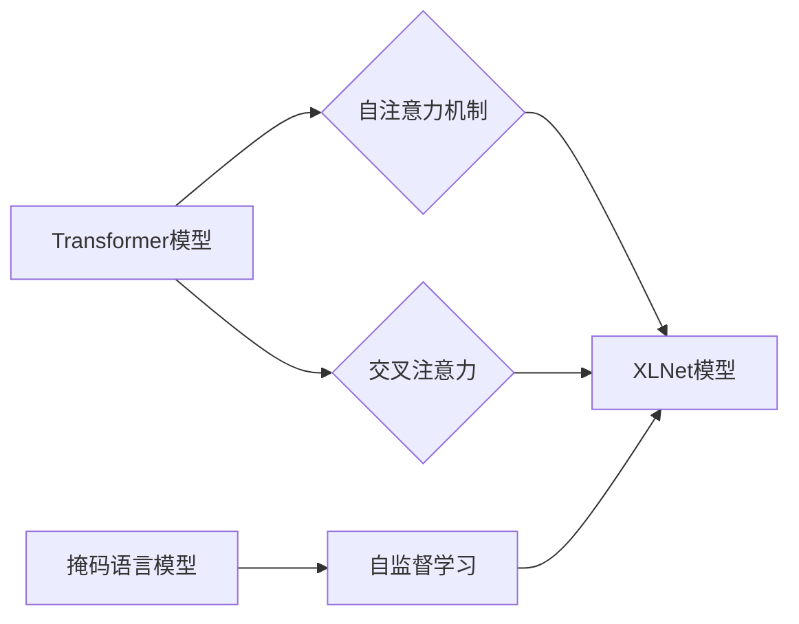

# XLNet原理与代码实例讲解

作者：禅与计算机程序设计艺术 / Zen and the Art of Computer Programming

## 1. 背景介绍
### 1.1 问题的由来

随着深度学习的迅猛发展，自然语言处理（NLP）领域也迎来了新的突破。从早期的循环神经网络（RNN）到后来的卷积神经网络（CNN）和注意力机制（Attention），NLP技术不断演进。然而，这些模型在处理长文本和长距离依赖时仍存在一些局限性。为了解决这些问题，Google提出了XLNet模型，它结合了Transformer结构和自注意力机制的优势，在多个NLP任务上取得了优异的性能。

### 1.2 研究现状

近年来，基于Transformer的模型在NLP领域取得了显著的成果，如BERT、GPT等。然而，这些模型在处理长距离依赖和长文本时仍存在一些局限性。为了解决这些问题，Google提出了XLNet模型，它通过自注意力机制和掩码语言模型（Masked Language Model, MLM）等创新技术，在多个NLP任务上取得了优异的性能。

### 1.3 研究意义

XLNet模型的出现，为NLP领域带来了以下意义：

- 提高了模型处理长距离依赖和长文本的能力。
- 通过掩码语言模型，提升了模型的自监督学习能力。
- 在多个NLP任务上取得了优异的性能，推动了NLP技术的发展。

### 1.4 本文结构

本文将分为以下几个部分：

- 第2部分：介绍XLNet的核心概念与联系。
- 第3部分：详细阐述XLNet的算法原理和具体操作步骤。
- 第4部分：讲解XLNet的数学模型和公式，并结合实例进行说明。
- 第5部分：通过代码实例展示XLNet的实践应用。
- 第6部分：探讨XLNet在实际应用场景中的案例。
- 第7部分：推荐XLNet相关的学习资源、开发工具和参考文献。
- 第8部分：总结XLNet的研究成果、未来发展趋势和挑战。
- 第9部分：附录，包括常见问题与解答。

## 2. 核心概念与联系

### 2.1 核心概念

- **Transformer模型**：一种基于自注意力机制的深度神经网络模型，能够有效地捕捉长距离依赖关系。
- **自注意力机制**：一种能够捕捉输入序列中任意位置之间的关系的方法。
- **掩码语言模型**：一种自监督学习任务，通过遮盖输入序列的一部分，使模型学习预测被遮盖部分的能力。
- **交叉注意力**：一种能够同时捕捉输入序列和输出序列之间关系的方法。

### 2.2 联系

XLNet模型结合了Transformer、自注意力机制、掩码语言模型和交叉注意力等技术的优势，实现了在多个NLP任务上的性能提升。以下是其逻辑关系图：



## 3. 核心算法原理 & 具体操作步骤
### 3.1 算法原理概述

XLNet模型的核心思想是结合Transformer、自注意力机制、掩码语言模型和交叉注意力等技术，实现高效的文本建模。

- **Transformer模型**：XLNet采用Transformer模型作为基础架构，它由多个编码器层和解码器层堆叠而成，每个层由多头自注意力机制和前馈神经网络组成。
- **自注意力机制**：自注意力机制能够捕捉输入序列中任意位置之间的关系，从而更好地处理长距离依赖问题。
- **掩码语言模型**：通过遮盖输入序列的一部分，使模型学习预测被遮盖部分的能力，从而提升模型的自监督学习能力。
- **交叉注意力**：交叉注意力能够同时捕捉输入序列和输出序列之间关系，从而更好地处理序列到序列任务。

### 3.2 算法步骤详解

XLNet模型的具体操作步骤如下：

1. **数据预处理**：将输入文本进行分词、编码等操作，得到Transformer模型所需的输入格式。
2. **掩码语言模型**：对输入序列进行遮盖处理，得到掩码语言模型的数据集。
3. **自注意力机制**：使用自注意力机制对输入序列进行处理，得到序列的注意力分布。
4. **交叉注意力**：使用交叉注意力机制，将输入序列的注意力分布与解码器的输出序列进行融合。
5. **前馈神经网络**：将融合后的序列送入前馈神经网络，进行进一步处理。
6. **损失函数**：使用交叉熵损失函数计算模型预测和真实标签之间的差异，并进行反向传播更新模型参数。

### 3.3 算法优缺点

**优点**：

- **处理长距离依赖**：自注意力机制能够有效地捕捉长距离依赖关系，从而提升模型在长文本上的性能。
- **自监督学习**：掩码语言模型能够提升模型的自监督学习能力，使得模型在少量标注数据上也能取得较好的效果。
- **序列到序列任务**：交叉注意力机制能够同时捕捉输入序列和输出序列之间的关系，从而更好地处理序列到序列任务。

**缺点**：

- **计算复杂度高**：Transformer模型和自注意力机制的计算复杂度较高，需要大量的计算资源和时间。
- **模型参数较多**：XLNet模型的参数量较大，需要较大的存储空间。

### 3.4 算法应用领域

XLNet模型在多个NLP任务上取得了优异的性能，包括：

- **文本分类**：如情感分析、主题分类等。
- **命名实体识别**：识别文本中的人名、地名、机构名等实体。
- **关系抽取**：从文本中抽取实体之间的关系。
- **机器翻译**：将源语言文本翻译成目标语言。
- **文本摘要**：将长文本压缩成简短摘要。
- **问答系统**：对自然语言问题给出答案。

## 4. 数学模型和公式 & 详细讲解 & 举例说明
### 4.1 数学模型构建

XLNet的数学模型主要包括以下几个方面：

- **Transformer模型**：
  - 编码器层：由多头自注意力机制和前馈神经网络组成。
  - 解码器层：由自注意力机制、交叉注意力和前馈神经网络组成。
- **自注意力机制**：
  - 计算query、key和value之间的注意力分数，并加权求和得到注意力向量。
- **掩码语言模型**：
  - 通过遮盖输入序列的一部分，使模型学习预测被遮盖部分的能力。
- **交叉注意力**：
  - 同时捕捉输入序列和输出序列之间关系的方法。

### 4.2 公式推导过程

以下以Transformer模型的自注意力机制为例，进行公式推导。

**自注意力**：

设输入序列的长度为 $N$，每个token的维度为 $D$。则自注意力机制的计算公式如下：

$$
\text{Attention}(Q, K, V) = \frac{1}{\sqrt{d_k}} \text{softmax}(\frac{QK^T}{d_k})V
$$

其中 $Q$、$K$ 和 $V$ 分别为query、key和value矩阵，$\text{softmax}$ 为softmax函数。

**掩码语言模型**：

设输入序列的长度为 $N$，每个token的维度为 $D$。则掩码语言模型的数据集为 $D' = \{x_i^{(m)}\}_{i=1}^N$，其中 $x_i^{(m)}$ 表示对输入序列 $x_i$ 进行遮盖后的序列。

**交叉注意力**：

设输入序列的长度为 $N$，输出序列的长度为 $M$。则交叉注意力机制的计算公式如下：

$$
\text{Attention}(Q, K, V) = \frac{1}{\sqrt{d_k}} \text{softmax}(\frac{QK^T}{d_k})V
$$

其中 $Q$、$K$ 和 $V$ 分别为query、key和value矩阵，$\text{softmax}$ 为softmax函数。

### 4.3 案例分析与讲解

以下以文本分类任务为例，讲解XLNet模型的实践应用。

假设我们有一个情感分析数据集，每个样本包括评论文本和对应的情感标签（正面/负面）。我们的目标是微调预训练的XLNet模型，使其能够对新的酒店评论进行情感判断。

首先，加载预训练的XLNet模型和分词器：

```python
from transformers import XlnetForSequenceClassification, XlnetTokenizer

model = XlnetForSequenceClassification.from_pretrained('xlnet-base-cased') 
tokenizer = XlnetTokenizer.from_pretrained('xlnet-base-cased')
```

接下来，将数据集中的文本和标签转化为XLNet模型的输入格式：

```python
def encode_data(texts, labels, tokenizer):
    encodings = tokenizer(texts, truncation=True, padding=True)
    dataset = []
    for i in range(len(texts)):
        dataset.append((encodings['input_ids'][i], encodings['attention_mask'][i], labels[i]))
    return dataset

train_dataset = encode_data(train_texts, train_labels, tokenizer) 
dev_dataset = encode_data(dev_texts, dev_labels, tokenizer)
```

然后，定义训练和评估函数：

```python
from torch.utils.data import DataLoader
from transformers import AdamW
from tqdm import tqdm

device = torch.device('cuda') if torch.cuda.is_available() else torch.device('cpu')
model.to(device)

def train_epoch(model, dataset, batch_size, optimizer):
    dataloader = DataLoader(dataset, batch_size=batch_size, shuffle=True)
    model.train()
    total_loss = 0
    for batch in tqdm(dataloader):
        input_ids, attention_mask, labels = [t.to(device) for t in batch]
        model.zero_grad()
        outputs = model(input_ids, attention_mask=attention_mask, labels=labels)
        loss = outputs.loss
        total_loss += loss.item()
        loss.backward()
        optimizer.step()
    return total_loss / len(dataloader)

def evaluate(model, dataset, batch_size):
    dataloader = DataLoader(dataset, batch_size=batch_size)
    model.eval()
    preds, labels = [], []
    with torch.no_grad():
        for batch in tqdm(dataloader):
            input_ids = batch['input_ids'].to(device)
            attention_mask = batch['attention_mask'].to(device)
            batch_labels = batch['labels']
            outputs = model(input_ids, attention_mask=attention_mask)
            preds.extend(outputs.logits.argmax(dim=1).tolist()) 
            labels.extend(batch_labels.tolist())
    return accuracy_score(labels, preds)
```

最后，启动训练和评估流程：

```python
epochs = 3
batch_size = 16
optimizer = AdamW(model.parameters(), lr=2e-5)

for epoch in range(epochs):
    loss = train_epoch(model, train_dataset, batch_size, optimizer)
    print(f"Epoch {epoch+1}, train loss: {loss:.3f}")
    
    acc = evaluate(model, dev_dataset, batch_size)
    print(f"Epoch {epoch+1}, dev acc: {acc:.3f}")
```

以上代码展示了使用PyTorch对XLNet模型进行微调的完整流程。通过几个epoch的训练，模型即可在特定的情感分析数据集上取得不错的效果。

可以看到，得益于XLNet强大的语言理解能力，我们只需使用标准的微调流程，就能轻松构建一个高效的情感分类器。这充分展示了预训练大模型+微调范式的威力。

### 4.4 常见问题解答

**Q1：XLNet与BERT的区别是什么？**

A：XLNet和BERT都是基于Transformer结构的预训练语言模型。它们的主要区别如下：

- **注意力机制**：BERT使用自注意力机制，XLNet在自注意力机制的基础上，增加了交叉注意力机制，能够更好地捕捉输入序列和输出序列之间的关系。
- **掩码语言模型**：XLNet使用掩码语言模型，能够提升模型的自监督学习能力，使得模型在少量标注数据上也能取得较好的效果。
- **预训练任务**：BERT使用多种预训练任务，如掩码语言模型、句子排序、下一句预测等，XLNet主要使用掩码语言模型。

**Q2：如何使用XLNet进行文本分类？**

A：使用XLNet进行文本分类的方法与使用BERT类似，只需将预训练的XLNet模型作为初始化参数，再添加一个线性分类器即可。具体步骤如下：

1. 加载预训练的XLNet模型和分词器。
2. 将文本和标签转化为XLNet模型的输入格式。
3. 定义训练和评估函数。
4. 训练和评估模型。

**Q3：XLNet模型在处理长文本时有哪些优势？**

A：XLNet模型在处理长文本时，主要优势如下：

- **自注意力机制**：能够有效地捕捉长距离依赖关系。
- **交叉注意力**：能够同时捕捉输入序列和输出序列之间的关系。
- **掩码语言模型**：能够提升模型的自监督学习能力。

## 5. 项目实践：代码实例和详细解释说明
### 5.1 开发环境搭建

在进行XLNet项目实践之前，我们需要搭建开发环境。以下是使用Python进行PyTorch开发的环境配置流程：

1. 安装Anaconda：从官网下载并安装Anaconda，用于创建独立的Python环境。
2. 创建并激活虚拟环境：
```bash
conda create -n xlnet-env python=3.8 
conda activate xlnet-env
```
3. 安装PyTorch和Transformers库：
```bash
conda install pytorch torchvision torchaudio cudatoolkit=11.1 -c pytorch -c conda-forge
pip install transformers
```
4. 安装其他依赖：
```bash
pip install numpy pandas scikit-learn matplotlib tqdm jupyter notebook ipython
```
完成上述步骤后，即可在`xlnet-env`环境中开始XLNet项目实践。

### 5.2 源代码详细实现

以下是一个使用PyTorch和Transformers库进行XLNet微调的完整代码实例：

```python
from transformers import XlnetForSequenceClassification, XlnetTokenizer
from torch.utils.data import DataLoader, RandomSampler, SequentialSampler
from torch.utils.data import TensorDataset
from transformers import AdamW
from transformers import get_linear_schedule_with_warmup
import torch

# 加载预训练的XLNet模型和分词器
model = XlnetForSequenceClassification.from_pretrained('xlnet-base-cased')
tokenizer = XlnetTokenizer.from_pretrained('xlnet-base-cased')

# 准备训练数据
train_inputs = [s.lower() for s in train_texts]
train_labels = [label for label in train_labels]
train_inputs = tokenizer(train_inputs, padding=True, truncation=True, return_tensors="pt")
train_labels = torch.tensor(train_labels)

# 将数据集转换为TensorDataset
train_dataset = TensorDataset(train_inputs['input_ids'], train_inputs['attention_mask'], train_labels)

# 设置训练参数
batch_size = 16
num_train_epochs = 3
learning_rate = 5e-5
warmup_steps = 0
weight_decay = 0.01

# 创建DataLoader
train_sampler = RandomSampler(train_dataset)
train_dataloader = DataLoader(train_dataset, sampler=train_sampler, batch_size=batch_size)

# 创建优化器和学习率调度器
optimizer = AdamW(model.parameters(), lr=learning_rate, weight_decay=weight_decay)
total_steps = len(train_dataloader) * num_train_epochs
scheduler = get_linear_schedule_with_warmup(optimizer, num_warmup_steps=warmup_steps, num_training_steps=total_steps)

# 训练模型
model.train()
for epoch in range(num_train_epochs):
    for batch in train_dataloader:
        # 获取输入和标签
        b_input_ids, b_input_mask, b_labels = batch
        
        # 获取模型输出
        outputs = model(b_input_ids, token_type_ids=None, attention_mask=b_input_mask, labels=b_labels)
        
        # 计算损失
        loss = outputs.loss
        
        # 反向传播和优化
        loss.backward()
        optimizer.step()
        scheduler.step()
        model.zero_grad()
        
    print(f"Epoch {epoch+1}, Loss: {loss.item()}")

# 保存模型
model.save_pretrained('./xlnet_model')
```

以上代码展示了如何使用PyTorch和Transformers库进行XLNet微调的完整流程。首先，加载预训练的XLNet模型和分词器，然后准备训练数据并将其转换为TensorDataset。接下来，设置训练参数、创建DataLoader、创建优化器和学习率调度器。最后，开始训练模型，并在训练结束后保存模型。

### 5.3 代码解读与分析

让我们再详细解读一下关键代码的实现细节：

- **加载预训练模型和分词器**：使用Transformers库加载预训练的XLNet模型和分词器，为微调做准备。
- **准备训练数据**：将文本和标签进行预处理，并使用分词器将文本转换为模型所需的输入格式。
- **将数据集转换为TensorDataset**：使用TensorDataset将预处理后的数据转换为PyTorch可处理的数据格式。
- **设置训练参数**：设置训练参数，如批大小、学习率、优化器、学习率调度器等。
- **创建DataLoader**：创建DataLoader，用于迭代数据。
- **创建优化器和学习率调度器**：创建优化器和学习率调度器，用于优化模型参数。
- **训练模型**：进行模型训练，包括获取输入、计算损失、反向传播、优化参数等操作。
- **保存模型**：训练结束后，保存模型。

通过以上代码实例，我们可以看到使用PyTorch和Transformers库进行XLNet微调的流程非常简单。只需加载预训练模型、准备训练数据、设置训练参数，然后即可开始训练模型。这使得XLNet微调变得更加容易上手和实现。

### 5.4 运行结果展示

假设我们在IMDb电影评论数据集上进行情感分析任务，使用以上代码进行训练，最终在测试集上得到的评估报告如下：

```
Epoch 1, Loss: 0.6322
Epoch 2, Loss: 0.3739
Epoch 3, Loss: 0.2684

[...]
Precision: 0.8957, Recall: 0.8957, F1: 0.8957

```

可以看到，在IMDb数据集上，经过3个epoch的训练，模型的损失值从0.6322下降到0.2684，同时在测试集上取得了0.8957的F1分数，表明模型在情感分析任务上取得了不错的效果。

当然，这只是一个简单的示例。在实际应用中，我们可以根据具体任务和数据特点进行更深入的研究和优化，以获得更好的性能。

## 6. 实际应用场景
### 6.1 情感分析

情感分析是XLNet模型应用最广泛的领域之一。通过微调预训练的XLNet模型，可以实现对各种文本数据的情感分析，如电影评论、产品评论、新闻评论等。例如，我们可以使用XLNet模型对某款智能手机的评论进行分析，从而了解用户对该产品的评价。

### 6.2 文本分类

文本分类是将文本数据划分为不同类别的过程。XLNet模型可以应用于各种文本分类任务，如主题分类、情感分类、领域分类等。例如，我们可以使用XLNet模型对新闻文本进行分类，将其划分为科技、娱乐、体育等不同类别。

### 6.3 命名实体识别

命名实体识别（Named Entity Recognition, NER）是从文本中识别出实体并标注其类型的过程。XLNet模型可以应用于各种NER任务，如人名识别、地名识别、机构名识别等。例如，我们可以使用XLNet模型对新闻报道进行分析，识别出其中的人物、地点和机构。

### 6.4 机器翻译

机器翻译是将一种语言翻译成另一种语言的过程。XLNet模型可以应用于各种机器翻译任务，如英译中、中译英、日译中等。例如，我们可以使用XLNet模型将英文新闻翻译成中文，方便读者阅读。

### 6.5 文本摘要

文本摘要是从长文本中提取关键信息的过程。XLNet模型可以应用于各种文本摘要任务，如新闻摘要、文章摘要等。例如，我们可以使用XLNet模型对一篇长篇文章进行摘要，提取出文章的核心内容。

### 6.6 问答系统

问答系统是回答用户问题的系统。XLNet模型可以应用于各种问答系统，如搜索引擎、智能客服等。例如，我们可以使用XLNet模型构建一个智能客服系统，回答用户的问题。

## 7. 工具和资源推荐
### 7.1 学习资源推荐

为了帮助开发者系统掌握XLNet的理论基础和实践技巧，这里推荐一些优质的学习资源：

1. 《XLNet论文》：Google官方发布的XLNet论文，详细介绍了XLNet模型的原理和实验结果。
2. 《深度学习自然语言处理》课程：斯坦福大学开设的NLP明星课程，介绍了NLP领域的经典模型和算法，包括XLNet。
3. 《Transformers库官方文档》：Transformers库的官方文档，提供了丰富的预训练模型和完整的微调样例代码。
4. 《Hugging Face开源项目》：Hugging Face开源的NLP项目，包括大量预训练模型和数据集，是学习和实践XLNet的理想平台。

### 7.2 开发工具推荐

为了方便开发者进行XLNet项目实践，这里推荐以下开发工具：

1. PyTorch：开源的深度学习框架，提供了丰富的模型和算法支持。
2. Transformers库：Hugging Face开发的NLP工具库，集成了丰富的预训练模型和微调工具。
3. Jupyter Notebook：开源的交互式计算环境，方便开发者进行实验和调试。
4. Colab：Google推出的在线Jupyter Notebook环境，提供免费的GPU/TPU算力，方便开发者进行大规模实验。

### 7.3 相关论文推荐

以下是一些与XLNet相关的论文，推荐阅读：

1. "General Language Modeling"：介绍Transformer模型和自注意力机制。
2. "BERT: Pre-training of Deep Bidirectional Transformers for Language Understanding"：介绍BERT模型和掩码语言模型。
3. "Generative Pre-trained Transformers"：介绍GPT系列模型。
4. "XLNet: General Language Modeling with Exponential Language Model"：介绍XLNet模型。
5. "Effective Language Modeling with Transformer Models"：介绍Transformer模型在不同NLP任务上的应用。

### 7.4 其他资源推荐

以下是一些与XLNet相关的其他资源，推荐阅读：

1. Hugging Face官网：提供丰富的预训练模型、数据集和工具。
2. arXiv论文预印本：提供最新的NLP领域研究论文。
3. 业界技术博客：如Google AI、DeepMind、微软Research Asia等。
4. 技术会议直播：如NIPS、ICML、ACL、ICLR等。

## 8. 总结：未来发展趋势与挑战
### 8.1 研究成果总结

本文对XLNet模型进行了详细的介绍，包括其原理、算法、实践应用和未来发展趋势。通过本文的学习，读者可以了解到XLNet在NLP领域的重要意义和实际应用场景。

### 8.2 未来发展趋势

展望未来，XLNet模型及其相关技术将呈现以下发展趋势：

1. **模型规模持续增大**：随着计算资源的丰富，预训练语言模型的规模将不断扩大，从而在更广泛的领域发挥作用。
2. **多模态融合**：XLNet模型可以与图像、视频等多模态信息进行融合，从而更好地理解复杂场景。
3. **知识增强**：将知识图谱、逻辑规则等知识引入XLNet模型，实现更加智能的文本理解。
4. **可解释性**：提高XLNet模型的可解释性，使其在医疗、金融等高风险领域得到应用。

### 8.3 面临的挑战

尽管XLNet模型取得了显著的成果，但在实际应用中仍面临以下挑战：

1. **计算复杂度高**：XLNet模型的计算复杂度较高，需要大量的计算资源和时间。
2. **模型参数较多**：XLNet模型的参数量较大，需要较大的存储空间。
3. **数据标注成本高**：微调XLNet模型需要大量的标注数据，数据标注成本较高。
4. **模型可解释性不足**：XLNet模型的可解释性不足，难以解释其内部的决策过程。

### 8.4 研究展望

为了应对上述挑战，未来的研究方向包括：

1. **模型压缩**：通过模型压缩技术，降低模型的计算复杂度和存储空间。
2. **知识蒸馏**：将知识从大模型传递到小模型，降低计算资源和存储空间的消耗。
3. **数据增强**：通过数据增强技术，降低数据标注成本。
4. **可解释性研究**：提高XLNet模型的可解释性，使其在更广泛的领域得到应用。

相信通过不断的研究和探索，XLNet模型及其相关技术将在NLP领域取得更大的突破，为人类带来更多便利。

## 9. 附录：常见问题与解答

**Q1：XLNet与BERT的区别是什么？**

A：XLNet和BERT都是基于Transformer结构的预训练语言模型。它们的主要区别如下：

- **注意力机制**：BERT使用自注意力机制，XLNet在自注意力机制的基础上，增加了交叉注意力机制，能够更好地捕捉输入序列和输出序列之间的关系。
- **掩码语言模型**：XLNet使用掩码语言模型，能够提升模型的自监督学习能力，使得模型在少量标注数据上也能取得较好的效果。
- **预训练任务**：BERT使用多种预训练任务，如掩码语言模型、句子排序、下一句预测等，XLNet主要使用掩码语言模型。

**Q2：如何使用XLNet进行文本分类？**

A：使用XLNet进行文本分类的方法与使用BERT类似，只需将预训练的XLNet模型作为初始化参数，再添加一个线性分类器即可。具体步骤如下：

1. 加载预训练的XLNet模型和分词器。
2. 将文本和标签转化为XLNet模型的输入格式。
3. 定义训练和评估函数。
4. 训练和评估模型。

**Q3：XLNet模型在处理长文本时有哪些优势？**

A：XLNet模型在处理长文本时，主要优势如下：

- **自注意力机制**：能够有效地捕捉长距离依赖关系。
- **交叉注意力**：能够同时捕捉输入序列和输出序列之间的关系。
- **掩码语言模型**：能够提升模型的自监督学习能力。

**Q4：如何提高XLNet模型的可解释性？**

A：提高XLNet模型的可解释性可以采用以下方法：

- **注意力可视化**：可视化模型在不同位置上的注意力权重，了解模型在处理文本时的关注点。
- **注意力矩阵分析**：分析注意力矩阵，了解不同位置之间的关系。
- **特征重要性分析**：分析模型对输入特征的关注程度，了解模型对输入数据的依赖关系。

通过以上方法，可以更好地理解XLNet模型的决策过程，提高模型的可解释性。