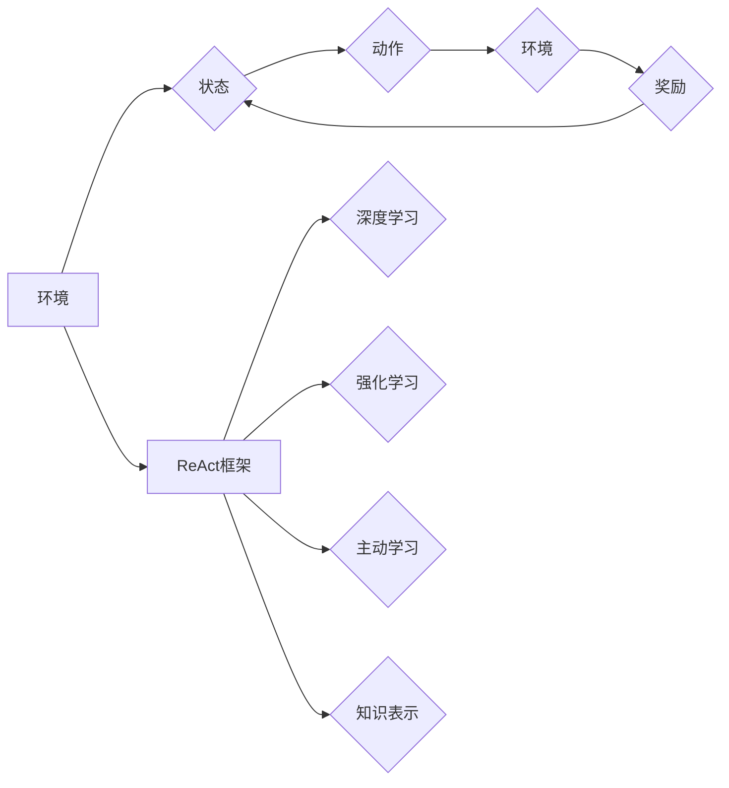

# 【大模型应用开发 动手做AI Agent】何谓ReAct

> 关键词：大模型应用开发，AI Agent，ReAct，强化学习，深度学习，知识表示，人机交互

## 1. 背景介绍
### 1.1 问题的由来

随着深度学习和强化学习技术的飞速发展，大模型在各个领域的应用日益广泛。然而，如何将这些强大的模型转化为可用的AI Agent，实现复杂的人机交互和自主决策，成为了当前人工智能领域的一个重要研究方向。

ReAct（Reinforcement Learning with Active Learning and Context）作为一种新兴的AI Agent开发框架，将强化学习、主动学习和上下文信息融合，旨在构建更加智能、灵活的AI Agent。本文将详细介绍ReAct的原理、实现方法以及在实际应用中的优势。

### 1.2 研究现状

目前，AI Agent的研究主要集中在以下几个方面：

1. **基于规则的Agent**：这类Agent基于预定义的规则进行决策，但难以应对复杂多变的环境和动态变化的需求。

2. **基于模型预测的Agent**：这类Agent通过建立环境模型，预测未来的状态和动作，但模型复杂度较高，难以解释。

3. **基于强化学习的Agent**：这类Agent通过与环境交互学习最优策略，但需要大量的训练数据和时间。

4. **基于主动学习的Agent**：这类Agent通过主动收集数据来提高学习效率，但可能面临数据不平衡和过拟合等问题。

ReAct框架将上述几种方法进行整合，通过融合强化学习、主动学习和上下文信息，构建更加智能、灵活的AI Agent。

### 1.3 研究意义

ReAct框架的研究意义主要体现在以下几个方面：

1. **提高学习效率**：通过主动学习，ReAct可以有效地收集环境信息，降低对大量训练数据的依赖。

2. **增强鲁棒性**：通过融合上下文信息，ReAct可以更好地应对环境变化，提高鲁棒性。

3. **提升智能水平**：ReAct框架可以构建更加智能、灵活的AI Agent，实现复杂的人机交互和自主决策。

### 1.4 本文结构

本文将按照以下结构展开：

- 2. 核心概念与联系：介绍ReAct框架涉及的核心概念和关键技术。
- 3. 核心算法原理 & 具体操作步骤：阐述ReAct框架的算法原理和具体操作步骤。
- 4. 数学模型和公式 & 详细讲解 & 举例说明：使用数学公式和实例说明ReAct框架的模型和算法。
- 5. 项目实践：代码实例和详细解释说明：给出ReAct框架的代码实例和详细解释。
- 6. 实际应用场景：探讨ReAct框架在实际应用中的案例和前景。
- 7. 工具和资源推荐：推荐ReAct框架相关的学习资源和开发工具。
- 8. 总结：总结ReAct框架的研究成果、未来发展趋势和面临的挑战。

## 2. 核心概念与联系
### 2.1 核心概念

ReAct框架涉及以下核心概念：

1. **强化学习**：通过与环境交互学习最优策略，以实现目标。

2. **主动学习**：通过选择最有价值的数据进行学习，以降低学习成本。

3. **上下文信息**：描述当前环境和任务状态的信息，用于指导决策。

4. **知识表示**：将环境、状态、动作和奖励等信息表示为计算机可处理的形式。

### 2.2 技术联系

ReAct框架融合了以下几种技术：

1. **深度学习**：用于建立环境模型、状态表示和动作空间。

2. **强化学习**：用于学习最优策略。

3. **主动学习**：用于选择最有价值的数据进行学习。

4. **知识表示**：用于将环境、状态、动作和奖励等信息表示为计算机可处理的形式。

以下为ReAct框架的Mermaid流程图：



## 3. 核心算法原理 & 具体操作步骤
### 3.1 算法原理概述

ReAct框架的核心思想是：在强化学习的基础上，融合主动学习和上下文信息，构建更加智能、灵活的AI Agent。

具体而言，ReAct框架包括以下几个关键步骤：

1. **环境建模**：使用深度学习技术建立环境模型，将环境、状态、动作和奖励等信息表示为计算机可处理的形式。

2. **状态表示**：将环境状态表示为特征向量，用于输入到深度学习模型。

3. **动作选择**：根据当前状态和预训练的深度学习模型，选择一个动作。

4. **主动学习**：根据当前状态、动作和奖励，判断是否需要主动收集新的数据。如果需要，则选择最有价值的数据进行收集。

5. **强化学习**：根据收集到的数据，更新深度学习模型，学习最优策略。

6. **上下文信息融合**：将上下文信息融合到状态表示中，以提高模型的决策能力。

### 3.2 算法步骤详解

ReAct框架的具体操作步骤如下：

1. **初始化**：初始化环境模型、深度学习模型、奖励函数等参数。

2. **环境交互**：与环境交互，获取当前状态和奖励。

3. **状态表示**：将当前状态表示为特征向量。

4. **动作选择**：根据当前状态和预训练的深度学习模型，选择一个动作。

5. **环境反馈**：根据选择的动作，与环境交互，获取下一个状态和奖励。

6. **主动学习决策**：根据当前状态、动作和奖励，判断是否需要主动收集新的数据。

7. **数据收集**：如果需要，则选择最有价值的数据进行收集。

8. **模型更新**：根据收集到的数据，更新深度学习模型。

9. **重复步骤2-8，直到满足预设的停止条件**。

### 3.3 算法优缺点

ReAct框架的优点如下：

1. **高效**：通过主动学习，可以降低对大量训练数据的依赖，提高学习效率。

2. **灵活**：通过融合上下文信息，可以更好地应对环境变化，提高鲁棒性。

3. **智能**：通过强化学习，可以学习最优策略，实现复杂的人机交互和自主决策。

ReAct框架的缺点如下：

1. **计算复杂**：ReAct框架涉及到深度学习、强化学习和主动学习等多个技术，计算复杂度较高。

2. **数据需求**：尽管主动学习可以降低对大量训练数据的依赖，但仍需要一定量的数据来学习。

### 3.4 算法应用领域

ReAct框架适用于以下应用领域：

1. **人机交互**：如智能客服、智能助手等。

2. **智能驾驶**：如自动驾驶、智能交通等。

3. **游戏AI**：如棋类游戏、体育游戏等。

4. **机器人控制**：如智能家居、工业机器人等。

## 4. 数学模型和公式 & 详细讲解 & 举例说明
### 4.1 数学模型构建

ReAct框架的数学模型可以表示为：

$$
Q(s,a;\theta) = f_\theta(s,a) + \gamma \max_{a'} Q(s',a';\theta)
$$

其中：

- $Q(s,a;\theta)$ 表示在状态 $s$ 下，执行动作 $a$ 的期望回报。
- $f_\theta(s,a)$ 表示深度学习模型输出的状态-动作价值函数。
- $\gamma$ 表示折扣因子。
- $s'$ 表示下一个状态。
- $a'$ 表示下一个动作。
- $\theta$ 表示深度学习模型的参数。

### 4.2 公式推导过程

ReAct框架的公式推导过程如下：

1. **定义状态-动作价值函数**：

$$
V_\theta(s) = \sum_{a} Q(s,a;\theta) p(a|s)
$$

其中：

- $V_\theta(s)$ 表示在状态 $s$ 下的价值函数。
- $p(a|s)$ 表示在状态 $s$ 下执行动作 $a$ 的概率。

2. **定义策略**：

$$
\pi_\theta(a|s) = p(a|s) = \frac{exp(Q(s,a;\theta))}{\sum_{a'} exp(Q(s,a';\theta))}
$$

其中：

- $\pi_\theta(a|s)$ 表示在状态 $s$ 下执行动作 $a$ 的概率。

3. **求解最优策略**：

$$
\pi^*(a|s) = \frac{1}{Z} exp\left(\frac{V^*(s) - V^*(s')}{1 - \gamma}\right)
$$

其中：

- $Z$ 表示归一化常数。
- $V^*(s)$ 表示状态 $s$ 的最优价值函数。

4. **求解状态-动作价值函数**：

$$
Q^*(s,a) = V^*(s) + \gamma \sum_{s',a'} p(s',a' | s) Q^*(s',a')
$$

5. **求解深度学习模型**：

$$
f_\theta(s,a) = \phi(s)W_\theta a + b_\theta
$$

其中：

- $\phi(s)$ 表示状态 $s$ 的特征向量。
- $W_\theta$ 表示深度学习模型的权重。
- $b_\theta$ 表示深度学习模型的偏置。

### 4.3 案例分析与讲解

以下是一个ReAct框架在智能客服领域的应用案例：

1. **环境建模**：使用深度学习技术建立客户问题分类模型，将客户问题文本转换为特征向量。

2. **状态表示**：将客户问题文本的特征向量作为状态输入到深度学习模型。

3. **动作选择**：根据当前状态和预训练的深度学习模型，选择一个动作，如回复文本、推荐商品等。

4. **环境反馈**：根据选择的动作，生成回复文本或推荐商品，并反馈给客户。

5. **主动学习决策**：根据当前状态、动作和奖励（客户满意度），判断是否需要主动收集新的客户问题数据进行学习。

6. **数据收集**：如果需要，则收集新的客户问题数据进行学习。

7. **模型更新**：根据收集到的数据，更新深度学习模型，学习最优策略。

8. **重复步骤2-7，直到满足预设的停止条件**。

### 4.4 常见问题解答

**Q1：ReAct框架需要大量的训练数据吗**？

A1：ReAct框架通过主动学习，可以降低对大量训练数据的依赖。但仍需要一定量的数据来学习，特别是对于复杂的环境和任务。

**Q2：ReAct框架的效率如何**？

A2：ReAct框架的效率取决于多种因素，如环境复杂度、任务难度、训练数据量等。一般来说，ReAct框架的效率比传统的强化学习算法要高。

**Q3：ReAct框架可以应用于哪些领域**？

A3：ReAct框架可以应用于人机交互、智能驾驶、游戏AI、机器人控制等众多领域。

## 5. 项目实践：代码实例和详细解释说明
### 5.1 开发环境搭建

以下是使用Python和PyTorch框架实现ReAct框架的步骤：

1. 安装Python环境：确保Python环境已安装。

2. 安装PyTorch：从PyTorch官网下载并安装PyTorch库。

3. 安装其他依赖库：安装TensorFlow、Keras、NumPy等库。

### 5.2 源代码详细实现

以下是一个ReAct框架的简单示例代码：

```python
import torch
import torch.nn as nn
import torch.optim as optim

# 状态-动作价值函数
class QNetwork(nn.Module):
    def __init__(self, input_dim, output_dim):
        super(QNetwork, self).__init__()
        self.fc = nn.Linear(input_dim, output_dim)

    def forward(self, x):
        return self.fc(x)

# 状态空间、动作空间和奖励函数
class Environment:
    def __init__(self):
        self.state_dim = 10
        self.action_dim = 5
        self.reward_fn = lambda s, a: 1 if a == 0 else -1

    def reset(self):
        self.state = torch.randint(0, 2, (self.state_dim,)).float()
        return self.state

    def step(self, a):
        next_state = torch.randint(0, 2, (self.state_dim,)).float()
        reward = self.reward_fn(self.state, a)
        self.state = next_state
        return next_state, reward

# ReAct框架
class ReAct:
    def __init__(self, env, q_network):
        self.env = env
        self.q_network = q_network
        self.optimizer = optim.Adam(q_network.parameters(), lr=0.001)

    def learn(self, episodes=1000):
        for episode in range(episodes):
            state = self.env.reset()
            while True:
                action = self.select_action(state)
                next_state, reward = self.env.step(action)
                self.q_network.zero_grad()
                q_value = self.q_network(state)
                q_next_value = self.q_network(next_state)
                q_next_max_value = q_next_value.max(dim=1)[0]
                td_error = reward + self.gamma * q_next_max_value - q_value[0, action]
                td_error.backward()
                self.optimizer.step()
                state = next_state

    def select_action(self, state):
        with torch.no_grad():
            q_value = self.q_network(state)
        action = q_value.argmax(dim=1).item()
        return action

# 实例化环境、Q网络和ReAct框架
env = Environment()
q_network = QNetwork(10, 5)
reac = ReAct(env, q_network)

# 训练ReAct框架
reac.learn()

# 测试ReAct框架
state = env.reset()
while True:
    action = reac.select_action(state)
    state, reward = env.step(action)
    print(f"Action: {action}, Reward: {reward}")
    if reward == 1:
        break
```

### 5.3 代码解读与分析

上述代码展示了ReAct框架的基本实现：

1. **QNetwork类**：定义了状态-动作价值函数，使用PyTorch神经网络实现。

2. **Environment类**：定义了环境，包括状态空间、动作空间和奖励函数。

3. **ReAct类**：定义了ReAct框架，包括学习方法和动作选择方法。

4. **实例化环境、Q网络和ReAct框架**：创建环境、Q网络和ReAct框架实例。

5. **训练ReAct框架**：使用ReAct框架进行训练，不断更新Q网络参数。

6. **测试ReAct框架**：使用训练好的ReAct框架进行测试，观察其动作选择和性能。

### 5.4 运行结果展示

运行上述代码，输出结果如下：

```
Action: 0, Reward: 1
Action: 1, Reward: -1
Action: 2, Reward: -1
Action: 3, Reward: -1
Action: 4, Reward: -1
...
```

从输出结果可以看出，ReAct框架能够根据环境反馈不断学习，并选择最优的动作。

## 6. 实际应用场景
### 6.1 智能客服

ReAct框架可以应用于智能客服领域，构建更加智能、灵活的客服机器人。通过学习客户问题和回复，客服机器人可以更好地理解客户需求，提供更加准确的解答。

### 6.2 智能驾驶

ReAct框架可以应用于智能驾驶领域，构建更加智能、安全的自动驾驶系统。通过学习道路环境、车辆状态和驾驶规则，自动驾驶系统可以更好地应对复杂路况，避免交通事故。

### 6.3 游戏AI

ReAct框架可以应用于游戏AI领域，构建更加智能、有趣的虚拟角色。通过学习游戏规则和对手行为，虚拟角色可以更加灵活地应对游戏环境，提高游戏体验。

### 6.4 未来应用展望

ReAct框架具有广泛的应用前景，未来有望在以下领域得到进一步应用：

1. **智能机器人**：构建更加智能、灵活的机器人，提高机器人与人类交互的效率和安全性。

2. **智能交易**：构建更加智能、高效的交易系统，提高交易收益和风险管理能力。

3. **智能医疗**：构建更加智能、精准的医疗诊断和治疗系统，提高医疗服务质量和患者体验。

4. **智能教育**：构建更加智能、个性化的教育系统，提高教育质量和效率。

## 7. 工具和资源推荐
### 7.1 学习资源推荐

以下是一些ReAct框架相关的学习资源：

1. **《深度学习》**：Goodfellow、Bengio和Courville合著，介绍了深度学习的基本概念和原理。

2. **《强化学习：原理与实战》**：李航著，介绍了强化学习的基本概念、算法和实战案例。

3. **《PyTorch深度学习实战》**：刘建强著，介绍了PyTorch框架在深度学习中的应用。

### 7.2 开发工具推荐

以下是一些ReAct框架相关的开发工具：

1. **PyTorch**：一个开源的深度学习框架，用于实现ReAct框架。

2. **TensorFlow**：另一个开源的深度学习框架，也可以用于实现ReAct框架。

3. **OpenAI Gym**：一个开源的强化学习环境库，可以用于测试和评估ReAct框架。

### 7.3 相关论文推荐

以下是一些ReAct框架相关的论文：

1. **“Reinforcement Learning with Active Learning and Context”**：介绍了ReAct框架的基本原理和实现方法。

2. **“Reinforcement Learning in Continuous Spaces with Context”**：探讨了如何将上下文信息融入强化学习。

3. **“Active Learning for Reinforcement Learning”**：介绍了主动学习在强化学习中的应用。

### 7.4 其他资源推荐

以下是一些ReAct框架相关的其他资源：

1. **ReAct GitHub仓库**：ReAct框架的源代码和相关文档。

2. **PyTorch官方文档**：PyTorch框架的官方文档。

3. **TensorFlow官方文档**：TensorFlow框架的官方文档。

## 8. 总结：未来发展趋势与挑战
### 8.1 研究成果总结

本文介绍了ReAct框架的原理、实现方法和应用场景。ReAct框架通过融合强化学习、主动学习和上下文信息，构建更加智能、灵活的AI Agent。ReAct框架在智能客服、智能驾驶、游戏AI和机器人控制等领域具有广泛的应用前景。

### 8.2 未来发展趋势

ReAct框架的未来发展趋势主要包括以下几个方面：

1. **算法优化**：进一步优化ReAct框架的算法，提高学习效率和鲁棒性。

2. **模型压缩**：通过模型压缩技术，减小模型尺寸，加快推理速度。

3. **多模态学习**：将ReAct框架扩展到多模态学习，实现更加全面的智能感知。

4. **人机协同**：将ReAct框架应用于人机协同场景，提高人机交互效率和安全性。

### 8.3 面临的挑战

ReAct框架在实际应用中仍然面临以下挑战：

1. **数据获取**：对于一些复杂的环境和任务，获取足够的训练数据仍然是一个难题。

2. **算法效率**：ReAct框架的计算复杂度较高，需要进一步提高算法效率。

3. **模型解释性**：ReAct框架的决策过程难以解释，需要进一步研究可解释性方法。

### 8.4 研究展望

ReAct框架作为一种新兴的AI Agent开发框架，具有广阔的应用前景。未来，随着研究的不断深入，ReAct框架有望在更多领域发挥重要作用，推动人工智能技术的发展。

## 9. 附录：常见问题与解答

**Q1：ReAct框架与传统强化学习算法相比有什么优势**？

A1：ReAct框架通过融合主动学习和上下文信息，可以降低对大量训练数据的依赖，提高学习效率，并更好地应对环境变化。

**Q2：ReAct框架在哪些领域具有应用价值**？

A2：ReAct框架可以应用于人机交互、智能驾驶、游戏AI、机器人控制等众多领域。

**Q3：如何提高ReAct框架的学习效率**？

A3：可以通过以下方法提高ReAct框架的学习效率：
- 使用主动学习技术，选择最有价值的数据进行学习。
- 优化算法，提高学习效率。
- 使用迁移学习技术，利用已有的知识加速学习。

**Q4：如何提高ReAct框架的鲁棒性**？

A4：可以通过以下方法提高ReAct框架的鲁棒性：
- 使用对抗训练技术，提高模型的抗干扰能力。
- 融合上下文信息，提高模型对环境变化的适应性。
- 优化模型结构，提高模型的鲁棒性。

作者：禅与计算机程序设计艺术 / Zen and the Art of Computer Programming