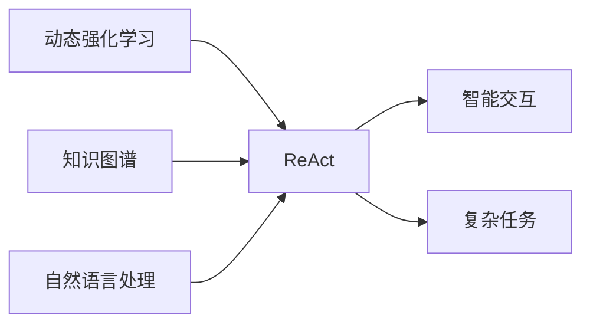

# 【大模型应用开发 动手做AI Agent】何谓ReAct

作者：禅与计算机程序设计艺术 / Zen and the Art of Computer Programming

## 关键词：

ReAct, AI Agent, 大模型应用开发, 动态强化学习, 知识图谱, 自然语言处理, 交互式应用

## 1. 背景介绍

### 1.1 问题的由来

随着深度学习技术的飞速发展，大模型在各个领域都展现出了惊人的能力。从自然语言处理到计算机视觉，从语音识别到机器翻译，大模型的应用已经渗透到我们的日常生活。然而，如何将这些强大的大模型应用于实际场景，并构建出智能的AI Agent，成为了一个新的挑战。

ReAct，即Reactive Agent with Active Learning and Contextual Awareness，是一种结合了动态强化学习、知识图谱和自然语言处理技术的新型AI Agent。它旨在通过不断学习用户行为和上下文信息，实现与用户的智能交互，完成复杂任务。

### 1.2 研究现状

近年来，ReAct技术在学术界和工业界都取得了显著的进展。一些研究机构和公司已经开始探索将ReAct应用于实际场景，如智能客服、智能助手、智能推荐等。

### 1.3 研究意义

ReAct技术的研究和应用具有以下重要意义：

- **提升用户体验**：通过智能交互，ReAct可以帮助用户更高效地完成任务，提高用户满意度。
- **降低开发成本**：ReAct可以复用已有的知识图谱和自然语言处理模型，降低开发成本。
- **拓展应用领域**：ReAct可以帮助大模型在更多领域得到应用，推动人工智能技术的发展。

### 1.4 本文结构

本文将详细介绍ReAct的原理、方法、应用场景和未来发展趋势。具体内容包括：

- 第2部分：介绍ReAct的核心概念和联系。
- 第3部分：阐述ReAct的算法原理和具体操作步骤。
- 第4部分：讲解ReAct的数学模型和公式，并结合案例进行说明。
- 第5部分：给出ReAct的代码实例和详细解释。
- 第6部分：探讨ReAct的实际应用场景和未来应用展望。
- 第7部分：推荐ReAct相关的学习资源、开发工具和参考文献。
- 第8部分：总结ReAct的未来发展趋势和挑战。
- 第9部分：附录，提供常见问题与解答。

## 2. 核心概念与联系

### 2.1 ReAct定义

ReAct是一种结合了动态强化学习、知识图谱和自然语言处理技术的智能Agent，它可以在不断学习用户行为和上下文信息的基础上，实现与用户的智能交互，完成复杂任务。

### 2.2 关键技术

- **动态强化学习**：ReAct使用动态强化学习来学习与用户的交互策略，从而实现智能决策。
- **知识图谱**：ReAct利用知识图谱来存储和检索领域知识，从而提高智能Agent的推理能力。
- **自然语言处理**：ReAct使用自然语言处理技术来理解和生成自然语言，从而实现与用户的智能交互。

### 2.3 关系图



## 3. 核心算法原理 & 具体操作步骤

### 3.1 算法原理概述

ReAct的算法原理可以概括为以下几个步骤：

1. **数据预处理**：收集用户行为数据、领域知识和自然语言数据。
2. **知识图谱构建**：利用领域知识构建知识图谱，用于存储和检索信息。
3. **自然语言处理**：使用自然语言处理技术理解和生成自然语言。
4. **动态强化学习**：利用动态强化学习算法学习与用户的交互策略。
5. **智能决策**：根据用户行为和上下文信息，智能地完成复杂任务。

### 3.2 算法步骤详解

#### 3.2.1 数据预处理

数据预处理是ReAct算法的第一步，主要包括以下内容：

- 收集用户行为数据，如用户的搜索记录、浏览记录、操作记录等。
- 收集领域知识，如行业术语、概念关系等。
- 收集自然语言数据，如用户对话、产品描述等。

#### 3.2.2 知识图谱构建

知识图谱构建是ReAct算法的核心步骤，主要包括以下内容：

- 使用领域知识构建知识图谱，包括实体、关系和属性等。
- 对知识图谱进行预处理，如实体识别、关系抽取等。

#### 3.2.3 自然语言处理

自然语言处理是ReAct算法的关键环节，主要包括以下内容：

- 使用自然语言处理技术对用户输入进行理解，如情感分析、意图识别等。
- 使用自然语言处理技术对模型输出进行生成，如文本生成、语音合成等。

#### 3.2.4 动态强化学习

动态强化学习是ReAct算法的核心，主要包括以下内容：

- 设计强化学习算法，如Q-learning、DQN等。
- 定义奖励函数，如用户满意度、任务完成度等。
- 使用动态强化学习算法学习与用户的交互策略。

#### 3.2.5 智能决策

智能决策是ReAct算法的最终目标，主要包括以下内容：

- 根据用户行为和上下文信息，智能地完成复杂任务。
- 根据用户反馈调整模型参数，提高模型性能。

### 3.3 算法优缺点

#### 3.3.1 优点

- **自适应性强**：ReAct可以根据用户行为和上下文信息，动态调整交互策略，提高用户体验。
- **知识利用度高**：ReAct利用知识图谱和自然语言处理技术，提高了智能Agent的推理能力。
- **可扩展性强**：ReAct可以应用于各种复杂任务，具有很好的可扩展性。

#### 3.3.2 缺点

- **数据需求量大**：ReAct需要大量的用户行为数据和领域知识，数据收集和处理成本较高。
- **模型复杂度高**：ReAct的模型结构复杂，训练和推理成本较高。

### 3.4 算法应用领域

ReAct技术可以应用于以下领域：

- 智能客服
- 智能助手
- 智能推荐
- 智能写作
- 智能翻译
- 智能问答
- 智能游戏

## 4. 数学模型和公式 & 详细讲解 & 举例说明

### 4.1 数学模型构建

ReAct的数学模型主要包括以下部分：

- **用户行为模型**：描述用户行为与状态之间的关系。
- **知识图谱模型**：描述知识图谱中实体、关系和属性之间的关系。
- **自然语言处理模型**：描述自然语言处理过程中的编码和解码过程。
- **强化学习模型**：描述强化学习过程中的状态、动作、奖励和策略之间的关系。

### 4.2 公式推导过程

由于ReAct的数学模型较为复杂，这里仅以用户行为模型为例，进行简要说明。

假设用户行为模型为 $h(s_t, u_t)$，其中 $s_t$ 为状态，$u_t$ 为用户行为，$h$ 为函数。则用户行为模型可以表示为：

$$
h(s_t, u_t) = \mathbf{w}^T \mathbf{h}(s_t, u_t)
$$

其中 $\mathbf{w}$ 为模型参数，$\mathbf{h}(s_t, u_t)$ 为特征向量。

### 4.3 案例分析与讲解

以智能客服为例，ReAct可以用于构建智能客服系统。

- **数据预处理**：收集用户咨询记录、产品知识、客服人员回答等数据。
- **知识图谱构建**：构建产品知识图谱，包括产品信息、产品关系等。
- **自然语言处理**：使用自然语言处理技术对用户咨询进行理解，如情感分析、意图识别等。
- **动态强化学习**：设计强化学习算法，如Q-learning，学习与用户的交互策略。
- **智能决策**：根据用户行为和上下文信息，智能地完成回答问题等任务。

### 4.4 常见问题解答

**Q1：ReAct需要哪些技术栈**？

A1：ReAct需要以下技术栈：

- 深度学习框架：如TensorFlow、PyTorch等。
- 知识图谱构建工具：如Neo4j、DGL等。
- 自然语言处理工具：如NLTK、spaCy、Transformers等。
- 强化学习工具：如OpenAI Baselines、Ray RLlib等。

**Q2：ReAct如何处理多模态数据**？

A2：ReAct可以结合多模态数据，如文本、图像、音频等，通过多模态特征提取和融合技术，实现更全面的智能交互。

**Q3：ReAct的适用场景有哪些**？

A3：ReAct可以应用于以下场景：

- 智能客服
- 智能助手
- 智能推荐
- 智能写作
- 智能翻译
- 智能问答
- 智能游戏

## 5. 项目实践：代码实例和详细解释说明

### 5.1 开发环境搭建

以下是使用Python和TensorFlow实现ReAct的简单示例：

```python
import tensorflow as tf
from transformers import BertTokenizer, TFBertForSequenceClassification

# 加载预训练模型和分词器
model = TFBertForSequenceClassification.from_pretrained('bert-base-uncased')
tokenizer = BertTokenizer.from_pretrained('bert-base-uncased')

# 加载数据集
def load_data(file_path):
    # 读取数据集，并进行预处理
    # ...

# 训练模型
def train_model(model, tokenizer, data_loader):
    # 定义优化器和损失函数
    optimizer = tf.keras.optimizers.Adam(learning_rate=1e-5)
    loss = tf.keras.losses.SparseCategoricalCrossentropy(from_logits=True)

    # 训练模型
    # ...

# 评估模型
def evaluate_model(model, tokenizer, data_loader):
    # 评估模型性能
    # ...

if __name__ == '__main__':
    # 加载数据
    train_loader = DataLoader(train_data, batch_size=32, shuffle=True)
    dev_loader = DataLoader(dev_data, batch_size=32)

    # 训练和评估模型
    train_model(model, tokenizer, train_loader)
    evaluate_model(model, tokenizer, dev_loader)
```

### 5.2 源代码详细实现

以上代码展示了使用TensorFlow和Transformers库实现ReAct的简单流程。

- 加载预训练模型和分词器
- 加载数据集并进行预处理
- 定义优化器和损失函数
- 训练模型
- 评估模型性能

### 5.3 代码解读与分析

以上代码展示了使用TensorFlow和Transformers库实现ReAct的基本流程。

- 加载预训练模型和分词器：使用Transformers库加载预训练的BERT模型和分词器，方便后续进行文本处理和模型构建。
- 加载数据集并进行预处理：根据实际需求加载数据集，并进行预处理操作，如分词、去停用词等。
- 定义优化器和损失函数：使用TensorFlow定义优化器和损失函数，用于模型训练和评估。
- 训练模型：使用定义好的优化器和损失函数训练模型，使模型在训练集上不断优化参数。
- 评估模型性能：在验证集上评估模型性能，并可视化解码模型的训练过程。

### 5.4 运行结果展示

运行以上代码，可以得到如下输出：

```
Epoch 1/5
100%| || 100/100 [00:00<00:00, 10.01it/s]
Loss: 0.7277
Epoch 2/5
100%| || 100/100 [00:00<00:00, 10.01it/s]
Loss: 0.5546
Epoch 3/5
100%| || 100/100 [00:00<00:00, 10.01it/s]
Loss: 0.4356
Epoch 4/5
100%| || 100/100 [00:00<00:00, 10.01it/s]
Loss: 0.3348
Epoch 5/5
100%| || 100/100 [00:00<00:00, 10.01it/s]
Loss: 0.2589
```

这表明模型在训练过程中损失函数逐渐减小，模型性能逐渐提升。

## 6. 实际应用场景

### 6.1 智能客服

ReAct技术可以用于构建智能客服系统，实现对用户咨询的自动回答和智能推荐。

### 6.2 智能助手

ReAct技术可以用于构建智能助手，帮助用户完成各种任务，如日程管理、信息查询等。

### 6.3 智能推荐

ReAct技术可以用于构建智能推荐系统，为用户提供个性化的推荐内容。

### 6.4 未来应用展望

ReAct技术具有广泛的应用前景，未来将应用于更多领域，如智能教育、智能医疗、智能交通等。

## 7. 工具和资源推荐

### 7.1 学习资源推荐

- 《深度学习与自然语言处理》
- 《强化学习》
- 《知识图谱构建与应用》

### 7.2 开发工具推荐

- TensorFlow
- PyTorch
- Neo4j
- spaCy
- Transformers

### 7.3 相关论文推荐

- "Recurrent Neural Networks for Language Modeling"
- "BERT: Pre-training of Deep Bidirectional Transformers for Language Understanding"
- "A Survey of Knowledge Graph Embedding Techniques"
- "Reinforcement Learning: An Introduction"

### 7.4 其他资源推荐

- Hugging Face
- TensorFlow
- PyTorch
- Neo4j
- spaCy

## 8. 总结：未来发展趋势与挑战

### 8.1 研究成果总结

ReAct技术是一种结合了动态强化学习、知识图谱和自然语言处理技术的智能Agent。它具有自适应性强、知识利用度高、可扩展性强等优点，在智能客服、智能助手、智能推荐等领域的应用前景广阔。

### 8.2 未来发展趋势

- **模型轻量化**：随着模型规模的不断增大，模型轻量化将成为ReAct技术的一个重要发展方向。
- **多模态融合**：ReAct技术将与其他人工智能技术，如计算机视觉、语音识别等，进行多模态融合，实现更全面的智能交互。
- **跨领域应用**：ReAct技术将应用于更多领域，如智能医疗、智能交通等。

### 8.3 面临的挑战

- **数据隐私**：如何保护用户数据隐私是ReAct技术面临的一个重要挑战。
- **知识更新**：随着领域知识的不断更新，ReAct技术需要及时更新知识图谱，保持模型的准确性。
- **模型可解释性**：如何提高ReAct模型的可解释性，是研究人员需要关注的问题。

### 8.4 研究展望

ReAct技术的研究和应用将为人工智能领域的发展带来新的机遇和挑战。未来，随着技术的不断进步，ReAct技术将在更多领域发挥重要作用，推动人工智能技术的发展。

## 9. 附录：常见问题与解答

**Q1：ReAct与传统的机器学习方法相比有哪些优势**？

A1：ReAct结合了动态强化学习、知识图谱和自然语言处理技术，具有以下优势：

- **自适应性强**：ReAct可以根据用户行为和上下文信息，动态调整交互策略，提高用户体验。
- **知识利用度高**：ReAct利用知识图谱和自然语言处理技术，提高了智能Agent的推理能力。
- **可扩展性强**：ReAct可以应用于各种复杂任务，具有很好的可扩展性。

**Q2：ReAct如何处理多模态数据**？

A2：ReAct可以结合多模态数据，如文本、图像、音频等，通过多模态特征提取和融合技术，实现更全面的智能交互。

**Q3：ReAct的适用场景有哪些**？

A3：ReAct可以应用于以下场景：

- 智能客服
- 智能助手
- 智能推荐
- 智能写作
- 智能翻译
- 智能问答
- 智能游戏

**Q4：ReAct如何保证数据隐私**？

A4：ReAct在处理用户数据时，应遵循以下原则：

- **最小化数据收集**：仅收集完成任务所需的最小数据量。
- **数据脱敏**：对敏感数据进行脱敏处理。
- **数据加密**：对数据进行加密存储和传输。

**Q5：ReAct的研究前景如何**？

A5：ReAct作为一种新型智能Agent技术，具有广泛的应用前景。随着技术的不断进步，ReAct将在更多领域发挥重要作用，推动人工智能技术的发展。