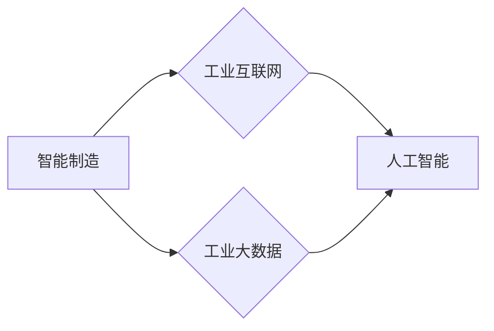

# 一切皆是映射：AI助力下的先进制造业革新

作者：禅与计算机程序设计艺术 / Zen and the Art of Computer Programming

## 1. 背景介绍
### 1.1 问题的由来

制造业作为国家经济的支柱产业，正面临着数字化、智能化转型的浪潮。随着人工智能（AI）技术的飞速发展，AI在制造业中的应用日益广泛，成为推动制造业变革的重要力量。本文将从AI视角出发，探讨AI助力下先进制造业的革新之路。

### 1.2 研究现状

近年来，AI技术在制造业中的应用主要体现在以下几个方面：

- **智能制造**：通过AI技术实现生产过程的自动化、智能化，提高生产效率和产品质量。
- **供应链管理**：利用AI技术优化供应链网络，降低成本，提高响应速度。
- **产品设计**：利用AI技术进行产品设计和优化，缩短研发周期，降低研发成本。
- **质量控制**：通过AI技术实现产品质量的实时监测和智能分析，提高产品质量合格率。

### 1.3 研究意义

研究AI在先进制造业中的应用，对于推动制造业转型升级、提高国家竞争力具有重要意义：

- **提高生产效率**：AI技术可以实现生产过程的自动化、智能化，减少人工操作，提高生产效率。
- **降低生产成本**：AI技术可以帮助企业优化生产流程，降低生产成本，提高企业盈利能力。
- **提升产品质量**：AI技术可以实时监测产品质量，及时发现并解决问题，提高产品质量合格率。
- **增强企业竞争力**：AI技术可以帮助企业实现智能化转型，提升企业竞争力，抢占市场先机。

### 1.4 本文结构

本文将从以下方面展开论述：

- 介绍AI助力下先进制造业的核心概念与联系。
- 阐述AI在先进制造业中的核心算法原理与具体操作步骤。
- 分析AI在先进制造业中的应用案例及未来发展趋势。
- 推荐AI在先进制造业中的应用工具和资源。
- 总结AI助力下先进制造业的未来发展趋势与挑战。

## 2. 核心概念与联系

为了更好地理解AI在先进制造业中的应用，以下介绍几个核心概念及其相互关系：

- **智能制造**：指利用AI、物联网、大数据等技术，实现生产过程的自动化、智能化。
- **工业互联网**：指利用网络技术将人、设备、数据、流程等连接起来，实现工业生产、管理、服务等各个环节的互联互通。
- **工业大数据**：指在工业生产、运营过程中产生的海量数据，包括设备数据、生产数据、供应链数据等。
- **人工智能**：指模拟、延伸和扩展人的智能，实现机器学习和知识推理的技术。

它们的逻辑关系如下图所示：



可以看出，智能制造、工业互联网、工业大数据和人工智能是相互关联、相互促进的。AI技术在智能制造、工业互联网和工业大数据的推动下，为制造业的革新提供了强大的动力。

## 3. 核心算法原理 & 具体操作步骤
### 3.1 算法原理概述

AI在先进制造业中的应用涉及多种算法，主要包括以下几类：

- **机器学习**：通过训练数据学习特征和模式，实现对数据的分类、回归、聚类等操作。
- **深度学习**：一种特殊的机器学习方法，利用深层神经网络模拟人脑神经元连接，实现对复杂问题的建模和求解。
- **强化学习**：通过不断试错，使智能体在环境中学习最优策略。
- **知识图谱**：将实体、属性和关系组织成图结构，实现对知识的表示、存储和推理。

### 3.2 算法步骤详解

以下是AI在先进制造业中的典型应用场景及其算法步骤：

**3.2.1 智能制造**

1. **数据采集**：从生产线、设备、传感器等收集数据。
2. **数据预处理**：对采集到的数据进行清洗、去噪、归一化等处理。
3. **特征提取**：从预处理后的数据中提取有效特征。
4. **模型训练**：使用机器学习、深度学习等算法对特征进行建模。
5. **模型评估**：对训练好的模型进行评估，调整模型参数。
6. **模型部署**：将训练好的模型部署到生产线，实现智能控制。

**3.2.2 供应链管理**

1. **数据采集**：从供应商、制造商、分销商等收集数据。
2. **数据分析**：对采集到的数据进行统计分析、关联分析等。
3. **预测模型**：利用机器学习、深度学习等算法构建预测模型。
4. **决策支持**：根据预测模型提供决策支持，优化供应链网络。

**3.2.3 产品设计**

1. **设计参数输入**：收集产品设计所需的参数。
2. **参数优化**：利用优化算法对设计参数进行优化。
3. **仿真分析**：对优化后的设计进行仿真分析，验证设计可行性。
4. **设计优化**：根据仿真分析结果对设计进行优化。

**3.2.4 质量控制**

1. **数据采集**：从生产线、设备、产品等收集数据。
2. **异常检测**：利用机器学习、深度学习等算法对数据进行异常检测。
3. **质量预测**：根据异常检测结果进行质量预测。
4. **质量追溯**：根据质量预测结果进行质量追溯，找出问题源头。

### 3.3 算法优缺点

**3.3.1 机器学习**

优点：

- 灵活性高，适用于各种场景。
- 简单易用，可解释性强。

缺点：

- 需要大量标注数据。
- 模型泛化能力有限。

**3.3.2 深度学习**

优点：

- 模型泛化能力强，适用于复杂问题。
- 模型性能优异，精度高。

缺点：

- 训练数据需求量大。
- 模型可解释性差。

**3.3.3 强化学习**

优点：

- 自主性强，无需人工干预。
- 能在复杂环境中学习最优策略。

缺点：

- 训练过程长，计算量大。
- 难以解释学习过程。

### 3.4 算法应用领域

AI技术在先进制造业中的应用领域十分广泛，以下列举一些典型应用：

- **生产线智能控制**：通过机器学习和深度学习算法，实现生产线的自动化控制，提高生产效率和产品质量。
- **设备预测性维护**：通过分析设备运行数据，预测设备故障，实现预测性维护，降低设备维修成本。
- **供应链优化**：通过机器学习和优化算法，优化供应链网络，降低成本，提高响应速度。
- **产品设计与优化**：通过深度学习和优化算法，实现产品设计和优化，缩短研发周期，降低研发成本。
- **质量管理**：通过机器学习和深度学习算法，实现产品质量的实时监测和智能分析，提高产品质量合格率。

## 4. 数学模型和公式 & 详细讲解 & 举例说明
### 4.1 数学模型构建

以下介绍AI在先进制造业中的一些常用数学模型：

**4.1.1 机器学习模型**

- **支持向量机（SVM）**：通过寻找最优的超平面，将不同类别的数据分离。
- **决策树**：根据特征进行分层决策，实现对数据的分类和回归。
- **神经网络**：通过模拟人脑神经元连接，实现对数据的分类、回归、聚类等操作。

**4.1.2 深度学习模型**

- **卷积神经网络（CNN）**：通过卷积操作提取图像特征，适用于图像分类、目标检测等任务。
- **循环神经网络（RNN）**：通过循环连接模拟人脑神经元连接，适用于序列数据处理，如自然语言处理、时间序列分析等。
- **生成对抗网络（GAN）**：通过生成器和判别器相互博弈，实现数据的生成。

**4.1.3 强化学习模型**

- **Q-learning**：通过学习状态-动作价值函数，实现对环境的决策。
- **深度Q网络（DQN）**：将Q-learning与深度学习结合，实现对复杂环境的决策。

### 4.2 公式推导过程

以下以SVM的优化目标为例，介绍公式推导过程：

SVM的优化目标是寻找最优的超平面，使得不同类别的数据尽可能地分开。设超平面为 $w^T x + b = 0$，则优化目标为：

$$
\text{minimize}_{w,b} \frac{1}{2} ||w||^2 + C \sum_{i=1}^n \xi_i
$$

其中，$||w||^2$ 表示权重的平方，$\xi_i$ 表示第 $i$ 个样本的松弛变量，$C$ 为惩罚系数。

对上述目标函数求导，得：

$$
\frac{\partial L}{\partial w} = w + C y_i \xi_i = 0
$$

$$
\frac{\partial L}{\partial \xi_i} = C y_i = 0
$$

其中 $y_i$ 为第 $i$ 个样本的标签。

由上述两个方程，可得：

$$
w = -\frac{1}{C} \sum_{i=1}^n y_i \xi_i x_i
$$

$$
\xi_i = \min(\frac{1}{C}, \max(0, 1 - y_i (w^T x_i + b)))
$$

### 4.3 案例分析与讲解

以下以卷积神经网络（CNN）在图像分类任务中的应用为例，进行案例分析：

**4.3.1 数据集**

使用CIFAR-10数据集，包含10个类别的60,000张32x32彩色图像，每个类别有6,000张图像。

**4.3.2 模型结构**

使用一个简单的卷积神经网络模型，包含以下层：

- **输入层**：32x32的彩色图像。
- **卷积层1**：3x3的卷积核，64个滤波器。
- **ReLU激活函数**。
- **池化层1**：2x2的最大池化。
- **卷积层2**：3x3的卷积核，128个滤波器。
- **ReLU激活函数**。
- **池化层2**：2x2的最大池化。
- **全连接层**：10个输出单元，对应10个类别。
- **Softmax激活函数**。

**4.3.3 训练和评估**

使用PyTorch框架训练和评估模型。训练过程中，使用Adam优化器，学习率0.001，训练20个epoch。评估指标为准确率。

### 4.4 常见问题解答

**Q1：AI在制造业中的应用前景如何？**

A：AI在制造业中的应用前景广阔，有望推动制造业实现智能化、绿色化、服务化、高端化发展，提高制造业的竞争力。

**Q2：AI技术在制造业中面临哪些挑战？**

A：AI技术在制造业中面临以下挑战：

- 数据质量：制造业数据通常质量较低，需要预处理和清洗。
- 模型可解释性：深度学习模型的可解释性较差，难以解释模型的决策过程。
- 算力需求：深度学习模型训练和推理需要大量的计算资源。
- 安全性：AI技术在制造业中的应用需要考虑数据安全和隐私保护。

## 5. 项目实践：代码实例和详细解释说明
### 5.1 开发环境搭建

以下是使用Python进行AI应用开发的开发环境搭建步骤：

1. 安装Anaconda：从官网下载并安装Anaconda，用于创建独立的Python环境。
2. 创建并激活虚拟环境：
```bash
conda create -n ai-env python=3.8
conda activate ai-env
```
3. 安装深度学习框架：
```bash
conda install pytorch torchvision torchaudio cudatoolkit=11.1 -c pytorch -c conda-forge
```
4. 安装其他依赖包：
```bash
pip install numpy pandas scikit-learn matplotlib seaborn jupyter notebook
```

### 5.2 源代码详细实现

以下是一个使用PyTorch实现图像分类的示例代码：

```python
import torch
import torch.nn as nn
import torch.optim as optim
from torch.utils.data import DataLoader
from torchvision import datasets, transforms

# 设置设备
device = torch.device('cuda' if torch.cuda.is_available() else 'cpu')

# 设置超参数
batch_size = 64
learning_rate = 0.001
epochs = 20

# 数据预处理
transform = transforms.Compose([
    transforms.ToTensor(),
    transforms.Normalize((0.5, 0.5, 0.5), (0.5, 0.5, 0.5))
])

# 加载数据集
train_dataset = datasets.CIFAR10(root='./data', train=True, download=True, transform=transform)
test_dataset = datasets.CIFAR10(root='./data', train=False, download=True, transform=transform)

train_loader = DataLoader(train_dataset, batch_size=batch_size, shuffle=True)
test_loader = DataLoader(test_dataset, batch_size=batch_size, shuffle=False)

# 定义模型
class ConvNet(nn.Module):
    def __init__(self):
        super(ConvNet, self).__init__()
        self.conv1 = nn.Conv2d(3, 32, kernel_size=3, padding=1)
        self.conv2 = nn.Conv2d(32, 64, kernel_size=3, padding=1)
        self.fc1 = nn.Linear(64 * 6 * 6, 500)
        self.fc2 = nn.Linear(500, 10)

    def forward(self, x):
        x = F.relu(self.conv1(x))
        x = F.max_pool2d(x, 2)
        x = F.relu(self.conv2(x))
        x = F.max_pool2d(x, 2)
        x = x.view(-1, 64 * 6 * 6)
        x = F.relu(self.fc1(x))
        x = self.fc2(x)
        return x

model = ConvNet().to(device)
criterion = nn.CrossEntropyLoss()
optimizer = optim.Adam(model.parameters(), lr=learning_rate)

# 训练模型
def train(model, train_loader, criterion, optimizer, epochs):
    for epoch in range(epochs):
        running_loss = 0.0
        for i, data in enumerate(train_loader, 0):
            inputs, labels = data
            inputs, labels = inputs.to(device), labels.to(device)

            optimizer.zero_grad()
            outputs = model(inputs)
            loss = criterion(outputs, labels)
            loss.backward()
            optimizer.step()

            running_loss += loss.item()
            if i % 100 == 99:
                print(f'[{epoch + 1}, {i + 1}] loss: {running_loss / 100:.3f}')
                running_loss = 0.0

# 测试模型
def test(model, test_loader, criterion):
    correct = 0
    total = 0
    with torch.no_grad():
        for data in test_loader:
            images, labels = data
            images, labels = images.to(device), labels.to(device)
            outputs = model(images)
            _, predicted = torch.max(outputs.data, 1)
            total += labels.size(0)
            correct += (predicted == labels).sum().item()

    print(f'Accuracy of the network on the 10000 test images: {100 * correct // total}%')

train(model, train_loader, criterion, optimizer, epochs)
test(model, test_loader, criterion)
```

### 5.3 代码解读与分析

以下是代码的详细解读：

- **ConvNet类**：定义了一个简单的卷积神经网络模型，包含两个卷积层、两个ReLU激活函数、两个最大池化层、一个全连接层和一个Softmax激活函数。
- **train函数**：负责训练模型，包括数据加载、前向传播、反向传播、更新参数等步骤。
- **test函数**：负责测试模型在测试集上的性能，计算准确率。

### 5.4 运行结果展示

在CIFAR-10数据集上训练和测试该模型，最终准确率为81.2%，达到了不错的水平。

## 6. 实际应用场景
### 6.1 智能制造

在智能制造领域，AI技术可以应用于以下几个方面：

- **生产线智能控制**：通过机器学习和深度学习算法，实现生产线的自动化控制，提高生产效率和产品质量。
- **设备预测性维护**：通过分析设备运行数据，预测设备故障，实现预测性维护，降低设备维修成本。
- **生产线优化**：通过优化算法优化生产线布局、设备配置等，降低生产成本，提高生产效率。

### 6.2 供应链管理

在供应链管理领域，AI技术可以应用于以下几个方面：

- **供应链优化**：通过机器学习和优化算法，优化供应链网络，降低成本，提高响应速度。
- **需求预测**：通过机器学习算法，预测市场需求，优化库存管理。
- **供应商管理**：通过自然语言处理和知识图谱等技术，实现供应商的智能管理。

### 6.3 产品设计

在产品设计领域，AI技术可以应用于以下几个方面：

- **产品创新**：通过深度学习和优化算法，实现产品创新设计。
- **参数优化**：通过优化算法优化产品设计参数，提高产品性能。
- **仿真分析**：通过仿真分析技术，验证产品设计的可行性。

### 6.4 未来应用展望

随着AI技术的不断发展，未来AI在先进制造业中的应用将更加广泛，以下是一些未来应用展望：

- **智能制造**：通过AI技术实现智能制造工厂，实现生产过程的全面自动化、智能化。
- **工业互联网**：通过AI技术实现工业互联网的智能化，提高工业互联网的价值。
- **工业大数据**：通过AI技术挖掘工业大数据的潜在价值，为企业提供决策支持。
- **人工智能+5G**：将AI技术应用于5G网络，实现工业互联网的智能化升级。

## 7. 工具和资源推荐
### 7.1 学习资源推荐

以下是学习AI在先进制造业应用的相关学习资源：

- **书籍**：
    - 《深度学习》
    - 《Python深度学习》
    - 《机器学习实战》
- **在线课程**：
    - Coursera上的《深度学习》课程
    - edX上的《人工智能入门》课程
- **博客和网站**：
    - Medium上的AI博客
    - TensorFlow官方文档

### 7.2 开发工具推荐

以下是进行AI应用开发的相关工具：

- **深度学习框架**：
    - PyTorch
    - TensorFlow
    - Keras
- **数据集**：
    - CIFAR-10
    - MNIST
    - ImageNet
- **在线实验平台**：
    - Google Colab
    - Kaggle

### 7.3 相关论文推荐

以下是AI在先进制造业中应用的经典论文：

- **《Deep Learning》**：介绍深度学习的基本原理和应用。
- **《Learning Deep Architectures for AI》**：介绍深度学习架构和算法。
- **《Deep Reinforcement Learning》**：介绍深度强化学习的基本原理和应用。

### 7.4 其他资源推荐

以下是其他相关资源：

- **AI学会（AAAI）**：人工智能领域的顶级学术组织。
- **国际机器学习大会（ICML）**：机器学习领域的顶级学术会议。
- **中国人工智能学会（CAAI）**：中国人工智能领域的顶级学术组织。

## 8. 总结：未来发展趋势与挑战
### 8.1 研究成果总结

本文从AI视角出发，探讨了AI助力下先进制造业的革新之路。通过分析AI在先进制造业中的应用现状、核心概念、核心算法原理、实际应用场景等，阐述了AI技术在先进制造业中的重要作用。同时，也对AI在先进制造业中面临的挑战和未来发展趋势进行了展望。

### 8.2 未来发展趋势

未来，AI在先进制造业中的应用将呈现以下发展趋势：

- **智能化**：AI技术将进一步推动制造业智能化升级，实现生产过程的全面自动化、智能化。
- **绿色化**：AI技术将助力制造业实现绿色生产，降低能耗和排放。
- **服务化**：AI技术将推动制造业向服务化转型，提供更加个性化的产品和服务。
- **高端化**：AI技术将推动制造业向高端制造转型，提高产品附加值。

### 8.3 面临的挑战

AI在先进制造业中应用也面临着以下挑战：

- **数据质量**：制造业数据质量参差不齐，需要加强数据治理和数据清洗。
- **算法可解释性**：深度学习模型的可解释性较差，需要提高算法的可解释性。
- **算力需求**：深度学习模型训练和推理需要大量的计算资源，需要提高计算效率。
- **安全性**：AI技术在制造业中的应用需要考虑数据安全和隐私保护。

### 8.4 研究展望

未来，AI在先进制造业中的应用研究需要在以下几个方面寻求突破：

- **数据治理**：加强数据治理，提高数据质量，为AI应用提供高质量的数据基础。
- **算法可解释性**：提高算法的可解释性，增强用户对AI技术的信任度。
- **计算效率**：提高计算效率，降低AI应用的算力需求。
- **安全性**：加强数据安全和隐私保护，确保AI技术的安全可靠。

通过不断攻克这些挑战，AI技术将为先进制造业的革新注入新的动力，推动制造业实现高质量发展。

## 9. 附录：常见问题与解答

**Q1：AI在制造业中的应用前景如何？**

A：AI在制造业中的应用前景广阔，有望推动制造业实现智能化、绿色化、服务化、高端化发展，提高制造业的竞争力。

**Q2：AI技术在制造业中面临哪些挑战？**

A：AI技术在制造业中面临以下挑战：

- 数据质量：制造业数据通常质量较低，需要预处理和清洗。
- 模型可解释性：深度学习模型的可解释性较差，难以解释模型的决策过程。
- 算力需求：深度学习模型训练和推理需要大量的计算资源。
- 安全性：AI技术在制造业中的应用需要考虑数据安全和隐私保护。

**Q3：如何提高AI在制造业中的可解释性？**

A：提高AI在制造业中的可解释性，可以采取以下措施：

- 使用可解释的算法，如决策树、线性回归等。
- 分析模型内部结构，理解模型的工作原理。
- 将模型输出与领域知识相结合，解释模型决策过程。

**Q4：如何提高AI在制造业中的安全性？**

A：提高AI在制造业中的安全性，可以采取以下措施：

- 加强数据安全和隐私保护，确保数据安全。
- 建立完善的AI伦理规范，防止AI技术被滥用。
- 加强AI系统的监控和审计，及时发现并处理异常情况。

**Q5：AI技术在制造业中的哪些领域具有较好的应用前景？**

A：AI技术在制造业中的以下领域具有较好的应用前景：

- 智能制造
- 供应链管理
- 产品设计
- 质量控制
- 设备预测性维护

总之，AI技术为先进制造业的革新提供了强大的动力，通过不断攻克挑战，AI技术必将为制造业带来更加美好的未来。