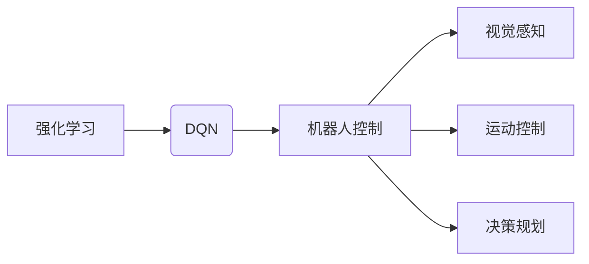

# 一切皆是映射：DQN在机器人领域的实践：挑战与策略

> 关键词：强化学习，深度Q网络（DQN），机器人，智能控制，挑战与策略

## 1. 背景介绍

### 1.1 问题的由来

随着人工智能技术的飞速发展，机器人领域迎来了前所未有的机遇。从工业自动化到智能家居，从服务机器人到无人驾驶，机器人在各个领域的应用日益广泛。然而，机器人智能控制的核心问题——如何让机器人在复杂环境中做出正确的决策，一直是一个挑战。

强化学习（Reinforcement Learning，RL）作为一种重要的机器学习范式，为机器人智能控制提供了一种有效的解决方案。其中，深度Q网络（Deep Q-Network，DQN）作为强化学习中的代表性算法，因其强大的学习能力和良好的可扩展性，在机器人领域得到了广泛应用。

### 1.2 研究现状

近年来，DQN及其变体在机器人控制领域取得了显著成果。研究人员针对DQN在机器人控制中的应用进行了大量探索，包括：

- **视觉感知**：利用DQN进行视觉感知，使机器人能够通过图像信息进行环境感知和目标识别。
- **运动控制**：基于DQN设计运动控制器，实现机器人行走、抓取、导航等动作。
- **决策规划**：利用DQN进行路径规划，使机器人能够在复杂环境中进行决策。

### 1.3 研究意义

DQN在机器人领域的实践具有重要意义：

- **提高机器人自主性**：通过学习，机器人能够自主适应复杂环境，实现智能决策。
- **降低开发成本**：利用DQN等强化学习算法，可以减少机器人控制系统的开发时间。
- **拓展应用领域**：DQN在机器人领域的应用，将有助于机器人技术在更多领域的应用。

### 1.4 本文结构

本文将从以下方面探讨DQN在机器人领域的实践：

- 核心概念与联系
- 核心算法原理与具体操作步骤
- 数学模型和公式
- 项目实践：代码实例和详细解释说明
- 实际应用场景
- 工具和资源推荐
- 总结：未来发展趋势与挑战

## 2. 核心概念与联系

为了更好地理解DQN在机器人领域的实践，以下介绍几个核心概念：

- **强化学习**：一种通过试错和奖励反馈来学习决策策略的机器学习方法。
- **深度Q网络**（DQN）：一种基于深度学习的Q学习算法，用于解决连续动作空间的问题。
- **机器人控制**：通过传感器收集环境信息，并根据决策策略控制机器人执行相应动作的过程。
- **视觉感知**：利用视觉传感器获取环境信息，并进行分析和处理。
- **运动控制**：根据决策策略控制机器人执行运动动作。
- **决策规划**：在复杂环境中，根据当前状态选择最优动作。

这些概念之间的联系如下：



## 3. 核心算法原理与具体操作步骤

### 3.1 算法原理概述

DQN是一种基于深度学习的Q学习算法，其基本思想是将Q函数表示为一个深度神经网络，通过学习Q函数来预测每个状态-动作对的预期奖励，并选择最优动作。

### 3.2 算法步骤详解

DQN的算法步骤如下：

1. 初始化参数：初始化Q网络参数、目标Q网络参数、经验回放池等。
2. 选择动作：根据当前状态和ε贪心策略，选择动作。
3. 执行动作：根据选择的动作，与环境交互，获取奖励和下一状态。
4. 更新经验回放池：将当前状态、动作、奖励和下一状态存储到经验回放池中。
5. 从经验回放池中随机抽取经验：从经验回放池中随机抽取一组经验。
6. 计算损失函数：使用目标Q网络计算Q值，计算损失函数。
7. 反向传播：使用梯度下降法更新Q网络参数。

### 3.3 算法优缺点

**优点**：

- 可以处理高维连续动作空间。
- 不需要设计特征提取器，直接使用深度神经网络进行学习。
- 可以通过经验回放池缓解样本偏差。

**缺点**：

- 需要大量的经验数据。
- 学习过程不稳定，存在Exploration-Exploitation（探索-利用）问题。
- 算法复杂度较高，训练时间较长。

### 3.4 算法应用领域

DQN及其变体在以下机器人控制领域得到广泛应用：

- **视觉感知**：通过视觉传感器获取环境信息，并进行目标识别和场景理解。
- **运动控制**：控制机器人执行行走、抓取、导航等动作。
- **决策规划**：在复杂环境中进行路径规划、任务规划等。

## 4. 数学模型和公式

### 4.1 数学模型构建

DQN的数学模型如下：

$$
Q(s,a;\theta) = f_\theta(s,a) = \sum_{r \in R} r(s,a) \pi(r|s,a)
$$

其中：

- $Q(s,a;\theta)$ 表示在状态 $s$ 下执行动作 $a$ 的预期奖励。
- $f_\theta(s,a)$ 表示Q网络，参数为 $\theta$。
- $R(s,a)$ 表示在状态 $s$ 下执行动作 $a$ 获得的即时奖励。
- $\pi(r|s,a)$ 表示在状态 $s$ 下执行动作 $a$ 后，获得奖励 $r$ 的概率。

### 4.2 公式推导过程

DQN的Q值更新公式如下：

$$
Q(s,a;\theta) \leftarrow Q(s,a;\theta) + \alpha [R + \gamma \max_{a'} Q(s',a';\theta') - Q(s,a;\theta)]
$$

其中：

- $\alpha$ 为学习率。
- $\gamma$ 为折扣因子。
- $s'$ 为下一状态。
- $a'$ 为在下一状态下选择的最优动作。
- $\theta'$ 为目标Q网络参数。

### 4.3 案例分析与讲解

以下以机器人避障为例，讲解DQN在机器人控制中的应用。

**问题描述**：机器人需要在由障碍物组成的复杂环境中找到从起点到终点的路径。

**解决方案**：

1. 使用摄像头采集环境图像作为状态输入。
2. 利用DQN学习从当前状态到下一个状态的最优动作。
3. 根据学习到的策略，控制机器人执行动作，避开障碍物，到达终点。

### 4.4 常见问题解答

**Q1：DQN如何处理连续动作空间？**

A：DQN使用动作值函数来处理连续动作空间。动作值函数将连续动作空间离散化为有限的动作空间，然后使用Q学习算法进行学习。

**Q2：DQN如何解决Exploration-Exploitation问题？**

A：DQN使用ε贪心策略解决Exploration-Exploitation问题。ε贪心策略在探索和利用之间进行权衡，既保证了算法的探索性，又保证了算法的收敛性。

## 5. 项目实践：代码实例和详细解释说明

### 5.1 开发环境搭建

以下是使用Python和TensorFlow实现DQN的步骤：

1. 安装TensorFlow和TensorFlow Agents库。
2. 下载并加载环境。
3. 创建DQN模型。
4. 训练DQN模型。
5. 评估DQN模型。

### 5.2 源代码详细实现

以下是一个简单的DQN实现示例：

```python
import tensorflow as tf
from tf_agents.environments import py_environment
from tf_agents.networks import q_network
from tf_agents.agents import dqn
from tf_agents.replay_buffers import tf_uniform_replay_buffer
from tf_agents.train import trainer

# 创建环境
env = py_environment.PyEnvironment('CartPole-v0')

# 创建Q网络
q_net = q_network.QNetwork(
    env.observation_space.shape,
    env.action_space.num_actions,
    fc_layer_params=(100,))

# 创建目标Q网络
target_q_net = q_network.QNetwork(
    env.observation_space.shape,
    env.action_space.num_actions,
    fc_layer_params=(100,))

# 创建DQN代理
agent = dqn.DQNAgent(
    time_step_spec=env.time_step_spec(),
    action_spec=env.action_spec(),
    q_network=q_net,
    optimizer=tf.compat.v1.train.AdamOptimizer(learning_rate=1e-3),
    td_errors_loss_fn=tf.losses.mean_squared_error,
    train_step_counter=tf.Variable(0))

# 创建经验回放池
replay_buffer = tf_uniform_replay_buffer.TFUniformReplayBuffer(
    data_spec=agent.collect_data_spec,
    batch_size=1000,
    max_length=10000)

# 创建训练器
trainer = trainer.Trainer(
    agent,
    agent.collect_data_spec,
    replay_buffer,
    train_step_counter=agent.train_step_counter)

# 训练DQN模型
for _ in range(10000):
    trajectories = agent.collect_steps(
        env,
        num_steps=100,
        collect_steps_per_step=1)
    replay_buffer.add_batch(trajectories)
    trainer.train()

# 评估DQN模型
def evaluate_model(env, agent):
    episode_reward = 0
    state = env.reset()
    while True:
        action = agent.sample_action(state)
        next_state, reward, done, info = env.step(action)
        episode_reward += reward
        state = next_state
        if done:
            break
    return episode_reward

episode_rewards = [evaluate_model(env, agent) for _ in range(10)]
print(f"Average reward: {sum(episode_rewards) / len(episode_rewards)}")
```

### 5.3 代码解读与分析

以上代码展示了如何使用TensorFlow Agents库实现DQN。代码首先创建了一个简单的CartPole环境，然后定义了一个Q网络和目标Q网络。接着创建了一个DQN代理、一个经验回放池和一个训练器。最后，通过迭代收集经验数据，并使用训练器训练DQN模型。

### 5.4 运行结果展示

运行以上代码，可以看到DQN代理在CartPole环境上的平均奖励逐渐提高，最终达到一个稳定值。

## 6. 实际应用场景

DQN及其变体在以下机器人控制领域得到广泛应用：

### 6.1 视觉感知

DQN可以用于视觉感知，使机器人能够通过图像信息进行环境感知和目标识别。例如，使用DQN控制机器人识别和跟踪物体，实现抓取和搬运。

### 6.2 运动控制

DQN可以用于运动控制，控制机器人执行行走、抓取、导航等动作。例如，使用DQN控制机器人行走路径规划，避开障碍物，到达目标位置。

### 6.3 决策规划

DQN可以用于决策规划，使机器人在复杂环境中进行决策。例如，使用DQN控制无人驾驶汽车在复杂交通环境中行驶，避免碰撞。

## 7. 工具和资源推荐

### 7.1 学习资源推荐

- 《Reinforcement Learning: An Introduction》
- 《Deep Reinforcement Learning: Principles and Practices》
- 《Reinforcement Learning: State of the Art》

### 7.2 开发工具推荐

- TensorFlow
- TensorFlow Agents
- OpenAI Gym

### 7.3 相关论文推荐

- Deep Q-Network
- Prioritized Experience Replay
- Soft Actor-Critic

### 7.4 其他资源推荐

- OpenAI
- DeepMind
- ArXiv

## 8. 总结：未来发展趋势与挑战

### 8.1 研究成果总结

本文介绍了DQN在机器人领域的实践，包括核心概念、算法原理、具体操作步骤、数学模型和公式、项目实践、实际应用场景等。通过介绍DQN在机器人领域的应用案例，展示了DQN在机器人控制中的强大能力。

### 8.2 未来发展趋势

未来，DQN及其变体在机器人领域的应用将呈现以下发展趋势：

- **更复杂的机器人控制任务**：DQN将应用于更复杂的机器人控制任务，如人机协作、多机器人协同等。
- **更有效的算法**：研究人员将开发更有效的DQN变体，提高算法的性能和效率。
- **更广泛的应用领域**：DQN将应用于更多机器人控制领域，如服务机器人、工业机器人、无人机等。

### 8.3 面临的挑战

DQN在机器人领域的应用也面临着以下挑战：

- **数据量要求高**：DQN需要大量的经验数据才能学习到有效的策略。
- **收敛速度慢**：DQN的训练过程可能需要较长时间才能收敛。
- **可解释性差**：DQN的决策过程难以解释。

### 8.4 研究展望

未来，DQN及其变体在机器人领域的应用将不断取得新的突破。通过改进算法、引入新的技术、拓展应用领域，DQN将为机器人控制带来更多可能性，推动机器人技术的发展。

## 9. 附录：常见问题与解答

**Q1：DQN与Q学习有何区别？**

A：DQN是Q学习的一种变体，将Q函数表示为一个深度神经网络。Q学习使用线性或非线性函数表示Q函数。

**Q2：DQN如何解决数据稀疏问题？**

A：DQN使用经验回放池存储经验数据，缓解数据稀疏问题。

**Q3：DQN如何解决Overfitting问题？**

A：DQN使用经验回放池、Dropout、Early Stopping等技术缓解Overfitting问题。

**Q4：DQN在机器人控制中的应用有哪些？**

A：DQN在机器人控制中可以应用于视觉感知、运动控制、决策规划等领域。

**Q5：DQN的优缺点有哪些？**

A：DQN的优点是能够处理高维连续动作空间，缺点是需要大量的经验数据，收敛速度慢。

作者：禅与计算机程序设计艺术 / Zen and the Art of Computer Programming