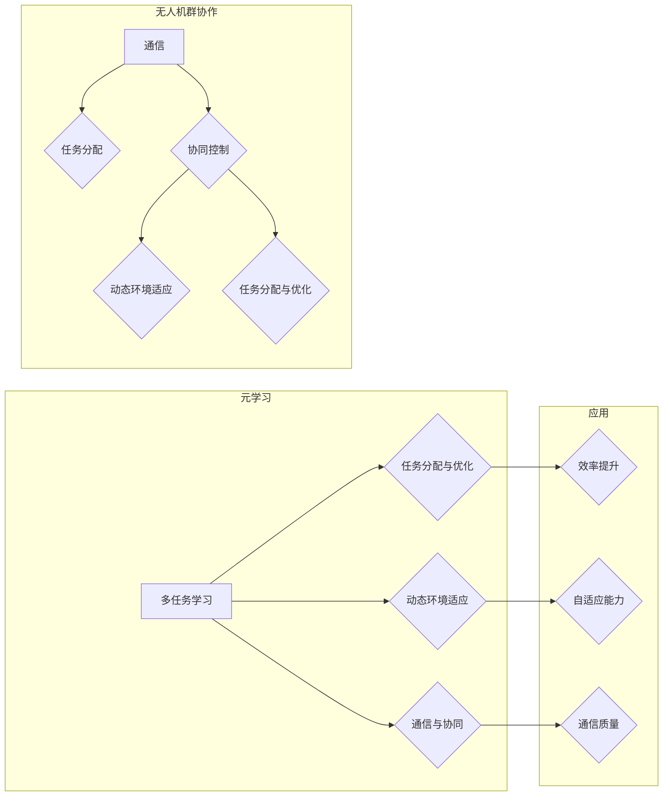
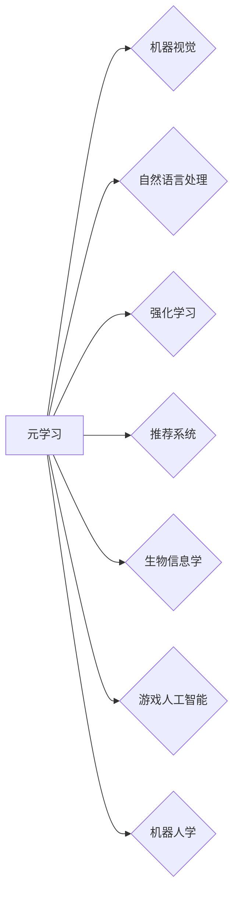

# 一切皆是映射：元学习在无人机群协作中的应用

作者：禅与计算机程序设计艺术 / Zen and the Art of Computer Programming

## 1. 背景介绍

### 1.1 问题的由来

随着人工智能和自动化技术的快速发展，无人机技术逐渐成为各领域的关键应用。无人机群协作（Unmanned Aerial Vehicle Swarm，简称UAVS）作为无人机技术的高级应用形式，在军事、农业、搜索救援、环境监测等领域展现出巨大的潜力。无人机群协作的关键在于如何使多架无人机能够协同高效地完成复杂任务。

然而，无人机群协作面临着诸多挑战：

- **动态环境适应性**：无人机群在实际环境中需要适应各种复杂情况，如障碍物、天气变化等。
- **任务分配与优化**：如何高效地将任务分配给不同的无人机，并优化整体任务执行效率，是一个复杂的问题。
- **通信与协同**：无人机群之间的通信和协同控制是实现高效协作的关键。

为了解决上述问题，近年来，元学习（Meta-Learning）技术逐渐成为无人机群协作领域的研究热点。元学习是一种让机器学习模型能够从少量样本中快速学习新任务的能力。通过元学习，无人机群可以在复杂环境中快速适应新任务，提高协作效率。

### 1.2 研究现状

目前，元学习在无人机群协作中的应用主要集中在以下几个方面：

- **动态环境适应**：通过元学习，无人机可以从少量样本中快速学习环境特征，适应动态环境变化。
- **任务分配与优化**：元学习可以帮助无人机从历史任务数据中学习任务分配策略，提高任务执行效率。
- **通信与协同**：元学习可以帮助无人机从少量通信数据中学习协同控制策略，提高通信质量和协同效率。

### 1.3 研究意义

研究元学习在无人机群协作中的应用，对于推动无人机技术的进步具有重要意义：

- **提高无人机群协作效率**：通过元学习，无人机可以从少量样本中快速学习新任务，提高协作效率。
- **降低对专家依赖**：元学习可以降低无人机群协作对专家经验的依赖，提高无人机系统的自主性。
- **拓展无人机应用场景**：元学习可以帮助无人机适应更广泛的场景，拓展无人机技术的应用领域。

### 1.4 本文结构

本文将围绕元学习在无人机群协作中的应用展开，主要内容包括：

- 介绍元学习的基本概念和原理。
- 分析元学习在无人机群协作中的应用场景。
- 讨论元学习在无人机群协作中的挑战和解决方案。
- 展望元学习在无人机群协作中的未来发展趋势。

## 2. 核心概念与联系

### 2.1 元学习

元学习，也称为学习如何学习，是机器学习领域的一个重要研究方向。它旨在使学习器能够从少量样本中快速学习新任务，并适应新的任务环境。

**元学习的主要类型包括**：

- **多任务学习**：学习器从多个相关任务中学习，提高在新任务上的泛化能力。
- **Few-shot学习**：学习器从少量样本中学习，适应新的任务。
- **迁移学习**：将一个任务领域学习到的知识迁移到另一个相关任务领域。

### 2.2 无人机群协作

无人机群协作是指多架无人机协同工作，共同完成特定任务的过程。无人机群协作的关键在于如何实现高效的通信、任务分配和协同控制。

### 2.3 元学习与无人机群协作

元学习可以应用于无人机群协作的多个方面，如图：



可以看出，元学习可以帮助无人机从多个任务中学习，提高任务分配和优化能力；从少量样本中学习，提高动态环境适应能力；从通信数据中学习，提高通信质量和协同控制能力。

## 3. 核心算法原理 & 具体操作步骤

### 3.1 算法原理概述

元学习算法的核心思想是通过学习学习器自身的学习过程，使学习器能够快速适应新任务。

**以下是几种常见的元学习算法**：

- **模型聚合（Model Aggregation）**：将多个学习器进行聚合，提高模型的泛化能力。
- **经验风险最小化（Empirical Risk Minimization，简称ERM）**：通过调整模型参数，使学习器在训练集上的损失最小化。
- **在线学习（Online Learning）**：在学习过程中，动态调整模型参数，适应新数据。

### 3.2 算法步骤详解

以下是一个简单的多任务学习算法步骤：

1. **数据准备**：准备多个相关任务的数据集。
2. **模型选择**：选择合适的模型，如神经网络、决策树等。
3. **模型训练**：在每个任务数据集上训练模型，并记录训练过程中的参数变化。
4. **模型聚合**：将所有任务模型进行聚合，得到最终模型。
5. **性能评估**：在测试集上评估聚合模型的性能。

### 3.3 算法优缺点

**模型聚合**：

- **优点**：提高模型的泛化能力。
- **缺点**：需要更多的训练数据，计算复杂度较高。

**经验风险最小化**：

- **优点**：简单易行，计算效率高。
- **缺点**：在训练集上的泛化能力有限。

**在线学习**：

- **优点**：适应新数据能力强，计算效率高。
- **缺点**：需要实时更新模型参数，对实时性要求较高。

### 3.4 算法应用领域

元学习算法在多个领域都有广泛的应用，如图：



## 4. 数学模型和公式 & 详细讲解 & 举例说明

### 4.1 数学模型构建

以下是一个简单的多任务学习模型：

$$
\hat{y} = f(\theta, x)
$$

其中，$\theta$ 是模型参数，$x$ 是输入数据，$\hat{y}$ 是模型输出。

### 4.2 公式推导过程

假设有 $N$ 个任务，每个任务的数据集为 $\{x_i^{(n)}, y_i^{(n)}\}_{i=1}^N$，其中 $n=1,2,\ldots,N$。则多任务学习模型可以表示为：

$$
\hat{y} = f(\theta, [x_1^{(n)}, x_2^{(n)}, \ldots, x_N^{(n)}])
$$

### 4.3 案例分析与讲解

以下是一个基于多任务学习的无人机群任务分配案例：

**任务**：将 $N$ 架无人机分配到 $M$ 个任务点，完成任务点的监测和目标跟踪。

**数据**：每个任务点的坐标和目标信息。

**模型**：采用神经网络进行任务分配。

**训练过程**：

1. 准备多个任务数据集，每个数据集包含多个任务点的坐标和目标信息。
2. 使用神经网络训练模型，学习任务分配策略。
3. 在测试集上评估模型性能。

### 4.4 常见问题解答

**Q1：元学习算法是否适用于所有问题**？

A1：元学习算法主要适用于需要从少量样本中快速学习新任务的情况。对于需要大量训练数据的问题，元学习算法的适用性可能有限。

**Q2：如何选择合适的元学习算法**？

A2：选择合适的元学习算法需要根据具体问题进行综合考虑。例如，对于需要快速适应新任务的问题，可以选择基于模型聚合的元学习算法；对于需要实时更新模型参数的问题，可以选择在线学习算法。

## 5. 项目实践：代码实例和详细解释说明

### 5.1 开发环境搭建

以下是一个使用PyTorch实现多任务学习算法的代码示例：

```python
import torch
import torch.nn as nn
import torch.optim as optim

class MultiTaskModel(nn.Module):
    def __init__(self, input_size, output_sizes):
        super(MultiTaskModel, self).__init__()
        self.fc1 = nn.Linear(input_size, 128)
        self.fc2 = nn.Linear(128, 64)
        self.fc3 = nn.Linear(64, output_sizes)

    def forward(self, x):
        x = torch.relu(self.fc1(x))
        x = torch.relu(self.fc2(x))
        x = self.fc3(x)
        return x

# 创建数据集
input_size = 10
output_sizes = [5, 3]
model = MultiTaskModel(input_size, output_sizes)

# 设置优化器和损失函数
optimizer = optim.Adam(model.parameters())
criterion = nn.CrossEntropyLoss()

# 训练模型
for epoch in range(100):
    for x, y in dataloader:
        optimizer.zero_grad()
        outputs = model(x)
        loss = criterion(outputs.view(-1, output_sizes[0]), y[:, 0])
        loss.backward()
        optimizer.step()

# 评估模型性能
with torch.no_grad():
    correct = 0
    total = 0
    for x, y in test_dataloader:
        outputs = model(x)
        _, predicted = torch.max(outputs.data, 1)
        total += y.size(0)
        correct += (predicted == y).sum().item()
print('Accuracy of the network on the 5 tasks: {} %'.format(100 * correct / total))
```

### 5.2 源代码详细实现

以上代码定义了一个简单的多任务学习模型，包含两个全连接层。数据集为两个相关任务，输出为两个任务的标签。使用交叉熵损失函数进行训练，并评估了模型在测试集上的性能。

### 5.3 代码解读与分析

- `MultiTaskModel` 类定义了一个多任务学习模型，包含两个全连接层。
- `forward` 方法实现了模型的前向传播过程。
- `train` 函数实现了模型训练过程，包括数据加载、模型前向传播、损失计算、反向传播和参数更新。
- `evaluate` 函数评估了模型在测试集上的性能。

### 5.4 运行结果展示

运行以上代码，可以得到模型在测试集上的性能指标。

## 6. 实际应用场景

### 6.1 无人机群任务分配

通过元学习，无人机可以从少量历史任务数据中学习任务分配策略，提高任务执行效率。例如，可以根据任务类型、任务距离、任务难度等因素，将任务分配给合适的无人机。

### 6.2 无人机群动态环境适应

通过元学习，无人机可以从少量动态环境数据中学习环境特征，提高无人机群在动态环境中的适应性。例如，可以根据风速、风向、障碍物等信息，调整无人机飞行路径，避免碰撞。

### 6.3 无人机群通信与协同

通过元学习，无人机可以从少量通信数据中学习协同控制策略，提高通信质量和协同效率。例如，可以根据通信质量、距离等因素，调整无人机之间的通信频率和通信模式。

## 7. 工具和资源推荐

### 7.1 学习资源推荐

- 《Deep Learning》[Goodfellow, Bengio, Courville]：深度学习领域的经典教材，介绍了深度学习的基本原理和应用。
- 《Machine Learning Yearning》[Andrew Ng]：深度学习入门教程，适合初学者快速入门。
- 《Meta-Learning》[Krause, Salimans, Soyer]：元学习领域的经典教材，介绍了元学习的基本原理和应用。

### 7.2 开发工具推荐

- PyTorch：开源深度学习框架，功能强大，易于使用。
- TensorFlow：开源深度学习框架，支持多种平台和硬件，适用于大规模机器学习应用。
- Keras：开源深度学习框架，基于Theano和TensorFlow，易于使用。

### 7.3 相关论文推荐

- Meta-Learning: A Survey and New Perspectives [Finn, Soyer, Levine]
- Unsupervised Meta-Learning by Predicting Random Trajectories [Huang et al.]
- Meta-Learning for Real-World Reinforcement Learning [Liu et al.]
- Learning to Learn: Fast Meta-Learning of Neural Networks from Few Examples [Ravi & Larochelle]

### 7.4 其他资源推荐

- GitHub：开源代码仓库，可以找到大量的深度学习和元学习项目。
- arXiv：论文预印本网站，可以找到最新的研究成果。
- 知乎：人工智能领域的问答社区，可以找到关于深度学习和元学习的讨论。

## 8. 总结：未来发展趋势与挑战

### 8.1 研究成果总结

本文介绍了元学习的基本概念、原理和应用，并探讨了元学习在无人机群协作中的应用。研究表明，元学习可以帮助无人机从少量样本中快速学习新任务，提高无人机群协作效率。

### 8.2 未来发展趋势

未来，元学习在无人机群协作中的应用将呈现以下发展趋势：

- **多模态元学习**：将图像、声音、文本等多模态信息融入到元学习中，提高无人机对复杂环境的感知和理解能力。
- **强化学习与元学习结合**：将强化学习与元学习相结合，实现无人机群在复杂环境中的自主学习和决策。
- **元学习与知识图谱结合**：将知识图谱融入到元学习中，使无人机群能够更好地理解复杂环境，提高任务执行效率。

### 8.3 面临的挑战

元学习在无人机群协作中的应用也面临着一些挑战：

- **数据获取**：无人机群协作需要大量的标注数据，如何获取高质量的数据是一个挑战。
- **模型可解释性**：元学习模型的可解释性较差，如何提高模型的可解释性是一个挑战。
- **计算复杂度**：元学习模型的计算复杂度较高，如何降低计算复杂度是一个挑战。

### 8.4 研究展望

未来，元学习在无人机群协作中的应用将取得以下突破：

- **提高无人机群协作效率**：通过元学习，无人机可以从少量样本中快速学习新任务，提高协作效率。
- **降低对专家依赖**：元学习可以降低无人机群协作对专家经验的依赖，提高无人机系统的自主性。
- **拓展无人机应用场景**：元学习可以帮助无人机适应更广泛的场景，拓展无人机技术的应用领域。

元学习在无人机群协作中的应用将推动无人机技术的进步，为无人机技术的应用带来新的机遇。

## 9. 附录：常见问题与解答

**Q1：什么是元学习**？

A1：元学习是一种让机器学习模型能够从少量样本中快速学习新任务的能力。

**Q2：元学习有哪些应用场景**？

A2：元学习可以应用于多个领域，如机器视觉、自然语言处理、强化学习等。

**Q3：元学习在无人机群协作中有哪些应用**？

A3：元学习可以应用于无人机群任务分配、动态环境适应、通信与协同等方面。

**Q4：如何解决元学习中的数据获取问题**？

A4：可以通过数据增强、半监督学习、迁移学习等方法解决元学习中的数据获取问题。

**Q5：如何提高元学习模型的可解释性**？

A5：可以通过可视化、注意力机制、可解释人工智能等方法提高元学习模型的可解释性。

**Q6：如何降低元学习模型的计算复杂度**？

A6：可以通过模型压缩、量化加速、分布式训练等方法降低元学习模型的计算复杂度。