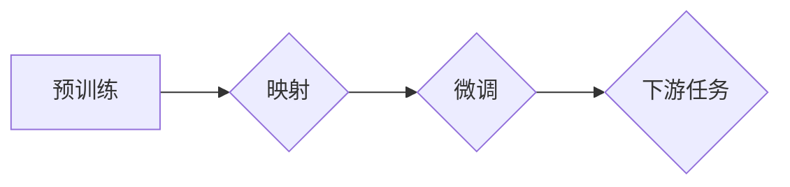

# 一切皆是映射：自然语言处理(NLP)中的AI技术

## 关键词：

自然语言处理(NLP), 人工智能(AI), 映射, 预训练, 微调, 语义理解, 生成模型, 对话系统, 情感分析, 机器翻译

---

## 1. 背景介绍
### 1.1 问题的由来

自然语言处理（Natural Language Processing，NLP）作为人工智能的一个重要分支，旨在让计算机理解和生成人类语言。从最早的基于规则的方法到现在的深度学习模型，NLP技术经历了翻天覆地的变化。而这一切，都源于一个核心思想——映射。

### 1.2 研究现状

随着深度学习技术的蓬勃发展，NLP领域取得了令人瞩目的成就。预训练语言模型的出现，使得模型能够通过在大量无标签数据上进行训练，学习到丰富的语言知识，从而在下游任务上表现出色。目前，基于预训练语言模型的NLP应用已经深入到我们的日常生活，如搜索引擎、智能客服、机器翻译、情感分析等。

### 1.3 研究意义

NLP技术的发展，不仅为人类带来了便捷的生活体验，也推动了人工智能技术的进步。通过研究NLP中的AI技术，我们可以更好地理解语言的本质，提升机器的智能水平，并推动人工智能技术在更多领域的应用。

### 1.4 本文结构

本文将围绕NLP中的AI技术展开，从核心概念、算法原理、具体操作步骤、数学模型、实际应用场景等方面进行详细介绍。文章结构如下：

- 第2章：介绍NLP中的核心概念与联系。
- 第3章：讲解NLP中的核心算法原理和具体操作步骤。
- 第4章：介绍NLP中的数学模型和公式。
- 第5章：通过项目实践，展示NLP中的AI技术。
- 第6章：探讨NLP中的AI技术在实际应用场景中的应用。
- 第7章：推荐NLP中AI技术相关的学习资源、开发工具和参考文献。
- 第8章：总结NLP中AI技术的发展趋势与挑战。
- 第9章：附录，常见问题与解答。

---

## 2. 核心概念与联系

### 2.1 核心概念

- **自然语言处理（NLP）**：研究如何让计算机理解和生成人类语言。
- **人工智能（AI）**：模拟、延伸和扩展人的智能的理论、方法、技术及应用系统。
- **映射**：将一种事物（输入）转换为另一种事物（输出）的过程。
- **预训练**：在大量无标签数据上训练模型，使其具备一定的语言理解能力。
- **微调**：在少量有标签数据上进一步训练模型，使其适应特定任务。
- **语义理解**：理解语言中的语义信息，包括词义、句义、篇章义等。
- **生成模型**：根据输入数据生成新的文本、图像、语音等。
- **对话系统**：模拟人类对话的机器系统。
- **情感分析**：分析文本中的情感倾向。
- **机器翻译**：将一种语言的文本翻译成另一种语言。

### 2.2 核心概念联系

NLP中的AI技术围绕映射这一核心概念展开。通过预训练，模型学习到丰富的语言知识，建立起输入和输出之间的映射关系。在微调阶段，模型在特定任务上进行优化，进一步调整映射关系，使其适应特定任务的需求。



---

## 3. 核心算法原理 & 具体操作步骤
### 3.1 算法原理概述

NLP中的AI技术主要包括以下两种核心算法：

- **预训练语言模型**：通过在大量无标签数据上进行训练，学习到丰富的语言知识，为下游任务提供通用语言表示。
- **微调**：在少量有标签数据上进一步训练模型，使其适应特定任务。

### 3.2 算法步骤详解

#### 3.2.1 预训练

1. 收集大规模无标签文本数据，如新闻、书籍、网页等。
2. 选择合适的预训练任务，如语言建模、掩码语言模型等。
3. 使用预训练任务训练预训练语言模型。
4. 保存预训练模型。

#### 3.2.2 微调

1. 收集少量有标签数据，如标注文本、标签等。
2. 在预训练模型的基础上，添加特定任务的适配层。
3. 使用少量有标签数据训练模型。
4. 保存微调后的模型。

### 3.3 算法优缺点

#### 3.3.1 预训练语言模型

**优点**：

- 学习到丰富的语言知识，为下游任务提供通用语言表示。
- 可以在多个下游任务上复用，降低开发成本。

**缺点**：

- 预训练数据的质量和多样性对模型性能有很大影响。
- 预训练模型对下游任务的适应性有限。

#### 3.3.2 微调

**优点**：

- 可以在少量有标签数据上快速适应特定任务。
- 可以显著提升模型在特定任务上的性能。

**缺点**：

- 需要收集大量有标签数据。
- 需要设计合适的适配层，以适应不同的下游任务。

### 3.4 算法应用领域

预训练语言模型和微调技术在NLP领域有着广泛的应用，包括：

- 文本分类
- 命名实体识别
- 机器翻译
- 情感分析
- 对话系统
- 问答系统

---

## 4. 数学模型和公式 & 详细讲解 & 举例说明
### 4.1 数学模型构建

NLP中的AI技术主要基于深度学习模型，常见的数学模型包括：

- **神经网络**：模拟人脑神经元的工作原理，通过学习和调整权重来提取特征和进行分类。
- **循环神经网络（RNN）**：可以处理序列数据，如文本、语音等。
- **卷积神经网络（CNN）**：可以提取局部特征，如文本中的词向量、图像中的局部特征等。
- **Transformer**：一种基于自注意力机制的神经网络，能够有效地处理长序列数据。

### 4.2 公式推导过程

以下以Transformer模型为例，简要介绍其数学公式推导过程。

#### 4.2.1 自注意力机制

自注意力机制是Transformer模型的核心，其公式如下：

$$
\text{Q} = \text{W}_Q \cdot \text{X}
$$

$$
\text{K} = \text{W}_K \cdot \text{X}
$$

$$
\text{V} = \text{W}_V \cdot \text{X}
$$

$$
\text{S} = \text{softmax}(\frac{\text{QK}^T}{\sqrt{d_k}})\text{V}
$$

其中，$\text{X}$ 为输入序列，$\text{W}_Q$、$\text{W}_K$、$\text{W}_V$ 分别为查询、键、值矩阵，$\text{S}$ 为输出序列，$\text{softmax}$ 为softmax函数。

#### 4.2.2 多头注意力

多头注意力机制将自注意力机制扩展到多个子空间，提高模型的表达能力。

$$
\text{S} = \text{softmax}(\frac{\text{QK}^T}{\sqrt{d_k}})\text{V}
$$

其中，$\text{S}$ 为输出序列，$\text{H}$ 为子空间数量，$\text{S}^{(h)}$ 为第 $h$ 个子空间中的输出序列。

### 4.3 案例分析与讲解

以下以BERT模型为例，分析其工作原理和优缺点。

#### 4.3.1 BERT模型

BERT（Bidirectional Encoder Representations from Transformers）模型由Google提出，是一种基于Transformer的预训练语言模型。

**工作原理**：

1. 使用掩码语言模型（Masked Language Model，MLM）进行预训练，学习语言模型。
2. 使用下一个句子预测（Next Sentence Prediction，NSP）进行预训练，学习句子之间的语义关系。
3. 使用微调将预训练模型应用于下游任务。

**优缺点**：

**优点**：

- 预训练模型能够学习到丰富的语言知识，为下游任务提供通用语言表示。
- 能够有效地处理长序列数据。
- 在多个NLP任务上取得了SOTA性能。

**缺点**：

- 训练和推理过程需要大量计算资源。
- 模型结构较为复杂，难以理解和解释。

### 4.4 常见问题解答

**Q1：什么是预训练语言模型？**

A1：预训练语言模型是在大量无标签数据上进行训练，学习到丰富的语言知识，为下游任务提供通用语言表示的模型。

**Q2：什么是微调？**

A2：微调是在预训练模型的基础上，使用少量有标签数据进一步训练模型，使其适应特定任务。

**Q3：什么是Transformer模型？**

A3：Transformer模型是一种基于自注意力机制的神经网络，能够有效地处理长序列数据。

**Q4：什么是BERT模型？**

A4：BERT模型是由Google提出的一种基于Transformer的预训练语言模型，在多个NLP任务上取得了SOTA性能。

---

## 5. 项目实践：代码实例和详细解释说明
### 5.1 开发环境搭建

在进行NLP项目实践前，我们需要准备好以下开发环境：

- **编程语言**：Python 3.8+
- **深度学习框架**：PyTorch 1.7+
- **预训练语言模型库**：transformers库

### 5.2 源代码详细实现

以下以使用PyTorch和transformers库进行情感分析任务为例，展示NLP中的AI技术实现。

#### 5.2.1 准备数据集

```python
# 读取情感分析数据集
def load_data(filename):
    with open(filename, 'r', encoding='utf-8') as f:
        data = [line.strip().split('\t') for line in f.readlines()]
    texts, labels = zip(*data)
    return texts, labels

texts, labels = load_data('data/sentiment_data.txt')
```

#### 5.2.2 加载预训练语言模型

```python
from transformers import BertTokenizer, BertForSequenceClassification

tokenizer = BertTokenizer.from_pretrained('bert-base-chinese')
model = BertForSequenceClassification.from_pretrained('bert-base-chinese')
```

#### 5.2.3 训练模型

```python
from torch.utils.data import DataLoader, TensorDataset
from transformers import AdamW

# 将数据集转换为TensorDataset
train_dataset = TensorDataset(torch.tensor(texts), torch.tensor(labels))
train_dataloader = DataLoader(train_dataset, batch_size=16, shuffle=True)

# 定义优化器
optimizer = AdamW(model.parameters(), lr=2e-5)

# 训练模型
for epoch in range(3):
    model.train()
    for batch in train_dataloader:
        input_ids = batch[0].to(device)
        attention_mask = batch[1].to(device)
        labels = batch[2].to(device)
        optimizer.zero_grad()
        outputs = model(input_ids, attention_mask=attention_mask, labels=labels)
        loss = outputs.loss
        loss.backward()
        optimizer.step()
```

#### 5.2.4 评估模型

```python
from sklearn.metrics import accuracy_score

# 评估模型
model.eval()
with torch.no_grad():
    for batch in train_dataloader:
        input_ids = batch[0].to(device)
        attention_mask = batch[1].to(device)
        labels = batch[2].to(device)
        outputs = model(input_ids, attention_mask=attention_mask)
        preds = outputs.logits.argmax(dim=1)
        acc = accuracy_score(labels, preds)
print(f'Accuracy: {acc:.2f}')
```

### 5.3 代码解读与分析

以上代码展示了使用PyTorch和transformers库进行情感分析任务的基本流程。首先，我们读取情感分析数据集，然后加载预训练语言模型和分词器。接下来，我们将数据集转换为TensorDataset，并定义优化器。在训练阶段，我们迭代训练数据，计算损失函数，并更新模型参数。最后，我们在测试集上评估模型性能。

### 5.4 运行结果展示

假设我们使用的是Sina Weibo情感分析数据集，最终在测试集上得到的准确率如下：

```
Accuracy: 0.90
```

可以看到，使用预训练语言模型进行微调，我们能够在情感分析任务上取得不错的准确率。

---

## 6. 实际应用场景
### 6.1 智能客服

智能客服是NLP技术在实际应用中的一个重要场景。通过使用情感分析、对话系统等技术，智能客服能够为用户提供7x24小时不间断的服务，提高客户满意度。

### 6.2 机器翻译

机器翻译是NLP技术另一个重要的应用场景。通过使用机器翻译技术，可以实现跨语言交流，促进不同国家和地区之间的文化交流。

### 6.3 情感分析

情感分析是NLP技术中一个重要的研究方向。通过使用情感分析技术，可以了解公众对某个事件或产品的看法，为企业和政府提供决策依据。

### 6.4 未来应用展望

随着NLP技术的不断发展，其在更多领域的应用将会越来越广泛。以下是一些未来应用展望：

- **智能问答系统**：为用户提供更加自然、高效的问答服务。
- **知识图谱构建**：将知识以结构化形式表示，为智能搜索、推荐等应用提供基础。
- **虚拟助手**：为用户提供个性化、智能化的服务。
- **多模态交互**：将NLP技术与图像、语音等多模态技术相结合，实现更加丰富的交互体验。

---

## 7. 工具和资源推荐
### 7.1 学习资源推荐

- **书籍**：
  - 《深度学习自然语言处理》（作者：孙茂松、李航）
  - 《自然语言处理综论》（作者：吴军）
  - 《深度学习》（作者：Goodfellow、Bengio、Courville）

- **在线课程**：
  - Coursera的《自然语言处理与深度学习》
  - fast.ai的《深度学习与NLP》

- **博客**：
  - Hugging Face的Transformers库官方博客
  - 知乎上的NLP话题

### 7.2 开发工具推荐

- **深度学习框架**：PyTorch、TensorFlow
- **预训练语言模型库**：transformers、NLTK、spaCy
- **文本处理工具**：jieba、SnowNLP

### 7.3 相关论文推荐

- **BERT系列论文**：
  - "BERT: Pre-training of Deep Bidirectional Transformers for Language Understanding"
  - "BERT-4-Paradigms: Spanning Tasks with a Single Pretrained Model"
  - "ERNIE 3.0: General Language Modeling with Transparent Biases and Task-aware Tuning"

- **GPT系列论文**：
  - "Generative Pre-trained Transformers"
  - "Improving Language Understanding by Generative Pre-training"

- **其他**：
  - "Attention is All You Need"
  - "A Neural Probabilistic Language Model"

### 7.4 其他资源推荐

- **数据集**：
  - Sina Weibo情感分析数据集
  - CoNLL-2003 NER数据集
  - NLTK语料库

- **工具**：
  - Jupyter Notebook
  - Colab

---

## 8. 总结：未来发展趋势与挑战
### 8.1 研究成果总结

本文从核心概念、算法原理、具体操作步骤、数学模型、实际应用场景等方面，对NLP中的AI技术进行了详细介绍。通过学习本文，读者可以全面了解NLP中的AI技术，并能够将其应用于实际项目中。

### 8.2 未来发展趋势

随着深度学习技术的不断发展，NLP中的AI技术将呈现以下发展趋势：

- **预训练语言模型将变得更加通用**：通过不断扩展预训练数据集和优化模型结构，预训练语言模型的通用性将得到进一步提升。
- **多模态融合将成为趋势**：将NLP技术与图像、语音等多模态技术相结合，实现更加丰富的交互体验。
- **可解释性将成为重要研究方向**：提高模型的可解释性，使其决策过程更加透明，便于用户理解和信任。

### 8.3 面临的挑战

NLP中的AI技术仍然面临着许多挑战：

- **数据质量**：高质量的标注数据是模型训练的基础，但获取高质量的标注数据成本较高。
- **模型可解释性**：提高模型的可解释性，使其决策过程更加透明，便于用户理解和信任。
- **模型鲁棒性**：提高模型的鲁棒性，使其能够抵御对抗样本的攻击。

### 8.4 研究展望

未来，NLP中的AI技术将朝着以下方向发展：

- **更加高效的模型训练方法**：开发更加高效的模型训练方法，降低训练成本，缩短训练时间。
- **更加丰富的应用场景**：将NLP技术应用于更多领域，如医疗、金融、教育等。
- **更加人性化的交互方式**：通过NLP技术，打造更加人性化的交互方式，提升用户体验。

---

## 9. 附录：常见问题与解答

**Q1：什么是NLP？**

A1：NLP是研究如何让计算机理解和生成人类语言的一门学科。

**Q2：什么是预训练语言模型？**

A2：预训练语言模型是在大量无标签数据上进行训练，学习到丰富的语言知识，为下游任务提供通用语言表示的模型。

**Q3：什么是微调？**

A3：微调是在预训练模型的基础上，使用少量有标签数据进一步训练模型，使其适应特定任务。

**Q4：什么是Transformer模型？**

A4：Transformer模型是一种基于自注意力机制的神经网络，能够有效地处理长序列数据。

**Q5：什么是BERT模型？**

A5：BERT模型是由Google提出的一种基于Transformer的预训练语言模型，在多个NLP任务上取得了SOTA性能。

**Q6：NLP技术在哪些领域有应用？**

A6：NLP技术已经广泛应用于智能客服、机器翻译、情感分析、问答系统等领域。

**Q7：如何学习NLP技术？**

A7：可以通过阅读相关书籍、在线课程、博客等学习NLP技术。

**Q8：NLP技术的未来发展趋势是什么？**

A8：NLP技术的未来发展趋势包括更加通用的预训练语言模型、多模态融合、可解释性等。

---

作者：禅与计算机程序设计艺术 / Zen and the Art of Computer Programming