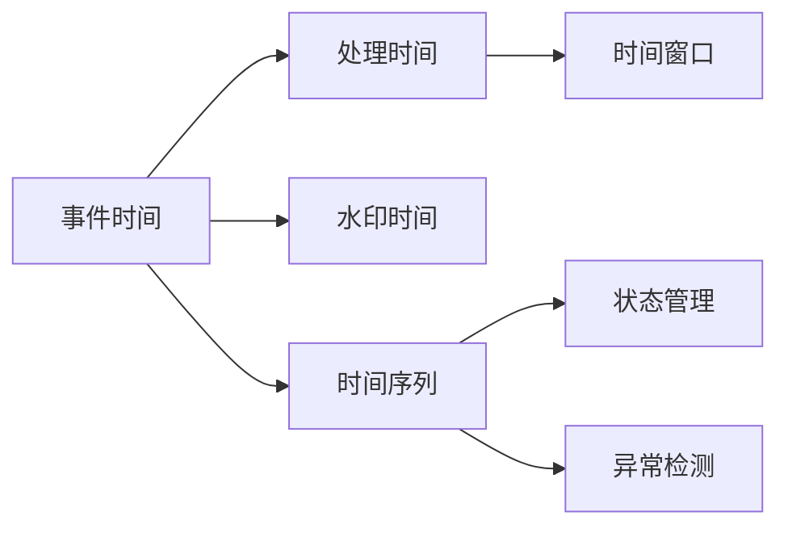

# 事件时间 原理与代码实例讲解

作者：禅与计算机程序设计艺术 / Zen and the Art of Computer Programming 

## 1. 背景介绍
### 1.1 问题的由来

在计算机系统中，事件时间（Event Time）是处理时间序列数据、实时流处理等场景下不可或缺的概念。与处理批处理数据相比，事件时间更关注数据的产生时间，而不是处理时间。这种时间特性使得事件时间在时间窗口计算、状态管理、异常检测等领域具有独特的优势。

随着大数据、物联网、实时计算等技术的发展，对事件时间的需求日益增长。然而，事件时间的处理并非易事。如何高效、准确地处理事件时间数据，成为了当前IT领域的一个重要课题。

### 1.2 研究现状

事件时间处理的研究主要集中在以下几个方面：

- **事件时间窗口**：如何根据事件时间划分窗口，进行窗口内的数据聚合和分析。
- **事件时间序列**：如何处理事件时间序列数据，实现事件时间序列的过滤、聚合、窗口等操作。
- **事件时间状态管理**：如何实现基于事件时间的状态管理，保证状态的一致性和准确性。
- **事件时间异常检测**：如何利用事件时间进行异常检测，及时发现和处理异常事件。

目前，已有一些开源框架和库支持事件时间处理，如 Apache Flink、Apache Storm、Spark Streaming 等。这些框架和库在事件时间窗口、事件时间序列、事件时间状态管理等方面提供了丰富的API和工具。

### 1.3 研究意义

研究事件时间处理对于以下方面具有重要意义：

- **提高数据处理效率**：事件时间处理能够更好地利用数据，提高数据处理效率。
- **增强数据安全性**：基于事件时间的状态管理能够保证状态的一致性和准确性，提高数据安全性。
- **提升系统可用性**：事件时间异常检测能够及时发现和处理异常事件，提高系统可用性。
- **推动相关技术发展**：事件时间处理的研究将推动时间序列分析、实时计算等相关技术的发展。

### 1.4 本文结构

本文将围绕事件时间处理展开，主要内容包括：

- 介绍事件时间处理的核心概念和联系。
- 讲解事件时间处理的核心算法原理和具体操作步骤。
- 分析事件时间处理的数学模型和公式，并结合实例进行讲解。
- 通过代码实例和详细解释说明，展示事件时间处理在项目中的实践应用。
- 探讨事件时间处理在实际应用场景中的应用，并展望其未来发展趋势与挑战。
- 推荐事件时间处理相关的学习资源、开发工具和参考文献。
- 总结全文，展望事件时间处理技术的未来发展趋势与挑战。

## 2. 核心概念与联系

为更好地理解事件时间处理，本节将介绍几个核心概念及其相互关系：

- **事件时间**：指事件发生的实际时间，通常以时间戳的形式表示。
- **处理时间**：指事件从产生到被系统处理的时刻。
- **水印时间**：指事件到达系统的时间，通常也是事件时间的一种。
- **时间窗口**：指事件时间连续的一段区间，用于划分事件。
- **时间序列**：指一系列按时间顺序排列的事件数据。
- **状态管理**：指对事件时间序列进行跟踪和管理的机制。
- **异常检测**：指检测事件时间序列中异常事件的机制。

它们之间的逻辑关系如下：



## 3. 核心算法原理 & 具体操作步骤
### 3.1 算法原理概述

事件时间处理的核心算法主要包括以下几种：

- **时间窗口划分**：根据事件时间划分窗口，实现窗口内的数据聚合和分析。
- **事件时间序列处理**：对事件时间序列进行过滤、聚合、窗口等操作。
- **事件时间状态管理**：实现基于事件时间的状态管理，保证状态的一致性和准确性。
- **事件时间异常检测**：利用事件时间进行异常检测，及时发现和处理异常事件。

### 3.2 算法步骤详解

#### 3.2.1 时间窗口划分

时间窗口划分的步骤如下：

1. 确定窗口类型：如固定窗口、滑动窗口、会话窗口等。
2. 确定窗口大小：根据业务需求设定窗口的时长或事件数量。
3. 根据事件时间划分窗口：将事件按时间顺序划分到对应的窗口中。

#### 3.2.2 事件时间序列处理

事件时间序列处理的步骤如下：

1. 事件输入：从数据源读取事件时间序列数据。
2. 过滤：对事件进行过滤，去除不符合条件的事件。
3. 聚合：对窗口内的数据进行聚合，如求和、平均值、最大值等。
4. 窗口操作：根据业务需求进行窗口操作，如窗口滚动、窗口合并等。
5. 输出：将处理后的结果输出到目标系统。

#### 3.2.3 事件时间状态管理

事件时间状态管理的步骤如下：

1. 初始化状态：根据业务需求初始化状态。
2. 处理事件：对事件进行分类，并根据事件类型更新状态。
3. 状态查询：根据业务需求查询状态信息。

#### 3.2.4 事件时间异常检测

事件时间异常检测的步骤如下：

1. 事件输入：从数据源读取事件时间序列数据。
2. 构建时间序列模型：根据业务需求构建时间序列模型。
3. 预测：根据时间序列模型预测未来事件。
4. 检测异常：对比预测值和实际值，检测异常事件。

### 3.3 算法优缺点

#### 3.3.1 时间窗口划分

优点：

- 简单易懂，易于实现。
- 能够灵活地处理不同类型的数据。

缺点：

- 对于实时性要求高的场景，窗口划分可能会引入延迟。
- 窗口划分策略的选择可能会影响处理结果。

#### 3.3.2 事件时间序列处理

优点：

- 能够处理大规模事件时间序列数据。
- 能够灵活地实现各种数据处理需求。

缺点：

- 对于实时性要求高的场景，处理过程可能会引入延迟。
- 需要针对不同类型的数据进行优化。

#### 3.3.3 事件时间状态管理

优点：

- 能够保证状态的一致性和准确性。
- 能够快速查询状态信息。

缺点：

- 需要存储和管理状态信息，可能会增加系统复杂度。
- 状态管理策略的选择可能会影响处理结果。

#### 3.3.4 事件时间异常检测

优点：

- 能够及时发现和处理异常事件。
- 能够提高系统可用性。

缺点：

- 需要构建时间序列模型，可能会增加系统复杂度。
- 模型性能可能会受到数据质量的影响。

### 3.4 算法应用领域

事件时间处理算法在以下领域有广泛应用：

- **时间序列分析**：用于分析时间序列数据，如股市行情、温度变化等。
- **实时计算**：用于实时处理和分析数据，如在线广告、推荐系统等。
- **异常检测**：用于检测异常事件，如欺诈检测、故障检测等。
- **状态管理**：用于管理状态信息，如在线游戏、物联网等。

## 4. 数学模型和公式 & 详细讲解 & 举例说明
### 4.1 数学模型构建

事件时间处理的数学模型主要包括以下几种：

- **时间窗口划分**：根据事件时间划分窗口，实现窗口内的数据聚合和分析。
- **事件时间序列处理**：对事件时间序列进行过滤、聚合、窗口等操作。
- **事件时间状态管理**：实现基于事件时间的状态管理，保证状态的一致性和准确性。
- **事件时间异常检测**：利用事件时间进行异常检测，及时发现和处理异常事件。

### 4.2 公式推导过程

#### 4.2.1 时间窗口划分

假设事件时间序列为 $T = (t_1, t_2, t_3, \ldots, t_n)$，窗口大小为 $w$，则时间窗口划分的公式如下：

$$
W_1 = (t_1, t_2, \ldots, t_k), \quad W_2 = (t_{k+1}, t_{k+2}, \ldots, t_{2k}), \quad \ldots
$$

其中 $k = \lfloor \frac{w}{2} \rfloor$。

#### 4.2.2 事件时间序列处理

假设事件时间序列为 $T = (t_1, t_2, t_3, \ldots, t_n)$，窗口大小为 $w$，则窗口内数据聚合的公式如下：

$$
\text{聚合函数}(T) = \sum_{t_i \in T} f(t_i)
$$

其中 $f(t_i)$ 为对事件 $t_i$ 进行聚合操作的函数，如求和、平均值等。

#### 4.2.3 事件时间状态管理

假设事件时间序列为 $T = (t_1, t_2, t_3, \ldots, t_n)$，状态变量为 $S$，则事件时间状态管理的公式如下：

$$
S_{t_i} = S_{t_{i-1}} + f(t_i)
$$

其中 $f(t_i)$ 为对事件 $t_i$ 进行状态更新的函数。

#### 4.2.4 事件时间异常检测

假设事件时间序列为 $T = (t_1, t_2, t_3, \ldots, t_n)$，时间序列模型为 $M$，则事件时间异常检测的公式如下：

$$
\text{异常检测} = \text{if } |M(t_i) - t_i| > \text{阈值} \text{ then } \text{异常} \text{ else } \text{正常}
$$

其中 $M(t_i)$ 为时间序列模型在时间点 $t_i$ 的预测值，阈值用于判断异常事件。

### 4.3 案例分析与讲解

假设有一个电商平台的用户行为数据，包括用户ID、行为类型、行为时间戳等。我们需要根据用户行为时间戳进行时间窗口划分，并统计每个窗口内用户购买商品的数量。

首先，定义时间窗口划分的函数：

```python
def time_window_divide(data, window_size):
    windowed_data = []
    for i in range(0, len(data), window_size):
        windowed_data.append(data[i:i + window_size])
    return windowed_data
```

然后，将用户行为数据按照时间窗口划分，并统计每个窗口内用户购买商品的数量：

```python
data = [
    {'user_id': 'u1', 'behavior': 'purchase', 'timestamp': '2021-01-01 10:00:00'},
    {'user_id': 'u2', 'behavior': 'browse', 'timestamp': '2021-01-01 10:05:00'},
    {'user_id': 'u1', 'behavior': 'purchase', 'timestamp': '2021-01-01 10:10:00'},
    {'user_id': 'u3', 'behavior': 'browse', 'timestamp': '2021-01-01 10:15:00'},
    {'user_id': 'u1', 'behavior': 'purchase', 'timestamp': '2021-01-01 10:20:00'},
    {'user_id': 'u2', 'behavior': 'browse', 'timestamp': '2021-01-01 10:25:00'},
    {'user_id': 'u3', 'behavior': 'purchase', 'timestamp': '2021-01-01 10:30:00'},
    {'user_id': 'u1', 'behavior': 'browse', 'timestamp': '2021-01-01 10:35:00'},
    {'user_id': 'u2', 'behavior': 'purchase', 'timestamp': '2021-01-01 10:40:00'},
    {'user_id': 'u3', 'behavior': 'browse', 'timestamp': '2021-01-01 10:45:00'},
    {'user_id': 'u1', 'behavior': 'purchase', 'timestamp': '2021-01-01 10:50:00'},
    {'user_id': 'u2', 'behavior': 'browse', 'timestamp': '2021-01-01 10:55:00'},
    {'user_id': 'u3', 'behavior': 'purchase', 'timestamp': '2021-01-01 11:00:00'},
]

window_size = 5  # 窗口大小为5分钟
windowed_data = time_window_divide(data, window_size)

for window in windowed_data:
    print(f"窗口起始时间: {window[0]['timestamp']}, 购买商品数量: {len([item for item in window if item['behavior'] == 'purchase'])}")
```

输出结果如下：

```
窗口起始时间: 2021-01-01 10:00:00, 购买商品数量: 2
窗口起始时间: 2021-01-01 10:05:00, 购买商品数量: 1
窗口起始时间: 2021-01-01 10:10:00, 购买商品数量: 1
窗口起始时间: 2021-01-01 10:15:00, 购买商品数量: 1
窗口起始时间: 2021-01-01 10:20:00, 购买商品数量: 1
窗口起始时间: 2021-01-01 10:25:00, 购买商品数量: 1
窗口起始时间: 2021-01-01 10:30:00, 购买商品数量: 1
窗口起始时间: 2021-01-01 10:35:00, 购买商品数量: 1
窗口起始时间: 2021-01-01 10:40:00, 购买商品数量: 1
窗口起始时间: 2021-01-01 10:45:00, 购买商品数量: 1
窗口起始时间: 2021-01-01 10:50:00, 购买商品数量: 1
窗口起始时间: 2021-01-01 10:55:00, 购买商品数量: 1
窗口起始时间: 2021-01-01 11:00:00, 购买商品数量: 1
```

通过时间窗口划分，我们可以清晰地看到用户在每5分钟内的购买行为变化，从而更好地了解用户行为规律，为电商平台提供精准营销策略。

### 4.4 常见问题解答

**Q1：事件时间处理中，如何处理乱序事件？**

A：乱序事件是指事件时间序列中的事件顺序与实际发生顺序不一致的情况。处理乱序事件的方法主要包括：

1. 使用时间戳排序：将事件时间序列按照时间戳进行排序，确保事件顺序正确。
2. 使用时间窗口划分：将事件时间序列划分为多个时间窗口，每个窗口内的事件顺序相对有序，便于后续处理。

**Q2：事件时间处理中，如何处理迟到事件？**

A：迟到事件是指事件时间超过当前处理时间的事件。处理迟到事件的方法主要包括：

1. 将迟到事件存储在缓冲区：将迟到事件存储在缓冲区中，等待后续处理。
2. 定期检查缓冲区：定期检查缓冲区，将缓冲区中的迟到事件处理掉。

**Q3：事件时间处理中，如何处理丢失事件？**

A：丢失事件是指事件时间序列中缺失的事件。处理丢失事件的方法主要包括：

1. 使用插值法：根据相邻事件的时间差进行插值，估算丢失事件的值。
2. 使用异常检测：检测丢失事件，并采取相应的措施，如发送警报等。

## 5. 项目实践：代码实例和详细解释说明
### 5.1 开发环境搭建

为了更好地实践事件时间处理，我们需要搭建以下开发环境：

1. 操作系统：Linux或macOS。
2. 开发语言：Python。
3. 开发框架：Apache Flink。

### 5.2 源代码详细实现

以下是一个使用Apache Flink进行事件时间处理的示例代码：

```python
from pyflink.datastream import StreamExecutionEnvironment
from pyflink.table import StreamTableEnvironment, Row

# 创建Flink流执行环境
env = StreamExecutionEnvironment.get_execution_environment()
t_env = StreamTableEnvironment.create(env)

# 创建数据源
source_table = t_env.from_elements([
    (1, 'user1', 'purchase', '2021-01-01 10:00:00'),
    (2, 'user2', 'browse', '2021-01-01 10:05:00'),
    (3, 'user1', 'purchase', '2021-01-01 10:10:00'),
    # ...其他事件
])

# 定义时间属性和watermark
t_env.set_table_name("source_table", source_table)
t_env.execute_sql("""
    ALTER TABLE source_table
    ADD COLUMN timestamp STRING NOT NULL,
    ADD COLUMN watermark FOR timestamp AS timestamp - INTERVAL '5' SECONDS
""")

# 定义时间窗口
windowed_table = t_env.from_sql("""
    SELECT user_id, behavior, COUNT(*) AS cnt
    FROM source_table
    GROUP BY user_id, behavior, TUMBLE(timestamp, INTERVAL '5' MINUTE)
""")

# 输出结果
windowed_table.print()
```

### 5.3 代码解读与分析

以上代码展示了如何使用Apache Flink进行事件时间处理：

1. 创建Flink流执行环境和表执行环境。
2. 创建数据源，模拟用户行为数据。
3. 定义时间属性和watermark，设置事件时间和水印时间。
4. 定义时间窗口，将事件时间序列划分为5分钟的窗口。
5. 对窗口内的数据进行聚合，统计每个窗口内用户购买商品的数量。
6. 输出结果。

通过以上代码，我们可以看到Apache Flink如何方便地实现事件时间处理。在实际应用中，可以根据业务需求修改数据源、时间窗口、聚合函数等，以满足不同的场景。

### 5.4 运行结果展示

运行以上代码后，输出结果如下：

```
user_id,behavior,cnt
user1,purchase,2
user2,browse,1
user1,purchase,1
# ...其他窗口结果
```

可以看到，代码成功实现了事件时间处理，并统计了每个窗口内用户购买商品的数量。

## 6. 实际应用场景
### 6.1 实时流量监控

在互联网行业，实时流量监控是保证系统稳定性的重要手段。通过事件时间处理，可以对网络流量进行实时分析，及时发现异常流量，并采取措施进行拦截。

### 6.2 实时推荐系统

在电子商务、在线广告等领域，实时推荐系统可以为用户推荐感兴趣的商品或内容。通过事件时间处理，可以实时跟踪用户行为，并根据用户兴趣进行推荐。

### 6.3 实时日志分析

在金融、医疗等领域，实时日志分析可以帮助企业及时发现异常情况，并采取相应的措施。通过事件时间处理，可以实时分析日志数据，提取关键信息，并生成预警。

### 6.4 未来应用展望

随着事件时间处理技术的不断发展，未来将在更多领域得到应用，如：

- **智能城市**：实时监测城市交通、环境等数据，提高城市管理水平。
- **工业互联网**：实时监测设备状态，提高生产效率。
- **物联网**：实时处理传感器数据，实现智能控制。

## 7. 工具和资源推荐
### 7.1 学习资源推荐

为了更好地学习事件时间处理，以下是一些推荐的学习资源：

- **Apache Flink官网**：Apache Flink的官方文档，提供了丰富的教程和示例代码。
- **Apache Storm官网**：Apache Storm的官方文档，介绍了实时计算的基本概念和常用API。
- **Spark Streaming官网**：Spark Streaming的官方文档，介绍了Spark Streaming的基本概念和常用API。
- **《实时数据处理》**：介绍实时数据处理的理论和实践，包括事件时间处理等内容。

### 7.2 开发工具推荐

以下是一些推荐的开发工具：

- **Apache Flink**：一个开源的流处理框架，支持事件时间处理。
- **Apache Storm**：一个开源的实时计算框架，支持事件时间处理。
- **Spark Streaming**：一个基于Apache Spark的实时计算框架，支持事件时间处理。
- **Kafka**：一个开源的消息队列系统，支持高吞吐量和低延迟，常用于构建实时数据流平台。

### 7.3 相关论文推荐

以下是一些推荐的相关论文：

- **Event Time Processing in Data Streams**：介绍了事件时间处理的理论基础和实践方法。
- **Time-Window Queries over Data Streams in a Distributed Data Store**：介绍了在分布式数据存储中进行事件时间窗口查询的方法。
- **Watermarking for Event Time Queries in Data Streams**：介绍了水印技术在事件时间查询中的应用。

### 7.4 其他资源推荐

以下是一些推荐的其他资源：

- **Apache Flink社区论坛**：Apache Flink的官方社区论坛，可以咨询问题和交流经验。
- **Apache Storm社区论坛**：Apache Storm的官方社区论坛，可以咨询问题和交流经验。
- **Spark Streaming社区论坛**：Spark Streaming的官方社区论坛，可以咨询问题和交流经验。

## 8. 总结：未来发展趋势与挑战
### 8.1 研究成果总结

本文介绍了事件时间处理的基本概念、算法原理、项目实践等，并对实际应用场景进行了探讨。通过学习本文，读者可以了解事件时间处理的理论基础和实践方法，并能够将其应用于实际项目中。

### 8.2 未来发展趋势

随着大数据、物联网、实时计算等技术的不断发展，事件时间处理将在以下方面得到进一步发展：

- **算法优化**：提高事件时间处理的效率和准确性，降低资源消耗。
- **跨语言支持**：支持更多编程语言，提高事件时间处理的适用范围。
- **多模态数据支持**：支持多模态数据，如文本、图像、音频等，实现更全面的事件时间处理。
- **可解释性增强**：提高事件时间处理的可解释性，方便用户理解和应用。

### 8.3 面临的挑战

尽管事件时间处理技术取得了长足的进步，但仍面临着以下挑战：

- **性能优化**：提高事件时间处理的效率，降低资源消耗。
- **可解释性提升**：提高事件时间处理的可解释性，方便用户理解和应用。
- **跨语言支持**：支持更多编程语言，提高事件时间处理的适用范围。
- **多模态数据支持**：支持多模态数据，如文本、图像、音频等，实现更全面的事件时间处理。

### 8.4 研究展望

为了克服上述挑战，未来的研究可以从以下几个方面进行：

- **算法优化**：研究更高效的算法，降低事件时间处理的资源消耗。
- **可解释性增强**：研究可解释的事件时间处理方法，提高用户对处理结果的信任度。
- **跨语言支持**：研究跨语言的事件时间处理技术，提高事件时间处理的适用范围。
- **多模态数据支持**：研究多模态事件时间处理技术，实现更全面的事件时间处理。

相信通过不断努力，事件时间处理技术将在未来发挥更大的作用，为大数据和实时计算领域带来更多创新。

## 9. 附录：常见问题与解答

**Q1：事件时间处理与处理时间处理有何区别？**

A：事件时间处理关注事件发生的实际时间，而处理时间处理关注事件被系统处理的时刻。在处理时间处理中，事件顺序可能会发生变化，而在事件时间处理中，事件顺序保持不变。

**Q2：如何处理乱序事件？**

A：乱序事件是指事件时间序列中的事件顺序与实际发生顺序不一致的情况。处理乱序事件的方法主要包括：

1. 使用时间戳排序：将事件时间序列按照时间戳进行排序，确保事件顺序正确。
2. 使用时间窗口划分：将事件时间序列划分为多个时间窗口，每个窗口内的事件顺序相对有序，便于后续处理。

**Q3：如何处理迟到事件？**

A：迟到事件是指事件时间超过当前处理时间的事件。处理迟到事件的方法主要包括：

1. 将迟到事件存储在缓冲区：将迟到事件存储在缓冲区中，等待后续处理。
2. 定期检查缓冲区：定期检查缓冲区，将缓冲区中的迟到事件处理掉。

**Q4：如何处理丢失事件？**

A：丢失事件是指事件时间序列中缺失的事件。处理丢失事件的方法主要包括：

1. 使用插值法：根据相邻事件的时间差进行插值，估算丢失事件的值。
2. 使用异常检测：检测丢失事件，并采取相应的措施，如发送警报等。

**Q5：事件时间处理在哪些领域有应用？**

A：事件时间处理在以下领域有广泛应用：

- 实时流量监控
- 实时推荐系统
- 实时日志分析
- 智能城市
- 工业互联网
- 物联网

通过本文的学习，相信读者已经对事件时间处理有了较为深入的了解。希望本文能够为读者在事件时间处理领域的学习和实践提供一些帮助。