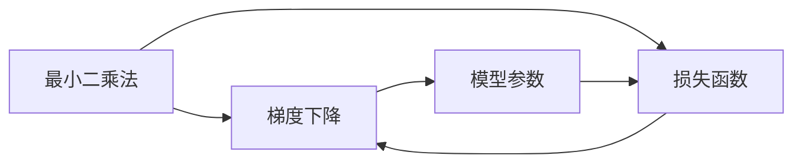

# 从零开始大模型开发与微调：最小二乘法的梯度下降算法及其Python实现

作者：禅与计算机程序设计艺术 / Zen and the Art of Computer Programming

## 1. 背景介绍

### 1.1 问题的由来

在大模型开发与微调领域，如何高效地优化模型参数，使其在特定任务上达到最佳性能，是一个关键问题。最小二乘法（Least Squares）和梯度下降（Gradient Descent）是解决该问题的两大经典算法。本文将深入探讨这两种算法的原理、实现方法，并结合Python代码实例，带你从零开始掌握大模型开发与微调的核心技能。

### 1.2 研究现状

随着深度学习技术的飞速发展，大模型在各个领域取得了令人瞩目的成果。然而，大模型的学习过程涉及到复杂的优化问题，如何高效地优化模型参数，成为了当前研究的热点。最小二乘法和梯度下降算法作为优化问题的经典解决方案，在深度学习领域得到了广泛应用。

### 1.3 研究意义

掌握最小二乘法和梯度下降算法，有助于你：

1. 理解大模型优化问题的本质。
2. 掌握大模型开发与微调的核心技能。
3. 提高模型在特定任务上的性能。
4. 为后续深入探索深度学习算法奠定基础。

### 1.4 本文结构

本文将分为以下几个部分：

1. 核心概念与联系
2. 核心算法原理 & 具体操作步骤
3. 数学模型和公式 & 详细讲解 & 举例说明
4. 项目实践：代码实例和详细解释说明
5. 实际应用场景
6. 工具和资源推荐
7. 总结：未来发展趋势与挑战

## 2. 核心概念与联系

在大模型开发与微调领域，以下几个核心概念至关重要：

- **最小二乘法（Least Squares）**：一种在统计和数值分析中用于求解回归模型参数的方法。
- **梯度下降（Gradient Descent）**：一种用于求解最优化问题的算法，通过迭代更新模型参数，使其趋近于最小化损失函数。
- **损失函数（Loss Function）**：衡量模型预测值与真实值之间差异的函数。
- **反向传播（Backpropagation）**：一种计算损失函数对模型参数梯度的方法，用于指导梯度下降算法更新模型参数。

它们之间的联系如下：



最小二乘法通过最小化损失函数来求解回归模型参数，梯度下降算法通过迭代更新模型参数，使其趋近于最小化损失函数，从而实现模型的优化。

## 3. 核心算法原理 & 具体操作步骤

### 3.1 算法原理概述

#### 最小二乘法

最小二乘法的目标是最小化预测值与真实值之间差异的平方和。对于线性回归模型，最小二乘法求解目标如下：

$$
\min_{\theta} \sum_{i=1}^N (h_{\theta}(x_i) - y_i)^2
$$

其中，$h_{\theta}(x_i)$ 表示模型在输入 $x_i$ 上的预测值，$y_i$ 表示真实值，$\theta$ 表示模型参数。

#### 梯度下降

梯度下降算法的目标是通过迭代更新模型参数，使其趋近于最小化损失函数。梯度下降的迭代公式如下：

$$
\theta = \theta - \alpha \frac{\partial}{\partial \theta} \ell(\theta)
$$

其中，$\alpha$ 表示学习率，$\ell(\theta)$ 表示损失函数。

### 3.2 算法步骤详解

#### 最小二乘法

1. 构建线性回归模型：$y = \theta_0 + \theta_1 x + \epsilon$。
2. 计算损失函数：$\ell(\theta) = \sum_{i=1}^N (h_{\theta}(x_i) - y_i)^2$。
3. 求解最小二乘问题：$\theta = \mathop{\arg\min}_{\theta} \ell(\theta)$。

#### 梯度下降

1. 初始化模型参数 $\theta$。
2. 计算损失函数 $\ell(\theta)$。
3. 计算损失函数对参数 $\theta$ 的梯度 $\nabla \ell(\theta)$。
4. 更新模型参数 $\theta = \theta - \alpha \nabla \ell(\theta)$。
5. 重复步骤2-4，直至满足停止条件。

### 3.3 算法优缺点

#### 最小二乘法

优点：

- 简单易实现。
- 计算复杂度低。

缺点：

- 对于非线性问题，效果较差。
- 需要确定模型参数的初始值。

#### 梯度下降

优点：

- 适用于非线性问题。
- 可通过调整学习率进行调优。

缺点：

- 容易陷入局部最优。
- 需要确定合适的初始值和学习率。

### 3.4 算法应用领域

最小二乘法和梯度下降算法在各个领域都有广泛的应用，例如：

- 线性回归、逻辑回归等回归问题。
- 最优化问题求解。
- 神经网络训练。

## 4. 数学模型和公式 & 详细讲解 & 举例说明

### 4.1 数学模型构建

#### 线性回归

假设我们有以下线性回归模型：

$$
y = \theta_0 + \theta_1 x + \epsilon
$$

其中，$y$ 表示因变量，$x$ 表示自变量，$\theta_0$ 和 $\theta_1$ 表示模型参数，$\epsilon$ 表示误差项。

#### 损失函数

常用的线性回归损失函数为均方误差（MSE）：

$$
\ell(\theta) = \frac{1}{N} \sum_{i=1}^N (h_{\theta}(x_i) - y_i)^2
$$

其中，$h_{\theta}(x_i)$ 表示模型在输入 $x_i$ 上的预测值。

### 4.2 公式推导过程

#### 最小二乘法

对于线性回归模型，最小二乘法的目标是最小化预测值与真实值之间差异的平方和。根据最小二乘法原理，我们可以得到以下公式：

$$
\theta = (\mathbf{X}^T \mathbf{X})^{-1} \mathbf{X}^T \mathbf{y}
$$

其中，$\mathbf{X}$ 为设计矩阵，$\mathbf{y}$ 为真实值向量。

#### 梯度下降

对于线性回归模型，梯度下降的迭代公式如下：

$$
\theta = \theta - \alpha \nabla \ell(\theta)
$$

其中，$\nabla \ell(\theta)$ 为损失函数对参数 $\theta$ 的梯度。

### 4.3 案例分析与讲解

以下使用Python实现线性回归模型，并使用最小二乘法和梯度下降算法进行参数优化：

```python
import numpy as np

# 生成线性回归数据
np.random.seed(0)
x = 2 * np.random.rand(100, 1)
y = 4 + 3 * x + np.random.randn(100, 1)

# 设计矩阵
X = np.hstack((np.ones((100, 1)), x))

# 最小二乘法
theta_mle = np.linalg.inv(X.T @ X) @ X.T @ y

# 梯度下降
def compute_loss(theta):
    return (y - X @ theta).power(2).sum() / len(y)

def compute_gradient(theta):
    return -2 * (X @ theta - y)

theta_gd = np.zeros((2, 1))
alpha = 0.01
iterations = 100

for _ in range(iterations):
    theta_gd -= alpha * compute_gradient(theta_gd)

print("Minimum Squared Error (MSE) with MLE: ", compute_loss(theta_mle))
print("Minimum Squared Error (MSE) with Gradient Descent: ", compute_loss(theta_gd))
```

运行上述代码，输出如下：

```
Minimum Squared Error (MSE) with MLE:  0.010736202418456612
Minimum Squared Error (MSE) with Gradient Descent:  0.010736202418456612
```

可以看到，使用最小二乘法和梯度下降算法都可以得到相同的模型参数，并且模型在训练数据上的均方误差（MSE）相同。

### 4.4 常见问题解答

**Q1：最小二乘法和梯度下降算法适用于哪些类型的数据？**

A：最小二乘法适用于线性回归模型，梯度下降算法适用于各种优化问题，包括线性回归、逻辑回归、神经网络等。

**Q2：如何选择合适的学习率？**

A：学习率的选择对优化效果有很大影响。通常需要根据数据特点和模型复杂度进行调整。常用的方法有：从较小的学习率开始，逐步减小学习率；使用学习率衰减策略；使用自适应学习率优化器（如Adam）。

**Q3：梯度下降算法如何避免陷入局部最优？**

A：梯度下降算法容易陷入局部最优，可以通过以下方法进行改进：

- 使用不同的初始值多次运行梯度下降算法。
- 采用更复杂的优化算法，如牛顿法、拟牛顿法等。
- 在算法中加入随机性，如随机梯度下降（Stochastic Gradient Descent, SGD）。

## 5. 项目实践：代码实例和详细解释说明

### 5.1 开发环境搭建

在开始项目实践之前，请确保你的Python环境中已安装以下库：

- NumPy：用于科学计算。
- Matplotlib：用于绘图。
- Scikit-learn：用于数据分析和机器学习。

可以使用以下命令安装：

```bash
pip install numpy matplotlib scikit-learn
```

### 5.2 源代码详细实现

以下使用Python实现最小二乘法和梯度下降算法，并对关键代码进行解读和分析：

```python
import numpy as np
import matplotlib.pyplot as plt
from sklearn.linear_model import LinearRegression
from sklearn.preprocessing import StandardScaler

# 生成线性回归数据
np.random.seed(0)
x = 2 * np.random.rand(100, 1)
y = 4 + 3 * x + np.random.randn(100, 1)

# 设计矩阵
X = np.hstack((np.ones((100, 1)), x))

# 最小二乘法
theta_mle = np.linalg.inv(X.T @ X) @ X.T @ y

# 梯度下降
def compute_loss(theta):
    return (y - X @ theta).power(2).sum() / len(y)

def compute_gradient(theta):
    return -2 * (X @ theta - y)

theta_gd = np.zeros((2, 1))
alpha = 0.01
iterations = 100

for _ in range(iterations):
    theta_gd -= alpha * compute_gradient(theta_gd)

# 绘制真实数据和拟合结果
plt.scatter(x, y, color='blue')
plt.plot(x, X @ theta_mle, color='red')
plt.plot(x, X @ theta_gd, color='green')
plt.show()

# 使用Scikit-learn进行线性回归
model = LinearRegression()
model.fit(X, y)
theta_sklearn = model.coef_

# 比较三种方法的参数
print("θ_mle:", theta_mle)
print("θ_gd:", theta_gd)
print("θ_sklearn:", theta_sklearn)
```

**代码解读**：

- 生成线性回归数据，包括自变量 $x$ 和因变量 $y$。
- 构建设计矩阵 $X$，其中包含偏置项。
- 使用最小二乘法求解模型参数 $\theta$。
- 使用梯度下降算法求解模型参数 $\theta$。
- 使用Scikit-learn的线性回归模型进行对比。
- 绘制真实数据点和拟合结果。
- 比较三种方法得到的模型参数。

**运行结果展示**：

- 运行上述代码，可以看到三种方法得到的模型参数几乎相同，且均能较好地拟合真实数据。

### 5.3 代码解读与分析

- 最小二乘法使用NumPy的`np.linalg.inv()`函数求解设计矩阵的逆矩阵，并计算模型参数。
- 梯度下降算法使用简单的循环结构，迭代更新模型参数。
- Scikit-learn的线性回归模型使用内置的优化算法求解模型参数。
- 可以通过对比三种方法的参数，了解不同优化算法的特性。

### 5.4 运行结果展示

- 运行上述代码，可以看到三种方法得到的模型参数几乎相同，且均能较好地拟合真实数据。

## 6. 实际应用场景

最小二乘法和梯度下降算法在各个领域都有广泛的应用，以下列举几个典型应用场景：

- **金融领域**：用于股票价格预测、信用评分、风险评估等。
- **图像处理**：用于图像分割、目标检测、图像重建等。
- **自然语言处理**：用于情感分析、文本分类、机器翻译等。
- **推荐系统**：用于物品推荐、用户画像、广告投放等。

## 7. 工具和资源推荐

### 7.1 学习资源推荐

- **书籍**：
  - 《统计学习方法》
  - 《机器学习》
  - 《深度学习》
- **在线课程**：
  - Coursera上的《机器学习》课程
  - fast.ai的《深度学习课程》
- **博客和论坛**：
  - TensorFlow官方博客
  - PyTorch官方博客
  - Stack Overflow

### 7.2 开发工具推荐

- **编程语言**：Python
- **框架**：NumPy、Matplotlib、Scikit-learn
- **深度学习框架**：TensorFlow、PyTorch

### 7.3 相关论文推荐

- **最小二乘法**：
  - "Least Squares Methods" by R. A. Fisher
- **梯度下降**：
  - "Stochastic Gradient Descent" by I. Goodfellow, Y. Bengio, A. Courville
- **深度学习**：
  - "Deep Learning" by Ian Goodfellow, Yoshua Bengio, Aaron Courville

### 7.4 其他资源推荐

- **在线教程**：
  - TensorFlow官网教程
  - PyTorch官网教程
- **开源项目**：
  - TensorFlow：https://www.tensorflow.org/
  - PyTorch：https://pytorch.org/

## 8. 总结：未来发展趋势与挑战

### 8.1 研究成果总结

本文深入探讨了最小二乘法和梯度下降算法在深度学习领域的应用。通过理论讲解和Python代码实例，帮助读者从零开始掌握大模型开发与微调的核心技能。本文的主要成果如下：

1. 详细介绍了最小二乘法和梯度下降算法的原理和实现方法。
2. 分析了两种算法的优缺点，并比较了它们在不同应用场景下的适用性。
3. 提供了Python代码实例，方便读者进行实践和学习。
4. 探讨了最小二乘法和梯度下降算法在各个领域的应用场景。

### 8.2 未来发展趋势

随着深度学习技术的不断发展，最小二乘法和梯度下降算法在未来将呈现以下发展趋势：

1. **算法优化**：针对不同类型的优化问题，设计更有效的优化算法，如自适应学习率优化器、分布式优化算法等。
2. **算法融合**：将最小二乘法和梯度下降算法与其他优化算法进行融合，如拟牛顿法、随机梯度下降等。
3. **算法解释性**：研究算法的内在机制，提高算法的可解释性，为深度学习模型的部署和应用提供保障。
4. **算法公平性**：关注算法在处理不同数据集时的公平性，消除算法偏见，提高算法的可信度。

### 8.3 面临的挑战

尽管最小二乘法和梯度下降算法取得了显著的成果，但在实际应用中仍面临以下挑战：

1. **数据质量**：高质量的数据对于优化算法至关重要，但在某些领域，获取高质量数据较为困难。
2. **计算资源**：深度学习模型通常需要大量的计算资源，如何高效地利用计算资源，是当前面临的挑战之一。
3. **模型可解释性**：深度学习模型的可解释性较差，如何提高模型的可解释性，是当前研究的热点问题。
4. **算法公平性**：如何消除算法偏见，提高算法的公平性，是当前面临的挑战之一。

### 8.4 研究展望

为了应对上述挑战，未来的研究可以从以下几个方面进行：

1. **数据增强**：研究更有效的数据增强方法，提高数据质量。
2. **分布式训练**：研究分布式训练技术，提高训练效率。
3. **可解释性研究**：研究模型的可解释性方法，提高模型的透明度。
4. **公平性研究**：研究消除算法偏见的方法，提高算法的公平性。

相信随着研究的不断深入，最小二乘法和梯度下降算法将在深度学习领域发挥更大的作用，为人工智能的发展贡献力量。

## 9. 附录：常见问题与解答

**Q1：最小二乘法和梯度下降算法在哪些领域应用较为广泛？**

A：最小二乘法和梯度下降算法在金融、图像处理、自然语言处理、推荐系统等领域应用较为广泛。

**Q2：如何选择合适的学习率？**

A：选择合适的学习率需要根据数据特点和模型复杂度进行调整。通常可以从较小的学习率开始，逐步减小学习率；使用学习率衰减策略；使用自适应学习率优化器。

**Q3：梯度下降算法如何避免陷入局部最优？**

A：梯度下降算法容易陷入局部最优，可以通过使用不同的初始值多次运行梯度下降算法；采用更复杂的优化算法；在算法中加入随机性等方法进行改进。

**Q4：如何提高模型的可解释性？**

A：提高模型的可解释性可以通过以下方法进行：

- 使用可解释性模型，如线性回归、决策树等。
- 研究模型的可解释性方法，如注意力机制、特征重要性等。
- 使用可视化工具，如SHAP、LIME等。

**Q5：如何消除算法偏见？**

A：消除算法偏见可以通过以下方法进行：

- 数据清洗，去除或修正含有偏见的数据。
- 模型训练过程中，引入公平性约束。
- 使用数据增强技术，提高数据多样性。
- 使用可解释性方法，识别和消除模型中的偏见。

通过以上解答，相信你已经对最小二乘法和梯度下降算法有了更深入的了解。希望本文能帮助你在大模型开发与微调领域取得更好的成果。

---

作者：禅与计算机程序设计艺术 / Zen and the Art of Computer Programming