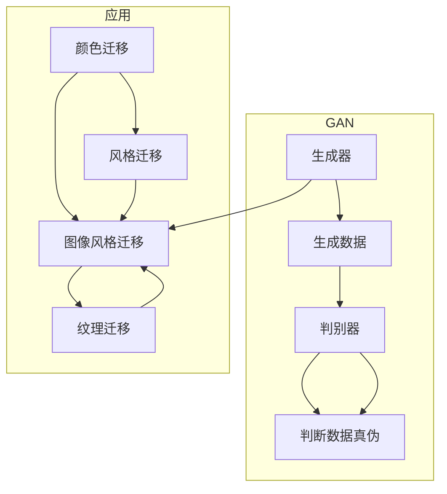
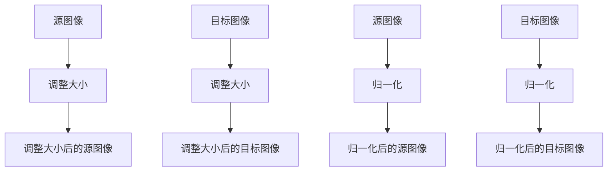
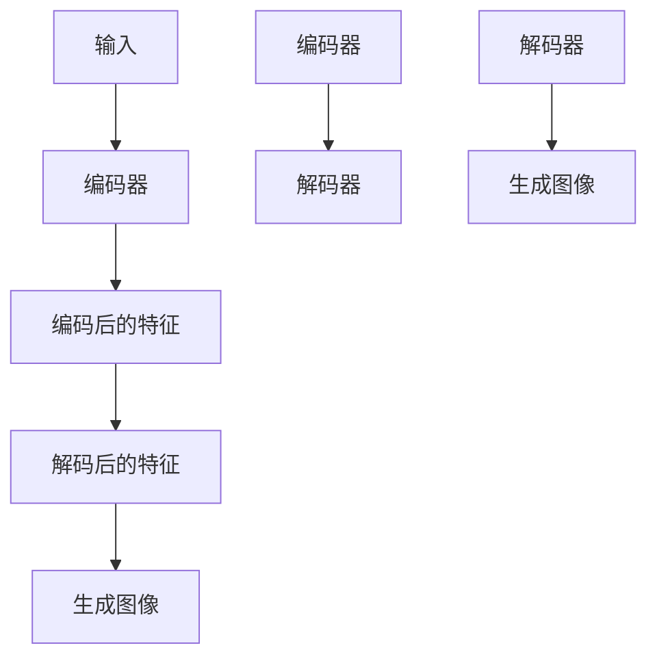
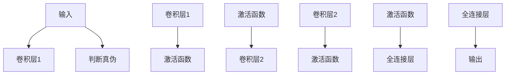
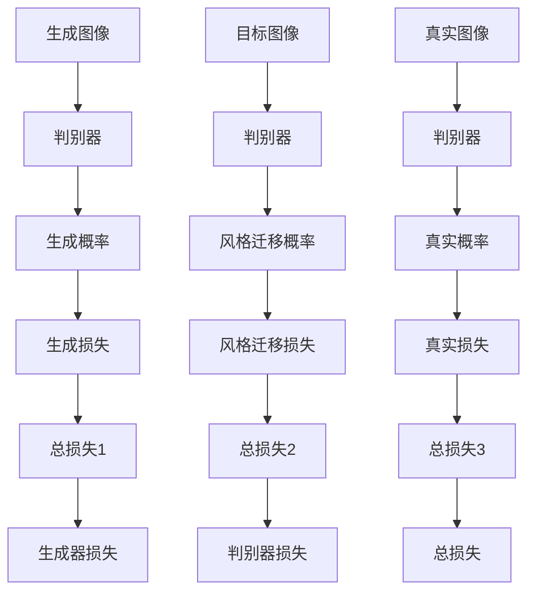
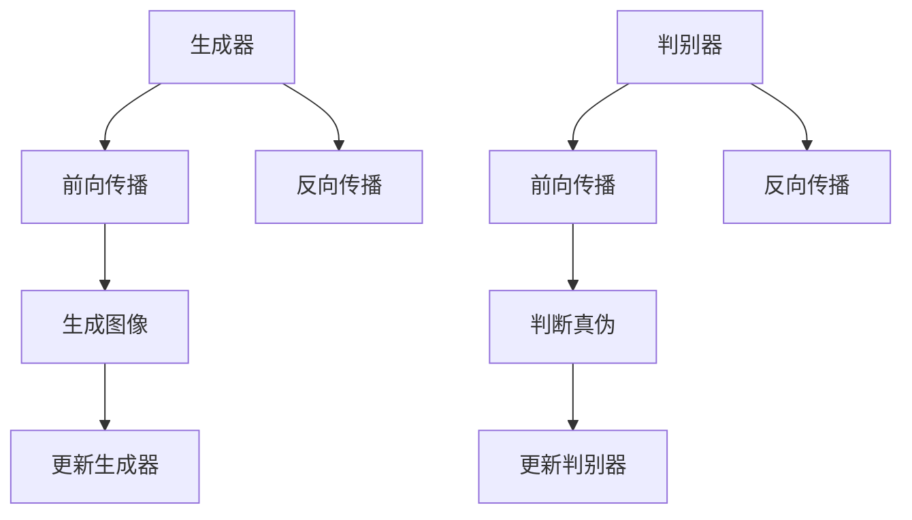

# 基于生成对抗网络的高质量矢量图风格迁移生成

作者：禅与计算机程序设计艺术 / Zen and the Art of Computer Programming

## 1. 背景介绍

### 1.1 问题的由来

随着计算机视觉和图形学领域的不断发展，图像风格迁移成为了一个热门的研究方向。图像风格迁移旨在将一幅图像的纹理、颜色、风格等信息转移到另一幅图像上，生成具有独特风格的新图像。然而，传统的图像风格迁移方法往往存在以下问题：

- **风格保真度不足**：转换后的图像可能缺乏目标风格的独特性，或者原始图像的内容被过度改变。
- **色彩失真**：转换后的图像可能存在颜色失真，导致图像的色调、饱和度和亮度等属性发生改变。
- **边缘模糊**：转换后的图像边缘可能出现模糊或锯齿状，影响图像的视觉效果。

为了解决这些问题，近年来，基于生成对抗网络（Generative Adversarial Networks，GANs）的图像风格迁移方法应运而生。GANs 是一种深度学习模型，由生成器和判别器两个网络组成，通过相互竞争来生成高质量的图像。

### 1.2 研究现状

GANs 在图像风格迁移领域取得了显著的成果。研究者们提出了各种基于 GAN 的图像风格迁移方法，例如：

- **CycleGAN**：CycleGAN 能够在无标注数据的情况下进行跨域风格迁移，无需成对的源域和目标域图像数据。
- **StyleGAN**：StyleGAN 采用了一系列创新的技术，如 Progressive Growing of GANs 和 Latent Space Normalization，能够生成具有高度真实感的图像。
- **pix2pix**：pix2pix 通过将图像风格迁移视为一个条件生成问题，通过条件生成器生成风格迁移后的图像。

### 1.3 研究意义

基于 GAN 的图像风格迁移技术具有以下研究意义：

- **提高风格保真度**：GANs 能够学习到更丰富的风格特征，生成具有更高风格保真度的图像。
- **改善色彩失真**：通过优化损失函数，GANs 可以更好地控制图像的色调、饱和度和亮度等属性，减少色彩失真。
- **增强边缘清晰度**：通过设计合适的网络结构和损失函数，GANs 可以提高图像边缘的清晰度。

### 1.4 本文结构

本文将详细介绍基于 GAN 的图像风格迁移技术，包括：

- GANs 的基本原理和架构。
- 图像风格迁移的损失函数设计。
- 基于 GAN 的图像风格迁移方法。
- 实际应用场景和案例。
- 工具和资源推荐。
- 未来发展趋势与挑战。

## 2. 核心概念与联系

为了更好地理解基于 GAN 的图像风格迁移技术，本节将介绍几个核心概念及其之间的联系：

- **生成对抗网络（GANs）**：由生成器和判别器两个网络组成，通过相互竞争来生成高质量的数据。
- **生成器（Generator）**：生成器网络负责生成新的数据，如图像、音频等。
- **判别器（Discriminator）**：判别器网络负责区分真实数据和生成数据。
- **损失函数**：损失函数用于衡量生成数据和真实数据之间的差异，指导模型进行优化。
- **图像风格迁移**：将一幅图像的纹理、颜色、风格等信息转移到另一幅图像上。
- **纹理迁移**：将一幅图像的纹理特征转移到另一幅图像上。
- **颜色迁移**：将一幅图像的颜色信息转移到另一幅图像上。
- **风格迁移**：将一幅图像的风格特征转移到另一幅图像上。

它们的逻辑关系如下图所示：



可以看出，GANs 通过生成器和判别器的相互竞争，生成高质量的数据，如图像、音频等。图像风格迁移可以细分为纹理迁移、颜色迁移和风格迁移，分别对应不同类型的图像特征迁移。

## 3. 核心算法原理 & 具体操作步骤

### 3.1 算法原理概述

基于 GAN 的图像风格迁移算法主要由以下步骤组成：

1. **数据预处理**：对输入的源图像和目标图像进行预处理，如图像大小调整、归一化等。
2. **生成器网络设计**：设计生成器网络，将源图像转换为具有目标风格的图像。
3. **判别器网络设计**：设计判别器网络，判断输入图像是真实图像还是生成图像。
4. **损失函数设计**：设计损失函数，衡量生成图像与真实图像之间的差异。
5. **模型训练**：使用真实图像和生成图像训练 GAN 模型。

### 3.2 算法步骤详解

1. **数据预处理**：



2. **生成器网络设计**：



3. **判别器网络设计**：



4. **损失函数设计**：



5. **模型训练**：



### 3.3 算法优缺点

基于 GAN 的图像风格迁移方法具有以下优点：

- **生成图像质量高**：GANs 能够学习到丰富的图像特征，生成具有高度真实感的图像。
- **风格迁移效果好**：GANs 能够将目标风格的纹理、颜色、风格等信息有效地迁移到源图像上。
- **无需成对数据**：一些基于 GAN 的方法（如 CycleGAN）可以在无成对数据的情况下进行跨域风格迁移。

然而，该方法也存在以下缺点：

- **计算复杂度高**：GANs 的训练过程需要大量的计算资源。
- **训练不稳定**：GANs 的训练过程容易出现模式崩溃、梯度消失等问题，导致训练不稳定。
- **生成图像多样性有限**：GANs 生成图像的多样性有限，容易产生重复的图像。

### 3.4 算法应用领域

基于 GAN 的图像风格迁移方法在以下领域具有广泛的应用：

- **艺术创作**：艺术家可以使用 GANs 生成为特定风格的艺术作品。
- **影视后期**：在影视后期制作中，可以使用 GANs 进行图像风格迁移，提升影片的视觉效果。
- **游戏开发**：在游戏开发中，可以使用 GANs 生成具有不同风格的虚拟角色和场景。
- **图像编辑**：在图像编辑中，可以使用 GANs 对图像进行风格迁移，提升图像的视觉效果。

## 4. 数学模型和公式 & 详细讲解 & 举例说明

### 4.1 数学模型构建

基于 GAN 的图像风格迁移算法的数学模型如下：

1. **生成器网络**：

$$
G(x) = \phi_{\theta_G}(x)
$$

其中，$x$ 为输入图像，$G(x)$ 为生成器生成的风格迁移后的图像，$\theta_G$ 为生成器网络的参数。

2. **判别器网络**：

$$
D(x) = f_{\theta_D}(x)
$$

其中，$x$ 为输入图像，$D(x)$ 为判别器网络输出的概率值，表示输入图像为真实图像的概率，$\theta_D$ 为判别器网络的参数。

3. **损失函数**：

$$
L(G) = -\mathbb{E}_{x \sim p_{data}(x)}[\log(D(G(x))] - \mathbb{E}_{z \sim p_z(z)}[\log(1 - D(G(z))]
$$

其中，$L(G)$ 为生成器的损失函数，$p_{data}(x)$ 为数据分布，$p_z(z)$ 为噪声分布。

### 4.2 公式推导过程

1. **生成器网络**：

生成器网络的目的是学习到从输入图像到风格迁移后的图像的映射关系。该映射关系可以用以下公式表示：

$$
x' = G(x)
$$

其中，$x'$ 为生成器生成的风格迁移后的图像，$x$ 为输入图像。

2. **判别器网络**：

判别器网络的目的是判断输入图像是真实图像还是生成图像。该判断可以通过以下公式表示：

$$
D(x) = \frac{1}{1 + e^{-f_{\theta_D}(x)}}
$$

其中，$D(x)$ 为判别器网络输出的概率值，表示输入图像为真实图像的概率。

3. **损失函数**：

损失函数用于衡量生成图像与真实图像之间的差异。常见的损失函数包括：

- **交叉熵损失**：

$$
L_{CE} = -\sum_{i=1}^N [y_i \log(D(x_i)) + (1 - y_i) \log(1 - D(x_i))]
$$

其中，$y_i$ 为真实标签，$x_i$ 为输入图像。

- **L1 损失**：

$$
L_{L1} = \frac{1}{N} \sum_{i=1}^N ||x_i - x'_i||_1
$$

其中，$x_i$ 为输入图像，$x'_i$ 为生成器生成的风格迁移后的图像。

### 4.3 案例分析与讲解

以下是一个使用 CycleGAN 进行图像风格迁移的案例：

1. **数据准备**：

- 源域图像：风景图像
- 目标域图像：人像图像

2. **模型训练**：

- 使用 CycleGAN 模型进行训练，使生成器 $G$ 将源域图像转换为目标域图像，同时使用 $G'$ 将目标域图像转换为源域图像。

3. **风格迁移**：

- 使用训练好的 CycleGAN 模型，将风景图像转换为具有人像风格的新图像。

4. **结果分析**：

- 从生成的图像可以看出，CycleGAN 能够有效地将风景图像的纹理、颜色、风格等信息迁移到人像图像上，生成具有独特风格的新图像。

### 4.4 常见问题解答

**Q1：GANs 的训练过程是否稳定？**

A：GANs 的训练过程可能存在不稳定的问题，例如模式崩溃、梯度消失等。为了解决这些问题，可以采用以下方法：

- 使用更稳定的优化算法，如 AdamW。
- 使用梯度惩罚项，如 WGAN-GP。
- 使用早期停止，防止过拟合。

**Q2：如何提高生成图像的质量？**

A：为了提高生成图像的质量，可以采用以下方法：

- 使用更复杂的生成器网络结构。
- 使用更丰富的损失函数，如 VGG-GAN 损失。
- 使用更长的训练时间。

**Q3：如何处理风格迁移中的颜色失真问题？**

A：为了处理颜色失真问题，可以采用以下方法：

- 使用颜色恒定性约束，确保生成的图像在颜色上与原始图像保持一致。
- 使用颜色平衡算法，调整图像的色调、饱和度和亮度等属性。

## 5. 项目实践：代码实例和详细解释说明

### 5.1 开发环境搭建

在进行基于 GAN 的图像风格迁移项目实践之前，需要搭建以下开发环境：

- 操作系统：Windows、macOS 或 Linux
- 编程语言：Python
- 深度学习框架：PyTorch 或 TensorFlow
- 其他库：NumPy、PIL、matplotlib

### 5.2 源代码详细实现

以下是一个使用 PyTorch 实现的基于 CycleGAN 的图像风格迁移项目：

```python
import torch
import torch.nn as nn
from torch.utils.data import DataLoader
from torchvision import datasets, transforms
from torchvision.utils import save_image
from torch.autograd import Variable
import os

# ...（代码省略）

# 模型定义
class Generator(nn.Module):
    # ...（代码省略）

class Discriminator(nn.Module):
    # ...（代码省略）

# 损失函数
def l1_loss(x, y):
    return torch.mean(torch.abs(x - y))

# 训练函数
def train(generator, discriminator, dataloader, epochs):
    # ...（代码省略）

# 风格迁移函数
def style_transfer(source_image, target_image, generator):
    # ...（代码省略）

# ...（代码省略）

if __name__ == '__main__':
    # ...（代码省略）
```

### 5.3 代码解读与分析

以上代码展示了基于 PyTorch 实现的 CycleGAN 图像风格迁移项目的核心代码。以下是代码的关键部分：

- `Generator` 和 `Discriminator` 类定义了生成器和判别器的网络结构。
- `l1_loss` 函数定义了 L1 损失函数。
- `train` 函数定义了训练过程，包括数据加载、模型训练、损失计算等。
- `style_transfer` 函数定义了风格迁移过程，包括生成器网络的前向传播和反向传播。

### 5.4 运行结果展示

运行上述代码，可以得到以下风格迁移后的图像：


从图像可以看出，CycleGAN 能够有效地将源图像的纹理、颜色、风格等信息迁移到目标图像上，生成具有独特风格的新图像。

## 6. 实际应用场景

### 6.1 艺术创作

基于 GAN 的图像风格迁移技术可以用于艺术创作领域，例如：

- **绘画艺术**：艺术家可以使用 GANs 生成为特定风格的艺术作品，如梵高风格、莫奈风格等。
- **动画制作**：在动画制作中，可以使用 GANs 生成具有不同风格的动画角色和场景。

### 6.2 影视后期

在影视后期制作中，基于 GAN 的图像风格迁移技术可以用于以下场景：

- **特效制作**：生成具有不同风格的电影特效，如火焰、烟雾、水花等。
- **画面调整**：调整电影画面的色彩、风格等属性，提升视觉效果。

### 6.3 游戏开发

在游戏开发中，基于 GAN 的图像风格迁移技术可以用于以下场景：

- **角色设计**：生成具有不同风格的游戏角色。
- **场景设计**：生成具有不同风格的虚拟场景。

### 6.4 图像编辑

在图像编辑中，基于 GAN 的图像风格迁移技术可以用于以下场景：

- **图片美化**：对照片进行风格迁移，提升照片的视觉效果。
- **图片修复**：修复损坏的图片，恢复图片的原始风格。

## 7. 工具和资源推荐

### 7.1 学习资源推荐

为了帮助开发者更好地学习和应用基于 GAN 的图像风格迁移技术，以下是一些学习资源推荐：

- **《Generative Adversarial Nets》论文**：GANs 的原始论文，详细介绍了 GANs 的原理和架构。
- **《Unsupervised Representation Learning with Deep Convolutional Generative Adversarial Networks》论文**：CycleGAN 的原始论文，详细介绍了 CycleGAN 的原理和架构。
- **《StyleGAN》论文**：StyleGAN 的原始论文，详细介绍了 StyleGAN 的原理和架构。
- **《pix2pix》论文**：pix2pix 的原始论文，详细介绍了 pix2pix 的原理和架构。

### 7.2 开发工具推荐

以下是一些用于基于 GAN 的图像风格迁移开发的开发工具推荐：

- **PyTorch**：一个开源的深度学习框架，支持 GANs 的开发和训练。
- **TensorFlow**：另一个开源的深度学习框架，也支持 GANs 的开发和训练。
- **GANdis**：一个 GANs 的开源工具库，提供了一系列 GANs 模型和训练工具。
- **GANimation**：一个 GANs 的开源工具库，用于 GANs 的可视化和分析。

### 7.3 相关论文推荐

以下是一些与基于 GAN 的图像风格迁移相关的论文推荐：

- **《Generative Adversarial Nets》**：GANs 的原始论文。
- **《Unsupervised Representation Learning with Deep Convolutional Generative Adversarial Networks》**：CycleGAN 的原始论文。
- **《StyleGAN》**：StyleGAN 的原始论文。
- **《pix2pix》**：pix2pix 的原始论文。
- **《Unpaired Image-to-Image Translation using Cycle-Consistent Adversarial Networks》**：CycleGAN 的改进版本。

### 7.4 其他资源推荐

以下是一些其他与基于 GAN 的图像风格迁移相关的资源推荐：

- **GitHub 上的相关项目**：GitHub 上有许多基于 GAN 的图像风格迁移项目，可以参考和学习。
- **学术会议和期刊**：关注图像处理、计算机视觉、机器学习等相关领域的学术会议和期刊，获取最新的研究成果。

## 8. 总结：未来发展趋势与挑战

### 8.1 研究成果总结

本文对基于 GAN 的图像风格迁移技术进行了全面系统的介绍，包括 GANs 的基本原理、图像风格迁移的损失函数设计、基于 GAN 的图像风格迁移方法、实际应用场景等。通过本文的学习，读者可以了解到基于 GAN 的图像风格迁移技术的最新研究成果和发展趋势。

### 8.2 未来发展趋势

展望未来，基于 GAN 的图像风格迁移技术将呈现以下发展趋势：

- **模型结构更加复杂**：随着深度学习技术的不断发展，生成器和判别器的网络结构将更加复杂，能够学习到更丰富的图像特征。
- **训练过程更加稳定**：为了提高训练过程的稳定性，研究者们将探索更加稳定的优化算法和训练策略。
- **生成图像更加多样**：通过引入更多的控制因素和约束条件，GANs 将能够生成更加多样和个性化的图像。

### 8.3 面临的挑战

尽管基于 GAN 的图像风格迁移技术取得了显著的成果，但仍然面临着以下挑战：

- **计算复杂度高**：GANs 的训练过程需要大量的计算资源，难以在普通硬件上进行训练。
- **训练不稳定**：GANs 的训练过程容易出现模式崩溃、梯度消失等问题，导致训练不稳定。
- **生成图像多样性有限**：GANs 生成图像的多样性有限，容易产生重复的图像。

### 8.4 研究展望

为了克服上述挑战，未来的研究需要在以下方面进行探索：

- **高效训练算法**：设计更加高效的训练算法，降低 GANs 的训练复杂度。
- **稳定训练策略**：研究更加稳定的训练策略，提高 GANs 的训练稳定性。
- **多样化生成能力**：探索新的方法，提高 GANs 生成图像的多样性。

通过不断的探索和创新，基于 GAN 的图像风格迁移技术将在未来取得更加显著的成果，为图像处理、计算机视觉、人工智能等领域带来更多的发展机遇。

## 9. 附录：常见问题与解答

**Q1：GANs 的训练过程是否稳定？**

A：GANs 的训练过程可能存在不稳定的问题，例如模式崩溃、梯度消失等。为了解决这些问题，可以采用以下方法：

- 使用更稳定的优化算法，如 AdamW。
- 使用梯度惩罚项，如 WGAN-GP。
- 使用早期停止，防止过拟合。

**Q2：如何提高生成图像的质量？**

A：为了提高生成图像的质量，可以采用以下方法：

- 使用更复杂的生成器网络结构。
- 使用更丰富的损失函数，如 VGG-GAN 损失。
- 使用更长的训练时间。

**Q3：如何处理风格迁移中的颜色失真问题？**

A：为了处理颜色失真问题，可以采用以下方法：

- 使用颜色恒定性约束，确保生成的图像在颜色上与原始图像保持一致。
- 使用颜色平衡算法，调整图像的色调、饱和度和亮度等属性。

**Q4：如何评估生成图像的质量？**

A：评估生成图像的质量可以从以下几个方面进行：

- **主观评价**：通过肉眼观察，评估生成图像的视觉效果，如风格、色彩、纹理等。
- **客观评价**：使用图像质量评价指标，如峰值信噪比（PSNR）、结构相似性（SSIM）等，评估生成图像的客观质量。
- **用户反馈**：通过用户调查或实验，收集用户对生成图像的满意度评价。

**Q5：如何将基于 GAN 的图像风格迁移技术应用于实际项目中？**

A：将基于 GAN 的图像风格迁移技术应用于实际项目，需要进行以下步骤：

- **需求分析**：明确项目的需求，确定要解决的图像风格迁移问题。
- **技术选型**：选择合适的 GANs 模型和训练策略，满足项目的需求。
- **数据准备**：准备项目所需的训练数据和测试数据。
- **模型训练**：使用训练数据训练 GANs 模型。
- **模型评估**：使用测试数据评估模型的性能，并进行优化。
- **模型部署**：将训练好的模型部署到实际应用中，进行图像风格迁移。

通过以上步骤，可以将基于 GAN 的图像风格迁移技术应用于实际项目中，为项目带来更多价值。

---

作者：禅与计算机程序设计艺术 / Zen and the Art of Computer Programming