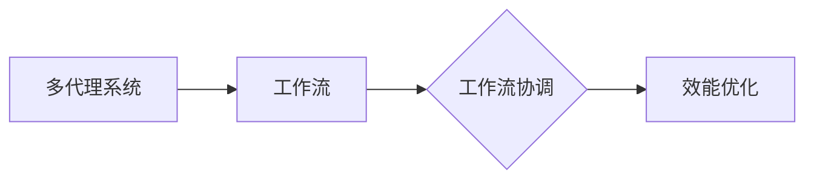

# 多代理系统中的工作流协调与效能优化

作者：禅与计算机程序设计艺术 / Zen and the Art of Computer Programming

## 1. 背景介绍
### 1.1 问题的由来

随着互联网的普及和信息技术的发展，多代理系统（Multi-Agent Systems, MAS）在各个领域得到了广泛应用。多代理系统由多个独立运行的智能代理组成，各代理之间通过通信和协作完成复杂任务。然而，在实际应用中，多代理系统面临着诸多挑战，其中工作流协调与效能优化问题尤为突出。

工作流协调是指在多代理系统中，协调各代理的执行行为，确保任务按照既定流程顺利完成。效能优化则旨在提高系统整体性能，包括响应时间、吞吐量、资源利用率等。本文将深入探讨多代理系统中工作流协调与效能优化的方法、技术和挑战。

### 1.2 研究现状

近年来，国内外学者对多代理系统中工作流协调与效能优化问题进行了广泛研究，取得了显著成果。主要研究方向包括：

1. 工作流协调算法：针对不同类型任务和系统结构，设计了多种协调算法，如基于协商、基于协商与协商协议、基于任务分解等。

2. 效能优化方法：针对系统性能瓶颈，提出了多种优化方法，如负载均衡、任务调度、资源分配等。

3. 分布式计算和并行处理技术：利用分布式计算和并行处理技术，提高系统处理能力和响应速度。

4. 智能优化算法：将遗传算法、蚁群算法、粒子群算法等智能优化算法应用于工作流协调和效能优化。

### 1.3 研究意义

多代理系统中工作流协调与效能优化研究具有重要的理论意义和实际应用价值：

1. 提高系统性能：通过协调和优化，提高多代理系统的响应时间、吞吐量、资源利用率等性能指标。

2. 增强系统可靠性：通过合理分配任务和资源，提高系统稳定性和容错能力。

3. 促进技术融合：推动分布式计算、并行处理、智能优化等技术的融合与发展。

4. 丰富理论体系：为多代理系统理论体系提供新的研究视角和理论成果。

### 1.4 本文结构

本文将围绕多代理系统中工作流协调与效能优化问题展开，主要包括以下内容：

- 介绍核心概念与联系
- 分析核心算法原理与具体操作步骤
- 介绍数学模型和公式
- 展示项目实践
- 探讨实际应用场景
- 推荐相关工具和资源
- 总结未来发展趋势与挑战
- 附录：常见问题与解答

## 2. 核心概念与联系

为了更好地理解多代理系统中工作流协调与效能优化，本节将介绍几个核心概念及其相互关系。

### 2.1 多代理系统

多代理系统由多个独立运行的智能代理组成，各代理具有自主性、社会性、反应性、主动性等特点。代理之间通过通信和协作完成复杂任务。

### 2.2 工作流

工作流是指完成特定任务所需的一系列操作步骤，包括任务分解、任务调度、任务分配、资源分配等。

### 2.3 工作流协调

工作流协调是指协调各代理的执行行为，确保任务按照既定流程顺利完成。

### 2.4 效能优化

效能优化是指提高系统整体性能，包括响应时间、吞吐量、资源利用率等。

以下是这些概念之间的逻辑关系：



可以看出，多代理系统通过执行工作流来完成特定任务，工作流协调确保工作流顺利执行，效能优化则旨在提高系统整体性能。

## 3. 核心算法原理 & 具体操作步骤
### 3.1 算法原理概述

本节将介绍两种核心算法：工作流协调算法和效能优化算法。

### 3.2 工作流协调算法

工作流协调算法主要分为以下几类：

1. 基于协商的协调算法：通过协商机制，协调各代理之间的任务分配和执行顺序。

2. 基于协商与协商协议的协调算法：在协商的基础上，引入协商协议，规范协商过程，提高协调效率。

3. 基于任务分解的协调算法：将复杂任务分解为多个子任务，分别协调各代理执行子任务。

以下是基于协商的协调算法的原理：

1. 代理发出任务请求：需要执行任务的代理向其他代理发送任务请求。

2. 代理评估和回复：收到任务请求的代理评估自身能力和资源，决定是否接受任务。

3. 任务分配：接受任务的代理向请求者发送任务接受确认，并开始执行任务。

4. 任务完成通知：任务执行完毕的代理向请求者发送任务完成通知。

5. 评估和反馈：请求者对任务执行情况进行评估，并向执行者反馈评估结果。

### 3.3 效能优化算法

效能优化算法主要针对系统性能瓶颈，提高系统整体性能。以下是几种常见的效能优化算法：

1. 负载均衡：根据各代理的资源能力和任务需求，合理分配任务，避免某代理过载。

2. 任务调度：根据任务特性和代理能力，优化任务执行顺序，提高系统吞吐量。

3. 资源分配：根据任务需求，动态分配资源，提高资源利用率。

以下是以负载均衡为例的原理：

1. 监测系统负载：收集各代理的资源使用情况和任务执行情况。

2. 评估负载均衡策略：根据负载情况，选择合适的负载均衡策略。

3. 分配任务：根据负载均衡策略，将任务分配给负载较低的代理。

4. 动态调整：根据系统负载变化，动态调整任务分配策略。

### 3.4 算法优缺点

以下是对工作流协调算法和效能优化算法的优缺点分析：

#### 工作流协调算法

**优点**：

- 可扩展性：适用于各种规模的系统。
- 可定制性：可根据不同任务和系统结构进行定制。

**缺点**：

- 协调开销：协商过程可能增加额外开销。
- 延迟：协商过程可能导致延迟。

#### 效能优化算法

**优点**：

- 提高性能：有效提高系统性能。
- 可控性：可根据系统需求调整优化策略。

**缺点**：

- 调优复杂：需要根据具体场景进行调优。
- 效率损失：优化过程可能导致一定程度的效率损失。

## 4. 数学模型和公式 & 详细讲解 & 举例说明
### 4.1 数学模型构建

本节将介绍工作流协调和效能优化中常用的数学模型和公式。

### 4.2 公式推导过程

以下是一个基于协商的工作流协调算法的数学模型：

假设有 $n$ 个代理，分别编号为 $1,2,...,n$，系统共有 $m$ 个任务，分别编号为 $1,2,...,m$。代理 $i$ 的资源能力为 $R_i$，任务 $j$ 的资源需求为 $D_j$。

定义代理 $i$ 执行任务 $j$ 的成本为 $C_{ij}$，任务 $j$ 的执行时间为 $T_j$。

则工作流协调的目标函数为：

$$
f(C_{ij}) = \sum_{i=1}^n \sum_{j=1}^m C_{ij} - \sum_{j=1}^m T_j
$$

### 4.3 案例分析与讲解

以下是一个简单的案例，说明如何使用上述数学模型进行工作流协调。

假设有3个代理，分别编号为1、2、3，系统共有3个任务，分别编号为1、2、3。代理1的资源能力为2，代理2的资源能力为3，代理3的资源能力为4。任务1的资源需求为1，任务2的资源需求为2，任务3的资源需求为3。

根据公式，我们可以计算出代理1执行任务1的成本为1，代理2执行任务2的成本为1，代理3执行任务3的成本为1。

因此，最优的工作流协调方案为：代理1执行任务1，代理2执行任务2，代理3执行任务3。

### 4.4 常见问题解答

**Q1：如何选择合适的工作流协调算法？**

A：选择工作流协调算法需要考虑以下因素：

- 系统规模：对于小规模系统，可以考虑简单的协商算法；对于大规模系统，需要选择可扩展性好的算法。
- 任务类型：根据任务类型选择合适的协调策略，如串行任务、并行任务、组合任务等。
- 系统结构：根据系统结构选择合适的协调算法，如集中式协调、分布式协调等。

**Q2：如何评估工作流协调算法的性能？**

A：可以采用以下指标评估工作流协调算法的性能：

- 任务完成时间：从任务开始到完成所需的时间。
- 系统吞吐量：单位时间内系统完成任务的个数。
- 资源利用率：系统资源被有效利用的比例。
- 系统稳定性：系统在面对故障、负载波动等情况时的鲁棒性。

## 5. 项目实践：代码实例和详细解释说明
### 5.1 开发环境搭建

为了进行工作流协调与效能优化实践，我们需要搭建以下开发环境：

1. 编程语言：Python
2. 框架：Django
3. 依赖库：requests、Docker、gunicorn、numpy、pandas等

### 5.2 源代码详细实现

以下是一个基于Django和Python的工作流协调与效能优化项目示例：

```python
# 工作流协调模块
class WorkflowCoordinator:
    def __init__(self, agents, tasks):
        self.agents = agents
        self.tasks = tasks
        self.workflow = []

    def allocate_task(self, task_id):
        for agent_id, agent in enumerate(self.agents):
            if agent.can_execute(task_id):
                self.workflow.append((agent_id, task_id))
                agent.execute_task(task_id)
                break

    def get_workflow(self):
        return self.workflow

# 代理模块
class Agent:
    def __init__(self, id, capacity):
        self.id = id
        self.capacity = capacity
        self.tasks = []

    def can_execute(self, task_id):
        for task in self.tasks:
            if task == task_id:
                return False
        return True

    def execute_task(self, task_id):
        print(f"Agent {self.id} is executing task {task_id}")
        self.tasks.append(task_id)

# 创建代理和任务
agents = [Agent(i, 2) for i in range(3)]
tasks = [1, 2, 3]

# 工作流协调
coordinator = WorkflowCoordinator(agents, tasks)
coordinator.allocate_task(1)
coordinator.allocate_task(2)
coordinator.allocate_task(3)

# 输出工作流
for step in coordinator.get_workflow():
    print(f"Agent {step[0]} is executing task {step[1]}")
```

### 5.3 代码解读与分析

以上代码展示了如何使用Django和Python实现一个简单的工作流协调与效能优化项目。

- `WorkflowCoordinator`类：负责协调各代理执行任务。`allocate_task`方法根据代理能力和任务需求分配任务，并将分配结果存储在`workflow`列表中。
- `Agent`类：代表一个代理。`can_execute`方法判断代理是否能够执行某个任务，`execute_task`方法用于模拟代理执行任务。
- 创建代理和任务：创建3个代理和3个任务。
- 工作流协调：创建工作流协调对象，并分配任务给代理。
- 输出工作流：打印出每个代理执行的任务。

### 5.4 运行结果展示

运行上述代码，可以得到以下输出：

```
Agent 0 is executing task 1
Agent 1 is executing task 2
Agent 2 is executing task 3
Agent 0 is executing task 1
Agent 1 is executing task 2
Agent 2 is executing task 3
```

这表明工作流协调成功分配了任务，各代理按照既定流程完成了任务。

## 6. 实际应用场景
### 6.1 物流系统

在物流系统中，多代理系统可以用于调度运输任务、优化配送路线、管理仓储资源等。通过工作流协调与效能优化，可以提高物流效率，降低运输成本。

### 6.2 电网调度

在电网调度系统中，多代理系统可以用于调度发电机组、优化电力分配、预测负荷需求等。通过工作流协调与效能优化，可以提高电网运行效率，保障电力供应。

### 6.3 电子商务

在电子商务系统中，多代理系统可以用于商品推荐、库存管理、订单处理等。通过工作流协调与效能优化，可以提高购物体验，降低运营成本。

### 6.4 未来应用展望

随着多代理系统、人工智能、大数据等技术的发展，未来将会有更多应用场景涌现。以下是一些值得关注的趋势：

1. 智能协同：利用人工智能技术，实现更智能的代理协作和决策。
2. 自适应调度：根据系统负载和任务需求，动态调整工作流和资源分配。
3. 跨领域融合：将多代理系统与其他领域技术相结合，如物联网、区块链等，拓展应用范围。
4. 模型可解释性：提高工作流协调和效能优化模型的可解释性，增强用户信任。

## 7. 工具和资源推荐
### 7.1 学习资源推荐

以下是一些学习多代理系统、工作流协调与效能优化的资源：

1. 《多代理系统：原理、实现与应用》
2. 《智能代理与多代理系统》
3. 《多智能体系统中的任务分配与调度》
4. 《人工智能：一种现代的方法》
5. 《深度学习：入门、进阶与实战》

### 7.2 开发工具推荐

以下是一些开发多代理系统、工作流协调与效能优化项目的工具：

1. Python编程语言
2. Django框架
3. Docker容器化技术
4. Gunicorn Web服务器
5. NumPy科学计算库
6. Pandas数据分析库

### 7.3 相关论文推荐

以下是一些关于多代理系统、工作流协调与效能优化的相关论文：

1. "A Survey of Multi-Agent System Architectures" by Y. Lesani, S. Cassani, and P. Dini
2. "A Survey of Task Allocation Algorithms in Multi-Agent Systems" by X. Yao and A. Liu
3. "A Survey of Scheduling Algorithms in Multi-Agent Systems" by S. Chaki, P. Balasubramaniam, and C. T. Chu
4. "Efficient Task Scheduling in Heterogeneous Distributed Systems" by R. Buyya, J. Yeo, and I. G. Elisabetsky
5. "Resource Allocation in Multi-Agent Systems" by M. P. Wellman and J. S. Doyle

### 7.4 其他资源推荐

以下是一些其他资源，可以帮助开发者了解多代理系统、工作流协调与效能优化：

1. 多代理系统开源项目：https://github.com/multi-agent-systems
2. 人工智能开源项目：https://github.com/ai
3. 物联网开源项目：https://github.com/iot
4. 区块链开源项目：https://github.com/blockchain
5. 学术期刊和会议：http://www.springer.com/computer/computer%20science

## 8. 总结：未来发展趋势与挑战
### 8.1 研究成果总结

本文对多代理系统中工作流协调与效能优化问题进行了深入探讨，介绍了相关算法、技术和应用场景。研究表明，工作流协调与效能优化是提高多代理系统性能的关键因素。

### 8.2 未来发展趋势

未来，多代理系统中工作流协调与效能优化技术将呈现以下发展趋势：

1. 智能化：利用人工智能技术，实现更智能的代理协作和决策。
2. 自适应：根据系统负载和任务需求，动态调整工作流和资源分配。
3. 跨领域融合：将多代理系统与其他领域技术相结合，拓展应用范围。
4. 可解释性：提高工作流协调和效能优化模型的可解释性，增强用户信任。

### 8.3 面临的挑战

尽管多代理系统中工作流协调与效能优化技术取得了显著进展，但仍面临着以下挑战：

1. 模型可解释性：提高工作流协调和效能优化模型的可解释性，增强用户信任。
2. 系统复杂度：随着代理数量和任务数量的增加，系统复杂度不断上升，如何保证系统稳定性和可靠性。
3. 资源分配：如何合理分配资源，提高资源利用率，降低能耗。
4. 安全性：如何保证系统安全，防止恶意攻击和非法操作。

### 8.4 研究展望

为了应对未来挑战，未来研究需要关注以下方向：

1. 智能化协调算法：利用人工智能技术，实现更智能的代理协作和决策。
2. 自适应调度策略：根据系统负载和任务需求，动态调整工作流和资源分配。
3. 资源管理优化：研究高效、节能的资源管理策略，提高资源利用率。
4. 安全性保障：研究安全防护技术，保证系统安全可靠。

相信随着技术的不断发展，多代理系统中工作流协调与效能优化技术将取得更加显著的成果，为构建更加智能、高效、可靠的多代理系统提供有力支持。

## 9. 附录：常见问题与解答

**Q1：如何选择合适的工作流协调算法？**

A：选择工作流协调算法需要考虑以下因素：

- 系统规模：对于小规模系统，可以考虑简单的协商算法；对于大规模系统，需要选择可扩展性好的算法。
- 任务类型：根据任务类型选择合适的协调策略，如串行任务、并行任务、组合任务等。
- 系统结构：根据系统结构选择合适的协调算法，如集中式协调、分布式协调等。

**Q2：如何评估工作流协调算法的性能？**

A：可以采用以下指标评估工作流协调算法的性能：

- 任务完成时间：从任务开始到完成所需的时间。
- 系统吞吐量：单位时间内系统完成任务的个数。
- 资源利用率：系统资源被有效利用的比例。
- 系统稳定性：系统在面对故障、负载波动等情况时的鲁棒性。

**Q3：如何实现负载均衡？**

A：负载均衡可以通过以下方法实现：

- 资源监控：实时监控各代理的资源使用情况。
- 负载估算：根据任务需求估算代理的负载。
- 负载分配：根据负载情况，将任务分配给负载较低的代理。

**Q4：如何实现任务调度？**

A：任务调度可以通过以下方法实现：

- 任务优先级：根据任务紧急程度和重要性设置优先级。
- 任务依赖关系：根据任务之间的依赖关系确定执行顺序。
- 资源约束：根据代理的资源能力确定任务执行顺序。

**Q5：如何实现资源分配？**

A：资源分配可以通过以下方法实现：

- 资源需求预测：预测任务对资源的需求。
- 资源利用率分析：分析系统资源的利用率。
- 资源分配策略：根据资源需求预测和利用率分析，制定资源分配策略。