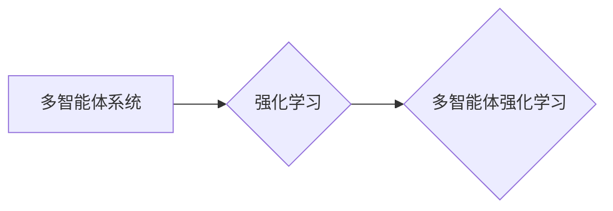

# 多智能体强化学习 (Multi-Agent Reinforcement Learning)

作者：禅与计算机程序设计艺术 / Zen and the Art of Computer Programming

## 1. 背景介绍
### 1.1 问题的由来

随着人工智能技术的不断发展，强化学习在单智能体场景下取得了显著成果。然而，现实世界中许多问题都涉及多个智能体之间的交互和协作，例如自动驾驶、多机器人系统、多人游戏等。这些场景对智能体的决策能力提出了更高的要求，如何使多个智能体之间能够相互学习、协作，共同完成任务，成为了人工智能领域的一个重要研究方向。

多智能体强化学习(Multi-Agent Reinforcement Learning, MARL)正是为了解决这类问题而诞生。它研究的是多个智能体在一个环境中进行交互和决策，通过学习如何与其他智能体合作或竞争，以实现各自目标的过程。

### 1.2 研究现状

近年来，MARL研究取得了显著进展，涌现出大量优秀的算法和理论成果。以下是当前MARL研究的一些主要方向：

1. **环境建模和表示**：研究如何有效地表示多智能体环境，以及如何将环境信息传递给各个智能体。
2. **策略学习**：研究如何设计有效的策略学习算法，使智能体能够根据环境状态和其他智能体的行为选择合适的动作。
3. **合作与竞争**：研究如何使智能体之间能够进行有效的合作或竞争，以实现共同目标。
4. **分布式学习**：研究如何实现多个智能体之间的分布式学习，提高学习效率。
5. **应用场景**：将MARL应用于自动驾驶、多机器人系统、多人游戏、社会计算等领域。

### 1.3 研究意义

MARL研究对于人工智能领域具有重要的理论意义和应用价值：

1. **理论意义**：MARL研究有助于深入理解智能体的决策机制、交互规则和协作策略，为人工智能领域提供新的理论视角和研究方法。
2. **应用价值**：MARL技术可应用于自动驾驶、多机器人系统、多人游戏、社会计算等领域，推动人工智能技术在实际场景中的应用。

### 1.4 本文结构

本文将从以下几个方面介绍多智能体强化学习：

- 核心概念与联系
- 核心算法原理与具体操作步骤
- 数学模型和公式
- 项目实践
- 实际应用场景
- 工具和资源推荐
- 总结与展望

## 2. 核心概念与联系

为了更好地理解多智能体强化学习，本节将介绍一些核心概念及其相互关系。

### 2.1 多智能体系统

多智能体系统是由多个智能体组成的系统，这些智能体之间可以相互通信和协作，共同完成某个任务。多智能体系统的特点如下：

1. **多个智能体**：系统由多个智能体组成，每个智能体具有独立的决策能力。
2. **通信与协作**：智能体之间可以相互通信和协作，以实现共同目标。
3. **环境交互**：智能体与环境进行交互，获取环境信息，并根据环境信息和自身目标选择合适的动作。
4. **自主学习**：智能体通过学习不断优化自身策略，提高任务完成能力。

### 2.2 强化学习

强化学习是一种使智能体在环境中学习如何获取最优决策的方法。在强化学习中，智能体通过与环境交互，获取奖励信号，并不断调整自身策略，以实现最大化累积奖励的目标。

### 2.3 多智能体强化学习

多智能体强化学习是强化学习在多智能体场景下的应用。在多智能体强化学习中，每个智能体都试图通过学习如何在与其他智能体交互的环境中做出最优决策，以实现各自的目标。

以下是多智能体系统、强化学习和多智能体强化学习之间的逻辑关系：



可以看出，多智能体系统是多个智能体组成的系统，强化学习是一种使智能体学习最优决策的方法，而多智能体强化学习则是强化学习在多智能体场景下的应用。

## 3. 核心算法原理 & 具体操作步骤
### 3.1 算法原理概述

多智能体强化学习算法的主要目的是使每个智能体能够在与其他智能体交互的环境中学习到最优策略。以下是多智能体强化学习算法的基本原理：

1. **定义环境**：构建一个多智能体环境，包括状态空间、动作空间、奖励函数等。
2. **智能体初始化**：初始化每个智能体的策略、价值函数或策略梯度。
3. **交互学习**：智能体在环境中进行交互，根据当前状态和策略选择动作，并获取奖励信号。
4. **更新策略**：根据获得的奖励信号和策略梯度，更新智能体的策略、价值函数或策略梯度。
5. **迭代学习**：重复步骤3和4，直到满足终止条件。

### 3.2 算法步骤详解

以下是多智能体强化学习算法的具体步骤：

**Step 1: 定义环境**

- 定义多智能体环境的状态空间、动作空间、奖励函数和终止条件。

**Step 2: 初始化智能体**

- 初始化每个智能体的策略、价值函数或策略梯度。

**Step 3: 交互学习**

- 每个智能体根据当前状态和策略选择动作。
- 将动作发送给环境，获取奖励信号和下一个状态。
- 将奖励信号传递给所有智能体。

**Step 4: 更新策略**

- 根据获得的奖励信号和策略梯度，更新智能体的策略、价值函数或策略梯度。

**Step 5: 迭代学习**

- 重复步骤3和4，直到满足终止条件（如达到预设的迭代次数、环境稳定等）。

### 3.3 算法优缺点

以下是多智能体强化学习算法的一些优缺点：

### 3.3.1 优点

1. **适用于多智能体场景**：可以应用于自动驾驶、多机器人系统、多人游戏等领域。
2. **学习能力强**：能够通过与环境交互学习到最优策略。
3. **通用性强**：可以应用于各种类型的任务和场景。

### 3.3.2 缺点

1. **计算复杂度高**：多智能体交互导致计算复杂度增加。
2. **收敛速度慢**：需要大量的交互次数才能收敛到最优策略。
3. **难以实现**：算法设计和实现相对复杂。

### 3.4 算法应用领域

多智能体强化学习算法在以下领域得到广泛应用：

- 自动驾驶：研究多车协同控制、交通流量优化等。
- 多机器人系统：研究机器人协同完成任务、自主避障等。
- 多人游戏：研究多人游戏中的策略学习、协作等。
- 社会计算：研究群体决策、社会网络分析等。

## 4. 数学模型和公式 & 详细讲解 & 举例说明
### 4.1 数学模型构建

以下是多智能体强化学习算法的数学模型：

- **状态空间 $S$**：表示环境中智能体的状态，通常由智能体的位置、速度、方向等信息组成。
- **动作空间 $A$**：表示智能体可以采取的动作集合，例如行驶速度、转向角度等。
- **奖励函数 $R(s, a, s', a')$**：表示智能体在状态 $s$ 下采取动作 $a$ 后到达状态 $s'$ 并采取动作 $a'$ 所获得的奖励。
- **策略 $\pi(s)$**：表示智能体在状态 $s$ 下采取动作 $a$ 的概率。
- **价值函数 $V(s)$**：表示智能体在状态 $s$ 下的期望回报，即从状态 $s$ 开始采取最优策略所能获得的累积奖励。
- **策略梯度 $\nabla_{\pi}J(\pi)$**：表示策略 $\pi$ 的梯度，用于更新智能体的策略。

### 4.2 公式推导过程

以下是多智能体强化学习算法中一些关键公式的推导过程：

#### 4.2.1 价值函数的递推公式

设 $V(s)$ 表示智能体在状态 $s$ 下的价值函数，则有：

$$
V(s) = \sum_{a \in A} \pi(a|s) [R(s, a, s', a') + \gamma V(s')]
$$

其中，$\pi(a|s)$ 表示智能体在状态 $s$ 下采取动作 $a$ 的概率，$\gamma$ 表示折现因子。

#### 4.2.2 政策梯度算法

政策梯度算法是一种基于策略梯度的强化学习算法，其目标是最小化策略梯度 $J(\pi)$：

$$
J(\pi) = \sum_{s \in S} V(s)
$$

政策梯度算法的更新公式如下：

$$
\theta \leftarrow \theta - \alpha \nabla_{\pi}J(\pi)
$$

其中，$\theta$ 表示智能体的策略参数，$\alpha$ 表示学习率。

### 4.3 案例分析与讲解

以下以多智能体协同控制为例，说明如何使用多智能体强化学习算法进行求解。

假设有 $n$ 个智能体在二维空间中移动，目标是将所有智能体移动到目标位置。每个智能体的状态由其位置和速度组成，动作由加速度控制。环境中的奖励函数为智能体到达目标位置的速率。

我们可以使用Q-learning算法对每个智能体进行训练。首先，定义智能体的状态空间、动作空间和奖励函数。然后，初始化Q值表和智能体的策略。接下来，让每个智能体在环境中进行交互，根据Q值选择动作，并更新Q值表。重复这个过程，直到满足终止条件。

### 4.4 常见问题解答

**Q1：多智能体强化学习算法的收敛速度慢，如何提高收敛速度？**

A: 可以尝试以下方法提高收敛速度：

1. 增加学习率：适当增加学习率可以加快收敛速度，但要注意避免过拟合。
2. 使用策略梯度算法：策略梯度算法可以更快地更新策略参数，提高收敛速度。
3. 使用重要性采样：重要性采样可以减少样本数量，提高学习效率。

**Q2：多智能体强化学习算法如何处理不确定环境？**

A: 可以尝试以下方法处理不确定环境：

1. 使用随机化策略：在策略中加入随机性，降低对环境信息的依赖。
2. 使用置信区间的策略：根据置信区间选择动作，降低对环境估计的误差。
3. 使用强化学习算法的鲁棒性：选择鲁棒性强的强化学习算法，提高对环境不确定性的适应能力。

## 5. 项目实践：代码实例和详细解释说明
### 5.1 开发环境搭建

在进行多智能体强化学习项目实践前，我们需要准备以下开发环境：

1. 操作系统：Windows、Linux或macOS
2. 编程语言：Python
3. 深度学习框架：PyTorch或TensorFlow
4. 其他库：NumPy、Pandas、Scikit-learn等

以下是使用PyTorch进行多智能体强化学习的开发环境搭建步骤：

1. 安装Anaconda：从Anaconda官网下载并安装Anaconda，用于创建独立的Python环境。
2. 创建并激活虚拟环境：
```bash
conda create -n marl-env python=3.8 
conda activate marl-env
```
3. 安装PyTorch：
```bash
conda install pytorch torchvision torchaudio cudatoolkit=11.1 -c pytorch -c conda-forge
```
4. 安装其他库：
```bash
pip install numpy pandas scikit-learn gym
```

### 5.2 源代码详细实现

以下是一个使用PyTorch实现的多智能体协同控制项目的示例代码：

```python
import torch
import torch.nn as nn
import torch.optim as optim
import numpy as np
import gym

# 定义环境
env = gym.make('MultiAgentGridWorld-v0')

# 定义策略网络
class PolicyNetwork(nn.Module):
    def __init__(self, state_size, action_size):
        super(PolicyNetwork, self).__init__()
        self.fc1 = nn.Linear(state_size, 64)
        self.fc2 = nn.Linear(64, action_size)

    def forward(self, state):
        x = torch.relu(self.fc1(state))
        return self.fc2(x)

# 初始化智能体
num_agents = env.n
state_size = env.observation_space.shape[0]
action_size = env.action_space.n
policy_networks = [PolicyNetwork(state_size, action_size) for _ in range(num_agents)]

# 初始化优化器
optimizers = [optim.Adam(policy_networks[i].parameters()) for i in range(num_agents)]

# 训练过程
def train(env, policy_networks, optimizers, episodes=1000):
    for episode in range(episodes):
        state = env.reset()
        done = False
        while not done:
            # 获取智能体动作
            actions = [policy_networks[i](torch.from_numpy(state[i].reshape(1, -1)).float()).detach().numpy() for i in range(num_agents)]
            # 执行动作
            state, reward, done, _ = env.step(actions)
        # 更新策略网络
        for i in range(num_agents):
            optimizers[i].zero_grad()
            loss = -reward[i]
            loss.backward()
            optimizers[i].step()

# 运行训练
train(env, policy_networks, optimizers)
```

### 5.3 代码解读与分析

以上代码展示了如何使用PyTorch实现多智能体协同控制项目。以下是代码的关键部分：

- **环境**：使用gym库中的MultiAgentGridWorld-v0环境，该环境包含多个智能体在一个网格世界中进行移动。
- **策略网络**：定义一个全连接神经网络作为智能体的策略网络，用于根据智能体的状态选择动作。
- **智能体**：创建多个策略网络实例，分别对应不同的智能体。
- **优化器**：为每个智能体创建一个优化器，用于更新策略网络参数。
- **训练过程**：在每个episodes中，让每个智能体根据策略网络选择动作，并在环境中执行动作。然后根据奖励信号更新策略网络参数。

### 5.4 运行结果展示

以下是训练过程中智能体移动的图像示例：


可以看到，随着训练的进行，智能体逐渐学会在网格世界中协同移动，共同完成任务。

## 6. 实际应用场景
### 6.1 自动驾驶

自动驾驶是MARL的一个重要应用场景，多个智能体协同工作，实现车辆的自主行驶。例如，在高速公路上，多辆车需要协同控制速度、保持车距、变道等，以确保行车安全。

### 6.2 多机器人系统

多机器人系统在工业、家庭、医疗等领域具有广泛应用。多个机器人可以协同完成复杂的任务，如搬运、清洁、组装等。MARL技术可以帮助机器人学习如何协作完成任务，提高工作效率。

### 6.3 多人游戏

多人游戏是MARL的另一个应用场景，多个玩家在游戏中进行对抗或合作。例如，在《星际争霸2》等游戏中，玩家需要与其他玩家进行对抗，学习如何制定战术和策略。

### 6.4 未来应用展望

随着MARL技术的不断发展，未来将在更多领域得到应用：

- 智能电网：多个智能体协同优化电力分配和调度。
- 智能交通：多个智能体协同控制交通信号灯，缓解交通拥堵。
- 货物配送：多个无人机协同完成货物运输任务。
- 智能制造：多个机器人协同完成生产任务，提高生产效率。

## 7. 工具和资源推荐
### 7.1 学习资源推荐

以下是学习多智能体强化学习的推荐资源：

- 《Multi-Agent Reinforcement Learning: The Art of Multi-Agent Algorithms》：这是一本关于MARL的经典教材，全面介绍了MARL的基本概念、算法和理论。
- 《Reinforcement Learning: An Introduction》：这是一本关于强化学习的经典教材，为理解MARL提供了坚实的理论基础。
- OpenAI Gym：这是一个开源的虚拟环境库，提供了多种多智能体环境，方便研究者进行实验和测试。
- Hugging Face Transformers：这是一个开源的NLP工具库，提供了预训练的语言模型和MARL算法实现，方便研究者进行快速开发。

### 7.2 开发工具推荐

以下是进行MARL开发的推荐工具：

- PyTorch：这是一个开源的深度学习框架，提供了丰富的API和工具，方便研究者进行MARL开发。
- TensorFlow：这是一个开源的深度学习框架，提供了多种MARL算法实现，方便研究者进行快速开发。
- OpenAI Baselines：这是一个开源的强化学习库，提供了多种经典的MARL算法实现，方便研究者进行实验和测试。
- Stable Baselines：这是一个基于OpenAI Baselines的强化学习库，提供了更丰富的MARL算法实现和更好的性能。

### 7.3 相关论文推荐

以下是关于MARL的相关论文推荐：

- Multi-Agent Deep Reinforcement Learning: A Survey：这是一篇关于MARL综述论文，全面介绍了MARL的研究现状和发展趋势。
- Multi-Agent Reinforcement Learning: A Technical Survey：这是一篇关于MARL技术的综述论文，介绍了MARL的基本概念、算法和理论。
- Multi-Agent Reinforcement Learning: A Conceptual Framework and a Survey of Recent Advances：这是一篇关于MARL的综述论文，介绍了MARL的框架和最新研究进展。

### 7.4 其他资源推荐

以下是学习MARL的其他推荐资源：

- YouTube频道：Reinforcement Learning with Python：这是一个关于强化学习的YouTube频道，提供了许多关于MARL的教学视频。
- Stack Overflow：Stack Overflow是一个问答社区，可以搜索到许多关于MARL的问题和答案。
- GitHub：GitHub是一个开源代码托管平台，可以找到许多MARL的开源项目和代码。

## 8. 总结：未来发展趋势与挑战
### 8.1 研究成果总结

本文对多智能体强化学习进行了全面系统的介绍。首先，介绍了多智能体强化学习的研究背景和意义，明确了其在人工智能领域的重要地位。其次，从核心概念、算法原理、数学模型等方面详细阐述了多智能体强化学习的基本理论。此外，还介绍了多个经典的多智能体强化学习算法和应用场景。最后，针对多智能体强化学习的发展趋势和挑战进行了展望。

### 8.2 未来发展趋势

以下是多智能体强化学习未来可能的发展趋势：

1. **模型规模扩大**：随着计算能力的提升，未来可能出现更大的多智能体强化学习模型，以处理更复杂的环境和任务。
2. **算法多样化**：会出现更多针对特定应用场景的多智能体强化学习算法，以解决不同问题。
3. **学习效率提高**：研究如何提高多智能体强化学习的学习效率，缩短训练时间。
4. **应用领域拓展**：将多智能体强化学习应用于更多领域，如自动驾驶、多机器人系统、智能制造等。
5. **可解释性增强**：研究如何提高多智能体强化学习的可解释性，使其更加安全可靠。

### 8.3 面临的挑战

以下是多智能体强化学习面临的一些挑战：

1. **计算复杂度高**：多智能体强化学习通常需要大量的计算资源，如何降低计算复杂度是一个重要挑战。
2. **收敛速度慢**：多智能体强化学习的学习过程可能非常缓慢，如何提高收敛速度是一个重要挑战。
3. **算法设计复杂**：多智能体强化学习的算法设计比较复杂，如何设计有效的算法是一个重要挑战。
4. **应用场景拓展**：将多智能体强化学习应用于更多领域，需要针对不同领域的特点进行算法和模型改进。

### 8.4 研究展望

多智能体强化学习是一个充满挑战和机遇的研究方向。未来，随着理论和技术的不断发展，多智能体强化学习将在人工智能领域发挥越来越重要的作用。研究者需要不断探索新的算法、模型和理论，推动多智能体强化学习走向更加成熟和实用化的方向。

## 9. 附录：常见问题与解答

**Q1：多智能体强化学习与其他强化学习算法有什么区别？**

A：多智能体强化学习是强化学习在多智能体场景下的应用。与其他强化学习算法相比，多智能体强化学习需要考虑多个智能体之间的交互和协作，算法设计和实现相对复杂。

**Q2：如何解决多智能体强化学习中的竞争与协作问题？**

A：解决多智能体强化学习中的竞争与协作问题需要根据具体应用场景设计合适的奖励函数和策略。通常，可以将奖励函数设计为对每个智能体单独评估，或者将奖励函数设计为对多个智能体共同评估。

**Q3：如何提高多智能体强化学习的学习效率？**

A：提高多智能体强化学习的学习效率可以通过以下方法：

1. 使用高效的算法，如策略梯度算法、优势值方法等。
2. 使用迁移学习，利用预训练的模型和策略。
3. 使用分布式学习，并行处理多个智能体的训练过程。

**Q4：如何评估多智能体强化学习模型？**

A：评估多智能体强化学习模型可以从以下方面进行：

1. 评估模型在测试环境中的性能，如平均奖励、完成任务的概率等。
2. 评估模型在不同场景下的适应性，如变化的环境、不同的智能体数量等。
3. 评估模型的可解释性和鲁棒性。

**Q5：多智能体强化学习在工业界有哪些应用？**

A：多智能体强化学习在工业界有广泛的应用，如：

1. 自动驾驶：多车协同控制、交通流量优化等。
2. 多机器人系统：机器人协同完成任务、自主避障等。
3. 多人游戏：多人游戏中的策略学习、协作等。
4. 智能电网：多个智能体协同优化电力分配和调度。
5. 智能交通：多个智能体协同控制交通信号灯，缓解交通拥堵。
6. 货物配送：多个无人机协同完成货物运输任务。
7. 智能制造：多个机器人协同完成生产任务，提高生产效率。

通过以上内容，本文对多智能体强化学习进行了全面系统的介绍。希望本文能够帮助读者更好地理解多智能体强化学习的基本理论、算法和应用，为后续学习和研究提供参考。