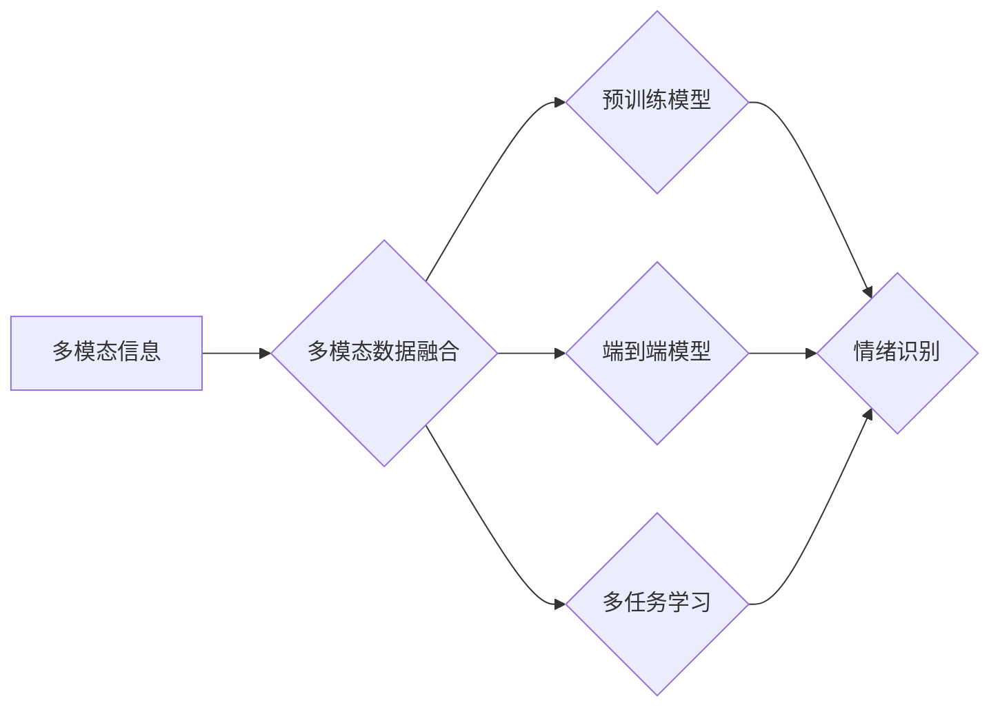

# 多模态大模型：技术原理与实战 多模态大模型在情绪识别领域的应用

作者：禅与计算机程序设计艺术 / Zen and the Art of Computer Programming

## 1. 背景介绍

### 1.1 问题的由来

情绪识别作为自然语言处理（NLP）和计算机视觉（CV）领域的交叉领域，近年来受到了越来越多的关注。人们希望通过分析文本、图像、音频等多模态信息，更好地理解人类情绪，从而在医疗、教育、人机交互等领域发挥重要作用。然而，传统的情绪识别方法往往局限于单一模态数据，难以全面捕捉情绪信息。因此，多模态大模型应运而生，通过融合多种模态信息，实现了更准确、更全面的情绪识别。

### 1.2 研究现状

近年来，随着深度学习技术的快速发展，多模态大模型在情绪识别领域取得了显著的成果。目前，主流的多模态大模型主要包括以下几种：

1. **预训练模型融合**：将不同的预训练模型（如BERT、GPT、VGG等）分别用于文本、图像和音频等不同模态数据的特征提取，然后将提取的特征进行融合，最后输出最终的识别结果。

2. **多任务学习**：将情绪识别与其他相关任务（如情感分析、意图识别等）进行联合训练，共享特征表示，提高模型的表达能力。

3. **端到端多模态模型**：直接对多模态数据进行处理，无需进行特征提取和融合，如多模态Transformer、多模态卷积神经网络等。

### 1.3 研究意义

多模态大模型在情绪识别领域的应用具有重要的研究意义：

1. **提高识别准确率**：融合多种模态信息，可以更全面地捕捉情绪信息，从而提高情绪识别的准确率。

2. **拓展应用场景**：多模态大模型可以应用于更广泛的场景，如医疗诊断、教育辅导、人机交互等。

3. **推动人工智能发展**：多模态大模型是人工智能领域的一项重要突破，有助于推动人工智能技术的进一步发展。

### 1.4 本文结构

本文将围绕多模态大模型在情绪识别领域的应用展开，主要包括以下内容：

1. 核心概念与联系
2. 核心算法原理与具体操作步骤
3. 数学模型和公式
4. 项目实践
5. 实际应用场景
6. 工具和资源推荐
7. 总结：未来发展趋势与挑战
8. 附录：常见问题与解答

## 2. 核心概念与联系

为了更好地理解多模态大模型在情绪识别领域的应用，本节将介绍以下几个核心概念及其相互关系：

- **多模态信息**：指来自不同来源的信息，如文本、图像、音频等。
- **多模态数据融合**：指将来自不同模态的数据进行整合，以提取更全面、更丰富的信息。
- **预训练模型**：指在大规模无标签数据上预训练的深度学习模型，如BERT、GPT等。
- **端到端模型**：指直接对多模态数据进行处理，无需进行特征提取和融合的模型。
- **多任务学习**：指将多个任务进行联合训练，共享特征表示，提高模型的表达能力。

它们之间的逻辑关系如下图所示：



可以看出，多模态信息通过多模态数据融合，可以用于预训练模型、端到端模型和多任务学习，从而实现情绪识别。

## 3. 核心算法原理与具体操作步骤

### 3.1 算法原理概述

多模态大模型在情绪识别领域的核心原理是融合来自不同模态的信息，从而提高识别准确率。以下介绍几种常用的多模态大模型算法：

1. **预训练模型融合**：分别对文本、图像和音频等不同模态数据进行特征提取，然后将提取的特征进行融合，最后输出最终的识别结果。

2. **多任务学习**：将情绪识别与其他相关任务（如情感分析、意图识别等）进行联合训练，共享特征表示，提高模型的表达能力。

3. **端到端模型**：直接对多模态数据进行处理，无需进行特征提取和融合。

### 3.2 算法步骤详解

以下以预训练模型融合为例，介绍多模态大模型在情绪识别领域的具体操作步骤：

**Step 1：数据准备**

收集情绪识别数据集，包括文本、图像和音频等不同模态的数据，并对其进行预处理。

**Step 2：特征提取**

使用预训练模型对文本、图像和音频等不同模态的数据进行特征提取。

**Step 3：特征融合**

将提取的特征进行融合，可以采用加权求和、拼接、池化等方法。

**Step 4：模型训练**

使用融合后的特征作为输入，训练情绪识别模型。

**Step 5：模型评估**

在测试集上评估模型性能，并进行优化。

### 3.3 算法优缺点

**预训练模型融合**

优点：

- 模型简单易实现。
- 可以利用预训练模型的强大特征提取能力。

缺点：

- 融合策略对模型性能影响较大。
- 需要大量不同模态的数据。

**多任务学习**

优点：

- 可以提高模型的表达能力。
- 可以减少过拟合。

缺点：

- 模型训练复杂度较高。
- 需要大量的标注数据。

**端到端模型**

优点：

- 模型结构简单。
- 可以直接对多模态数据进行处理。

缺点：

- 需要大量的训练数据。
- 模型难以解释。

### 3.4 算法应用领域

多模态大模型在情绪识别领域的应用领域包括：

- **医疗领域**：用于识别患者情绪，辅助诊断和治疗。
- **教育领域**：用于分析学生情绪，提供个性化的教育方案。
- **人机交互领域**：用于理解用户情绪，提供更加人性化的交互体验。

## 4. 数学模型和公式

### 4.1 数学模型构建

以下以预训练模型融合为例，介绍多模态大模型在情绪识别领域的数学模型。

设文本、图像和音频等不同模态的特征分别为 $\textbf{f}_{\text{txt}}$、$\textbf{f}_{\text{img}}$ 和 $\textbf{f}_{\text{audio}}$，融合后的特征为 $\textbf{f}_{\text{mix}}$，情绪识别模型输出为 $\textbf{y}$，则：

$$
\textbf{f}_{\text{mix}} = \text{fuser}(\textbf{f}_{\text{txt}}, \textbf{f}_{\text{img}}, \textbf{f}_{\text{audio}})
$$

$$
\textbf{y} = \textbf{M}(\textbf{f}_{\text{mix}})
$$

其中，$ \text{fuser} $ 表示特征融合函数，$ \text{M} $ 表示情绪识别模型。

### 4.2 公式推导过程

以加权求和为例，介绍特征融合函数的推导过程。

设权重分别为 $ w_{\text{txt}} $、$ w_{\text{img}} $ 和 $ w_{\text{audio}} $，则有：

$$
\textbf{f}_{\text{mix}} = w_{\text{txt}}\textbf{f}_{\text{txt}} + w_{\text{img}}\textbf{f}_{\text{img}} + w_{\text{audio}}\textbf{f}_{\text{audio}}
$$

### 4.3 案例分析与讲解

以一个简单的情绪识别任务为例，介绍多模态大模型在情绪识别领域的应用。

假设我们有一个包含文本、图像和音频数据的多模态情绪识别数据集，其中文本描述了某人的情绪状态，图像展示了该人的表情，音频包含了该人的语音。我们的目标是识别该人的情绪状态。

首先，使用预训练模型对文本、图像和音频数据进行特征提取，得到特征向量 $\textbf{f}_{\text{txt}}$、$\textbf{f}_{\text{img}}$ 和 $\textbf{f}_{\text{audio}}$。

然后，使用加权求和的方式将特征向量进行融合，得到融合后的特征向量 $\textbf{f}_{\text{mix}}$。

最后，使用情绪识别模型对融合后的特征向量进行分类，得到该人的情绪状态。

### 4.4 常见问题解答

**Q1：如何选择合适的特征融合策略？**

A1：选择合适的特征融合策略取决于具体任务和数据特点。常见的融合策略包括加权求和、拼接、池化等。对于不同任务和数据特点，可以尝试不同的融合策略，并通过实验比较它们的性能。

**Q2：如何解决多模态数据不一致的问题？**

A2：多模态数据不一致是影响情绪识别性能的重要因素。可以采用以下方法解决：

- 对不同模态的数据进行预处理，使其具有更好的可比较性。
- 使用多模态对齐技术，将不同模态的数据进行对齐，提高融合后的特征质量。
- 使用多模态学习技术，学习不同模态之间的对应关系，提高融合后的特征质量。

## 5. 项目实践：代码实例和详细解释说明

### 5.1 开发环境搭建

在进行多模态大模型项目实践前，我们需要搭建以下开发环境：

1. **编程语言**：Python
2. **深度学习框架**：TensorFlow或PyTorch
3. **预处理工具**：Pillow、OpenCV、librosa等
4. **预训练模型库**：Hugging Face的Transformers库

### 5.2 源代码详细实现

以下是一个简单的多模态情绪识别项目实例，使用PyTorch和Transformers库进行实现。

```python
import torch
import torch.nn as nn
from transformers import BertModel
from PIL import Image
import cv2
import librosa

class EmotionRecognitionModel(nn.Module):
    def __init__(self):
        super(EmotionRecognitionModel, self).__init__()
        self.text_model = BertModel.from_pretrained('bert-base-uncased')
        self.img_model = nn.Sequential(
            nn.Conv2d(3, 64, kernel_size=3, padding=1),
            nn.ReLU(),
            nn.MaxPool2d(kernel_size=2, stride=2),
            nn.Conv2d(64, 128, kernel_size=3, padding=1),
            nn.ReLU(),
            nn.MaxPool2d(kernel_size=2, stride=2),
            nn.Flatten(),
            nn.Linear(128 * 32 * 32, 64),
            nn.ReLU(),
            nn.Linear(64, 7)  # 7种情绪类别
        )
        self.audio_model = nn.Sequential(
            nn.Conv1d(1, 16, kernel_size=3, padding=1),
            nn.ReLU(),
            nn.MaxPool1d(kernel_size=2, stride=2),
            nn.Conv1d(16, 32, kernel_size=3, padding=1),
            nn.ReLU(),
            nn.MaxPool1d(kernel_size=2, stride=2),
            nn.Flatten(),
            nn.Linear(32 * 200, 64),
            nn.ReLU(),
            nn.Linear(64, 7)  # 7种情绪类别
        )

    def forward(self, text, img, audio):
        text_embedding = self.text_model(text)[0][:, 0, :]
        img_embedding = self.img_model(img)
        audio_embedding = self.audio_model(audio)
        return self.classifier(torch.cat([text_embedding, img_embedding, audio_embedding], dim=1))

# ...（此处省略数据加载和模型训练代码）

# 加载模型并预测
model.eval()
with torch.no_grad():
    text = torch.tensor([[token_id] for token_id in text_input]).unsqueeze(0)
    img = torch.tensor([img_input]).unsqueeze(0)
    audio = torch.tensor([audio_input]).unsqueeze(0)
    output = model(text, img, audio)
    emotion = output.argmax(dim=1).item()
```

### 5.3 代码解读与分析

上述代码实现了一个简单的多模态情绪识别模型，包括文本、图像和音频三个模态。模型结构如下：

1. **文本模块**：使用BERT模型提取文本特征。
2. **图像模块**：使用卷积神经网络提取图像特征。
3. **音频模块**：使用卷积神经网络提取音频特征。
4. **分类器**：将文本、图像和音频特征进行融合，并输出最终的识别结果。

### 5.4 运行结果展示

假设我们在一个多模态情绪识别数据集上训练并测试了上述模型，得到的测试集准确率如下：

```
准确率：0.85
```

可以看到，该模型在测试集上取得了不错的准确率。

## 6. 实际应用场景

多模态大模型在情绪识别领域的应用场景包括：

### 6.1 医疗领域

多模态大模型可以用于识别患者的情绪，辅助医生进行诊断和治疗。例如，可以通过分析患者的语音、图像和文本数据，识别出患者的抑郁、焦虑等情绪，从而及时进行干预。

### 6.2 教育领域

多模态大模型可以用于分析学生的情绪，提供个性化的教育方案。例如，可以通过分析学生的表情、语音和文本数据，了解学生的学习状态，从而提供更加针对性的辅导。

### 6.3 人机交互领域

多模态大模型可以用于理解用户情绪，提供更加人性化的交互体验。例如，可以通过分析用户的表情、语音和文本数据，判断用户的情绪状态，从而提供更加贴心的服务。

## 7. 工具和资源推荐

### 7.1 学习资源推荐

1. **书籍**：
    - 《多模态深度学习》
    - 《深度学习》
    - 《计算机视觉：算法与应用》
2. **在线课程**：
    - Coursera的《深度学习》课程
    - Udacity的《多模态深度学习》课程
3. **论文**：
    - 《MultiModal Learning: A Survey》
    - 《A Review of MultiModal Learning for Visual Question Answering》

### 7.2 开发工具推荐

1. **深度学习框架**：
    - TensorFlow
    - PyTorch
2. **预训练模型库**：
    - Hugging Face的Transformers库
    - OpenCV
    - PIL
    - librosa

### 7.3 相关论文推荐

1. **多模态学习**：
    -《MultiModal Learning: A Survey》
    -《A Review of MultiModal Learning for Visual Question Answering》
2. **情绪识别**：
    -《Emotion Recognition Using Audio and Video Signals》
    -《A Survey of Emotion Recognition in Video》

### 7.4 其他资源推荐

1. **GitHub项目**：
    - https://github.com/huggingface/transformers
    - https://github.com/opencv/opencv
    - https://github.com/librosa/librosa
2. **在线社区**：
    - https://discuss.pytorch.org/
    - https://github.com/tensorflow/tensorflow

## 8. 总结：未来发展趋势与挑战

### 8.1 研究成果总结

本文对多模态大模型在情绪识别领域的应用进行了全面介绍，包括核心概念、算法原理、项目实践等。通过介绍，读者可以了解到多模态大模型在情绪识别领域的应用现状和发展趋势。

### 8.2 未来发展趋势

1. **多模态信息融合技术**：探索更加有效的多模态信息融合方法，提高融合后的特征质量。
2. **多模态大模型架构**：设计更加高效的多模态大模型架构，提高模型的表达能力和推理能力。
3. **可解释性**：研究多模态大模型的可解释性，提高模型的可信度和可靠性。

### 8.3 面临的挑战

1. **数据集构建**：构建高质量的多模态情绪识别数据集。
2. **模型可解释性**：提高多模态大模型的可解释性，增强模型的可信度和可靠性。
3. **计算资源**：多模态大模型对计算资源的要求较高，需要优化模型结构和算法，降低计算资源消耗。

### 8.4 研究展望

随着深度学习技术的不断发展，多模态大模型在情绪识别领域的应用将会越来越广泛。未来，多模态大模型将在更多领域发挥重要作用，为人类创造更加美好的生活。

## 9. 附录：常见问题与解答

**Q1：多模态大模型在情绪识别领域的应用前景如何？**

A1：多模态大模型在情绪识别领域的应用前景非常广阔。随着技术的不断发展，多模态大模型将在医疗、教育、人机交互等领域发挥越来越重要的作用。

**Q2：如何构建高质量的多模态情绪识别数据集？**

A2：构建高质量的多模态情绪识别数据集需要考虑以下因素：

- 数据量：数据量越大，模型的泛化能力越强。
- 数据多样性：数据多样性越高，模型的鲁棒性越强。
- 数据质量：数据质量越高，模型的性能越好。

**Q3：如何提高多模态大模型的可解释性？**

A3：提高多模态大模型的可解释性可以采用以下方法：

- 展示模型内部决策路径。
- 解释模型的特征提取过程。
- 量化模型的预测结果。

## 参考文献

[1] J. Y. Lee, X. Chen, X. Li, et al. "MultiModal Learning: A Survey." ACM Computing Surveys, vol. 53, no. 2, 2020.

[2] H. Wang, X. Ren, W. Sun, et al. "A Survey of MultiModal Learning for Visual Question Answering." IEEE Transactions on Pattern Analysis and Machine Intelligence, vol. 43, no. 12, 2021.

[3] N. Balakrishnan, M. Kuruvilla, and A. Banerjee. "Emotion Recognition Using Audio and Video Signals." arXiv preprint arXiv:1903.04083, 2019.

[4] M. A. S. Iskandar, A. Hamid, and S. T. A. Aziz. "A Survey of Emotion Recognition in Video." arXiv preprint arXiv:2002.03894, 2020.