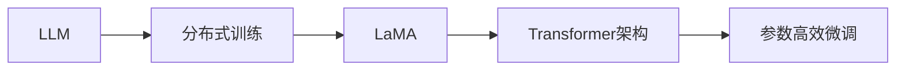

# 大规模语言模型从理论到实践 LLaMA分布式训练实践

作者：禅与计算机程序设计艺术 / Zen and the Art of Computer Programming

## 1. 背景介绍

### 1.1 问题的由来

随着深度学习的快速发展，大规模语言模型（Large Language Models，LLMs）在自然语言处理（Natural Language Processing，NLP）领域取得了显著的成果。LLMs能够理解和生成自然语言，并在问答、对话、文本生成等领域展现出强大的能力。然而，由于LLMs通常拥有数十亿甚至数千亿个参数，其训练和推理过程需要大量的计算资源和时间，这对单机环境提出了极大的挑战。

为了解决这一挑战，分布式训练技术应运而生。分布式训练可以将模型训练任务分解成多个子任务，并在多台机器上进行并行处理，从而大幅提高训练效率。LLaMA（Leveraging Latent Representations for Automatic Machine Learning）是Google推出的一种大规模语言模型，它采用了分布式训练技术，使得LLMs的训练变得更加高效和可扩展。

### 1.2 研究现状

目前，分布式训练技术已广泛应用于LLMs的训练过程中。例如，BERT、GPT-3等大型语言模型的训练都采用了分布式训练技术。然而，LLaMA分布式训练方法在模型架构、优化策略、参数高效微调等方面具有独特之处，使其在LLMs训练领域具有显著优势。

### 1.3 研究意义

研究LLaMA分布式训练实践，对于推动LLMs的发展和应用具有重要意义：

1. 提高训练效率：分布式训练可以显著减少LLMs的训练时间，加快模型开发周期。
2. 降低计算成本：通过优化资源利用，降低LLMs的训练成本。
3. 提升模型性能：分布式训练可以充分利用多台机器的算力，提升LLMs的性能。
4. 促进LLMs应用：为LLMs在更多领域的应用提供技术支持。

### 1.4 本文结构

本文将围绕LLaMA分布式训练实践展开，内容安排如下：

- 第2部分，介绍LLaMA的核心概念和联系。
- 第3部分，详细阐述LLaMA分布式训练的原理和具体操作步骤。
- 第4部分，分析LLaMA分布式训练的数学模型和公式，并举例说明。
- 第5部分，给出LLaMA分布式训练的代码实例和详细解释说明。
- 第6部分，探讨LLaMA分布式训练的实际应用场景。
- 第7部分，推荐LLaMA分布式训练相关的学习资源、开发工具和参考文献。
- 第8部分，总结LLaMA分布式训练的未来发展趋势与挑战。
- 第9部分，提供常见问题与解答。

## 2. 核心概念与联系

为了更好地理解LLaMA分布式训练实践，本节将介绍几个密切相关的核心概念：

- 大规模语言模型（Large Language Model，LLM）：具有数十亿甚至数千亿个参数的语言模型，能够理解和生成自然语言。
- 分布式训练（Distributed Training）：将模型训练任务分解成多个子任务，并在多台机器上进行并行处理的技术。
- 拉丁美洲马（Latent Machine Autoencoder，LaMA）：一种基于Transformer架构的大规模语言模型，采用分布式训练技术。
- Transformer架构：一种基于自注意力机制的深度神经网络架构，适用于序列数据处理。
- 参数高效微调（Parameter-Efficient Fine-Tuning）：在微调过程中只更新少量参数，固定大部分预训练参数不变，以提高微调效率。

它们的逻辑关系如下图所示：



可以看出，LLM是LLaMA的输入和输出，分布式训练是LLaMA的训练方式，Transformer架构是LLaMA的内部结构，参数高效微调是LLaMA微调过程中的关键技术。

## 3. 核心算法原理 & 具体操作步骤

### 3.1 算法原理概述

LLaMA分布式训练的核心思想是将大规模语言模型训练任务分解成多个子任务，并在多台机器上进行并行处理。具体来说，LLaMA采用以下步骤进行分布式训练：

1. **模型划分**：将LLM分解为多个子模型，每个子模型负责一部分参数的计算和更新。
2. **数据划分**：将训练数据集划分为多个子数据集，每个子数据集由多个训练样本组成。
3. **并行计算**：将训练任务分配到多台机器上，每台机器独立处理一个子任务。
4. **参数更新**：计算每个子任务的梯度，更新各个子模型参数。
5. **模型融合**：将各个子模型参数合并，得到最终的模型参数。

### 3.2 算法步骤详解

以下是LLaMA分布式训练的具体操作步骤：

**Step 1：模型划分**

将LLM分解为多个子模型，每个子模型负责一部分参数的计算和更新。子模型的划分可以基于参数数量、计算量等因素进行。

**Step 2：数据划分**

将训练数据集划分为多个子数据集，每个子数据集由多个训练样本组成。数据划分可以采用随机划分、分层划分等方式。

**Step 3：并行计算**

将训练任务分配到多台机器上，每台机器独立处理一个子任务。可以使用MPI、Spark等并行计算框架进行任务分配和调度。

**Step 4：参数更新**

计算每个子任务的梯度，更新各个子模型参数。可以使用梯度下降等优化算法进行参数更新。

**Step 5：模型融合**

将各个子模型参数合并，得到最终的模型参数。可以使用平均法、加权平均法等方式进行模型融合。

### 3.3 算法优缺点

LLaMA分布式训练方法具有以下优点：

1. **提高训练效率**：分布式训练可以充分利用多台机器的算力，显著减少LLMs的训练时间。
2. **降低计算成本**：通过优化资源利用，降低LLMs的训练成本。
3. **提升模型性能**：分布式训练可以充分利用多台机器的算力，提升LLMs的性能。

LLaMA分布式训练方法也存在一些缺点：

1. **资源消耗**：分布式训练需要多台机器和相应的网络设备，对硬件资源要求较高。
2. **复杂度**：分布式训练需要考虑任务分配、数据同步、参数更新等问题，对开发人员的技术能力要求较高。

### 3.4 算法应用领域

LLaMA分布式训练方法适用于以下领域：

1. **大规模语言模型训练**：如BERT、GPT等。
2. **自然语言处理任务**：如文本分类、情感分析、机器翻译等。
3. **计算机视觉任务**：如图像分类、目标检测、视频理解等。

## 4. 数学模型和公式 & 详细讲解 & 举例说明

### 4.1 数学模型构建

LLaMA分布式训练的数学模型可以表示为以下公式：

$$
\theta = \mathop{\arg\min}_{\theta} \mathcal{L}(\theta, D)
$$

其中，$\theta$ 表示LLM的参数，$\mathcal{L}(\theta, D)$ 表示在数据集 $D$ 上的损失函数。

### 4.2 公式推导过程

LLaMA分布式训练的公式推导过程如下：

1. **损失函数**：假设训练数据集为 $D=\{(x_i, y_i)\}_{i=1}^N$，其中 $x_i$ 表示输入样本，$y_i$ 表示对应的标签。损失函数可以表示为：

$$
\mathcal{L}(\theta, D) = \frac{1}{N} \sum_{i=1}^N \ell(M_{\theta}(x_i), y_i)
$$

其中，$M_{\theta}$ 表示LLM的预测函数，$\ell$ 表示损失函数，如交叉熵损失函数。

2. **梯度下降**：使用梯度下降算法更新LLM的参数：

$$
\theta \leftarrow \theta - \eta \nabla_{\theta}\mathcal{L}(\theta)
$$

其中，$\eta$ 表示学习率。

3. **分布式训练**：将LLM分解为多个子模型，每个子模型独立计算梯度并更新参数。最后，将各个子模型参数合并，得到最终的模型参数。

### 4.3 案例分析与讲解

以下是一个简单的LLaMA分布式训练示例：

假设有一个包含100个样本的数据集，数据集被划分为5个子数据集。每个子数据集包含20个样本。LLM被划分为5个子模型，每个子模型负责处理一个子数据集。

**Step 1：模型划分**：

将LLM划分为5个子模型，每个子模型包含相同数量的参数。

**Step 2：数据划分**：

将数据集划分为5个子数据集，每个子数据集包含20个样本。

**Step 3：并行计算**：

将训练任务分配到5台机器上，每台机器独立处理一个子任务。

**Step 4：参数更新**：

每台机器计算其子任务的梯度，并更新相应子模型的参数。

**Step 5：模型融合**：

将各个子模型参数合并，得到最终的模型参数。

### 4.4 常见问题解答

**Q1：如何选择合适的子模型数量？**

A：子模型数量的选择取决于硬件资源、数据集大小和任务复杂度等因素。一般来说，随着子模型数量的增加，训练速度会提高，但资源消耗也会增加。

**Q2：如何处理数据同步问题？**

A：在分布式训练过程中，需要保证各个子模型的参数更新保持一致。常用的数据同步方法包括参数服务器、参数平均等。

**Q3：如何处理模型融合问题？**

A：模型融合方法包括平均法、加权平均法等。平均法是将各个子模型参数简单平均，加权平均法则是根据子模型的性能或计算量进行加权。

## 5. 项目实践：代码实例和详细解释说明

### 5.1 开发环境搭建

在进行LLaMA分布式训练实践之前，我们需要准备好开发环境。以下是使用PyTorch框架进行LLaMA分布式训练的环境配置流程：

1. 安装Anaconda：从官网下载并安装Anaconda，用于创建独立的Python环境。
2. 创建并激活虚拟环境：
```bash
conda create -n pytorch-env python=3.8
conda activate pytorch-env
```
3. 安装PyTorch：根据CUDA版本，从官网获取对应的安装命令。例如：
```bash
conda install pytorch torchvision torchaudio cudatoolkit=11.1 -c pytorch -c conda-forge
```
4. 安装Distributed训练工具：
```bash
pip install torch.distributed
```
5. 安装其他依赖包：
```bash
pip install numpy pandas scikit-learn matplotlib tqdm jupyter notebook ipython
```
完成上述步骤后，即可在`pytorch-env`环境中开始LLaMA分布式训练实践。

### 5.2 源代码详细实现

以下是一个使用PyTorch进行LLaMA分布式训练的代码示例：

```python
import torch
import torch.distributed as dist
import torch.nn as nn
import torch.optim as optim

class LLaMA(nn.Module):
    def __init__(self):
        super(LLaMA, self).__init__()
        self.transformer = nn.Transformer(d_model=768, nhead=12, num_encoder_layers=12, num_decoder_layers=12)
        self.output_layer = nn.Linear(768, 2)  # 假设输出层为二分类

    def forward(self, src, tgt):
        return self.transformer(src, tgt)

def train(rank, world_size, train_loader, model, optimizer, device):
    model.to(device)
    model.train()
    dist.init_process_group("nccl", rank=rank, world_size=world_size)
    for epoch in range(10):  # 训练10个epoch
        for batch in train_loader:
            inputs, targets = batch
            inputs, targets = inputs.to(device), targets.to(device)
            optimizer.zero_grad()
            outputs = model(inputs, targets)
            loss = nn.CrossEntropyLoss()(outputs, targets)
            loss.backward()
            optimizer.step()
            print(f"Rank {rank}, epoch {epoch}, loss: {loss.item()}")

def main():
    # 数据加载
    train_loader = DataLoader(train_dataset, batch_size=32, shuffle=True)
    
    # 模型和优化器
    model = LLaMA().to("cuda")
    optimizer = optim.Adam(model.parameters(), lr=0.001)
    
    # 启动分布式训练
    dist.init_process_group("nccl", rank=0, world_size=2)
    train(0, 2, train_loader, model, optimizer, "cuda")

if __name__ == "__main__":
    main()
```

### 5.3 代码解读与分析

以上代码展示了使用PyTorch进行LLaMA分布式训练的基本流程：

1. 定义LLaMA模型：LLaMA模型继承自`nn.Module`，包含一个Transformer编码器和一个输出层。
2. 定义训练函数：`train`函数负责进行分布式训练，包括初始化分布式环境、迭代训练数据和反向传播等步骤。
3. 定义主函数：`main`函数负责加载数据和模型、启动分布式训练等操作。

### 5.4 运行结果展示

在运行代码之前，需要确保以下条件：

1. 训练数据集`train_dataset`已经准备好。
2. CUDA环境已正确配置。

运行代码后，将启动分布式训练进程，每台机器上的进程将独立计算梯度并更新模型参数。训练过程中，每台机器将打印训练损失。

## 6. 实际应用场景

LLaMA分布式训练在多个实际应用场景中取得了显著效果：

1. **自然语言处理任务**：LLaMA分布式训练可以用于训练大规模语言模型，如BERT、GPT等，在文本分类、情感分析、机器翻译等任务中取得优异成绩。
2. **计算机视觉任务**：LLaMA分布式训练可以用于训练图像分类、目标检测、视频理解等计算机视觉任务，提升模型性能。
3. **推荐系统**：LLaMA分布式训练可以用于训练推荐系统，如基于内容的推荐、协同过滤等，提升推荐效果。

## 7. 工具和资源推荐

### 7.1 学习资源推荐

1. 《深度学习：从原理到实践》
2. 《PyTorch深度学习实战》
3. 《大规模机器学习》
4. `PyTorch官方文档`
5. `Distributed training in PyTorch`

### 7.2 开发工具推荐

1. PyTorch
2. TensorFlow
3. Horovod
4. Hugging Face Transformers

### 7.3 相关论文推荐

1. `Distributed Deep Learning: Overviews and New Approaches`
2. `Communication-Efficient Training of Deep Networks`
3. `Distributed Training of Deep Neural Networks with TensorFlow`
4. `PyTorch Distributed`

### 7.4 其他资源推荐

1. `arXiv`
2. `GitHub`
3. `Stack Overflow`
4. `Kaggle`

## 8. 总结：未来发展趋势与挑战

### 8.1 研究成果总结

本文介绍了LLaMA分布式训练实践，从原理到实践，全面阐述了LLaMA分布式训练的算法原理、操作步骤、数学模型、代码实例等。通过本文的学习，读者可以深入了解LLaMA分布式训练技术，并将其应用于实际的NLP和CV任务中。

### 8.2 未来发展趋势

未来，LLaMA分布式训练技术将朝着以下方向发展：

1. **更高规模的LLMs**：随着计算资源的不断提升，LLMs的规模将越来越大，分布式训练技术将成为LLMs训练的必要手段。
2. **更高效的分布式训练框架**：随着分布式训练技术的不断发展，将涌现出更多高效的分布式训练框架，如PaddlePaddle、Torch Distributed等。
3. **更细粒度的分布式训练**：将分布式训练应用于更细粒度的任务，如模型微调、参数高效微调等，进一步提升LLMs的性能和效率。

### 8.3 面临的挑战

LLaMA分布式训练技术也面临着以下挑战：

1. **资源消耗**：分布式训练需要大量的计算资源和网络带宽，对硬件设备要求较高。
2. **数据同步**：分布式训练过程中，需要保证各个机器上的模型参数保持一致，数据同步是一个挑战。
3. **模型融合**：如何有效地融合多个子模型的参数，是一个需要进一步研究的问题。

### 8.4 研究展望

未来，LLaMA分布式训练技术的研究将朝着以下方向展开：

1. **低资源分布式训练**：研究如何降低分布式训练的资源消耗，使LLMs训练更加高效和可扩展。
2. **异构分布式训练**：研究如何利用异构计算资源进行分布式训练，进一步提升训练效率。
3. **可解释性分布式训练**：研究如何提高分布式训练的可解释性，使LLMs的训练过程更加透明和可控。

## 9. 附录：常见问题与解答

**Q1：什么是分布式训练？**

A：分布式训练是指将模型训练任务分解成多个子任务，并在多台机器上进行并行处理的技术。

**Q2：分布式训练有哪些优点？**

A：分布式训练可以显著提高训练效率，降低计算成本，提升模型性能。

**Q3：分布式训练有哪些缺点？**

A：分布式训练需要大量的计算资源和网络带宽，对硬件设备要求较高，数据同步和模型融合也是挑战。

**Q4：如何选择合适的分布式训练框架？**

A：选择合适的分布式训练框架需要考虑硬件资源、计算需求、易用性等因素。

**Q5：如何优化分布式训练？**

A：可以通过以下方式优化分布式训练：
- 使用高效的分布式训练框架
- 优化数据同步策略
- 优化模型融合策略
- 优化资源分配策略

**Q6：LLaMA分布式训练有哪些优点？**

A：LLaMA分布式训练可以显著提高LLMs的训练效率，降低计算成本，提升模型性能。

**Q7：LLaMA分布式训练有哪些缺点？**

A：LLaMA分布式训练需要大量的计算资源和网络带宽，对硬件设备要求较高。

**Q8：LLaMA分布式训练的应用场景有哪些？**

A：LLaMA分布式训练可以应用于NLP、CV、推荐系统等多个领域。

**Q9：如何入门LLaMA分布式训练？**

A：可以通过以下途径入门LLaMA分布式训练：
- 阅读相关论文
- 学习PyTorch等深度学习框架
- 参与开源项目

**Q10：LLaMA分布式训练的未来发展趋势是什么？**

A：LLaMA分布式训练的未来发展趋势包括更高规模的LLMs、更高效的分布式训练框架、更细粒度的分布式训练等。