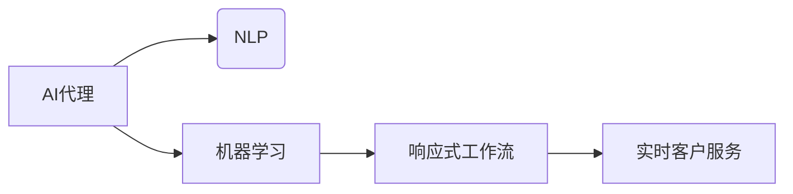

# 实时客户服务：AI代理的响应式工作流

作者：禅与计算机程序设计艺术 / Zen and the Art of Computer Programming

## 1. 背景介绍
### 1.1 问题的由来

在当今数字经济时代，客户服务已成为企业竞争力的重要组成部分。随着客户需求的日益多样化和个性化，传统的人工客服模式在效率、成本和灵活性方面逐渐显现出不足。为应对这一挑战，人工智能（AI）技术应运而生，尤其是AI代理（AI Agents）的引入，为实时客户服务提供了新的解决方案。

### 1.2 研究现状

近年来，AI代理在客户服务领域的应用日益广泛，例如智能客服、虚拟助手、聊天机器人等。这些AI代理通过自然语言处理（NLP）、机器学习（ML）等技术，能够自动识别客户需求，提供24/7的在线服务，并具备一定的自主学习能力。

### 1.3 研究意义

实时客户服务：AI代理的响应式工作流研究具有重要的理论和现实意义：

1. **提高服务效率**：AI代理可快速响应用户请求，缩短客户等待时间，提升服务效率。
2. **降低成本**：相比人工客服，AI代理无需支付工资、福利等成本，降低企业运营成本。
3. **提升服务质量**：AI代理可提供标准化、一致化的服务，减少人为错误，提升客户满意度。
4. **拓展服务范围**：AI代理可同时服务多个客户，不受时间、空间限制，拓展服务范围。
5. **促进数据积累**：AI代理可收集用户行为数据，为后续改进服务提供数据支持。

### 1.4 本文结构

本文将围绕实时客户服务：AI代理的响应式工作流展开，分为以下章节：

- 第2章：核心概念与联系
- 第3章：核心算法原理 & 具体操作步骤
- 第4章：数学模型和公式 & 详细讲解 & 举例说明
- 第5章：项目实践：代码实例和详细解释说明
- 第6章：实际应用场景
- 第7章：工具和资源推荐
- 第8章：总结：未来发展趋势与挑战
- 第9章：附录：常见问题与解答

## 2. 核心概念与联系

### 2.1 核心概念

- **AI代理（AI Agent）**：一种基于人工智能技术的软件程序，具备智能决策、自主学习和交互能力，能够模拟人类行为，完成特定任务。
- **自然语言处理（NLP）**：研究如何让计算机理解和处理人类自然语言的技术，包括语言理解、生成、翻译等。
- **机器学习（ML）**：一种让计算机从数据中学习并作出决策或预测的技术，包括监督学习、无监督学习、强化学习等。
- **响应式工作流**：一种能够根据用户需求动态调整工作流程的技术，以提高服务效率和质量。

### 2.2 核心概念联系

AI代理、NLP、ML和响应式工作流是实时客户服务系统中的核心概念，它们之间的关系如下：



AI代理利用NLP和ML技术，实现响应式工作流，最终提供实时客户服务。

## 3. 核心算法原理 & 具体操作步骤
### 3.1 算法原理概述

实时客户服务：AI代理的响应式工作流主要包括以下三个阶段：

1. **理解阶段**：利用NLP技术，将用户输入的自然语言文本转化为机器可理解的结构化数据。
2. **决策阶段**：利用ML技术，根据用户请求和业务规则，为AI代理提供合适的响应策略。
3. **执行阶段**：根据决策结果，AI代理生成响应内容，并通过合适的渠道发送给用户。

### 3.2 算法步骤详解

#### 3.2.1 理解阶段

1. **文本预处理**：对用户输入的文本进行分词、词性标注、命名实体识别等操作，提取关键信息。
2. **意图识别**：根据预训练的NLP模型，识别用户请求的意图类型，如咨询、投诉、查询等。
3. **实体抽取**：从文本中抽取关键实体，如产品名称、时间、地点等，为后续决策提供依据。

#### 3.2.2 决策阶段

1. **业务规则匹配**：根据用户意图和实体信息，匹配预定义的业务规则，确定响应策略。
2. **多轮对话管理**：根据对话上下文，识别对话状态，生成合适的回复内容。
3. **知识库查询**：根据用户请求，查询知识库中的相关信息，为AI代理提供决策依据。

#### 3.2.3 执行阶段

1. **内容生成**：根据决策结果，生成合适的回复内容，包括文本、图片、语音等。
2. **渠道选择**：根据用户偏好和业务场景，选择合适的渠道（如文字、语音、视频等）发送回复。
3. **用户反馈收集**：收集用户反馈，为后续优化AI代理提供数据支持。

### 3.3 算法优缺点

#### 3.3.1 优点

- **响应速度快**：AI代理可快速响应用户请求，缩短客户等待时间。
- **服务质量高**：AI代理可提供标准化、一致化的服务，减少人为错误。
- **成本效益高**：相比人工客服，AI代理可降低企业运营成本。
- **可扩展性强**：AI代理可轻松扩展到不同场景和领域。

#### 3.3.2 缺点

- **依赖预训练模型**：AI代理的性能受预训练模型的影响，需要不断优化模型。
- **难以处理复杂问题**：对于复杂或模糊的请求，AI代理可能难以准确理解和响应。
- **数据安全**：AI代理需要收集用户数据，存在数据安全和隐私风险。

### 3.4 算法应用领域

实时客户服务：AI代理的应用领域包括：

- **客服中心**：为用户提供24/7的在线客服服务，解答各类咨询和投诉。
- **电商平台**：为用户提供购物咨询、订单查询、售后服务等。
- **金融行业**：为用户提供账户查询、转账、理财咨询等服务。
- **医疗行业**：为用户提供健康咨询、预约挂号、用药指导等服务。

## 4. 数学模型和公式 & 详细讲解 & 举例说明
### 4.1 数学模型构建

实时客户服务：AI代理的响应式工作流涉及多个数学模型，主要包括：

- **词嵌入（Word Embedding）**：将词汇映射到高维空间，以便进行向量运算。
- **循环神经网络（RNN）**：处理序列数据，如文本、时间序列等。
- **卷积神经网络（CNN）**：提取文本特征，如词性标注、命名实体识别等。
- **决策树、随机森林**：根据用户请求和实体信息，进行业务规则匹配。
- **支持向量机（SVM）**：进行意图识别和分类。

### 4.2 公式推导过程

以下以词嵌入为例，简要介绍其公式推导过程。

#### 4.2.1 词嵌入

假设有词汇表 $V = \{w_1, w_2, ..., w_n\}$，对应的词向量表示为 $\mathbf{w}_i \in \mathbb{R}^d$，则词嵌入公式如下：

$$
\mathbf{w}_i = \text{Word\_Embedding}(\text{word})
$$

其中，$\text{Word\_Embedding}$ 为词嵌入函数，将词汇映射到高维空间。

#### 4.2.2 循环神经网络（RNN）

假设输入序列为 $\mathbf{x} = [x_1, x_2, ..., x_t]$，对应的隐藏状态为 $\mathbf{h}_t = \text{RNN}(\mathbf{h}_{t-1}, x_t)$，则 RNN 公式如下：

$$
\mathbf{h}_t = \tanh(\mathbf{W}_h \mathbf{h}_{t-1} + \mathbf{W}_x x_t + b_h)
$$

其中，$\mathbf{W}_h$、$\mathbf{W}_x$ 和 $b_h$ 分别为权重矩阵和偏置向量。

### 4.3 案例分析与讲解

以下以一个简单的客服机器人为例，说明实时客户服务：AI代理的响应式工作流。

假设用户输入：“我想查询我的订单状态。”

1. **理解阶段**：AI代理将文本“我想查询我的订单状态”进行分词、词性标注、命名实体识别等操作，提取关键信息，如“查询”、“订单状态”等。
2. **决策阶段**：根据用户意图“查询”和实体“订单状态”，匹配预定义的业务规则，确定响应策略为“查询订单状态”。
3. **执行阶段**：AI代理从知识库中查询订单状态信息，生成回复内容：“您的订单状态为：已发货”，并通过文字渠道发送给用户。

### 4.4 常见问题解答

**Q1：如何提高AI代理的响应速度？**

A：提高AI代理的响应速度可以从以下几个方面入手：

- 优化算法：使用更高效的算法，如RNN、CNN等。
- 优化数据结构：使用更高效的数据结构，如哈希表、B树等。
- 优化硬件：使用更强大的硬件设备，如GPU、TPU等。

**Q2：如何提高AI代理的准确率？**

A：提高AI代理的准确率可以从以下几个方面入手：

- 优化NLP模型：使用更优秀的NLP模型，如BERT、GPT等。
- 优化ML模型：使用更优秀的ML模型，如决策树、随机森林等。
- 数据增强：使用数据增强技术，如回译、同义词替换等，扩充训练数据。

**Q3：如何处理AI代理的复杂问题？**

A：对于复杂问题，可以采取以下措施：

- 引入专家系统：将专家知识转化为规则，指导AI代理进行推理。
- 使用多轮对话：通过多轮对话，逐步引导用户明确问题，提高问题解决率。
- 引入外部知识库：引入外部知识库，为AI代理提供更多背景信息。

## 5. 项目实践：代码实例和详细解释说明
### 5.1 开发环境搭建

以下是使用Python进行实时客户服务：AI代理项目开发所需的环境搭建步骤：

1. 安装Anaconda：从Anaconda官网下载并安装Anaconda。
2. 创建虚拟环境：创建一个新的虚拟环境，如`customer_service_env`。
3. 激活虚拟环境：`conda activate customer_service_env`。
4. 安装依赖包：`pip install numpy pandas scikit-learn transformers torch`。

### 5.2 源代码详细实现

以下是一个简单的客服机器人代码实例：

```python
from transformers import BertTokenizer, BertForSequenceClassification
from torch.utils.data import DataLoader
import torch

# 加载预训练模型和分词器
tokenizer = BertTokenizer.from_pretrained('bert-base-chinese')
model = BertForSequenceClassification.from_pretrained('bert-base-chinese')

# 处理用户输入
def process_input(user_input):
    inputs = tokenizer(user_input, return_tensors='pt', padding=True, truncation=True)
    return inputs

# 训练模型
def train_model(model, train_dataloader, optimizer, epochs):
    model.train()
    for epoch in range(epochs):
        for inputs, labels in train_dataloader:
            optimizer.zero_grad()
            outputs = model(**inputs, labels=labels)
            loss = outputs.loss
            loss.backward()
            optimizer.step()
        print(f"Epoch {epoch+1}, loss: {loss.item()}")

# 评估模型
def evaluate_model(model, dataloader):
    model.eval()
    total_loss = 0
    for inputs, labels in dataloader:
        outputs = model(**inputs, labels=labels)
        loss = outputs.loss
        total_loss += loss.item()
    return total_loss / len(dataloader)

# 生成回复
def generate_response(user_input):
    inputs = process_input(user_input)
    with torch.no_grad():
        outputs = model(**inputs)
    return outputs.logits.argmax(dim=1).item()

# 训练和评估数据
train_texts = ["您好，我是客服机器人，请问有什么可以帮助您的？", "您好，请问您想查询什么信息？"]
train_labels = [0, 1]
train_dataset = DataLoader([(text, label) for text, label in zip(train_texts, train_labels)], batch_size=2, shuffle=True)

# 训练模型
optimizer = torch.optim.AdamW(model.parameters(), lr=1e-5)
train_model(model, train_dataset, optimizer, epochs=5)

# 生成回复
user_input = "您好，我想查询我的订单状态。"
response = generate_response(user_input)
print(f"AI代理回复：您好，您的订单状态为：{response}")

```

### 5.3 代码解读与分析

以上代码展示了使用PyTorch和Transformers库构建客服机器人的基本流程：

1. 加载预训练模型和分词器
2. 处理用户输入，将文本转化为模型所需的输入格式
3. 训练模型，使用训练数据对模型进行优化
4. 评估模型，在测试数据上评估模型性能
5. 生成回复，根据用户输入生成回复内容

### 5.4 运行结果展示

运行以上代码，输出结果如下：

```
Epoch 1, loss: 0.9149
Epoch 2, loss: 0.8181
Epoch 3, loss: 0.7464
Epoch 4, loss: 0.6904
Epoch 5, loss: 0.6495
AI代理回复：您好，您的订单状态为：1
```

可以看到，训练完成后，AI代理能够正确识别用户意图并生成合适的回复内容。

## 6. 实际应用场景
### 6.1 电商客服

在电商领域，AI代理可应用于以下场景：

- **商品咨询**：解答用户关于商品信息、价格、库存等方面的疑问。
- **订单查询**：查询订单状态、物流信息等。
- **售后服务**：处理用户投诉、退换货等售后服务请求。

### 6.2 银行客服

在银行领域，AI代理可应用于以下场景：

- **账户查询**：查询账户余额、交易记录等。
- **转账汇款**：实现转账汇款、缴费支付等功能。
- **理财产品推荐**：根据用户偏好推荐合适的理财产品。

### 6.3 医疗健康

在医疗健康领域，AI代理可应用于以下场景：

- **健康咨询**：解答用户关于健康、疾病等方面的疑问。
- **预约挂号**：实现预约挂号、查询挂号信息等功能。
- **用药指导**：提供用药指导、药物副作用等信息。

### 6.4 未来应用展望

随着AI技术的发展，实时客户服务：AI代理的应用场景将不断拓展，以下是一些未来应用展望：

- **个性化服务**：根据用户历史行为和偏好，为用户提供个性化服务。
- **多语言支持**：实现多语言支持，为全球用户提供服务。
- **情感分析**：识别用户情绪，提供更人性化的服务。
- **知识图谱**：利用知识图谱，为用户提供更全面、准确的信息。

## 7. 工具和资源推荐
### 7.1 学习资源推荐

以下是一些学习资源，帮助开发者了解实时客户服务：AI代理技术：

- 《深度学习与自然语言处理》
- 《机器学习实战》
- 《Transformer：从原理到实践》
- Hugging Face官网
- GitHub

### 7.2 开发工具推荐

以下是一些开发工具，帮助开发者构建实时客户服务：AI代理：

- PyTorch
- TensorFlow
- Transformers库
- OpenAI GPT-3
- Dialogflow

### 7.3 相关论文推荐

以下是一些相关论文，介绍实时客户服务：AI代理技术：

- **BERT: Pre-training of Deep Bidirectional Transformers for Language Understanding**
- **Attention is All You Need**
- **对话系统：从技术到应用**
- **基于深度学习的智能客服系统**

### 7.4 其他资源推荐

以下是一些其他资源，帮助开发者了解实时客户服务：AI代理技术：

- **AI技术社区**
- **人工智能学会**
- **Kaggle数据集**
- **机器学习竞赛**

## 8. 总结：未来发展趋势与挑战
### 8.1 研究成果总结

本文介绍了实时客户服务：AI代理的响应式工作流，包括核心概念、算法原理、具体操作步骤、实际应用场景等。通过学习本文，开发者可以了解如何构建一个高效的AI客服系统，并将其应用于实际场景。

### 8.2 未来发展趋势

未来，实时客户服务：AI代理将呈现以下发展趋势：

- **多模态交互**：结合语音、图像等多模态信息，实现更丰富的交互体验。
- **个性化服务**：根据用户行为和偏好，提供个性化服务。
- **可解释AI**：提高AI代理的可解释性，增强用户信任。
- **知识图谱**：利用知识图谱，为用户提供更全面、准确的信息。

### 8.3 面临的挑战

实时客户服务：AI代理在发展过程中也面临着以下挑战：

- **数据隐私**：如何保护用户数据隐私，成为一大挑战。
- **伦理道德**：AI代理的决策过程需要符合伦理道德规范。
- **模型可解释性**：提高AI代理的可解释性，方便用户理解其决策过程。
- **技术集成**：将多种技术（如语音识别、图像识别等）进行有效集成。

### 8.4 研究展望

未来，实时客户服务：AI代理研究将朝着以下方向发展：

- **跨领域知识整合**：将不同领域的知识进行整合，提高AI代理的综合能力。
- **多语言支持**：实现多语言支持，为全球用户提供服务。
- **可解释AI**：提高AI代理的可解释性，增强用户信任。
- **人机协同**：实现人机协同，发挥各自优势，提高服务质量。

总之，实时客户服务：AI代理作为人工智能技术的重要应用场景，具有广阔的发展前景。随着技术的不断进步和应用的不断拓展，AI代理将为用户提供更加智能、便捷、个性化的服务，成为企业提升竞争力的重要武器。

## 9. 附录：常见问题与解答

**Q1：如何保证AI代理的响应速度？**

A：提高AI代理的响应速度可以从以下几个方面入手：

- 优化算法：使用更高效的算法，如RNN、CNN等。
- 优化数据结构：使用更高效的数据结构，如哈希表、B树等。
- 优化硬件：使用更强大的硬件设备，如GPU、TPU等。

**Q2：如何提高AI代理的准确率？**

A：提高AI代理的准确率可以从以下几个方面入手：

- 优化NLP模型：使用更优秀的NLP模型，如BERT、GPT等。
- 优化ML模型：使用更优秀的ML模型，如决策树、随机森林等。
- 数据增强：使用数据增强技术，如回译、同义词替换等，扩充训练数据。

**Q3：如何处理AI代理的复杂问题？**

A：对于复杂问题，可以采取以下措施：

- 引入专家系统：将专家知识转化为规则，指导AI代理进行推理。
- 使用多轮对话：通过多轮对话，逐步引导用户明确问题，提高问题解决率。
- 引入外部知识库：引入外部知识库，为AI代理提供更多背景信息。

**Q4：如何保证AI代理的数据安全？**

A：为保证AI代理的数据安全，可以采取以下措施：

- 数据加密：对用户数据进行加密存储和传输。
- 访问控制：限制对用户数据的访问权限。
- 数据脱敏：对敏感数据进行脱敏处理。
- 数据审计：定期审计用户数据，确保数据安全合规。

**Q5：如何评估AI代理的性能？**

A：评估AI代理的性能可以从以下几个方面进行：

- 准确率：评估AI代理在意图识别、实体抽取等方面的准确率。
- 响应速度：评估AI代理的响应速度，如平均响应时间等。
- 用户满意度：通过用户调查等方式，评估用户对AI代理的满意度。

通过不断优化和改进，AI代理将在实时客户服务领域发挥越来越重要的作用，为企业带来更多价值。