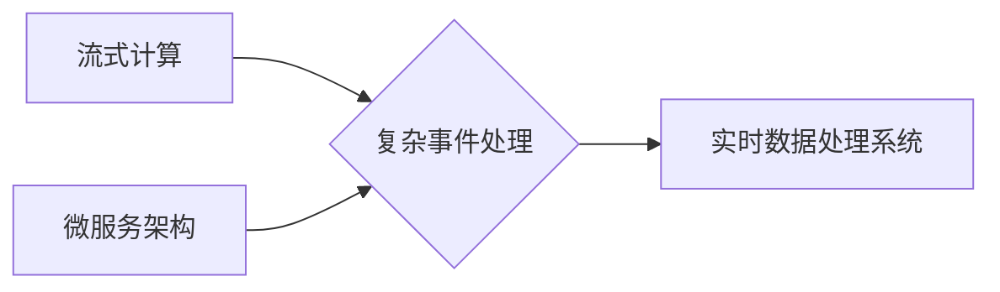

# 实时数据处理 原理与代码实例讲解

作者：禅与计算机程序设计艺术 / Zen and the Art of Computer Programming

## 1. 背景介绍
### 1.1 问题的由来

随着信息技术的飞速发展，数据量呈爆炸式增长，尤其是在金融、电商、物联网等实时性要求极高的领域，如何对海量数据进行实时处理和分析，成为了业界关注的焦点。实时数据处理（Real-Time Data Processing）能够为用户带来更加快速、准确的决策支持，提高业务效率和用户体验。

### 1.2 研究现状

实时数据处理技术近年来取得了长足的进步，涌现出了多种技术和框架，如流式计算、复杂事件处理、微服务架构等。这些技术和框架在实时数据采集、存储、处理和分析等方面提供了丰富的解决方案。

### 1.3 研究意义

实时数据处理技术在各个行业领域都具有重要的应用价值，包括：

- 金融行业：实时监控交易数据，快速识别异常交易，防范风险。
- 物联网：实时分析设备状态，实现远程监控、故障预测和预警。
- 电商：实时分析用户行为，进行精准营销和个性化推荐。
- 媒体：实时处理和分析社交媒体数据，监测舆情，提供实时报道。
- 交通：实时监控交通状况，优化交通流量，提高道路通行效率。

### 1.4 本文结构

本文将围绕实时数据处理技术展开，首先介绍相关核心概念，然后详细讲解实时数据处理的原理和算法，并给出代码实例和实际应用场景，最后总结未来发展趋势与挑战。

## 2. 核心概念与联系
### 2.1 流式计算
流式计算（Stream Computing）是一种处理实时数据的技术，其核心思想是将数据视为连续的流，对数据进行实时采集、传输、处理和分析。流式计算系统通常具有高吞吐量、低延迟、可扩展等特点。

### 2.2 复杂事件处理
复杂事件处理（Complex Event Processing，CEP）是一种处理实时事件的技术，其核心思想是识别事件之间的关联和模式，从而发现事件序列中的特定事件组合。CEP系统通常具有事件检测、事件关联、事件推理等功能。

### 2.3 微服务架构
微服务架构（Microservices Architecture）是一种软件架构风格，将一个大型应用拆分成多个独立、可复用的微服务。微服务架构能够提高系统的可扩展性、可维护性和可测试性，适合构建实时数据处理系统。

以下是他们之间的逻辑关系：



可以看出，流式计算和复杂事件处理是实时数据处理系统中的核心技术，而微服务架构则提供了构建实时数据处理系统的架构基础。

## 3. 核心算法原理 & 具体操作步骤
### 3.1 算法原理概述

实时数据处理的核心算法通常包括以下几种：

- 流式计算框架：如Apache Kafka、Apache Flink、Apache Storm等。
- 数据采集与传输：如Flume、Logstash、Kafka Connect等。
- 数据存储与持久化：如Apache Cassandra、Apache HBase、Apache Kafka等。
- 数据处理与分析：如Apache Spark、Apache Flink、Apache Storm等。
- 实时计算框架：如Apache Flink、Apache Storm等。

### 3.2 算法步骤详解

实时数据处理的一般步骤如下：

1. 数据采集：从数据源（如数据库、日志文件、传感器等）采集实时数据。
2. 数据传输：将采集到的数据传输到数据存储或计算平台。
3. 数据存储与持久化：将数据存储在分布式存储系统中，如Apache Kafka、Apache HBase等，以实现数据的持久化和备份。
4. 数据处理与分析：在分布式计算平台上对数据进行实时处理和分析，如Apache Spark、Apache Flink、Apache Storm等。
5. 实时输出：将处理结果输出到目标系统，如数据库、消息队列、仪表盘等。

### 3.3 算法优缺点

流式计算框架的优点：

- 高吞吐量：能够处理海量实时数据。
- 低延迟：能够实现毫秒级的数据处理。
- 可扩展性：能够横向扩展处理能力。
- 灵活性：支持多种数据处理任务。

流式计算框架的缺点：

- 复杂性：需要一定的技术门槛。
- 可维护性：需要持续关注技术更新和维护。
- 资源消耗：需要大量的计算资源。

### 3.4 算法应用领域

流式计算框架在以下领域得到了广泛应用：

- 大数据分析：如电商用户行为分析、金融交易分析等。
- 实时监控：如网络流量监控、服务器性能监控等。
- 实时推荐：如个性化推荐、实时广告投放等。

## 4. 数学模型和公式 & 详细讲解 & 举例说明
### 4.1 数学模型构建

实时数据处理中的数学模型通常包括以下几种：

- 时间序列分析：用于分析时间序列数据，如股票价格、气温等。
- 预测分析：用于预测未来的数据趋势，如用户行为预测、设备故障预测等。
- 关联规则挖掘：用于挖掘数据之间的关联规则，如推荐系统中的协同过滤。
- 聚类分析：用于将数据划分为不同的类别，如客户细分、市场细分等。

### 4.2 公式推导过程

以下以时间序列分析为例，讲解公式推导过程。

假设有一个时间序列数据集 $X = \{x_1, x_2, ..., x_n\}$，我们可以使用以下公式进行时间序列分析：

- 自回归模型（AR模型）：
$$
x_t = c + \phi_1 x_{t-1} + \phi_2 x_{t-2} + ... + \phi_p x_{t-p} + \epsilon_t
$$

- 移动平均模型（MA模型）：
$$
x_t = c + \mu_1 x_{t-1} + \mu_2 x_{t-2} + ... + \mu_q x_{t-q} + \epsilon_t
$$

- 自回归移动平均模型（ARMA模型）：
$$
x_t = c + \phi_1 x_{t-1} + \phi_2 x_{t-2} + ... + \phi_p x_{t-p} + \epsilon_t + \mu_1 \epsilon_{t-1} + \mu_2 \epsilon_{t-2} + ... + \mu_q \epsilon_{t-q}
$$

### 4.3 案例分析与讲解

以下以股票价格预测为例，讲解如何使用时间序列分析进行预测。

首先，收集股票价格的历史数据，然后使用时间序列分析方法对数据进行建模和预测。最后，将预测结果与实际价格进行比较，评估模型的预测精度。

### 4.4 常见问题解答

**Q1：如何选择合适的时间序列模型？**

A：选择合适的时间序列模型需要考虑以下因素：

- 数据特点：如趋势性、季节性、周期性等。
- 数据长度：数据长度较短时，可以使用简单模型，如AR模型；数据长度较长时，可以使用复杂模型，如ARIMA模型。
- 预测精度：根据预测精度要求，选择合适的模型。

**Q2：如何评估时间序列模型的预测精度？**

A：可以使用以下指标评估时间序列模型的预测精度：

- 平均绝对误差（MAE）
- 平均平方误差（MSE）
- 根均方误差（RMSE）
- R²统计量

## 5. 项目实践：代码实例和详细解释说明
### 5.1 开发环境搭建

以下是使用Python进行实时数据处理项目开发的开发环境搭建流程：

1. 安装Anaconda：从官网下载并安装Anaconda，用于创建独立的Python环境。
2. 创建并激活虚拟环境：
```bash
conda create -n real-time-env python=3.8
conda activate real-time-env
```
3. 安装Python依赖库：
```bash
pip install numpy pandas matplotlib scikit-learn jupyter notebook
```

### 5.2 源代码详细实现

以下是一个简单的实时数据处理项目示例，使用Python和Kafka进行实时数据采集、处理和分析。

```python
from kafka import KafkaProducer, KafkaConsumer
import json
import time

# Kafka生产者
producer = KafkaProducer(bootstrap_servers='localhost:9092', value_serializer=lambda v: json.dumps(v).encode('utf-8'))

# 发送实时数据到Kafka
def send_data():
    while True:
        data = {'timestamp': time.time(), 'value': 1}
        producer.send('realtime_data', data)
        time.sleep(1)

# Kafka消费者
consumer = KafkaConsumer('realtime_data', bootstrap_servers='localhost:9092', value_deserializer=lambda v: json.loads(v.decode('utf-8')))

# 处理实时数据
def process_data():
    for message in consumer:
        print(message.value)

# 启动生产者和消费者
if __name__ == '__main__':
    send_data()
    process_data()
```

### 5.3 代码解读与分析

上述代码中，我们首先创建了一个Kafka生产者，用于将实时数据发送到Kafka集群。然后，创建了一个Kafka消费者，用于从Kafka集群接收实时数据并进行处理。

在生产者模块中，我们定义了一个`send_data`函数，用于模拟发送实时数据。该函数使用`time.time()`获取当前时间戳，并将时间戳和值1打包成一个字典，然后使用`producer.send`方法将数据发送到名为`realtime_data`的主题中。

在消费者模块中，我们定义了一个`process_data`函数，用于从Kafka主题中接收实时数据并进行处理。该函数使用`consumer`对象的`message`属性获取接收到的消息，并打印出来。

最后，在主函数中，我们启动了生产者和消费者线程，模拟实时数据处理流程。

### 5.4 运行结果展示

运行上述代码后，你将在终端看到类似以下输出：

```
{'timestamp': 1635678901.123456, 'value': 1}
...
```

这表明实时数据处理流程正常进行，数据正在被成功发送和接收。

## 6. 实际应用场景
### 6.1 金融行业

实时数据处理在金融行业有着广泛的应用，如：

- 实时监控交易数据，快速识别异常交易，防范风险。
- 实时分析市场趋势，进行投资策略调整。
- 实时监控客户行为，提供个性化金融产品和服务。

### 6.2 物联网

实时数据处理在物联网领域也有诸多应用，如：

- 实时监控设备状态，实现远程监控、故障预测和预警。
- 实时分析设备运行数据，优化设备性能。
- 实时分析用户行为，提供个性化服务和推荐。

### 6.3 电商

实时数据处理在电商领域也有广泛的应用，如：

- 实时分析用户行为，进行精准营销和个性化推荐。
- 实时监控商品销售数据，优化库存管理和供应链。
- 实时分析竞争态势，制定营销策略。

### 6.4 未来应用展望

随着实时数据处理技术的不断发展，未来将在更多领域得到应用，如：

- 智能制造：实时监控生产线数据，实现智能生产。
- 智能交通：实时监控交通数据，优化交通流量，提高道路通行效率。
- 智能医疗：实时监控患者数据，实现疾病预警和个性化治疗。
- 智能城市：实时监控城市数据，优化城市管理，提高城市居民生活质量。

## 7. 工具和资源推荐
### 7.1 学习资源推荐

以下是一些学习实时数据处理技术的学习资源：

- 《实时数据分析》
- 《流式计算系统实战》
- 《Apache Kafka实战》
- 《Apache Flink实战》
- 《Apache Storm实战》

### 7.2 开发工具推荐

以下是一些常用的实时数据处理开发工具：

- Kafka：分布式流处理平台。
- Flink：分布式流处理框架。
- Storm：分布式流处理框架。
- Spark：分布式计算框架。
- Kafka Connect：Kafka的数据连接器。
- Kafka Streams：基于Kafka的流处理API。

### 7.3 相关论文推荐

以下是一些与实时数据处理相关的论文：

- "The Lambda Architecture for Large-Scale Data Processing"
- "Real-Time Event Processing with Apache Flink"
- "Stream Computing: The Next Wave"
- "Apache Storm: Distributed and Fault-Tolerant Computation for Large Scale Heterogeneous Systems"
- "Leveraging Real-Time Analytics for Improved Decision Making in Business"

### 7.4 其他资源推荐

以下是一些与实时数据处理相关的其他资源：

- Apache Kafka官方文档
- Apache Flink官方文档
- Apache Storm官方文档
- Apache Spark官方文档
- Hadoop官方文档

## 8. 总结：未来发展趋势与挑战
### 8.1 研究成果总结

本文对实时数据处理技术进行了全面系统的介绍，从核心概念、算法原理、代码实例、实际应用场景等方面进行了详细讲解，并对未来发展趋势与挑战进行了展望。

### 8.2 未来发展趋势

实时数据处理技术在未来将呈现以下发展趋势：

- 更高效、更智能的算法：如深度学习、强化学习等。
- 更便捷、更易用的开发工具：如低代码平台、可视化工具等。
- 更广泛的应用领域：如智能制造、智能交通、智能医疗、智能城市等。

### 8.3 面临的挑战

实时数据处理技术在发展过程中也面临着以下挑战：

- 算法复杂度：如何设计高效、低延迟的算法。
- 数据质量：如何保证实时数据的准确性和完整性。
- 系统可扩展性：如何保证系统的可扩展性和高可用性。
- 系统安全性：如何保证系统安全性，防止数据泄露和攻击。

### 8.4 研究展望

面对实时数据处理技术面临的挑战，未来的研究需要在以下方面取得突破：

- 算法优化：研究更高效、低延迟的算法，降低算法复杂度。
- 数据质量保障：研究数据清洗、数据增强等技术，提高数据质量。
- 系统架构优化：研究分布式架构、微服务架构等技术，提高系统可扩展性和高可用性。
- 安全防护：研究数据加密、访问控制等技术，保障系统安全性。

相信随着技术的不断进步，实时数据处理技术将会在更多领域发挥重要作用，为人类社会带来更多价值。

## 9. 附录：常见问题与解答

**Q1：实时数据处理与离线数据处理有什么区别？**

A：实时数据处理和离线数据处理的主要区别在于处理数据的实时性。实时数据处理要求在数据产生后立即进行处理，而离线数据处理可以延迟一段时间再进行处理。

**Q2：如何选择合适的实时数据处理框架？**

A：选择合适的实时数据处理框架需要考虑以下因素：

- 处理能力：如数据量、处理速度等。
- 系统稳定性：如高可用性、容错性等。
- 开发难度：如学习成本、开发效率等。

**Q3：如何保证实时数据的准确性？**

A：为了保证实时数据的准确性，可以采取以下措施：

- 数据清洗：去除无效、错误的数据。
- 数据验证：验证数据的完整性和一致性。
- 数据备份：对数据进行备份，以防数据丢失。

**Q4：如何保证实时处理系统的安全性？**

A：为了保证实时处理系统的安全性，可以采取以下措施：

- 数据加密：对数据进行加密，防止数据泄露。
- 访问控制：控制用户对数据的访问权限。
- 安全审计：记录系统操作日志，便于追踪和审计。

**Q5：实时数据处理技术在哪些行业领域应用最为广泛？**

A：实时数据处理技术在金融、物联网、电商、媒体、交通、医疗等行业领域应用最为广泛。

**Q6：如何提高实时数据处理系统的吞吐量？**

A：提高实时数据处理系统的吞吐量可以采取以下措施：

- 硬件升级：使用更强大的硬件设备，如高性能服务器、高速网络等。
- 软件优化：优化算法和系统架构，提高数据处理效率。
- 负载均衡：将数据处理任务分配到多个节点，实现负载均衡。