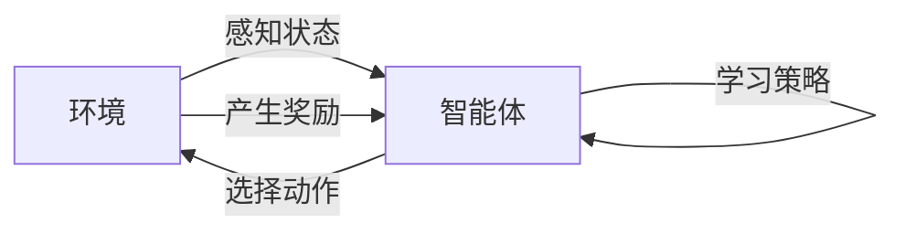

# 强化学习中的探索与利用原理与代码实战案例讲解

作者：禅与计算机程序设计艺术 / Zen and the Art of Computer Programming

## 1. 背景介绍
### 1.1 问题的由来

强化学习（Reinforcement Learning，RL）是机器学习领域中一种重要的学习范式，它模拟了智能体在环境中通过与环境的交互来学习如何获取最大奖励的过程。与监督学习和无监督学习不同，强化学习中的学习目标并不是直接从数据中学习特征或模式，而是通过与环境交互，不断尝试不同的动作，从而学习到最优策略。

强化学习自1950年代诞生以来，在游戏、机器人控制、自动驾驶、推荐系统等领域取得了显著的成果。然而，由于强化学习本身的复杂性，要想掌握其原理并应用于实际项目中，需要深入理解其核心概念、算法原理以及实践技巧。

### 1.2 研究现状

近年来，随着深度学习技术的飞速发展，强化学习也迎来了新的春天。深度强化学习（Deep Reinforcement Learning，DRL）结合了深度学习与强化学习，通过神经网络来表示状态和动作，极大地提升了强化学习的效率和效果。目前，深度强化学习在多个领域都取得了突破性进展，如AlphaGo战胜世界围棋冠军、OpenAI的Dota2五人团队战胜顶级职业选手等。

### 1.3 研究意义

强化学习作为一种极具潜力的学习范式，具有以下重要意义：

- **自适应性强**：强化学习能够根据环境变化动态调整策略，适应不同的场景和需求。
- **泛化能力强**：通过学习到通用策略，强化学习可以应用于解决各种类似问题。
- **交互性强**：强化学习能够与真实环境进行交互，实现真正意义上的智能决策。

### 1.4 本文结构

本文将系统地介绍强化学习中的探索与利用原理，并给出代码实战案例讲解。内容安排如下：

- 第2部分，介绍强化学习中的核心概念与联系。
- 第3部分，详细阐述强化学习的算法原理和具体操作步骤。
- 第4部分，讲解强化学习中常用的数学模型和公式，并结合实例进行说明。
- 第5部分，给出强化学习项目的代码实例，并对关键代码进行解读和分析。
- 第6部分，探讨强化学习在实际应用场景中的应用案例。
- 第7部分，推荐强化学习相关的学习资源、开发工具和参考文献。
- 第8部分，总结全文，展望强化学习的未来发展趋势与挑战。

## 2. 核心概念与联系

为更好地理解强化学习，本节将介绍几个核心概念及其相互关系。

### 2.1 环境与状态

强化学习中的环境（Environment）可以看作是一个实体，它包含一系列的状态（State）和动作（Action）。智能体（Agent）通过与环境交互，感知当前状态，并选择动作，从而影响环境状态的变化。

- **状态**：环境当前的状态描述了智能体所处的环境情况，通常用向量表示。
- **动作**：智能体可以采取的行动，用于改变环境状态。
- **奖励**：智能体执行动作后，环境会给予智能体一个奖励，用于评估智能体的行为。
- **终止状态**：当智能体达到终止状态时，强化学习过程结束。

### 2.2 智能体与策略

智能体是强化学习中的核心组件，它负责感知环境状态、选择动作、学习策略等。智能体的目标是通过学习到最优策略，最大化累积奖励。

- **策略**：智能体根据当前状态选择的动作概率分布，用于指导智能体的行为。
- **价值函数**：描述了智能体在特定状态下采取特定动作的预期长期奖励。
- **模型**：描述了环境状态转移和奖励的函数关系。

### 2.3 探索与利用

强化学习中的探索（Exploration）和利用（Exploitation）是两个重要的概念。探索是指智能体尝试之前未尝试过的动作，以获得更多关于环境的了解。利用是指智能体根据已获得的经验选择最优动作。

- **探索策略**：用于控制智能体进行探索行为，如ε-贪婪策略、UCB算法等。
- **利用策略**：用于从已获得的经验中选择最优动作，如贪婪策略、Q-learning算法等。

### 2.4 关系图

以下展示了上述概念之间的逻辑关系：



## 3. 核心算法原理 & 具体操作步骤
### 3.1 算法原理概述

强化学习中的核心算法主要包括：

- **Q-learning**：通过学习Q值函数，在给定状态下选择动作，并不断更新Q值，最终学习到最优策略。
- **深度Q网络（DQN）**：结合深度学习技术，使用神经网络来近似Q值函数，提高了强化学习的效率。
- **策略梯度方法**：直接学习策略参数，而非Q值函数，适用于连续动作空间。
- **信任域策略优化（Trust Region Policy Optimization，TRPO）**：通过控制策略梯度范数，提高策略梯度的稳定性，适用于复杂环境。

### 3.2 算法步骤详解

以下是强化学习的基本步骤：

**Step 1: 初始化**

- 初始化智能体、环境、策略、值函数或策略参数等。

**Step 2: 运行循环**

- 持续运行以下步骤，直到满足退出条件：
  - 智能体感知当前状态。
  - 智能体根据当前状态选择动作。
  - 环境根据动作产生下一个状态和奖励。
  - 更新策略、值函数或策略参数。

**Step 3: 退出循环**

- 当满足以下条件之一时，退出循环：
  - 达到最大迭代次数。
  - 智能体达到终止状态。
  - 策略收敛。

### 3.3 算法优缺点

以下是几种常见强化学习算法的优缺点：

| 算法 | 优点 | 缺点 |
|---|---|---|
| Q-learning | 简单、易于理解 | 慢速收敛、需要大量样本 |
| DQN | 高效、能够处理高维状态空间 | 需要经验回放、不稳定 |
| TRPO | 高效、稳定 | 梯度范数计算复杂、参数调整困难 |

### 3.4 算法应用领域

强化学习在以下领域取得了显著成果：

- **游戏**：如Atari游戏、围棋、Dota2等。
- **机器人控制**：如机器人行走、抓取、导航等。
- **自动驾驶**：如自动驾驶车辆、无人机等。
- **推荐系统**：如个性化推荐、广告推荐等。
- **金融领域**：如量化交易、风险评估等。

## 4. 数学模型和公式 & 详细讲解 & 举例说明
### 4.1 数学模型构建

强化学习中的数学模型主要包括：

- **Q值函数**：$Q(s,a)$ 表示智能体在状态 $s$ 下采取动作 $a$ 的预期奖励。
- **策略**：$\pi(a|s)$ 表示智能体在状态 $s$ 下采取动作 $a$ 的概率。
- **价值函数**：$V(s)$ 表示智能体在状态 $s$ 下的长期奖励。

### 4.2 公式推导过程

以下是Q-learning算法中Q值更新的公式：

$$
Q(s,a) \leftarrow Q(s,a) + \alpha [R(s',a) + \gamma \max_{a'} Q(s',a') - Q(s,a)]
$$

其中：

- $Q(s,a)$ 为当前Q值。
- $R(s',a)$ 为采取动作 $a$ 后获得的奖励。
- $\gamma$ 为折扣因子，用于衡量未来奖励的重要性。
- $\alpha$ 为学习率，用于控制Q值更新的步长。

### 4.3 案例分析与讲解

以下以经典的CartPole问题为例，讲解Q-learning算法的实现过程。

**问题描述**：智能体控制一个秋千，需要通过调整推杆方向来保持平衡。智能体的目标是让秋千尽可能长时间地保持平衡。

**环境状态**：状态向量 $\mathbf{s} = [x, \dot{x}]$，其中 $x$ 为秋千的偏移量，$\dot{x}$ 为偏移量的变化率。

**动作空间**：动作空间 $\mathcal{A} = \{-1, 0, 1\}$，分别表示向左、保持和向右推杆。

**奖励函数**：当秋千保持平衡时，给予奖励 +1，否则给予奖励 -1。

以下是Q-learning算法的Python实现：

```python
import numpy as np

def q_learning(alpha, gamma, epsilon, num_episodes):
    """Q-learning算法实现

    Args:
        alpha: 学习率
        gamma: 折扣因子
        epsilon: 探索率
        num_episodes: 迭代次数

    Returns:
        Q值函数
    """
    num_states = 2
    num_actions = 3
    q_table = np.zeros((num_states, num_actions))

    for _ in range(num_episodes):
        state = 0
        done = False

        while not done:
            if np.random.rand() < epsilon:
                action = np.random.randint(num_actions)
            else:
                action = np.argmax(q_table[state])

            next_state, reward, done = environment.step(action)
            q_table[state, action] = q_table[state, action] + alpha * (reward + gamma * np.max(q_table[next_state]) - q_table[state, action])

            state = next_state

    return q_table

# 创建环境对象
environment = CartPoleEnvironment()

# 运行Q-learning算法
q_table = q_learning(alpha=0.1, gamma=0.99, epsilon=0.1, num_episodes=1000)

# 打印Q值函数
print(q_table)
```

### 4.4 常见问题解答

**Q1：什么是折扣因子？**

A：折扣因子（Discount Factor）用于衡量未来奖励的重要性。它表示当前奖励对未来奖励的影响程度。通常取值范围为0到1之间，取值越小，未来奖励对当前决策的影响越小。

**Q2：如何选择合适的折扣因子？**

A：折扣因子的选择取决于具体问题的背景和需求。一般来说，当问题的长期影响较大时，可以选择较小的折扣因子，如0.9或0.95。

**Q3：什么是探索率？**

A：探索率（Exploration Rate）用于控制智能体进行探索行为的比例。当探索率较高时，智能体会尝试更多不同的动作，以获得更多关于环境的了解；当探索率较低时，智能体会更倾向于利用已有经验选择动作。

**Q4：如何选择合适的探索率？**

A：探索率的选择取决于具体问题的背景和需求。一般来说，在问题的早期阶段，可以选择较高的探索率，以获得更多关于环境的了解；在问题的后期阶段，可以选择较低的探索率，以利用已有经验选择动作。

## 5. 项目实践：代码实例和详细解释说明
### 5.1 开发环境搭建

在进行强化学习项目实践之前，我们需要搭建以下开发环境：

- 安装Python：从官网下载并安装Python 3.6及以上版本。
- 安装PyTorch：使用pip安装PyTorch库。
- 安装其他依赖库：安装numpy、tensorboard、matplotlib等库。

### 5.2 源代码详细实现

以下是一个使用PyTorch实现的简单强化学习项目，基于CartPole环境进行Q-learning算法训练。

```python
import torch
import torch.nn as nn
import torch.optim as optim
import gym

class QNetwork(nn.Module):
    """定义Q网络"""
    def __init__(self, state_dim, action_dim):
        super(QNetwork, self).__init__()
        self.fc1 = nn.Linear(state_dim, 64)
        self.fc2 = nn.Linear(64, action_dim)

    def forward(self, x):
        x = torch.relu(self.fc1(x))
        return self.fc2(x)

def train_q_network(q_network, optimizer, criterion, state, action, reward, next_state, done, gamma):
    """训练Q网络"""
    state = torch.FloatTensor(state)
    action = torch.LongTensor([action])
    reward = torch.FloatTensor([reward])
    next_state = torch.FloatTensor(next_state)
    done = torch.FloatTensor([done])

    q_values = q_network(state).gather(1, action)
    next_q_values = torch.max(q_network(next_state), dim=1)[0]
    expected_q_values = reward + (1 - done) * gamma * next_q_values

    loss = criterion(q_values, expected_q_values)
    optimizer.zero_grad()
    loss.backward()
    optimizer.step()

    return loss.item()

# 创建环境对象
environment = gym.make('CartPole-v1')

# 创建Q网络
q_network = QNetwork(state_dim=2, action_dim=3)

# 定义优化器和损失函数
optimizer = optim.Adam(q_network.parameters(), lr=0.01)
criterion = nn.MSELoss()

# 训练Q网络
num_episodes = 1000
gamma = 0.99

for episode in range(num_episodes):
    state = environment.reset()
    done = False

    while not done:
        environment.render()

        with torch.no_grad():
            q_values = q_network(torch.FloatTensor(state))
        action = torch.argmax(q_values).item()
        next_state, reward, done, _ = environment.step(action)
        train_q_network(q_network, optimizer, criterion, state, action, reward, next_state, done, gamma)

        state = next_state
```

### 5.3 代码解读与分析

- **QNetwork类**：定义了Q网络的结构，包含两个全连接层。
- **train_q_network函数**：用于训练Q网络，包括前向传播、反向传播和参数更新。
- **训练循环**：初始化环境、Q网络、优化器和损失函数，然后进行num_episodes次迭代，每次迭代中：
  - 初始化状态并渲染环境画面。
  - 使用Q网络预测动作并执行动作。
  - 获取下一个状态、奖励和终止标志。
  - 训练Q网络。

### 5.4 运行结果展示

运行上述代码，可以看到CartPole环境中的秋千在经过一定次数的训练后，可以保持较长时间的平衡。

## 6. 实际应用场景
### 6.1 游戏领域

强化学习在游戏领域取得了显著的成果，如：

- **Atari游戏**：AlphaGo战胜世界围棋冠军李世石，AlphaFold2在蛋白质折叠预测任务中取得优异成绩。
- **Dota2**：OpenAI的Dota2五人团队战胜顶级职业选手。
- **其他游戏**：如卡丁车、赛车、飞行模拟等。

### 6.2 机器人控制领域

强化学习在机器人控制领域也取得了显著成果，如：

- **机器人行走**：使用强化学习控制机器人进行行走、跳跃、避障等动作。
- **机器人抓取**：使用强化学习控制机械臂进行物品抓取、放置等操作。
- **机器人导航**：使用强化学习控制机器人自主在复杂环境中导航。

### 6.3 自动驾驶领域

强化学习在自动驾驶领域也具有广阔的应用前景，如：

- **自动驾驶车辆**：使用强化学习控制车辆进行自动驾驶。
- **无人机**：使用强化学习控制无人机进行自主飞行、避障、任务执行等。
- **机器人巡检**：使用强化学习控制机器人进行管道、桥梁等设施的巡检。

### 6.4 推荐系统领域

强化学习在推荐系统领域也具有潜在的应用价值，如：

- **个性化推荐**：使用强化学习根据用户的历史行为和兴趣进行个性化推荐。
- **广告推荐**：使用强化学习根据用户的历史行为和兴趣进行广告推荐。
- **新闻推荐**：使用强化学习根据用户的历史行为和兴趣进行新闻推荐。

### 6.5 金融领域

强化学习在金融领域也具有潜在的应用价值，如：

- **量化交易**：使用强化学习进行股票、期货等金融产品的交易。
- **风险评估**：使用强化学习进行信贷、投资等金融产品的风险评估。
- **风险管理**：使用强化学习进行金融市场风险管理。

## 7. 工具和资源推荐
### 7.1 学习资源推荐

以下是一些学习强化学习的优质资源：

- **书籍**：
  - 《强化学习：原理与实践》
  - 《深度强化学习》
- **在线课程**：
  - Coursera的《深度学习与强化学习专项课程》
  - fast.ai的《强化学习专项课程》
- **论文**：
  - Q-learning
  - Deep Q-Network
  - Policy Gradient Methods
  - Trust Region Policy Optimization

### 7.2 开发工具推荐

以下是一些用于强化学习开发的常用工具：

- **PyTorch**：开源的深度学习框架，支持强化学习。
- **OpenAI Gym**：开源的强化学习环境库。
- **Ray**：分布式训练框架，支持强化学习。
- **stable-baselines**：基于PyTorch的强化学习库。

### 7.3 相关论文推荐

以下是一些强化学习领域的经典论文：

- Q-learning
- Deep Q-Network
- Policy Gradient Methods
- Trust Region Policy Optimization
- Asynchronous Advantage Actor-Critic
- Proximal Policy Optimization

### 7.4 其他资源推荐

以下是一些其他学习资源：

- **arXiv**：论文预印本平台，可以找到最新的强化学习论文。
- **GitHub**：开源代码平台，可以找到丰富的强化学习代码和项目。
- **强化学习社区**：如Reddit的r/reinforcementlearning、知乎的强化学习话题等。

## 8. 总结：未来发展趋势与挑战
### 8.1 研究成果总结

本文系统地介绍了强化学习中的探索与利用原理，并给出了代码实战案例讲解。通过本文的学习，读者可以了解到强化学习的基本概念、算法原理、应用场景以及实践技巧。

### 8.2 未来发展趋势

未来，强化学习将在以下方面取得进一步发展：

- **多智能体强化学习**：研究多个智能体如何在同一环境中协同学习，实现合作、竞争或混合策略。
- **强化学习与控制理论结合**：将强化学习与控制理论相结合，解决更复杂的控制问题，如连续控制、非线性控制等。
- **强化学习与决策理论结合**：将强化学习与决策理论相结合，解决更复杂的决策问题，如多目标优化、风险控制等。
- **强化学习与知识表示结合**：将强化学习与知识表示相结合，使智能体能够更好地利用已有知识进行学习。

### 8.3 面临的挑战

尽管强化学习取得了显著成果，但仍然面临以下挑战：

- **样本效率**：强化学习需要大量样本才能获得良好的性能，如何提高样本效率是一个重要的研究方向。
- **收敛速度**：强化学习的收敛速度较慢，如何加速收敛是一个重要的研究方向。
- **鲁棒性**：强化学习模型对环境的干扰和变化较为敏感，如何提高鲁棒性是一个重要的研究方向。
- **可解释性**：强化学习模型的决策过程往往难以解释，如何提高可解释性是一个重要的研究方向。

### 8.4 研究展望

未来，随着研究的不断深入，强化学习将在更多领域得到应用，为人类创造更多的价值。同时，我们也需要关注强化学习在伦理、安全等方面的问题，确保其健康、可持续发展。

## 9. 附录：常见问题与解答

**Q1：强化学习与监督学习有什么区别？**

A：强化学习与监督学习的区别主要体现在学习目标和数据上。强化学习的学习目标是学习到最优策略，而监督学习的学习目标是学习到数据中的特征和模式。在数据方面，强化学习通常需要与环境的交互，而监督学习需要大量的标注数据。

**Q2：什么是探索与利用？**

A：探索与利用是强化学习中的两个重要概念。探索是指智能体尝试之前未尝试过的动作，以获得更多关于环境的了解。利用是指智能体根据已获得的经验选择最优动作。

**Q3：如何提高强化学习的样本效率？**

A：提高强化学习的样本效率可以从以下方面入手：
- 使用数据增强技术，如回放记忆、优先级采样等。
- 使用迁移学习技术，如预训练模型、多智能体学习等。
- 使用强化学习与模拟环境相结合，如模拟环境、强化学习与强化学习等。

**Q4：如何提高强化学习的收敛速度？**

A：提高强化学习的收敛速度可以从以下方面入手：
- 使用高效的优化算法，如Adam、SGD等。
- 使用梯度估计技术，如蒙特卡洛树搜索、UCB算法等。
- 使用异步训练方法，如异步优势演员-评论家算法、异步优势演员-评论家2算法等。

**Q5：如何提高强化学习模型的鲁棒性？**

A：提高强化学习模型的鲁棒性可以从以下方面入手：
- 使用对抗训练技术，如对抗样本生成、对抗训练等。
- 使用迁移学习技术，如预训练模型、多智能体学习等。
- 使用鲁棒性评估技术，如鲁棒性测试、鲁棒性分析等。

**Q6：如何提高强化学习模型的可解释性？**

A：提高强化学习模型的可解释性可以从以下方面入手：
- 使用可解释性方法，如注意力机制、可解释性分析等。
- 使用可视化技术，如状态可视化、动作可视化等。
- 使用知识表示技术，如知识图谱、规则库等。

作者：禅与计算机程序设计艺术 / Zen and the Art of Computer Programming