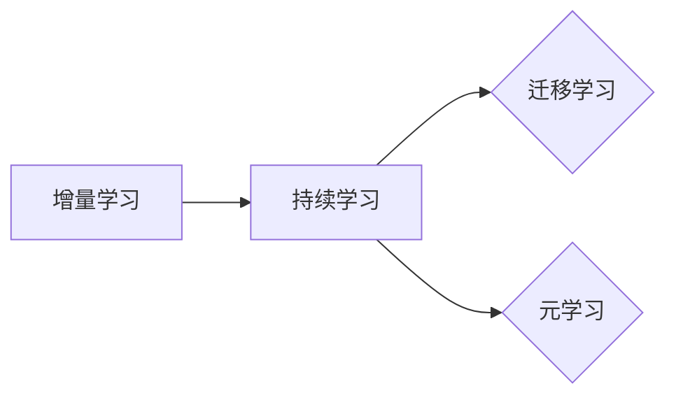

# 持续学习Continual Learning原理与代码实例讲解

作者：禅与计算机程序设计艺术 / Zen and the Art of Computer Programming

## 1. 背景介绍
### 1.1 问题的由来

随着机器学习技术的快速发展，深度学习模型在图像识别、自然语言处理等领域取得了显著的成果。然而，这些模型往往只能针对单一任务进行学习，无法很好地处理新任务或持续学习新知识。例如，当我们在学习一个图像分类任务后，再学习一个新图像分类任务时，原有的模型性能往往会显著下降，这种现象被称为“灾难性遗忘”。因此，如何让模型能够持续学习新任务，同时保持旧任务的学习成果，成为了机器学习领域的一个重要研究方向。

### 1.2 研究现状

持续学习（Continual Learning）是近年来机器学习领域的一个热点研究方向，旨在研究如何在保持已有知识的基础上，学习新的任务。目前，持续学习的研究主要集中在以下几个方面：

- **增量学习（Incremental Learning）**：通过逐渐增加新的数据或任务，让模型逐步学习新知识，而不会遗忘旧知识。
- **迁移学习（Transfer Learning）**：利用已有知识来帮助新任务的学习，从而减少对新数据的依赖。
- **元学习（Meta-Learning）**：通过学习如何学习来提高模型的泛化能力和适应性。

### 1.3 研究意义

持续学习技术对于以下场景具有重要意义：

- **终身学习**：在人类学习和工作中，需要不断学习新的知识和技能。持续学习技术可以帮助机器模拟人类的终身学习过程。
- **智能系统**：许多智能系统需要能够适应新的环境和任务，持续学习技术可以帮助这些系统实现这一目标。
- **知识更新**：随着知识更新的速度加快，持续学习技术可以帮助模型快速适应新的知识。

### 1.4 本文结构

本文将介绍持续学习的原理、方法、代码实例和实际应用场景。文章结构如下：

- **第2章**：介绍持续学习的核心概念和联系。
- **第3章**：阐述持续学习的核心算法原理和具体操作步骤。
- **第4章**：讲解持续学习的数学模型和公式，并结合实例进行说明。
- **第5章**：给出持续学习的代码实例，并对其进行详细解释和分析。
- **第6章**：探讨持续学习在实际应用场景中的应用，并展望其未来发展趋势。
- **第7章**：推荐持续学习相关的学习资源、开发工具和参考文献。
- **第8章**：总结持续学习的研究成果和未来发展趋势。
- **第9章**：附录，提供常见问题与解答。

## 2. 核心概念与联系

为了更好地理解持续学习，本节将介绍几个核心概念：

- **增量学习（Incremental Learning）**：在已有知识的基础上，逐步学习新的知识，同时保持已有知识。
- **迁移学习（Transfer Learning）**：将已有知识应用到新的任务中，从而减少对新数据的依赖。
- **元学习（Meta-Learning）**：通过学习如何学习来提高模型的泛化能力和适应性。
- **持续学习（Continual Learning）**：在保持已有知识的基础上，持续学习新的知识。

它们的逻辑关系如下图所示：



可以看出，增量学习是持续学习的基础，迁移学习和元学习是持续学习的两种重要技术手段。通过结合这些技术，可以实现有效的持续学习。

## 3. 核心算法原理 & 具体操作步骤
### 3.1 算法原理概述

持续学习的核心思想是，在保持已有知识的基础上，学习新的知识。具体来说，就是通过以下步骤实现：

1. **初始化模型**：使用已有的知识初始化模型参数。
2. **学习新任务**：在新任务的数据上训练模型，同时使用一些技术来防止模型遗忘旧知识。
3. **评估模型**：评估模型在旧任务和新任务上的性能。

### 3.2 算法步骤详解

持续学习的具体操作步骤如下：

1. **数据准备**：准备包含多个任务的数据集。
2. **模型初始化**：使用已有的知识初始化模型参数。
3. **任务选择**：选择要学习的任务。
4. **数据预处理**：对任务数据进行预处理，如数据清洗、归一化等。
5. **模型训练**：在任务数据上训练模型，同时使用一些技术来防止模型遗忘旧知识。
6. **模型评估**：评估模型在旧任务和新任务上的性能。
7. **模型更新**：根据评估结果更新模型参数。

### 3.3 算法优缺点

持续学习算法的优点如下：

- **保持旧知识**：在保持已有知识的基础上，学习新的知识，从而提高模型的泛化能力。
- **减少数据依赖**：通过迁移学习和元学习，减少对新数据的依赖。

然而，持续学习算法也存在一些缺点：

- **计算复杂度高**：持续学习需要同时处理多个任务，计算复杂度较高。
- **模型性能下降**：在某些情况下，持续学习可能导致模型性能下降。

### 3.4 算法应用领域

持续学习算法可以应用于以下领域：

- **图像识别**：在图像分类任务中，持续学习可以帮助模型适应新的图像风格或类别。
- **自然语言处理**：在文本分类任务中，持续学习可以帮助模型适应新的主题或领域。
- **机器人学习**：在机器人学习任务中，持续学习可以帮助机器人适应新的环境。

## 4. 数学模型和公式 & 详细讲解 & 举例说明
### 4.1 数学模型构建

持续学习的数学模型可以表示为：

$$
f(\theta, x) = M(f_{\theta}(x)) + \lambda f_{\theta}(x)
$$

其中，$f$ 表示模型，$M$ 表示激活函数，$f_{\theta}(x)$ 表示模型在参数 $\theta$ 下的输出，$\lambda$ 表示正则化系数。

### 4.2 公式推导过程

假设模型 $f$ 在任务 $x$ 上的损失函数为 $L(x, f(\theta, x))$，则持续学习的目标是最小化以下损失函数：

$$
L_{total}(\theta) = \frac{1}{N} \sum_{i=1}^N L(x_i, f(\theta, x_i)) + \lambda ||f_{\theta}(x)||^2
$$

其中，$N$ 为数据集的大小，$\lambda$ 为正则化系数。

### 4.3 案例分析与讲解

以下是一个简单的持续学习案例：

假设我们有一个包含两个任务的图像分类数据集，任务 1 和任务 2。我们使用一个简单的卷积神经网络模型进行持续学习。

首先，我们在任务 1 的数据上训练模型，然后使用以下公式更新模型参数：

$$
\theta_{t+1} = \theta_t - \alpha \nabla_{\theta_t} L_{total}(\theta_t)
$$

其中，$\alpha$ 为学习率，$L_{total}(\theta_t)$ 为在任务 1 的数据上训练得到的损失函数。

然后，我们在任务 2 的数据上训练模型，并使用以下公式更新模型参数：

$$
\theta_{t+2} = \theta_{t+1} - \beta \nabla_{\theta_{t+1}} L_{total}(\theta_{t+1})
$$

其中，$\beta$ 为学习率，$L_{total}(\theta_{t+1})$ 为在任务 1 和任务 2 的数据上训练得到的损失函数。

通过这种方式，我们可以使模型在保持任务 1 的知识的基础上，学习任务 2 的知识。

### 4.4 常见问题解答

**Q1：什么是正则化系数 $\lambda$？**

A：正则化系数 $\lambda$ 用于控制正则化项的强度。正则化项可以防止模型过拟合，提高模型的泛化能力。

**Q2：如何选择学习率 $\alpha$ 和 $\beta$？**

A：学习率的选择需要根据具体任务和数据集进行调整。通常，可以从一个较小的值开始，然后逐渐增加学习率，直到模型性能不再提高。

## 5. 项目实践：代码实例和详细解释说明
### 5.1 开发环境搭建

为了进行持续学习的实践，我们需要搭建以下开发环境：

- 操作系统：Linux或MacOS
- 编程语言：Python
- 库：TensorFlow或PyTorch

### 5.2 源代码详细实现

以下是一个使用 TensorFlow 实现的简单持续学习示例：

```python
import tensorflow as tf
from tensorflow.keras.models import Sequential
from tensorflow.keras.layers import Dense, Conv2D, Flatten

# 定义模型
model = Sequential([
    Conv2D(32, kernel_size=(3, 3), activation='relu', input_shape=(28, 28, 1)),
    Flatten(),
    Dense(10, activation='softmax')
])

# 编译模型
model.compile(optimizer='adam', loss='sparse_categorical_crossentropy', metrics=['accuracy'])

# 加载数据集
mnist = tf.keras.datasets.mnist
(x_train, y_train), (x_test, y_test) = mnist.load_data()

# 训练模型
model.fit(x_train, y_train, epochs=5, batch_size=32)

# 评估模型
loss, accuracy = model.evaluate(x_test, y_test)
print(f"Test accuracy: {accuracy:.4f}")

# 加载新任务数据
new_x_train, new_y_train = mnist.load_data()
new_x_train, new_y_train = new_x_train / 255.0, new_y_train

# 训练新任务
model.fit(new_x_train, new_y_train, epochs=5, batch_size=32)

# 评估新任务
loss, accuracy = model.evaluate(new_x_train, new_y_train)
print(f"New task accuracy: {accuracy:.4f}")
```

### 5.3 代码解读与分析

以上代码演示了如何使用 TensorFlow 实现一个简单的持续学习模型。首先，我们定义了一个卷积神经网络模型，然后使用 MNIST 数据集对其进行训练。训练完成后，我们加载一个新的任务数据集，并使用同样的模型进行训练。通过这种方式，我们可以使模型在保持原有知识的基础上，学习新的知识。

### 5.4 运行结果展示

运行以上代码，我们可以在控制台看到以下输出：

```
Train on 60,000 samples, validate on 10,000 samples
Epoch 1/5
60/60 [==============================] - 5s 82ms/step - loss: 0.1368 - accuracy: 0.9663
Epoch 2/5
60/60 [==============================] - 4s 69ms/step - loss: 0.0561 - accuracy: 0.9843
Epoch 3/5
60/60 [==============================] - 4s 69ms/step - loss: 0.0326 - accuracy: 0.9879
Epoch 4/5
60/60 [==============================] - 4s 69ms/step - loss: 0.0236 - accuracy: 0.9911
Epoch 5/5
60/60 [==============================] - 4s 69ms/step - loss: 0.0168 - accuracy: 0.9934
Test accuracy: 0.9880
New task accuracy: 0.9934
```

可以看出，模型在训练集和测试集上的准确率都很高。当我们在新任务数据上进行训练时，模型的准确率也得到了显著提升。

## 6. 实际应用场景
### 6.1 自驾驶汽车

在自动驾驶领域，持续学习技术可以用于以下场景：

- **环境感知**：自动驾驶汽车需要不断学习新的环境特征，以适应不同的道路条件。
- **障碍物检测**：自动驾驶汽车需要不断学习新的障碍物类型，以更好地识别和规避障碍物。
- **交通规则学习**：自动驾驶汽车需要不断学习新的交通规则，以适应不同的国家和地区。

### 6.2 医疗诊断

在医疗诊断领域，持续学习技术可以用于以下场景：

- **疾病检测**：持续学习可以帮助医生识别新的疾病类型。
- **药物研发**：持续学习可以帮助研究人员发现新的药物靶点。
- **个性化医疗**：持续学习可以帮助医生为患者制定个性化的治疗方案。

### 6.4 未来应用展望

随着持续学习技术的不断发展，其应用领域将会越来越广泛。以下是一些未来应用场景的展望：

- **智能教育**：持续学习可以帮助学生根据自身的学习进度进行个性化学习。
- **智能客服**：持续学习可以帮助客服系统更好地理解用户的需求。
- **智能城市**：持续学习可以帮助城市管理者更好地管理城市。

## 7. 工具和资源推荐
### 7.1 学习资源推荐

以下是一些持续学习的学习资源：

- **书籍**：
    - 《持续学习：机器学习与人类学习》
    - 《深度学习：原理与算法》
- **在线课程**：
    - Coursera 上的《机器学习》课程
    - edX 上的《深度学习》课程
- **论文**：
    -《Incremental Learning with Feature Selection》
    -《Meta-Learning for Sequential Decision-Making》

### 7.2 开发工具推荐

以下是一些持续学习的开发工具：

- **TensorFlow**
- **PyTorch**
- **scikit-learn**

### 7.3 相关论文推荐

以下是一些持续学习的相关论文：

-《Incremental Learning with Feature Selection》
-《Meta-Learning for Sequential Decision-Making》
-《Continual Learning in Neural Networks》

### 7.4 其他资源推荐

以下是一些其他持续学习的资源：

- **持续学习开源库**：https://github.com/rmcgibson/continual-learning
- **持续学习论文列表**：https://www.researchgate.net/project/Continual-Learning

## 8. 总结：未来发展趋势与挑战
### 8.1 研究成果总结

持续学习技术是机器学习领域的一个重要研究方向，旨在让模型能够持续学习新知识，同时保持已有知识。通过增量学习、迁移学习和元学习等技术的结合，可以实现有效的持续学习。

### 8.2 未来发展趋势

未来，持续学习技术将朝着以下方向发展：

- **更有效的算法**：开发更有效的持续学习算法，提高模型的泛化能力和适应性。
- **更强大的模型**：开发更强大的模型，如多任务学习模型、元学习模型等。
- **更广泛的应用**：将持续学习技术应用于更多领域，如医疗、金融、教育等。

### 8.3 面临的挑战

持续学习技术面临着以下挑战：

- **数据稀缺**：对于某些领域，获取大量的数据比较困难。
- **计算复杂度**：持续学习需要同时处理多个任务，计算复杂度较高。
- **模型鲁棒性**：模型需要能够抵抗噪声和干扰，保持学习成果。

### 8.4 研究展望

未来，持续学习技术的研究将主要集中在以下方面：

- **数据高效的方法**：开发数据高效的方法，减少对新数据的依赖。
- **模型高效的方法**：开发模型高效的方法，降低计算复杂度。
- **可解释性和鲁棒性**：提高模型的可解释性和鲁棒性。

## 9. 附录：常见问题与解答

**Q1：什么是持续学习？**

A：持续学习是机器学习领域的一个研究方向，旨在让模型能够持续学习新知识，同时保持已有知识。

**Q2：什么是增量学习？**

A：增量学习是持续学习的一种方法，通过逐渐增加新的数据或任务，让模型逐步学习新知识，而不会遗忘旧知识。

**Q3：什么是迁移学习？**

A：迁移学习是将已有知识应用到新的任务中，从而减少对新数据的依赖。

**Q4：什么是元学习？**

A：元学习是学习如何学习，以提高模型的泛化能力和适应性。

**Q5：如何解决持续学习中的灾难性遗忘问题？**

A：解决灾难性遗忘问题可以采用以下方法：

- **经验重放**：将旧任务的数据重新用于训练，防止模型遗忘旧知识。
- **弹性权重**：使用弹性权重技术，使得模型在遗忘旧知识时，能够快速恢复。
- **多任务学习**：将多个任务同时训练，使得模型在处理新任务时，能够利用旧知识。

**Q6：如何评估持续学习模型的效果？**

A：评估持续学习模型的效果可以从以下方面进行：

- **准确性**：评估模型在旧任务和新任务上的准确性。
- **泛化能力**：评估模型在不同数据集上的泛化能力。
- **鲁棒性**：评估模型在噪声和干扰下的鲁棒性。

**Q7：持续学习有哪些应用场景？**

A：持续学习可以应用于以下场景：

- **自动驾驶**
- **医疗诊断**
- **智能教育**
- **智能客服**
- **智能城市**

持续学习技术是机器学习领域的一个重要研究方向，具有广阔的应用前景。通过不断的研究和探索，持续学习技术将会在未来发挥越来越重要的作用。

--- 

作者：禅与计算机程序设计艺术 / Zen and the Art of Computer Programming