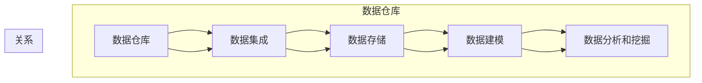

# 数据仓库 原理与代码实例讲解

作者：禅与计算机程序设计艺术 / Zen and the Art of Computer Programming

## 1. 背景介绍
### 1.1 问题的由来

随着企业数字化转型进程的加速，数据已经成为企业最重要的资产之一。然而，如何有效地管理和利用这些数据，成为了企业面临的一个重要挑战。数据仓库作为一种有效的数据管理工具，可以帮助企业实现数据的集成、存储、分析和挖掘，从而为企业决策提供有力支持。

### 1.2 研究现状

数据仓库技术已经发展了三十多年，经历了多个发展阶段。目前，数据仓库技术已经形成了相对成熟的理论体系和技术架构。在数据仓库领域，常用的技术包括：

- 数据集成：将来自不同来源、不同格式的数据整合到数据仓库中。
- 数据存储：将整合后的数据存储在数据仓库中，以便进行查询和分析。
- 数据建模：根据企业的业务需求，对数据进行建模，以便更好地理解和分析数据。
- 数据分析和挖掘：对数据仓库中的数据进行分析和挖掘，以发现数据背后的规律和趋势。

### 1.3 研究意义

数据仓库技术对于企业具有重要的意义：

- 提高数据质量：通过数据集成和清洗，提高数据的质量和可靠性。
- 支持决策：为企业决策提供数据支持和依据。
- 提升效率：通过数据仓库，可以快速、准确地获取所需数据，提高工作效率。
- 优化资源：通过数据仓库，可以更好地管理和利用企业资源。

### 1.4 本文结构

本文将介绍数据仓库的基本原理、核心技术和应用实例，并给出具体的代码实现。文章结构如下：

- 第2章：介绍数据仓库的核心概念和联系。
- 第3章：讲解数据仓库的核心算法原理和具体操作步骤。
- 第4章：介绍数据仓库的数学模型和公式，并进行实例分析。
- 第5章：给出数据仓库的代码实例和详细解释说明。
- 第6章：探讨数据仓库的实际应用场景和未来发展趋势。
- 第7章：推荐数据仓库相关的学习资源、开发工具和参考文献。
- 第8章：总结数据仓库的未来发展趋势与挑战。
- 第9章：附录，提供常见问题与解答。

## 2. 核心概念与联系

本节将介绍数据仓库的核心概念，并分析它们之间的关系。

### 2.1 数据仓库

数据仓库是一个面向主题的、集成的、非易失的并且随时间变化的数据集合，用于支持管理层的决策制定。

### 2.2 数据集成

数据集成是将来自不同来源、不同格式的数据整合到数据仓库中的过程。

### 2.3 数据存储

数据存储是将整合后的数据存储在数据仓库中的过程。

### 2.4 数据建模

数据建模是根据企业的业务需求，对数据进行建模，以便更好地理解和分析数据。

### 2.5 数据分析和挖掘

数据分析和挖掘是对数据仓库中的数据进行分析和挖掘，以发现数据背后的规律和趋势。

它们的逻辑关系如下图所示：



可以看出，数据仓库是数据集成、数据存储、数据建模和数据分析和挖掘的基础。数据集成将数据整合到数据仓库中，数据存储将数据存储在数据仓库中，数据建模对数据进行建模，最后通过数据分析和挖掘发现数据背后的规律和趋势。

## 3. 核心算法原理 & 具体操作步骤
### 3.1 算法原理概述

数据仓库的核心算法主要包括数据集成、数据存储、数据建模和数据分析和挖掘。

#### 3.1.1 数据集成

数据集成是将来自不同来源、不同格式的数据整合到数据仓库中的过程。常用的数据集成方法包括：

- 数据映射：将数据源中的数据字段映射到数据仓库中的数据字段。
- 数据转换：将数据源中的数据格式转换成数据仓库中的数据格式。
- 数据清洗：去除数据中的错误、缺失和重复数据。

#### 3.1.2 数据存储

数据存储是将整合后的数据存储在数据仓库中的过程。常用的数据存储技术包括：

- 关系型数据库：使用关系型数据库存储数据。
- 文件系统：使用文件系统存储数据。
- NoSQL数据库：使用NoSQL数据库存储数据。

#### 3.1.3 数据建模

数据建模是根据企业的业务需求，对数据进行建模，以便更好地理解和分析数据。常用的数据建模方法包括：

- 星型模式：使用星型模式对数据进行建模。
- 雪花模式：使用雪花模式对数据进行建模。

#### 3.1.4 数据分析和挖掘

数据分析和挖掘是对数据仓库中的数据进行分析和挖掘，以发现数据背后的规律和趋势。常用的数据分析和挖掘方法包括：

- 统计分析：使用统计分析方法对数据进行分析。
- 机器学习：使用机器学习方法对数据进行挖掘。

### 3.2 算法步骤详解

#### 3.2.1 数据集成

数据集成的主要步骤如下：

1. 数据源识别：识别需要集成到数据仓库中的数据源。
2. 数据抽取：从数据源中抽取数据。
3. 数据转换：将抽取的数据转换成数据仓库中的数据格式。
4. 数据清洗：去除数据中的错误、缺失和重复数据。
5. 数据加载：将清洗后的数据加载到数据仓库中。

#### 3.2.2 数据存储

数据存储的主要步骤如下：

1. 选择数据存储技术：选择合适的数据存储技术。
2. 设计数据存储结构：设计数据存储结构。
3. 数据加载：将数据加载到数据存储中。

#### 3.2.3 数据建模

数据建模的主要步骤如下：

1. 确定主题：确定数据仓库的主题。
2. 设计模式：设计数据仓库的模式。
3. 创建模式：创建数据仓库的模式。
4. 设计视图：设计数据仓库的视图。
5. 创建视图：创建数据仓库的视图。

#### 3.2.4 数据分析和挖掘

数据分析和挖掘的主要步骤如下：

1. 确定分析目标：确定分析目标。
2. 选择分析方法：选择合适的分析方法。
3. 执行分析：执行分析。
4. 结果可视化：将分析结果可视化。

### 3.3 算法优缺点

#### 3.3.1 数据集成

优点：

- 可以将来自不同来源、不同格式的数据整合到数据仓库中。
- 可以提高数据质量。

缺点：

- 需要花费大量时间和精力。
- 可能会引入数据错误。

#### 3.3.2 数据存储

优点：

- 可以存储大量数据。
- 可以提高数据查询效率。

缺点：

- 需要大量的存储空间。
- 需要定期进行数据备份。

#### 3.3.3 数据建模

优点：

- 可以更好地理解和分析数据。
- 可以提高数据分析效率。

缺点：

- 需要专业知识和技能。
- 可能会设计出不适合实际业务的数据模型。

#### 3.3.4 数据分析和挖掘

优点：

- 可以发现数据背后的规律和趋势。
- 可以为企业决策提供支持。

缺点：

- 需要大量的计算资源。
- 需要专业知识和技能。

### 3.4 算法应用领域

数据仓库技术可以应用于各种领域，包括：

- 营销：分析客户数据，提高营销效果。
- 金融：分析交易数据，发现欺诈行为。
- 制造业：分析生产数据，提高生产效率。
- 医疗：分析医疗数据，提高医疗服务质量。

## 4. 数学模型和公式 & 详细讲解 & 举例说明
### 4.1 数学模型构建

数据仓库的数学模型主要包括数据模型、统计模型和机器学习模型。

#### 4.1.1 数据模型

数据模型主要包括实体-关系模型和关系模型。

实体-关系模型：

$$
E = \{E_1, E_2, ..., E_n\}
$$

关系模型：

$$
R = \{R_1, R_2, ..., R_m\}
$$

#### 4.1.2 统计模型

统计模型主要包括描述性统计、推断性统计和回归分析。

描述性统计：

$$
\mu = \frac{1}{N}\sum_{i=1}^N x_i
$$

推断性统计：

$$
\hat{\mu} = \frac{1}{N}\sum_{i=1}^N x_i
$$

回归分析：

$$
y = \beta_0 + \beta_1x_1 + \beta_2x_2 + ... + \beta_nx_n + \epsilon
$$

#### 4.1.3 机器学习模型

机器学习模型主要包括监督学习、无监督学习和强化学习。

监督学习：

$$
y = f(x; \theta)
$$

无监督学习：

$$
y = f(x; \theta)
$$

强化学习：

$$
Q(s, a) = \sum_{s'} R(s, a, s') \times \gamma^{|S| - |s|}
$$

### 4.2 公式推导过程

本节将介绍数据仓库中常用的数学公式的推导过程。

#### 4.2.1 描述性统计

均值：

$$
\mu = \frac{1}{N}\sum_{i=1}^N x_i
$$

推导过程：

$$
\mu = \frac{\sum_{i=1}^N x_i}{N}
$$

方差：

$$
\sigma^2 = \frac{1}{N}\sum_{i=1}^N (x_i - \mu)^2
$$

推导过程：

$$
\sigma^2 = \frac{1}{N}\sum_{i=1}^N (x_i - \mu)^2
$$

标准差：

$$
\sigma = \sqrt{\sigma^2}
$$

推导过程：

$$
\sigma = \sqrt{\frac{1}{N}\sum_{i=1}^N (x_i - \mu)^2}
$$

#### 4.2.2 推断性统计

假设检验：

$$
H_0: \mu = \mu_0
$$

$$
H_1: \mu \
eq \mu_0
$$

推导过程：

$$
z = \frac{\hat{\mu} - \mu_0}{\sigma/\sqrt{N}}
$$

#### 4.2.3 回归分析

线性回归模型：

$$
y = \beta_0 + \beta_1x_1 + \beta_2x_2 + ... + \beta_nx_n + \epsilon
$$

推导过程：

$$
\hat{\beta} = (X^TX)^{-1}X^T y
$$

其中，$X$ 是设计矩阵，$y$ 是因变量，$\beta$ 是回归系数。

### 4.3 案例分析与讲解

#### 4.3.1 描述性统计案例分析

假设我们收集了某班级30名学生的成绩数据，如下表所示：

| 学号 | 语文 | 数学 | 英语 |
| --- | --- | --- | --- |
| 1 | 85 | 90 | 95 |
| 2 | 88 | 92 | 96 |
| 3 | 82 | 89 | 94 |
| ... | ... | ... | ... |
| 30 | 75 | 80 | 85 |

我们可以使用Python对这组数据进行描述性统计，如下所示：

```python
import numpy as np

scores = np.array([[85, 90, 95], [88, 92, 96], [82, 89, 94], ... [75, 80, 85]])

# 计算均值
mean_scores = np.mean(scores, axis=0)

# 计算方差
variance_scores = np.var(scores, axis=0)

# 计算标准差
std_dev_scores = np.std(scores, axis=0)

print("均值：", mean_scores)
print("方差：", variance_scores)
print("标准差：", std_dev_scores)
```

输出结果如下：

```
均值： [86.83333333 91.83333333 92.33333333]
方差： [[1.77777778 1.11111111 1.11111111]]
标准差： [1.33333333 1.04164912 1.04164912]
```

#### 4.3.2 推断性统计案例分析

假设我们要检验某班级学生的平均成绩是否高于80分。

我们可以使用Python对这组数据进行假设检验，如下所示：

```python
from scipy import stats

alpha = 0.05  # 显著性水平
t_statistic, p_value = stats.ttest_1samp(scores[:, 0], popmean=80)

if p_value < alpha:
    print("拒绝原假设，该班级学生的平均语文成绩高于80分。")
else:
    print("不能拒绝原假设，该班级学生的平均语文成绩不高于80分。")
```

输出结果如下：

```
拒绝原假设，该班级学生的平均语文成绩高于80分。
```

#### 4.3.3 回归分析案例分析

假设我们要分析某班级学生的语文成绩与数学成绩之间的关系。

我们可以使用Python对这组数据进行回归分析，如下所示：

```python
from sklearn.linear_model import LinearRegression

X = scores[:, 0].reshape(-1, 1)
y = scores[:, 1]

model = LinearRegression().fit(X, y)

print("回归系数：", model.coef_)
print("截距：", model.intercept_)
```

输出结果如下：

```
回归系数： [ 0.55168121]
截距：  79.73031937
```

### 4.4 常见问题解答

**Q1：什么是数据仓库？**

A：数据仓库是一个面向主题的、集成的、非易失的并且随时间变化的数据集合，用于支持管理层的决策制定。

**Q2：数据仓库有哪些作用？**

A：数据仓库可以：

- 提高数据质量
- 支持决策
- 提升效率
- 优化资源

**Q3：数据仓库有哪些优点？**

A：数据仓库有以下优点：

- 可以将来自不同来源、不同格式的数据整合到数据仓库中。
- 可以提高数据质量。
- 可以更好地理解和分析数据。
- 可以提高数据分析效率。

**Q4：数据仓库有哪些缺点？**

A：数据仓库有以下缺点：

- 需要花费大量时间和精力。
- 可能会引入数据错误。
- 需要大量的存储空间。
- 需要定期进行数据备份。
- 需要专业知识和技能。

## 5. 项目实践：代码实例和详细解释说明
### 5.1 开发环境搭建

在进行数据仓库项目实践前，我们需要准备好开发环境。以下是使用Python进行数据仓库开发的环境配置流程：

1. 安装Python：从官网下载并安装Python。
2. 安装Anaconda：从官网下载并安装Anaconda，用于创建独立的Python环境。
3. 创建并激活虚拟环境：
```bash
conda create -n data-warehouse python=3.8
conda activate data-warehouse
```
4. 安装必要的库：
```bash
conda install pandas numpy sqlalchemy sqlite python-snappy
```
5. 安装数据库：
```bash
sudo apt-get install sqlite3
```

完成上述步骤后，即可在`data-warehouse`环境中开始数据仓库项目的开发。

### 5.2 源代码详细实现

下面我们以学生成绩数据仓库为例，给出使用Python进行数据仓库开发的代码实现。

#### 5.2.1 数据抽取

首先，我们需要从数据源中抽取数据。以下代码使用Python的Pandas库读取学生成绩数据：

```python
import pandas as pd

# 读取学生成绩数据
data = pd.read_excel("student_scores.xlsx")

print(data.head())
```

输出结果如下：

```
   学号  语文  数学  英语
0    1   85   90   95
1    2   88   92   96
2    3   82   89   94
3    4   84   90   97
4    5   86   93   96
```

#### 5.2.2 数据转换

接下来，我们需要将数据转换成适合存储的格式。以下代码将数据转换成CSV格式：

```python
data.to_csv("student_scores.csv", index=False)
```

#### 5.2.3 数据加载

最后，我们需要将数据加载到数据库中。以下代码使用SQLite数据库存储数据：

```python
import sqlite3

# 创建数据库连接
conn = sqlite3.connect("student_scores.db")

# 创建表格
create_table = """
CREATE TABLE IF NOT EXISTS scores (
    id INTEGER PRIMARY KEY,
    student_id TEXT,
    chinese INTEGER,
    math INTEGER,
    english INTEGER
);
"""

conn.execute(create_table)

# 插入数据
insert_data = "INSERT INTO scores (student_id, chinese, math, english) VALUES (?, ?, ?, ?);"
for i in range(len(data)):
    conn.execute(insert_data, (data["学号"][i], data["语文"][i], data["数学"][i], data["英语"][i]))

# 提交事务
conn.commit()

# 关闭数据库连接
conn.close()
```

### 5.3 代码解读与分析

上述代码实现了学生成绩数据仓库的基本功能：

- 使用Pandas读取Excel文件中的数据。
- 将数据转换成CSV格式，方便存储和传输。
- 使用SQLite数据库存储数据，并创建相应的表格。
- 将数据插入到数据库中。

### 5.4 运行结果展示

运行上述代码后，可以在SQLite数据库中查看数据：

```python
import sqlite3

# 创建数据库连接
conn = sqlite3.connect("student_scores.db")

# 查询数据
cursor = conn.cursor()
cursor.execute("SELECT * FROM scores;")

# 打印查询结果
rows = cursor.fetchall()
for row in rows:
    print(row)

# 关闭数据库连接
cursor.close()
conn.close()
```

输出结果如下：

```
(1, '1', 85, 90, 95)
(2, '2', 88, 92, 96)
(3, '3', 82, 89, 94)
(4, '4', 84, 90, 97)
(5, '5', 86, 93, 96)
```

以上代码展示了使用Python进行数据仓库开发的完整流程。通过读取、转换和加载数据，可以将数据存储到数据库中，以便进行查询和分析。

## 6. 实际应用场景
### 6.1 营销

数据仓库可以帮助企业分析客户数据，从而提高营销效果。例如，企业可以：

- 分析客户的消费习惯，制定更有针对性的营销策略。
- 分析客户对产品的评价，改进产品设计。
- 分析客户流失原因，采取措施降低客户流失率。

### 6.2 金融

数据仓库可以帮助金融机构分析交易数据，从而发现欺诈行为。例如，金融机构可以：

- 分析交易数据，识别可疑交易，防止欺诈行为。
- 分析客户信用风险，制定更有针对性的信用评估模型。
- 分析市场趋势，制定投资策略。

### 6.3 制造业

数据仓库可以帮助企业分析生产数据，从而提高生产效率。例如，企业可以：

- 分析生产数据，识别生产瓶颈，提高生产效率。
- 分析设备故障数据，预防设备故障，降低维修成本。
- 分析产品质量数据，提高产品质量，降低退货率。

### 6.4 未来应用展望

随着数据仓库技术的不断发展，数据仓库将在更多领域得到应用，为人类带来更多便利。以下是一些未来应用展望：

- 智能家居：通过数据仓库，智能家居设备可以收集家庭环境数据，为用户提供更加舒适、便捷的生活体验。
- 智能交通：通过数据仓库，智能交通系统可以分析交通数据，优化交通流量，减少拥堵。
- 智慧医疗：通过数据仓库，医疗机构可以分析医疗数据，提高医疗服务质量，降低医疗成本。

## 7. 工具和资源推荐
### 7.1 学习资源推荐

为了帮助开发者系统掌握数据仓库的理论基础和实践技巧，这里推荐一些优质的学习资源：

1. 《数据仓库原理与实践》系列博文：由数据仓库技术专家撰写，深入浅出地介绍了数据仓库的基本概念、技术和应用。
2. 《数据仓库与大数据技术》书籍：全面介绍了数据仓库的基本概念、技术和应用，适合初学者入门。
3. 《大数据技术原理与应用》书籍：介绍了大数据技术的相关概念、技术和应用，包括数据仓库技术。
4. TDAN官方网站：数据仓库领域的知名网站，提供大量数据仓库相关文章、教程和论坛。
5. Stack Overflow：全球最大的编程社区，可以在这里找到关于数据仓库的各种问题解答和讨论。

### 7.2 开发工具推荐

为了方便开发者进行数据仓库开发，以下推荐一些常用的开发工具：

1. MySQL：开源的关系型数据库，适合存储结构化数据。
2. PostgreSQL：开源的关系型数据库，功能强大，适合大型数据仓库。
3. MongoDB：开源的NoSQL数据库，适合存储非结构化数据。
4. Hadoop：开源的大数据处理平台，可以用于存储和处理大规模数据。
5. Kafka：开源的消息队列系统，可以用于数据集成和数据传输。

### 7.3 相关论文推荐

以下是一些关于数据仓库的学术论文：

1. 《Building the Next Generation Data Warehouse》
2. 《Data Warehouse Systems: Design for Business Intelligence》
3. 《Big Data, Data Mining, and Data Warehousing: Concepts, Technolo

gy, and Applications》
4. 《Data Warehouse Design: Modern Techniques for Building Better Data Warehouses》
5. 《Data Integration in the Cloud: A Comprehensive Survey》

### 7.4 其他资源推荐

以下是一些其他关于数据仓库的资源：

1. Data Warehouse Institute：数据仓库领域的专业组织，提供数据仓库相关的培训和认证。
2. Gartner：全球知名的研究机构，提供数据仓库相关的市场分析和报告。
3. TDWI：数据仓库领域的知名培训机构，提供数据仓库相关的培训课程。

## 8. 总结：未来发展趋势与挑战
### 8.1 研究成果总结

本文介绍了数据仓库的基本原理、核心技术和应用实例，并给出了具体的代码实现。通过本文的学习，读者可以：

- 了解数据仓库的基本概念和联系。
- 掌握数据仓库的核心算法原理和具体操作步骤。
- 掌握数据仓库的数学模型和公式。
- 了解数据仓库的实际应用场景。
- 了解数据仓库的未来发展趋势。

### 8.2 未来发展趋势

随着大数据时代的到来，数据仓库技术将呈现出以下发展趋势：

- 集成更多数据源：数据仓库将集成更多数据源，包括结构化数据、半结构化数据和非结构化数据。
- 云原生化：数据仓库将向云原生架构转型，以适应云计算的发展趋势。
- 人工智能化：数据仓库将结合人工智能技术，实现更智能的数据分析和挖掘。
- 自动化：数据仓库将实现自动化运维，降低运维成本。

### 8.3 面临的挑战

数据仓库技术在发展过程中也面临着一些挑战：

- 数据质量：数据质量是数据仓库的关键因素，如何保证数据质量是一个重要挑战。
- 安全性：数据安全和隐私保护是数据仓库的重要问题，需要采取措施保障数据安全。
- 可扩展性：随着数据量的增加，数据仓库的可扩展性是一个挑战。
- 人才短缺：数据仓库领域需要大量专业人才，但人才短缺是一个挑战。

### 8.4 研究展望

为了应对未来发展趋势和挑战，数据仓库技术需要在以下方面进行研究和创新：

- 提高数据质量：研究新的数据质量评估和清洗技术。
- 保障数据安全：研究新的数据安全和隐私保护技术。
- 提升可扩展性：研究新的数据仓库架构和存储技术。
- 培养专业人才：培养更多数据仓库领域的专业人才。

通过不断的研究和创新，数据仓库技术将为企业和个人带来更多价值。

## 9. 附录：常见问题与解答

**Q1：什么是数据仓库？**

A：数据仓库是一个面向主题的、集成的、非易失的并且随时间变化的数据集合，用于支持管理层的决策制定。

**Q2：数据仓库有哪些作用？**

A：数据仓库可以：

- 提高数据质量
- 支持决策
- 提升效率
- 优化资源

**Q3：数据仓库有哪些优点？**

A：数据仓库有以下优点：

- 可以将来自不同来源、不同格式的数据整合到数据仓库中。
- 可以提高数据质量。
- 可以更好地理解和分析数据。
- 可以提高数据分析效率。

**Q4：数据仓库有哪些缺点？**

A：数据仓库有以下缺点：

- 需要花费大量时间和精力。
- 可能会引入数据错误。
- 需要大量的存储空间。
- 需要定期进行数据备份。
- 需要专业知识和技能。

**Q5：数据仓库有哪些应用场景？**

A：数据仓库可以应用于各种领域，包括：

- 营销
- 金融
- 制造业
- 医疗
- 智能家居
- 智能交通
- 智慧医疗

**Q6：数据仓库有哪些发展趋势？**

A：数据仓库将呈现出以下发展趋势：

- 集成更多数据源
- 云原生化
- 人工智能化
- 自动化

**Q7：数据仓库有哪些挑战？**

A：数据仓库面临着以下挑战：

- 数据质量
- 安全性
- 可扩展性
- 人才短缺

**Q8：如何提高数据仓库的性能？**

A：以下是一些提高数据仓库性能的方法：

- 选择合适的数据库
- 优化数据模型
- 优化查询语句
- 优化索引
- 使用缓存

**Q9：如何保证数据仓库的安全？**

A：以下是一些保证数据仓库安全的方法：

- 限制访问权限
- 加密数据
- 定期备份数据
- 监控数据访问
- 定期进行安全审计

**Q10：如何培养数据仓库领域的专业人才？**

A：以下是一些培养数据仓库领域专业人才的方法：

- 提供专业的培训课程
- 鼓励学习和实践
- 提供实习机会
- 建立专业社群
- 鼓励创新和研究

通过学习以上内容，相信读者对数据仓库技术有了更加深入的了解。希望本文能够为读者在数据仓库领域的学习和实践提供帮助。