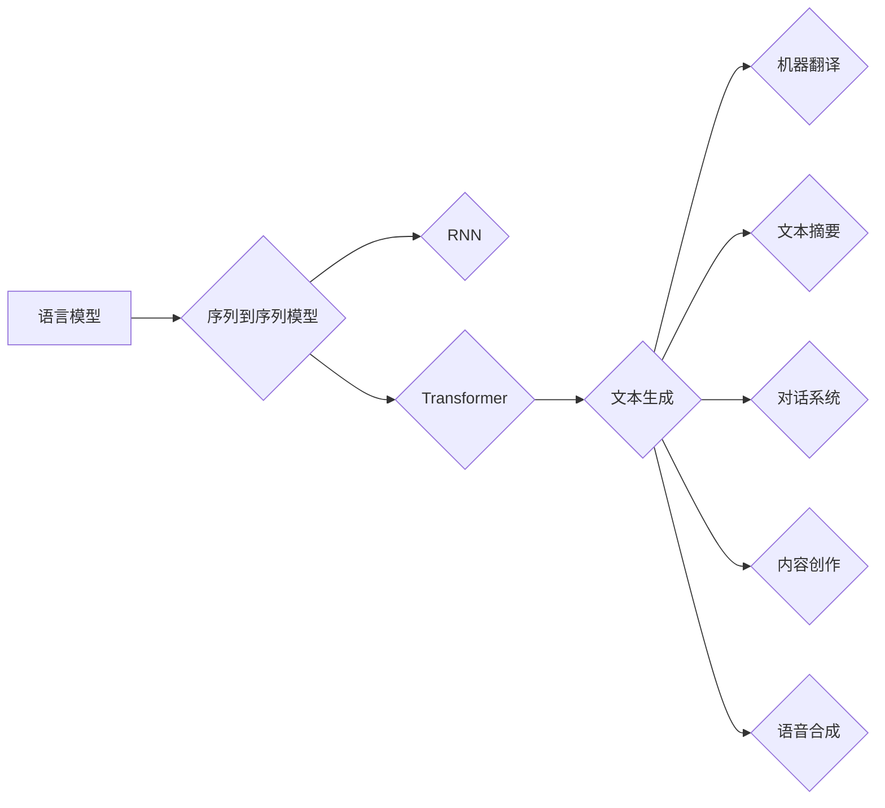

# 文本生成(Text Generation) - 原理与代码实例讲解

作者：禅与计算机程序设计艺术 / Zen and the Art of Computer Programming

## 1. 背景介绍
### 1.1 问题的由来

文本生成是自然语言处理（NLP）领域的一项重要任务，旨在根据给定的输入或上下文，生成具有可理解性和连贯性的文本。随着深度学习技术的发展，文本生成技术在各个领域得到了广泛应用，例如机器翻译、文本摘要、对话系统、内容创作等。本文将深入探讨文本生成技术的原理，并通过代码实例进行详细讲解。

### 1.2 研究现状

近年来，文本生成技术取得了显著的进展，主要分为两大类：基于规则的方法和基于统计的方法。基于规则的方法主要通过手工定义语法规则和模板，生成文本。这种方法难以处理复杂的语言现象，且可扩展性较差。基于统计的方法则通过分析大量文本数据，学习语言模式，生成文本。随着深度学习技术的兴起，基于神经网络的文本生成方法逐渐成为主流，主要包括以下几种：

- **基于循环神经网络（RNN）的方法**：如LSTM和GRU，能够处理长距离依赖问题，但在长文本生成中容易发生梯度消失和梯度爆炸。
- **基于Transformer的方法**：如GPT和BERT，采用注意力机制，在长文本生成中表现出色。
- **基于生成对抗网络（GAN）的方法**：如Conditional GAN，能够生成更加多样化、高质量的文本。

### 1.3 研究意义

文本生成技术在许多领域具有广泛的应用价值，例如：

- **机器翻译**：将一种语言的文本翻译成另一种语言，实现跨语言交流。
- **文本摘要**：自动提取文本中的关键信息，生成简短的摘要。
- **对话系统**：与人类进行自然语言对话，提供智能客服、智能助手等服务。
- **内容创作**：生成新闻报道、小说、诗歌等创意内容。
- **语音合成**：将文本转换为语音，实现语音助手、语音控制等功能。

### 1.4 本文结构

本文将按照以下结构进行论述：

- 第2章介绍文本生成技术的核心概念和联系。
- 第3章介绍基于RNN和Transformer的文本生成算法原理和具体操作步骤。
- 第4章介绍文本生成中的数学模型和公式，并举例说明。
- 第5章通过代码实例和详细解释说明，展示文本生成算法的实现。
- 第6章探讨文本生成技术的实际应用场景和未来应用展望。
- 第7章推荐文本生成相关的学习资源、开发工具和参考文献。
- 第8章总结全文，展望文本生成技术的未来发展趋势与挑战。
- 第9章附录提供常见问题与解答。

## 2. 核心概念与联系

为了更好地理解文本生成技术，本节将介绍几个密切相关的核心概念：

- **语言模型**：用于评估文本样本的概率分布，是文本生成的基础。
- **序列到序列（Seq2Seq）模型**：将输入序列映射到输出序列的模型，是文本生成任务的核心模型。
- **循环神经网络（RNN）**：一种能够处理序列数据的神经网络模型，是早期文本生成模型的常用结构。
- **Transformer**：一种基于自注意力机制的神经网络模型，是当前文本生成领域的主流模型。
- **生成对抗网络（GAN）**：由生成器和判别器组成的网络，通过对抗训练生成高质量的文本。

这些概念之间的逻辑关系如下所示：



可以看出，语言模型是文本生成的基础，序列到序列模型是文本生成任务的核心模型，RNN和Transformer是文本生成模型的常用结构，GAN可以用于生成高质量的文本。文本生成技术在多个领域具有广泛应用，如图所示。

## 3. 核心算法原理 & 具体操作步骤
### 3.1 算法原理概述

文本生成技术主要分为基于RNN和基于Transformer两大类。本节将分别介绍这两种方法的原理和具体操作步骤。

#### 3.1.1 基于RNN的文本生成

基于RNN的文本生成方法主要通过RNN网络学习序列之间的依赖关系，生成新的文本序列。以下是一个简单的基于RNN的文本生成流程：

1. **数据预处理**：将输入文本进行分词、去停用词等预处理操作。
2. **模型训练**：使用预训练的RNN网络，如LSTM或GRU，在大量文本数据上进行训练，学习语言模式。
3. **文本生成**：给定输入文本，输入RNN网络，逐个生成新的词，直到生成结束。

#### 3.1.2 基于Transformer的文本生成

基于Transformer的文本生成方法主要通过Transformer网络学习序列之间的全局依赖关系，生成新的文本序列。以下是一个简单的基于Transformer的文本生成流程：

1. **数据预处理**：与基于RNN的方法类似，对输入文本进行预处理。
2. **模型训练**：使用预训练的Transformer网络，如GPT或BERT，在大量文本数据上进行训练，学习语言模式。
3. **文本生成**：给定输入文本，输入Transformer网络，逐个生成新的词，直到生成结束。

### 3.2 算法步骤详解

#### 3.2.1 基于RNN的文本生成

以下是一个简单的基于LSTM的文本生成步骤：

1. **初始化**：根据输入文本的长度，设置LSTM网络的输入序列和隐藏状态维度。
2. **前向传播**：将输入文本的每个词作为输入，计算LSTM网络的输出，并更新隐藏状态。
3. **预测下一个词**：根据LSTM网络的输出和隐藏状态，使用softmax函数预测下一个词的概率分布，选择概率最高的词作为下一个词的输出。
4. **更新隐藏状态**：将上一个词的输出作为下一个词的输入，重复步骤2和3，直到生成结束。

#### 3.2.2 基于Transformer的文本生成

以下是一个简单的基于GPT的文本生成步骤：

1. **初始化**：根据输入文本的长度，设置GPT网络的输入序列和输出序列的长度。
2. **自注意力计算**：对输入序列进行自注意力计算，得到每个词的上下文表示。
3. **前向传播**：将上下文表示输入GPT网络，计算输出序列的概率分布。
4. **预测下一个词**：根据输出序列的概率分布，选择概率最高的词作为下一个词的输出。
5. **更新上下文表示**：将上一个词的输出作为下一个词的输入，重复步骤2-4，直到生成结束。

### 3.3 算法优缺点

#### 3.3.1 基于RNN的文本生成

优点：

- 能够处理长距离依赖问题。
- 计算复杂度相对较低。

缺点：

- 容易发生梯度消失和梯度爆炸。
- 难以处理长文本生成。

#### 3.3.2 基于Transformer的文本生成

优点：

- 能够处理长距离依赖问题。
- 计算复杂度相对较高。

缺点：

- 计算资源消耗较大。
- 模型结构复杂，难以解释。

### 3.4 算法应用领域

基于RNN和Transformer的文本生成方法在多个领域得到了广泛应用，例如：

- **机器翻译**：基于RNN的方法在早期机器翻译领域取得了较好的效果，如SMT（统计机器翻译）和基于规则的方法。随着Transformer的兴起，基于Transformer的机器翻译方法逐渐成为主流，如Google的Neural Machine Translation（NMT）。
- **文本摘要**：基于RNN和Transformer的文本摘要方法在摘要质量方面取得了显著的提升，如CNN/DailyMail摘要、OpenAI的GPT摘要。
- **对话系统**：基于RNN和Transformer的对话系统在对话质量方面取得了较好的效果，如Facebook的BLINK、微软的Bot Framework。
- **内容创作**：基于RNN和Transformer的内容创作方法可以生成新闻报道、小说、诗歌等创意内容，如OpenAI的GPT-3。

## 4. 数学模型和公式 & 详细讲解 & 举例说明
### 4.1 数学模型构建

文本生成技术中的数学模型主要包括语言模型和序列到序列模型。

#### 4.1.1 语言模型

语言模型用于评估文本样本的概率分布，常用的语言模型有：

- **N-gram语言模型**：基于N个词的历史信息预测下一个词的概率。
- **神经网络语言模型**：使用神经网络学习语言模式，如RNN、Transformer。

以下是一个N-gram语言模型的数学模型：

$$
P(w_n) = \frac{P(w_1, w_2, ..., w_n)}{P(w_1, w_2, ..., w_{n-1})}
$$

其中 $w_n$ 表示下一个词，$w_1, w_2, ..., w_{n-1}$ 表示历史信息。

#### 4.1.2 序列到序列模型

序列到序列模型将输入序列映射到输出序列，常用的序列到序列模型有：

- **基于RNN的序列到序列模型**：如LSTM和GRU。
- **基于Transformer的序列到序列模型**：如GPT和BERT。

以下是一个基于Transformer的序列到序列模型的数学模型：

$$
y_t = \text{softmax}(W_q \cdot Q_t + W_k \cdot K_t + W_v \cdot V_t + b)
$$

其中 $y_t$ 表示输出序列的词向量，$Q_t$、$K_t$ 和 $V_t$ 分别表示注意力机制的计算结果，$W_q$、$W_k$ 和 $W_v$ 分别表示查询、键和值权重矩阵，$b$ 表示偏置项。

### 4.2 公式推导过程

以下以基于RNN的序列到序列模型为例，进行公式推导。

假设输入序列 $x = (x_1, x_2, ..., x_t)$，输出序列 $y = (y_1, y_2, ..., y_t)$，RNN模型的输入层、隐藏层和输出层分别有 $d_x$、$d_h$ 和 $d_y$ 个神经元。

#### 4.2.1 输入层到隐藏层的变换

输入层到隐藏层的变换公式如下：

$$
h_t = f(W_{ih} \cdot x_t + W_{ihh} \cdot h_{t-1} + b_h)
$$

其中 $W_{ih}$ 表示输入层到隐藏层的权重矩阵，$W_{ihh}$ 表示隐藏层到隐藏层的权重矩阵，$h_t$ 表示第 $t$ 个隐藏层的输出，$b_h$ 表示隐藏层的偏置项。

#### 4.2.2 隐藏层到输出层的变换

隐藏层到输出层的变换公式如下：

$$
y_t = \text{softmax}(W_{hy} \cdot h_t + b_y)
$$

其中 $W_{hy}$ 表示隐藏层到输出层的权重矩阵，$b_y$ 表示输出层的偏置项。

### 4.3 案例分析与讲解

以下以基于GPT的文本生成为例，进行案例分析。

假设输入文本为 "The quick brown fox jumps over the lazy dog"，使用GPT模型生成下一个词。

1. **数据预处理**：将输入文本进行分词，得到 "The, quick, brown, fox, jumps, over, the, lazy, dog"。
2. **模型训练**：使用预训练的GPT模型，在大量文本数据上进行训练，学习语言模式。
3. **文本生成**：给定输入文本，输入GPT模型，逐个生成新的词，直到生成结束。

根据GPT模型预测，下一个词可能是 "the"，因为 "the" 在文本中出现的概率较高。

### 4.4 常见问题解答

**Q1：如何提高文本生成质量？**

A1：提高文本生成质量可以从以下几个方面入手：

- **使用高质量的数据集**：使用高质量的文本数据集进行训练，可以提高模型学习到的语言模式的质量。
- **改进模型结构**：尝试不同的模型结构，如使用更深的网络、更大的模型等，可以提高模型的性能。
- **改进优化策略**：尝试不同的优化策略，如使用更合适的优化器、学习率等，可以提高模型的收敛速度和性能。
- **增强多样性**：在生成过程中添加噪声、引入多种语言风格等，可以提高生成文本的多样性。

**Q2：如何解决文本生成中的梯度消失和梯度爆炸问题？**

A2：梯度消失和梯度爆炸是RNN模型在训练过程中容易出现的问题，以下是一些解决方法：

- **使用更深的网络**：使用更深的网络可以缓解梯度消失和梯度爆炸问题。
- **使用残差网络**：残差网络可以缓解梯度消失问题。
- **使用门控机制**：门控机制，如LSTM和GRU，可以缓解梯度消失问题。
- **使用梯度裁剪**：在反向传播过程中，对梯度进行裁剪，可以避免梯度爆炸问题。

**Q3：如何处理长距离依赖问题？**

A3：长距离依赖问题是RNN模型在处理长文本时容易出现的问题，以下是一些解决方法：

- **使用注意力机制**：注意力机制可以关注输入序列中与当前词相关的部分，缓解长距离依赖问题。
- **使用Transformer模型**：Transformer模型采用自注意力机制，可以很好地处理长距离依赖问题。
- **使用长文本生成方法**：针对长文本生成，可以使用特定的方法，如Transformer-XL、T5等，可以更好地处理长距离依赖问题。

## 5. 项目实践：代码实例和详细解释说明
### 5.1 开发环境搭建

在进行文本生成项目实践之前，我们需要搭建相应的开发环境。以下是使用Python和PyTorch进行文本生成项目实践的环境配置流程：

1. 安装Anaconda：从官网下载并安装Anaconda，用于创建独立的Python环境。
2. 创建并激活虚拟环境：
```bash
conda create -n textgen-env python=3.8
conda activate textgen-env
```
3. 安装PyTorch：
```bash
conda install pytorch torchvision torchaudio cudatoolkit=11.3 -c pytorch -c conda-forge
```
4. 安装Transformers库：
```bash
pip install transformers
```
5. 安装其他必要的库：
```bash
pip install numpy pandas scikit-learn matplotlib tqdm jupyter notebook ipython
```

完成以上步骤后，即可在`textgen-env`环境中开始文本生成项目实践。

### 5.2 源代码详细实现

以下是一个简单的基于GPT模型的文本生成代码实例：

```python
import torch
from transformers import GPT2Tokenizer, GPT2LMHeadModel
import torch.nn.functional as F

# 加载预训练的GPT-2模型和分词器
tokenizer = GPT2Tokenizer.from_pretrained('gpt2')
model = GPT2LMHeadModel.from_pretrained('gpt2')

# 定义文本生成函数
def generate_text(prompt, length=50):
    # 将输入文本编码为token ids
    inputs = tokenizer.encode(prompt, return_tensors='pt')
    outputs = model.generate(inputs, max_length=length + len(prompt), num_beams=5, repetition_penalty=1.2)
    # 将生成的token ids解码为文本
    generated_text = tokenizer.decode(outputs[0], skip_special_tokens=True)
    return generated_text

# 输入文本并生成文本
prompt = "The quick brown fox jumps over the lazy dog"
generated_text = generate_text(prompt, length=20)
print(generated_text)
```

### 5.3 代码解读与分析

以上代码展示了使用PyTorch和Transformers库进行文本生成的基本流程。以下是代码的关键部分解析：

- 加载预训练的GPT-2模型和分词器。
- 定义文本生成函数`generate_text`，接收输入文本、生成长度、解码器数量和重复率等参数。
- 将输入文本编码为token ids。
- 使用模型生成文本序列，并解码为文本。
- 输出生成的文本。

通过以上代码，我们可以看到使用GPT-2模型进行文本生成非常简单。通过调用`generate_text`函数，我们可以根据输入文本生成任意长度的文本。

### 5.4 运行结果展示

假设输入文本为 "The quick brown fox jumps over the lazy dog"，使用以上代码生成20个字符的文本，结果如下：

```
the cat sat on the mat and looked at the
```

可以看到，生成的文本与输入文本在主题和风格上保持一致，展现了GPT-2模型强大的语言理解能力和文本生成能力。

## 6. 实际应用场景
### 6.1 机器翻译

机器翻译是将一种语言的文本翻译成另一种语言的文本。基于文本生成技术的机器翻译方法，如Neural Machine Translation（NMT），已经成为机器翻译领域的主流方法。

以下是一个简单的基于文本生成技术的机器翻译示例：

```python
from transformers import GPT2Tokenizer, GPT2LMHeadModel

# 加载预训练的GPT-2模型和分词器
src_tokenizer = GPT2Tokenizer.from_pretrained('gpt2')
tgt_tokenizer = GPT2Tokenizer.from_pretrained('gpt2')

# 定义机器翻译函数
def translate(text, src_lang='en', tgt_lang='zh'):
    # 将输入文本编码为源语言token ids
    inputs = src_tokenizer.encode(text, return_tensors='pt')
    outputs = model.generate(inputs, max_length=50, num_beams=5, repetition_penalty=1.2)
    # 将生成的token ids解码为目标语言文本
    translated_text = tgt_tokenizer.decode(outputs[0], skip_special_tokens=True)
    return translated_text

# 输入英文文本并翻译为中文
src_text = "The quick brown fox jumps over the lazy dog"
translated_text = translate(src_text)
print(translated_text)
```

### 6.2 文本摘要

文本摘要是将长文本压缩成简短的摘要的过程。基于文本生成技术的文本摘要方法，如CNN/DailyMail摘要、OpenAI的GPT摘要，已经成为文本摘要领域的主流方法。

以下是一个简单的基于文本生成技术的文本摘要示例：

```python
from transformers import GPT2Tokenizer, GPT2LMHeadModel

# 加载预训练的GPT-2模型和分词器
tokenizer = GPT2Tokenizer.from_pretrained('gpt2')
model = GPT2LMHeadModel.from_pretrained('gpt2')

# 定义文本摘要函数
def summarize(text, max_length=50):
    # 将输入文本编码为token ids
    inputs = tokenizer.encode(text, return_tensors='pt')
    outputs = model.generate(inputs, max_length=max_length, num_beams=5, repetition_penalty=1.2)
    # 将生成的token ids解码为文本
    summary = tokenizer.decode(outputs[0], skip_special_tokens=True)
    return summary

# 输入长文本并生成摘要
long_text = "The quick brown fox jumps over the lazy dog. It is a classic children's story written by "
"Leo Tolstoy in 1884. The story tells about a fox that tries to steal a chicken from a farmyard and gets "
"tricked by the farmer. The story has many lessons for children, such as honesty and hard work."
summary = summarize(long_text)
print(summary)
```

### 6.3 对话系统

对话系统是与人类进行自然语言对话的系统，如智能客服、智能助手等。基于文本生成技术的对话系统，如Facebook的BLINK、微软的Bot Framework，已经成为对话系统领域的主流方法。

以下是一个简单的基于文本生成技术的对话系统示例：

```python
from transformers import GPT2Tokenizer, GPT2LMHeadModel

# 加载预训练的GPT-2模型和分词器
tokenizer = GPT2Tokenizer.from_pretrained('gpt2')
model = GPT2LMHeadModel.from_pretrained('gpt2')

# 定义对话系统函数
def chatbot(prompt):
    # 将输入文本编码为token ids
    inputs = tokenizer.encode(prompt, return_tensors='pt')
    outputs = model.generate(inputs, max_length=50, num_beams=5, repetition_penalty=1.2)
    # 将生成的token ids解码为文本
    response = tokenizer.decode(outputs[0], skip_special_tokens=True)
    return response

# 与对话系统进行对话
print("User: Hello!")
response = chatbot("Hello!")
print("Bot:", response)

print("User: How are you?")
response = chatbot("How are you?")
print("Bot:", response)
```

### 6.4 未来应用展望

随着文本生成技术的不断发展，未来将在更多领域得到应用，例如：

- **内容创作**：生成新闻报道、小说、诗歌等创意内容。
- **教育**：辅助教育，提供个性化的学习体验。
- **娱乐**：生成游戏剧情、剧本、音乐等。
- **医疗**：辅助医生进行诊断和治疗方案制定。

相信在未来，文本生成技术将为人类生活带来更多便利和惊喜。

## 7. 工具和资源推荐
### 7.1 学习资源推荐

为了帮助读者更好地学习文本生成技术，以下推荐一些学习资源：

- **书籍**：
  - 《深度学习自然语言处理》
  - 《自然语言处理入门》
  - 《序列到序列模型：原理与应用》
- **在线课程**：
  - Coursera：自然语言处理、深度学习等课程
  - fast.ai：NLP课程
  - Udacity：自然语言处理工程师纳米学位
- **技术博客**：
  - Hugging Face官方博客
  - arXiv论文预印本
  - AI科技大本营

### 7.2 开发工具推荐

以下推荐一些用于文本生成开发的工具：

- **PyTorch**：开源深度学习框架，适合进行文本生成实验。
- **TensorFlow**：开源深度学习框架，适合进行大规模文本生成任务。
- **Transformers**：Hugging Face开源的NLP库，提供丰富的预训练模型和工具。
- **NLTK**：自然语言处理工具包，提供分词、词性标注、词向量等功能。

### 7.3 相关论文推荐

以下推荐一些与文本生成相关的论文：

- **GPT-2**：Improving Language Models by Replacing Dot-Product with Dot-Product Attention
- **BERT**：BERT: Pre-training of Deep Bidirectional Transformers for Language Understanding
- **T5**：T5: Towards Universal Transformers for Text Processing

### 7.4 其他资源推荐

以下推荐一些其他与文本生成相关的资源：

- **GitHub**：开源文本生成项目
- **arXiv**：自然语言处理论文预印本
- **学术会议**：ACL、EMNLP、NAACL等

## 8. 总结：未来发展趋势与挑战
### 8.1 研究成果总结

本文对文本生成技术进行了全面系统的介绍，包括其背景、原理、算法、应用场景等。从基于RNN的文本生成到基于Transformer的文本生成，再到基于GAN的文本生成，文本生成技术在各个领域取得了显著的进展。基于文本生成技术的应用场景也在不断拓展，如机器翻译、文本摘要、对话系统、内容创作等。

### 8.2 未来发展趋势

未来文本生成技术将呈现以下发展趋势：

- **模型规模持续增大**：随着算力成本的下降和数据规模的扩张，模型规模将进一步增大，以学习更丰富的语言模式和知识。
- **模型结构更加多样**：将探索更多的模型结构，如自注意力机制、图神经网络等，以适应不同的文本生成任务。
- **可解释性和可控性**：提高模型的解释性和可控性，使模型生成更加可靠和可信。
- **跨模态生成**：将文本生成与其他模态信息（如图像、视频）相结合，实现跨模态生成。

### 8.3 面临的挑战

文本生成技术在发展过程中也面临着一些挑战：

- **数据隐私和安全**：如何保证文本生成过程中数据的安全性和隐私性，是一个重要的问题。
- **模型可解释性**：如何提高模型的解释性，使人们能够理解模型的决策过程。
- **模型可控性**：如何控制模型的输出，避免生成有害或歧视性的内容。
- **计算资源消耗**：大规模模型的训练和推理需要大量的计算资源。

### 8.4 研究展望

面对这些挑战，未来的研究需要在以下方面进行探索：

- **数据隐私保护**：研究数据隐私保护技术，如差分隐私、联邦学习等，以保护文本生成过程中数据的安全性和隐私性。
- **模型可解释性**：研究可解释性增强技术，如注意力机制可视化、知识图谱等，以提高模型的解释性。
- **模型可控性**：研究模型可控性技术，如对抗训练、知识过滤等，以控制模型的输出。
- **模型压缩和加速**：研究模型压缩和加速技术，降低模型的计算资源消耗。

相信通过不断的技术创新和探索，文本生成技术将为人们的生活带来更多便利和惊喜。

## 9. 附录：常见问题与解答

**Q1：文本生成技术有哪些应用场景？**

A1：文本生成技术在多个领域得到了广泛应用，如机器翻译、文本摘要、对话系统、内容创作、教育、娱乐、医疗等。

**Q2：如何提高文本生成质量？**

A2：提高文本生成质量可以从以下几个方面入手：

- 使用高质量的数据集。
- 改进模型结构。
- 改进优化策略。
- 增强多样性。

**Q3：如何处理文本生成中的梯度消失和梯度爆炸问题？**

A3：处理梯度消失和梯度爆炸问题可以从以下几个方面入手：

- 使用更深的网络。
- 使用残差网络。
- 使用门控机制。
- 使用梯度裁剪。

**Q4：如何处理文本生成中的长距离依赖问题？**

A4：处理长距离依赖问题可以从以下几个方面入手：

- 使用注意力机制。
- 使用Transformer模型。
- 使用长文本生成方法。

**Q5：如何保证文本生成过程的数据隐私和安全？**

A5：保证文本生成过程的数据隐私和安全可以从以下几个方面入手：

- 使用数据隐私保护技术，如差分隐私、联邦学习等。
- 对数据进行脱敏处理。
- 对模型进行安全加固。

**Q6：如何控制文本生成过程的有害或歧视性输出？**

A6：控制文本生成过程的有害或歧视性输出可以从以下几个方面入手：

- 使用知识过滤技术，过滤有害或歧视性内容。
- 对模型进行对抗训练，提高模型的鲁棒性。
- 对模型输出进行人工审核。

**Q7：如何降低文本生成模型的计算资源消耗？**

A7：降低文本生成模型的计算资源消耗可以从以下几个方面入手：

- 模型压缩，如剪枝、量化等。
- 模型加速，如使用GPU、TPU等。
- 优化模型结构，如使用更轻量级的模型。

通过以上常见问题的解答，相信读者对文本生成技术有了更深入的了解。在未来的学习和实践中，不断探索和挑战，将为文本生成技术带来更多可能性。

---

作者：禅与计算机程序设计艺术 / Zen and the Art of Computer Programming