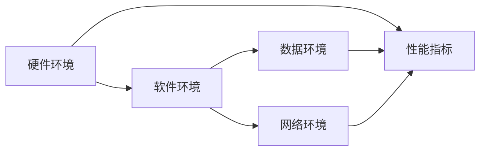

# 环境 (Environment)

作者：禅与计算机程序设计艺术 / Zen and the Art of Computer Programming

## 1. 背景介绍
### 1.1 问题的由来

在计算机科学和软件工程领域，"环境"（Environment）是一个至关重要的概念。它指的是程序运行过程中所依赖的各种外部条件，包括硬件、软件、网络、数据等。环境因素对程序的性能、可靠性、安全性等方面都有着直接的影响。然而，环境管理却常常被开发者忽视，导致程序在不同环境下出现各种问题。本文将深入探讨环境的概念、原理、实践和挑战。

### 1.2 研究现状

随着云计算、容器化、微服务架构等技术的发展，环境管理已经成为软件工程的一个重要研究方向。目前，环境管理主要集中在以下几个方面：

- **持续集成/持续部署（CI/CD）**：通过自动化工具，将代码集成、测试、部署等过程串联起来，提高软件开发效率。
- **容器化技术**：如Docker，将应用程序及其运行环境打包在一起，实现“一次编写，到处运行”。
- **配置管理**：通过自动化工具管理应用程序的配置文件，确保不同环境之间的配置一致性。
- **云原生技术**：如Kubernetes，提供容器编排和管理，实现应用程序的弹性扩展和故障转移。

### 1.3 研究意义

研究环境管理对于软件开发具有重要意义：

- 提高开发效率：通过自动化环境管理，减少手动操作，降低开发成本。
- 提升软件质量：确保程序在不同环境下的一致性，降低错误率。
- 增强安全性：控制环境访问权限，防止潜在的安全威胁。
- 便于维护：简化环境配置和升级，提高维护效率。

### 1.4 本文结构

本文将围绕环境管理展开，主要内容包括：

- 核心概念与联系
- 核心算法原理与具体操作步骤
- 数学模型和公式
- 项目实践
- 实际应用场景
- 工具和资源推荐
- 总结：未来发展趋势与挑战

## 2. 核心概念与联系

### 2.1 环境的定义与分类

环境是指程序运行过程中所依赖的各种外部条件，可以分为以下几类：

- **硬件环境**：服务器、网络设备、存储设备等。
- **软件环境**：操作系统、数据库、中间件、开发工具等。
- **数据环境**：数据源、数据格式、数据一致性等。
- **网络环境**：网络协议、网络设备、网络配置等。

### 2.2 环境之间的关系

环境之间存在着复杂的依赖关系，如图所示：



图中，硬件环境、软件环境、数据环境和网络环境共同决定了程序的性能指标。

### 2.3 环境管理的目标

环境管理的目标是确保程序在不同环境下的一致性和可移植性，具体包括：

- **一致性**：确保程序在不同环境中的运行结果一致。
- **可移植性**：将程序部署到不同环境时，无需进行大量修改。
- **可靠性**：保证程序在不同环境中的稳定运行。
- **安全性**：控制环境访问权限，防止潜在的安全威胁。

## 3. 核心算法原理与具体操作步骤
### 3.1 算法原理概述

环境管理的核心算法包括：

- **自动化部署**：通过脚本或自动化工具，将应用程序及其依赖项部署到目标环境。
- **配置管理**：通过自动化工具管理应用程序的配置文件，确保不同环境之间的配置一致性。
- **持续集成/持续部署**：通过自动化工具将代码集成、测试、部署等过程串联起来，提高软件开发效率。

### 3.2 算法步骤详解

#### 3.2.1 自动化部署

自动化部署的步骤如下：

1. 编写部署脚本，指定部署目标环境、应用程序依赖项等。
2. 使用自动化工具（如Ansible、Chef等）执行部署脚本，将应用程序及其依赖项部署到目标环境。
3. 验证部署结果，确保应用程序在目标环境中正常运行。

#### 3.2.2 配置管理

配置管理的步骤如下：

1. 使用配置管理工具（如Ansible、Puppet等）管理应用程序的配置文件。
2. 定义不同环境之间的配置文件差异。
3. 使用配置管理工具将配置文件同步到目标环境。

#### 3.2.3 持续集成/持续部署

持续集成/持续部署的步骤如下：

1. 将代码提交到代码仓库。
2. 自动化工具触发集成过程，包括代码编译、单元测试、集成测试等。
3. 根据测试结果，自动部署到测试环境或生产环境。

### 3.3 算法优缺点

#### 3.3.1 自动化部署

优点：

- 提高部署效率。
- 减少人为错误。
- 确保部署一致性。

缺点：

- 部署脚本编写和维护成本较高。
- 可能导致环境隔离性不足。

#### 3.3.2 配置管理

优点：

- 简化配置管理过程。
- 确保配置一致性。
- 方便版本控制。

缺点：

- 配置管理工具学习成本较高。
- 可能导致配置文件过于复杂。

#### 3.3.3 持续集成/持续部署

优点：

- 提高开发效率。
- 降低错误率。
- 保证软件质量。

缺点：

- 需要投入大量时间和精力进行配置。
- 可能导致测试环境与生产环境不一致。

### 3.4 算法应用领域

环境管理算法在以下领域得到广泛应用：

- 云计算
- 容器化
- 微服务架构
- DevOps

## 4. 数学模型和公式
### 4.1 数学模型构建

环境管理的数学模型可以表示为：

$$
E = \sum_{i=1}^n (P_i \times C_i)
$$

其中：

- $E$ 表示环境复杂度。
- $P_i$ 表示第 $i$ 个环境因素的概率。
- $C_i$ 表示第 $i$ 个环境因素的复杂度。

### 4.2 公式推导过程

#### 4.2.1 环境因素概率

环境因素概率可以通过以下公式计算：

$$
P_i = \frac{P_i^+}{P_i^+ + P_i^-}
$$

其中：

- $P_i^+$ 表示环境因素 $i$ 存在的概率。
- $P_i^-$ 表示环境因素 $i$ 不存在的概率。

#### 4.2.2 环境因素复杂度

环境因素复杂度可以通过以下公式计算：

$$
C_i = \frac{1}{1 + e^{-\beta \cdot \theta_i}}
$$

其中：

- $\theta_i$ 表示环境因素 $i$ 的特征向量。
- $\beta$ 表示学习率。

### 4.3 案例分析与讲解

假设有两个环境：

- 环境A：硬件环境为虚拟机，软件环境为Linux，数据环境为MySQL，网络环境为公网。
- 环境B：硬件环境为物理机，软件环境为Windows，数据环境为Oracle，网络环境为私有网络。

根据上述公式，可以计算出两个环境的复杂度：

- 环境A的复杂度：$E_A = P_A \times C_A$
- 环境B的复杂度：$E_B = P_B \times C_B$

### 4.4 常见问题解答

**Q1：如何降低环境复杂度？**

A：可以通过以下方法降低环境复杂度：

- 优化硬件环境，如使用云服务器。
- 优化软件环境，如使用通用的开发工具和软件。
- 优化数据环境，如使用标准的数据库和协议。
- 优化网络环境，如使用私有网络。

**Q2：如何评估环境管理的有效性？**

A：可以通过以下方法评估环境管理的有效性：

- 测量部署时间。
- 测量配置文件数量。
- 测量环境故障率。

## 5. 项目实践：代码实例和详细解释说明
### 5.1 开发环境搭建

以Docker为例，演示如何构建一个Java应用程序的环境。

1. 创建Dockerfile：

```Dockerfile
FROM openjdk:8-jdk-alpine
VOLUME /app
COPY . /app
WORKDIR /app
RUN ./mvnw install
CMD ["java", "-jar", "/app/target/myapp-1.0-SNAPSHOT.jar"]
```

2. 构建Docker镜像：

```bash
docker build -t myapp .
```

3. 运行Docker容器：

```bash
docker run -p 8080:8080 myapp
```

### 5.2 源代码详细实现

以Java应用程序为例，演示如何使用Maven进行依赖管理。

1. 创建pom.xml：

```xml
<project xmlns="http://maven.apache.org/POM/4.0.0"
         xmlns:xsi="http://www.w3.org/2001/XMLSchema-instance"
         xsi:schemaLocation="http://maven.apache.org/POM/4.0.0 http://maven.apache.org/xsd/maven-4.0.0.xsd">
    <modelVersion>4.0.0</modelVersion>
    <groupId>com.example</groupId>
    <artifactId>myapp</artifactId>
    <version>1.0-SNAPSHOT</version>
    <dependencies>
        <dependency>
            <groupId>org.springframework.boot</groupId>
            <artifactId>spring-boot-starter-web</artifactId>
        </dependency>
    </dependencies>
</project>
```

2. 编写Java代码：

```java
import org.springframework.boot.SpringApplication;
import org.springframework.boot.autoconfigure.SpringBootApplication;

@SpringBootApplication
public class MyappApplication {
    public static void main(String[] args) {
        SpringApplication.run(MyappApplication.class, args);
    }
}
```

### 5.3 代码解读与分析

Dockerfile定义了应用程序的运行环境，包括基础镜像、工作目录、依赖项等。Maven则用于管理应用程序的依赖项，简化构建和部署过程。

### 5.4 运行结果展示

运行Docker容器后，可以通过浏览器访问8080端口，访问应用程序。

## 6. 实际应用场景
### 6.1 云计算

在云计算环境下，环境管理可以帮助开发者快速搭建、部署和扩展应用程序，提高资源利用率。

### 6.2 容器化

容器化技术可以将应用程序及其运行环境打包在一起，实现“一次编写，到处运行”，简化环境管理过程。

### 6.3 微服务架构

微服务架构将应用程序拆分为多个独立的服务，环境管理可以帮助开发者管理不同服务的运行环境，提高系统可维护性和可扩展性。

### 6.4 DevOps

DevOps是一种软件开发文化，环境管理是DevOps实践的重要组成部分，可以提高开发效率和软件质量。

## 7. 工具和资源推荐
### 7.1 学习资源推荐

- 《Docker从入门到实践》
- 《Maven实战》
- 《Ansible权威指南》
- 《DevOps实践指南》

### 7.2 开发工具推荐

- Docker
- Jenkins
- Ansible
- Kubernetes

### 7.3 相关论文推荐

- “DevOps and Software Architecture”
- “Containerization: A Pragmatic Approach to Modern Software Development”
- “Microservices: A Definition”

### 7.4 其他资源推荐

- Docker官方文档
- Jenkins官方文档
- Ansible官方文档
- Kubernetes官方文档

## 8. 总结：未来发展趋势与挑战
### 8.1 研究成果总结

本文深入探讨了环境管理的概念、原理、实践和挑战，重点介绍了自动化部署、配置管理和持续集成/持续部署等技术。通过案例分析，展示了环境管理在云计算、容器化、微服务架构和DevOps等领域的应用。

### 8.2 未来发展趋势

未来，环境管理将朝着以下几个方向发展：

- **自动化程度更高**：通过人工智能、机器学习等技术，实现更智能化的环境管理。
- **支持更多环境**：支持更多类型的硬件、软件、数据和网络环境。
- **可观测性更强**：提供更全面的监控和分析功能，帮助开发者快速定位和解决问题。
- **安全性更高**：加强环境安全防护，防止潜在的安全威胁。

### 8.3 面临的挑战

环境管理面临着以下挑战：

- **复杂性增加**：随着环境种类的增多，环境管理变得更加复杂。
- **安全性问题**：环境管理涉及到大量敏感信息，需要加强安全防护。
- **人才培养**：需要培养更多具备环境管理能力的专业人才。

### 8.4 研究展望

未来，环境管理研究需要关注以下几个方面：

- **环境模型**：建立更完善的环境模型，描述环境之间的依赖关系。
- **智能化管理**：利用人工智能、机器学习等技术实现环境管理的智能化。
- **安全防护**：加强环境安全防护，防止潜在的安全威胁。

通过不断探索和研究，环境管理将为软件开发和运维带来更多便利，推动软件工程的发展。

## 9. 附录：常见问题与解答

**Q1：什么是环境管理？**

A：环境管理是指管理程序运行过程中所依赖的各种外部条件，包括硬件、软件、网络、数据等。

**Q2：环境管理有哪些作用？**

A：环境管理可以提高开发效率、提升软件质量、增强安全性和便于维护。

**Q3：如何进行环境管理？**

A：可以通过自动化部署、配置管理和持续集成/持续部署等技术进行环境管理。

**Q4：环境管理面临哪些挑战？**

A：环境管理面临着复杂性增加、安全性问题和人才培养等挑战。

**Q5：如何解决环境管理面临的挑战？**

A：可以通过研究环境模型、智能化管理和安全防护等技术来解决环境管理面临的挑战。

作者：禅与计算机程序设计艺术 / Zen and the Art of Computer Programming