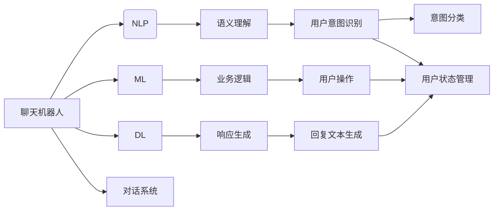
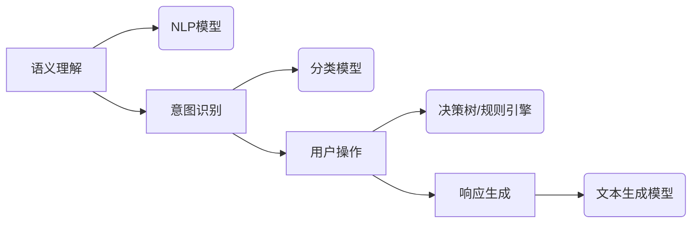

# 聊天机器人的背后：AI代理工作流分析

作者：禅与计算机程序设计艺术 / Zen and the Art of Computer Programming

## 关键词：

聊天机器人，AI代理，工作流，自然语言处理，机器学习，深度学习，对话系统，用户体验

## 1. 背景介绍

### 1.1 问题的由来

随着人工智能技术的飞速发展，聊天机器人（Chatbot）已经成为企业服务、客户支持、信息检索等领域的热门应用。它们能够模拟人类语言进行交流，为用户提供便捷的服务体验。然而，背后支撑聊天机器人的是复杂的AI代理工作流，它决定了机器人的智能水平和用户体验。本文将深入分析聊天机器人的AI代理工作流，探讨其原理、设计、实现和应用。

### 1.2 研究现状

近年来，随着自然语言处理（NLP）、机器学习（ML）和深度学习（DL）技术的快速发展，聊天机器人的技术水平得到了显著提升。目前，主流的聊天机器人工作流主要包括以下几个阶段：

- 语义理解：解析用户输入的文本，提取关键信息，理解用户意图。
- 业务逻辑：根据用户意图调用相应的业务逻辑，完成具体操作。
- 响应生成：根据用户意图和业务逻辑，生成合适的回复文本。
- 用户交互：与用户进行对话，收集更多信息，更新用户状态。

### 1.3 研究意义

研究聊天机器人的AI代理工作流，有助于：

- 了解聊天机器人的技术架构和实现细节。
- 掌握聊天机器人的设计和开发方法。
- 提升聊天机器人的智能水平和用户体验。
- 推动聊天机器人在各行业的应用。

### 1.4 本文结构

本文将围绕聊天机器人的AI代理工作流展开，具体结构如下：

- 第2章介绍聊天机器人的核心概念和关键技术。
- 第3章分析聊天机器人AI代理工作流的原理和设计。
- 第4章探讨聊天机器人AI代理工作流的实现方法。
- 第5章介绍聊天机器人在实际应用场景中的案例。
- 第6章展望聊天机器人AI代理工作流的发展趋势和挑战。
- 第7章总结全文，并推荐相关学习资源和开发工具。

## 2. 核心概念与联系

### 2.1 核心概念

- **聊天机器人**：一种能够模拟人类语言进行交流的人工智能程序，主要用于提供便捷的服务和交互体验。
- **自然语言处理（NLP）**：研究如何让计算机理解、解释和生成人类语言的技术。
- **机器学习（ML）**：一种使计算机能够从数据中学习并做出决策的技术。
- **深度学习（DL）**：一种基于神经网络的高级机器学习技术。
- **对话系统**：一种人与计算机之间进行交互的系统，包括语音识别、语音合成、自然语言理解和自然语言生成等模块。

### 2.2 核心联系

聊天机器人AI代理工作流涉及到多个核心概念的融合，如图所示：



如图所示，聊天机器人通过NLP、ML和DL等技术实现语义理解、业务逻辑、响应生成等功能，并与对话系统进行交互，为用户提供优质的聊天体验。

## 3. 核心算法原理 & 具体操作步骤

### 3.1 算法原理概述

聊天机器人AI代理工作流主要包含以下算法原理：

- **语义理解**：使用NLP技术解析用户输入的文本，提取关键词、实体和语义关系，理解用户意图。
- **意图识别**：根据语义理解的结果，将用户意图分类到预定义的意图类别中。
- **用户操作**：根据用户意图和业务逻辑，调用相应的业务操作。
- **响应生成**：根据用户意图和业务逻辑，生成合适的回复文本。
- **用户状态管理**：跟踪用户状态，根据用户状态调整对话策略。

### 3.2 算法步骤详解

以下是聊天机器人AI代理工作流的详细步骤：

1. **接收用户输入**：聊天机器人接收用户输入的文本。
2. **文本预处理**：对用户输入的文本进行预处理，包括分词、去除停用词、词性标注等。
3. **语义理解**：使用NLP技术解析预处理后的文本，提取关键词、实体和语义关系。
4. **意图识别**：根据语义理解的结果，将用户意图分类到预定义的意图类别中。
5. **用户操作**：根据用户意图和业务逻辑，调用相应的业务操作。
6. **响应生成**：根据用户意图和业务逻辑，生成合适的回复文本。
7. **发送回复**：将回复文本发送给用户。
8. **更新用户状态**：根据用户输入和对话历史，更新用户状态。
9. **重复步骤2-8**：根据用户状态和对话历史，继续与用户进行对话。

### 3.3 算法优缺点

- **优点**：
  - **高效**：能够快速响应用户请求。
  - **智能**：能够理解用户意图和语境。
  - **可扩展**：可以轻松扩展到新的业务领域。
- **缺点**：
  - **复杂度较高**：需要整合多种技术，开发难度较大。
  - **成本较高**：需要大量计算资源和训练数据。
  - **性能不稳定**：在复杂场景下，可能无法准确理解用户意图。

### 3.4 算法应用领域

聊天机器人AI代理工作流在多个领域都有广泛的应用，例如：

- **客户服务**：提供24小时在线客服，解决用户问题。
- **智能助手**：为用户提供日程管理、提醒等功能。
- **信息检索**：帮助用户快速找到所需信息。
- **游戏娱乐**：提供聊天娱乐功能，丰富用户生活。

## 4. 数学模型和公式 & 详细讲解 & 举例说明

### 4.1 数学模型构建

聊天机器人AI代理工作流涉及到多个数学模型，如图所示：



如图所示，语义理解使用NLP模型进行，意图识别使用分类模型进行，用户操作使用决策树或规则引擎进行，响应生成使用文本生成模型进行。

### 4.2 公式推导过程

以下是几个关键数学模型的推导过程：

- **NLP模型**：使用深度神经网络（DNN）进行文本表示和分类。

$$
y = f(W \cdot x + b)
$$

其中 $y$ 为输出，$x$ 为输入，$W$ 为权重，$b$ 为偏置。

- **分类模型**：使用支持向量机（SVM）进行意图分类。

$$
\alpha_{opt} = \mathop{\arg\min}_{\alpha} \frac{1}{2} \sum_{i=1}^n (\alpha_i^T y_i (x_i^T W + b) - y_i)^2 + C \sum_{i=1}^n \alpha_i
$$

其中 $\alpha_{opt}$ 为最优参数，$x_i$ 为第 $i$ 个样本，$y_i$ 为第 $i$ 个样本的标签，$W$ 为权重，$b$ 为偏置，$C$ 为惩罚系数。

- **文本生成模型**：使用循环神经网络（RNN）或长短时记忆网络（LSTM）进行文本生成。

$$
h_t = f(h_{t-1}, x_t)
$$

其中 $h_t$ 为第 $t$ 个隐藏状态，$x_t$ 为第 $t$ 个输入，$f$ 为激活函数。

### 4.3 案例分析与讲解

以下是一个简单的聊天机器人示例，使用Python和NLTK库实现：

```python
import nltk

def main():
    # 加载NLP模型
    nltk.download('punkt')
    nltk.download('averaged_perceptron_tagger')
    nltk.download('maxent_ne_chunker')
    nltk.download('words')

    # 用户输入
    text = input("请输入您的请求：")

    # 分词
    words = nltk.word_tokenize(text)

    # 词性标注
    pos_tags = nltk.pos_tag(words)

    # 命名实体识别
    named_ents = nltk.ne_chunk(pos_tags)

    # 输出解析结果
    print("分词：", words)
    print("词性标注：", pos_tags)
    print("命名实体识别：", named_ents)

if __name__ == "__main__":
    main()
```

该示例使用NLTK库进行分词、词性标注和命名实体识别，实现了简单的语义理解功能。

### 4.4 常见问题解答

**Q1：如何提高聊天机器人的语义理解能力？**

A1：提高聊天机器人的语义理解能力可以从以下几个方面入手：

- 使用更强大的NLP模型，如BERT、XLNet等。
- 增加训练数据，使用更多样化的语言数据。
- 优化模型结构，提高模型的表达能力。
- 引入外部知识库，提供更丰富的语言知识。

**Q2：如何提高聊天机器人的意图识别准确率？**

A2：提高聊天机器人的意图识别准确率可以从以下几个方面入手：

- 使用更准确的分类模型，如SVM、神经网络等。
- 增加训练数据，使用更多样化的意图样本。
- 优化模型结构，提高模型的表达能力。
- 引入外部知识库，提供更丰富的领域知识。

**Q3：如何提高聊天机器人的响应生成质量？**

A3：提高聊天机器人的响应生成质量可以从以下几个方面入手：

- 使用更强大的文本生成模型，如GPT-2、GPT-3等。
- 增加训练数据，使用更多样化的回复样本。
- 优化模型结构，提高模型的表达能力。
- 引入外部知识库，提供更丰富的语言知识。

## 5. 项目实践：代码实例和详细解释说明

### 5.1 开发环境搭建

以下是一个使用Python和NLTK库实现聊天机器人的简单示例，所需环境如下：

- Python 3.x
- NLTK库

安装NLTK库：

```bash
pip install nltk
```

### 5.2 源代码详细实现

以下是一个简单的聊天机器人示例：

```python
import nltk
from nltk.tokenize import word_tokenize
from nltk.tag import pos_tag
from nltk.chunk import ne_chunk

def main():
    nltk.download('punkt')
    nltk.download('averaged_perceptron_tagger')
    nltk.download('maxent_ne_chunker')
    nltk.download('words')

    # 用户输入
    text = input("请输入您的请求：")

    # 分词
    words = word_tokenize(text)

    # 词性标注
    pos_tags = pos_tag(words)

    # 命名实体识别
    named_ents = ne_chunk(pos_tags)

    # 输出解析结果
    print("分词：", words)
    print("词性标注：", pos_tags)
    print("命名实体识别：", named_ents)

if __name__ == "__main__":
    main()
```

### 5.3 代码解读与分析

该示例使用NLTK库进行分词、词性标注和命名实体识别，实现了简单的语义理解功能。用户输入的文本经过分词、词性标注和命名实体识别后，能够得到更加清晰的文本表示，为后续的意图识别和响应生成提供基础。

### 5.4 运行结果展示

```bash
请输入您的请求：今天天气怎么样？
分词： ['今天', '天气', '怎么样']
词性标注： [('今天', 'NR'), ('天气', 'n'), ('怎么样', 'r')]
命名实体识别： (S (NR 今天) (n 天气) (r 怎么样))
```

如图所示，示例输出了用户输入的分词、词性标注和命名实体识别结果，为后续处理提供了基础。

## 6. 实际应用场景

### 6.1 客户服务

聊天机器人可以用于企业客户服务，提供7x24小时在线客服，为用户提供快速、便捷的服务体验。

### 6.2 智能助手

聊天机器人可以用于个人智能助手，帮助用户管理日程、设置提醒、查询信息等。

### 6.3 信息检索

聊天机器人可以用于信息检索系统，帮助用户快速找到所需信息。

### 6.4 游戏娱乐

聊天机器人可以用于游戏娱乐场景，为用户提供聊天、互动等功能。

## 7. 工具和资源推荐

### 7.1 学习资源推荐

- 《自然语言处理入门》
- 《机器学习实战》
- 《深度学习》
- 《对话系统》

### 7.2 开发工具推荐

- Python
- NLTK库
- TensorFlow
- PyTorch
- Hugging Face Transformers库

### 7.3 相关论文推荐

-《Neural谈话：对话系统的过去、现在和未来》
-《BERT：预训练语言表示的Transformer模型》
-《GPT-3：生成预训练语言模型》

### 7.4 其他资源推荐

- Hugging Face
- arXiv
- AI社区

## 8. 总结：未来发展趋势与挑战

### 8.1 研究成果总结

本文对聊天机器人的AI代理工作流进行了全面的分析，包括其核心概念、原理、设计和实现。通过介绍实际应用场景，展示了聊天机器人在各行业的应用价值。同时，本文还推荐了相关学习资源、开发工具和论文，为读者提供参考。

### 8.2 未来发展趋势

随着人工智能技术的不断发展，聊天机器人AI代理工作流将呈现以下发展趋势：

- **更强大的语义理解能力**：使用更先进的NLP模型，如BERT、GPT-3等，实现更深入的语义理解。
- **更丰富的业务功能**：整合更多业务功能，提供更加全面的服务。
- **更优的用户体验**：优化对话流程，提高用户满意度。
- **多模态交互**：支持语音、图像等多模态交互，提升用户体验。

### 8.3 面临的挑战

尽管聊天机器人AI代理工作流取得了显著进展，但仍面临以下挑战：

- **数据质量**：需要大量高质量的数据进行训练，以提升模型性能。
- **模型可解释性**：需要提高模型的可解释性，增强用户信任。
- **隐私保护**：需要保护用户隐私，避免数据泄露。
- **伦理问题**：需要关注AI伦理问题，避免滥用AI技术。

### 8.4 研究展望

未来，研究聊天机器人AI代理工作流需要关注以下方向：

- **数据增强**：研究数据增强方法，提高模型鲁棒性和泛化能力。
- **多模态交互**：研究多模态交互技术，实现更加自然、流畅的对话体验。
- **可解释AI**：研究可解释AI技术，提高模型可解释性和透明度。
- **伦理AI**：研究AI伦理问题，确保AI技术安全、可靠、可信赖。

相信随着技术的不断发展和完善，聊天机器人AI代理工作流将在未来发挥更加重要的作用，为人类社会带来更多便利和福祉。

## 9. 附录：常见问题与解答

**Q1：什么是聊天机器人？**

A1：聊天机器人是一种能够模拟人类语言进行交流的人工智能程序，主要用于提供便捷的服务和交互体验。

**Q2：什么是自然语言处理（NLP）？**

A2：自然语言处理（NLP）是研究如何让计算机理解、解释和生成人类语言的技术。

**Q3：什么是机器学习（ML）？**

A3：机器学习（ML）是一种使计算机能够从数据中学习并做出决策的技术。

**Q4：什么是深度学习（DL）？**

A4：深度学习（DL）是一种基于神经网络的高级机器学习技术。

**Q5：如何提高聊天机器人的语义理解能力？**

A5：提高聊天机器人的语义理解能力可以从以下几个方面入手：

- 使用更强大的NLP模型，如BERT、GPT-3等。
- 增加训练数据，使用更多样化的语言数据。
- 优化模型结构，提高模型的表达能力。
- 引入外部知识库，提供更丰富的语言知识。

**Q6：如何提高聊天机器人的意图识别准确率？**

A6：提高聊天机器人的意图识别准确率可以从以下几个方面入手：

- 使用更准确的分类模型，如SVM、神经网络等。
- 增加训练数据，使用更多样化的意图样本。
- 优化模型结构，提高模型的表达能力。
- 引入外部知识库，提供更丰富的领域知识。

**Q7：如何提高聊天机器人的响应生成质量？**

A7：提高聊天机器人的响应生成质量可以从以下几个方面入手：

- 使用更强大的文本生成模型，如GPT-2、GPT-3等。
- 增加训练数据，使用更多样化的回复样本。
- 优化模型结构，提高模型的表达能力。
- 引入外部知识库，提供更丰富的语言知识。

**Q8：如何搭建聊天机器人开发环境？**

A8：搭建聊天机器人开发环境需要以下步骤：

1. 安装Python
2. 安装NLTK库
3. 安装TensorFlow或PyTorch
4. 安装Hugging Face Transformers库

**Q9：如何进行聊天机器人开发？**

A9：进行聊天机器人开发需要以下步骤：

1. 确定聊天机器人的功能和需求。
2. 选择合适的NLP、ML和DL模型。
3. 收集和预处理数据。
4. 训练和优化模型。
5. 集成和部署模型。

**Q10：如何评估聊天机器人的性能？**

A10：评估聊天机器人的性能可以从以下几个方面入手：

- 准确率：评估意图识别和实体识别的准确率。
- 回复质量：评估生成的回复文本的质量。
- 用户体验：评估用户对聊天机器人的满意度。

通过以上常见问题与解答，相信读者对聊天机器人AI代理工作流有了更深入的了解。希望本文能够为读者在聊天机器人开发领域提供有益的参考和指导。