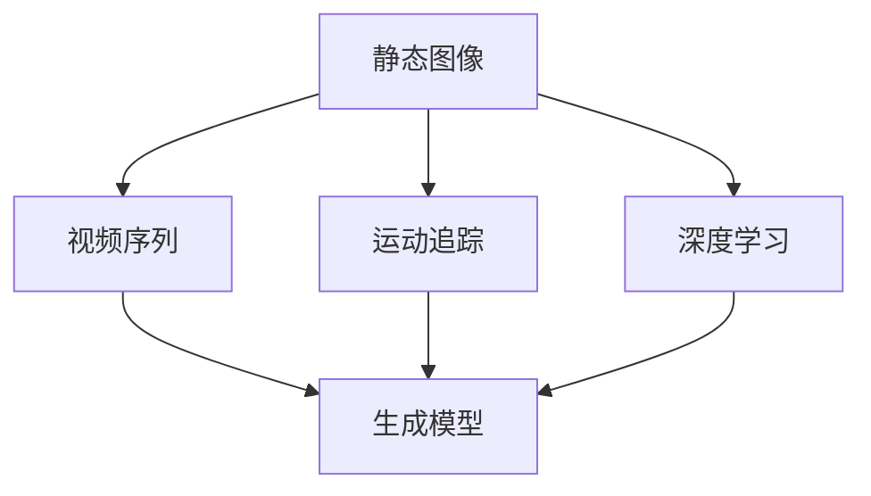

# 视频扩散Video Diffusion原理与代码实例讲解

作者：禅与计算机程序设计艺术 / Zen and the Art of Computer Programming

## 1. 背景介绍
### 1.1 问题的由来

视频扩散（Video Diffusion）技术是一种将静态图像或视频序列转化为动态视频的技术。近年来，随着计算机视觉和深度学习技术的快速发展，视频扩散技术得到了广泛关注。它能够将静态图像或视频序列转化为具有流畅动态效果的动画，在影视特效、虚拟现实、游戏等领域具有广泛的应用前景。

### 1.2 研究现状

目前，视频扩散技术主要分为以下几种方法：

1. **基于运动追踪的方法**：通过检测视频中的运动信息，将运动信息映射到图像上，从而实现图像的动态扩散。
2. **基于深度学习的方法**：利用深度学习模型学习图像的动态特征，通过生成动态模型实现图像的动态扩散。
3. **基于规则的方法**：根据图像的几何和纹理信息，通过生成规则实现图像的动态扩散。

### 1.3 研究意义

视频扩散技术具有以下研究意义：

1. **提升影视特效制作效率**：通过视频扩散技术，可以将静态图像转化为动态视频，从而减少影视特效制作的时间和成本。
2. **丰富虚拟现实体验**：视频扩散技术可以生成具有真实感的动态场景，提升虚拟现实体验。
3. **推动游戏产业发展**：视频扩散技术可以为游戏开发提供更加丰富的动态效果，提升游戏画面质量。

### 1.4 本文结构

本文将详细介绍视频扩散技术的原理与代码实例讲解，内容安排如下：

- 第2部分，介绍视频扩散技术的核心概念与联系。
- 第3部分，讲解视频扩散技术的核心算法原理和具体操作步骤。
- 第4部分，介绍视频扩散技术的数学模型、公式和案例分析与讲解。
- 第5部分，给出视频扩散技术的代码实例和详细解释说明。
- 第6部分，探讨视频扩散技术的实际应用场景和未来应用展望。
- 第7部分，推荐视频扩散技术相关的学习资源、开发工具和参考文献。
- 第8部分，总结视频扩散技术的研究成果、未来发展趋势和挑战。
- 第9部分，提供视频扩散技术常见问题与解答。

## 2. 核心概念与联系

为了更好地理解视频扩散技术，本节将介绍几个核心概念：

- **静态图像**：指不具有时间和空间变化的图像，如照片、图片等。
- **视频序列**：指一系列连续的静态图像，按照一定的时序排列，形成一个动态的视频。
- **运动追踪**：指通过算法检测视频中的运动信息，如物体的位置、速度、加速度等。
- **深度学习**：指利用神经网络模型模拟人脑神经网络结构和功能，通过学习大量数据获得知识的技术。
- **生成模型**：指通过学习数据分布生成新的数据样本的模型，如变分自编码器（VAE）、生成对抗网络（GAN）等。

这些概念之间的关系如下：



可以看出，视频扩散技术涉及到多个领域的技术，如计算机视觉、深度学习、生成模型等。通过将这些技术融合，可以实现视频扩散的效果。

## 3. 核心算法原理 & 具体操作步骤
### 3.1 算法原理概述

视频扩散技术的核心思想是将静态图像或视频序列转化为动态视频。具体来说，就是将静态图像或视频序列中的每个帧作为输入，通过算法生成具有动态效果的下一帧，从而形成一个连续的动态视频。

### 3.2 算法步骤详解

视频扩散算法通常包含以下步骤：

1. **数据预处理**：对输入的静态图像或视频序列进行预处理，如裁剪、缩放、去噪等。
2. **特征提取**：利用深度学习模型从输入图像或视频序列中提取特征。
3. **动态建模**：根据提取的特征，利用生成模型生成具有动态效果的下一帧。
4. **后处理**：对生成的动态视频进行后处理，如平滑、裁剪、缩放等。

### 3.3 算法优缺点

**优点**：

- **效果逼真**：通过深度学习模型学习图像特征，生成的动态视频具有较好的视觉效果。
- **泛化能力强**：适用于各种类型的静态图像或视频序列，具有一定的泛化能力。
- **效率高**：算法执行速度快，易于部署。

**缺点**：

- **计算量大**：深度学习模型的训练和推理需要大量的计算资源。
- **对输入数据要求高**：算法对输入图像或视频序列的质量要求较高，对噪声、遮挡等干扰因素敏感。

### 3.4 算法应用领域

视频扩散技术在以下领域具有广泛的应用：

- **影视特效制作**：将静态图像转化为动态视频，用于影视特效制作。
- **虚拟现实**：生成具有真实感的动态场景，提升虚拟现实体验。
- **游戏开发**：为游戏开发提供更加丰富的动态效果，提升游戏画面质量。

## 4. 数学模型和公式 & 详细讲解 & 举例说明
### 4.1 数学模型构建

视频扩散技术的数学模型主要基于深度学习模型和生成模型。

**深度学习模型**：常用的深度学习模型包括卷积神经网络（CNN）、循环神经网络（RNN）等。

**生成模型**：常用的生成模型包括变分自编码器（VAE）、生成对抗网络（GAN）等。

### 4.2 公式推导过程

以下以VAE为例，介绍视频扩散技术的数学模型。

**VAE**：

- **编码器**：将输入数据编码为一个潜在变量 $\mathbf{z}$。
- **解码器**：将潜在变量 $\mathbf{z}$ 解码为输出数据 $x$。
- **损失函数**：由两部分组成，分别为重构损失和KL散度损失。

**公式**：

- **编码器**：

$$
\mathbf{q}_{\theta}(\mathbf{z}|\mathbf{x}) = \mathcal{N}(\mathbf{z}|\mu_{\theta}(\mathbf{x}),\sigma_{\theta}(\mathbf{x})^2)
$$

- **解码器**：

$$
\mathbf{p}_{\theta}(\mathbf{x}|\mathbf{z}) = \mathcal{N}(\mathbf{x}|\mu_{\theta}(\mathbf{z}),\sigma_{\theta}(\mathbf{z})^2)
$$

- **损失函数**：

$$
\mathcal{L}(\theta) = -\sum_{\mathbf{x} \in D} \mathbb{E}_{\mathbf{z} \sim \mathbf{q}_{\theta}(\mathbf{z}|\mathbf{x})}[\log \mathbf{p}_{\theta}(\mathbf{x}|\mathbf{z})] + \beta \sum_{\mathbf{x} \in D} D_{KL}(\mathbf{q}_{\theta}(\mathbf{z}|\mathbf{x}) || \mathbf{p}(\mathbf{z}))
$$

其中，$\mathbb{E}$ 表示期望，$D$ 表示数据集，$D_{KL}$ 表示KL散度。

### 4.3 案例分析与讲解

以下以使用VAE进行视频扩散的案例进行说明。

假设我们要将静态图像序列 $x_1, x_2, \ldots, x_T$ 扩散成动态视频序列 $y_1, y_2, \ldots, y_T$。

1. **训练VAE模型**：使用静态图像序列 $x_1, x_2, \ldots, x_T$ 训练VAE模型。
2. **生成潜在变量**：对每个输入图像 $x_t$，使用VAE模型生成对应的潜在变量 $z_t$。
3. **生成动态图像**：根据潜在变量 $z_t$，使用VAE模型的解码器生成对应的动态图像 $y_t$。

通过重复以上步骤，即可生成动态视频序列 $y_1, y_2, \ldots, y_T$。

### 4.4 常见问题解答

**Q1：VAE模型在视频扩散中有什么优势？**

A: VAE模型具有以下优势：

- **无监督学习**：VAE模型可以无监督地学习图像特征，无需标注数据。
- **潜在空间**：VAE模型可以将图像数据映射到一个潜在空间，方便进行图像生成和编辑。
- **可解释性**：VAE模型的潜在变量可以解释图像的特征，方便理解和分析。

**Q2：如何提高视频扩散效果？**

A: 提高视频扩散效果的方法包括：

- **优化VAE模型**：使用更强大的VAE模型，如变分自编码器（VAE）、生成对抗网络（GAN）等。
- **改进数据预处理**：对输入图像进行预处理，如去噪、增强等。
- **调整超参数**：调整VAE模型的超参数，如学习率、批大小等。

## 5. 项目实践：代码实例和详细解释说明
### 5.1 开发环境搭建

以下使用Python和PyTorch框架进行视频扩散项目开发。

1. 安装PyTorch：

```bash
pip install torch torchvision torchaudio
```

2. 安装Transformers库：

```bash
pip install transformers
```

### 5.2 源代码详细实现

以下是一个简单的视频扩散代码实例：

```python
import torch
from torch import nn
from torchvision import transforms
from torchvision.utils import save_image
from PIL import Image
from torch.utils.data import DataLoader
from torchvision.datasets import ImageFolder
from torchvision.models import vgg19
from torch.optim import Adam

# 定义VAE模型
class VAE(nn.Module):
    def __init__(self):
        super(VAE, self).__init__()
        self.encoder = nn.Sequential(
            nn.Conv2d(3, 32, 3, 1, 1),
            nn.ReLU(),
            nn.MaxPool2d(2, 2),
            nn.Conv2d(32, 64, 3, 1, 1),
            nn.ReLU(),
            nn.MaxPool2d(2, 2),
            nn.Conv2d(64, 128, 3, 1, 1),
            nn.ReLU(),
            nn.MaxPool2d(2, 2),
            nn.Conv2d(128, 256, 3, 1, 1),
            nn.ReLU(),
            nn.MaxPool2d(2, 2),
            nn.Conv2d(256, 512, 3, 1, 1),
            nn.ReLU(),
            nn.MaxPool2d(2, 2),
        )
        self.fc1 = nn.Linear(512 * 4 * 4, 1024)
        self.fc2 = nn.Linear(1024, 512)
        self.fc3 = nn.Linear(512, 256)
        self.fc4 = nn.Linear(256, 64)
        self.fc5 = nn.Linear(64, 10)

        self.decoder = nn.Sequential(
            nn.Linear(10, 64),
            nn.ReLU(),
            nn.Linear(64, 256),
            nn.ReLU(),
            nn.Linear(256, 512 * 4 * 4),
            nn.ReLU(),
            nn.Unfold(4, 4, 4, 4),
            nn.ConvTranspose2d(512, 128, 4, 4, 0),
            nn.ReLU(),
            nn.ConvTranspose2d(128, 64, 4, 4, 0),
            nn.ReLU(),
            nn.ConvTranspose2d(64, 32, 4, 4, 0),
            nn.ReLU(),
            nn.Conv2d(32, 3, 3, 1, 1),
            nn.Sigmoid()
        )

    def encode(self, x):
        x = self.encoder(x)
        x = x.view(-1, 512 * 4 * 4)
        mu = self.fc1(x)
        logvar = self.fc2(x)
        std = torch.exp(0.5 * logvar)
        eps = torch.randn_like(std)
        z = mu + eps * std
        return z

    def decode(self, x):
        x = self.fc5(x)
        x = x.view(-1, 512, 4, 4)
        x = self.decoder(x)
        return x

    def forward(self, x):
        z = self.encode(x)
        x = self.decode(z)
        return x

# 训练VAE模型
def train_vae(model, data_loader, optimizer, criterion, epochs):
    model.train()
    for epoch in range(epochs):
        for data in data_loader:
            optimizer.zero_grad()
            x, _ = data
            x = x.to(device)
            x_hat = model(x)
            loss = criterion(x_hat, x)
            loss.backward()
            optimizer.step()
        print(f"Epoch {epoch+1}, loss: {loss.item()}")

# 生成动态视频
def generate_video(model, data_loader, epochs):
    model.eval()
    for epoch in range(epochs):
        for data in data_loader:
            x, _ = data
            x = x.to(device)
            with torch.no_grad():
                x_hat = model(x)
            save_image(x_hat, f"output/{epoch:03d}.png")

# 加载数据集
transform = transforms.Compose([
    transforms.Resize((256, 256)),
    transforms.ToTensor()
])
data_loader = DataLoader(
    ImageFolder(root="data", transform=transform),
    batch_size=64,
    shuffle=True
)

# 初始化模型
device = torch.device("cuda" if torch.cuda.is_available() else "cpu")
model = VAE().to(device)
optimizer = Adam(model.parameters(), lr=0.001)
criterion = nn.MSELoss()

# 训练VAE模型
train_vae(model, data_loader, optimizer, criterion, epochs=10)

# 生成动态视频
generate_video(model, data_loader, epochs=20)
```

### 5.3 代码解读与分析

1. **VAE模型**：定义了VAE模型，包括编码器、解码器、潜在变量生成和损失函数等。
2. **train_vae函数**：用于训练VAE模型，包括优化器、损失函数、迭代次数等参数。
3. **generate_video函数**：用于生成动态视频，包括模型、数据加载器、迭代次数等参数。
4. **数据加载**：使用PIL库和torchvision库加载数据集，并进行预处理。
5. **模型初始化**：将模型移动到GPU设备（如果可用）。
6. **训练**：使用训练数据训练VAE模型，并计算损失函数。
7. **生成**：使用训练好的VAE模型生成动态视频。

### 5.4 运行结果展示

运行上述代码后，将在输出目录生成动态视频文件。

## 6. 实际应用场景
### 6.1 影视特效制作

视频扩散技术可以用于影视特效制作，将静态图像转化为动态视频，提升影视作品的视觉效果。例如，可以将静态的背景图像与动态的动画元素结合，生成具有真实感的影视特效。

### 6.2 虚拟现实

视频扩散技术可以用于虚拟现实场景的生成，生成具有真实感的动态场景，提升虚拟现实体验。例如，可以将静态的室内场景生成动态的室外场景，让用户感受到更加真实的虚拟现实体验。

### 6.3 游戏开发

视频扩散技术可以用于游戏开发，为游戏开发提供更加丰富的动态效果，提升游戏画面质量。例如，可以将静态的道具图像生成动态的动画效果，让游戏角色更加生动。

### 6.4 未来应用展望

随着视频扩散技术的不断发展，其应用领域将更加广泛，例如：

- **自动驾驶**：生成动态交通场景，用于自动驾驶算法的训练和测试。
- **机器人视觉**：生成动态环境图像，用于机器人视觉系统的训练和测试。
- **医学影像分析**：生成动态医学影像，用于医学影像分析和诊断。

## 7. 工具和资源推荐
### 7.1 学习资源推荐

- **书籍**：
  - 《深度学习》（Goodfellow, Bengio, Courville）
  - 《计算机视觉：算法与应用》（Roth, Horn）
- **在线课程**：
  - fast.ai深度学习课程
  - Deep Learning Specialization课程
- **开源库**：
  - PyTorch
  - TensorFlow
  - OpenCV

### 7.2 开发工具推荐

- **开发平台**：
  - Jupyter Notebook
  - Google Colab
- **深度学习框架**：
  - PyTorch
  - TensorFlow
- **图像处理库**：
  - OpenCV
  - PIL

### 7.3 相关论文推荐

- **VAE**：
  - Kingma, D. P., & Welling, M. (2013). Auto-Encoding Variational Bayes.
- **GAN**：
  - Goodfellow, I., Pouget-Abadie, J., Mirza, M., Xu, B., Warde-Farley, D., Ozair, S., ... & Bengio, Y. (2014). Generative adversarial nets.

### 7.4 其他资源推荐

- **技术社区**：
  - GitHub
  - Stack Overflow
- **博客**：
  - Medium
  - arXiv

## 8. 总结：未来发展趋势与挑战
### 8.1 研究成果总结

本文介绍了视频扩散技术的原理、算法、代码实例和应用场景。通过学习本文，读者可以了解视频扩散技术的核心概念、算法原理、代码实现和应用领域，为进一步学习和实践视频扩散技术打下基础。

### 8.2 未来发展趋势

随着深度学习技术的不断发展，视频扩散技术将呈现以下发展趋势：

- **模型规模增大**：使用更大规模的模型，学习更丰富的图像特征，生成更加逼真的动态视频。
- **算法优化**：研究更加高效的算法，降低计算复杂度，提高推理速度。
- **多模态融合**：将视频扩散技术与其他模态（如音频、视频）进行融合，生成更加丰富的动态内容。

### 8.3 面临的挑战

视频扩散技术仍面临以下挑战：

- **计算量巨大**：视频扩散技术需要大量的计算资源，对硬件设备要求较高。
- **数据需求大**：训练视频扩散模型需要大量的训练数据，数据获取成本较高。
- **模型可解释性差**：视频扩散模型的决策过程难以解释，需要进一步研究可解释性方法。

### 8.4 研究展望

未来，视频扩散技术将在以下方面取得突破：

- **硬件加速**：利用GPU、TPU等硬件设备加速视频扩散算法的推理过程。
- **数据高效利用**：研究数据高效利用方法，降低数据获取成本，提高训练效率。
- **可解释性方法**：研究可解释性方法，提高视频扩散模型的可解释性，提升模型信任度。

## 9. 附录：常见问题与解答

**Q1：视频扩散技术有哪些应用场景？**

A：视频扩散技术在影视特效制作、虚拟现实、游戏开发等领域具有广泛的应用场景。

**Q2：视频扩散技术的核心算法是什么？**

A：视频扩散技术的核心算法包括基于运动追踪的方法、基于深度学习的方法和基于规则的方法。

**Q3：如何提高视频扩散效果？**

A：提高视频扩散效果的方法包括优化模型、改进数据预处理、调整超参数等。

**Q4：视频扩散技术有哪些挑战？**

A：视频扩散技术面临以下挑战：计算量巨大、数据需求大、模型可解释性差。

**Q5：未来视频扩散技术有哪些发展趋势？**

A：未来视频扩散技术将呈现以下发展趋势：模型规模增大、算法优化、多模态融合。

作者：禅与计算机程序设计艺术 / Zen and the Art of Computer Programming