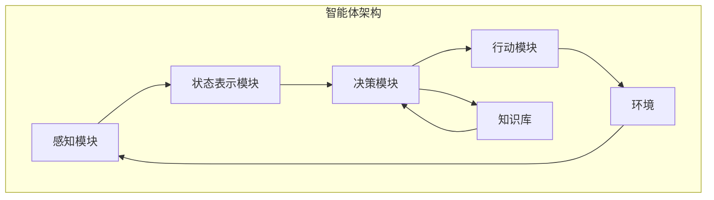

以下是对《AI Agent: AI的下一个风口 智能体的核心技术》这一主题的技术博客文章正文部分：

# AI Agent: AI的下一个风口 智能体的核心技术

## 1. 背景介绍

### 1.1 问题的由来

在过去几十年中,人工智能(AI)取得了长足的进步,尤其是在机器学习和深度学习领域。然而,现有的AI系统大多被视为"窄"AI,专注于解决特定的任务,如图像识别、自然语言处理等。这些系统虽然在特定领域表现出色,但缺乏通用智能、自主性和适应性,无法像人类那样灵活地处理复杂的、多样化的任务。

为了实现通用人工智能(Artificial General Intelligence, AGI),需要一种新型的AI范式,即智能体(Intelligent Agent)。智能体是一种自主的软件实体,能够感知环境、处理信息、做出决策并采取行动,以实现特定目标。与传统的AI系统相比,智能体具有更强的自主性、适应性和交互能力,能够在复杂、动态的环境中有效运作。

### 1.2 研究现状  

智能体的概念源于人工智能领域,最早可追溯到20世纪60年代。随着计算能力和算法的不断进步,智能体技术也在不断发展。目前,智能体已经在一些特定领域得到应用,如机器人控制、游戏AI、多智能体系统等。然而,构建通用智能体系统仍然是一个巨大的挑战,需要解决诸多技术难题。

### 1.3 研究意义

智能体技术被认为是实现AGI的关键途径之一。通过智能体,我们可以构建具有自主性、适应性和交互能力的智能系统,使其能够在复杂的环境中高效运作。智能体技术的突破不仅将推动人工智能的发展,也将为许多应用领域带来革命性的变化,如智能机器人、智能交通系统、智能家居等。

### 1.4 本文结构

本文将全面介绍智能体的核心技术,包括智能体的基本概念、架构、关键算法,以及在实际应用中的实践。文章将分为以下几个部分:

1. 核心概念与联系
2. 核心算法原理与具体操作步骤
3. 数学模型和公式详细讲解与案例分析  
4. 项目实践:代码实例和详细解释说明
5. 实际应用场景
6. 工具和资源推荐
7. 总结:未来发展趋势与挑战
8. 附录:常见问题与解答

## 2. 核心概念与联系

智能体(Intelligent Agent)是一种自主的软件实体,能够感知环境、处理信息、做出决策并采取行动,以实现特定目标。智能体需要具备以下几个核心能力:

1. **感知(Perception)**: 智能体需要能够从环境中获取信息,如视觉、听觉、触觉等传感器数据。
2. **学习(Learning)**: 智能体需要能够从经验中学习,不断优化自身的决策和行为策略。
3. **推理(Reasoning)**: 智能体需要能够对获取的信息进行处理和推理,以做出正确的决策。
4. **规划(Planning)**: 智能体需要能够制定行动计划,以实现特定目标。
5. **交互(Interaction)**: 智能体需要能够与环境和其他智能体进行交互和协作。

智能体通常采用**感知-决策-行动**的循环模式运作。在每个周期中,智能体首先从环境中获取感知数据,然后基于这些数据和自身的知识库进行推理和决策,最后执行相应的行动,影响环境的状态。这个过程不断重复,使智能体能够持续学习和优化自身的行为策略。

智能体的架构可以分为几个关键模块,如下图所示:

1. **感知模块(Perception Module)**: 负责从环境中获取原始数据,如图像、声音、传感器读数等,并对这些数据进行预处理和特征提取。
2. **状态表示模块(State Representation Module)**: 将感知模块获取的数据转换为智能体可以理解的状态表示,作为决策模块的输入。
3. **决策模块(Decision Module)**: 根据当前状态表示和知识库中的信息,利用各种算法(如规划算法、强化学习算法等)做出决策,确定下一步的行动。
4. **行动模块(Action Module)**: 根据决策模块的指令,执行相应的行动,影响环境的状态。
5. **知识库(Knowledge Base)**: 存储智能体的背景知识、经验和学习结果,为决策模块提供支持。

智能体的核心挑战在于如何设计高效的算法,使其能够在复杂、动态的环境中做出正确的决策和行动。下一节将详细介绍智能体中的关键算法原理。

## 3. 核心算法原理与具体操作步骤  

### 3.1 算法原理概述

智能体中的核心算法主要包括以下几类:

1. **规划算法(Planning Algorithms)**: 用于生成行动序列以实现特定目标,如A*算法、实时规划算法等。
2. **强化学习算法(Reinforcement Learning Algorithms)**: 通过试错和奖惩机制,学习最优的行为策略,如Q-Learning、策略梯度算法等。
3. **多智能体算法(Multi-Agent Algorithms)**: 用于协调多个智能体之间的行为,实现协作或竞争,如博弈论算法、分布式约束优化算法等。
4. **决策理论算法(Decision Theory Algorithms)**: 根据概率模型和效用函数做出最优决策,如马尔可夫决策过程、部分可观测马尔可夫决策过程等。

这些算法通常会结合其他技术,如机器学习、知识表示与推理、计算机视觉等,以提高智能体的性能。

### 3.2 算法步骤详解

以下以**Q-Learning**算法为例,详细介绍强化学习算法在智能体中的应用。

Q-Learning是一种基于时间差分的无模型强化学习算法,它不需要事先了解环境的转移概率模型,而是通过与环境的交互来学习最优策略。算法的核心思想是,对于每个状态-行动对,维护一个Q值(Q-value),表示在该状态下采取该行动所能获得的长期累积奖励。通过不断更新Q值,智能体可以逐步学习到最优的行为策略。

Q-Learning算法的步骤如下:

1. 初始化Q表(Q-table),对于所有可能的状态-行动对,将Q值初始化为任意值(通常为0)。
2. 对于每个时间步:
    a. 根据当前状态,选择一个行动(exploitation或exploration)。
    b. 执行选择的行动,观察环境的反馈(奖励和新状态)。
    c. 根据观察到的奖励和新状态,更新Q表中相应的Q值:
        $$Q(s_t, a_t) \leftarrow Q(s_t, a_t) + \alpha \big[r_t + \gamma \max_a Q(s_{t+1}, a) - Q(s_t, a_t)\big]$$
        其中:
        - $\alpha$ 是学习率,控制新信息对Q值的影响程度。
        - $\gamma$ 是折现因子,控制未来奖励的重要性。
        - $r_t$ 是在时间步t获得的即时奖励。
        - $\max_a Q(s_{t+1}, a)$ 是在新状态下可获得的最大Q值。
3. 重复步骤2,直到Q值收敛或达到停止条件。

在实际应用中,Q-Learning算法还需要解决一些关键问题,如exploration-exploitation权衡、状态空间的离散化、函数逼近等。此外,还有许多其他强化学习算法可供选择,如Deep Q-Network(DQN)、Proximal Policy Optimization(PPO)等,它们通过结合深度学习技术,可以处理连续状态空间和行动空间,提高算法的性能和泛化能力。

### 3.3 算法优缺点

Q-Learning算法的主要优点包括:

1. **无模型(Model-free)**: 不需要事先了解环境的转移概率模型,可以直接从经验中学习。
2. **离线学习(Off-policy Learning)**: 可以利用任何行为策略收集的经验进行学习,而不局限于当前策略。
3. **收敛性**: 在满足一定条件下,Q-Learning算法可以收敛到最优策略。

但Q-Learning算法也存在一些缺点和局限性:

1. **维数灾难(Curse of Dimensionality)**: 当状态空间和行动空间很大时,Q表的维数将急剧增加,导致计算和存储开销过大。
2. **探索与利用的权衡(Exploration-Exploitation Tradeoff)**: 算法需要在探索新的状态-行动对(以发现更好的策略)和利用已知的最优行动(以获取更高的即时奖励)之间权衡。
3. **部分可观测性(Partial Observability)**: 在部分可观测的环境中,Q-Learning算法的性能会受到影响。

为了克服这些缺点,研究人员提出了许多改进算法,如Deep Q-Network(DQN)、双重深度Q网络(Double DQN)、优先经验重播(Prioritized Experience Replay)等。这些算法通过引入深度学习技术、改进经验回放机制等方式,提高了算法的性能和泛化能力。

### 3.4 算法应用领域

强化学习算法在智能体领域有广泛的应用,包括但不限于:

1. **游戏AI**: 训练智能体玩各种电子游戏,如国际象棋、围棋、视频游戏等。
2. **机器人控制**: 训练机器人在各种环境中执行任务,如导航、操作、协作等。
3. **自动驾驶**: 训练自动驾驶系统在复杂的交通环境中安全行驶。
4. **资源管理**: 优化数据中心、电网等资源的调度和分配。
5. **金融交易**: 训练智能交易系统进行自动化交易决策。
6. **推荐系统**: 根据用户的行为习惯,推荐个性化的商品或内容。

总的来说,强化学习算法在任何需要基于环境反馈进行决策和优化的场景中都有潜在应用。随着算法的不断改进和计算能力的提高,强化学习在智能体领域的应用前景将越来越广阔。

## 4. 数学模型和公式详细讲解与举例说明

在智能体系统中,数学模型和公式扮演着至关重要的角色,为算法提供理论基础和分析工具。本节将重点介绍马尔可夫决策过程(Markov Decision Process, MDP)和部分可观测马尔可夫决策过程(Partially Observable Markov Decision Process, POMDP)这两个核心数学模型,并详细讲解相关公式及其应用。

### 4.1 数学模型构建

#### 马尔可夫决策过程(MDP)

马尔可夫决策过程是智能体决策理论中最基本的数学框架。一个MDP可以用一个五元组 $(S, A, P, R, \gamma)$ 来表示:

- $S$ 是状态集合,表示环境可能的状态。
- $A$ 是行动集合,表示智能体可以采取的行动。
- $P(s' | s, a)$ 是状态转移概率,表示在状态 $s$ 下执行行动 $a$ 后,转移到状态 $s'$ 的概率。
- $R(s, a, s')$ 是奖励函数,表示在状态 $s$ 下执行行动 $a$ 并转移到状态 $s'$ 时获得的即时奖励。
- $\gamma \in [0, 1)$ 是折现因子,用于权衡即时奖励和未来奖励的重要性。

在MDP中,智能体的目标是找到一个最优策略 $\pi^*(s)$,使得在任意初始状态 $s_0$ 下,按照该策略行动所获得的期望累积折现奖励最大:

$$\max_\pi \mathbb{E}\Big[\sum_{t=0}^\infty \gamma^t R(s_t, \pi(s_