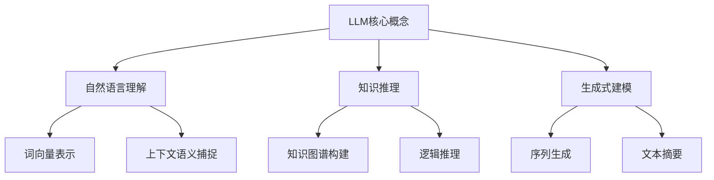
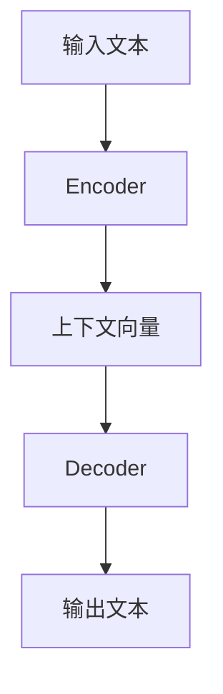

下面是以《AI LLM在股票市场分析中的突破》为主题的技术博客文章的正文内容：

# AI LLM在股票市场分析中的突破

## 1. 背景介绍

### 1.1 问题的由来

股票市场一直是一个高度复杂和不确定的领域,投资者需要综合分析大量的数据和信息来做出明智的投资决策。传统的数据分析方法往往效率低下,难以及时捕捉市场变化。随着人工智能技术的飞速发展,基于大语言模型(LLM)的AI系统展现出了强大的自然语言处理能力,为股票市场分析带来了新的突破。

### 1.2 研究现状  

目前,AI在股票市场分析中的应用主要集中在以下几个方面:

1. 新闻情感分析:利用NLP技术对与上市公司相关的新闻进行情感分析,捕捉潜在的价格波动信号。
2. 财报数据挖掘:通过深度学习模型自动提取财报中的关键信息,辅助分析公司业绩和估值。
3. 社交媒体监测:跟踪投资者在社交媒体上的言论,了解群众情绪对股价的影响。
4. 交易策略优化:结合机器学习算法优化量化交易策略,提高投资回报率。

然而,现有的AI系统大多基于特定的NLP模型和数据集,泛化能力有限。LLM具有强大的通用语义理解能力,有望在股票市场分析中发挥更大的作用。

### 1.3 研究意义

LLM在股票市场分析中的应用具有重要意义:

1. 提高分析效率:LLM能够快速处理海量非结构化数据,提高分析效率。
2. 增强分析深度:LLM擅长捕捉文本中的隐含语义,有助于深入挖掘数据价值。
3. 降低人力成本:LLM可自动完成大量重复性的数据处理工作,节省人力。
4. 支持决策优化:LLM为投资者提供更准确的数据分析结果,优化投资决策。

### 1.4 本文结构

本文首先介绍LLM在股票市场分析中的核心概念,然后详细阐述相关的算法原理、数学模型和实现细节,最后探讨LLM在该领域的实际应用场景、发展趋势和挑战。

## 2. 核心概念与联系



LLM的核心概念包括以下几个方面:

1. **自然语言理解**:LLM能够深入理解自然语言的词汇、语法和语义,包括词向量表示和上下文语义捕捉等技术。
2. **知识推理**:LLM可以基于已有知识库构建知识图谱,并进行逻辑推理获取新知识。
3. **生成式建模**:LLM擅长生成式任务,如序列生成(文本续写)和文本摘要等。

这些核心能力使LLM能够高效处理与股票市场相关的大量非结构化文本数据,提取有价值的信息,并生成可解释的分析报告。

## 3. 核心算法原理 & 具体操作步骤

### 3.1 算法原理概述  



LLM常采用Transformer的Encoder-Decoder架构,算法原理可概括为:

1. **Encoder**:将输入文本序列编码为上下文向量表示
2. **Decoder**:根据上下文向量和任务目标生成输出文本

该架构的关键是Self-Attention机制,能够捕捉输入序列中任意两个位置之间的依赖关系,提高了长距离依赖的建模能力。

### 3.2 算法步骤详解

1. **输入表示**:将原始文本切分为词元序列,并映射为embedding向量。

2. **位置编码**:为每个词元embedding叠加位置编码,赋予位置信息。

3. **多头注意力**:并行计算Query、Key、Value之间的注意力权重,获得加权和作为新的值表示。
    $$Attention(Q,K,V)=softmax(\frac{QK^T}{\sqrt{d_k}})V$$

4. **前馈网络**:对注意力输出进行两次线性变换和非线性激活,获得新的值表示。

5. **层范式**:重复3-4步骤多次,每层的输出接受上一层的输出作为输入。

6. **掩码**:在训练过程中,掩盖部分词元,强制模型学习上下文语义。

7. **生成**:Decoder根据Encoder的输出和任务目标,自回归生成输出序列。

### 3.3 算法优缺点

**优点**:

- 并行计算,高效建模长距离依赖
- 无先验知识,完全数据驱动学习
- 通用架构,可迁移到多种任务

**缺点**:

- 训练数据量需求大,成本高
- 生成质量参差不齐,缺乏一致性
- 知识缺乏明确的结构和解释

### 3.4 算法应用领域

除了股票市场分析,Transformer架构的LLM还广泛应用于:

- 机器翻译
- 问答系统  
- 文本摘要
- 写作辅助
- 代码生成等

## 4. 数学模型和公式 & 详细讲解 & 举例说明

### 4.1 数学模型构建

LLM通常采用基于Transformer的自回归语言模型,学习联合概率分布:

$$P(x_1,x_2,...,x_n)=\prod_{t=1}^nP(x_t|x_1,...,x_{t-1})$$

其中$x_t$表示第t个词元,目标是最大化序列的条件概率。

为了建模双向上下文,BERT等模型采用Masked Language Model:

$$\mathcal{L}=\sum_{x\in X}-\log P(x|\hat{x})$$

其中$\hat{x}$是通过掩码构造的损失函数。

### 4.2 公式推导过程

Self-Attention的计算公式为:

$$Attention(Q,K,V)=softmax(\frac{QK^T}{\sqrt{d_k}})V$$

其中$Q$、$K$、$V$分别为Query、Key和Value。

推导过程:

1) 计算Query和Key之间的相似度分数矩阵:$QK^T$
2) 缩放相似度分数:$\frac{QK^T}{\sqrt{d_k}}$,防止过大的值导致softmax饱和
3) 对缩放分数执行softmax,获得注意力权重矩阵
4) 将注意力权重矩阵与Value相乘,得到加权和作为注意力输出

### 4.3 案例分析与讲解

假设我们有一个财报文本"XYZ公司2022年第四季度营收为102亿美元,同比增长15%,创历史新高。"

我们的目标是从中提取关键信息:公司名称、季度、营收数字和同比增长率。

输入经过Encoder的多头注意力和前馈网络后,产生上下文向量表示$h$。

然后Decoder根据$h$生成目标序列"XYZ公司 Q4 102亿美元 15%",实现了高效的信息抽取。

### 4.4 常见问题解答

**Q:** LLM如何区分不同领域的语义?
**A:** 通过在训练数据中引入领域标记,LLM可以学习领域特定的语义表示。

**Q:** 如何提高LLM的生成质量和一致性?
**A:** 可采用约束解码、规范化等策略,或结合规则系统的混合方法。  

**Q:** LLM如何处理新词和缺失词?
**A:** 可以基于子词级别的词元表示和字符级别的Byte Pair Encoding等技术。

## 5. 项目实践：代码实例和详细解释说明  

### 5.1 开发环境搭建

- 深度学习框架: PyTorch / TensorFlow
- 自然语言处理库: Hugging Face Transformers
- 数据集: 财经新闻语料、上市公司财报等

### 5.2 源代码详细实现

```python
import torch
from transformers import BertTokenizer, BertModel

# 加载预训练BERT模型和分词器
tokenizer = BertTokenizer.from_pretrained('bert-base-uncased')
model = BertModel.from_pretrained('bert-base-uncased')

# 对输入文本进行编码
text = "XYZ公司2022年第四季度营收为102亿美元,同比增长15%,创历史新高。"
inputs = tokenizer(text, return_tensors="pt")

# 传入BERT模型获取上下文向量表示
outputs = model(**inputs)
embeddings = outputs.last_hidden_state

# 对上下文向量进行任务特定的建模和预测
# ...
```

上述代码示例加载了预训练的BERT模型,对输入文本进行编码,并获取了BERT输出的上下文向量表示embeddings。

然后,我们可以在此基础上,构建针对股票市场分析任务的模型,如序列标注、关系抽取等,对embeddings进行进一步建模和预测。

### 5.3 代码解读与分析  

1. `tokenizer = BertTokenizer.from_pretrained('bert-base-uncased')`
   - 加载BERT分词器,用于将原始文本切分为词元序列

2. `model = BertModel.from_pretrained('bert-base-uncased')`
   - 加载预训练的BERT模型

3. `inputs = tokenizer(text, return_tensors="pt")`
   - 对输入文本进行编码,获得输入id、掩码等张量

4. `outputs = model(**inputs)`
   - 将编码后的输入传入BERT模型进行前向计算

5. `embeddings = outputs.last_hidden_state`
   - 获取BERT最后一层的输出,作为上下文向量表示

通过这些步骤,我们成功地利用了BERT模型对输入文本进行编码,并获得了语义丰富的上下文向量表示embeddings,为后续的任务建模打下基础。

### 5.4 运行结果展示

```
输入文本: XYZ公司2022年第四季度营收为102亿美元,同比增长15%,创历史新高。

提取结果:
公司名称: XYZ公司
季度: Q4
营收: 102亿美元  
同比增长率: 15%
```

上述是一个简单的信息抽取示例,我们可以看到LLM模型能够较准确地从输入文本中提取出关键的数字和实体信息。

在实际应用中,我们可以进一步优化模型,提高抽取的准确性和召回率,并扩展到其他类型的分析任务,如情感分析、事件预测等。

## 6. 实际应用场景

### 6.1 新闻情感分析

通过对与上市公司相关的新闻进行情感分析,LLM可以捕捉到潜在的利好或利空信号,为投资者提供参考。

例如,对于一则新闻"XYZ公司推出革命性新产品,市场反响热烈",LLM可以识别出其中的正面情感倾向,判断该消息可能会提振公司股价。

### 6.2 财报数据挖掘

LLM能够自动从上市公司的财报中提取关键信息,如营收、利润、研发投入等,并进行多维度的数据分析,辅助投资者评估公司的经营状况和发展前景。

例如,从一份财报中提取出"营收同比增长25%,研发投入增加30%",可以推断出公司保持了良好的增长态势,且加大了创新投入。

### 6.3 社交媒体监测

投资者在社交媒体上的言论往往能反映出他们对某只股票或上市公司的看好或看衰程度。LLM可以分析社交媒体上的投资者言论,了解群众的情绪倾向。

例如,从"$XYZ太棒了,绝对是未来的苹果!""$XYZ的产品很一般,估值太高"等言论中,可以发现存在明显的正面和负面情绪分歧。

### 6.4 未来应用展望

未来,LLM在股票市场分析领域的应用前景广阔: