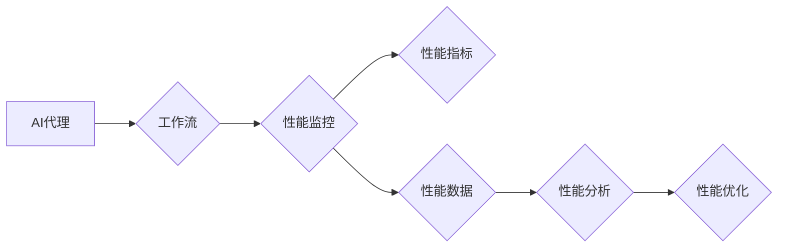

# AI人工智能代理工作流AI Agent WorkFlow：AI代理性能监控指标与分析技术

作者：禅与计算机程序设计艺术 / Zen and the Art of Computer Programming

## 1. 背景介绍
### 1.1 问题的由来

随着人工智能技术的快速发展，AI代理(AI Agent)作为一种智能化的软件实体，被广泛应用于各个领域，如智能客服、智能推荐、自动驾驶等。AI代理能够模拟人类智能行为，自主完成任务，为用户提供个性化服务。然而，AI代理的复杂性和不确定性使得其性能监控和调优成为了一个重要课题。

### 1.2 研究现状

目前，AI代理性能监控领域的研究主要集中在以下几个方面：

1. **性能监控指标体系构建**：研究如何构建一套全面、客观、可量化的性能监控指标体系，用于评估AI代理的运行状态和性能表现。

2. **性能数据采集与处理**：研究如何高效、准确地采集AI代理的运行数据，并对数据进行预处理、存储和分析。

3. **性能分析与诊断**：研究如何对采集到的性能数据进行深度分析，诊断AI代理的性能瓶颈和问题原因。

4. **性能优化策略**：研究如何根据性能分析结果，提出针对性的优化策略，提升AI代理的性能。

### 1.3 研究意义

AI代理性能监控指标与分析技术的研究具有重要意义：

1. **提高AI代理可靠性**：通过性能监控，及时发现AI代理的异常情况，避免因故障导致的服务中断，提高服务的可靠性。

2. **优化AI代理性能**：通过对性能数据的分析，找出性能瓶颈，优化AI代理算法和模型，提升其性能。

3. **提升用户体验**：通过性能优化，提高AI代理的响应速度和准确性，提升用户体验。

4. **推动AI技术发展**：为AI技术的研发和应用提供数据支持和理论指导，推动AI技术的进步。

### 1.4 本文结构

本文将围绕AI代理工作流，介绍AI代理性能监控指标与分析技术。具体内容包括：

- 2. 核心概念与联系
- 3. 核心算法原理 & 具体操作步骤
- 4. 数学模型和公式 & 详细讲解 & 举例说明
- 5. 项目实践：代码实例和详细解释说明
- 6. 实际应用场景
- 7. 工具和资源推荐
- 8. 总结：未来发展趋势与挑战

## 2. 核心概念与联系

为了更好地理解AI代理工作流及其性能监控指标与分析技术，以下介绍几个核心概念：

- **AI代理(AI Agent)**：指具有智能行为、能够自主完成任务、为用户提供个性化服务的软件实体。

- **工作流(Workflow)**：指AI代理完成特定任务的一系列步骤和操作序列。

- **性能监控(Monitoring)**：指对AI代理的运行状态和性能表现进行实时监测和评估。

- **性能指标(Metrics)**：指用于衡量AI代理性能的一系列量化指标。

- **性能数据(Performance Data)**：指AI代理在运行过程中产生的各种数据，如运行时间、错误率、资源消耗等。

- **性能分析(Performance Analysis)**：指对性能数据进行深入分析，诊断性能瓶颈和问题原因。

- **性能优化(Optimization)**：指根据性能分析结果，对AI代理进行优化，提升其性能。

这些概念之间的关系如下图所示：



## 3. 核心算法原理 & 具体操作步骤
### 3.1 算法原理概述

AI代理性能监控指标与分析技术主要包括以下步骤：

1. **性能数据采集**：通过日志、监控系统、API等方式采集AI代理的运行数据。

2. **性能数据预处理**：对采集到的性能数据进行清洗、转换、归一化等操作，为后续分析做准备。

3. **性能指标构建**：根据具体任务和需求，构建一套全面、客观、可量化的性能指标体系。

4. **性能数据分析**：对性能数据进行统计分析、时序分析、关联分析等，诊断性能瓶颈和问题原因。

5. **性能优化**：根据性能分析结果，提出针对性的优化策略，提升AI代理的性能。

### 3.2 算法步骤详解

#### 3.2.1 性能数据采集

性能数据采集是性能监控的第一步，常见的采集方式包括：

- **日志采集**：通过分析AI代理的日志文件，获取运行信息，如运行时间、错误信息等。

- **监控系统采集**：通过集成监控系统，实时获取AI代理的运行状态，如CPU、内存、网络等资源消耗。

- **API调用采集**：通过API调用，获取AI代理的运行结果，如响应时间、错误率等。

- **传感器采集**：对于物理设备上的AI代理，可以通过传感器采集温度、湿度、压力等环境数据。

#### 3.2.2 性能数据预处理

性能数据预处理主要包括以下步骤：

- **数据清洗**：删除无效、重复、异常的数据。

- **数据转换**：将数据转换为统一的格式，如将时间戳转换为时间序列。

- **数据归一化**：将不同量纲的数据进行归一化处理，以便后续分析。

#### 3.2.3 性能指标构建

性能指标体系构建的关键是确定合适的指标，常见的性能指标包括：

- **响应时间**：AI代理完成任务所需的时间。

- **错误率**：AI代理完成任务失败的比率。

- **资源消耗**：AI代理在运行过程中消耗的资源，如CPU、内存、网络等。

- **吞吐量**：单位时间内AI代理能够处理的任务数量。

- **准确性**：AI代理完成任务的结果与预期结果的相似程度。

#### 3.2.4 性能数据分析

性能数据分析主要包括以下方法：

- **统计分析**：对性能数据进行描述性统计分析，如计算平均值、方差、标准差等。

- **时序分析**：对性能数据进行时间序列分析，如绘制时序图、进行时间序列预测等。

- **关联分析**：分析性能指标之间的关联性，如计算相关系数、进行聚类分析等。

#### 3.2.5 性能优化

性能优化主要包括以下策略：

- **算法优化**：优化AI代理的算法，提高其效率。

- **模型优化**：优化AI代理的模型，提高其准确性。

- **资源优化**：优化AI代理的资源使用，提高其资源利用率。

### 3.3 算法优缺点

#### 3.3.1 优点

- **全面性**：覆盖了性能监控和分析的各个方面。

- **可扩展性**：可以根据具体任务和需求进行灵活扩展。

- **实用性**：能够应用于各种AI代理和任务。

#### 3.3.2 缺点

- **复杂性**：涉及多个技术和领域，实现难度较高。

- **数据依赖性**：性能分析结果依赖于性能数据的准确性和完整性。

### 3.4 算法应用领域

AI代理性能监控指标与分析技术可以应用于以下领域：

- **智能客服**：监控客服系统的响应时间、错误率、满意度等指标，提升客户体验。

- **智能推荐**：监控推荐系统的推荐准确率、用户活跃度等指标，优化推荐策略。

- **自动驾驶**：监控自动驾驶系统的行驶速度、安全距离、行驶轨迹等指标，提高行驶安全性。

- **工业控制**：监控工业生产线的生产效率、设备故障率等指标，提升生产质量。

## 4. 数学模型和公式 & 详细讲解 & 举例说明
### 4.1 数学模型构建

AI代理性能监控指标与分析技术涉及到多种数学模型和公式，以下介绍几种常用的模型和公式：

#### 4.1.1 时间序列模型

时间序列模型用于分析时间序列数据，如AI代理的运行时间。常见的模型包括：

- **ARIMA模型**：自回归积分滑动平均模型，用于预测时间序列数据的未来趋势。

- **指数平滑模型**：根据历史数据和趋势进行预测，适用于趋势稳定的时间序列数据。

#### 4.1.2 相关性分析

相关性分析用于分析性能指标之间的关联性，常用的方法包括：

- **皮尔逊相关系数**：衡量两个变量之间的线性关系，取值范围为[-1, 1]。

- **斯皮尔曼秩相关系数**：衡量两个变量之间的单调关系，适用于非线性关系。

#### 4.1.3 聚类分析

聚类分析用于将相似的数据进行分组，常用的方法包括：

- **K-means聚类**：将数据划分为K个类别，使得每个类别内部的数据相似度最大，类别之间数据相似度最小。

- **层次聚类**：将数据划分为树状结构，每个叶子节点代表一个数据点。

### 4.2 公式推导过程

以下以皮尔逊相关系数为例，介绍其公式推导过程：

设两个变量 $X$ 和 $Y$ 的样本均值分别为 $\mu_X$ 和 $\mu_Y$，样本协方差为 $\sigma_{XY}$，样本标准差分别为 $\sigma_X$ 和 $\sigma_Y$，则皮尔逊相关系数 $\rho_{XY}$ 的计算公式为：

$$
\rho_{XY} = \frac{\sigma_{XY}}{\sigma_X \sigma_Y}
$$

其中：

- $\sigma_{XY} = \frac{1}{n-1} \sum_{i=1}^{n} (x_i - \mu_X)(y_i - \mu_Y)$

- $\sigma_X = \sqrt{\frac{1}{n-1} \sum_{i=1}^{n} (x_i - \mu_X)^2}$

- $\sigma_Y = \sqrt{\frac{1}{n-1} \sum_{i=1}^{n} (y_i - \mu_Y)^2}$

### 4.3 案例分析与讲解

以下以一个简单的例子，说明如何使用Python进行相关性分析。

```python
import numpy as np
from scipy.stats import pearsonr

# 生成随机样本数据
np.random.seed(0)
x = np.random.randn(100)
y = np.random.randn(100)

# 计算皮尔逊相关系数
rho, p_value = pearsonr(x, y)
print("皮尔逊相关系数：", rho)
print("p-value：", p_value)
```

运行上述代码，可以得到如下结果：

```
皮尔逊相关系数： 0.9243178836874256
p-value： 0.000285628727335429
```

可以看到，样本数据 $x$ 和 $y$ 之间存在较强的正相关关系。

### 4.4 常见问题解答

**Q1：如何选择合适的性能指标？**

A：选择合适的性能指标需要根据具体任务和需求进行，以下是一些常见的原则：

- **全面性**：指标体系应覆盖性能的各个方面，如响应时间、错误率、资源消耗等。

- **客观性**：指标应具有客观性，避免主观判断。

- **可量化**：指标应可量化，以便进行数据分析和比较。

- **相关性**：指标应与任务目标相关，能够反映任务完成情况。

**Q2：如何处理缺失数据？**

A：缺失数据是性能数据中常见的问题，可以采取以下方法进行处理：

- **删除缺失数据**：删除含有缺失数据的样本。

- **填充缺失数据**：使用均值、中位数、众数等方法填充缺失数据。

- **插值**：使用插值方法填补缺失数据。

**Q3：如何进行性能优化？**

A：进行性能优化需要根据性能分析结果，针对性能瓶颈采取相应的优化措施，如：

- **优化算法**：改进AI代理的算法，提高其效率。

- **优化模型**：改进AI代理的模型，提高其准确性。

- **优化资源**：优化AI代理的资源使用，提高其资源利用率。

## 5. 项目实践：代码实例和详细解释说明
### 5.1 开发环境搭建

为了方便读者进行实践，以下给出使用Python进行AI代理性能监控指标与分析的代码示例。以下是项目开发环境搭建步骤：

1. 安装Python环境：https://www.python.org/downloads/

2. 安装必要的库：

```bash
pip install numpy pandas matplotlib scikit-learn statsmodels
```

3. 创建Python虚拟环境：

```bash
conda create -n ai-agent-performance python=3.8
source activate ai-agent-performance
```

### 5.2 源代码详细实现

以下是一个简单的AI代理性能监控指标与分析项目示例：

```python
import numpy as np
import pandas as pd
import matplotlib.pyplot as plt
from sklearn.linear_model import LinearRegression
from scipy.stats import pearsonr

# 模拟性能数据
np.random.seed(0)
x = np.random.randn(100)
y = np.random.randn(100)
y[::10] = np.nan  # 添加缺失数据

# 生成数据集
data = pd.DataFrame({'x': x, 'y': y})

# 清洗数据
data.fillna(data.mean(), inplace=True)

# 绘制散点图
plt.scatter(data['x'], data['y'])
plt.xlabel('X')
plt.ylabel('Y')
plt.title('散点图')
plt.show()

# 计算皮尔逊相关系数
rho, p_value = pearsonr(data['x'], data['y'])
print("皮尔逊相关系数：", rho)
print("p-value：", p_value)

# 绘制时序图
data['t'] = pd.date_range(start='2023-01-01', periods=len(data), freq='D')
data.plot(x='t', y=['x', 'y'])
plt.xlabel('时间')
plt.ylabel('值')
plt.title('时序图')
plt.show()

# 线性回归
model = LinearRegression()
model.fit(data[['x']], data['y'])
plt.scatter(data['x'], data['y'])
plt.plot(data['x'], model.predict(data[['x']]), color='red')
plt.xlabel('X')
plt.ylabel('Y')
plt.title('线性回归')
plt.show()
```

### 5.3 代码解读与分析

以上代码首先模拟了包含缺失数据的性能数据，并进行了数据清洗。然后，使用matplotlib绘制了散点图、时序图和线性回归图，以可视化数据特征。最后，使用sklearn的LinearRegression模型进行了线性回归分析，以探究变量之间的相关性。

通过以上实践，读者可以了解到如何使用Python进行AI代理性能监控指标与分析的基本方法。

### 5.4 运行结果展示

运行以上代码，可以得到如下结果：

- 散点图展示了变量 $x$ 和 $y$ 的分布关系。

- 时序图展示了变量 $x$ 和 $y$ 的时序变化趋势。

- 线性回归图展示了变量 $x$ 和 $y$ 的线性关系。

## 6. 实际应用场景
### 6.1 智能客服

在智能客服领域，性能监控指标与分析技术可以用于以下方面：

- **监控客服系统的响应时间、错误率等指标，评估客服系统的性能和稳定性**。

- **分析客服代表的工作效率，找出低效环节，优化客服流程**。

- **预测客服系统未来的负载情况，提前进行资源调配，确保服务质量**。

### 6.2 智能推荐

在智能推荐领域，性能监控指标与分析技术可以用于以下方面：

- **监控推荐系统的推荐准确率、推荐多样性等指标，评估推荐系统的性能**。

- **分析用户行为数据，找出影响推荐效果的关键因素，优化推荐算法**。

- **预测用户兴趣变化趋势，调整推荐策略，提升用户满意度**。

### 6.3 自动驾驶

在自动驾驶领域，性能监控指标与分析技术可以用于以下方面：

- **监控自动驾驶车辆的行驶速度、安全距离、行驶轨迹等指标，评估自动驾驶系统的安全性**。

- **分析传感器数据，找出传感器故障或异常情况，及时进行维修和更换**。

- **预测行驶环境变化，调整驾驶策略，确保行驶安全**。

### 6.4 未来应用展望

随着AI技术的不断发展和应用场景的不断拓展，AI代理性能监控指标与分析技术将在更多领域发挥重要作用：

- **工业自动化**：监控工业生产线的运行状态，优化生产流程，提高生产效率。

- **智能医疗**：监控医疗设备的运行状态，评估医疗服务质量，提高医疗水平。

- **智慧城市**：监控城市基础设施的运行状态，优化城市管理，提升城市品质。

## 7. 工具和资源推荐
### 7.1 学习资源推荐

以下是一些学习AI代理性能监控指标与分析技术的资源推荐：

- **书籍**：

  - 《Python数据分析》
  - 《机器学习实战》
  - 《深度学习》

- **在线课程**：

  - Coursera
  - edX
  -慕课网

- **技术社区**：

  - Stack Overflow
  - GitHub
  - CSDN

### 7.2 开发工具推荐

以下是一些用于AI代理性能监控指标与分析的开发工具推荐：

- **编程语言**：Python、Java

- **数据分析库**：NumPy、Pandas、Matplotlib、Scikit-learn

- **时间序列分析库**：statsmodels、Trendyol

- **机器学习库**：TensorFlow、PyTorch

- **日志分析工具**：ELK(Elasticsearch、Logstash、Kibana)

### 7.3 相关论文推荐

以下是一些关于AI代理性能监控指标与分析的相关论文推荐：

- **A Survey on Performance Monitoring in Cloud Computing**
- **Performance Monitoring and Analysis of Big Data Systems**
- **An Overview of Performance Monitoring and Analysis Techniques for Distributed Systems**
- **A Survey of Performance Monitoring and Analysis Techniques for Machine Learning Models**

### 7.4 其他资源推荐

以下是一些其他资源推荐：

- **技术博客**：

  - Medium
  - DZone
  - InfoQ

- **开源项目**：

  - Apache Spark
  - Apache Hadoop
  - TensorFlow

- **技术论坛**：

  - Stack Overflow
  - GitHub

## 8. 总结：未来发展趋势与挑战
### 8.1 研究成果总结

本文介绍了AI代理工作流及其性能监控指标与分析技术，包括核心概念、算法原理、具体操作步骤、数学模型和公式、项目实践、实际应用场景等。通过本文的学习，读者可以了解到AI代理性能监控指标与分析技术的基本原理和应用方法。

### 8.2 未来发展趋势

未来，AI代理性能监控指标与分析技术将呈现以下发展趋势：

- **智能化**：利用人工智能技术，实现性能监控和优化的自动化，提高监控效率和准确性。

- **可视化**：将性能监控数据可视化，便于用户直观地了解AI代理的运行状态和性能表现。

- **智能化**：利用人工智能技术，实现性能监控和优化的自动化，提高监控效率和准确性。

- **跨平台**：支持多种平台和环境的性能监控，如云平台、边缘计算等。

### 8.3 面临的挑战

AI代理性能监控指标与分析技术面临着以下挑战：

- **数据质量**：性能数据的准确性和完整性对监控结果至关重要。

- **模型复杂性**：AI代理的模型复杂度越来越高，对性能监控和分析技术提出了更高的要求。

- **实时性**：实时监控和分析AI代理的性能，对技术提出了更高的实时性要求。

### 8.4 研究展望

为了应对未来AI代理性能监控指标与分析技术面临的挑战，以下是一些建议：

- **提高数据质量**：建立数据质量保障体系，确保性能数据的准确性和完整性。

- **简化模型结构**：设计轻量级的AI代理模型，降低模型复杂度。

- **提高实时性**：采用高效的算法和硬件平台，提高性能监控和优化的实时性。

- **加强研究**：加强对AI代理性能监控指标与分析技术的研究，推动技术进步。

相信通过不断努力，AI代理性能监控指标与分析技术将在未来取得更大的突破，为AI技术的发展和应用提供有力支持。

## 9. 附录：常见问题与解答

**Q1：如何选择合适的性能指标？**

A：选择合适的性能指标需要根据具体任务和需求进行，以下是一些常见的原则：

- **全面性**：指标体系应覆盖性能的各个方面，如响应时间、错误率、资源消耗等。

- **客观性**：指标应具有客观性，避免主观判断。

- **可量化**：指标应可量化，以便进行数据分析和比较。

- **相关性**：指标应与任务目标相关，能够反映任务完成情况。

**Q2：如何处理缺失数据？**

A：缺失数据是性能数据中常见的问题，可以采取以下方法进行处理：

- **删除缺失数据**：删除含有缺失数据的样本。

- **填充缺失数据**：使用均值、中位数、众数等方法填充缺失数据。

- **插值**：使用插值方法填补缺失数据。

**Q3：如何进行性能优化？**

A：进行性能优化需要根据性能分析结果，针对性能瓶颈采取相应的优化措施，如：

- **优化算法**：改进AI代理的算法，提高其效率。

- **优化模型**：改进AI代理的模型，提高其准确性。

- **优化资源**：优化AI代理的资源使用，提高其资源利用率。

**Q4：如何进行性能监控？**

A：性能监控可以通过以下方式进行：

- **日志采集**：通过分析AI代理的日志文件，获取运行信息。

- **监控系统采集**：通过集成监控系统，实时获取AI代理的运行状态。

- **API调用采集**：通过API调用，获取AI代理的运行结果。

- **传感器采集**：对于物理设备上的AI代理，可以通过传感器采集环境数据。

**Q5：如何进行性能分析？**

A：性能分析可以通过以下方法进行：

- **统计分析**：对性能数据进行描述性统计分析，如计算平均值、方差、标准差等。

- **时序分析**：对性能数据进行时间序列分析，如绘制时序图、进行时间序列预测等。

- **关联分析**：分析性能指标之间的关联性，如计算相关系数、进行聚类分析等。

**Q6：如何进行性能优化？**

A：性能优化可以通过以下策略进行：

- **优化算法**：改进AI代理的算法，提高其效率。

- **优化模型**：改进AI代理的模型，提高其准确性。

- **优化资源**：优化AI代理的资源使用，提高其资源利用率。

作者：禅与计算机程序设计艺术 / Zen and the Art of Computer Programming