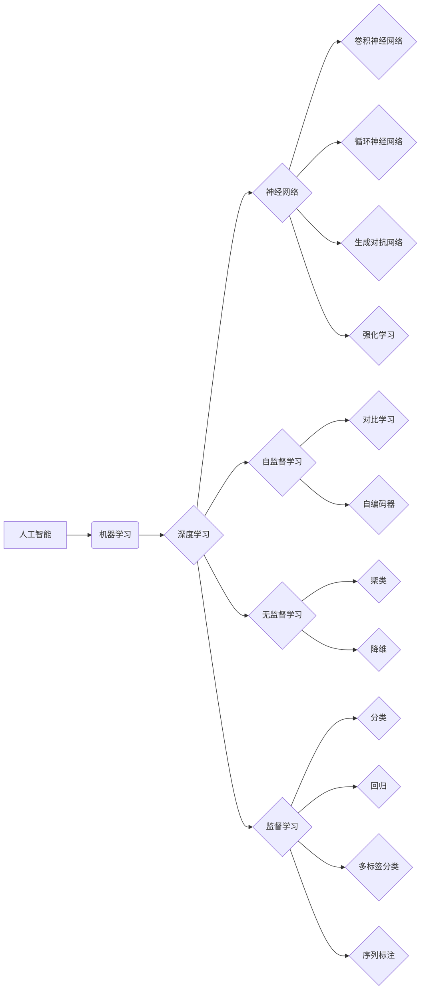

# AI人工智能核心算法原理与代码实例讲解：智能系统

作者：禅与计算机程序设计艺术 / Zen and the Art of Computer Programming

## 1. 背景介绍
### 1.1 问题的由来

人工智能（Artificial Intelligence, AI）作为21世纪最具颠覆性的技术之一，正在深刻地改变着我们的生活。从智能助手到自动驾驶，从智能医疗到智能金融，AI技术的应用无处不在。然而，AI的发展并非一帆风顺，其背后的核心算法原理一直是业界和学术界关注的焦点。本文将深入浅出地讲解AI核心算法原理，并通过代码实例进行详细讲解，帮助读者更好地理解和掌握智能系统。

### 1.2 研究现状

近年来，随着深度学习（Deep Learning, DL）技术的飞速发展，AI领域取得了显著的进展。深度学习模型在图像识别、语音识别、自然语言处理等领域取得了突破性的成果，使得AI技术开始从实验室走向实际应用。然而，深度学习模型的结构复杂、参数众多，如何理解和分析其工作原理，以及如何有效地进行模型训练和优化，仍然是AI领域需要解决的重要问题。

### 1.3 研究意义

深入理解AI核心算法原理，对于以下方面具有重要意义：

- **提升算法理解能力**：通过学习核心算法原理，可以更好地理解AI模型的工作机制，为后续的算法改进和应用提供理论依据。
- **优化模型性能**：掌握核心算法原理可以帮助我们更好地进行模型训练和优化，提升模型在各个任务上的性能。
- **推动AI技术发展**：深入研究AI核心算法原理，可以促进AI技术的创新和发展，为构建更加智能的系统和应用提供技术支持。

### 1.4 本文结构

本文将围绕AI核心算法原理展开，具体内容包括：

- 核心概念与联系
- 核心算法原理与步骤
- 数学模型和公式
- 代码实例和讲解
- 实际应用场景
- 工具和资源推荐
- 未来发展趋势与挑战
- 总结与展望

## 2. 核心概念与联系
### 2.1 概念介绍

以下是AI领域一些重要的核心概念：

- **人工智能**：指使机器具备人类智能特征的学科，包括机器学习、自然语言处理、计算机视觉、知识表示等。
- **机器学习**：使计算机具备自主学习和适应环境的能力。
- **深度学习**：一种特殊的机器学习范式，使用多层神经网络进行特征提取和学习。
- **神经网络**：由多个神经元组成的层次化神经网络结构，用于模拟人脑的学习和认知过程。
- **卷积神经网络**（Convolutional Neural Network, CNN）：一种适用于图像识别、图像分类等视觉任务的神经网络结构。
- **循环神经网络**（Recurrent Neural Network, RNN）：一种适用于序列数据处理的神经网络结构。
- **生成对抗网络**（Generative Adversarial Network, GAN）：一种生成模型，由生成器和判别器两个神经网络构成，用于生成具有真实数据分布的新数据。
- **强化学习**：使机器通过与环境交互来学习如何实现目标。

### 2.2 概念联系

以下是AI核心概念的逻辑关系图：



从图中可以看出，AI的核心概念相互关联，共同构成了一个复杂的知识体系。其中，机器学习和深度学习是AI的两个重要分支，而神经网络、CNN、RNN、GAN、强化学习等则是深度学习中的核心算法。此外，自监督学习、无监督学习和监督学习是机器学习的三种主要学习方式。

## 3. 核心算法原理与步骤
### 3.1 算法原理概述

以下是一些常见的AI核心算法及其原理概述：

- **神经网络**：神经网络通过模拟人脑神经元结构，通过前向传播和反向传播进行特征提取和学习。
- **卷积神经网络**：CNN通过卷积层、池化层、全连接层等模块提取图像特征，进行图像分类和识别。
- **循环神经网络**：RNN通过循环神经网络单元，处理序列数据，进行时间序列预测、机器翻译等任务。
- **生成对抗网络**：GAN通过生成器和判别器两个神经网络相互对抗，生成具有真实数据分布的新数据。
- **强化学习**：强化学习通过与环境交互，学习如何实现目标，常用于游戏、机器人控制等领域。

### 3.2 算法步骤详解

以下以神经网络为例，详细介绍其原理和步骤：

1. **初始化参数**：随机初始化神经网络中所有参数的值。
2. **前向传播**：将输入数据输入神经网络，通过权重和激活函数计算输出结果。
3. **计算损失**：计算输出结果与真实标签之间的损失值，如均方误差（MSE）或交叉熵损失（Cross-Entropy Loss）。
4. **反向传播**：根据损失值计算梯度，并通过梯度下降等方法更新网络参数。
5. **迭代优化**：重复步骤2-4，直至满足停止条件（如达到预设的迭代次数或损失值低于阈值）。

### 3.3 算法优缺点

以下是常见AI核心算法的优缺点：

- **神经网络**：优点是能够自动学习特征，适应性强；缺点是参数众多，容易过拟合，计算复杂度高。
- **卷积神经网络**：优点是能够自动学习图像特征，适用于图像识别和分类；缺点是难以处理非图像数据。
- **循环神经网络**：优点是能够处理序列数据，适用于时间序列预测、机器翻译等；缺点是训练难度大，容易出现梯度消失或梯度爆炸问题。
- **生成对抗网络**：优点是能够生成具有真实数据分布的新数据，适用于图像生成、音乐生成等；缺点是训练难度大，生成结果质量难以保证。

### 3.4 算法应用领域

以下是常见AI核心算法的应用领域：

- **神经网络**：图像识别、语音识别、自然语言处理、医疗诊断等。
- **卷积神经网络**：图像识别、图像分类、目标检测等。
- **循环神经网络**：时间序列预测、机器翻译、语音识别等。
- **生成对抗网络**：图像生成、音乐生成、数据增强等。
- **强化学习**：游戏、机器人控制、自动驾驶等。

## 4. 数学模型和公式 & 详细讲解 & 举例说明
### 4.1 数学模型构建

以下是一些常见的AI核心算法的数学模型和公式：

- **神经网络**：

$$
y = f(W \cdot x + b)
$$

其中 $y$ 为输出，$x$ 为输入，$W$ 为权重，$b$ 为偏置，$f$ 为激活函数。

- **卷积神经网络**：

$$
h_{ij} = f(W_{ij} \cdot k_{ij} + b_{ij})
$$

其中 $h_{ij}$ 为输出特征图，$k_{ij}$ 为卷积核，$b_{ij}$ 为偏置，$f$ 为激活函数。

- **循环神经网络**：

$$
h_t = f(W_{ih} \cdot x_t + W_{hh} \cdot h_{t-1} + b_h)
$$

其中 $h_t$ 为当前时刻的隐藏状态，$x_t$ 为当前时刻的输入，$W_{ih}$ 为输入到隐藏层的权重，$W_{hh}$ 为隐藏层到隐藏层的权重，$b_h$ 为偏置，$f$ 为激活函数。

- **生成对抗网络**：

$$
D(x) = f(D(W_D \cdot x))
$$

$$
G(z) = f(W_G \cdot z + b_G)
$$

其中 $D$ 为判别器，$G$ 为生成器，$W_D$ 和 $W_G$ 分别为判别器和生成器的权重，$b_G$ 为生成器的偏置，$x$ 为真实数据，$z$ 为随机噪声。

### 4.2 公式推导过程

以下以神经网络为例，介绍其数学模型的推导过程：

1. **前向传播**：

$$
h_1 = f(W_1 \cdot x + b_1)
$$

$$
h_2 = f(W_2 \cdot h_1 + b_2)
$$

$$
y = f(W_3 \cdot h_2 + b_3)
$$

其中 $f$ 为激活函数，$W_1$、$W_2$、$W_3$ 分别为第1、2、3层的权重，$b_1$、$b_2$、$b_3$ 分别为第1、2、3层的偏置。

2. **反向传播**：

根据链式法则，损失函数对权重和偏置的梯度分别为：

$$
\frac{\partial L}{\partial W_3} = \frac{\partial L}{\partial y} \cdot \frac{\partial y}{\partial h_2} \cdot \frac{\partial h_2}{\partial W_3}
$$

$$
\frac{\partial L}{\partial W_2} = \frac{\partial L}{\partial h_2} \cdot \frac{\partial h_2}{\partial W_2}
$$

$$
\frac{\partial L}{\partial W_1} = \frac{\partial L}{\partial h_1} \cdot \frac{\partial h_1}{\partial W_1}
$$

$$
\frac{\partial L}{\partial b_3} = \frac{\partial L}{\partial y}
$$

$$
\frac{\partial L}{\partial b_2} = \frac{\partial L}{\partial h_2}
$$

$$
\frac{\partial L}{\partial b_1} = \frac{\partial L}{\partial h_1}
$$

其中 $L$ 为损失函数，$\frac{\partial L}{\partial y}$、$\frac{\partial L}{\partial h_2}$、$\frac{\partial L}{\partial h_1}$ 分别为损失函数对输出、隐藏状态和输入的梯度。

3. **参数更新**：

使用梯度下降等方法更新权重和偏置：

$$
W_3 \leftarrow W_3 - \alpha \cdot \frac{\partial L}{\partial W_3}
$$

$$
W_2 \leftarrow W_2 - \alpha \cdot \frac{\partial L}{\partial W_2}
$$

$$
W_1 \leftarrow W_1 - \alpha \cdot \frac{\partial L}{\partial W_1}
$$

$$
b_3 \leftarrow b_3 - \alpha \cdot \frac{\partial L}{\partial b_3}
$$

$$
b_2 \leftarrow b_2 - \alpha \cdot \frac{\partial L}{\partial b_2}
$$

$$
b_1 \leftarrow b_1 - \alpha \cdot \frac{\partial L}{\partial b_1}
$$

其中 $\alpha$ 为学习率。

### 4.3 案例分析与讲解

以下以图像识别任务为例，分析神经网络在图像识别任务中的应用。

假设我们有一个简单的二分类图像识别任务，输入为32x32像素的图像，输出为两个类别（如猫和狗）的概率。

1. **数据预处理**：

将图像数据转换为灰度图，并进行归一化处理。

2. **网络结构设计**：

使用一个简单的神经网络结构，包含3个卷积层、3个池化层和2个全连接层。

3. **模型训练**：

将训练数据输入网络，通过反向传播和梯度下降方法更新网络参数，直至满足停止条件。

4. **模型评估**：

将测试数据输入网络，计算准确率等指标，评估模型性能。

5. **模型部署**：

将训练好的模型部署到实际应用中，用于图像识别。

通过以上步骤，我们可以构建一个简单的图像识别模型，实现对图像的自动分类。

### 4.4 常见问题解答

**Q1：如何选择合适的网络结构？**

A：选择合适的网络结构需要根据具体任务和数据特点进行综合考虑。一般来说，对于图像识别任务，可以使用CNN结构；对于序列数据处理任务，可以使用RNN或LSTM结构；对于生成模型，可以使用GAN结构。在实际应用中，可以参考相关论文和开源代码，结合具体任务进行调整和优化。

**Q2：如何解决过拟合问题？**

A：过拟合是深度学习模型常见的问题，可以通过以下方法解决：

1. 增加训练数据：收集更多样本，增加模型对数据的泛化能力。
2. 正则化：使用L1正则化、L2正则化、Dropout等方法降低模型复杂度。
3. 早停法：在验证集上监控模型性能，当性能不再提升时停止训练。
4. 模型集成：训练多个模型，取平均输出，降低过拟合风险。

**Q3：如何提高模型性能？**

A：提高模型性能可以从以下几个方面着手：

1. 数据预处理：对数据进行有效的预处理，如数据增强、归一化等。
2. 网络结构优化：根据任务特点，设计更有效的网络结构。
3. 超参数调优：通过网格搜索、随机搜索等方法寻找最优的超参数组合。
4. 训练技巧：采用更有效的训练技巧，如学习率衰减、批量归一化等。

## 5. 项目实践：代码实例和详细解释说明
### 5.1 开发环境搭建

在进行AI项目实践之前，需要搭建以下开发环境：

1. **操作系统**：推荐使用Linux操作系统，如Ubuntu或CentOS。
2. **编程语言**：推荐使用Python语言，因为它拥有丰富的AI库和框架。
3. **深度学习框架**：推荐使用PyTorch或TensorFlow等深度学习框架，因为它们易于使用且功能强大。
4. **开发工具**：推荐使用Jupyter Notebook或VS Code等开发工具，方便进行代码编写和调试。

### 5.2 源代码详细实现

以下以图像识别任务为例，使用PyTorch框架实现一个简单的神经网络模型：

```python
import torch
import torch.nn as nn

class SimpleCNN(nn.Module):
    def __init__(self):
        super(SimpleCNN, self).__init__()
        self.conv1 = nn.Conv2d(1, 16, kernel_size=3, stride=1, padding=1)
        self.conv2 = nn.Conv2d(16, 32, kernel_size=3, stride=1, padding=1)
        self.fc1 = nn.Linear(32 * 28 * 28, 10)
        
    def forward(self, x):
        x = torch.relu(self.conv1(x))
        x = torch.relu(self.conv2(x))
        x = torch.flatten(x, 1)
        x = self.fc1(x)
        return x

# 创建模型实例
model = SimpleCNN()

# 定义损失函数和优化器
criterion = nn.CrossEntropyLoss()
optimizer = torch.optim.Adam(model.parameters(), lr=0.001)

# 训练模型
for epoch in range(10):
    for data, target in train_loader:
        optimizer.zero_grad()
        output = model(data)
        loss = criterion(output, target)
        loss.backward()
        optimizer.step()
    
    print(f'Epoch {epoch+1}, Loss: {loss.item()}')

# 保存模型
torch.save(model.state_dict(), 'simple_cnn.pth')
```

以上代码定义了一个简单的卷积神经网络模型，包含两个卷积层和一个全连接层。使用PyTorch框架进行训练，并最终保存模型参数。

### 5.3 代码解读与分析

- `SimpleCNN`类：定义了一个简单的CNN模型，包含卷积层、池化层和全连接层。
- `forward`方法：实现模型的前向传播过程，即输入数据经过卷积层、池化层和全连接层，最终输出分类结果。
- `train_loader`：加载训练数据，使用DataLoader进行批量加载和打乱。
- `criterion`：定义损失函数，用于计算模型输出和真实标签之间的差异。
- `optimizer`：定义优化器，用于更新模型参数。

通过以上代码，我们可以实现一个简单的图像识别模型，并对其进行训练和评估。

### 5.4 运行结果展示

在训练完成后，我们可以使用测试数据集对模型进行评估，并打印出模型的准确率：

```python
# 加载测试数据集
test_loader = DataLoader(test_data, batch_size=10, shuffle=False)

# 评估模型
with torch.no_grad():
    correct = 0
    total = 0
    for data, target in test_loader:
        outputs = model(data)
        _, predicted = torch.max(outputs.data, 1)
        total += target.size(0)
        correct += (predicted == target).sum().item()
print(f'Accuracy of the network on the 10000 test images: {100 * correct / total}%')
```

以上代码将打印出模型在测试数据集上的准确率。

## 6. 实际应用场景
### 6.1 图像识别

图像识别是AI领域的一个重要应用场景，广泛应用于人脸识别、车牌识别、医学影像分析等领域。

- **人脸识别**：通过识别人脸图像中的关键特征，实现人脸比对和身份验证。
- **车牌识别**：通过识别车牌图像中的文字和图案，实现车辆身份验证和交通管理。
- **医学影像分析**：通过分析医学影像数据，辅助医生进行疾病诊断。

### 6.2 语音识别

语音识别是AI领域的一个重要应用场景，广泛应用于智能客服、语音助手、语音翻译等领域。

- **智能客服**：通过语音识别技术，实现自动回答客户咨询，提高客服效率。
- **语音助手**：通过语音识别和语音合成技术，实现人机交互，提供便捷的语音服务。
- **语音翻译**：通过语音识别和机器翻译技术，实现跨语言交流。

### 6.3 自然语言处理

自然语言处理是AI领域的一个重要应用场景，广泛应用于智能客服、聊天机器人、机器翻译等领域。

- **智能客服**：通过自然语言处理技术，实现智能客服系统，提高客服效率和服务质量。
- **聊天机器人**：通过自然语言处理技术，实现人机对话，提供便捷的交互体验。
- **机器翻译**：通过机器翻译技术，实现跨语言交流，促进国际合作和交流。

### 6.4 未来应用展望

随着AI技术的不断发展，未来AI的应用场景将更加广泛，包括：

- **智能家居**：通过AI技术，实现家电设备的智能控制，提高生活品质。
- **智能交通**：通过AI技术，实现自动驾驶、智能交通管理，提高交通安全和效率。
- **智能医疗**：通过AI技术，实现疾病诊断、药物研发，提高医疗水平。
- **智能制造**：通过AI技术，实现生产过程自动化、智能化，提高生产效率和质量。

## 7. 工具和资源推荐
### 7.1 学习资源推荐

以下是一些学习AI的核心资源：

- **在线课程**：
  - Coursera上的《机器学习》、《深度学习》等课程
  - edX上的《深度学习》课程
  - fast.ai的《Practical Deep Learning for Coders》课程
- **书籍**：
  - 《深度学习》（Goodfellow et al.）
  - 《神经网络与深度学习》（邱锡鹏）
  - 《深度学习：原理与实践》（阿斯顿·张）
- **开源库**：
  - PyTorch：https://pytorch.org/
  - TensorFlow：https://www.tensorflow.org/
  - Keras：https://keras.io/

### 7.2 开发工具推荐

以下是一些常用的AI开发工具：

- **编程语言**：
  - Python：https://www.python.org/
  - R：https://www.r-project.org/
- **深度学习框架**：
  - PyTorch：https://pytorch.org/
  - TensorFlow：https://www.tensorflow.org/
  - Keras：https://keras.io/
- **数据集**：
  - MNIST数据集：https://www.kaggle.com/datasets/yann_lecun/mnist
  - CIFAR-10数据集：https://www.cs.toronto.edu/~kriz/cifar.html
  - ImageNet数据集：https://www.image-net.org/challenges/LSVRC/2012/leaderboard/public/2012_imageNet_challenge_results.pdf

### 7.3 相关论文推荐

以下是一些AI领域的经典论文：

- **神经网络**：
  - "A Learning Algorithm for Continually Running Fully Recurrent Neural Networks"（Hochreiter & Schmidhuber，1997）
  - "Deep Learning with Neural Networks for Natural Language Processing"（Yin et al.，2018）
- **卷积神经网络**：
  - "A Convolutional Neural Network Approach for Visual Recognition"（Krizhevsky et al.，2012）
  - "ImageNet Classification with Deep Convolutional Neural Networks"（ Krizhevsky et al.，2012）
- **循环神经网络**：
  - "Sequence to Sequence Learning with Neural Networks"（Sutskever et al.，2014）
  - "Long Short-Term Memory"（Hochreiter & Schmidhuber，1997）
- **生成对抗网络**：
  - "Generative Adversarial Nets"（Goodfellow et al.，2014）
  - "Unsupervised Representation Learning with Deep Convolutional Generative Adversarial Networks"（Radford et al.，2015）
- **强化学习**：
  - "Playing Atari with Deep Reinforcement Learning"（Mnih et al.，2013）
  - "Human-level control through deep reinforcement learning"（Silver et al.，2016）

### 7.4 其他资源推荐

以下是一些其他有用的AI资源：

- **arXiv论文预印本：https://arxiv.org/
- **GitHub开源项目：https://github.com/
- **AI领域顶级会议**：
  - NeurIPS：https://nips.cc/
  - ICLR：https://www.iclr.cc/
  - ICML：https://icml.cc/
  - AAAI：https://www.aaai.org/

## 8. 总结：未来发展趋势与挑战
### 8.1 研究成果总结

本文深入浅出地讲解了AI核心算法原理，并通过代码实例进行了详细讲解。通过对神经网络、CNN、RNN、GAN、强化学习等核心算法的介绍，读者可以更好地理解和掌握智能系统。

### 8.2 未来发展趋势

随着深度学习技术的不断发展和应用，AI领域将呈现以下发展趋势：

- **模型轻量化**：通过模型压缩、知识蒸馏等技术，实现更轻量级的模型，降低计算和存储资源消耗。
- **模型可解释性**：通过可解释AI、因果推理等技术，提高模型的可解释性和透明度，增强用户对AI的信任度。
- **多模态学习**：通过融合文本、图像、语音等多模态信息，实现更加智能的信息处理和应用。
- **迁移学习**：通过迁移学习、多任务学习等技术，提高模型在不同任务和数据集上的泛化能力。

### 8.3 面临的挑战

尽管AI技术在不断发展，但仍面临着以下挑战：

- **数据质量**：高质量的数据是AI模型训练和优化的基础，如何获取和标注高质量数据是AI领域需要解决的重要问题。
- **模型可解释性**：如何提高模型的可解释性和透明度，增强用户对AI的信任度，是AI领域面临的重要挑战。
- **计算资源**：随着模型规模的不断增大，如何高效地训练和推理模型，是AI领域需要解决的重要问题。
- **伦理和道德**：如何确保AI技术在伦理和道德方面得到合理应用，是AI领域需要关注的重要问题。

### 8.4 研究展望

面对AI领域面临的挑战，未来的研究需要从以下几个方面进行探索：

- **数据质量**：研究如何获取和标注高质量数据，提高数据质量。
- **模型可解释性**：研究可解释AI、因果推理等技术，提高模型的可解释性和透明度。
- **计算资源**：研究模型压缩、知识蒸馏等技术，降低计算和存储资源消耗。
- **伦理和道德**：研究AI伦理和道德规范，确保AI技术在伦理和道德方面得到合理应用。

通过不断探索和创新，相信AI技术将在未来发挥更加重要的作用，为人类社会创造更大的价值。

## 9. 附录：常见问题与解答

**Q1：什么是深度学习？**

A：深度学习是一种特殊的机器学习范式，使用多层神经网络进行特征提取和学习。它通过模拟人脑神经元结构，通过前向传播和反向传播进行特征提取和学习。

**Q2：什么是神经网络？**

A：神经网络由多个神经元组成的层次化神经网络结构，用于模拟人脑的学习和认知过程。每个神经元接收输入信号，通过权重和激活函数计算输出结果。

**Q3：什么是卷积神经网络？**

A：卷积神经网络（Convolutional Neural Network，CNN）是一种适用于图像识别、图像分类等视觉任务的神经网络结构。它通过卷积层、池化层、全连接层等模块提取图像特征，进行图像分类和识别。

**Q4：什么是循环神经网络？**

A：循环神经网络（Recurrent Neural Network，RNN）是一种适用于序列数据处理的神经网络结构。它通过循环神经网络单元，处理序列数据，进行时间序列预测、机器翻译等任务。

**Q5：什么是生成对抗网络？**

A：生成对抗网络（Generative Adversarial Network，GAN）是一种生成模型，由生成器和判别器两个神经网络构成，用于生成具有真实数据分布的新数据。

**Q6：什么是强化学习？**

A：强化学习是一种使机器通过与环境交互来学习如何实现目标的学习方法。它通过最大化累积奖励，使机器学会在复杂环境中做出最优决策。

**Q7：如何选择合适的神经网络结构？**

A：选择合适的神经网络结构需要根据具体任务和数据特点进行综合考虑。一般来说，对于图像识别任务，可以使用CNN结构；对于序列数据处理任务，可以使用RNN或LSTM结构；对于生成模型，可以使用GAN结构。在实际应用中，可以参考相关论文和开源代码，结合具体任务进行调整和优化。

**Q8：如何解决过拟合问题？**

A：过拟合是深度学习模型常见的问题，可以通过以下方法解决：

1. 增加训练数据：收集更多样本，增加模型对数据的泛化能力。
2. 正则化：使用L1正则化、L2正则化、Dropout等方法降低模型复杂度。
3. 早停法：在验证集上监控模型性能，当性能不再提升时停止训练。
4. 模型集成：训练多个模型，取平均输出，降低过拟合风险。

**Q9：如何提高模型性能？**

A：提高模型性能可以从以下几个方面着手：

1. 数据预处理：对数据进行有效的预处理，如数据增强、归一化等。
2. 网络结构优化：根据任务特点，设计更有效的网络结构。
3. 超参数调优：通过网格搜索、随机搜索等方法寻找最优的超参数组合。
4. 训练技巧：采用更有效的训练技巧，如学习率衰减、批量归一化等。

**Q10：如何将AI技术应用到实际项目中？**

A：将AI技术应用到实际项目中，需要以下步骤：

1. 明确项目目标和需求。
2. 收集和标注数据。
3. 选择合适的算法和模型。
4. 训练和优化模型。
5. 部署和评估模型。

通过以上步骤，可以将AI技术应用到实际项目中，为项目带来价值。

---

作者：禅与计算机程序设计艺术 / Zen and the Art of Computer Programming