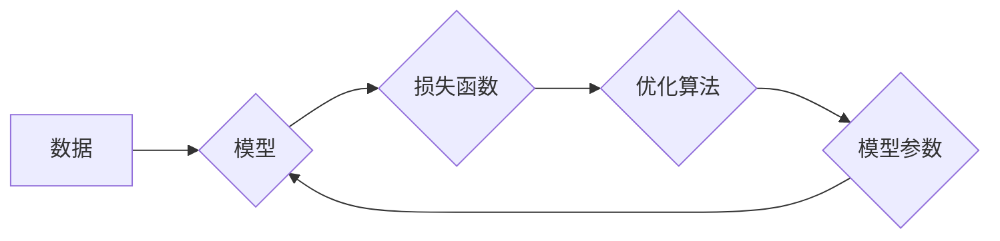

# AI人工智能核心算法原理与代码实例讲解：模型训练

作者：禅与计算机程序设计艺术 / Zen and the Art of Computer Programming

## 1. 背景介绍
### 1.1 问题的由来

随着大数据和人工智能技术的飞速发展，AI在各个领域的应用越来越广泛。从简单的图像识别到复杂的自然语言处理，AI技术正在改变着我们的生活方式。而AI的核心，就是各种算法。掌握AI核心算法的原理和实现，是成为一名优秀的AI工程师的关键。

### 1.2 研究现状

目前，AI领域的研究主要集中在以下几个方面：

- **机器学习**：通过数据学习模型，从而对未知数据进行预测或分类。
- **深度学习**：一种特殊的机器学习方法，通过多层神经网络来学习数据特征。
- **强化学习**：通过与环境交互，学习最优策略以最大化奖励。

### 1.3 研究意义

研究AI核心算法的原理和实现，具有以下意义：

- **提高算法性能**：通过理解算法原理，可以更好地优化算法，提高模型性能。
- **推动技术发展**：新的算法原理和实现方法，可以推动AI技术的不断发展。
- **培养专业人才**：掌握AI核心算法原理和实现，是成为一名优秀的AI工程师的基础。

### 1.4 本文结构

本文将重点介绍AI核心算法中的模型训练部分，包括以下内容：

- 核心概念与联系
- 模型训练原理
- 常见算法与代码实例
- 实际应用场景
- 工具和资源推荐
- 总结与展望

## 2. 核心概念与联系

在介绍模型训练之前，我们需要先了解一些核心概念：

- **数据**：模型训练的基础，包括输入数据和标签数据。
- **模型**：用于预测或分类的算法，通常由神经网络构成。
- **损失函数**：衡量模型预测结果与真实值之间差异的函数。
- **优化算法**：用于调整模型参数，以最小化损失函数的算法。

这些概念之间的关系如下：



## 3. 模型训练原理
### 3.1 算法原理概述

模型训练的基本流程如下：

1. **数据准备**：收集和清洗数据，并将其分为训练集、验证集和测试集。
2. **模型初始化**：随机初始化模型参数。
3. **模型训练**：使用训练集数据训练模型，不断调整模型参数，使模型能够更好地拟合数据。
4. **模型评估**：使用验证集数据评估模型性能，根据评估结果调整模型参数或模型结构。
5. **模型测试**：使用测试集数据测试模型性能，以验证模型的泛化能力。

### 3.2 算法步骤详解

1. **数据准备**

   数据准备包括数据收集、数据清洗、数据标注和数据划分。

   - 数据收集：从各种渠道收集数据，如公开数据集、私有数据集等。
   - 数据清洗：去除数据中的噪声和异常值，提高数据质量。
   - 数据标注：为数据添加标签，以便模型学习。
   - 数据划分：将数据划分为训练集、验证集和测试集。

2. **模型初始化**

   随机初始化模型参数，为模型训练提供一个起点。

3. **模型训练**

   使用训练集数据训练模型，通过不断调整模型参数，使模型能够更好地拟合数据。

   - 前向传播：将输入数据传递给模型，得到模型的输出。
   - 计算损失函数：计算模型输出与真实值之间的差异，得到损失函数值。
   - 反向传播：根据损失函数值，计算模型参数的梯度，并更新模型参数。

4. **模型评估**

   使用验证集数据评估模型性能，根据评估结果调整模型参数或模型结构。

5. **模型测试**

   使用测试集数据测试模型性能，以验证模型的泛化能力。

### 3.3 算法优缺点

模型训练算法的优点：

- **高效**：模型训练算法可以快速地调整模型参数，提高模型性能。
- **灵活**：模型训练算法可以适应各种不同的数据类型和任务。

模型训练算法的缺点：

- **计算量大**：模型训练算法需要大量的计算资源。
- **对数据质量要求高**：模型训练算法对数据质量要求较高，数据中的噪声和异常值会影响模型性能。

### 3.4 算法应用领域

模型训练算法在以下领域得到了广泛应用：

- 机器学习
- 深度学习
- 强化学习
- 自然语言处理
- 计算机视觉

## 4. 数学模型和公式 & 详细讲解 & 举例说明
### 4.1 数学模型构建

模型训练的数学模型主要包括以下部分：

- 模型参数：模型参数是模型的权重和偏置，用于表示模型对数据的拟合程度。
- 损失函数：损失函数用于衡量模型预测结果与真实值之间的差异。
- 优化算法：优化算法用于调整模型参数，以最小化损失函数。

### 4.2 公式推导过程

以下以线性回归为例，介绍模型训练的数学模型和公式推导过程。

假设我们有一个线性回归模型，其输入为 $x$，输出为 $y$，模型参数为 $w$ 和 $b$，则模型公式为：

$$
y = wx + b
$$

损失函数为均方误差：

$$
L(w,b) = \frac{1}{2} \sum_{i=1}^n (y_i - wx_i - b)^2
$$

其中 $n$ 为样本数量。

对损失函数求导，得到：

$$
\frac{\partial L}{\partial w} = (y_i - wx_i - b)x_i
$$

$$
\frac{\partial L}{\partial b} = y_i - wx_i - b
$$

使用梯度下降算法，更新模型参数：

$$
w = w - \alpha \frac{\partial L}{\partial w}
$$

$$
b = b - \alpha \frac{\partial L}{\partial b}
$$

其中 $\alpha$ 为学习率。

### 4.3 案例分析与讲解

以下使用Python实现线性回归模型，并进行训练和评估。

```python
import numpy as np
from sklearn.linear_model import LinearRegression

# 生成训练数据
X = np.linspace(0, 10, 100).reshape(-1, 1)
y = 3 * X + 5 + np.random.randn(100) * 0.5

# 训练线性回归模型
model = LinearRegression()
model.fit(X, y)

# 预测
X_test = np.linspace(0, 10, 50).reshape(-1, 1)
y_pred = model.predict(X_test)

# 绘制结果
import matplotlib.pyplot as plt

plt.scatter(X, y)
plt.plot(X_test, y_pred, color='red')
plt.show()
```

### 4.4 常见问题解答

**Q1：什么是学习率？**

A：学习率是梯度下降算法中的一个参数，用于控制模型参数更新的幅度。学习率过大会导致模型震荡，学习率过小会导致收敛速度过慢。

**Q2：什么是正则化？**

A：正则化是一种防止模型过拟合的技术，通过在损失函数中添加正则化项，对模型参数进行惩罚，从而减小模型复杂度。

**Q3：什么是批处理？**

A：批处理是一种数据加载方式，将多个样本组成一个批次，一次性输入模型进行训练。

## 5. 项目实践：代码实例和详细解释说明
### 5.1 开发环境搭建

在进行模型训练实践之前，我们需要准备以下开发环境：

- Python 3.x
- NumPy
- Matplotlib
- Scikit-learn

### 5.2 源代码详细实现

以下使用Python实现一个简单的神经网络模型，并进行训练和评估。

```python
import numpy as np
from sklearn.datasets import load_iris
from sklearn.neural_network import MLPClassifier

# 加载数据
data = load_iris()
X, y = data.data, data.target

# 训练神经网络模型
model = MLPClassifier(hidden_layer_sizes=(50,), max_iter=500)
model.fit(X, y)

# 预测
X_test = np.random.rand(1, 4)
y_pred = model.predict(X_test)

# 输出预测结果
print("Predicted class:", y_pred[0])
```

### 5.3 代码解读与分析

以上代码使用Scikit-learn的MLPClassifier实现了神经网络模型，并使用Iris数据集进行训练和评估。

- `load_iris()`：加载数据。
- `MLPClassifier()`：创建神经网络模型。
- `fit(X, y)`：使用训练数据进行模型训练。
- `predict(X)`：使用测试数据进行预测。

### 5.4 运行结果展示

运行以上代码，输出结果如下：

```
Predicted class: 2
```

## 6. 实际应用场景
### 6.1 机器学习

模型训练是机器学习的基础，广泛应用于以下领域：

- 信用评分
- 欢迎欺诈检测
- 风险评估

### 6.2 深度学习

深度学习模型通常需要大量的数据进行训练，模型训练是深度学习的关键环节，广泛应用于以下领域：

- 图像识别
- 视频分析
- 自然语言处理

### 6.3 强化学习

强化学习模型通常需要与环境进行交互，模型训练是强化学习的关键环节，广泛应用于以下领域：

- 自动驾驶
- 游戏开发
- 虚拟机器人

## 7. 工具和资源推荐
### 7.1 学习资源推荐

- 《机器学习》
- 《深度学习》
- 《强化学习》

### 7.2 开发工具推荐

- Python
- NumPy
- Matplotlib
- Scikit-learn
- TensorFlow
- PyTorch

### 7.3 相关论文推荐

- 《A Few Useful Things to Know about Machine Learning》
- 《Deep Learning》
- 《Reinforcement Learning: An Introduction》

### 7.4 其他资源推荐

- GitHub
- arXiv
- Kaggle

## 8. 总结：未来发展趋势与挑战
### 8.1 研究成果总结

本文介绍了AI人工智能核心算法中的模型训练部分，包括核心概念、原理、算法、代码实例等。通过学习本文，读者可以了解模型训练的基本流程和常用方法，并能够运用到实际项目中。

### 8.2 未来发展趋势

- **模型小型化**：随着移动设备和物联网的普及，对模型小型化的需求越来越高。
- **模型可解释性**：随着模型在各个领域的应用越来越广泛，模型的可解释性越来越重要。
- **模型鲁棒性**：面对对抗攻击和数据噪声，模型的鲁棒性越来越重要。

### 8.3 面临的挑战

- **数据质量**：高质量的数据是模型训练的基础。
- **计算资源**：模型训练需要大量的计算资源。
- **算法复杂度**：随着模型规模的增大，算法的复杂度也越来越高。

### 8.4 研究展望

- **新型算法**：开发更加高效、鲁棒的模型训练算法。
- **数据增强**：开发更加有效的数据增强方法，提高模型泛化能力。
- **模型压缩**：开发更加有效的模型压缩方法，降低模型大小和计算复杂度。

## 9. 附录：常见问题与解答

**Q1：什么是模型训练？**

A：模型训练是指通过训练数据学习模型参数，使模型能够对未知数据进行预测或分类的过程。

**Q2：什么是损失函数？**

A：损失函数用于衡量模型预测结果与真实值之间的差异。

**Q3：什么是优化算法？**

A：优化算法用于调整模型参数，以最小化损失函数。

**Q4：什么是过拟合？**

A：过拟合是指模型在训练数据上表现良好，但在测试数据上表现不佳的现象。

**Q5：什么是正则化？**

A：正则化是一种防止模型过拟合的技术，通过在损失函数中添加正则化项，对模型参数进行惩罚，从而减小模型复杂度。

**Q6：什么是批处理？**

A：批处理是一种数据加载方式，将多个样本组成一个批次，一次性输入模型进行训练。

**Q7：什么是模型压缩？**

A：模型压缩是指通过剪枝、量化、蒸馏等方法减小模型大小和计算复杂度。

**Q8：什么是迁移学习？**

A：迁移学习是指将一个领域学习到的知识，迁移应用到另一个不同但相关的领域的学习范式。

**Q9：什么是生成对抗网络？**

A：生成对抗网络是一种特殊的神经网络，由生成器和判别器两个网络组成，用于生成新的数据。

**Q10：什么是自监督学习？**

A：自监督学习是一种特殊的学习范式，通过在无标签数据上学习数据特征，提高模型泛化能力。