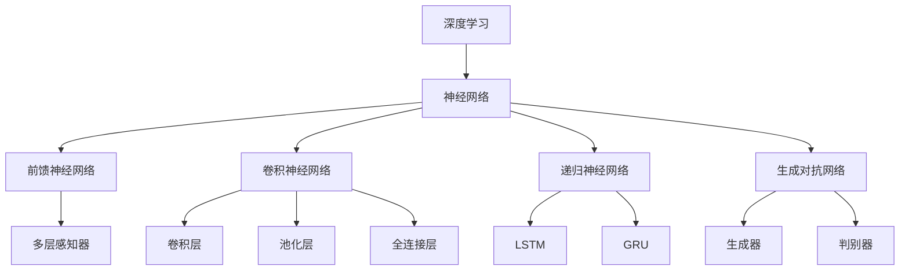

以下是根据您提供的要求和模板，为主题"AI人工智能深度学习算法：在模式识别中的应用"所撰写的技术博客文章正文内容：

# AI人工智能深度学习算法：在模式识别中的应用

## 1. 背景介绍

### 1.1 问题的由来

在当今的数字时代，海量数据的产生和积累为人工智能和机器学习的发展提供了丰富的资源。然而，如何从这些原始数据中提取有价值的信息并发现潜在的模式,成为了一个亟待解决的挑战。传统的机器学习算法在处理高维、非线性和复杂数据时往往表现不佳,这促使了深度学习技术的兴起和发展。

### 1.2 研究现状  

深度学习作为一种有效的人工智能技术,已经在计算机视觉、自然语言处理、语音识别等领域取得了卓越的成就。其中,卷积神经网络(CNN)、递归神经网络(RNN)和生成对抗网络(GAN)等算法在模式识别任务中展现出了强大的能力。然而,现有的深度学习模型还存在一些局限性,例如需要大量的训练数据、存在黑盒问题、可解释性差等,这些问题阻碍了深度学习在更多领域的广泛应用。

### 1.3 研究意义

本文旨在深入探讨深度学习算法在模式识别中的应用,包括核心概念、算法原理、数学模型、实际案例等,为读者提供全面的理解和实践指导。通过对深度学习算法的剖析和实践,我们可以更好地理解其工作机制,并探索其在模式识别领域的潜力和局限性。此外,本文还将介绍一些前沿的研究方向和未来的发展趋势,为读者提供更广阔的视野。

### 1.4 本文结构

本文将从以下几个方面全面阐述深度学习算法在模式识别中的应用:

1. 核心概念与联系
2. 核心算法原理与具体操作步骤
3. 数学模型和公式的详细讲解与案例分析  
4. 项目实践:代码实例和详细解释
5. 实际应用场景
6. 工具和资源推荐
7. 总结:未来发展趋势与挑战
8. 附录:常见问题与解答

## 2. 核心概念与联系

在深入探讨深度学习算法之前,我们需要先了解一些核心概念及其相互关系。这些概念构成了深度学习的基础,对于理解和应用深度学习算法至关重要。

上图展示了深度学习及其相关概念的层次关系。深度学习是一种基于人工神经网络的机器学习技术,旨在模拟人脑的工作原理来处理数据。神经网络是深度学习的核心,包括前馈神经网络、卷积神经网络、递归神经网络和生成对抗网络等不同类型。

前馈神经网络是最基本的神经网络形式,其中多层感知器(MLP)是一种常见的前馈神经网络结构。卷积神经网络(CNN)通过卷积层、池化层和全连接层的组合,擅长处理图像和视频等高维数据。递归神经网络(RNN)则专门用于处理序列数据,如自然语言和时间序列,其中长短期记忆网络(LSTM)和门控循环单元(GRU)是两种常用的RNN变体。生成对抗网络(GAN)由生成器和判别器组成,可以生成逼真的数据样本。

这些核心概念相互关联、互为补充,共同构建了深度学习的理论基础和实践框架。掌握这些概念有助于我们更好地理解和应用深度学习算法。

## 3. 核心算法原理与具体操作步骤

### 3.1 算法原理概述

深度学习算法的核心原理是通过构建深层次的神经网络模型,并利用大量的训练数据对模型进行优化,从而学习到数据中潜在的特征表示和模式。这种端到端的学习方式使得深度学习模型能够自动从原始数据中提取有用的特征,而不需要人工设计特征提取器。

在训练过程中,深度学习算法通常采用反向传播算法来优化神经网络的权重参数。反向传播算法利用链式法则计算损失函数相对于每个权重的梯度,然后使用优化算法(如随机梯度下降)沿着梯度的反方向更新权重,从而最小化损失函数。通过不断迭代这个过程,神经网络可以逐步学习到最优的参数,使得输出结果与期望值之间的误差最小化。

不同类型的深度学习算法在具体实现上存在一些差异,但它们都遵循上述基本原理。例如,卷积神经网络利用卷积操作和池化操作来提取图像的空间特征;递归神经网络则通过循环状态的传递来捕获序列数据中的时间依赖关系;生成对抗网络则使用生成器和判别器的对抗训练来生成逼真的数据样本。

### 3.2 算法步骤详解

以下是深度学习算法的一般训练步骤:

1. **数据预处理**: 首先需要对原始数据进行清洗、标准化等预处理,以确保数据的质量和一致性。

2. **构建网络模型**: 根据具体任务和数据类型,选择合适的深度学习模型架构,如CNN、RNN或GAN等。定义网络的层数、神经元数量、激活函数等超参数。

3. **初始化参数**: 通常使用小的随机值来初始化网络中的权重和偏置参数,以避免陷入局部最优解。

4. **数据分割**: 将预处理后的数据集划分为训练集、验证集和测试集,用于模型训练、调参和评估。

5. **定义损失函数**: 选择合适的损失函数,如交叉熵损失、均方误差等,用于衡量模型输出与期望输出之间的差异。

6. **选择优化器**: 选择合适的优化算法,如随机梯度下降(SGD)、Adam等,用于更新网络参数。

7. **模型训练**: 使用训练数据对网络进行训练,通过反向传播算法计算梯度,并使用优化器更新参数,直到模型在验证集上的性能不再提升为止。

8. **模型评估**: 使用测试数据评估训练好的模型的性能,计算相关指标,如准确率、精确率、召回率等。

9. **模型调优**: 根据评估结果,通过调整超参数、修改网络结构或增加训练数据等方式,进一步优化模型性能。

10. **模型部署**: 将训练好的模型应用于实际场景,进行预测或生成新的数据样本。

需要注意的是,上述步骤是一个通用的流程,具体实现细节可能因算法类型和应用场景而有所不同。此外,在实际应用中还需要考虑一些关键问题,如过拟合、梯度消失/爆炸、可解释性等,并采取相应的策略进行优化。

### 3.3 算法优缺点

深度学习算法在模式识别任务中表现出色,但也存在一些优缺点:

**优点**:

1. **强大的特征学习能力**: 深度学习算法能够自动从原始数据中学习到有用的特征表示,而无需人工设计特征提取器。

2. **端到端的学习方式**: 深度学习模型可以直接从原始输入数据到目标输出进行端到端的训练,简化了传统机器学习的复杂流程。

3. **处理高维复杂数据的能力**: 深度学习算法擅长处理高维、非线性和复杂的数据,如图像、视频、语音等。

4. **可扩展性和泛化能力**: 通过增加网络深度和宽度,深度学习模型可以学习更复杂的模式,并具有较强的泛化能力。

**缺点**:

1. **需要大量训练数据**: 深度学习模型通常需要大量的标注数据进行有效训练,否则容易出现过拟合问题。

2. **黑盒问题**: 深度神经网络的内部工作机制通常是一个黑盒,缺乏可解释性,难以解释模型的决策过程。

3. **计算资源需求高**: 训练深度学习模型通常需要大量的计算资源,包括GPU加速和分布式计算等。

4. **梯度消失/爆炸问题**: 在训练深层次网络时,梯度可能会出现消失或爆炸的情况,导致训练困难。

5. **对抗样本的脆弱性**: 深度学习模型容易受到对抗样本的攻击,即添加了微小扰动的输入样本可能会导致模型做出错误的预测。

因此,在实际应用中需要权衡深度学习算法的优缺点,并采取适当的策略来缓解其缺陷,如数据增强、正则化、可解释性技术等。

### 3.4 算法应用领域

深度学习算法在模式识别领域有着广泛的应用,包括但不限于以下几个主要领域:

1. **计算机视觉**: 卷积神经网络在图像分类、目标检测、语义分割、实例分割等计算机视觉任务中表现出色。

2. **自然语言处理**: 递归神经网络和Transformer等模型在机器翻译、文本生成、情感分析、问答系统等自然语言处理任务中发挥着重要作用。

3. **语音识别**: 深度学习算法在语音识别、语音合成等语音信号处理任务中取得了突破性进展。

4. **推荐系统**: 深度学习模型可以从用户历史数据中学习用户偏好,为用户提供个性化的推荐服务。

5. **金融风险管理**: 深度学习算法可以用于金融时间序列预测、欺诈检测、信用评分等金融风险管理任务。

6. **医疗健康**: 深度学习在医学图像分析、疾病诊断、药物发现等医疗健康领域具有广阔的应用前景。

7. **自动驾驶**: 深度学习算法在环境感知、路径规划、决策控制等自动驾驶系统的关键模块中发挥着重要作用。

8. **游戏AI**: 深度强化学习算法可以训练出具有超人水平的游戏AI代理,在棋类游戏、视频游戏等领域取得了突破性进展。

总的来说,深度学习算法在任何涉及模式识别和决策的领域都有潜在的应用价值,并不断推动着人工智能技术的发展和创新。

## 4. 数学模型和公式详细讲解与举例说明

### 4.1 数学模型构建

在深度学习中,我们通常使用神经网络作为数学模型来拟合输入数据和目标输出之间的映射关系。一个典型的神经网络模型可以表示为一个由多层组成的函数复合:

$$
\hat{y} = f(x; \theta) = f^{(L)}(f^{(L-1)}(...f^{(2)}(f^{(1)}(x))))
$$

其中:
- $x$是输入数据
- $\hat{y}$是模型的预测输出
- $f^{(l)}$表示第$l$层的函数映射,通常是一个仿射变换(线性变换加上偏置)后接一个非线性激活函数
- $\theta$是模型的所有可学习参数(权重和偏置)的集合
- $L$是网络的总层数

每一层的函数映射$f^{(l)}$可以具体表示为:

$$
f^{(l)}(z) = \sigma(W^{(l)}z + b^{(l)})
$$

其中:
- $z$是上一层的输出
- $W^{(l)}$是该层的权重矩阵
- $b^{(l)}$是该层的偏置向量
- $\sigma$是非线性激活函