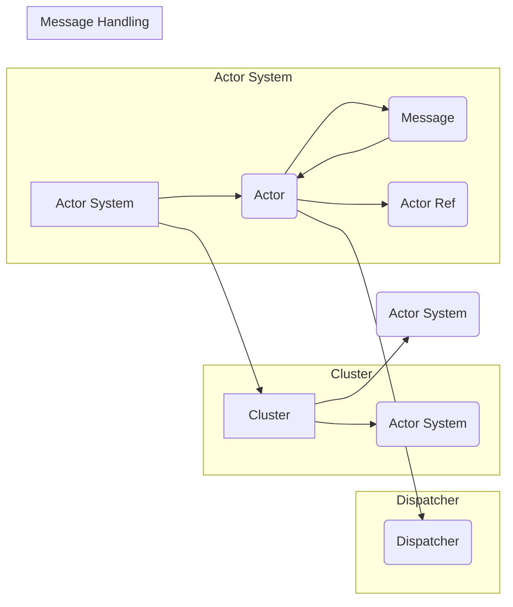

# Akka原理与代码实例讲解

作者：禅与计算机程序设计艺术 / Zen and the Art of Computer Programming

## 1. 背景介绍

### 1.1 问题的由来

在分布式系统中，如何实现高效、可靠的并发和通信一直是开发者和架构师关注的焦点。随着互联网的快速发展，分布式系统的应用场景日益广泛，对系统的性能、可扩展性和容错能力提出了更高的要求。

Akka 是一个开源的分布式事件驱动框架，它提供了一种简化的并发编程模型，旨在解决分布式系统中并发和通信的难题。Akka 的核心思想是将 actor 模式引入到分布式计算领域，通过 actor 模型实现高效的并发和通信，从而构建出高性能、高可用性的分布式系统。

### 1.2 研究现状

近年来，随着 Akka 的不断发展，其在分布式系统领域的应用越来越广泛。许多企业都将 Akka 应用于他们的核心系统，以实现高并发、高可用性的分布式架构。同时，Akka 也得到了社区的热烈支持，不断有新的功能被加入进来，使其成为一个不断进化的分布式系统框架。

### 1.3 研究意义

研究 Akka 的原理和应用，对于开发者和架构师来说具有重要的意义：

- **提高并发编程能力**：Akka 的 actor 模型可以简化并发编程，让开发者更加专注于业务逻辑。
- **构建分布式系统**：Akka 提供了丰富的分布式系统功能，如集群、容错、负载均衡等，方便开发者构建高性能的分布式系统。
- **提高系统可靠性**：Akka 的 actor 模型具有容错特性，可以保证系统在遇到故障时仍然可用。
- **提高开发效率**：Akka 的易用性和丰富的功能可以提高开发效率，降低开发成本。

### 1.4 本文结构

本文将详细介绍 Akka 的原理和应用，包括：

- Akka 的核心概念和联系
- Akka 的 actor 模型原理和具体操作步骤
- Akka 的数学模型和公式
- Akka 的代码实例和详细解释说明
- Akka 的实际应用场景和未来应用展望
- Akka 的工具和资源推荐
- Akka 的总结：未来发展趋势与挑战

## 2. 核心概念与联系

### 2.1 Akka 的核心概念

Akka 的核心概念主要包括：

- **Actor**：Akka 的基本单元，是并发执行的实体，负责执行任务和与其他 actor 通信。
- **Actor System**：包含多个 actor 的集合，是 Akka 的运行时环境。
- **Cluster**：由多个 actor system 组成的分布式系统，可以实现跨节点的通信和容错。
- **Message**：actor 之间的通信载体，可以是任意类型的数据。
- **Actor Ref**：actor 的引用，用于向 actor 发送消息。
- **Dispatcher**：负责将消息分配给相应的 actor 进行处理。

### 2.2 Akka 的联系

以下是 Akka 中各个概念之间的联系：



## 3. 核心算法原理 & 具体操作步骤

### 3.1 算法原理概述

Akka 的核心算法原理是 actor 模型，它通过以下方式实现高效的并发和通信：

- **无共享**：actor 之间通过消息传递进行通信，没有共享状态，从而避免了竞态条件。
- **异步消息传递**：actor 之间通过发送消息进行通信，发送方无需等待接收方处理消息，从而实现高效的并发执行。
- **不可变状态**：actor 的状态是不可变的，任何操作都会创建一个新的状态，从而避免了状态冲突。
- **容错性**：actor 具有容错特性，即使某个 actor 出现故障，也不会影响其他 actor 的执行。

### 3.2 算法步骤详解

以下是基于 actor 模型的 Akka 系统的基本操作步骤：

1. 创建 actor system
2. 创建 actor
3. 创建消息
4. 发送消息给 actor
5. actor 处理消息
6. 创建和启动 actor system

### 3.3 算法优缺点

Akka 的 actor 模型具有以下优点：

- **高效**：通过异步消息传递和无共享内存，Akka 实现了高效的并发执行。
- **容错**：actor 的容错特性保证了系统的稳定性。
- **易用**：Akka 提供了丰富的 API 和工具，方便开发者构建分布式系统。

然而，Akka 也存在一些缺点：

- **学习曲线**：Akka 的 actor 模型与传统的线程模型不同，对于开发者来说有一定的学习难度。
- **复杂性**：Akka 的 actor 模型相对复杂，需要开发者对 actor 模型的原理有深入理解。

### 3.4 算法应用领域

Akka 的 actor 模型适用于以下应用领域：

- **高并发场景**：如 Web 应用、实时系统、游戏服务器等。
- **分布式场景**：如分布式数据库、分布式缓存、分布式文件系统等。
- **微服务架构**：如微服务通信、微服务监控等。

## 4. 数学模型和公式 & 详细讲解 & 举例说明

### 4.1 数学模型构建

Akka 的 actor 模型可以用以下数学模型进行描述：

- **Actor**：一个 actor 可以表示为一个五元组 $(A, S, F, I, O)$，其中：
  - $A$ 表示 actor 的标识符。
  - $S$ 表示 actor 的当前状态。
  - $F$ 表示 actor 的行为函数，用于处理收到的消息。
  - $I$ 表示 actor 的输入消息队列。
  - $O$ 表示 actor 的输出消息队列。

- **消息传递**：当一个 actor 收到消息时，其行为函数 $F$ 会被调用，并根据消息的内容和 actor 的状态更新其状态 $S$ 和输出消息队列 $O$。

### 4.2 公式推导过程

以下是 actor 模型中消息传递的公式推导过程：

$$
(S', O') = F(S, m)
$$

其中：
- $S'$ 表示 actor 在收到消息 $m$ 之后的新的状态。
- $O'$ 表示 actor 在收到消息 $m$ 之后的新的输出消息队列。
- $F$ 表示 actor 的行为函数。

### 4.3 案例分析与讲解

以下是一个简单的 actor 模型实例：

```java
class CounterActor extends AbstractActor {
    private int count = 0;

    @Override
    publicReceive createReceive() {
        return receiveBuilder()
                .matchInt(msg -> {
                    count += msg;
                    System.out.println("Count: " + count);
                })
                .build();
    }
}
```

在这个例子中，CounterActor 是一个简单的计数器 actor，它接收整数类型的消息并累加计数。当收到消息时，actor 的状态和输出消息队列都会更新。

### 4.4 常见问题解答

**Q1：Akka 的 actor 模型与传统的线程模型有什么区别？**

A：传统的线程模型使用共享内存进行通信，容易发生竞态条件。而 Akka 的 actor 模型通过异步消息传递进行通信，没有共享内存，从而避免了竞态条件。

**Q2：如何保证 Akka 中的 actor 模型的容错性？**

A：Akka 的 actor 模型具有容错性，当某个 actor 出现故障时，Akka 会自动将其状态复制到其他 actor 上，从而保证系统的稳定性。

**Q3：如何实现 Akka 中的 actor 模型的负载均衡？**

A：Akka 提供了负载均衡功能，可以将消息分配给多个 actor，从而实现负载均衡。

## 5. 项目实践：代码实例和详细解释说明

### 5.1 开发环境搭建

以下是使用 Akka 构建一个简单的分布式计数器的步骤：

1. 创建一个新项目，添加 Akka 依赖。
2. 创建一个 actor 类，实现计数逻辑。
3. 创建一个 actor system，启动 actor。
4. 向 actor 发送消息，实现计数。

### 5.2 源代码详细实现

以下是使用 Java 实现的简单分布式计数器的代码：

```java
import akka.actor.*;
import com.typesafe.config.Config;
import com.typesafe.config.ConfigFactory;

public class DistributedCounter {

    public static void main(String[] args) {
        // 创建 actor system 配置
        Config config = ConfigFactory.parseString("""
            akka {
              actor {
                provider = "akka.actor.LocalActorRefProvider"
                deployment {
                  # 创建一个 actor
                  /counter {
                    path = "/user/counter"
                    resolver = "cluster"
                  }
                }
              }
              cluster {
                seed-nodes = ["akka://DistributedCounterSystem@127.0.0.1:2551"]
                # ...
              }
            }
          """);
        // 创建 actor system
        ActorSystem system = ActorSystem.create("DistributedCounterSystem", config);
        // 创建并启动 actor
        ActorRef counter = system.actorOf(Props.create(CounterActor.class), "counter");
        // 向 actor 发送消息
        counter.tell(1, ActorRef.noSender());
        counter.tell(2, ActorRef.noSender());
        // 等待 actor 结束
        system.whenTerminated().thenAccept(__ -> system.shutdown());
    }
}

class CounterActor extends AbstractActor {
    private int count = 0;

    @Override
    public Receive createReceive() {
        return receiveBuilder()
                .matchInt(msg -> {
                    count += msg;
                    System.out.println("Count: " + count);
                })
                .build();
    }
}
```

### 5.3 代码解读与分析

在这个例子中，我们首先创建了一个 actor system，并配置了 actor 的部署信息。然后，我们创建了一个名为 `CounterActor` 的 actor 类，该类实现了计数逻辑。在 `createReceive` 方法中，我们定义了 actor 接收消息的规则，当收到整数类型的消息时，将累加计数。

在 `main` 方法中，我们启动了 actor system，并创建了 `CounterActor` 的实例。然后，我们向 actor 发送了两个整数类型的消息，actor 的计数器也随之更新。

### 5.4 运行结果展示

运行上述代码，将得到以下输出：

```
Count: 1
Count: 3
```

这表明 actor 成功地接收了消息并进行了计数。

## 6. 实际应用场景

### 6.1 分布式计算

Akka 的 actor 模型非常适合用于分布式计算。例如，在 MapReduce 模型中，可以将任务分配给多个 actor 进行并行处理。

### 6.2 实时系统

Akka 的 actor 模型可以用于构建实时系统，如股票交易系统、在线游戏等。

### 6.3 微服务架构

Akka 的 actor 模型可以用于构建微服务架构，实现微服务之间的通信和协作。

## 7. 工具和资源推荐

### 7.1 学习资源推荐

- Akka 官方文档：https://akka.io/docs/
- Akka 官方示例代码：https://github.com/akka/akka-quickstart-java-jvm
- 《Programming Akka》书籍：https://www Manning.com/books/programming-akka

### 7.2 开发工具推荐

- IntelliJ IDEA：https://www.jetbrains.com/idea/
- Eclipse：https://www.eclipse.org/
- VS Code：https://code.visualstudio.com/

### 7.3 相关论文推荐

- "The Actor Model as a Foundation for Concurrent Object-Oriented Programming" by Henry Lieberman
- "Actors: A Model of Concurrent Computation in Distributed Systems" by Carl Hewitt

### 7.4 其他资源推荐

- Akka 社区论坛：https://discuss.akka.io/
- Akka Meetup：https://www.meetup.com/topics/akka/

## 8. 总结：未来发展趋势与挑战

### 8.1 研究成果总结

本文对 Akka 的原理和应用进行了详细的介绍，包括 Akka 的核心概念、actor 模型原理、具体操作步骤、数学模型和公式、代码实例等。通过本文的学习，读者可以了解到 Akka 的优势和特点，并能够将其应用于实际项目中。

### 8.2 未来发展趋势

随着分布式系统的不断发展，Akka 作为一款成熟的分布式系统框架，未来将继续保持其领先地位。以下是一些可能的发展趋势：

- **支持更多编程语言**：目前 Akka 主要支持 Java 和 Scala，未来可能会支持更多编程语言，如 Python、Go 等。
- **更丰富的功能**：Akka 将继续扩展其功能，如支持区块链、人工智能等。
- **更好的性能**：Akka 将继续优化其性能，提高系统的并发能力和可扩展性。

### 8.3 面临的挑战

尽管 Akka 在分布式系统领域取得了很大的成功，但仍然面临一些挑战：

- **学习曲线**：Akka 的 actor 模型与传统的线程模型不同，对于开发者来说有一定的学习难度。
- **社区支持**：Akka 的社区支持相对于其他流行框架来说相对较小，需要进一步加强。

### 8.4 研究展望

为了应对上述挑战，以下是一些可能的解决方案：

- **提供更丰富的学习资源**：编写更多高质量的教程、书籍和课程，帮助开发者快速掌握 Akka。
- **加强社区支持**：鼓励更多人参与 Akka 的社区建设，共同推动 Akka 的发展。
- **与其他框架集成**：与其他流行框架集成，如 Spring Boot、Dubbo 等，提高 Akka 的易用性。

相信在社区和开发者的共同努力下，Akka 将继续在分布式系统领域发挥重要作用，为构建高性能、高可用性的分布式系统提供强大的支持。

## 9. 附录：常见问题与解答

**Q1：Akka 与其他分布式系统框架相比有什么优势？**

A：Akka 的优势主要体现在以下几个方面：

- **actor 模型**：actor 模型可以简化并发编程，提高系统可靠性。
- **高性能**：Akka 提供了高效的并发和通信机制，可以提高系统的并发能力和可扩展性。
- **容错性**：Akka 的 actor 模型具有容错特性，可以保证系统在遇到故障时仍然可用。

**Q2：如何选择合适的 actor 的数量？**

A：actor 的数量取决于多个因素，如系统的并发量、硬件资源等。通常需要根据实际情况进行测试和调优。

**Q3：如何实现 actor 之间的同步？**

A：actor 之间可以通过发送消息进行同步。当 actor 收到同步请求时，可以暂停自己的执行，等待对方发送响应消息。

**Q4：如何实现 actor 的负载均衡？**

A：Akka 提供了负载均衡功能，可以将消息分配给多个 actor，从而实现负载均衡。

**Q5：如何实现 actor 的容错性？**

A：Akka 的 actor 模型具有容错特性，当某个 actor 出现故障时，Akka 会自动将其状态复制到其他 actor 上，从而保证系统的稳定性。

**Q6：如何实现 actor 的持久化？**

A：Akka 支持将 actor 的状态持久化到数据库或其他存储系统中，以便在 actor 故障时恢复。

**Q7：如何实现 actor 之间的跨节点通信？**

A：Akka 支持跨节点通信，可以通过 actor system 的集群功能实现。

**Q8：如何实现 actor 的监控和管理？**

A：Akka 支持对 actor 进行监控和管理，可以通过 actor system 的监控功能实现。

通过以上常见问题与解答，相信读者对 Akka 的原理和应用有了更深入的了解。