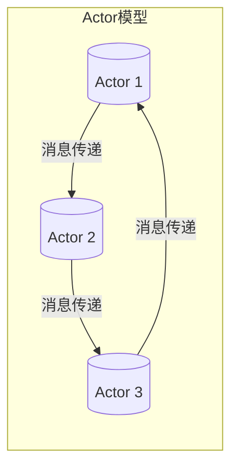
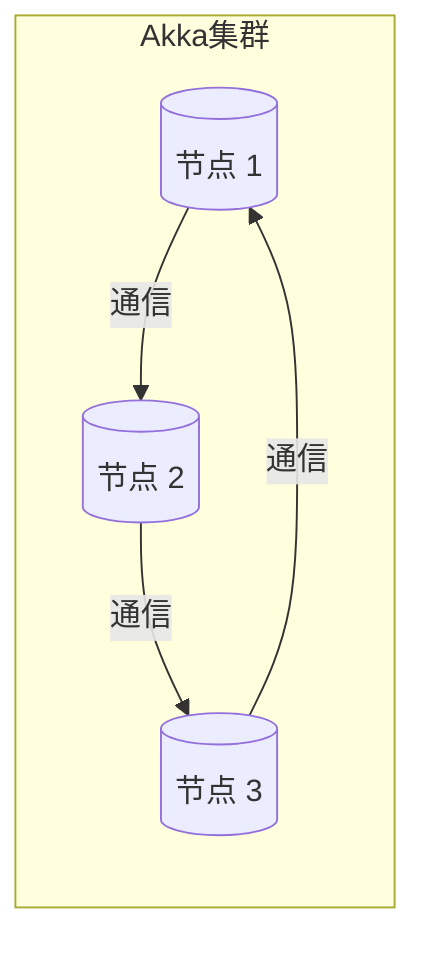
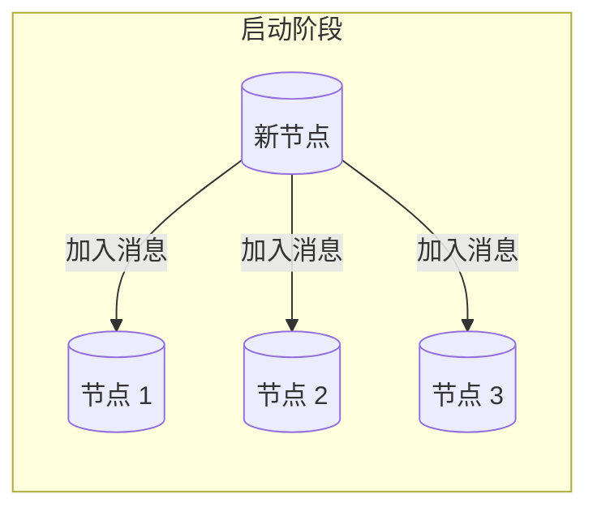
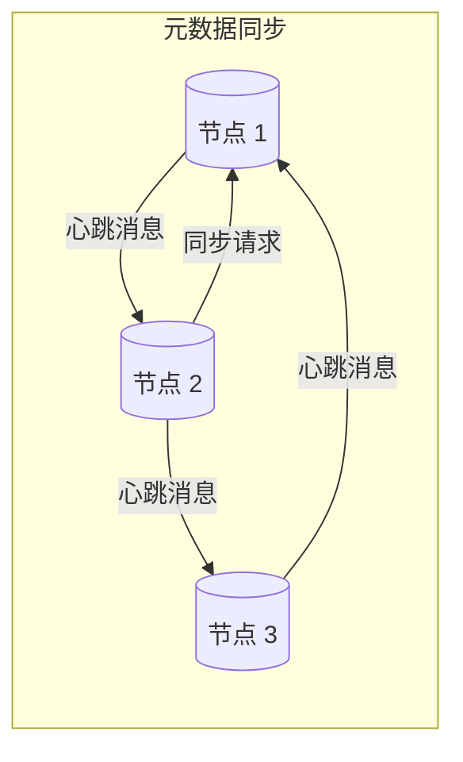
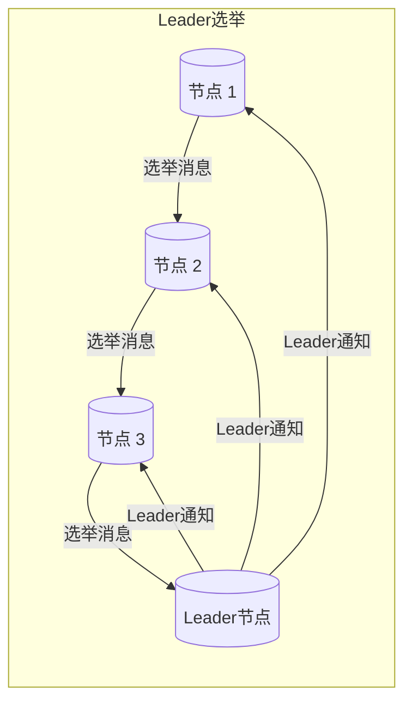
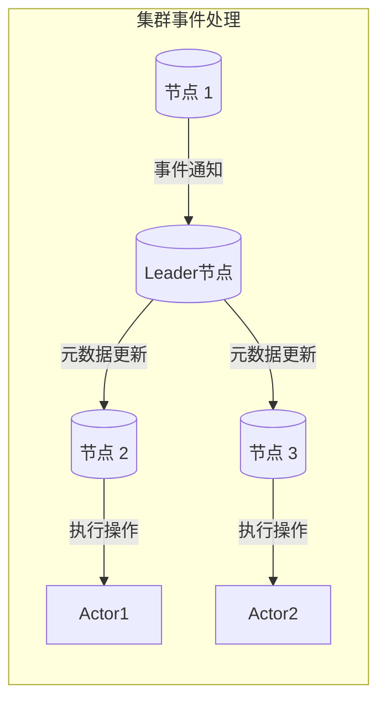
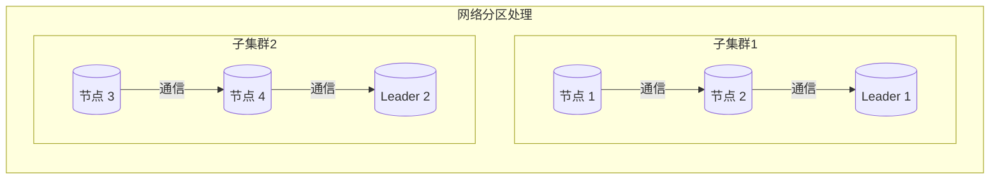

# Akka集群原理与代码实例讲解

## 1. 背景介绍

### 1.1 问题的由来

在现代分布式系统中,随着业务规模的不断扩大,单个节点处理能力往往无法满足高并发、高吞吐量的需求。因此,需要将系统拆分为多个节点,利用集群的方式来提高整体的处理能力和可用性。然而,在分布式集群环境下,节点之间如何高效通信、任务如何合理分配、故障如何自动恢复等问题都需要被妥善解决。

### 1.2 研究现状

目前,业界已经提出了多种分布式集群解决方案,如Apache Kafka、Apache Hadoop、Apache Spark等。这些方案各有侧重,适用于不同的场景。其中,Akka作为一个基于Actor模型的工具包,为构建高并发、高可用、可扩展的分布式系统提供了强大的支持。

### 1.3 研究意义

Akka凭借其优秀的集群管理能力、高效的消息传递机制和容错能力,在分布式系统领域得到了广泛应用。深入研究Akka集群的原理及实现方式,有助于我们更好地设计和构建高质量的分布式系统,提高系统的可靠性和扩展性。

### 1.4 本文结构

本文将从以下几个方面全面介绍Akka集群的原理和实践:

1. 核心概念与联系
2. 核心算法原理及具体操作步骤
3. 数学模型和公式详细讲解及案例分析
4. 项目实践:代码实例和详细解释
5. 实际应用场景
6. 工具和资源推荐
7. 总结:未来发展趋势与挑战
8. 附录:常见问题与解答

## 2. 核心概念与联系

在深入探讨Akka集群的原理之前,我们需要先了解一些核心概念及它们之间的联系。

### 2.1 Actor模型

Actor模型是一种并发计算模型,它将系统划分为多个独立的、轻量级的单元,称为Actor。每个Actor都有自己的状态和行为,它们通过发送消息进行通信和协作,而不是直接共享内存。

Actor模型具有以下优点:

- 天然支持并发和分布式
- 消息传递机制简单高效
- 容错能力强,Actor之间隔离性好

Akka就是基于Actor模型构建的一个工具包,它提供了Actor的实现,并在此基础上构建了集群管理、持久化等高级功能。

### 2.2 Akka集群

Akka集群是指由多个Akka应用程序节点组成的集群。集群中的每个节点都运行着一组Actor,它们可以相互通信,共同完成分布式任务。

Akka集群的主要特点包括:

- 自动节点发现和加入
- 自动分区修复
- 负载均衡
- 集群单例(Cluster Singleton)
- 集群分片(Cluster Sharding)

Akka集群的核心就是如何管理和协调这些节点,保证它们之间的通信高效、任务分配合理、故障自动恢复等。这就需要一些精心设计的算法和协议。

### 2.3 集群元数据

为了管理和协调集群中的节点,Akka维护了一些集群元数据,包括:

- 节点列表:记录集群中所有节点的信息
- 分区信息:记录集群中的网络分区情况
- 角色信息:每个节点可以被分配不同的角色
-集群单例信息:记录集群单例Actor的位置

这些元数据由集群中的一组特殊节点(种子节点)负责管理和同步。

### 2.4 集群事件

Akka集群中会发生各种事件,如节点加入、节点离开、角色变更等。这些事件会触发相应的回调函数,允许我们在代码中响应和处理这些事件。

通过订阅和处理这些事件,我们可以实现诸如节点自动重启、任务迁移等功能,从而提高系统的可用性和容错能力。

## 3. 核心算法原理及具体操作步骤

### 3.1 算法原理概述

Akka集群的核心算法是一种分布式协议,它定义了集群中节点之间如何通信、如何管理集群元数据、如何处理故障等规则。这个协议基于Actor模型,利用消息传递机制在节点之间传播元数据更新和控制指令。

该协议的主要目标是:

1. 保证集群元数据在所有节点之间的最终一致性
2. 快速检测和修复网络分区
3. 支持节点动态加入和离开
4. 支持集群单例和分片等高级功能

为了实现这些目标,该协议采用了一些经典的分布式算法,如Leader选举算法、反熵协议、幂等性消息等。

### 3.2 算法步骤详解

Akka集群协议的主要步骤如下:

#### 3.2.1 启动阶段

1. 节点启动时,会尝试连接配置中的种子节点
2. 如果连接成功,该节点会加入集群,否则会作为新集群的第一个节点
3. 新节点会向集群中的其他节点发送"加入"消息

#### 3.2.2 元数据同步

1. 集群中的每个节点都会定期向其他节点发送"心跳"消息,携带自己的元数据版本号
2. 如果接收到版本号更高的元数据,节点会发送"同步"请求获取最新元数据
3. 元数据同步采用反熵协议,保证最终一致性

#### 3.2.3 Leader选举

1. 集群中会选举一个Leader节点,负责处理集群事件和更新元数据
2. 选举过程基于经典的Bully算法或Raft算法
3. Leader失效时,会自动重新选举新的Leader

#### 3.2.4 集群事件处理

1. 当发生节点加入、离开、分区等事件时,事件会被传播到集群中的所有节点
2. Leader节点会更新元数据,并通知其他节点
3. 节点收到通知后,会执行相应的操作,如重新分配任务、迁移Actor等

#### 3.2.5 网络分区处理

1. 当发生网络分区时,集群会被拆分为多个独立的子集群
2. 每个子集群会选举自己的Leader,并独立运行
3. 当网络恢复时,子集群会自动合并,Leader会被重新选举

### 3.3 算法优缺点

#### 优点:

1. **高可用性**: 集群能自动检测和修复故障,提高系统的可用性
2. **可扩展性**: 可以动态添加或删除节点,实现无缝扩展
3. **容错能力**: 基于Actor模型,节点之间隔离性好,故障不会蔓延
4. **负载均衡**: 支持自动负载均衡,提高资源利用率

#### 缺点:

1. **复杂性**: 分布式协议本身比较复杂,实现和调试都不容易
2. **网络开销**: 需要频繁在节点之间传输心跳和元数据,网络开销较大
3. **一致性延迟**: 元数据同步采用最终一致性,在同步过程中可能出现短暂不一致

### 3.4 算法应用领域

Akka集群协议可以应用于各种需要高可用、高扩展的分布式系统,如:

- 微服务架构
- 实时数据处理
- 在线游戏服务器
- 物联网数据采集
- 科学计算和模拟

只要系统具有并发和分布式的需求,都可以考虑使用Akka集群来提高性能和可靠性。

## 4. 数学模型和公式及详细讲解及举例说明

在前面的章节中,我们介绍了Akka集群的核心概念和算法原理。接下来,我们将通过数学模型和公式,对一些关键点进行更深入的分析和讲解。

### 4.1 数学模型构建

为了更好地理解和描述Akka集群的行为,我们可以构建一个数学模型。假设集群中有N个节点,记为$\{n_1, n_2, \dots, n_N\}$。每个节点都维护着一份元数据副本,记为$m_i$,其中$i \in \{1, 2, \dots, N\}$。

我们的目标是使所有节点的元数据副本最终达成一致,即对任意两个节点$n_i$和$n_j$,都有$m_i = m_j$。

为了实现这个目标,我们需要在节点之间传播元数据更新。设节点$n_i$在时间$t$收到了一个元数据更新$\Delta m_i(t)$,则它的元数据副本会被更新为:

$$m_i(t+1) = m_i(t) \oplus \Delta m_i(t)$$

其中$\oplus$表示合并操作,用于将增量更新应用到当前元数据副本上。

### 4.2 公式推导过程

接下来,我们分析一下在什么条件下,所有节点的元数据副本能够最终达成一致。

首先,我们定义一个谓词$\text{Consistent}(t)$,表示在时间$t$时,所有节点的元数据副本是否一致:

$$\text{Consistent}(t) \equiv \forall i, j \in \{1, 2, \dots, N\}: m_i(t) = m_j(t)$$

我们的目标就是使$\text{Consistent}(t)$对任意$t$都成立。

为了实现这个目标,我们需要保证以下两个条件:

1. **有效性(Validity)**: 如果一个节点收到了一个新的元数据更新$\Delta m_i(t)$,那么这个更新必须最终被应用到所有节点的元数据副本上。

   $$\forall i \in \{1, 2, \dots, N\}, \exists t' \ge t: \Delta m_i(t) \preceq m_j(t'), \forall j \in \{1, 2, \dots, N\}$$

   其中$\preceq$表示$\Delta m_i(t)$被合并到$m_j(t')$中。

2. **收敛性(Convergence)**: 如果在某个时间点