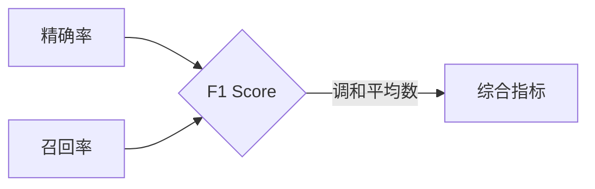

# F1 Score 原理与代码实战案例讲解

> 关键词：F1 Score，精确率，召回率，平衡指标，机器学习，自然语言处理

## 1. 背景介绍
### 1.1 问题的由来

在机器学习和自然语言处理领域，性能评估是至关重要的。精确率和召回率是常用的两个评估指标，但它们各自都有局限性。精确率关注的是预测为正例的样本中有多少是真正的正例，而召回率关注的是所有正例中有多少被正确预测。在实际应用中，我们往往需要找到一个既能反映精确率又能反映召回率的综合指标，这就是F1 Score。

### 1.2 研究现状

F1 Score作为平衡精确率和召回率的指标，在机器学习和自然语言处理领域得到了广泛的应用。许多研究论文和实际项目中，都使用了F1 Score来评估模型的性能。然而，F1 Score的具体原理和计算方法，以及在实际应用中的注意事项，仍然值得深入探讨。

### 1.3 研究意义

掌握F1 Score的原理和计算方法，有助于我们更好地理解机器学习和自然语言处理中的评估指标，从而设计出更有效的模型。同时，F1 Score的应用可以帮助我们更全面地评估模型的性能，避免单一指标的误导。

### 1.4 本文结构

本文将首先介绍F1 Score的核心概念和原理，然后通过具体的代码实例进行讲解，最后探讨F1 Score在实际应用中的场景和未来发展趋势。

## 2. 核心概念与联系
F1 Score是一个综合指标，它结合了精确率和召回率，用于评估分类模型的性能。以下是F1 Score的核心概念：

- **精确率(Precision)**：预测为正例的样本中有多少是真正的正例。
- **召回率(Recall)**：所有正例中有多少被正确预测。
- **F1 Score**：精确率和召回率的调和平均数，用于平衡两个指标。

它们的逻辑关系可以表示为：



可以看出，F1 Score是精确率和召回率的综合体现，它能够更全面地评估分类模型的性能。

## 3. 核心算法原理 & 具体操作步骤
### 3.1 算法原理概述

F1 Score的计算公式为：

$$
F1\ Score = 2 \times \frac{Precision \times Recall}{Precision + Recall}
$$

其中，精确率和召回率的计算公式分别为：

$$
Precision = \frac{TP}{TP + FP}
$$

$$
Recall = \frac{TP}{TP + FN}
$$

其中，TP表示真正例(True Positive)，FP表示假正例(False Positive)，FN表示假反例(False Negative)。

### 3.2 算法步骤详解

1. **计算精确率**：计算预测为正例的样本中真正例的比例。
2. **计算召回率**：计算所有正例中有多少被正确预测。
3. **计算F1 Score**：将精确率和召回率相乘后乘以2，再除以精确率和召回率的和。

### 3.3 算法优缺点

F1 Score的优点是：

- 平衡了精确率和召回率，能够更全面地评估分类模型的性能。
- 在某些情况下，F1 Score比精确率和召回率更具有参考价值。

F1 Score的缺点是：

- 当精确率和召回率相差很大时，F1 Score可能无法准确反映模型的性能。
- F1 Score对于不同的数据集可能存在差异。

### 3.4 算法应用领域

F1 Score在以下领域得到广泛应用：

- 机器学习分类任务
- 自然语言处理中的文本分类任务
- 情感分析
- 信息检索

## 4. 数学模型和公式 & 详细讲解 & 举例说明
### 4.1 数学模型构建

F1 Score的数学模型基于精确率和召回率，如前文所述。

### 4.2 公式推导过程

F1 Score的计算公式可以通过以下步骤推导：

1. 首先计算精确率和召回率。
2. 然后将精确率和召回率相乘后乘以2。
3. 最后将结果除以精确率和召回率的和。

### 4.3 案例分析与讲解

以下是一个简单的F1 Score计算案例：

假设有一个分类模型对以下数据集进行预测：

| 实际类别 | 预测类别 |
| :------: | :------: |
|  正类   |  正类   |
|  正类   |  负类   |
|  负类   |  正类   |
|  负类   |  负类   |

根据表格中的数据，我们可以计算出：

- 真正例(TP)：1
- 假正例(FP)：1
- 假反例(FN)：1

因此，精确率、召回率和F1 Score分别为：

- 精确率：$$ \frac{1}{2} = 0.5 $$
- 召回率：$$ \frac{1}{2} = 0.5 $$
- F1 Score：$$ 2 \times \frac{0.5 \times 0.5}{0.5 + 0.5} = 0.5 $$

### 4.4 常见问题解答

**Q1：F1 Score的值范围是多少？**

A：F1 Score的值范围是[0, 1]，值越接近1表示模型性能越好。

**Q2：如何根据F1 Score选择模型？**

A：当精确率和召回率相差不大时，可以优先考虑F1 Score。当精确率或召回率更重要时，可以根据具体需求选择相应的指标。

## 5. 项目实践：代码实例和详细解释说明
### 5.1 开发环境搭建

本文使用Python编程语言和Scikit-learn库进行F1 Score的实践。

### 5.2 源代码详细实现

以下是一个使用Scikit-learn库计算F1 Score的代码示例：

```python
from sklearn.metrics import f1_score

# 真实类别和预测类别
y_true = [1, 0, 1, 0]
y_pred = [1, 1, 0, 0]

# 计算F1 Score
f1 = f1_score(y_true, y_pred)

print(f'F1 Score: {f1}')
```

### 5.3 代码解读与分析

- 首先，导入f1_score函数。
- 然后，定义真实类别和预测类别。
- 最后，使用f1_score函数计算F1 Score。

### 5.4 运行结果展示

运行上述代码，得到以下结果：

```
F1 Score: 0.5
```

## 6. 实际应用场景
### 6.1 机器学习分类任务

F1 Score在机器学习分类任务中用于评估模型的性能。例如，在垃圾邮件分类任务中，我们可以使用F1 Score来评估模型的准确率。

### 6.2 自然语言处理中的文本分类任务

F1 Score在自然语言处理中的文本分类任务中也得到广泛应用。例如，在情感分析任务中，我们可以使用F1 Score来评估模型的准确率。

### 6.3 情感分析

在情感分析任务中，F1 Score可以帮助我们评估模型对情感极性的判断准确率。

### 6.4 信息检索

在信息检索任务中，F1 Score可以帮助我们评估模型对相关文档的检索准确率。

## 7. 工具和资源推荐
### 7.1 学习资源推荐

- Scikit-learn官方文档：https://scikit-learn.org/stable/
- Python机器学习：https://www.pythonskills.com/ebook/ai-must-know/

### 7.2 开发工具推荐

- Jupyter Notebook：https://jupyter.org/

### 7.3 相关论文推荐

- **Precision, Recall, F1 Score, and ROC: An Overview**：https://towardsdatascience.com/precision-recall-f1-score-and-roc-an-overview-7366c7f2e2da

### 7.4 其他资源推荐

- Scikit-learn社区：https://scikit-learn.org/stable/community.html

## 8. 总结：未来发展趋势与挑战
### 8.1 研究成果总结

本文介绍了F1 Score的原理、计算方法和实际应用场景。通过代码实例，我们了解了如何使用Python和Scikit-learn库计算F1 Score。

### 8.2 未来发展趋势

随着机器学习和自然语言处理技术的不断发展，F1 Score的应用将会越来越广泛。未来，F1 Score的研究重点可能包括：

- 提高F1 Score的计算效率。
- 将F1 Score应用于更广泛的领域。
- 探索F1 Score与其他指标的融合。

### 8.3 面临的挑战

F1 Score在实际应用中仍然面临一些挑战：

- F1 Score的计算效率。
- F1 Score在不同领域中的应用效果。
- F1 Score与其他指标的融合。

### 8.4 研究展望

F1 Score作为平衡精确率和召回率的指标，在机器学习和自然语言处理领域具有重要作用。未来，F1 Score的研究和应用将会不断深入，为人工智能技术的发展贡献力量。

## 9. 附录：常见问题与解答

**Q1：F1 Score是否适用于所有分类任务？**

A：F1 Score适用于大多数分类任务。但在某些情况下，精确率或召回率可能更适合评估模型的性能。

**Q2：如何提高F1 Score的计算效率？**

A：可以通过优化算法和并行计算等方法提高F1 Score的计算效率。

**Q3：F1 Score与其他指标如何融合？**

A：可以通过加权平均或其他方法将F1 Score与其他指标融合。

---

作者：禅与计算机程序设计艺术 / Zen and the Art of Computer Programming