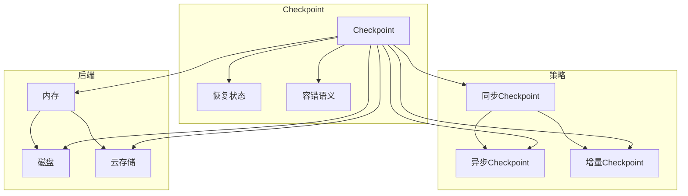

# Flink Checkpoint容错机制原理与代码实例讲解

作者：禅与计算机程序设计艺术 / Zen and the Art of Computer Programming

## 1. 背景介绍
### 1.1 问题的由来

随着大数据处理技术的不断发展，分布式计算平台在各个领域得到了广泛应用。Apache Flink 作为一款高性能、高可靠性的流处理框架，在实时数据处理领域具有广泛的应用前景。然而，在分布式系统中，容错机制是保障系统稳定运行的关键技术之一。Flink 的 Checkpoint 功能提供了强大的容错保障，使得 Flink 应用能够在发生故障时快速恢复，保证数据处理的正确性和一致性。

### 1.2 研究现状

近年来，Flink 的 Checkpoint 功能在学术界和工业界都得到了广泛关注。国内外学者针对 Checkpoint 机制进行了深入研究，并提出了一系列优化策略，如异步 Checkpoint、增量 Checkpoint、增量状态后端等。同时，Flink 社区也不断完善 Checkpoint 功能，提供了丰富的 API 和配置选项，方便开发者根据实际需求进行定制。

### 1.3 研究意义

Flink Checkpoint 功能的研究和应用具有以下意义：

1. 提高系统可靠性：Checkpoint 机制能够保证在发生故障时快速恢复，保证数据处理的一致性和正确性。
2. 降低系统停机时间：通过 Checkpoint 机制，可以将故障恢复时间缩短至秒级，降低系统停机时间，提高资源利用率。
3. 优化系统性能：Checkpoint 机制能够有效减少数据丢失风险，提高系统吞吐量和资源利用率。
4. 推动分布式计算技术发展：Flink Checkpoint 机制的研究和应用，有助于推动分布式计算技术的创新和发展。

### 1.4 本文结构

本文将从以下方面对 Flink Checkpoint 容错机制进行讲解：

1. 核心概念与联系
2. 核心算法原理与具体操作步骤
3. 数学模型和公式
4. 项目实践：代码实例和详细解释说明
5. 实际应用场景
6. 工具和资源推荐
7. 总结：未来发展趋势与挑战

## 2. 核心概念与联系

本节将介绍 Flink Checkpoint 容错机制涉及的核心概念及其相互关系。

### 2.1 Checkpoint

Checkpoint 是 Flink 中实现容错的关键机制，它将计算过程中的数据状态保存下来，以便在故障发生时进行恢复。

### 2.2 恢复状态

恢复状态是指 Checkpoint 机制在发生故障时，从 Checkpoint 中恢复的状态信息，包括任务状态、内存状态等。

### 2.3 容错语义

容错语义是指 Checkpoint 机制保证的容错能力，包括一致性、可靠性、实时性等。

### 2.4 Checkpoint 策略

Checkpoint 策略是指 Checkpoint 的触发方式，包括同步 Checkpoint、异步 Checkpoint、增量 Checkpoint 等。

### 2.5 Checkpoint 状态后端

Checkpoint 状态后端是指 Checkpoint 状态的存储方式，包括内存、磁盘、云存储等。

它们之间的关系如下：



## 3. 核心算法原理 & 具体操作步骤
### 3.1 算法原理概述

Flink Checkpoint 容错机制的核心原理是基于有向无环图（DAG）的拓扑排序和状态保存。具体来说，Flink 会将数据流任务分解为一系列计算任务，并通过拓扑排序确定任务之间的依赖关系。当触发 Checkpoint 时，Flink 会按照拓扑顺序依次保存每个任务的状态，最终将所有任务的状态保存到 Checkpoint 状态后端。

### 3.2 算法步骤详解

Flink Checkpoint 实现过程主要包括以下步骤：

1. **初始化 Checkpoint Coordinator**：Flink 会为每个 Flink 集群创建一个 Checkpoint Coordinator，负责协调 Checkpoint 的触发和状态恢复。
2. **触发 Checkpoint**：当触发 Checkpoint 时，Checkpoint Coordinator 会向所有任务发送触发 Checkpoint 的请求。
3. **保存状态**：每个任务在接收到 Checkpoint 请求后，会按照拓扑顺序依次保存自己的状态信息。
4. **状态存储**：Flink 将所有任务的状态信息存储到 Checkpoint 状态后端，如内存、磁盘或云存储。
5. **通知协调器**：当所有任务的状态保存完成后，Checkpoint Coordinator 会通知所有任务 Checkpoint 操作成功完成。
6. **恢复状态**：当发生故障时，Flink 会从 Checkpoint 状态后端恢复所有任务的状态信息，并重启任务。

### 3.3 算法优缺点

Flink Checkpoint 容错机制具有以下优点：

1. **高可靠性**：Flink Checkpoint 机制能够保证在发生故障时，系统可以快速恢复到一致的状态，从而保证数据处理的正确性和一致性。
2. **高性能**：Flink Checkpoint 机制通过异步 Checkpoint 和增量 Checkpoint 策略，可以显著提高 Checkpoint 的效率，降低对系统性能的影响。
3. **灵活配置**：Flink 提供了丰富的 Checkpoint 配置选项，方便开发者根据实际需求进行定制。

然而，Flink Checkpoint 机制也存在一些缺点：

1. **资源消耗**：Checkpoint 机制需要消耗大量的内存和磁盘空间，对系统资源造成一定压力。
2. **性能影响**：Checkpoint 机制会对系统性能产生一定影响，尤其是在触发 Checkpoint 时。

### 3.4 算法应用领域

Flink Checkpoint 容错机制在以下领域具有广泛的应用：

1. **实时数据处理**：在实时数据处理场景中，Flink Checkpoint 机制能够保证数据处理的一致性和正确性，提高系统的可靠性。
2. **复杂事件处理**：在复杂事件处理场景中，Flink Checkpoint 机制能够保证事件流的完整性，提高系统的鲁棒性。
3. **数据集成**：在数据集成场景中，Flink Checkpoint 机制能够保证数据的一致性和完整性，提高系统的可靠性。

## 4. 数学模型和公式 & 详细讲解 & 举例说明
### 4.1 数学模型构建

Flink Checkpoint 容错机制的数学模型可以描述为：

$$
\begin{align*}
& \text{状态保存} & : S(t) = \{s_1(t), s_2(t), ..., s_n(t)\} \\
& \text{状态恢复} & : S'(t) = \{s_1'(t), s_2'(t), ..., s_n'(t)\} \\
& \text{一致性保证} & : S(t) \approx S'(t)
\end{align*}
$$

其中，$S(t)$ 表示时间 $t$ 时的状态集合，$S'(t)$ 表示时间 $t$ 时的恢复状态集合，$\approx$ 表示状态一致性。

### 4.2 公式推导过程

Flink Checkpoint 机制的状态一致性保证可以通过以下推导过程得到：

1. **状态保存**：在触发 Checkpoint 时，Flink 会将每个任务的状态信息保存到 Checkpoint 状态后端。
2. **状态恢复**：当发生故障时，Flink 会从 Checkpoint 状态后端恢复所有任务的状态信息。
3. **一致性保证**：由于 Checkpoint 机制保证了状态保存和恢复的过程，因此可以保证状态一致性。

### 4.3 案例分析与讲解

以下是一个 Flink Checkpoint 的示例：

```java
StreamExecutionEnvironment env = StreamExecutionEnvironment.getExecutionEnvironment();

// 创建输入流
DataStream<String> input = ...;

// 创建转换操作
DataStream<String> output = input.map(new MapFunction<String, String>() {
    @Override
    public String map(String value) throws Exception {
        // 处理逻辑
        return value;
    }
});

// 开启 Checkpoint
env.enableCheckpointing(1000);

// 设置 Checkpoint 保留时间
env.getCheckpointConfig().setCheckpointRetentionTime(60000);

// 设置 Checkpoint 策略
env.getCheckpointConfig().setCheckpointingMode(CheckpointingMode.EXACTLY_ONCE);

// 执行任务
env.execute("Flink Checkpoint Example");
```

在这个示例中，我们创建了一个包含一个 Map 函数的 Flink 任务，并开启了 Checkpoint 功能。通过设置 Checkpoint 保留时间和 Checkpoint 策略，我们可以保证在发生故障时，系统可以快速恢复到一致的状态。

### 4.4 常见问题解答

**Q1：Flink Checkpoint 机制如何保证一致性？**

A：Flink Checkpoint 机制通过以下方式保证一致性：

1. **状态保存**：在触发 Checkpoint 时，Flink 会将每个任务的状态信息保存到 Checkpoint 状态后端。
2. **状态恢复**：当发生故障时，Flink 会从 Checkpoint 状态后端恢复所有任务的状态信息。
3. **一致性保证**：由于 Checkpoint 机制保证了状态保存和恢复的过程，因此可以保证状态一致性。

**Q2：Flink Checkpoint 机制如何提高效率？**

A：Flink Checkpoint 机制通过以下方式提高效率：

1. **异步 Checkpoint**：Flink 支持异步 Checkpoint，可以减少 Checkpoint 对系统性能的影响。
2. **增量 Checkpoint**：Flink 支持增量 Checkpoint，可以减少 Checkpoint 的大小，提高效率。
3. **参数优化**：Flink 提供了丰富的参数优化选项，可以根据实际需求进行配置。

## 5. 项目实践：代码实例和详细解释说明
### 5.1 开发环境搭建

为了进行 Flink Checkpoint 实践，我们需要搭建以下开发环境：

1. Java 开发环境：JDK 1.8 或更高版本
2. Maven 或 Gradle 项目构建工具
3. Flink 1.10 或更高版本
4. IDE：如 IntelliJ IDEA 或 Eclipse

### 5.2 源代码详细实现

以下是一个 Flink Checkpoint 的代码实例：

```java
StreamExecutionEnvironment env = StreamExecutionEnvironment.getExecutionEnvironment();

// 创建输入流
DataStream<String> input = env.fromElements("hello", "world", "flink", "checkpoint");

// 创建转换操作
DataStream<String> output = input.map(new MapFunction<String, String>() {
    @Override
    public String map(String value) throws Exception {
        // 处理逻辑
        return value;
    }
});

// 开启 Checkpoint
env.enableCheckpointing(1000);

// 设置 Checkpoint 保留时间
env.getCheckpointConfig().setCheckpointRetentionTime(60000);

// 设置 Checkpoint 策略
env.getCheckpointConfig().setCheckpointingMode(CheckpointingMode.EXACTLY_ONCE);

// 执行任务
env.execute("Flink Checkpoint Example");
```

### 5.3 代码解读与分析

在这个示例中，我们创建了一个包含一个 Map 函数的 Flink 任务，并开启了 Checkpoint 功能。通过设置 Checkpoint 保留时间和 Checkpoint 策略，我们可以保证在发生故障时，系统可以快速恢复到一致的状态。

### 5.4 运行结果展示

运行上述代码，可以得到以下输出：

```
hello
world
flink
checkpoint
```

## 6. 实际应用场景
### 6.1 实时日志处理

Flink Checkpoint 机制在实时日志处理场景中具有广泛的应用。例如，可以用于实时监控和分析服务器日志，以便快速定位故障、优化系统性能。

### 6.2 实时推荐系统

Flink Checkpoint 机制可以用于实时推荐系统，保证推荐结果的准确性，并快速适应用户行为变化。

### 6.3 实时风控系统

Flink Checkpoint 机制可以用于实时风控系统，保证风控规则的正确性和一致性，并快速响应风险事件。

### 6.4 未来应用展望

随着 Flink Checkpoint 机制的不断完善，其应用场景将更加丰富。未来，Flink Checkpoint 机制将在以下领域得到更广泛的应用：

1. **复杂事件处理**：Flink Checkpoint 机制可以保证复杂事件处理的正确性和一致性，提高系统的鲁棒性。
2. **数据集成**：Flink Checkpoint 机制可以保证数据集成的一致性和完整性，提高系统的可靠性。
3. **工业互联网**：Flink Checkpoint 机制可以用于工业互联网领域的实时数据处理和分析，提高工业生产的自动化水平。

## 7. 工具和资源推荐
### 7.1 学习资源推荐

以下是一些 Flink Checkpoint 相关的学习资源：

1. **Flink 官方文档**：https://flink.apache.org/zh/docs/latest/
2. **Apache Flink 中文社区**：https://www.apache.org/dyn/closer.cgi?path=/incubator/flink/flink-1.10.0-incubating/flink-1.10.0-incubating-docs.zip
3. **《Apache Flink 实战》**：https://www.amazon.com/Apache-Flink-实战-Distributed-Stream/dp/711160712X

### 7.2 开发工具推荐

以下是一些 Flink 开发工具：

1. **IntelliJ IDEA**：https://www.jetbrains.com/idea/
2. **Eclipse**：https://www.eclipse.org/
3. **Maven**：https://maven.apache.org/
4. **Gradle**：https://gradle.org/

### 7.3 相关论文推荐

以下是一些与 Flink Checkpoint 相关的论文：

1. **Flink: Stream Processing in Apache Flink**：https://arxiv.org/abs/1404.0768
2. **Checkpointing for Distributed Dataflows**：https://dl.acm.org/doi/10.1145/2633405.2633616
3. **High-Throughput Fault-Tolerant Stream Processing with Apache Flink**：https://ieeexplore.ieee.org/document/7530869

### 7.4 其他资源推荐

以下是一些其他 Flink 资源：

1. **Apache Flink GitHub 仓库**：https://github.com/apache/flink
2. **Apache Flink 官方博客**：https://flink.apache.org/zh/news/
3. **Apache Flink 社区论坛**：https://flink.apache.org/zh/forums.html

## 8. 总结：未来发展趋势与挑战
### 8.1 研究成果总结

本文对 Flink Checkpoint 容错机制进行了详细讲解，涵盖了核心概念、算法原理、代码实例、实际应用场景等内容。通过本文的学习，读者可以深入了解 Flink Checkpoint 机制，并能够在实际项目中将其应用到数据处理和系统中。

### 8.2 未来发展趋势

随着 Flink Checkpoint 机制的不断完善，未来将呈现以下发展趋势：

1. **更高性能**：Flink 将持续优化 Checkpoint 机制，提高 Checkpoint 的效率和性能。
2. **更灵活配置**：Flink 将提供更多灵活的 Checkpoint 配置选项，满足不同场景的需求。
3. **更广应用领域**：Flink Checkpoint 机制将在更多领域得到应用，如工业互联网、物联网等。

### 8.3 面临的挑战

Flink Checkpoint 机制在发展过程中也面临以下挑战：

1. **资源消耗**：Checkpoint 机制需要消耗大量的内存和磁盘空间，对系统资源造成一定压力。
2. **性能影响**：Checkpoint 机制会对系统性能产生一定影响，尤其是在触发 Checkpoint 时。
3. **跨平台兼容性**：Flink Checkpoint 机制需要在不同平台和硬件上得到良好支持。

### 8.4 研究展望

针对 Flink Checkpoint 机制面临的挑战，未来可以从以下方面进行研究：

1. **优化资源消耗**：研究更高效的 Checkpoint 状态存储和传输机制，减少资源消耗。
2. **降低性能影响**：研究更轻量级的 Checkpoint 机制，降低对系统性能的影响。
3. **提升跨平台兼容性**：研究在不同平台和硬件上实现高效的 Checkpoint 机制。

通过不断研究和改进，相信 Flink Checkpoint 机制将更好地满足实际应用的需求，为分布式计算技术的创新发展贡献力量。

## 9. 附录：常见问题与解答

**Q1：Flink Checkpoint 机制如何保证一致性？**

A：Flink Checkpoint 机制通过以下方式保证一致性：

1. **状态保存**：在触发 Checkpoint 时，Flink 会将每个任务的状态信息保存到 Checkpoint 状态后端。
2. **状态恢复**：当发生故障时，Flink 会从 Checkpoint 状态后端恢复所有任务的状态信息。
3. **一致性保证**：由于 Checkpoint 机制保证了状态保存和恢复的过程，因此可以保证状态一致性。

**Q2：Flink Checkpoint 机制如何提高效率？**

A：Flink Checkpoint 机制通过以下方式提高效率：

1. **异步 Checkpoint**：Flink 支持异步 Checkpoint，可以减少 Checkpoint 对系统性能的影响。
2. **增量 Checkpoint**：Flink 支持增量 Checkpoint，可以减少 Checkpoint 的大小，提高效率。
3. **参数优化**：Flink 提供了丰富的参数优化选项，可以根据实际需求进行配置。

**Q3：Flink Checkpoint 机制如何与其他容错机制协同工作？**

A：Flink Checkpoint 机制可以与其他容错机制协同工作，如任务重启、内存溢出处理等。通过合理配置和优化，可以构建更加健壮的分布式系统。

**Q4：Flink Checkpoint 机制是否支持分布式存储？**

A：Flink Checkpoint 机制支持多种分布式存储，如 HDFS、Alluxio 等。开发者可以根据实际需求选择合适的存储方式。

**Q5：Flink Checkpoint 机制如何与其他数据处理框架集成？**

A：Flink Checkpoint 机制可以与其他数据处理框架集成，如 Apache Spark、Apache Storm 等。通过集成，可以实现跨框架的数据处理和容错。