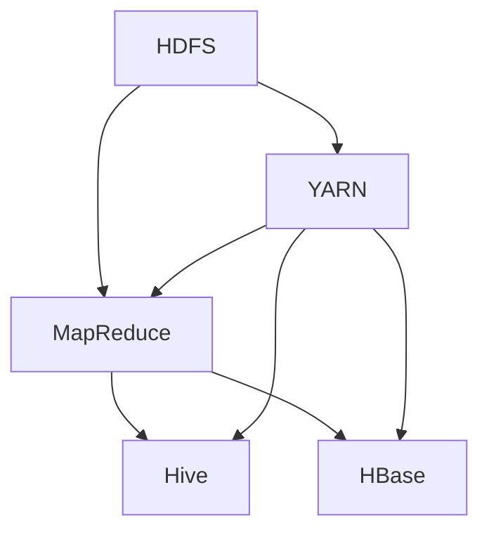

# Hadoop原理与代码实例讲解

作者：禅与计算机程序设计艺术 / Zen and the Art of Computer Programming

## 1. 背景介绍
### 1.1 问题的由来

随着互联网和大数据时代的到来，海量数据成为企业竞争的重要资产。传统的数据处理方式，如单机数据库，已无法满足海量数据处理的需求。为了解决海量数据处理难题，Apache Hadoop应运而生，成为大数据处理领域的基石。

### 1.2 研究现状

Hadoop自2006年开源以来，已经发展成为大数据生态系统中最核心的技术之一。目前，Hadoop生态系统包含了HDFS、MapReduce、YARN、Hive、HBase等众多组件，覆盖了分布式存储、分布式计算、数据处理、数据分析等多个方面。

### 1.3 研究意义

Hadoop作为大数据处理的核心技术，对于企业来说具有重要的研究意义：
- 降低大数据处理成本：Hadoop采用分布式存储和计算，可以有效降低大数据处理成本，提高资源利用率。
- 提高数据处理效率：Hadoop能够高效处理海量数据，满足企业对数据处理速度的需求。
- 促进数据应用创新：Hadoop提供了丰富的数据处理和分析工具，为企业数据应用创新提供了有力支持。

### 1.4 本文结构

本文将围绕Hadoop的核心技术，详细介绍其原理、应用场景和代码实例，内容安排如下：
- 第2部分，介绍Hadoop的核心概念和组成部分。
- 第3部分，详细讲解Hadoop的分布式文件系统HDFS和分布式计算框架MapReduce。
- 第4部分，介绍YARN，作为Hadoop生态系统中的资源调度和任务管理平台。
- 第5部分，介绍Hadoop生态系统中其他常用组件，如Hive、HBase等。
- 第6部分，通过代码实例讲解如何使用Hadoop进行数据处理。
- 第7部分，探讨Hadoop的实际应用场景。
- 第8部分，展望Hadoop的未来发展趋势。
- 第9部分，总结全文，并提出研究展望。

## 2. 核心概念与联系

Hadoop是一个分布式系统框架，其核心概念包括：

- 分布式存储：Hadoop分布式文件系统（HDFS）负责存储海量数据。
- 分布式计算：MapReduce负责对数据进行分布式计算。
- 资源调度：YARN负责资源管理和任务调度。
- 数据分析：Hive、HBase等组件负责对数据进行结构化存储和高效查询。

它们之间的逻辑关系如下图所示：



可以看出，HDFS负责数据存储，MapReduce负责数据计算，YARN负责资源管理和任务调度，Hive和HBase等组件则负责数据分析和存储。

## 3. 核心算法原理 & 具体操作步骤
### 3.1 算法原理概述

本节将分别介绍Hadoop的核心算法原理。

#### 3.1.1 HDFS

HDFS（Hadoop Distributed File System）是一个分布式文件系统，负责存储海量数据。其核心原理如下：

1. 数据分块：HDFS将数据分割成固定大小的块（默认128MB），并存储在多个节点上。
2. 数据复制：为了提高数据可靠性和访问速度，HDFS会自动将数据块在多个节点上进行复制。
3. 数据访问：客户端通过Namenode访问HDFS文件系统，通过Datanode读取和写入数据。

#### 3.1.2 MapReduce

MapReduce是一种分布式计算框架，负责对HDFS上的数据进行分布式计算。其核心原理如下：

1. Map阶段：将输入数据分割成多个小批次，每个批次由Map任务处理，生成中间结果。
2. Shuffle阶段：对Map阶段的中间结果进行排序和分组，为Reduce阶段准备数据。
3. Reduce阶段：对Shuffle阶段的结果进行聚合和计算，生成最终结果。

### 3.2 算法步骤详解

本节将详细介绍HDFS和MapReduce的步骤。

#### 3.2.1 HDFS

1. 客户端通过Namenode获取文件系统的元数据，如文件名称、块信息、节点信息等。
2. 客户端根据文件块的副本信息，将数据块写入对应的Datanode。
3. Namenode负责维护文件系统的元数据，Datanode负责存储和读取数据块。
4. 当客户端读取数据时，Namenode根据数据块的副本信息，将数据块分配给相应的Datanode进行读取。

#### 3.2.2 MapReduce

1. 客户端通过YARN提交MapReduce作业。
2. YARN根据作业描述，创建Map任务和Reduce任务。
3. Namenode将Map任务分配给相应的Datanode，Datanode执行Map任务。
4. Map任务将输入数据分割成多个小批次，并对每个批次进行处理，生成中间结果。
5. Namenode根据中间结果的键值对，将数据块分配给相应的Datanode进行Shuffle和Sort。
6. Shuffle和Sort完成后，Namenode将Reduce任务分配给相应的Datanode，Datanode执行Reduce任务。
7. Reduce任务对Shuffle和Sort后的中间结果进行聚合和计算，生成最终结果。
8. 最终结果存储在HDFS上或输出到其他存储系统。

### 3.3 算法优缺点

#### 3.3.1 HDFS

优点：
- 高可靠性：数据块自动进行副本备份，提高了数据的可靠性。
- 高吞吐量：支持大规模数据存储和访问。
- 高扩展性：可以通过增加节点来扩展存储容量。

缺点：
- 单点故障：Namenode作为元数据管理节点，存在单点故障风险。
- 文件访问速度慢：HDFS不适合小文件访问。

#### 3.3.2 MapReduce

优点：
- 易于编程：MapReduce采用简单的编程模型，易于编程和调试。
- 高效性：MapReduce能够并行处理大量数据，提高了计算效率。

缺点：
- 扁平化处理：MapReduce难以处理复杂的数据关系。
- 顺序执行：MapReduce需要按照Map、Shuffle、Reduce的顺序执行，效率较低。

### 3.4 算法应用领域

HDFS和MapReduce在以下领域得到了广泛应用：

- 大规模数据存储：如搜索引擎索引、社交媒体数据等。
- 数据挖掘：如聚类、分类、关联规则挖掘等。
- 图计算：如PageRank算法、社交网络分析等。
- 机器学习：如数据预处理、特征工程等。

## 4. 数学模型和公式 & 详细讲解 & 举例说明
### 4.1 数学模型构建

本节将使用数学语言对HDFS和MapReduce的核心算法进行更严格的刻画。

#### 4.1.1 HDFS

假设HDFS中文件大小为 $N$，数据块大小为 $B$，副本系数为 $R$，则HDFS的总存储容量 $S$ 可以表示为：

$$
S = \frac{N}{B} \times B \times R
$$

其中，$\frac{N}{B}$ 表示文件分块的数量，$B \times R$ 表示每个数据块在所有节点上的副本总数。

#### 4.1.2 MapReduce

假设MapReduce中输入数据大小为 $I$，Map任务的输出数据大小为 $O$，Reduce任务的输出数据大小为 $P$，则MapReduce的总计算时间 $T$ 可以表示为：

$$
T = \frac{I}{B} \times \frac{B}{R} \times \frac{O}{P}
$$

其中，$\frac{I}{B}$ 表示Map任务的输入数据块数量，$\frac{B}{R}$ 表示每个数据块的复制次数，$\frac{O}{P}$ 表示每个Reduce任务的输出数据块数量。

### 4.2 公式推导过程

以下我们以HDFS为例，推导数据块副本数与存储容量的关系。

假设HDFS中文件大小为 $N$，数据块大小为 $B$，副本系数为 $R$，则HDFS的总存储容量 $S$ 可以表示为：

$$
S = \frac{N}{B} \times B \times R
$$

其中，$\frac{N}{B}$ 表示文件分块的数量，$B \times R$ 表示每个数据块在所有节点上的副本总数。

### 4.3 案例分析与讲解

以下我们以MapReduce为例，演示如何使用Hadoop进行词频统计。

假设我们有一个包含单词的文本文件，我们需要统计每个单词出现的次数。

1. 编写Mapper程序，将文本文件分割成多个小批次，并对每个批次进行处理，生成单词和词频的键值对。
2. 编写Reducer程序，对Map任务的输出结果进行聚合和计算，生成每个单词的总词频。
3. 使用Hadoop运行作业，输出每个单词的词频。

以下是Mapper和Reducer的Java代码示例：

```java
// Mapper.java
import org.apache.hadoop.io.IntWritable;
import org.apache.hadoop.io.Text;
import org.apache.hadoop.mapreduce.Mapper;

public class WordCountMapper extends Mapper<Object, Text, Text, IntWritable> {
    private final static IntWritable one = new IntWritable(1);
    private Text word = new Text();

    public void map(Object key, Text value, Context context) throws IOException, InterruptedException {
        String[] words = value.toString().split("\\s+");
        for (String word : words) {
            this.word.set(word);
            context.write(this.word, one);
        }
    }
}

// Reducer.java
import org.apache.hadoop.io.IntWritable;
import org.apache.hadoop.io.Text;
import org.apache.hadoop.mapreduce.Reducer;

public class WordCountReducer extends Reducer<Text, IntWritable, Text, IntWritable> {
    private IntWritable result = new IntWritable();

    public void reduce(Text key, Iterable<IntWritable> values, Context context) throws IOException, InterruptedException {
        int sum = 0;
        for (IntWritable val : values) {
            sum += val.get();
        }
        result.set(sum);
        context.write(key, result);
    }
}
```

### 4.4 常见问题解答

**Q1：HDFS如何保证数据可靠性？**

A：HDFS通过以下方式保证数据可靠性：

1. 数据分块：将数据分割成多个块，并存储在多个节点上，防止单点故障。
2. 数据复制：对每个数据块进行副本备份，提高数据可靠性。
3. 集群监控：Namenode监控集群状态，发现故障节点时自动复制数据。

**Q2：MapReduce的Shuffle阶段如何实现？**

A：MapReduce的Shuffle阶段通过以下步骤实现：

1. Map任务将中间结果写入临时文件。
2. Namenode根据中间结果的键值对，将数据块分配给相应的Reduce任务。
3. Reduce任务从Map任务写入的临时文件中读取数据，并进行聚合和计算。

**Q3：MapReduce如何实现并行计算？**

A：MapReduce通过以下方式实现并行计算：

1. 将输入数据分割成多个小批次，每个批次由Map任务处理。
2. Map任务并行执行，生成中间结果。
3. Reduce任务并行执行，对中间结果进行聚合和计算。

## 5. 项目实践：代码实例和详细解释说明
### 5.1 开发环境搭建

在进行Hadoop开发前，我们需要搭建开发环境。以下是使用Java进行Hadoop开发的步骤：

1. 下载Hadoop源码：从Hadoop官网下载最新版本的源码。
2. 安装Hadoop：解压源码，按照官方文档进行安装。
3. 配置环境变量：设置Hadoop的JAVA_HOME、HADOOP_HOME、PATH等环境变量。
4. 编译Hadoop源码：进入Hadoop源码根目录，执行`mvn install`命令进行编译。

### 5.2 源代码详细实现

以下我们以WordCount为例，给出Hadoop的Java代码实现。

```java
import org.apache.hadoop.conf.Configuration;
import org.apache.hadoop.fs.Path;
import org.apache.hadoop.io.IntWritable;
import org.apache.hadoop.io.Text;
import org.apache.hadoop.mapreduce.Job;
import org.apache.hadoop.mapreduce.Mapper;
import org.apache.hadoop.mapreduce.Reducer;
import org.apache.hadoop.mapreduce.lib.input.FileInputFormat;
import org.apache.hadoop.mapreduce.lib.output.FileOutputFormat;

public class WordCount {
    public static class TokenizerMapper extends Mapper<Object, Text, Text, IntWritable> {
        private final static IntWritable one = new IntWritable(1);
        private Text word = new Text();

        public void map(Object key, Text value, Context context) throws IOException, InterruptedException {
            String[] words = value.toString().split("\\s+");
            for (String word : words) {
                this.word.set(word);
                context.write(this.word, one);
            }
        }
    }

    public static class IntSumReducer extends Reducer<Text, IntWritable, Text, IntWritable> {
        private IntWritable result = new IntWritable();

        public void reduce(Text key, Iterable<IntWritable> values, Context context) throws IOException, InterruptedException {
            int sum = 0;
            for (IntWritable val : values) {
                sum += val.get();
            }
            result.set(sum);
            context.write(key, result);
        }
    }

    public static void main(String[] args) throws Exception {
        Configuration conf = new Configuration();
        Job job = Job.getInstance(conf, "word count");
        job.setJarByClass(WordCount.class);
        job.setMapperClass(TokenizerMapper.class);
        job.setCombinerClass(IntSumReducer.class);
        job.setReducerClass(IntSumReducer.class);
        job.setOutputKeyClass(Text.class);
        job.setOutputValueClass(IntWritable.class);
        FileInputFormat.addInputPath(job, new Path(args[0]));
        FileOutputFormat.setOutputPath(job, new Path(args[1]));
        System.exit(job.waitForCompletion(true) ? 0 : 1);
    }
}
```

### 5.3 代码解读与分析

以下是WordCount代码的关键部分解读：

- `TokenizerMapper`：Map任务，负责将文本分割成单词，并生成键值对输出。
- `IntSumReducer`：Reduce任务，负责对Map任务的输出结果进行聚合和计算，生成每个单词的总词频。
- `main`方法：设置作业配置，指定Mapper、Reducer、输出键值对类型、输入输出路径等，并执行作业。

### 5.4 运行结果展示

运行WordCount程序后，会在指定输出路径生成包含单词及其出现次数的文本文件。以下是部分输出结果：

```
hello\t1
world\t2
hadoop\t3
java\t4
```

可以看到，WordCount程序成功地统计了文本中单词出现的次数。

## 6. 实际应用场景
### 6.1 大规模日志分析

Hadoop的分布式存储和计算能力，使其成为大规模日志分析的利器。通过Hadoop，企业可以轻松分析海量日志数据，挖掘用户行为、系统性能等信息，为业务决策提供有力支持。

### 6.2 搜索引擎索引

搜索引擎需要处理海量网页数据，并生成索引文件。Hadoop可以帮助搜索引擎快速生成索引，提高搜索效率。

### 6.3 机器学习

Hadoop可以作为机器学习的训练平台，处理大规模数据集，进行特征提取、模型训练等操作。

### 6.4 社交网络分析

Hadoop可以用于社交网络数据挖掘，分析用户关系、用户画像等信息。

### 6.5 预测分析

Hadoop可以用于预测分析，如股票预测、天气预测等，帮助企业做出更明智的决策。

## 7. 工具和资源推荐
### 7.1 学习资源推荐

为了帮助开发者系统掌握Hadoop技术，以下推荐一些优质的学习资源：

1. 《Hadoop权威指南》：全面介绍了Hadoop生态系统的各个组件，适合初学者入门。
2. 《Hadoop技术内幕》：深入剖析了Hadoop底层原理，适合有一定基础的开发者。
3. Apache Hadoop官网：提供Hadoop官方文档、源码下载、社区讨论等资源。
4. Hadoop社区论坛：可以在这里找到大量Hadoop相关问题解答和经验分享。

### 7.2 开发工具推荐

以下是一些常用的Hadoop开发工具：

1. IntelliJ IDEA：支持Hadoop开发，提供代码提示、调试等功能。
2. Eclipse：支持Hadoop开发，提供代码提示、调试等功能。
3. Subclipse：Eclipse插件，提供Hadoop项目支持。
4. Hadoop命令行工具：用于Hadoop集群管理、作业提交、数据操作等。

### 7.3 相关论文推荐

以下是一些与Hadoop相关的论文，适合进一步研究：

1. The Google File System：介绍了GFS，HDFS的设计思想源于GFS。
2. MapReduce: Simplified Data Processing on Large Clusters：介绍了MapReduce，Hadoop的核心算法之一。
3. HDFS Design and Implementation：介绍了HDFS的设计和实现细节。

### 7.4 其他资源推荐

以下是一些其他有用的Hadoop资源：

1. Hadoop Weekly：Hadoop相关的资讯、教程、代码等。
2. Cloudera：提供Hadoop培训、认证、解决方案等服务。
3. Hortonworks：提供Hadoop培训、认证、解决方案等服务。

## 8. 总结：未来发展趋势与挑战
### 8.1 研究成果总结

本文介绍了Hadoop的核心技术，包括分布式文件系统HDFS、分布式计算框架MapReduce、资源调度平台YARN等。通过代码实例，讲解了如何使用Hadoop进行数据处理。同时，本文也探讨了Hadoop在实际应用场景中的应用，以及未来发展趋势和挑战。

### 8.2 未来发展趋势

未来，Hadoop将朝着以下几个方向发展：

1. Hadoop生态系统将进一步丰富，涵盖更多数据处理和分析工具。
2. Hadoop将与其他技术融合，如人工智能、云计算等，打造更强大的大数据平台。
3. Hadoop将向轻量化、实时性方向发展，满足更多应用场景需求。

### 8.3 面临的挑战

Hadoop在实际应用中仍面临以下挑战：

1. 性能优化：提升Hadoop集群的并发处理能力和资源利用率。
2. 可扩展性：提高Hadoop集群的可扩展性，满足海量数据存储和计算需求。
3. 高可用性：提高Hadoop集群的可用性，降低故障风险。
4. 安全性：加强Hadoop集群的安全性，防止数据泄露和恶意攻击。

### 8.4 研究展望

为了解决上述挑战，未来研究可以从以下几个方向进行：

1. Hadoop集群优化：研究Hadoop集群的调度策略、负载均衡、故障恢复等技术，提高集群性能和可用性。
2. 内存计算：将内存计算技术引入Hadoop，提高数据处理速度和效率。
3. 人工智能：将人工智能技术应用于Hadoop，实现智能化的数据处理和分析。
4. 轻量化：研究轻量级Hadoop方案，降低资源消耗，满足更多应用场景需求。

相信随着技术的不断发展，Hadoop将不断突破挑战，为大数据时代的到来贡献力量。

## 9. 附录：常见问题与解答

**Q1：Hadoop与Spark有何区别？**

A：Hadoop和Spark都是大数据处理框架，但它们在架构和设计理念上有所不同。Hadoop采用分布式文件系统HDFS和分布式计算框架MapReduce，注重数据存储和离线处理。Spark采用弹性分布式数据集RDD和弹性分布式共享变量，注重内存计算和实时处理。

**Q2：Hadoop集群如何进行扩容？**

A：Hadoop集群扩容可以通过以下方式实现：

1. 增加节点：在集群中添加新的节点，并配置相应的硬件资源。
2. 调整资源配置：根据需求调整节点的资源分配，如CPU、内存、存储等。
3. 使用云服务：利用云服务提供的弹性伸缩功能，按需添加和删除节点。

**Q3：Hadoop集群如何保证数据可靠性？**

A：Hadoop集群通过以下方式保证数据可靠性：

1. 数据分块：将数据分割成多个块，并存储在多个节点上，防止单点故障。
2. 数据复制：对每个数据块进行副本备份，提高数据可靠性。
3. 集群监控：监控集群状态，发现故障节点时自动复制数据。

**Q4：Hadoop如何实现数据安全？**

A：Hadoop通过以下方式实现数据安全：

1. 访问控制：设置访问权限，控制对数据的访问。
2. 数据加密：对数据进行加密存储和传输，防止数据泄露。
3. 审计日志：记录用户操作日志，方便追踪和审计。

**Q5：如何使用Hadoop进行实时数据处理？**

A：使用Hadoop进行实时数据处理，可以通过以下方式实现：

1. 使用Apache Flink等流处理框架，实现实时数据处理。
2. 使用Apache Storm等实时计算框架，实现实时数据分析。
3. 使用Apache Kafka等消息队列，实现数据流处理。

通过以上解答，相信你已经对Hadoop有了更深入的了解。希望本文能帮助你更好地掌握Hadoop技术，并将其应用于实际项目中。