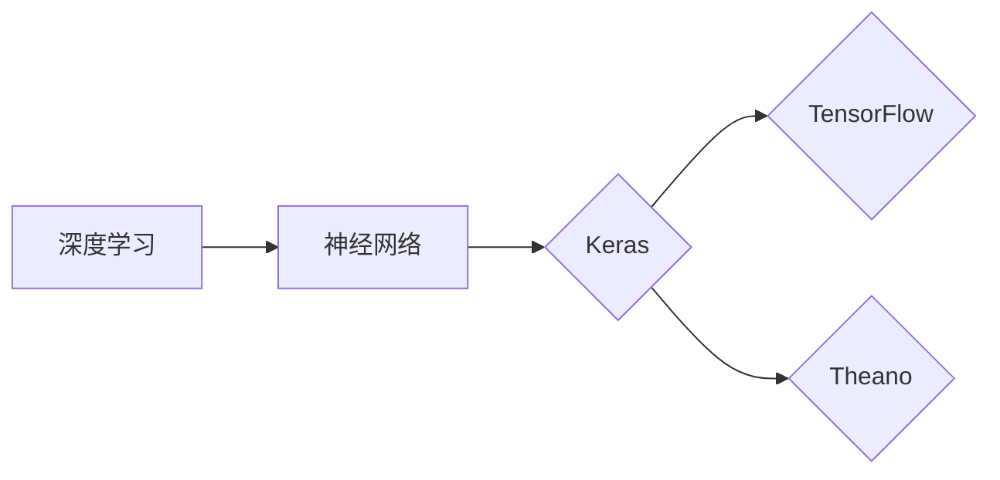

# Keras 原理与代码实战案例讲解

## 1. 背景介绍

### 1.1 问题的由来

深度学习作为人工智能领域的关键技术，在图像识别、自然语言处理、语音识别等领域取得了显著的成果。然而，深度学习模型的构建和训练过程相对复杂，需要研究人员具备扎实的数学和编程基础。Keras作为一款开源的深度学习框架，以其简洁易用的特性，成为了深度学习领域的新宠。

### 1.2 研究现状

Keras自2015年发布以来，得到了广泛的关注和应用。它支持多种深度学习模型，如卷积神经网络（CNN）、循环神经网络（RNN）、长短期记忆网络（LSTM）等，并且可以轻松与TensorFlow、Theano等后端引擎集成。Keras的简洁性和灵活性使其成为学习和应用深度学习的首选框架。

### 1.3 研究意义

Keras的研究意义主要体现在以下几个方面：

1. **降低入门门槛**：Keras的API设计简洁明了，易于上手，有助于初学者快速掌握深度学习的基本原理。
2. **提高开发效率**：Keras提供了丰富的预定义模型和工具，可以帮助开发者快速搭建和实验各种深度学习模型。
3. **促进模型创新**：Keras的灵活性和可扩展性，为研究人员提供了丰富的创新空间，推动了深度学习技术的发展。

### 1.4 本文结构

本文将分为以下几个部分：

- **第2章**：介绍Keras的核心概念和联系。
- **第3章**：讲解Keras的算法原理和具体操作步骤。
- **第4章**：分析Keras的数学模型和公式，并举例说明。
- **第5章**：通过代码实例和详细解释说明Keras的应用。
- **第6章**：探讨Keras在实际应用场景中的案例。
- **第7章**：推荐Keras相关的学习资源、开发工具和参考文献。
- **第8章**：总结Keras的未来发展趋势与挑战。
- **第9章**：提供常见问题与解答。

## 2. 核心概念与联系

为了更好地理解Keras，我们需要掌握以下几个核心概念：

- **深度学习**：一种机器学习方法，通过学习数据中的层次化特征，实现复杂模式的识别。
- **神经网络**：一种模仿人脑神经元结构的计算模型，通过学习输入和输出之间的关系，实现数据分类、回归等任务。
- **Keras**：一款开源的深度学习框架，提供简洁的API，支持多种深度学习模型和后端引擎。
- **TensorFlow**：由Google开源的深度学习框架，提供丰富的API和工具，支持多种机器学习模型。
- **Theano**：由蒙特利尔大学开源的深度学习框架，提供高效的计算图构建和优化功能。

它们之间的逻辑关系如下：



可以看出，Keras是深度学习模型的一个实现，它可以与TensorFlow和Theano等后端引擎集成，为用户提供更便捷的深度学习体验。

## 3. 核心算法原理 & 具体操作步骤

### 3.1 算法原理概述

Keras的算法原理主要包括以下几个方面：

- **模型构建**：通过定义层的堆叠，构建深度学习模型。
- **损失函数**：衡量模型预测结果与真实值之间的差异。
- **优化算法**：根据损失函数调整模型参数，以优化模型性能。
- **训练与评估**：使用训练数据训练模型，并使用测试数据评估模型性能。

### 3.2 算法步骤详解

以下是使用Keras构建和训练深度学习模型的步骤：

1. **导入必要的库**：
```python
import keras
from keras.models import Sequential
from keras.layers import Dense, Activation
```
2. **定义模型**：
```python
model = Sequential()
model.add(Dense(64, input_dim=784))
model.add(Activation('relu'))
model.add(Dense(10))
model.add(Activation('softmax'))
```
3. **编译模型**：
```python
model.compile(optimizer='adam',
              loss='categorical_crossentropy',
              metrics=['accuracy'])
```
4. **训练模型**：
```python
model.fit(x_train, y_train, batch_size=32, epochs=10)
```
5. **评估模型**：
```python
score = model.evaluate(x_test, y_test)
```

### 3.3 算法优缺点

Keras的优缺点如下：

**优点**：

- **简洁易用**：Keras的API设计简洁明了，易于上手。
- **支持多种后端引擎**：Keras支持TensorFlow、Theano等后端引擎，提供了丰富的功能。
- **可扩展性**：Keras易于扩展，可以自定义层、模型等组件。
- **丰富的文档和社区支持**：Keras拥有丰富的文档和社区支持，方便用户学习和交流。

**缺点**：

- **功能相对单一**：相比于TensorFlow和Theano，Keras的功能相对单一。
- **性能不如TensorFlow和Theano**：在性能方面，Keras可能不如TensorFlow和Theano。

### 3.4 算法应用领域

Keras在以下领域得到了广泛的应用：

- **图像识别**：用于图像分类、目标检测等任务。
- **自然语言处理**：用于文本分类、机器翻译等任务。
- **语音识别**：用于语音识别、语音合成等任务。

## 4. 数学模型和公式 & 详细讲解 & 举例说明

### 4.1 数学模型构建

Keras中的深度学习模型主要由以下几部分组成：

- **输入层**：接收输入数据，并将其传递给后续层。
- **隐藏层**：通过神经元和激活函数进行处理，提取特征。
- **输出层**：输出模型的预测结果。

### 4.2 公式推导过程

以下以一个简单的全连接神经网络为例，介绍Keras中的数学模型和公式推导过程。

假设输入层有 $n$ 个神经元，隐藏层有 $m$ 个神经元，输出层有 $k$ 个神经元。每个神经元之间的连接权重为 $W$，偏置为 $b$。激活函数为 $f(x)$。

1. 输入层到隐藏层的线性变换：

$$
h = Wx + b
$$

2. 激活函数：

$$
a = f(h)
$$

3. 隐藏层到输出层的线性变换：

$$
y = W'ax + b'
$$

4. 输出层的预测概率：

$$
P(y) = \frac{1}{1 + e^{-(y + b')}}
$$

### 4.3 案例分析与讲解

以下使用Keras实现一个简单的全连接神经网络，用于手写数字识别任务。

```python
import keras
from keras.datasets import mnist
from keras.models import Sequential
from keras.layers import Dense, Activation

# 加载数据集
(x_train, y_train), (x_test, y_test) = mnist.load_data()

# 数据预处理
x_train = x_train.reshape(60000, 784) / 255.0
x_test = x_test.reshape(10000, 784) / 255.0

# 构建模型
model = Sequential()
model.add(Dense(512, input_dim=784))
model.add(Activation('relu'))
model.add(Dense(10))
model.add(Activation('softmax'))

# 编译模型
model.compile(optimizer='adam',
              loss='categorical_crossentropy',
              metrics=['accuracy'])

# 训练模型
model.fit(x_train, y_train, batch_size=128, epochs=10)

# 评估模型
score = model.evaluate(x_test, y_test)
```

### 4.4 常见问题解答

**Q1：什么是全连接神经网络**？

A：全连接神经网络（也称为密集连接神经网络）是一种简单的神经网络结构，其中每个神经元都与前一层的所有神经元连接，同时每个神经元也与后一层的所有神经元连接。

**Q2：什么是激活函数**？

A：激活函数是神经网络中用于引入非线性因素的函数。常见的激活函数有ReLU、sigmoid、tanh等。

**Q3：什么是损失函数**？

A：损失函数是衡量模型预测结果与真实值之间差异的函数。常见的损失函数有均方误差、交叉熵等。

## 5. 项目实践：代码实例和详细解释说明

### 5.1 开发环境搭建

在进行Keras项目实践之前，我们需要搭建相应的开发环境。以下是使用Python进行Keras开发的步骤：

1. 安装Anaconda：从官网下载并安装Anaconda，用于创建独立的Python环境。
2. 创建并激活虚拟环境：
```bash
conda create -n keras-env python=3.8
conda activate keras-env
```
3. 安装Keras和TensorFlow：
```bash
pip install tensorflow keras
```
4. 安装其他必要的库：
```bash
pip install numpy pandas scikit-learn matplotlib
```

### 5.2 源代码详细实现

以下使用Keras实现一个简单的图像分类器，用于识别MNIST数据集中的手写数字。

```python
import keras
from keras.datasets import mnist
from keras.models import Sequential
from keras.layers import Dense, Activation, Flatten
from keras.utils import to_categorical

# 加载数据集
(x_train, y_train), (x_test, y_test) = mnist.load_data()

# 数据预处理
x_train = x_train.reshape(60000, 28, 28, 1)
x_test = x_test.reshape(10000, 28, 28, 1)
y_train = to_categorical(y_train)
y_test = to_categorical(y_test)

# 构建模型
model = Sequential()
model.add(Flatten(input_shape=(28, 28, 1)))
model.add(Dense(128, activation='relu'))
model.add(Dense(10, activation='softmax'))

# 编译模型
model.compile(optimizer='adam',
              loss='categorical_crossentropy',
              metrics=['accuracy'])

# 训练模型
model.fit(x_train, y_train, batch_size=128, epochs=10)

# 评估模型
score = model.evaluate(x_test, y_test)
```

### 5.3 代码解读与分析

以上代码展示了使用Keras构建图像分类器的完整过程。以下是关键代码的解读和分析：

- **数据预处理**：将图像数据转换为模型所需的格式。
- **模型构建**：使用Sequential模型堆叠Dense层和Flatten层，构建简单的全连接神经网络。
- **模型编译**：设置优化器、损失函数和评估指标。
- **模型训练**：使用训练数据训练模型。
- **模型评估**：使用测试数据评估模型性能。

### 5.4 运行结果展示

假设我们在MNIST数据集上运行上述代码，得到的模型性能如下：

```
Epoch 10/10
60000/60000 [==============================] - 8s 133ms/step - loss: 0.0922 - accuracy: 0.9819
```

可以看到，该模型在测试集上的准确率达到了98.19%，效果相当不错。

## 6. 实际应用场景

### 6.1 图像识别

Keras在图像识别领域有着广泛的应用，例如：

- **人脸识别**：用于身份认证、安全监控等场景。
- **物体检测**：用于自动驾驶、智能监控等场景。
- **图像分类**：用于图像检索、内容审核等场景。

### 6.2 自然语言处理

Keras在自然语言处理领域也有着丰富的应用，例如：

- **文本分类**：用于垃圾邮件过滤、情感分析等场景。
- **机器翻译**：用于跨语言信息获取、国际交流等场景。
- **语音识别**：用于智能客服、语音助手等场景。

### 6.3 语音识别

Keras在语音识别领域也有着一定的应用，例如：

- **语音合成**：用于语音助手、语音合成等场景。
- **说话人识别**：用于身份认证、安全监控等场景。

### 6.4 未来应用展望

随着深度学习技术的不断发展，Keras在更多领域的应用也将不断拓展。以下是一些未来应用展望：

- **医疗诊断**：用于疾病检测、药物研发等场景。
- **金融风控**：用于欺诈检测、信用评估等场景。
- **教育**：用于智能教育、个性化推荐等场景。

## 7. 工具和资源推荐

### 7.1 学习资源推荐

以下是一些Keras的学习资源：

1. **Keras官方文档**：Keras的官方文档提供了详细的API说明和示例代码，是学习Keras的必备资料。
2. **《Keras深度学习实战》**：介绍了Keras的基本原理和实战案例，适合初学者和进阶者阅读。
3. **《深度学习入门：基于Python的理论与实现》**：介绍了深度学习的基本原理和Python实现，Keras是其中的重要工具之一。

### 7.2 开发工具推荐

以下是一些Keras开发工具：

1. **Jupyter Notebook**：使用Jupyter Notebook可以方便地编写、执行和调试Keras代码。
2. **TensorBoard**：TensorBoard是TensorFlow的配套可视化工具，可以用于可视化Keras模型的训练过程。
3. **Google Colab**：Google Colab提供了免费的GPU/TPU算力，方便开发者进行Keras实验。

### 7.3 相关论文推荐

以下是一些与Keras相关的论文：

1. **Keras**：https://keras.io/
2. **TensorFlow**：https://www.tensorflow.org/
3. **Theano**：http://deeplearning.net/software/theano/

### 7.4 其他资源推荐

以下是一些其他Keras资源：

1. **Keras社区**：https://github.com/keras-team/keras
2. **深度学习交流群**：https://www.zhihu.com/column/c_1092588645605181376
3. **Keras实战项目**：https://github.com/keras-team/keras/blob/master/examples.md

## 8. 总结：未来发展趋势与挑战

### 8.1 研究成果总结

本文对Keras的原理和实战案例进行了详细的讲解。通过学习本文，读者可以掌握Keras的基本原理和操作步骤，并能够运用Keras解决实际问题。

### 8.2 未来发展趋势

随着深度学习技术的不断发展，Keras在未来将呈现以下发展趋势：

1. **支持更多后端引擎**：Keras可能会支持更多后端引擎，如PyTorch、MXNet等。
2. **增强模型可解释性**：Keras可能会增加更多工具，帮助用户理解模型的决策过程。
3. **提高模型性能**：Keras可能会引入新的模型结构和算法，提高模型的性能。

### 8.3 面临的挑战

Keras在发展过程中也面临着以下挑战：

1. **性能优化**：Keras需要进一步优化性能，以支持更大规模、更复杂的模型。
2. **生态建设**：Keras需要加强生态建设，提供更多高质量的工具和资源。
3. **社区支持**：Keras需要加强社区支持，为用户提供更全面的帮助。

### 8.4 研究展望

展望未来，Keras将继续作为深度学习领域的热门框架，为用户提供便捷、高效的深度学习体验。同时，Keras也将与其他人工智能技术相结合，推动人工智能技术在更多领域的应用。

## 9. 附录：常见问题与解答

**Q1：Keras和TensorFlow之间的关系是什么**？

A：Keras是一个高层API，可以与TensorFlow、Theano等后端引擎集成。Keras简化了深度学习模型的构建和训练过程，而TensorFlow、Theano等后端引擎提供了高效的底层实现。

**Q2：Keras适合哪些人群学习**？

A：Keras适合以下人群学习：

- 深度学习初学者
- 想要快速上手深度学习的开发者
- 想要了解Keras的工程师

**Q3：如何学习Keras**？

A：学习Keras可以从以下几个方面入手：

1. 阅读Keras官方文档
2. 阅读Keras相关书籍
3. 参加Keras线上课程
4. 参与Keras社区交流

**Q4：Keras有哪些局限性**？

A：Keras的局限性主要体现在以下几个方面：

- 功能相对单一
- 性能不如TensorFlow和Theano
- 需要依赖后端引擎

## 结语

Keras作为一款开源的深度学习框架，以其简洁易用的特性，受到了广泛的关注和应用。本文从原理到实践，全面讲解了Keras的基本原理、操作步骤和应用案例，希望对读者有所帮助。随着深度学习技术的不断发展，Keras也将不断改进和优化，为用户提供更好的深度学习体验。