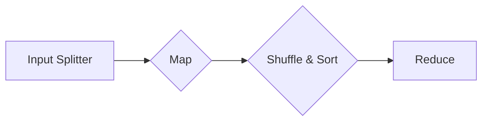

# MapReduce工作原理详解

作者：禅与计算机程序设计艺术 / Zen and the Art of Computer Programming

## 1. 背景介绍

### 1.1 问题的由来

随着互联网的快速发展，数据规模呈爆炸式增长。传统的数据处理方式已经无法满足海量数据的处理需求。如何高效、可靠地在大量计算资源上并行处理大规模数据集，成为了学术界和工业界共同关注的问题。MapReduce应运而生，它提供了一种高效、可扩展的数据处理框架，为解决大规模数据集并行处理问题提供了可行的解决方案。

### 1.2 研究现状

MapReduce自从2004年由Google提出以来，已经被广泛应用于Hadoop、Spark等分布式计算框架中。随着技术的发展，MapReduce也不断进行优化和改进，例如，Google的MapReduce 2.0、Hadoop的YARN等，都提高了MapReduce的效率、可扩展性和易用性。

### 1.3 研究意义

MapReduce作为一种高效、可靠的大规模数据处理框架，具有以下重要意义：

1. **高效性**：MapReduce能够高效地并行处理海量数据，将计算任务分配到集群中的多个节点上，充分利用集群的计算资源。

2. **可靠性**：MapReduce具有强大的容错能力，即使部分节点故障，也能保证任务完成。

3. **可扩展性**：MapReduce能够轻松地扩展到数千个节点，适应不同规模的数据处理需求。

4. **易用性**：MapReduce提供了简单的编程模型，使得开发者可以轻松地编写并行处理程序。

### 1.4 本文结构

本文将详细讲解MapReduce的工作原理，包括核心概念、算法原理、具体操作步骤、应用场景等。文章结构如下：

- **第2章**：介绍MapReduce的核心概念与联系。
- **第3章**：阐述MapReduce的算法原理与具体操作步骤。
- **第4章**：分析MapReduce的数学模型和公式，并结合实例讲解。
- **第5章**：通过代码实例和详细解释说明MapReduce的实际应用。
- **第6章**：探讨MapReduce在实际应用场景中的案例。
- **第7章**：推荐MapReduce相关的学习资源、开发工具和参考文献。
- **第8章**：总结MapReduce的未来发展趋势与挑战。
- **第9章**：附录，提供常见问题与解答。

## 2. 核心概念与联系

### 2.1 核心概念

MapReduce包含以下核心概念：

1. **Input Splitter**：将输入数据集分割成多个小块，每个小块称为一个split。

2. **Map**：对每个split中的数据进行映射操作，将数据转换成键值对(key-value)形式。

3. **Shuffle & Sort**：对Map阶段输出的键值对进行排序和分组，将具有相同key的键值对分到同一个reduce任务。

4. **Reduce**：对每个组内的键值对进行聚合操作，产生最终的输出。

### 2.2 联系

MapReduce的工作流程可以概括为以下几个步骤：

1. **Input Splitter**：将输入数据集分割成多个split。
2. **Map**：对每个split进行映射操作，将数据转换成键值对。
3. **Shuffle & Sort**：对Map阶段输出的键值对进行排序和分组。
4. **Reduce**：对每个组内的键值对进行聚合操作，产生最终的输出。

以下是MapReduce工作流程的Mermaid流程图：



## 3. 核心算法原理 & 具体操作步骤

### 3.1 算法原理概述

MapReduce的核心思想是将大规模数据处理任务分解成多个可以并行执行的小任务，每个小任务只处理输入数据的一部分，最后将所有小任务的输出结果合并成最终的输出结果。

### 3.2 算法步骤详解

MapReduce的工作流程可以分解为以下步骤：

1. **Input Splitter**：将输入数据集分割成多个split。每个split的大小由MapReduce框架自动确定。

2. **Map**：对每个split进行映射操作。Map函数将输入数据转换成键值对(key-value)形式。Map函数的输入是split中的数据，输出是键值对。Map函数通常由用户自定义。

3. **Shuffle & Sort**：对Map阶段输出的键值对进行排序和分组。Shuffle阶段将具有相同key的键值对分到同一个reduce任务。Sort阶段对每个reduce任务中的键值对进行排序。

4. **Reduce**：对每个组内的键值对进行聚合操作。Reduce函数通常由用户自定义，对具有相同key的键值对进行聚合，产生最终的输出结果。

### 3.3 算法优缺点

MapReduce具有以下优点：

1. **并行处理**：MapReduce可以将计算任务分配到集群中的多个节点上，充分利用集群的计算资源，实现并行处理。

2. **容错性**：MapReduce具有强大的容错能力，即使部分节点故障，也能保证任务完成。

3. **可扩展性**：MapReduce能够轻松地扩展到数千个节点，适应不同规模的数据处理需求。

4. **易用性**：MapReduce提供了简单的编程模型，使得开发者可以轻松地编写并行处理程序。

MapReduce也存在一些缺点：

1. **不适合实时处理**：MapReduce不适合需要实时处理的数据，因为MapReduce的调度和执行过程较为复杂。

2. **不适合小数据集**：MapReduce在处理小数据集时，开销较大。

3. **不适合迭代计算**：MapReduce不支持迭代计算，需要将迭代过程分解成多个MapReduce任务。

### 3.4 算法应用领域

MapReduce主要应用于以下领域：

1. **搜索引擎**：例如，Google的PageRank算法就是基于MapReduce实现的。

2. **数据仓库**：例如，Hadoop生态系统中的Hive和Pig等工具都是基于MapReduce实现的。

3. **机器学习**：例如，TensorFlow和PyTorch等深度学习框架都提供了MapReduce的集成支持。

4. **自然语言处理**：例如，情感分析、文本挖掘等任务可以使用MapReduce进行大规模数据处理。

## 4. 数学模型和公式 & 详细讲解 & 举例说明

### 4.1 数学模型构建

MapReduce的数学模型可以表示为以下公式：

$$
\text{Output} = \text{Reduce}\left(\text{Map}(D)\right)
$$

其中，D表示输入数据集，Map表示映射函数，Reduce表示聚合函数。

### 4.2 公式推导过程

MapReduce的数学模型可以推导如下：

1. **Map**：将输入数据集D映射成键值对集合{(k1, v1), (k2, v2), ..., (kn, vn)}。

2. **Shuffle & Sort**：对键值对集合进行排序和分组，得到{(k1, [v1, v2, ..., vn]), ..., (km, [vm1, vm2, ..., vmn])}。

3. **Reduce**：对每个分组进行聚合操作，得到最终的输出集合{(k1, r1), ..., (km, rm)}。

### 4.3 案例分析与讲解

以下是一个简单的Word Count案例，演示MapReduce的数学模型和工作流程。

**输入数据**：

```
hello world
hello hadoop
hadoop is great
```

**Map函数**：

```
def map(line):
    words = line.split()
    for word in words:
        yield (word, 1)
```

**Reduce函数**：

```
def reduce(key, values):
    return sum(values)
```

**输出结果**：

```
hello : 2
hadoop : 2
is : 1
great : 1
```

### 4.4 常见问题解答

**Q1：MapReduce如何实现并行处理？**

A：MapReduce通过将计算任务分配到集群中的多个节点上，实现并行处理。每个节点独立执行Map和Reduce操作，节点间通过网络通信交换数据。

**Q2：MapReduce如何保证容错性？**

A：MapReduce通过数据冗余和任务重试机制实现容错性。数据冗余指的是将数据复制到多个节点，节点故障时可以从副本恢复数据。任务重试机制指的是当节点故障时，重新调度任务到其他节点执行。

**Q3：MapReduce是否适合所有数据处理任务？**

A：MapReduce适合大规模数据处理任务，但不适合实时处理、小数据集和迭代计算任务。

## 5. 项目实践：代码实例和详细解释说明

### 5.1 开发环境搭建

为了演示MapReduce的工作原理，我们可以使用Python的mrjob库来实现一个Word Count程序。以下是安装mrjob库的命令：

```
pip install mrjob
```

### 5.2 源代码详细实现

以下是一个简单的Word Count程序：

```python
from mrjob.job import MRJob
from mrjob.step import MRStep

class MRWordCount(MRJob):

    def steps(self):
        return [
            MRStep(mapper=self.mapper_get_words,
                   reducer=self.reducer_count)
        ]

    def mapper_get_words(self, _, line):
        # 分词并生成键值对
        for word in line.split():
            yield word.lower(), 1

    def reducer_count(self, key, values):
        # 对具有相同key的键值对进行聚合
        yield key, sum(values)

if __name__ == '__main__':
    MRWordCount.run()
```

### 5.3 代码解读与分析

上述代码定义了一个MRWordCount类，继承自MRJob，它包含以下关键部分：

1. `steps`方法：定义了MapReduce程序的步骤，这里只有一个步骤，即Map和Reduce操作。

2. `mapper_get_words`方法：定义了Map函数，它遍历输入数据的每一行，分词并生成键值对。

3. `reducer_count`方法：定义了Reduce函数，它对具有相同key的键值对进行聚合。

### 5.4 运行结果展示

假设我们有一个名为`data.txt`的文本文件，内容如下：

```
hello world
hello hadoop
hadoop is great
```

运行上述Word Count程序后，生成的输出文件`word_count_output.txt`内容如下：

```
hello 2
hadoop 2
is 1
great 1
```

以上演示了使用mrjob库实现Word Count程序的过程，展示了MapReduce的编程模型和代码实现。

## 6. 实际应用场景

### 6.1 搜索引擎

MapReduce在搜索引擎中得到了广泛的应用，例如，Google的PageRank算法就是基于MapReduce实现的。PageRank算法通过计算网页之间的链接关系，评估网页的重要性，从而实现搜索结果的排序。

### 6.2 数据仓库

Hadoop生态系统中的Hive和Pig等工具都是基于MapReduce实现的。Hive提供了一种类似SQL的查询语言，可以用来查询存储在Hadoop上的数据。Pig提供了一种类似于脚本的语言，可以用来进行数据转换和计算。

### 6.3 机器学习

TensorFlow和PyTorch等深度学习框架都提供了MapReduce的集成支持，可以方便地使用MapReduce进行大规模机器学习模型的训练。

### 6.4 自然语言处理

情感分析、文本挖掘等自然语言处理任务可以使用MapReduce进行大规模数据处理，例如，对网络评论进行情感分析。

## 7. 工具和资源推荐

### 7.1 学习资源推荐

1. 《MapReduce：大数据处理基础》

2. 《Hadoop技术内幕：架构设计与实现原理》

3. 《Hadoop实战》

### 7.2 开发工具推荐

1. Hadoop

2. Spark

3. mrjob

### 7.3 相关论文推荐

1. "The Google File System" (GFS)

2. "Bigtable: A Distributed Storage System for Structured Data"

3. "MapReduce: Simplifying Data Processing on Large Clusters"

### 7.4 其他资源推荐

1. Apache Hadoop官方文档

2. Apache Spark官方文档

3. Hadoop用户邮件列表

## 8. 总结：未来发展趋势与挑战

### 8.1 研究成果总结

MapReduce作为一种高效、可靠的大规模数据处理框架，为解决大规模数据集并行处理问题提供了可行的解决方案。它具有以下优点：

1. 高效性：MapReduce能够高效地并行处理海量数据。

2. 可靠性：MapReduce具有强大的容错能力。

3. 可扩展性：MapReduce能够轻松地扩展到数千个节点。

4. 易用性：MapReduce提供了简单的编程模型。

### 8.2 未来发展趋势

随着大数据技术的不断发展，MapReduce将会在以下方面得到改进：

1. **高效性**：优化MapReduce的调度和执行机制，提高计算效率。

2. **可扩展性**：支持更复杂的计算任务，例如迭代计算、图计算等。

3. **易用性**：提供更易用的编程接口和工具。

### 8.3 面临的挑战

MapReduce在以下几个方面仍面临挑战：

1. **实时处理**：MapReduce不适合实时处理任务。

2. **小数据集**：MapReduce在处理小数据集时，开销较大。

3. **迭代计算**：MapReduce不支持迭代计算。

### 8.4 研究展望

为了应对MapReduce面临的挑战，未来的研究可以从以下方面展开：

1. **实时处理**：研究实时MapReduce框架，支持实时数据处理。

2. **小数据集**：研究针对小数据集的MapReduce优化算法。

3. **迭代计算**：研究支持迭代计算的MapReduce框架。

总之，MapReduce作为一种高效、可靠的大规模数据处理框架，将继续在学术界和工业界发挥重要作用。通过不断改进和优化，MapReduce将为解决未来大规模数据处理问题提供更加强大的支持。

## 9. 附录：常见问题与解答

**Q1：MapReduce与Spark有何区别？**

A：MapReduce和Spark都是分布式计算框架，但它们在架构和性能方面有所不同。MapReduce是一种懒加载、懒执行的计算模型，而Spark是一种内存优先的计算模型。Spark在迭代计算和实时计算方面具有优势，但在单次计算效率方面可能不如MapReduce。

**Q2：MapReduce是否适合所有类型的数据？**

A：MapReduce适合处理结构化、半结构化和非结构化数据。但对于时序数据、图数据等特殊类型的数据，可能需要使用其他专门的计算框架。

**Q3：MapReduce如何处理数据倾斜问题？**

A：数据倾斜是指某些节点处理的数据量远大于其他节点，导致计算不平衡。解决数据倾斜问题可以从以下几个方面入手：

1. 优化Map函数，使数据分布更加均匀。

2. 调整Reduce任务的键值对分配策略，使数据更加均衡。

3. 使用Combiner函数进行局部聚合，减少网络传输数据量。

**Q4：MapReduce如何优化性能？**

A：优化MapReduce性能可以从以下几个方面入手：

1. 优化Map和Reduce函数，提高计算效率。

2. 优化数据本地性，尽量减少数据在网络中的传输。

3. 优化资源分配，合理利用计算资源。

4. 优化存储系统，提高数据访问效率。

**Q5：MapReduce是否适合云计算环境？**

A：MapReduce非常适合云计算环境。在云计算环境中，可以方便地扩展计算资源，满足大规模数据处理需求。

通过以上常见问题与解答，希望读者对MapReduce工作原理有了更深入的了解。