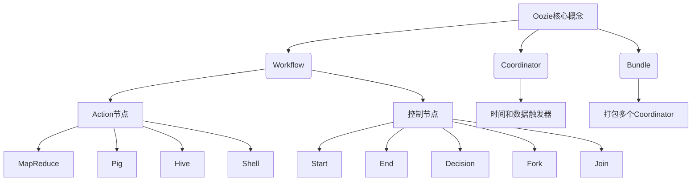
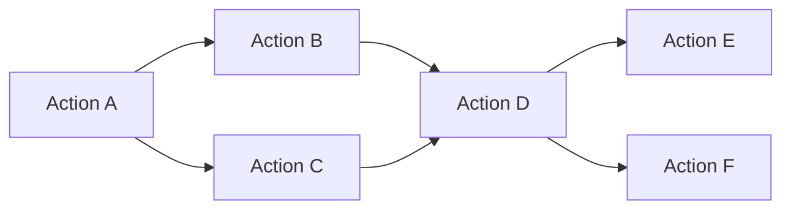

以下是《Oozie原理与代码实例讲解》这篇技术博客文章的正文内容：

# Oozie原理与代码实例讲解

## 1. 背景介绍

### 1.1 问题的由来

在大数据时代，数据处理任务的复杂性和规模都在不断增加。传统的批处理系统很难满足现代数据应用的需求,需要一种可靠、可扩展、高效的工作流调度系统来协调和管理这些复杂的数据处理任务。Apache Oozie应运而生,旨在解决大数据处理中的工作流调度问题。

### 1.2 研究现状  

Apache Oozie是Apache Hadoop生态系统中的一个关键组件,用于管理Hadoop作业(如MapReduce、Pig、Hive等)的工作流调度。它支持以简单的方式定义复杂的工作流,并提供了可靠的重启和恢复功能,确保作业能够在出现故障时自动重新执行。

目前,Oozie已经广泛应用于各种大数据处理场景,如ETL(提取、转换、加载)、数据分析、机器学习等。越来越多的公司和组织将其用于生产环境中,以提高数据处理效率和可靠性。

### 1.3 研究意义

深入理解Oozie的原理和实现机制对于充分利用其强大功能至关重要。本文将全面剖析Oozie的核心概念、算法原理、数学模型、代码实现等,旨在帮助读者掌握Oozie的本质,提升大数据处理能力。

### 1.4 本文结构  

本文将从以下几个方面深入探讨Oozie:

1. 核心概念与联系
2. 核心算法原理及具体操作步骤  
3. 数学模型和公式详细讲解及案例分析
4. 项目实践:代码实例和详细解释说明
5. 实际应用场景
6. 工具和资源推荐
7. 总结:未来发展趋势与挑战
8. 附录:常见问题与解答

## 2. 核心概念与联系

Oozie的核心概念包括Workflow、Coordinator和Bundle。

**Workflow**定义了一系列动作(Action)和控制节点(Control Node)的执行顺序,用于实现复杂的数据处理任务。Action节点可以是MapReduce、Pig、Hive或Shell脚本等,而控制节点则控制作业的执行流程,包括Start、End、Decision、Fork和Join等。

**Coordinator**用于调度和执行基于时间和数据的工作流,支持定期执行或基于数据可用性触发执行。它可以设置时间触发器(如cron表达式)或数据触发器(如文件系统事件)。

**Bundle**则是将多个相关的Coordinator打包在一起,方便集中管理和监控。

这三个核心概念紧密相连,共同构建了Oozie的工作流调度框架。Workflow定义了具体的任务流程,Coordinator负责触发和调度Workflow的执行,而Bundle则将多个Coordinator组织在一起,实现更高层次的协调。

## 3. 核心算法原理及具体操作步骤

### 3.1 算法原理概述

Oozie的核心算法是基于有向无环图(DAG)的拓扑排序算法,用于确定工作流中各个节点的执行顺序。该算法可以有效处理复杂的依赖关系,确保前置节点完成后才能执行后续节点。

此外,Oozie还采用了一种基于状态机的执行模型,每个工作流、协调器和动作都有自己的状态机,用于跟踪和管理执行状态。状态转换由各种事件(如作业完成、失败等)触发,从而实现了可靠的恢复和重新执行机制。

### 3.2 算法步骤详解

Oozie工作流调度算法的主要步骤如下:

1. **解析工作流定义**:首先,Oozie解析用户提交的工作流定义文件(如XML或JSON格式),构建内部的有向无环图(DAG)表示。

2. **拓扑排序**:对DAG进行拓扑排序,确定各个节点的执行顺序。这一步使用了经典的Kahn算法。

3. **状态机初始化**:为工作流、协调器和每个动作创建相应的状态机实例,并将它们初始化为"就绪"状态。

4. **触发执行**:根据用户配置的触发条件(如时间触发器或数据触发器),Oozie触发工作流或协调器的执行。

5. **调度和监控**:Oozie根据拓扑排序的结果,依次调度和执行各个节点。同时,它监控每个节点的执行状态,并根据状态机规则进行相应的状态转换。

6. **错误处理和重试**:如果某个节点执行失败,Oozie会根据配置的重试策略进行重新执行。如果达到最大重试次数仍然失败,则标记整个工作流或协调器为"失败"状态。

7. **清理和通知**:工作流或协调器执行完成后,Oozie进行必要的清理工作,并向用户发送执行结果通知(如电子邮件)。

通过这一系列步骤,Oozie能够高效、可靠地调度和执行复杂的大数据处理任务。

### 3.3 算法优缺点

**优点**:

- 支持复杂的依赖关系管理
- 提供可靠的恢复和重试机制
- 支持时间和数据触发器,满足多种调度需求
- 与Hadoop生态系统无缝集成

**缺点**:

- 对于高并发的工作流调度,性能可能会受到影响
- 配置文件语法较为复杂,存在一定学习曲线
- 对于动态调整工作流定义的需求,支持不足

### 3.4 算法应用领域

Oozie工作流调度算法广泛应用于以下领域:

- **ETL(提取、转换、加载)**: 协调Hadoop上的ETL任务,从各种数据源提取数据,进行转换和加载到数据仓库或数据湖中。
- **数据分析**: 管理和调度各种数据分析任务,如Hive SQL查询、Pig脚本等。
- **机器学习**: 调度机器学习工作流,包括数据准备、模型训练、评估和部署等步骤。
- **数据质量检查**: 定期执行数据质量检查任务,确保数据的完整性和准确性。
- **自动化运维**: 自动化执行各种运维任务,如备份、日志收集和清理等。

## 4. 数学模型和公式及详细讲解和举例说明

### 4.1 数学模型构建

Oozie工作流调度问题可以建模为一个有向无环图(DAG)问题。在这个模型中,每个节点表示一个动作或控制节点,边表示节点之间的依赖关系。

我们定义一个有向无环图$G = (V, E)$,其中:

- $V$是节点集合,表示工作流中的所有动作和控制节点。
- $E$是边集合,表示节点之间的依赖关系。如果存在一条从节点$u$到节点$v$的边$(u, v) \in E$,则表示节点$v$依赖于节点$u$,必须在$u$执行完成后才能执行。

此外,我们还需要定义每个节点的权重$w(v)$,表示该节点的执行时间。

### 4.2 公式推导过程

为了确定工作流中各个节点的执行顺序,我们需要对DAG进行拓扑排序。拓扑排序算法的基本思想是:对于每个节点$v$,我们计算它的入度(即指向它的边的数量)。入度为0的节点就是初始节点,可以先执行。执行完成后,删除该节点及其出边,继续寻找新的入度为0的节点,重复这个过程,直到所有节点都被访问过。

我们定义$indeg(v)$表示节点$v$的入度,则拓扑排序算法可以表示为:

$$
\begin{align*}
&\text{初始化:} \\
&\qquad Q = \{ v \in V | indeg(v) = 0 \} \\
&\qquad \text{拓扑序列} S = \emptyset \\
&\textbf{循环:} \\
&\qquad \textbf{while } Q \neq \emptyset: \\
&\qquad\qquad u = \text{从Q中取出一个节点} \\
&\qquad\qquad S = S \cup \{u\} \\
&\qquad\qquad \textbf{for } \text{每个} (u, v) \in E: \\
&\qquad\qquad\qquad indeg(v) = indeg(v) - 1 \\
&\qquad\qquad\qquad \textbf{if } indeg(v) = 0: \\
&\qquad\qquad\qquad\qquad Q = Q \cup \{v\} \\
&\textbf{返回} S
\end{align*}
$$

该算法的时间复杂度为$O(|V| + |E|)$,即线性时间复杂度。

### 4.3 案例分析与讲解

假设我们有一个工作流,包含以下节点和依赖关系:

这个工作流可以表示为一个有向无环图$G = (V, E)$,其中:

- $V = \{A, B, C, D, E, F\}$
- $E = \{(A, B), (A, C), (B, D), (C, D), (D, E), (D, F)\}$

我们可以计算每个节点的入度:

- $indeg(A) = 0$
- $indeg(B) = 1$
- $indeg(C) = 1$
- $indeg(D) = 2$
- $indeg(E) = 1$
- $indeg(F) = 1$

根据拓扑排序算法,初始节点是$A$,因为它的入度为0。执行$A$后,删除$A$及其出边,更新其他节点的入度:

- $indeg(B) = 0$
- $indeg(C) = 0$
- $indeg(D) = 2$
- $indeg(E) = 1$
- $indeg(F) = 1$

现在$B$和$C$的入度为0,可以执行。假设先执行$B$,然后是$C$,再更新其他节点的入度:

- $indeg(D) = 0$
- $indeg(E) = 1$
- $indeg(F) = 1$

接下来执行$D$,然后是$E$和$F$,最终得到拓扑序列$S = \{A, B, C, D, E, F\}$。

这个案例说明了Oozie如何使用拓扑排序算法来确定工作流中各个节点的执行顺序,从而保证依赖关系得到满足。

### 4.4 常见问题解答

**Q: 如果有环路存在,拓扑排序算法会如何处理?**

A: 如果有向图中存在环路,则无法进行拓扑排序。Oozie在解析工作流定义时会检查是否存在环路,如果存在,则会拒绝执行该工作流。

**Q: 如何处理节点执行失败的情况?**

A: Oozie采用了基于状态机的执行模型,当某个节点执行失败时,会根据配置的重试策略进行重新执行。如果达到最大重试次数仍然失败,则标记整个工作流或协调器为"失败"状态。用户可以配置失败后的通知机制,如发送电子邮件。

**Q: Oozie是否支持动态调整工作流定义?**

A: Oozie目前不直接支持动态调整工作流定义。如果需要修改工作流,需要停止当前运行的工作流,编辑定义文件,然后重新提交。不过,Oozie提供了一些变通方法,如使用参数化工作流或EL表达式来实现一定程度的动态性。

## 5. 项目实践:代码实