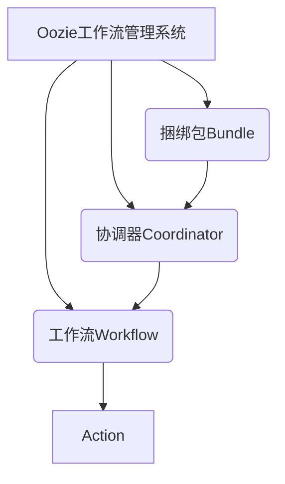
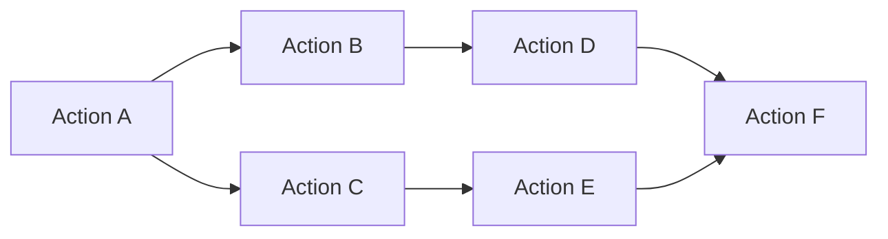
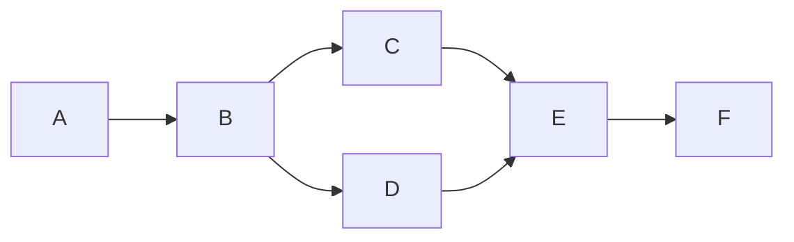

# Oozie原理与代码实例讲解

## 1. 背景介绍

### 1.1 问题的由来

在大数据时代,数据处理任务变得越来越复杂,需要将多个作业链接在一起协同工作。例如,一个典型的数据处理流程可能包括以下步骤:

1. 从HDFS中读取原始数据
2. 使用MapReduce作业进行数据清洗和转换
3. 使用Hive查询进行数据分析
4. 将分析结果加载到数据仓库中

手动编排和监控这些步骤是一项艰巨的任务,容易出错且效率低下。因此,需要一种工作流调度系统来自动化和管理这些复杂的数据处理流程。

### 1.2 研究现状

Apache Oozie是一个流行的开源工作流调度系统,专门为Apache Hadoop生态系统设计。它支持多种类型的Hadoop作业(如MapReduce、Pig、Hive和Shell脚本),并提供了强大的工作流定义和监控功能。

Oozie广泛应用于各种大数据场景,如日志处理、数据分析、机器学习等。它已成为Apache Hadoop生态系统中不可或缺的一部分,得到了广泛的社区支持和持续的开发。

### 1.3 研究意义

深入理解Oozie的原理和实现细节,对于大数据开发人员和架构师来说至关重要。本文将全面解析Oozie的核心概念、工作原理、算法实现和代码实例,帮助读者掌握Oozie的使用和定制技能,从而更好地管理和优化大数据工作流。

### 1.4 本文结构

本文将从以下几个方面深入探讨Oozie:

1. 核心概念与联系
2. 核心算法原理与具体操作步骤
3. 数学模型和公式详细讲解与案例分析
4. 项目实践:代码实例和详细解释说明
5. 实际应用场景
6. 工具和资源推荐
7. 总结:未来发展趋势与挑战
8. 附录:常见问题与解答

## 2. 核心概念与联系

在深入探讨Oozie的原理之前,我们先介绍一些核心概念:

### 2.1 工作流(Workflow)

工作流是由一系列动作(Action)按特定顺序组成的任务集合。Oozie支持多种类型的Action,包括:

- MapReduce作业
- Pig作业
- Hive脚本
- Shell脚本
- FS操作(如HDFS文件复制)
- Java程序

工作流中的Action可以按控制依赖关系(如先后顺序)或数据依赖关系(如输入/输出数据)进行组织。

### 2.2 协调器(Coordinator)

协调器用于定期执行工作流,例如每天或每小时执行一次。它支持各种时间和数据触发条件,如基于时间的调度、数据可用性等。

### 2.3 捆绑包(Bundle)

捆绑包是多个协调器的集合,用于组织和管理相关的工作流。它提供了一种层次化的方式来协调复杂的数据处理流程。

这些核心概念密切相关,共同构建了Oozie的工作流编排和调度框架。下面我们将详细探讨它们的工作原理和实现细节。

## 3. 核心算法原理与具体操作步骤

### 3.1 算法原理概述

Oozie的核心算法是基于有向无环图(DAG)的拓扑排序算法。工作流中的每个Action都是DAG中的一个节点,节点之间的边表示控制依赖或数据依赖关系。

拓扑排序算法用于确定Action的执行顺序,保证每个Action的前置依赖都被满足。算法的基本思想是:

1. 找到入度为0的节点(没有前置依赖的Action),将它们加入执行队列
2. 从执行队列中取出一个节点,执行对应的Action
3. 删除该节点,并将其所有后继节点(依赖于该Action的后续Action)的入度减1
4. 重复步骤1-3,直到所有节点都被执行

这种拓扑排序算法保证了工作流中Action的正确执行顺序,避免了死锁和环路等问题。

### 3.2 算法步骤详解

下面我们用一个具体的例子来详细解释拓扑排序算法的执行过程:

1. 初始状态:入度为0的节点是A,将A加入执行队列
2. 执行A,删除A节点,B和C的入度减1
3. 入度为0的节点是B和C,将它们加入执行队列
4. 执行B,删除B节点,D的入度减1
5. 执行C,删除C节点,E的入度减1
6. 入度为0的节点是D和E,将它们加入执行队列
7. 执行D,删除D节点,F的入度减1
8. 执行E,删除E节点,F的入度减1
9. 入度为0的节点是F,将F加入执行队列
10. 执行F,删除F节点,所有节点都被执行完毕,算法结束

通过这个例子,我们可以看到拓扑排序算法如何确保Action的正确执行顺序,同时避免了死锁和环路问题。

### 3.3 算法优缺点

拓扑排序算法在Oozie中的应用具有以下优点:

1. **正确性**: 算法保证了工作流中Action的执行顺序符合依赖关系,避免了死锁和环路问题。
2. **高效性**: 算法的时间复杂度为O(V+E),其中V是节点数,E是边数,对于大型工作流也能高效执行。
3. **灵活性**: 算法支持各种复杂的依赖关系,如控制依赖、数据依赖等。

但是,该算法也存在一些缺点:

1. **静态性**: 算法假设工作流的结构是静态的,无法动态添加或修改节点和依赖关系。
2. **单一执行路径**: 算法每次只能执行一条执行路径,无法并行执行多条路径。
3. **容错性**: 如果某个Action执行失败,整个工作流将停止执行,需要手动重新运行。

### 3.4 算法应用领域

拓扑排序算法在Oozie之外,还广泛应用于以下领域:

1. **编译器**: 编译器使用该算法来确定代码块的执行顺序,解决变量声明和引用的依赖关系。
2. **项目管理**: 该算法用于安排项目任务的执行顺序,确保每个任务的前置依赖都被满足。
3. **网络包路由**: 在计算机网络中,该算法用于确定数据包的传输路径,避免环路和死锁。
4. **软件构建**: 构建系统使用该算法来确定源文件的编译顺序,解决文件之间的依赖关系。

总的来说,拓扑排序算法是一种非常通用和有效的算法,在许多需要处理依赖关系的场景中都有广泛应用。

## 4. 数学模型和公式详细讲解与举例说明

### 4.1 数学模型构建

为了更好地理解和分析拓扑排序算法,我们可以将工作流建模为一个有向无环图(DAG)。

在DAG中,每个节点表示一个Action,边表示Action之间的依赖关系。如果存在一条从节点u到节点v的有向边,则表示Action u必须在Action v之前执行。

形式上,我们可以将DAG定义为一个有序对G=(V,E),其中:

- V是一组节点(顶点),表示工作流中的Action
- E是一组有向边,表示Action之间的依赖关系,E ⊆ V × V

我们还可以定义以下辅助函数:

- $in(v)$ 表示节点v的入度,即指向v的边的数量
- $out(v)$ 表示节点v的出度,即从v出发的边的数量

基于这个数学模型,我们可以描述和分析拓扑排序算法的性质和复杂度。

### 4.2 公式推导过程

拓扑排序算法的关键步骤是找到入度为0的节点,并将它们加入执行队列。为了证明算法的正确性,我们需要证明:

1. 如果存在入度为0的节点,那么一定存在一个可行的执行顺序
2. 算法输出的执行顺序是满足所有依赖关系的

#### 4.2.1 可行执行顺序的存在性证明

**定理1**: 如果DAG非空且存在入度为0的节点,那么一定存在一个可行的执行顺序。

**证明**:

1) 基础case:如果DAG只有一个节点v,且$in(v)=0$,那么执行顺序就是{v}
2) 归纳case:假设对于任意有n-1个节点的DAG,如果存在入度为0的节点,那么一定存在可行的执行顺序
3) 现在考虑有n个节点的DAG G=(V,E),存在至少一个入度为0的节点u
4) 删除节点u及其所有出边后,剩下的子图是一个有n-1个节点的DAG
5) 根据归纳假设,这个子图一定存在一个可行的执行顺序S'
6) 将u添加到S'的开头,得到一个长度为n的序列S={u}∪S'
7) 因为u的入度为0,所以在执行u之前,不存在需要先执行的节点
8) 因为我们删除了u的所有出边,所以在执行S'中的任何节点之前,u一定已经被执行
9) 因此,S={u}∪S'就是G的一个可行的执行顺序

综上所述,定理1成立。

#### 4.2.2 算法输出顺序的正确性证明

**定理2**: 拓扑排序算法输出的执行顺序是满足所有依赖关系的。

**证明**:

1) 用反证法,假设算法输出的执行顺序S违反了依赖关系
2) 那么一定存在两个节点u和v,使得在S中u排在v之前,但是存在一条从v到u的有向路径
3) 不失一般性,假设这条路径为v→w→...→z→u
4) 根据算法,在执行u之前,它的所有前驱节点都必须被执行,包括z
5) 在执行z之前,它的所有前驱节点都必须被执行,包括w
6) 依次类推,在执行w之前,v必须被执行
7) 但是根据假设,u排在v之前,这与v必须在u之前执行的要求矛盾
8) 因此,原假设不成立,算法输出的执行顺序一定满足所有依赖关系

通过这两个定理,我们证明了拓扑排序算法的正确性。算法能够找到一个满足所有依赖关系的执行顺序(如果存在的话)。

### 4.3 案例分析与讲解

为了更好地理解数学模型和公式,我们来分析一个具体的案例。

假设我们有一个工作流,包含以下6个Action:

- A: 从HDFS读取原始数据
- B: 使用MapReduce作业进行数据清洗
- C: 使用Hive脚本对清洗后的数据进行转换
- D: 使用Pig脚本进一步处理转换后的数据
- E: 将处理结果加载到Hive表中
- F: 发送电子邮件通知

这些Action之间的依赖关系如下:

- A → B
- B → C
- B → D
- C → E
- D → E
- E → F

我们可以将这个工作流建模为一个DAG:

在这个DAG中,入度为0的节点只有A。根据拓扑排序算法,我们可以执行以下步骤:

1. 将A加入执行队列
2. 执行A,删除A节点,B的入度减1
3. 入度为0的节点是B,将B加入执行队列