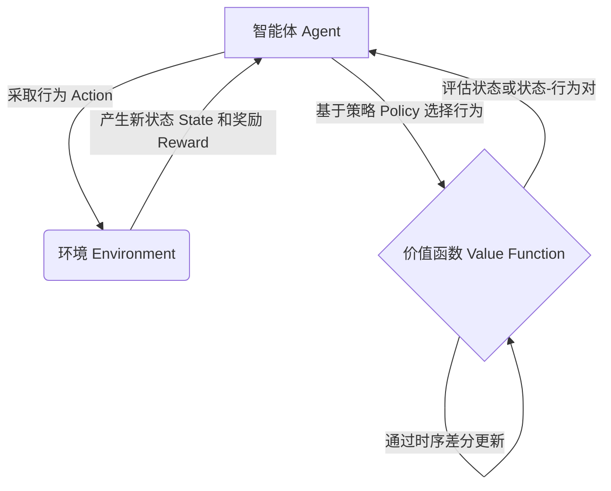

好的，我会按照您的要求，以"SARSA - 原理与代码实例讲解"为主题，撰写一篇专业的技术博客文章。文章将遵循您提供的结构模板，包含背景介绍、核心概念、算法原理、数学模型、代码实例、应用场景、资源推荐、总结和附录等部分。我会努力使用逻辑清晰、结构紧凑、语言专业易懂的方式，深入探讨 SARSA 算法的原理和实现细节，并配以代码示例、数学公式推导和 Mermaid 流程图，力求为读者提供有价值的技术内容。同时，我会严格遵守您提出的约束条件,包括字数要求、格式要求、完整性要求等。以下是正文部分:

# SARSA - 原理与代码实例讲解

## 1. 背景介绍

### 1.1 问题的由来

在人工智能和机器学习领域中,强化学习(Reinforcement Learning)是一种重要的学习范式。它旨在让智能体(Agent)通过与环境(Environment)的交互,学习如何选择行为(Action)以最大化累积回报(Cumulative Reward)。强化学习算法广泛应用于机器人控制、游戏AI、自动驾驶等领域。

SARSA(State-Action-Reward-State-Action)是强化学习中的一种重要的时序差分(Temporal Difference)算法,它属于基于策略(Policy-based)的算法类型。与 Q-Learning 算法不同,SARSA 直接学习状态-行为对(State-Action Pair)的价值函数(Value Function),并基于此来更新策略。

### 1.2 研究现状

强化学习算法的研究和应用在近年来得到了快速发展,算法性能不断提升,应用领域也在不断扩大。作为经典的时序差分算法之一,SARSA 算法备受关注,在理论和实践中都有广泛的研究。

目前,SARSA 算法的研究主要集中在以下几个方面:

1. 算法收敛性和性能分析
2. 算法改进和优化(如利用函数逼近、引入深度神经网络等)
3. 算法在不同应用场景(如游戏、机器人控制等)中的实践

### 1.3 研究意义

深入理解和掌握 SARSA 算法的原理和实现细节,对于以下几个方面具有重要意义:

1. 夯实强化学习理论基础,为进一步研究和改进算法奠定基础。
2. 在实际应用中,能够正确地应用和调优 SARSA 算法,提高系统性能。
3. 为结合其他技术(如深度学习)改进 SARSA 算法提供理论和实践基础。
4. 为强化学习算法在新兴应用领域(如自动驾驶、机器人等)的应用做好准备。

### 1.4 本文结构

本文将全面介绍 SARSA 算法的理论原理、数学模型推导、算法实现细节和代码示例,以及在实际应用中的场景。具体内容安排如下:

1. 核心概念与联系
2. 核心算法原理与具体操作步骤
3. 数学模型和公式详细讲解与举例说明  
4. 项目实践:代码实例和详细解释说明
5. 实际应用场景
6. 工具和资源推荐
7. 总结:未来发展趋势与挑战
8. 附录:常见问题与解答

## 2. 核心概念与联系

在介绍 SARSA 算法之前,我们先来了解一些核心概念及它们之间的联系:

1. **智能体(Agent)**: 在环境中与之交互并作出决策的主体。
2. **环境(Environment)**: 智能体所处的外部世界,环境的状态会随着智能体的行为而发生变化。
3. **状态(State)**: 描述环境当前的具体情况。
4. **行为(Action)**: 智能体在当前状态下可以采取的行动。
5. **奖励(Reward)**: 环境给予智能体的反馈,表示行为的好坏。
6. **策略(Policy)**: 智能体在每个状态下选择行为的规则或概率分布。
7. **价值函数(Value Function)**: 评估一个状态或状态-行为对的好坏程度。
8. **时序差分(Temporal Difference)**: 一种基于对环境进行采样的强化学习方法,通过估计当前状态和下一状态的价值差异来更新价值函数。

SARSA 算法的核心思想是:基于实际经历的状态序列,直接学习状态-行为对的价值函数,并据此更新策略。这种基于采样的方法不需要建模环境的转移概率,可以有效应对复杂的决策问题。



上图展示了 SARSA 算法中智能体、环境、策略、价值函数之间的交互关系。智能体根据当前状态和策略选择行为,环境返回新状态和奖励,智能体基于实际经历的状态序列,通过时序差分方法更新状态-行为对的价值函数,并据此调整策略。

## 3. 核心算法原理 & 具体操作步骤  

### 3.1 算法原理概述

SARSA 算法的核心思想是:基于实际经历的状态序列,直接学习状态-行为对的价值函数,并据此更新策略。具体来说:

1. 在每个时刻 t,智能体处于状态 $S_t$,根据策略 $\pi$ 选择行为 $A_t$。
2. 执行行为 $A_t$ 后,环境转移到新状态 $S_{t+1}$,并返回奖励 $R_{t+1}$。
3. 智能体根据新状态 $S_{t+1}$ 和策略 $\pi$ 选择新的行为 $A_{t+1}$。
4. 根据实际经历的状态序列 $(S_t, A_t, R_{t+1}, S_{t+1}, A_{t+1})$,更新状态-行为对 $(S_t, A_t)$ 的价值函数估计 $Q(S_t, A_t)$。
5. 重复上述过程,不断更新价值函数估计,直至收敛。
6. 根据收敛后的价值函数,确定最优策略。

SARSA 算法的名称来源于其更新规则中使用的五个元素:State、Action、Reward、State'、Action'。

### 3.2 算法步骤详解

SARSA 算法的伪代码如下:

```
初始化 
    对于所有的 s∈S, a∈A(s), 令 Q(s,a) = 0  // 初始化 Q(s,a) 
    对于所有的 s∈S, 令 π(s) = a       // 初始化策略为任意策略
    
repeat:
    初始化 s                         // 初始状态
    repeat for each episode:         // 对每个序列
        选择 a 来自 s 使用行为分布 π(s,.)
        repeat for each step:        // 对每个步骤
            执行 a, 观察 r, s'      
            选择 a' 来自 s' 使用行为分布 π(s',.)
            Q(s,a) ← Q(s,a) + α[r + γQ(s',a') - Q(s,a)]
            s ← s'
            a ← a'
        until s 是终止状态
    until 满足停止条件
```

其中:

- $\alpha$ 为学习率,控制学习的速度。
- $\gamma$ 为折现因子,控制对未来奖励的权重。
- $Q(s,a)$ 为状态-行为对 $(s,a)$ 的价值函数估计。
- $\pi(s,a)$ 为在状态 $s$ 下选择行为 $a$ 的概率。

算法的关键步骤是价值函数的更新:

$$Q(s_t, a_t) \leftarrow Q(s_t, a_t) + \alpha\left[r_{t+1} + \gamma Q(s_{t+1}, a_{t+1}) - Q(s_t, a_t)\right]$$

这一更新规则体现了时序差分的思想:用实际获得的奖励 $r_{t+1}$ 加上对未来状态-行为对价值的估计 $\gamma Q(s_{t+1}, a_{t+1})$ 来更正当前状态-行为对价值的估计 $Q(s_t, a_t)$。通过不断的互动和更新,价值函数最终会收敛到最优解。

### 3.3 算法优缺点

**优点:**

1. **无需建模环境**:SARSA 算法是基于采样的,不需要事先了解环境的转移概率模型,可以有效应对复杂环境。
2. **在线学习**:算法可以在与环境交互的同时持续学习,无需事先给定大量训练数据。
3. **收敛性**:在满足适当条件下,SARSA 算法能够证明收敛到最优策略。
4. **简单直观**:算法原理和实现都相对简单,易于理解和上手。

**缺点:**

1. **数据高度相关**:算法依赖于与环境交互获取的数据序列,如果数据质量不佳,学习效果会受到影响。
2. **收敛慢**:在复杂问题上,SARSA 算法可能需要大量数据才能收敛,收敛速度较慢。
3. **维数灾难**:当状态空间和行为空间非常大时,算法会遇到维数灾难的问题,计算效率低下。
4. **对初值敏感**:不同的初始价值函数和策略可能导致收敛到不同的最优解。

### 3.4 算法应用领域

SARSA 算法及其变体广泛应用于以下领域:

1. **游戏AI**: 在棋类游戏、视频游戏等领域训练智能体与人或环境对抗。
2. **机器人控制**: 用于训练机器人在各种环境下执行不同的控制任务。
3. **对话系统**: 训练对话代理在与用户的交互中做出合理的响应。
4. **业务决策**: 在业务系统中应用强化学习算法优化决策过程。
5. **网络路由**: 在网络环境中寻找最优路由策略。
6. **自动驾驶**: 训练自动驾驶系统在复杂交通环境中做出正确决策。

## 4. 数学模型和公式 & 详细讲解 & 举例说明

### 4.1 数学模型构建

在介绍 SARSA 算法的数学模型之前,我们先formate一些基本概念:

- 状态空间 $\mathcal{S}$: 环境中所有可能状态的集合。
- 行为空间 $\mathcal{A}$: 智能体在每个状态下可选择的行为集合。
- 奖励函数 $\mathcal{R}: \mathcal{S} \times \mathcal{A} \rightarrow \mathbb{R}$: 定义了在状态 $s$ 执行行为 $a$ 后获得的奖励。
- 折现因子 $\gamma \in [0, 1)$: 控制对未来奖励的权重。

强化学习问题可以建模为一个马尔可夫决策过程(Markov Decision Process, MDP),定义为 $(\mathcal{S}, \mathcal{A}, \mathcal{P}, \mathcal{R}, \gamma)$, 其中:

- $\mathcal{P}$ 为状态转移概率,表示从状态 $s$ 执行行为 $a$ 后转移到状态 $s'$ 的概率 $\mathcal{P}_{ss'}^a$。

在 MDP 中,我们的目标是找到一个最优策略 $\pi^*$,使得在任意初始状态 $s_0$ 下,按照该策略 $\pi^*$ 选择行为能够最大化预期的累积折现奖励:

$$G_t = \mathbb{E}_{\pi}\left[\sum_{k=0}^{\infty}\gamma^k r_{t+k+1} | s_t = s\right]$$

其中 $G_t$ 称为状态 $s_t$ 的价值函数(State-Value Function)。

对于任意策略 $\pi$,存在一个唯一的价值函数 $V^{\pi}$ 满足:

$$V^{\pi}(s) = \mathbb{E}_{\pi}\left[G_t | s_t = s\right]$$

同理,我们可以定义状态-行为对 $(s, a)$ 的价值函数(Action-Value Function):